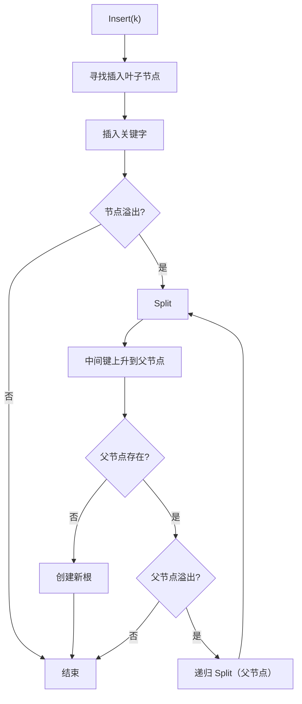
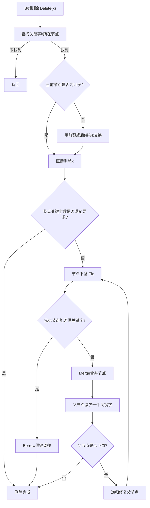
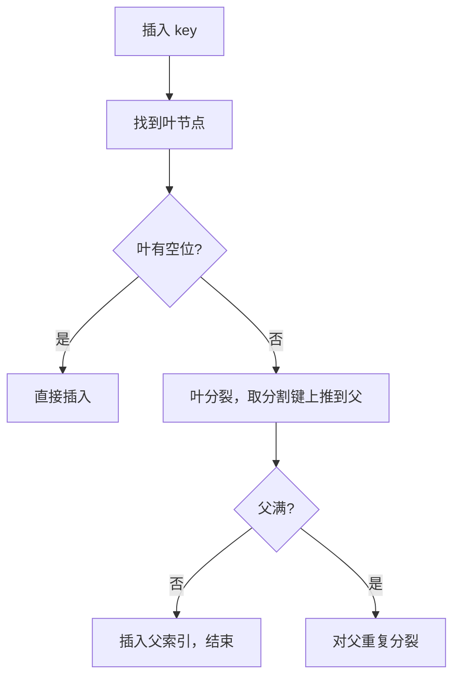

# B树

## B树的定义与性质

B树是一种自平衡的多路搜索树，有下列内容：

- 内部节点（internal node）
- 叶子节点（leaf node）
- 关键字（key）：节点中存储的值，可以不止一个

其具有以下特点：

1. 每个节点最多有 $m$ 个子节点，其中 $m$ 称为B树的**阶**。
2. 每个非根非叶子节点至少有 $\left\lceil \frac{m}{2} \right\rceil$ 个子节点。
3. 如果根节点不是叶子节点，则至少有两个子节点。
4. 有$k$个子节点的内部节点包含$k-1$个关键字。
5. 每个节点至多有 $m-1$ 个关键字。
6. 关键字按中序遍历是有序的。
7. 所有叶子节点都在同一层上。

> [!tip]
> 2-3 树与 2-3-4 树是 B 树在特殊阶数（m=3, 4）下的等价表述

## B树的操作

### 插入（Insertion）

- 步骤：
  1.  在根到叶子的路径上查找要插入的叶节点（和查找操作相同）
  2.  如果目标叶节点有空位（关键字数 $< m-1$），直接插入并按键序排序，完成
  3.  如果叶节点已满（$m-1$ 个关键字），先将新键与原有键合并成 $m$ 个键，然后把中位数（第 $\left\lceil \frac{m}{2} \right\rceil$ 个）上推到父节点，叶节点被分裂为左右两个节点
  4.  若父节点也满，则重复分裂并上推，最终可能导致根分裂，从而树高增加 $1$

- 关键点：分裂时只把中位上推；左右节点分别保留小于中位与大于中位的键（对于偶数 m，遵循实现约定）。
- 复杂度：查找叶节点 O(h)；分裂次数 ≤ h；整体时间 O(h)（h = 树高 = Θ(log_n N)）。

### 删除（Deletion）

- 目标：删除关键字并维持 B 树的平衡与每节点关键字数下界。
- 高级步骤：
  1.  在树中查找到欲删除的关键字 K（若不存在，返回）。
  2.  若 K 在叶节点中直接删除；若在内部节点中，用其前驱（或后继）替换 K，然后在叶节点删除该替代键（这样把删除操作下移到叶）。
  3.  删除后若叶节点仍满足最小度，则结束；否则需修复：
      - 尝试从相邻兄弟借一个键（即通过父节点移动一个键下来，同时把兄弟的一个键上移到父），借用后节点恢复。
      - 若相邻兄弟也只有最小键数，则与兄弟合并：把父节点相应的分隔键下降，合并两个节点为一个，父节点关键字减少 1；如果父节点因此低于最小度，继续向上修复，可能导致根节点键数为 0，树高度减 1。

- 关键点：删除比插入更复杂，需要考虑借和合并两种修复策略；常用书中记 t = ⌈m/2⌉ 表示最小度。
- 复杂度：O(h)，与插入相同。

# B+树

B+ 树是在 B 树基础上的变种，常用于数据库和文件系统，考研中也常出现其与 B 树的比较题。下面给出结构、增删改查与应用。

## B+ 树的结构要点

- 所有实际数据（记录或指向记录的指针）都存储在叶子节点，内部节点只存索引键（不保存完整记录）。
- 叶子节点通常通过链表（或顺序指针）串联，方便范围查询。
- 内部节点可能包含重复键以指导搜索；叶节点保存完整键与数据指针。

## B+ 树的查找（Search）

- 在内部节点按键向下直到叶节点，叶节点中进行查找以定位记录。
- 与 B 树查找复杂度同为 O(h)；但 B+ 树叶节点密度更高，I/O 效率优于 B 树（在外存场景更明显）。

## B+ 树的插入（Insertion）

- 与 B 树类似，但分裂操作仅在叶子层把键分裂并把上位索引插入父节点；内部节点的分裂仅涉及索引键。

## B+ 树的删除（Deletion）

- 删除时若叶节点键数低于最小值，采取借或合并策略；但由于内部节点只保存索引，删除后可能需要更新父索引键（用叶中新的最小键替换）。
- 叶层合并比 B 树更频繁，但链表支持范围查询时性能依然优良。

## B+ 树的优劣与考研要点

- 优点：叶链表支持高效范围查询；内部节点仅为索引使得每一页能容纳更多索引，提高 I/O 效率，适合外存/数据库场景。
- 考研要点：能解释 B+ 树为何对范围查询友好，能手画叶节点链表与分裂示意图，并比较 B 树与 B+ 树的差异（数据是否保存在内部节点、范围查询、I/O 性能）。

## 应用举例

- 数据库索引（如 MySQL 的 InnoDB 使用 B+ 树作为聚簇索引）
- 文件系统目录索引与块分配表
- 外部排序后的索引构建
