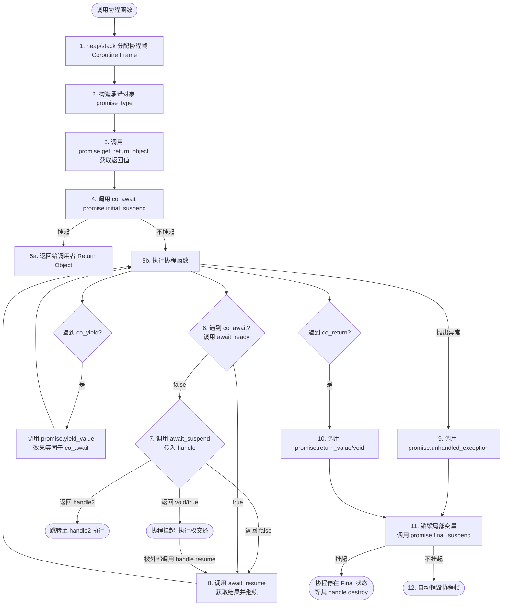

# 协程的概念

协程（Coroutine）是一种轻量级的微线程，可以在**单线程**中实现多任务切换。它允许函数在执行过程中暂停，并在需要时恢复执行，从而实现异步编程和并发处理。

## 与线程、进程的区别

- 进程：程序资源管理的最小单位。进程是程序的执行过程，拥有独立的内存空间和系统资源。
  - 程序：保存在磁盘上的可执行文件，包含代码和数据。
  - 系统资源：进程管理着CPU时间、内存、文件等资源。进程间资源不共享，需要进程间通信。
- 线程：操作系统调度的最小单位。线程是进程中的一个执行流，多个线程共享同一进程的内存空间和资源。线程是资源调度的最小单位。
  - 用户级线程：由用户程序管理的线程
    - 优点：切换快，开销小，数量不受系统资源限制
    - 缺点：无法利用多核CPU，线程阻塞会导致整个进程阻塞
  - 内核级线程：由操作系统管理的线程
    - 优点：可以利用多核CPU，线程阻塞不会影响其他线程
    - 缺点：切换慢，开销大，数量受限于系统资源
- 协程：用户级的调度单位，运行在单线程中，通过程序控制切换，开销最小。协程之间的切换由程序控制，不需要操作系统的干预。

## 在高并发场景中的优势

高并发场景中，系统需要处理大量的请求和任务，且任务常常需要等待其他前置的完成才能继续执行。多线程往往需要频繁挂起线程与切换。

| 协程             | 线程               |
| ---------------- | ------------------ |
| 轻量级，切换快   | 重量级，切换慢     |
| 资源占用少       | 资源占用多         |
| 易于编写异步代码 | 需要复杂的同步机制 |

## 协程的实现原理

协程的实现原理基于**状态机**，每个协程都有一个状态，表示当前执行的位置。当协程被挂起时，它会保存当前的状态和上下文信息，以便在恢复时继续执行。

## 有栈协程与无栈协程

- 有栈协程：每个协程都有独立的栈空间，适用于需要大量局部变量和递归调用的场景。
- 无栈协程：所有协程共享同一栈空间，适用于简单的任务和大量协程的场景。

### 协程的生命周期

1. **创建**：协程被创建并进入就绪状态。
2. **运行**：协程被调度器选中执行，进入运行状态。
3. **挂起**：协程执行过程中遇到需要等待的操作时，可以选择挂起，进入挂起状态。
4. **恢复**：当等待的操作完成后，协程可以被恢复，继续执行。
5. **结束**：协程执行完成后进入结束状态，释放资源。

# C++20中的协程

C++20引入了原生的协程支持，使得编写异步代码变得更加简单和高效。

## 协程的基本语法

### 关键字

C++20中的协程的核心是`co_await`、`co_yield`和`co_return`三个关键字。
这三个关键字在函数中使用时，函数会被编译器识别为协程，并生成相应的状态机代码。

- `co_await`：用于等待一个等待体对象。当协程执行到`co_await`时，如果等待的操作尚未完成，协程会被挂起，等待操作完成后再恢复执行。
- `co_yield`：用于生成一个值并暂停协程的执行。每次调用`co_yield`都会返回一个值，并暂停协程，等待下一次恢复时继续执行。
- `co_return`：用于返回一个值并结束协程的执行。当协程执行到`co_return`时，协程会结束，并返回指定的值。

### 承诺对象

承诺对象（Promise Object）是协程的核心组件之一，它负责管理协程的状态和结果。每个协程都有一个对应的承诺对象，用于存储协程的返回值、异常信息以及协程的状态。其中，承诺对象需要实现以下几个成员函数：

#### `get_return_object()`

- 作用：生成并返回一个对象，表示协程的结果。这个对象通常是一个包装了协程状态和结果的类型。
- 返回类型：可以是任意类型，通常是一个自定义的类型，用于封装协程的结果和状态。

#### `initial_suspend()`

- 作用：定义协程在开始执行前的挂起行为。返回一个可等待对象，表示协程在创建后是否立即挂起。
- 返回类型：必须返回一个满足可等待对象要求的类型，通常是
  - `std::suspend_always`：表示协程在创建后立即挂起。
  - `std::suspend_never`：表示协程在创建后立即开始执行。

#### `return_void()` / `return_value(T value)`

- 作用：定义协程的返回行为。当协程执行到`co_return`时，会调用这个函数来处理返回值。
- 返回值：
  - `return_void()`：表示协程没有返回值，直接结束。
  - `return_value(T value)`：表示协程有返回值，接受一个参数，表示返回的值。

#### `yield_value(T value)`

- 作用：定义协程在执行`co_yield`时的行为。当协程执行到`co_yield`时，会调用这个函数来处理生成的值。
- 返回类型:
  - `std::suspend_alawys`：挂起协程
  - `std::suspend_never`：不挂起

#### `final_suspend`

- 作用：定义协程结束的行为。
- 返回类型：必须返回一个满足可等待对象要求的类型，通常是
  - `std::suspend_always`：表示协程在结束时挂起，等待外部调用者来清理资源。
  - `std::suspend_never`：表示协程在结束时立即清理资源。

#### `unhandled_exception()`

- 作用：定义协程在执行过程中抛出异常时的处理行为。当协程执行过程中发生未处理的异常时，会调用这个函数来处理异常。

### 协程句柄

协程句柄 `std::coroutine_handle<promise_type>` 是一个类似于指针的轻量级对象，它是**外部代码与协程内部状态机沟通的唯一桥梁**。每个协程函数都会绑定一个协程句柄，通过这个句柄，外部代码可以控制协程的执行、访问协程的状态和结果。

通过句柄，你可以：

1. **控制执行**：调用 `resume()` 手动恢复协程，或调用 `destroy()` 销毁协程释放内存。
2. **访问承诺对象**：通过 `handle.promise()` 获取对应的 `promise_type` 实例，从而读写协程的返回值或结果。
3. **双向转换**：
   - `from_promise(promise)`：通过承诺对象获取句柄（常用于 `get_return_object`）。
   - `address()` / `from_address(ptr)`：将句柄转化为原始指针，方便在 C 风格的 API（如网络回调）中传递，然后再转回句柄恢复执行。

> **核心理解**：协程函数在挂起时，所有的局部变量和执行状态都保存在堆上的“协程帧”里。句柄就是指向这个帧的“遥控器”。

### 等待体对象

等待体对象（Awaitable Object）是协程中用于表示等待操作的对象。当协程执行到`co_await`时，等待体对象会被调用来检查等待操作的状态，并决定是否挂起协程。等待体对象需要实现以下函数：

#### `await_ready()`

- 作用：用于检查等待操作是否已经完成。
- 返回值`->bool`：
  - `true`：表示等待操作已经完成，协程可以继续执行；
  - `false`：表示等待操作尚未完成，协程需要挂起。

#### `await_suspend(std::coroutine_handle<>)`

- 作用：用于挂起协程。当等待操作尚未完成时，调用这个函数来挂起协程，并传入**当前协程的句柄**。
- **句柄的作用**：它是你在挂起期间唯一的“恢复凭据”。你需要负责将这个句柄保存起来（例如交给一个后台线程或注册到一个事件循环中）。当异步操作完成时，通过调用这个句柄的 `.resume()`，协程才能从挂起点继续往下执行。
- 返回类型:
  - `void`：表示挂起协程，不需要返回值。
  - `bool`：
    - `true`：表示协程已经被挂起；
    - `false`：表示协程没有被挂起，可以继续执行。

#### `await_resume()`

- 作用：用于恢复协程。当等待操作完成后，调用这个函数来恢复协程，并返回等待操作的结果。
- 返回类型：可以是任意类型，通常是等待操作的结果类型。

## 协程的具体结构

一个完整的协程生命周期通常涉及以下几个部分：

1. **协程函数**：包含 `co_await`、`co_yield` 或 `co_return` 的函数。
2. **返回类型（Task/Future）**：协程函数的返回值类型，它通常被称为 **Coroutine Wrapper**（协程包装器）或 **Return Object**。
3. **承诺对象 (Promise Object)**：在返回类型内部定义，负责管理协程的状态、返回值以及异常。
4. **等待体对象 (Awaitable Object)**：定义了被 `co_await` 的对象的行为。

### 协程包装

为了方便使用，我们需要定义一个符合 C++ 协程规范的类型作为函数的返回值。这个类型不仅是给调用者的“凭据”，还通过其内部的 `promise_type` 与编译器进行交互。

```cpp
template<typename T>
class Task {
public:
    struct promise_type {
        T value;
        // 1. 构造返回对象
        Task get_return_object() {
            return Task{std::coroutine_handle<promise_type>::from_promise(*this)};
        }
        // 2. 初始挂起行为
        std::suspend_never initial_suspend() { return {}; }
        // 3. 生成值并挂起
        std::suspend_always yield_value(T v) {
            value = v;
            return {};
        }
        // 4. 结束时挂起等待外部清理
        std::suspend_never final_suspend() noexcept { return {}; }
        // 5. 处理返回值
        void return_value(T v) { value = v; }
        // 6. 异常处理
        void unhandled_exception() { std::terminate(); }
    };

    using handle_type = std::coroutine_handle<promise_type>;
    Task(handle_type h) : handle(h) {}
    //~Task() { if (handle) handle.destroy(); }
    // 若final_suspend返回suspend_always，则需要外部调用者（RAII）来销毁协程，否则会内存泄漏
    // 但如果final_suspend返回suspend_never，则协程结束时会自动销毁，不需要外部调用者来销毁
    // 获取协程结果
    T get() { return handle.promise().value; }

private:
    handle_type handle;
};
```

可以看出，协程的自定义程度非常高~~也相当麻烦~~。我们可以根据需要定义不同的返回类型和承诺对象来实现各种功能，比如支持异步操作、生成器等。

## 运行时逻辑

当一个协程函数被调用时，其背后涉及编译器生成的复杂状态机。以下是 C++20 协程运行时的全流程逻辑：



### 全流程关键细节：

1.  **协程帧 (Coroutine Frame)**：存储了承诺对象、参数副本、挂起位置以及局部变量。它通常在堆上分配。
2.  **初始状态**：`get_return_object` 必须在协程运行前调用，以确保调用者拿到“票据”。
3.  **挂起三部曲**：`await_ready` (是否需要挂起) -> `await_suspend` (挂起时的额外操作) -> `await_resume` (恢复时的返回值)。
4.  **最终状态 (Final Suspend)**：如果 `final_suspend` 挂起，协程不会自动释放内存，调用者必须手动调用 `handle.destroy()`。防止了在协程结束后访问 `promise` 数据导致的 UAF（释放后使用）。

## 实战示例：简单的异步 HTTP 读取器

为了展示协程在异步 I/O 中的真正威力，我们将实现一个简单的异步读取器。它通过 `std::future` 和线程模拟异步 I/O 操作，使得网络请求看起来像同步操作，但不会阻塞主线程。

```cpp
#include <iostream>
#include <coroutine>
#include <string>
#include <thread>
#include <chrono>

// --- 1. 基础协程包装器 Task ---
struct Task {
    struct promise_type {
        Task get_return_object() {
            return Task{std::coroutine_handle<promise_type>::from_promise(*this)};
        }
        std::suspend_never initial_suspend() { return {}; }
        std::suspend_never final_suspend() noexcept { return {}; }
        void return_void() {}
        void unhandled_exception() { std::terminate(); }
    };
    std::coroutine_handle<promise_type> handle;
    Task(std::coroutine_handle<promise_type> h) : handle(h) {}
};

// --- 2. 模拟异步网络读取的可等待对象 ---
struct AsyncFetch {
    std::string url;
    std::string response;

    bool await_ready() { return false; } // 总是挂起，模拟耗时操作

    void await_suspend(std::coroutine_handle<> h) {
        // 模拟一个异步后台线程在读取数据
        std::thread([this, h] {
            std::this_thread::sleep_for(std::chrono::seconds(2));
            this->response = "HTTP/1.1 200 OK\r\nContent from " + url;
            h.resume(); // 数据准备好，恢复协程执行
        }).detach();
    }

    std::string await_resume() {
        return response; // 恢复时返回读取到的内容
    }
};

// --- 3. 业务逻辑：异步变同步 ---
Task download_page(std::string url) {
    std::cout << "[Client] Fetching: " << url << "..." << std::endl;

    // 关键点：这一行会挂起当前协程，但不阻塞线程
    std::string content = co_await AsyncFetch{url};

    std::cout << "[Client] Got response: " << content << std::endl;
    co_return;
}

// --- 4. 主程序驱动 ---
int main() {
    std::cout << "[Main] Starting coroutine..." << std::endl;
    download_page("https://example.com");

    std::cout << "[Main] I can do other things here!" << std::endl;
    for (int i = 0; i < 5; ++i) {
        std::this_thread::sleep_for(std::chrono::milliseconds(500));
        std::cout << "[Main] Polling... " << i << std::endl;
    }

    std::cout << "[Main] Execution finished." << std::endl;
    return 0;
}
```

### 为什么选择这个样例？

1.  **异步 IO 特性**：展示了 `co_await` 如何在等待“网络数据”返回时，让主线程能够继续执行 `Polling...` 逻辑。
2.  **开发效率**：传统的写法需要传递 `std::function` 作为回调，而这里直接使用 `std::string content = co_await ...` 这种符合人类直觉的写法。

## 总结

C++20 协程通过将**回调**转化为**顺序执行的代码**，极大地提高了异步程序的开发效率。虽然配置 `promise_type` 和 `Task` 包装器初看很繁琐，但一旦基础设施搭建完毕，业务逻辑将变得非常清晰。
