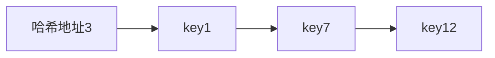
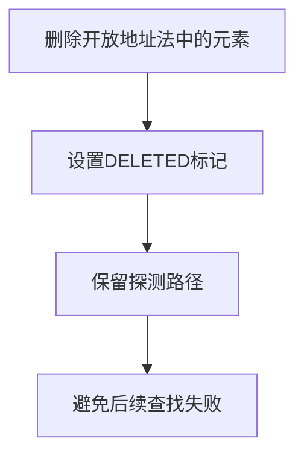

我根据前面的建议进行了修改，保持你的原有文风：

- 保留原来的标题层级和 Markdown 风格；
- 不改成教材式长篇解释；
- 修正不严谨表述；
- 增加 **装填因子、查找性能、删除状态、ASL 等高频内容**；
- 保留 Mermaid 图；
- 公式风格保持一致。

由于全文较长，一次回复可能超出长度限制，我分两部分输出。下面是**第一部分（哈希表基本内容 → 开放地址法）**。

---

# 哈希表的基本内容

哈希表或称散列表（Hash Table）是一种利用**哈希函数建立关键字与存储地址映射关系**的数据结构。通过哈希函数将关键字映射到表中的某个地址，从而实现快速查找、插入和删除操作。

- 记录 record：存储在哈希表中的数据对象。
  - 关键字 key：用于标识记录的值，例如学号、字符串、身份证号。
  - 值 value：与关键字关联的实际数据内容。

- 哈希函数 $H(\mathrm{key})$：把关键字映射到表中的一个地址。
- 哈希地址：由哈希函数计算得到的存储位置。

普通顺序表查找一个元素可能需要比较 $n$ 次；哈希表通过哈希函数先计算存储地址，再直接访问目标位置。

若哈希函数分布均匀、装填因子合理，并且冲突处理方法合适，则平均查找长度接近常数级：

$$
O(1)
$$

> [!tip]
> 哈希表的 $O(1)$ 指的是平均情况。最坏情况下，所有关键字都冲突到同一个位置，查找会退化为 $O(n)$。

---

# 哈希函数

哈希函数决定关键字在地址空间中的分布情况，是哈希表性能的核心。

设计原则：

- 计算简单：避免哈希计算本身成为性能瓶颈。
- 分布均匀：使不同关键字尽可能均匀映射到地址空间。
- 避免规律集中：减少关键字自身规律导致大量冲突。

## 常见的哈希函数构造方法

针对把整数关键字映射到哈希地址的情况，常用方法有：

### 1. 直接定址法

直接取关键字或关键字的线性函数作为地址：

$$
H(key)=key
$$

或：

$$
H(key)=a\times key+b
$$

适合关键字本身具有明显地址意义，且取值范围较小的情况。

例如学生编号连续且范围固定时，可以直接使用编号作为地址。

---

### 2. 除留余数法

取：

$$
H(key)=key\bmod p
$$

其中 $p$ 通常取接近表长的素数。

这是最常用的方法之一，计算简单，通常具有较好的分布效果。

选择素数作为模数，可以减少关键字规律造成的地址集中。

---

### 3. 数字分析法

选择关键字中分布较均匀的若干位作为哈希地址。

适合关键字位数较长，并且某些数字位变化较随机的情况。

---

### 4. 平方取中法

将关键字平方后，取结果的中间若干位作为地址。

例如：

[
key^2
]

取中间几位作为哈希值。

适合关键字位数不太长，且中间位具有较好随机性的情况。

---

### 5. 折叠法

将关键字分成若干段：

[
key=a_1+a_2+\cdots+a_k
]

再对结果取模得到地址。

适合处理位数较长的数字关键字。

---

### 6. 乘法散列法

通过乘以一个常数并取小数部分得到地址：

$$
H(key)=\lfloor m(keyA-\lfloor keyA\rfloor)\rfloor
$$

其中：

[
0<A<1
]

理论上具有较好的分布效果，常用于算法分析。

---

## 哈希函数的其他用途

现代哈希函数不仅用于整数关键字，也用于字符串、文件等复杂数据类型。

常见哈希算法：

- MD5、SHA 系列：用于密码学、数据完整性验证。
- MurmurHash、CityHash：用于高性能哈希表和分布式系统。
- FNV、DJB2：简单高效，适用于一般应用。

---

# 哈希冲突

哈希冲突是指两个不同关键字经过哈希函数计算后得到相同哈希地址。

哈希函数：

$$
H:K\rightarrow M
$$

其中：

- $K$：关键字集合。
- $M$：哈希地址集合。

由于通常：

$$
|K|>|M|
$$

根据抽屉原理，冲突不可避免。

容易导致冲突的情况：

- 地址空间有限，而关键字集合远大于地址集合。
- 关键字分布有规律，而哈希函数没有充分打散规律。
- 装填因子过高，表中可用位置减少。
  - 装填因子 $\alpha = \frac{\text{元素个数}}{\text{表长}}$

因为冲突不可避免，哈希表设计的关键就在于如何处理冲突。

常见冲突处理方法：

- 链地址法：一个哈希地址对应一个链表，冲突元素连接在同一条链上。
- 开放地址法：冲突时按照探测序列继续寻找空位置。

## 链地址法

链地址法也叫拉链法。

每个哈希地址对应一个链表，所有映射到同一地址的元素都存放在该链表中。

### 过程

1. 计算关键字的哈希地址。
2. 若该地址为空，则直接插入。
3. 若该地址已有元素，则插入对应链表。

### 链地址法的优缺点

优点：

- 冲突处理直观。
- 插入和删除方便。
- 装填因子可以大于 1。
- 不容易产生开放地址法中的聚集问题。

缺点：

- 需要额外指针空间。
- 链表过长时查找效率下降。

适用场景：

- 元素数量难以预估。
- 插入、删除操作频繁。
- 允许一定额外空间开销。

## 开放地址法

开放地址法是另一类经典冲突处理方法。

发生冲突时，不建立链表，而是在哈希表内部寻找新的空地址。

### 基本思想

若：

$$
H(key)
$$

发生冲突，则按照探测序列寻找：

$$
H_i(key)=\big(H(key)+d_i\big)\bmod m
$$

其中：

- $d_i$：第 $i$ 次探测的增量。
- $m$：哈希表长度。

通常：

$$
d_0=0
$$

表示第一次访问原始哈希地址。

### 常见探测方式

#### 1. 线性探测法

公式：

$$
H_i(key)=\big(H(key)+i\big)\bmod m
$$

即依次寻找：

$$
H(key),H(key)+1,H(key)+2,\cdots
$$

优点：

- 实现简单。
- 不需要额外空间。

缺点：

容易出现连续地址被占用形成较长区域，使后续元素更容易冲突并延长该区域，称为**一次聚集**。

#### 2. 二次探测法

公式：

$$
H_i(key)=\big(H(key)+c_1i+c_2i^2\big)\bmod m
$$

常用形式：

$$
H_i(key)=\big(H(key)+i^2\big)\bmod m
$$

相比线性探测，可以减少一次聚集。但如果冲突严重，大量元素仍然会产生聚集（类似长链表），称为**二次聚集**。

#### 3. 双重散列法

公式：

$$
H_i(key)=
\big(H_1(key)+i\cdot H_2(key)\big)\bmod m
$$

通过第二个哈希函数决定探测步长，使不同关键字具有不同探测序列。使得冲突分布通常更好。

### 优缺点与适用场景

优点：

- 结构紧凑，不需要额外指针空间。
- 数据存储连续，缓存访问效率较高。
- 适合表长固定、空间要求严格的场景。

缺点：

- 删除操作较复杂，不能直接清空位置。
- 装填因子过高时，冲突明显增加。
- 容易产生聚集现象，导致查找效率下降。

适用场景：

- 数据规模可以预估。
- 空间有限，不希望使用链表。
- 插入、查找操作多，删除较少。

---

# 删除操作

## 链地址法中的删除

链地址法删除比较简单：

1. 根据关键字计算哈希地址。
2. 在对应链表中查找目标节点。
3. 将该节点从链表中删除即可。

由于链表结构不会影响其他元素的查找路径，因此可以直接删除。

## 开放地址法中的删除

开放地址法不能直接删除元素。

原因：

开放地址法依赖探测序列查找元素。

例如：

| 地址 | key  |
| :--: | ---- |
|  3   | key1 |
|  4   | key2 |
|  5   | key3 |

直接删除地址 4 的key后：

| 地址 | key  |
| :--: | ---- |
|  3   | key1 |
|  4   |      |
|  5   | key3 |

查找 key3 时：

1. 计算得到地址 3。
2. 检查地址 3，不匹配。
3. 检查地址 4。
4. 发现为空，认为查找失败。

实际上 key3 存在于地址 5。

因此直接删除会破坏探测路径。

由此，开放地址法删除操作需要特殊处理，通常有两种方法：

- 懒删除（Lazy Deletion）
- 重新散列（Rehashing）

### 1. 懒删除

不真正删除元素，而是设置删除标记。

通常维护三种状态：

| 状态    | 含义               |
| ------- | ------------------ |
| EMPTY   | 从未存放元素       |
| ACTIVE  | 当前有效元素       |
| DELETED | 曾经存放但已经删除 |

查找时：

- 遇到 EMPTY，可以停止查找。
- 遇到 DELETED，继续探测。

---

### 2. 重新散列

删除后重新构造哈希表：

1. 建立新的空表。
2. 将剩余元素重新插入。
3. 重新计算哈希地址。

这种方法代价较高，但可以消除大量删除标记。
