# 1 图的形式化定义

## 1.1 无向图与有向图

一个**无向图**（undirected graph）是一个二元组 $G = (V, E)$，其中：

- $V$ 是一个有限非空集合，称为**顶点集**（vertex set），元素称为顶点（vertex）；
- $E$ 是 $V$ 上无序对的集合，称为**边集**（edge set）。对于 $\{u, v\} \in E$，称 $u$ 与 $v$ **邻接**（adjacent），边 $\{u,v\}$ 与顶点 $u, v$ **关联**（incident）。

一个**有向图**（directed graph, digraph）同样是 $G=(V,E)$，但 $E$ 是 $V$ 上**有序对**的集合。$(u,v) \in E$ 表示一条从 $u$ 指向 $v$ 的**弧**（arc），$u$ 为弧尾，$v$ 为弧头。

**约定**：若无特别说明，本笔记的图均为**有限图**（$|V|, |E|$ 均有限）。记 $n = |V|$，$m = |E|$。

### 无向图与有向图示例

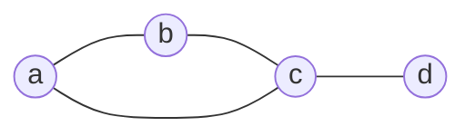

这个图是无向图。边只表示“连接关系”，不区分方向。

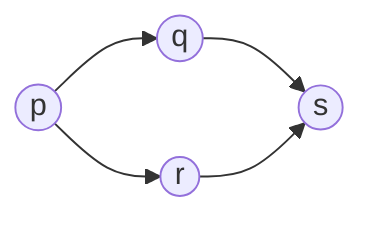

这个图是有向图。弧的方向会影响可达性，例如 $p$ 能到 $q$，但不一定能从 $q$ 回到 $p$。

## 1.2 简单图与多重图

- 若边 $\{v, v\}$（即两端点相同）存在，称为**自环**（loop/self-loop）；
- 若两个顶点之间存在多条边，称为**平行边**（multi-edge/parallel edge）。

不含自环、不含平行边的图称为**简单图**（simple graph）；否则称为**多重图**（multigraph）。

**注**：国内教材中的"图"默认指简单图，本笔记后续除特别说明外也默认讨论简单图，仅在需要区分十字链表/邻接多重表等存储结构时提及多重边处理。

### 简单图、多重图与自环示例

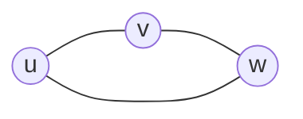

这是一个简单图的例子，没有自环，也没有平行边。

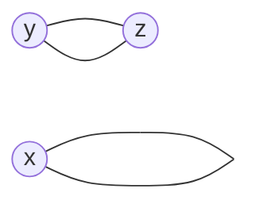

上图中 $x$ 到自身有一条自环，$y$ 与 $z$ 之间有两条边，因此是多重图。

## 1.3 度

对无向图中顶点 $v$，其**度**（degree）$d(v)$ 定义为与 $v$ 关联的边数（自环计 2 次）。

对有向图中顶点 $v$：

- **出度** $d^+(v)$：以 $v$ 为起点的弧数；
- **入度** $d^-(v)$：以 $v$ 为终点的弧数；
- $d(v) = d^+(v) + d^-(v)$。

**定理 1.1（握手定理，Handshaking Lemma）**
对无向图 $G=(V,E)$，有
$$\sum_{v \in V} d(v) = 2|E|$$

_证明_：每条边恰好贡献 2 次度数——两个端点各计一次（自环两次计入同一顶点）。对边集求和即得。$\blacksquare$

**推论 1.1**：任意图中度为奇数的顶点个数为偶数。

_证明_：设奇度顶点集合为 $O$，偶度顶点集合为 $E_v$。由定理 1.1，$\sum_{v \in O} d(v) + \sum_{v \in E_v} d(v) = 2|E|$ 为偶数；而 $\sum_{v\in E_v} d(v)$ 显然为偶数，故 $\sum_{v \in O} d(v)$ 为偶数。若 $|O|$ 为奇数，则奇数个奇数之和为奇数，矛盾。故 $|O|$ 为偶数。$\blacksquare$

对有向图，类似地有 $\sum_v d^+(v) = \sum_v d^-(v) = |E|$。

## 1.4 特殊图

- **完全图**（complete graph）$K_n$：简单无向图中任意两顶点均邻接，边数 $= \binom{n}{2} = \dfrac{n(n-1)}{2}$。
- **正则图**（regular graph）：所有顶点度数相同的图；度数为 $k$ 时称 $k$-正则图。
- **有向完全图**：任意两顶点间均有方向相反的两条弧，边数 $= n(n-1)$。
- **稠密图 / 稀疏图**：$|E|$ 接近 $|V|^2$ 时称稠密（dense），$|E|$ 接近 $|V|$ 时称稀疏（sparse）。这一区分不是形式化定义，而是渐进意义下的经验分类，其意义在于**指导存储结构与算法的选择**（见第 4、6、7 节）。

---

# 2 子图与图的运算

设 $G = (V,E)$。

- $G' = (V', E')$ 是 $G$ 的**子图**（subgraph），若 $V' \subseteq V$ 且 $E' \subseteq E$（且 $E'$ 中的边端点都在 $V'$ 中）。
- 若 $V' = V$，称 $G'$ 为 $G$ 的**生成子图**（spanning subgraph）。
- 若 $E'$ 恰好包含 $E$ 中所有两端点均在 $V'$ 内的边，称 $G'$ 为 $V'$ **导出的子图**（induced subgraph），记作 $G[V']$。

**补图**（complement）$\bar{G} = (V, \bar{E})$，其中 $\bar{E} = \{\{u,v\} : u \neq v, \{u,v\} \notin E\}$，即 $G$ 与 $\bar G$ 边集互补于 $K_n$ 的边集。

---

# 3 路径、回路与连通性

国外教材通常严格区分以下三个层级的概念（国内教材常笼统地称"路径"），这一区分在后续证明最短路径算法正确性时是必要的：

- **途径**（walk）：顶点与边交替出现的序列 $v_0, e_1, v_1, e_2, \dots, e_k, v_k$，允许顶点、边重复。
- **迹**（trail）：边不重复的途径。
- **路径**（path）：顶点不重复（因而边也不重复）的途径。

对应地：

- **回路 / 闭途径**（closed walk）：$v_0 = v_k$ 的途径；
- **环游 / 闭迹**（circuit）：$v_0 = v_k$ 的迹；
- **圈 / 环**（cycle）：除 $v_0 = v_k$ 外顶点不重复的闭途径。

**408 考纲对应**："回路"一般指此处的"圈"，做题时以此为准；但需知道更精细的划分在证明中会用到，例如 Dijkstra 正确性证明中要求"最短路径必为简单路径（顶点不重复）"这一事实，就依赖于上述区分。

### 路径、回路与圈的示例

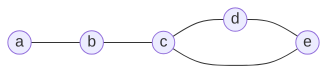

在上图中，$a-b-c-d$ 是一条路径；$c-d-e-c$ 是一个圈，因为除了起点和终点相同外，其他顶点不重复。

## 3.1 无向图的连通性

- 若 $u, v$ 之间存在路径，称 $u, v$ **连通**。
- "连通"是 $V$ 上的等价关系（自反、对称、传递），其等价类称为**连通分量**（connected component）。
- $G$ 是**连通图**当且仅当只有一个连通分量。

## 3.2 有向图的连通性

- **强连通**（strongly connected）：$u$ 到 $v$ 与 $v$ 到 $u$ 均存在有向路径。强连通也是等价关系，等价类称为**强连通分量**（SCC）。
- **弱连通**（weakly connected）：将有向边替换为无向边后连通。

**408 考纲**：连通分量、强连通分量的定义与判定（一般结合 DFS，见第 5 节）是必考点。

### 连通分量示例

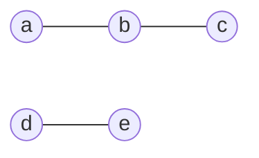

这个图有两个连通分量：$\{a,b,c\}$ 和 $\{d,e\}$。图整体不是连通图。

## 3.3 割点与桥（**拓展**）

- **割点**（cut vertex / articulation point）：删除该顶点（及其关联边）后，连通分量数增加。
- **桥**（bridge / cut edge）：删除该边后，连通分量数增加。

割点与桥可用 Tarjan 的 low-link 技术在一次 DFS（$O(V+E)$）内求出，核心思想是维护每个顶点通过**回边**（back edge，见 5.2 节）能到达的最早祖先。此内容超出 408 考纲，但与 DFS 边分类直接相关，是理解生成树本质的重要延伸。

---

# 4 图的存储结构

存储结构的选择本质上是在**空间复杂度**与**查询/遍历效率**之间权衡，这一权衡应结合图的稠密/稀疏特性判断。

# 4.1 邻接矩阵（Adjacency Matrix）

对 $n$ 个顶点的图，邻接矩阵 $A$ 是 $n \times n$ 矩阵：
$$A[i][j] = \begin{cases} 1 & (v_i, v_j) \in E \\ 0 & \text{否则} \end{cases}$$
带权图中 $A[i][j]$ 存权值，不存在的边可置 $\infty$（或特殊标记，需与 0 权值区分）。

**性质**：

- 无向图的邻接矩阵是**对称矩阵**；
- 第 $i$ 行非零元个数 = 顶点 $v_i$ 的出度（有向图）或度（无向图）；
- 空间复杂度 $O(n^2)$，与边数无关；
- **定理 4.1**：设 $A$ 为简单图的邻接矩阵，则 $A^k[i][j]$ 等于从 $v_i$ 到 $v_j$ 长度为 $k$ 的途径（walk）数目。

  _证明思路_：数学归纳法。$k=1$ 时显然成立。假设对 $k$ 成立，$A^{k+1} = A^k \cdot A$，则 $A^{k+1}[i][j] = \sum_{l} A^k[i][l] \cdot A[l][j]$，恰好枚举了"先从 $v_i$ 走长度 $k$ 到 $v_l$，再走一步到 $v_j$"的所有途径，由归纳假设即得。$\blacksquare$

  这一性质是矩阵方法判断可达性、计数路径的理论基础，408 中常以选择题形式考查。

判断两个顶点是否邻接：$O(1)$；适合**稠密图**。

### 邻接矩阵对应的图示例

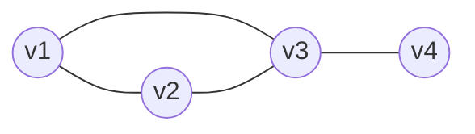

如果按顶点顺序 $v_1,v_2,v_3,v_4$ 记录，这个图就能很自然地写成邻接矩阵。矩阵中的 $1$ 和 $0$ 只表示“有边”或“无边”。

对应的邻接矩阵为：

|     | v1  | v2  | v3  | v4  |
| --- | --- | --- | --- | --- |
| v1  | 0   | 1   | 1   | 0   |
| v2  | 1   | 0   | 1   | 0   |
| v3  | 1   | 1   | 0   | 1   |
| v4  | 0   | 0   | 1   | 0   |

从这个矩阵可以直接看出：$v_1$ 与 $v_2,v_3$ 相邻，$v_4$ 只与 $v_3$ 相邻。无向图的邻接矩阵关于主对角线对称，这一点在表中也很明显。

## 4.2 邻接表（Adjacency List）

为每个顶点 $v_i$ 维护一个链表，存储所有与 $v_i$ 邻接的顶点（有向图中为以 $v_i$ 为起点的弧的终点）。

- 空间复杂度：无向图 $O(n + 2m)$，有向图 $O(n+m)$；
- 求某顶点的所有邻居：无向图 $O(d(v))$，有向图求出度邻居 $O(d^+(v))$；
- 求入度（有向图）需遍历全表，效率低——这是十字链表要解决的问题；
- 适合**稀疏图**，是 408 考纲中默认使用最频繁的结构。

## 4.3 十字链表（Orthogonal List，仅用于有向图）

为解决邻接表求入度低效的问题，十字链表为每条弧设计一个结点，同时链入"以该弧为起点"的链表与"以该弧为终点"的链表：

弧结点：`{ tailvex, headvex, hlink, tlink, info }`
其中 `hlink` 指向下一条同弧头的弧，`tlink` 指向下一条同弧尾的弧。

顶点结点：`{ data, firstin, firstout }`，分别指向以该顶点为弧头/弧尾的第一条弧。

**效果**：既能 $O(d^+(v))$ 求出边，也能 $O(d^-(v))$ 求入边，空间仍为 $O(n+m)$。

## 4.4 邻接多重表（Adjacency Multilist，仅用于无向图）

邻接表中，无向图的一条边 $\{u,v\}$ 会在 $u$、$v$ 两处的链表中各存一次，删除一条边需要修改两处，容易不一致。邻接多重表为每条边设计**一个**结点，被两个顶点共享：

边结点：`{ mark, ivex, ilink, jvex, jlink }`
其中 `ivex, jvex` 为边的两端点，`ilink` 指向下一条依附于 `ivex` 的边，`jlink` 指向下一条依附于 `jvex` 的边，`mark` 用于遍历时标记该边是否被访问过。

**适用场景**：需要频繁按边（而非按顶点）操作的场合，如求桥、求欧拉回路。

## 4.5 四种结构对比

| 结构       | 空间     | 判邻接      | 遍历出边    | 遍历入边（有向） | 图类型           |
| ---------- | -------- | ----------- | ----------- | ---------------- | ---------------- |
| 邻接矩阵   | $O(n^2)$ | $O(1)$      | $O(n)$      | $O(n)$           | 通用，适合稠密图 |
| 邻接表     | $O(n+m)$ | $O(d(v))$   | $O(d^+(v))$ | $O(m)$（需全扫） | 通用，适合稀疏图 |
| 十字链表   | $O(n+m)$ | $O(d^+(v))$ | $O(d^+(v))$ | $O(d^-(v))$      | 仅有向图         |
| 邻接多重表 | $O(n+m)$ | —           | $O(d(v))$   | —                | 仅无向图         |

---

# 5 图的遍历

图的两种基础遍历方式本质上是对"从某点出发系统性访问所有可达顶点"这一任务的两种不同**顶点访问顺序策略**，二者时间复杂度相同，但产生的**遍历树结构**与**适用算法**不同。

## 5.1 广度优先搜索（BFS）

用队列实现：访问起点 $s$，将其加入队列并标记；每次取出队首 $u$，访问其所有未标记的邻居，标记并入队，直至队列为空。

**定理 5.1**：BFS 从 $s$ 出发首次访问到顶点 $v$ 时所走过的边数，等于 $s$ 到 $v$ 的**最短路径边数**（无权图意义下）。

_证明思路_：对"层数" $k$ 归纳。设第 $k$ 层顶点集合 $L_k$ = 距 $s$ 恰好 $k$ 条边可达的顶点集合。归纳可证 BFS 第 $k$ 轮出队处理的顶点集合恰为 $L_k$：若 $v \in L_k$，则 $v$ 必有邻居 $u \in L_{k-1}$（否则 $v$ 到 $s$ 距离 $< k$，矛盾），由归纳假设 $u$ 在第 $k-1$ 轮已入队，故 $v$ 在第 $k$ 轮被发现。反向同理可证不会提前发现。$\blacksquare$

这一定理是"BFS 可用于无权图/等权图最短路"的理论依据，也是第 7 节 Dijkstra 算法的特例（当所有边权相等时，Dijkstra 退化为 BFS）。

由 BFS 过程中记录的"父指针"构成的树称为 **BFS 树**。

### BFS 树示例

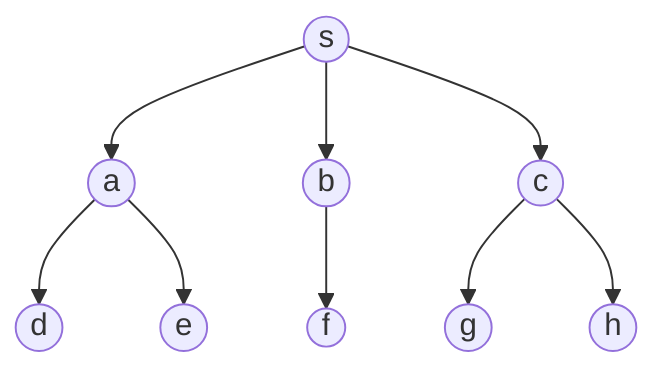

从 $s$ 出发先访问同层顶点，再向下一层扩展，所以 BFS 树更像“按层展开”的结构。

### BFS 具体步骤

以图中的顶点和边为例，若按邻接点字母顺序访问，一个典型的 BFS 访问次序是 $s,a,b,c,d,e,f,g,h$。若把父指针连起来，就得到上面的 BFS 树。

**复杂度**：邻接表 $O(n+m)$，邻接矩阵 $O(n^2)$。

## 5.2 深度优先搜索（DFS）

用递归（或显式栈）实现：访问 $u$ 后，递归访问其一个未访问的邻居，直至无法继续再回溯。

DFS 过程中，按访问先后可为每个顶点记录**发现时间** $d[v]$ 与**完成时间** $f[v]$（CLRS 的经典处理方式，国内教材较少涉及，但对理解 DFS 的结构十分关键）。

**边的分类（拓展，理解拓扑排序与环检测的基础）**：DFS 遍历有向图时，每条边 $(u,v)$ 可归为四类：

1. **树边**（tree edge）：$v$ 首次通过该边被发现；
2. **回边**（back edge）：$v$ 是 $u$ 在 DFS 树中的祖先（$u$ 正在被访问，$v$ 已被访问但未完成）；
3. **正向边**（forward edge）：$v$ 是 $u$ 的后代，但非树边；
4. **横叉边**（cross edge）：其余情况，$u,v$ 无祖先—后代关系。

**定理 5.2**：有向图 $G$ 无环（是 DAG）当且仅当 DFS 过程中不产生回边。

_证明_：（$\Rightarrow$）若产生回边 $(u,v)$，则 $v$ 是 $u$ 祖先，DFS 树上 $v \to \cdots \to u$ 路径加上边 $(u,v)$ 构成环。（$\Leftarrow$）若存在环 $C$，考虑 $C$ 中最早被 DFS 发现的顶点 $v_0$；沿环走完一圈会回到 $v_0$，而 $v_0$ 完成前其余环上顶点必已被发现且未完成（否则不能保持环的可达性回到 $v_0$ 而不经过完成的顶点），故存在指回 $v_0$ 的边，即回边。$\blacksquare$

该定理是判断有向图是否有环、以及拓扑排序是否可行（第 8 节）的理论基础。

**复杂度**：与 BFS 相同，邻接表 $O(n+m)$。

### DFS 树示例

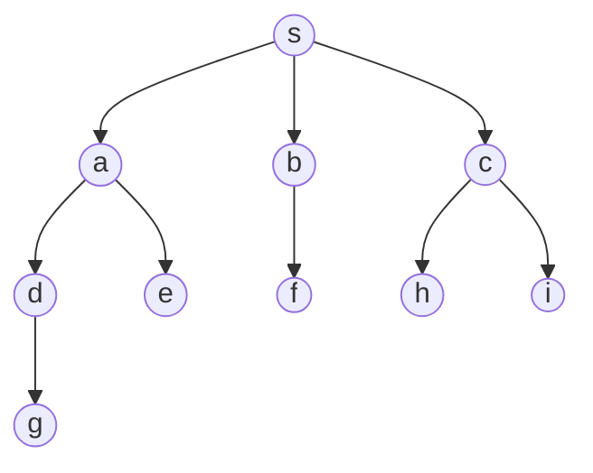

从 $s$ 开始 DFS，会先沿一条路径尽量深入，再回溯，因此 DFS 树通常比 BFS 树更“深”。

### DFS 具体顺序

以图中的结构为例，从 $s$ 开始并按邻接点字母顺序深入，一个典型的 DFS 访问次序可以写成 $s,a,d,g,e,b,f,c,h,i$。注意 DFS 的关键不是“谁先排在前面”，而是“先尽量沿一条路走到底，再回退到最近未探索的分支”。

## 5.3 遍历的应用

- **求连通分量个数**：对每个未访问顶点启动一次 BFS/DFS，启动次数即为分量数（$O(n+m)$）。
- **求有向图强连通分量**：Kosaraju 算法（两次 DFS）或 Tarjan 算法（一次 DFS + low-link，与 3.3 节割点/桥的技术同源），均可在 $O(n+m)$ 内完成（**拓展**，408 一般只要求会判断而非手写线性算法）。
- **判断二部图**：BFS/DFS 染色法，相邻顶点染不同色，出现冲突即非二部图（**拓展**）。

---

# 6 生成树与最小生成树

## 6.1 生成树

连通图 $G$ 的**生成树**（spanning tree）$T$ 是 $G$ 的生成子图且 $T$ 是树（连通无环）。

**定理 6.1**：$n$ 个顶点的树恰有 $n-1$ 条边；反之，连通图中若边数 $=n-1$，则该图是树。

_证明_：对 $n$ 归纳。$n=1$ 时 0 条边成立。设 $n-1$ 个顶点的树有 $n-2$ 条边。$n$ 个顶点的树中必存在度为 1 的叶子顶点 $v$（否则所有顶点度 $\ge 2$，由握手定理边数 $\ge n$，可证明存在环，与树无环矛盾）。删去 $v$ 得到 $n-1$ 个顶点的树，边数 $n-2$，故原树边数 $= n-1$。逆命题：连通图边数为 $n-1$，若有环则删去环上一条边仍连通，边数变为 $n-2 < n-1$，与"连通图边数 $\ge n-1$"矛盾（连通图边数 $\ge n-1$ 可由连通性归纳证明），故无环，即为树。$\blacksquare$

BFS 树与 DFS 树都是生成树的特例。

## 6.2 最小生成树（MST）问题

对带权连通图 $G=(V,E,w)$，**最小生成树**是边权和 $\sum_{e \in T} w(e)$ 最小的生成树。

MST 的经典算法（Prim、Kruskal）都是**贪心算法**，其正确性统一建立在下述性质之上——这是国外教材处理 MST 问题的核心逻辑主线，国内教材通常只给出算法步骤而略去该证明：

**定理 6.2（割性质，Cut Property）**
设 $(S, V\setminus S)$ 是 $V$ 的一个非平凡划分（**割**，cut）。若边 $e=(u,v)$（$u \in S, v \in V\setminus S$）是所有跨越该割的边中权值严格最小的，则 $e$ 属于**某个**最小生成树。

_证明_：设 $T$ 是不包含 $e$ 的任意生成树。因 $T$ 连通，$T$ 中必存在一条路径连接 $u,v$，该路径必跨越割 $(S, V\setminus S)$，设其跨越边为 $e'$。由假设 $w(e) \le w(e')$（若不等号取等则 $e$ 加入后与 $T$ 权值和相同，$T \cup \{e\} \setminus \{e'\}$ 仍是权值不增的生成树；若严格小于，则 $T \cup\{e\}\setminus\{e'\}$ 权值和严格更小，说明 $T$ 不是 MST，与"$T$ 是任意生成树"矛盾时需限定 $T$ 为 MST 讨论）。更严格地说：取 $T$ 为一棵最小生成树，令 $T' = T \cup \{e\} \setminus \{e'\}$。$T'$ 仍是生成树（加入 $e$ 产生唯一环，删去环上另一条跨越边 $e'$ 破环成树），且 $w(T') = w(T) + w(e) - w(e') \le w(T)$。因 $T$ 已是 MST，故 $w(T') = w(T)$ 且 $w(e) = w(e')$，说明 $T'$ 也是一棵 MST 且包含 $e$。$\blacksquare$

Prim 与 Kruskal 都可以看作是割性质的两种不同实现方式：

### MST 示例图

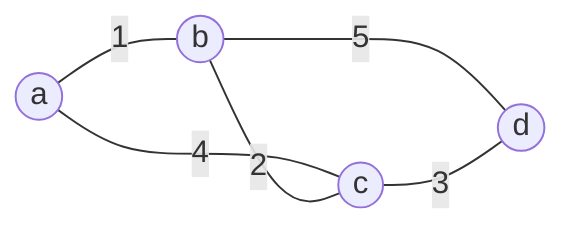

这个带权无向图中，常见的一棵最小生成树会优先选取权值较小的边，例如 $a-b$、$b-c$、$c-d$。

### Prim 具体步骤

以图中的顶点为例，若从 $a$ 开始做 Prim：

1. 初始集合 $S = \{a\}$，候选边有 $a-b(1)$、$a-c(4)$。
2. 选最小边 $a-b(1)$，加入顶点 $b$，此时 $S = \{a,b\}$。
3. 更新候选边：$b-c(2)$、$a-c(4)$、$b-d(5)$，选 $b-c(2)$。
4. 加入顶点 $c$，此时 $S = \{a,b,c\}$。
5. 更新候选边：$c-d(3)$、$b-d(5)$，选 $c-d(3)$。
6. 加入顶点 $d$，选满 $n-1=3$ 条边，得到 MST：$\{a-b, b-c, c-d\}$。

这说明 Prim 的核心是“始终从当前已连通的集合向外选最便宜的一条边”。

## 6.3 Prim 算法

维护集合 $S$（已加入生成树的顶点，初始为任意单点），每步选择割 $(S, V\setminus S)$ 中权值最小的边加入，将新顶点纳入 $S$，重复 $n-1$ 次。

**正确性**：每一步选择的边恰好满足定理 6.2 的条件（关于当前割 $(S,V\setminus S)$ 权值最小），故每步都保持"已选边集可扩展为某棵 MST"这一不变量。

**实现与复杂度**：用优先队列（小根堆）维护候选边，每次取出堆顶、更新邻接顶点的候选权值：

- 邻接矩阵实现（不用堆，直接线性扫描）：$O(n^2)$，适合稠密图；
- 邻接表 + 二叉堆：$O(m \log n)$，适合稀疏图；
- 邻接表 + 斐波那契堆：$O(m + n\log n)$（**拓展**，理论最优，408 不要求手写但需知道存在）。

## 6.4 Kruskal 算法

将所有边按权值升序排序；依次尝试加入每条边，若加入后不产生环则保留，否则丢弃；直至选出 $n-1$ 条边。

### Kruskal 具体步骤

仍以上面的带权图为例，边按权值从小到大排序为：$a-b(1)$、$b-c(2)$、$c-d(3)$、$a-c(4)$、$b-d(5)$。

1. 初始时每个顶点各自形成一个集合：$\{a\},\{b\},\{c\},\{d\}$。
2. 先看最小边 $a-b(1)$，它连接两个不同集合，不成环，加入。
3. 再看 $b-c(2)$，它也连接两个不同集合，加入。
4. 再看 $c-d(3)$，它仍连接两个不同集合，加入。
5. 此时已经选出 $n-1=3$ 条边，算法结束，MST 为 $\{a-b, b-c, c-d\}$。

这个例子说明，Kruskal 的判断标准非常直接：只要这条边连接的是两个不同连通分量，就可以考虑加入。

**正确性**：设当前已选边集为森林 $F$，考虑边 $e=(u,v)$ 是排序中下一条待判断的边。若加入不成环，说明 $u,v$ 在 $F$ 的不同连通分量中，取 $S$ = $u$ 所在分量的顶点集，则 $e$ 是当前排序下第一条跨越割 $(S, V\setminus S)$ 的边（更早的边要么已被处理为树边、要么因成环被丢弃且不跨越该割——因丢弃的边两端点都在同一分量内），因此 $e$ 是该割中权值最小的跨越边，满足定理 6.2，可安全加入。

**判环的实现**：并查集（Union-Find），带路径压缩与按秩合并，单次操作近似 $O(1)$（严格为 $O(\alpha(n))$，反阿克曼函数）。

**复杂度**：排序 $O(m \log m)$ 主导，总复杂度 $O(m \log m)$，适合稀疏图。

## 6.5 两种算法对比

|          | Prim                     | Kruskal                  |
| -------- | ------------------------ | ------------------------ |
| 贪心对象 | 顶点（逐步扩展点集 $S$） | 边（全局排序后逐条判断） |
| 数据结构 | 优先队列                 | 并查集                   |
| 复杂度   | $O(n^2)$ 或 $O(m\log n)$ | $O(m\log m)$             |
| 适用     | 稠密图                   | 稀疏图                   |

---

# 7 最短路径

## 7.1 单源最短路径：Dijkstra 算法

前提：边权**非负**。维护集合 $S$（已确定最短距离的顶点）与距离估计 $dist[\cdot]$，每次从 $V\setminus S$ 中取 $dist$ 最小的顶点加入 $S$，并用其出边**松弛**（relax）邻居的距离估计。

**定理 7.1（Dijkstra 正确性）**：每次加入 $S$ 的顶点 $u$，其 $dist[u]$ 就是 $s$ 到 $u$ 的真实最短距离。

_证明_（反证）：设 $u$ 是第一个被错误确定的顶点，即真实最短距离 $\delta(s,u) < dist[u]$。考虑 $s$ 到 $u$ 的真实最短路径 $P$，因边权非负，$P$ 上顶点的 $dist$ 值沿路径不减。设 $y$ 是 $P$ 上第一个不在 $S$ 中的顶点，$x$ 是其在 $P$ 上的前驱（$x \in S$，因 $u \notin S$ 而 $s \in S$，$P$ 必在中途离开 $S$）。因 $u$ 是第一个出错的顶点，$x$ 的 $dist$ 值已正确，即 $dist[x] = \delta(s,x)$；边 $(x,y)$ 在 $x$ 加入 $S$ 时已被用于松弛，故 $dist[y] \le \delta(s,x) + w(x,y) = \delta(s,y) \le \delta(s,u) < dist[u]$（最后一步因非负权，路径前缀不长于全程）。这说明 $dist[y] < dist[u]$，与算法"每次选 $dist$ 最小者"矛盾（$u$ 被选中意味着 $dist[u] \le dist[y]$）。$\blacksquare$

**这一证明清楚地表明了"边权非负"这一前提的必要性**——若存在负权边，"路径前缀不长于全程"不再成立，反例也容易构造，此即 Bellman-Ford 存在的必要性。

### 最短路径示例图

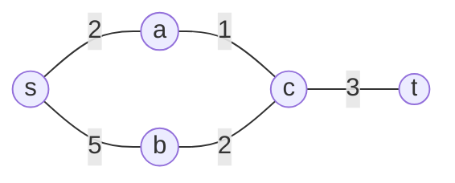

在这个图里，从 $s$ 到 $t$ 可以走 $s-a-c-t$，也可以走 $s-b-c-t$。Dijkstra 和 Bellman-Ford 的目的，都是在候选路径中找到总权值最小者。

### Dijkstra 具体步骤

仍以该图为例，从源点 $s$ 出发：

1. 初始化：$dist[s]=0$，$dist[a]=2$，$dist[b]=5$，$dist[c]=\infty$，$dist[t]=\infty$。
2. 选当前最小未确定顶点 $a$，把 $a$ 加入集合，并松弛 $a\to c$，得到 $dist[c]=3$。
3. 选当前最小未确定顶点 $c$，把 $c$ 加入集合，并松弛 $c\to t$，得到 $dist[t]=6$。
4. 再比较 $b$ 和 $t$：$dist[b]=5$ 更小，因此选 $b$；松弛 $b\to c$ 不会改进 $c$。
5. 最后选 $t$，得到从 $s$ 到 $t$ 的最短距离为 $6$，对应路径 $s-a-c-t$。

这个例子可以看出，Dijkstra 不是“随便试路径”，而是不断固定当前最可信的最短距离，再用它去改写其他点的估计。

**复杂度**：朴素实现（不用堆，邻接矩阵）$O(n^2)$；邻接表 + 二叉堆 $O(m\log n)$。

## 7.2 含负权边：Bellman-Ford 算法

对所有边执行 $n-1$ 轮松弛：$dist[v] = \min(dist[v], dist[u]+w(u,v))$，对每条边 $(u,v)$。

### Bellman-Ford 具体步骤

仍以 $s$ 为源点，结合上面的最短路径示例图来理解松弛过程。把每条边都看成一次“尝试改进”：

1. 初始时 $dist[s]=0$，其余顶点距离为 $\infty$。
2. 第一轮扫描所有边：先得到 $dist[a]=2$，$dist[b]=5$，再由 $a\to c$ 得到 $dist[c]=3$。
3. 第二轮继续扫描所有边：$c\to t$ 给出 $dist[t]=6$，而 $b\to c$ 不会把 $c$ 改得更小。
4. 如果继续做更多轮但所有距离都不再变化，就说明已经收敛。

Bellman-Ford 的特点是“每一轮把所有边都看一遍”，所以它能处理负权边，但代价是时间更高。

**定理 7.2**：若图中无负权环，$n-1$ 轮后 $dist[v] = \delta(s,v)$ 对所有 $v$ 成立。

_证明思路_：最短路径最多含 $n-1$ 条边（简单路径，顶点不重复）。归纳证明：第 $k$ 轮松弛后，$dist[v]$ 至多为 $s$ 到 $v$ 长度 $\le k$ 的路径中的最短者。$k=n-1$ 时覆盖所有可能的简单最短路径。$\blacksquare$

**负环检测**：完成 $n-1$ 轮后再做第 $n$ 轮，若仍有边可松弛，说明存在**负权环**（否则第 $n-1$ 轮后应已收敛），此时最短路径无定义（可无限绕环减小路径权值）。

**复杂度**：$O(nm)$。

## 7.3 所有点对最短路径：Floyd-Warshall 算法

设 $d_k[i][j]$ 表示"只允许经过 $\{v_1,\dots,v_k\}$ 作为中间顶点"时 $i$ 到 $j$ 的最短距离。

**状态转移（动态规划）**：
$$d_k[i][j] = \min\big(d_{k-1}[i][j],\ d_{k-1}[i][k] + d_{k-1}[k][j]\big)$$
边界 $d_0[i][j] = w(i,j)$（$i=j$ 时为 0，无边时为 $\infty$）。

_正确性_：$i$ 到 $j$ 只用 $\{v_1,\dots,v_k\}$ 的最短路径，要么不经过 $v_k$（取值同 $d_{k-1}[i][j]$），要么经过 $v_k$ 恰好一次（因最短路径不重复经过顶点，路径可分解为 $i\to k$ 与 $k \to j$ 两段，各自也是只用前 $k-1$ 个中间点的最短路径，取值 $d_{k-1}[i][k]+d_{k-1}[k][j]$）。两者取较小值即为 $d_k[i][j]$。

**复杂度**：$O(n^3)$ 时间，$O(n^2)$ 空间（可滚动到二维原地更新）。**同样不能处理负权环**（可用于检测：若某 $d[i][i] < 0$，则存在负权环）。

## 7.4 三种算法对比（408 高频考点）

|        | Dijkstra                | Bellman-Ford           | Floyd-Warshall             |
| ------ | ----------------------- | ---------------------- | -------------------------- |
| 问题   | 单源                    | 单源                   | 所有点对                   |
| 负权   | 不允许                  | 允许（无负环）         | 允许（无负环）             |
| 复杂度 | $O(n^2)$ / $O(m\log n)$ | $O(nm)$                | $O(n^3)$                   |
| 方法论 | 贪心                    | 动态规划（按边数分层） | 动态规划（按中间点集分层） |

---

# 8 拓扑排序与 AOE 网关键路径

## 8.1 AOV 网与拓扑排序

用顶点表示活动、有向边表示活动间优先关系的有向图称为 **AOV 网**（Activity On Vertex）。**拓扑排序**是将 AOV 网的所有顶点排成线性序列，使得对每条边 $(u,v)$，$u$ 都排在 $v$ 之前。

由定理 5.2，**AOV 网存在拓扑排序当且仅当图中无环**（即为 DAG）。

**算法一（Kahn 算法，BFS 思路，国外教材常用实现）**：

1. 计算所有顶点入度，入度为 0 的顶点入队；
2. 每次取出队首顶点输出，将其所有出边指向的顶点入度减 1，新产生的入度为 0 的顶点入队；
3. 若最终输出顶点数 $< n$，说明存在环，无拓扑序。

**算法二（DFS 思路）**：对图做 DFS，将顶点按**完成时间降序**排列即为一个合法拓扑序（**拓展**，正确性依赖：对任意边 $(u,v)$，由定理 5.2 图无环故不存在回边，从而 $f[u] > f[v]$ 恒成立，这是 DFS 边分类定理的直接推论）。

两种算法复杂度均为 $O(n+m)$。408 考纲主要考查算法一（对应"入度表法"）。

### 拓扑排序示例

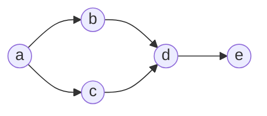

这个 DAG 可以拓扑排序为 $a,b,c,d,e$ 或 $a,c,b,d,e$。只要保证每条边的起点都排在终点之前即可。

### Kahn 算法具体步骤

以这个 DAG 为例：

1. 计算入度：$a$ 的入度为 $0$，$b,c$ 的入度为 $1$，$d$ 的入度为 $2$，$e$ 的入度为 $1$。
2. 将入度为 $0$ 的 $a$ 入队并输出。
3. 删除 $a$ 的出边后，$b,c$ 的入度都变为 $0$，依次入队并输出。
4. 输出 $b$ 后，$d$ 的入度减为 $1$；输出 $c$ 后，$d$ 的入度减为 $0$，入队。
5. 输出 $d$ 后，$e$ 的入度减为 $0$，入队并输出。
6. 最终输出序列可以是 $a,b,c,d,e$，也可以是 $a,c,b,d,e$。

这个过程和 BFS 很像，但它处理的是“入度为 0 的点”，不是“当前层的邻居”。

## 8.2 AOE 网与关键路径

用边表示活动（耗时）、顶点表示事件的带权有向无环图称为 **AOE 网**（Activity On Edge），源点表示开始、汇点表示结束。

- **事件最早发生时间** $ve(v)$：从源点到 $v$ 的最长路径长度，$ve(源点)=0$，$ve(v) = \max_{(u,v)\in E}\{ve(u)+w(u,v)\}$（按拓扑序递推）；
- **事件最迟发生时间** $vl(v)$：在不推迟汇点最早发生时间前提下，$v$ 最迟必须发生的时间，$vl(汇点) = ve(汇点)$，$vl(u) = \min_{(u,v)\in E}\{vl(v) - w(u,v)\}$（按逆拓扑序递推）；
- 活动 $(u,v)$ 的**最早开始时间** $e(u,v) = ve(u)$，**最迟开始时间** $l(u,v) = vl(v) - w(u,v)$；
- **关键活动**：$e(u,v) = l(u,v)$（即无松弛时间）的活动；
- **关键路径**：由关键活动构成的、从源点到汇点的路径，其长度等于整个工程的最短完成时间。

**意义**：关键路径上任一活动延误都会导致整个工程延期，是项目管理中"最长路径决定总工期"这一直觉的图论形式化，也是 408 中较少数要求手算的"最长路径"问题（区别于第 7 节的最短路径）。

---

# 9 补充拓展：欧拉图与哈密顿图

考纲之外，但概念上与遍历、连通性紧密相关，国外教材常在生成树之后、作为图论的一个独立专题引入：

**欧拉回路**（Euler circuit）：经过图中每条边**恰好一次**并回到起点的闭迹。

**定理 9.1（欧拉定理）**：连通无向图存在欧拉回路，当且仅当所有顶点度数均为偶数。

_证明概要_：必要性由"每次经过顶点消耗 2 度（一进一出）"直接得出；充分性可通过构造性证明（不断寻找闭迹并拼接）给出，此处略。

对有向图，欧拉回路存在当且仅当图连通（弱连通即可，若考虑边则需强连通判据的变体）且每个顶点入度等于出度。

**哈密顿回路**（Hamiltonian circuit）：经过图中每个顶点**恰好一次**并回到起点的回路。与欧拉回路"关于边的完备遍历"不同，哈密顿回路是"关于顶点的完备遍历"，**判定一般图是否存在哈密顿回路是 NP 完全问题**，不存在已知的多项式时间充要判据，这是它与欧拉回路在计算复杂度上的本质区别，也是图论中一个重要的分野。
