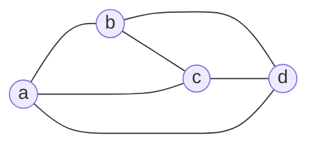
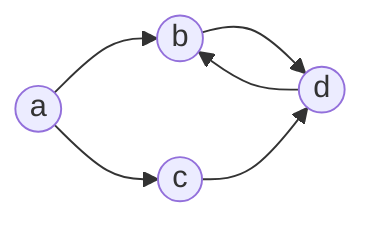
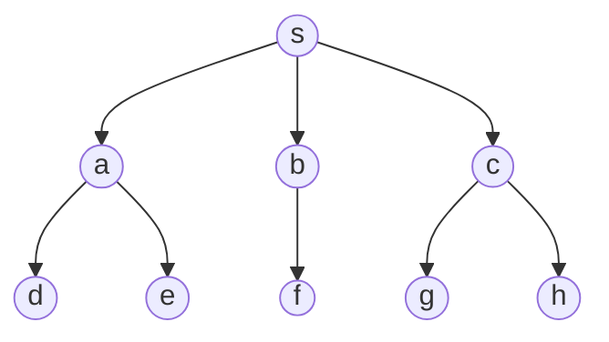
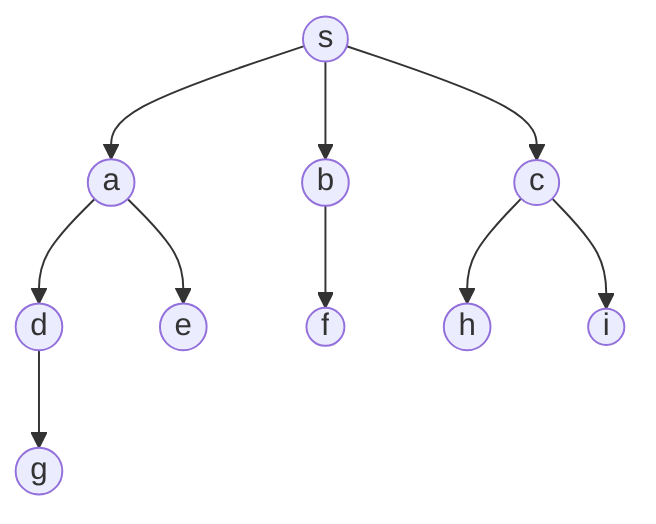

# 1 图的形式化定义与基本概念

## 1.1 无向图与有向图

> [!success] Definition 1.1 Undirected graph
> 一个**无向图**（undirected graph）是一个有序对 $G = \langle V, E \rangle$，其中：
>
> - $V$ 是一个非空集合，称为**顶点集**（vertex set），元素称为顶点（vertex or node）；
> - $E \subseteq \big\lbrace \{u, v\} \mid u, v \in V\big\rbrace$ 是 $V$ 上无序对的集合，称为**边集**（edge set）。

> [!success] Definition 1.2 Directed graph
> 一个**有向图**（directed graph, digraph）是一个有序对 $G=\langle V, E \rangle$，其中：
>
> - $V$ 是一个非空集合，称为**顶点集**（vertex set），元素称为顶点（vertex or node）；
> - $E \subseteq \big\lbrace \langle u, v \rangle \mid u, v \in V\big\rbrace$ 是 $V$ 上有序对的集合，称为**弧集**（arc set）。

我们可以将无向图中的边 $\{u,v\}$ 看作是有向图中两条方向相反的弧 $\langle u,v\rangle$ 和 $\langle v,u\rangle$。

**约定**：若无特别说明，本笔记的图均为**有限图**（$|V|, |E|$ 均有限）。记 $n = |V|$，$m = |E|$。


```mermaid
graph LR
  a((a)) --- b((b)) & c((c)) --- d((d)) --- a
  b --- c
```


```mermaid
graph LR
  a((a)) --> b((b)) & c((c)) --> d((d))
  d --> b
```

> [!success] Definition 1.3 Self-loop and parallel edges
> **自环**是一条从 $u$ 到 $u$ 的边（或弧），记为 $\{u,u\}$（或 $\langle u,u\rangle$）。
>
> 若存在两条从 $u$ 到 $v$ 的边（或弧），则称它们是**平行**（parallel）的。

> [!success] Definition 1.4 Simple graph
> 若一张图中不存在自环和平行边，则称其为**简单**（simple）的。反之，则称其为**多重图**（multigraph）。

## 1.2 邻居集和度

### 1.2.1 无向图中的邻居集和度

> [!success] Definition 1.5 Adjacency, neighbors, endpoints, incidence
> 对于无向图中的一条边 $e=\{u,v\}$，称：
>
> - $u$ 与 $v$ **邻接**（adjacent）；
> - $u$ 是 $v$ 的**邻居**（neighbor），反之亦然；
> - $u,v$ 是 $e$ 的**端点**（endpoints）；
> - $e$ **关联**（incident）于 $u$ 和 $v$。

> [!success] Definition 1.6 Neighborhood
> 对无向图 $G=\lang V,E \rang$ 中的顶点 $u\in V$，其**邻居集**（neighborhood）定义为
>
> $$
> N(u) = \big\lbrace v \in V \mid \{u,v\} \in E \big\rbrace
> $$
>
> 也就是说，$u$ 所有邻居的集合。

> [!success] Definition 1.7 Degree
> 对无向图 $G$ 中顶点 $u$，它的**度**（degree）定义为 $u$ 的邻居集的基数，即
>
> $$
> \operatorname{deg}(u) = \Big|\big\lbrace v \in V \mid \{u,v\} \in E \big\rbrace\Big|
> $$
>
> 特别的，自环为顶点贡献了双倍的度。

> [!tldr] Theorem 1.8 Handshaking lemma
> 对无向图 $G=\lang V,E \rang$，有
>
> $$
> \sum_{u \in V} \operatorname{deg}(u) = 2|E|
> $$

> Corollary 1.9
>
> 记 $n_{\text{odd}}$ 为 $G$ 中度为奇数的顶点的个数，则 $n_{\text{odd}}$ 为偶数。

### 1.2.2 有向图中的邻居集和度

> [!success] Definition 1.10 Neighbors in directed graph
> 对有向图中的弧 $\langle u,v\rangle$，称：
>
> - $v$ 是 $u$ 的**出邻居**（out-neighbor）
> - $u$ 是 $v$ 的**入邻居**（in-neighbor）

> [!success] Definition 1.11 Neighborhood and degree in directed graph
> 对于有向图中的顶点 $u$，称：
>
> - $u$ 的**入邻居集**（in-neighborhood）为 $\big\lbrace v \in V \mid \langle v,u\rangle \in E \big\rbrace$，即入邻居 $v$ 的集合；
> - $u$ 的**入度**（in-degree）为 $\Big|\big\lbrace v \in V \mid \langle v,u\rangle \in E \big\rbrace\Big|$，即入邻居的个数；
> - $u$ 的**出邻居集**（out-neighborhood）为 $\big\lbrace v \in V \mid \langle u,v\rangle \in E \big\rbrace$，即出邻居 $v$ 的集合。
> - $u$ 的**出度**（out-degree）为 $\Big|\big\lbrace v \in V \mid \langle u,v\rangle \in E \big\rbrace\Big|$，即出邻居的个数。

## 1.3 图的表示：数据结构

### 1.3.1 邻接矩阵

> [!success] Definition 1.13 Adjacency matrix
> 在图 $G = \lang V,E \rang$ 的邻接矩阵中，构造一个 $|V| \times |V|$ 的矩阵 $A$，其中
>
> $$
> A[u][v] = \begin{cases}
> 1, & \langle u,v\rangle \in E \\
> 0, & \langle u,v\rangle \notin E
> \end{cases}
> $$

### 1.3.2 邻接表

> [!success] Definition 1.12 Adjacency list
> 在图 $G = \lang V,E \rang$ 的邻接表中，对于每个顶点 $u \in V$，维护一个无序列表，存储 $u$ 的所有（出）邻居。

不过，邻接表的实现方式有很多种，最常用的是链式前向星（forward star）和十字链表（orthogonal list）。

#### 链式前向星（forward star）

链式前向星使用数组而非链表存储邻接顶点。

- `edge[i]`存储第 $i$ 条边
  - `edge[i].to`：边的终点
  - `edge[i].next`：与起点相连的下一条边在 `edge[]` 中的下标
  - `edge[i].weight`：边的权值（可选）
- `head[i]`存储顶点 $i$ 出边链表的表头（即第一条边在 `edge[]` 中的下标）

```c
struct Edge {
    int to;     // 终点
    int next;   // 下一条边的下标
    int weight; // 权值（可选）
}edge[MAXM];

int head[MAXN]; // head[i] 表示顶点 i 的第一条边在 edge[] 中的下标
```

### 1.3.3 邻接表与邻接矩阵的比较

| 特性           | 邻接矩阵             | 邻接表                     | 链式前向星                 |
| -------------- | -------------------- | -------------------------- | -------------------------- |
| 空间复杂度     | $\varTheta(\|V\|^2)$ | $\varTheta(\|V\| + \|E\|)$ | $\varTheta(\|V\| + \|E\|)$ |
| 查询边是否存在 | $\varTheta(1)$       | $1+\varTheta(\deg(u))$     | $1+\varTheta(\deg(u))$     |
| 查询顶点的邻居 | $\varTheta(\|V\|)$   | $1+\varTheta(\deg(u))$     | $1+\varTheta(\deg(u))$     |
| 插入边         | $\varTheta(1)$       | $1+\varTheta(\deg(u))$     | $1+\varTheta(1)$           |
| 删除边         | $\varTheta(1)$       | $1+\varTheta(\deg(u))$     | $1+\varTheta(\deg(u))$     |

## 1.4 同构与子图

> [!success] Definition 1.14 Graph isomorphism
> 考虑两个图 $G = \lang V,E \rang$ 和 $H = \lang U,F \rang$。若存在双射 $f: V \to U$，满足
>
> $$
> \forall a,b \in V,\quad \lang a,b \rang \in E \iff \lang f(a),f(b) \rang \in F
> $$
>
> 则称 $G$ 与 $H$ **同构**（isomorphic）。

> [!success] Definition 1.15 Subgraph
> 设 $G = \lang V,E \rang$。若 $V' \subseteq V$ 且 $E' \subseteq E$，则称 $G' = \lang V',E' \rang$ 为 $G$ 的**子图**（subgraph）。

## 1.5 完全图、二分图、正则图和平面图

> [!success] Definition 1.16 Complete graph/clique
> 一个无向图 $G = \lang V,E \rang$ 为**完全图**（complete graph/clique），当且仅当
>
> $$
> \forall u,v \in V,\quad u \neq v \implies \{u,v\} \in E
> $$

> [!success] Definition 1.17 Bipartite graph
> 一个无向图 $G = \lang V,E \rang$ 为**二分图**（bipartite graph），当且仅当存在 $V$ 的一个划分 $\{L, R\}$，使得 $E \subseteq L \times R$。

> [!success] Definition 1.18 Regular graph
> 设 $d \in \mathbb{N}$。一个无向图 $G = \lang V,E \rang$ 为 **$d$-正则图**（$d$-regular graph），当且仅当
>
> $$
> \forall u \in V,\quad \deg(u) = d
> $$

> [!success] Definition 1.19 Planar graph
> 若一个无向图 $G = \lang V,E \rang$ 可以嵌入平面，使得其边仅在顶点处相交，则称 $G$ 为**平面图**（planar graph）。

# 2 路径、连通和距离

> [!success] Definition 2.1 Path
> 对于图 $G = \lang V,E \rang$，$G$ 中的一个**路径**（path）是一个顶点序列 $P = \lang u_1, u_2, \dots, u_k \rang$，满足
>
> $$
> \forall i \in \{1, 2, \dots, k\},\quad u_i \in V \quad\text{且}\quad \forall i \in \{1, 2, \dots, k-1\},\quad \lang u_i, u_{i+1} \rang \in E
> $$
>
> 我们称这样的序列为从 $u_1$ 到 $u_k$ 的一条路径，长度为 $k-1$。我们也称这条路径**遍历**了边 $\lang u_i, u_{i+1}\rang$
>
> 特别的，若 $u_1 = u_k$，则称 $P$ 为**回路**（cycle）。

> [!success] Definition 2.2 Simple path
> 若路径 $P = \lang u_1, u_2, \dots, u_k \rang$ 中的顶点两两不同，则称 $P$ 为**简单路径**（simple path）。

## 2.1 无向图的连通性

> [!success] Definition 2.3 Connected nodes and connected graph
> 对于无向图 $G = \lang V,E \rang$，
>
> - 若存在从 $u$ 到 $v$ 的路径，则称 $u, v$ **连通**。
> - 若 $\forall u, v \in V$，$u$ 与 $v$ 连通，则称 $G$ 为**连通图**（connected graph）。
> - 若 $G$ 不是连通图，则称 $G$ 为**非连通图**（disconnected graph）。

### 2.1.1 连通分量

> [!success] Definition 2.4 Connected component
> 在无向图 $G = \lang V,E \rang$ 中，若 $C \subseteq V$，且
>
> 1. $\forall s, t \in C$，$s$ 与 $t$ 连通；
> 2. $\forall x \in V \setminus C$，$C \cup \{x\}$ 不满足条件1；
>
> 则称 $C$ 是 $G$ 的一个连通分量。

$C$ 中的顶点相互连通，且不与 $C$ 外的顶点连通。

## 2.2 有向图的连通性

> [!success] Definition 2.5 Reachability and strongly connected nodes/graphs
> 设 $G = \lang V,E \rang$ 为有向图。
>
> - 若存在从 $u$ 到 $v$ 的有向路径，则称 $v$ **可达**（reachable）于 $u$。
> - 若 $u$ 可达于 $v$ 且 $v$ 可达于 $u$，则称 $u$ 与 $v$ **强连通**（strongly connected）。
> - 若 $\forall u, v \in V$，$u$ 与 $v$ 强连通，则称 $G$ 为**强连通图**（strongly connected graph）。

> [!success] Definition 2.6 Weakly connected graph
> 设 $G = \lang V,E \rang$ 为有向图。若将 $G$ 中的所有弧 $\langle u,v\rangle$ 替换为无向边 $\{u,v\}$ 后得到的无向图是连通图，则称 $G$ 为**弱连通图**（weakly connected graph）。

### 2.2.1 强连通分量

> [!success] Definition 2.7 Strongly connected component
> 在有向图 $G = \lang V,E \rang$ 中，若 $C \subseteq V$，且
>
> 1. $\forall s, t \in C$，$s$ 与 $t$ 强连通；
> 2. $\forall x \in V \setminus C$， $C \cup \{x\}$ 不满足条件1；
>
> 则称 $C$ 是 $G$ 的一个强连通分量。

## 2.3 最短路径与距离

> [!success] Definition 2.8 Shortest path
> 设图 $G = \lang V,E \rang$ 中的顶点 $u, v \in V$，在所有从 $u$ 到 $v$ 的路径中，长度最短的路径称为从 $u$ 到 $v$ 的**最短路径**（shortest path）。

> [!success] Definition 2.9 Distance
> 从 $u$ 到 $v$ 的最短路径的长度称为 $u$ 到 $v$ 的**距离**（distance）。若不存在从 $u$ 到 $v$ 的路径，则定义 $d(u,v) = \infty$。

## 2.4 图的遍历

图的两种基础遍历方式本质上是对"从某点出发系统性访问所有可达顶点"这一任务的两种不同**顶点访问顺序策略**，二者时间复杂度相同，但产生的**遍历树结构**与**适用算法**不同。

## 2.4.1 广度优先搜索（BFS）

用队列实现：访问起点 $s$，将其加入队列并标记；每次取出队首 $u$，访问其所有未标记的邻居，标记并入队，直至队列为空。

**定理 5.1**：BFS 从 $s$ 出发首次访问到顶点 $v$ 时所走过的边数，等于 $s$ 到 $v$ 的**最短路径边数**（无权图意义下）。

由 BFS 过程中记录的"父指针"构成的树称为 **BFS 树**。

#### BFS 树示例


```mermaid
graph TD
  s((s)) --> a((a))
  s --> b((b))
  s --> c((c))
  a --> d((d))
  a --> e((e))
  b --> f((f))
  c --> g((g))
  c --> h((h))
```

以图中的顶点和边为例，若按邻接点字母顺序访问，一个典型的 BFS 访问次序是 $s,a,b,c,d,e,f,g,h$。若把父指针连起来，就得到上面的 BFS 树。

**复杂度**：邻接表 $O(n+m)$，邻接矩阵 $O(n^2)$。

### 2.4.2 深度优先搜索（DFS）

用递归（或显式栈）实现：访问 $u$ 后，递归访问其一个未访问的邻居，直至无法继续再回溯。

DFS 过程中，按访问先后可为每个顶点记录**发现时间** $d[v]$ 与**完成时间** $f[v]$（CLRS 的经典处理方式，国内教材较少涉及，但对理解 DFS 的结构十分关键）。

**边的分类（拓展，理解拓扑排序与环检测的基础）**：DFS 遍历有向图时，每条边 $(u,v)$ 可归为四类：

1. **树边**（tree edge）：$v$ 首次通过该边被发现；
2. **回边**（back edge）：$v$ 是 $u$ 在 DFS 树中的祖先（$u$ 正在被访问，$v$ 已被访问但未完成）；
3. **正向边**（forward edge）：$v$ 是 $u$ 的后代，但非树边；
4. **横叉边**（cross edge）：其余情况，$u,v$ 无祖先—后代关系。

**定理 5.2**：有向图 $G$ 无环（是 DAG）当且仅当 DFS 过程中不产生回边。

**复杂度**：与 BFS 相同，邻接表 $O(n+m)$。

#### DFS 树示例


```mermaid
graph TD
  s((s)) --> a((a))
  a --> d((d))
  d --> g((g))
  a --> e((e))
  s --> b((b))
  b --> f((f))
  s --> c((c))
  c --> h((h))
  c --> i((i))
```

以图中的结构为例，从 $s$ 开始并按邻接点字母顺序深入，一个典型的 DFS 访问次序可以写成 $s,a,d,g,e,b,f,c,h,i$。注意 DFS 的关键不是“谁先排在前面”，而是“先尽量沿一条路走到底，再回退到最近未探索的分支”。

# 3 欧拉通路和哈密顿通路

能否从一个顶点出发沿着图的边前进，恰好经过图的每条边一次并且回到这个顶点？同样，能否从一个顶点出发沿着图的边前进，恰好经过图的每个顶点一次并且回到这个顶点？

虽然这两个问题有相似之处，但是对于所有的图来说，通过检查图中顶点的度，可以轻而易举地回答第一个关于是否具有欧拉回路（Euler Circuit）的问题，却非常难以解决第二个关于是否具有哈密顿回路（Hamilton Circuit）的问题。

## 3.1 欧拉通路与欧拉回路

> [!success] Definition 3.1 Euler path and Euler circuit
> 设图 $G = \lang V,E \rang$。
>
> - 若存在一条路径 $P$，使得 $P$ 遍历了 $G$ 中的每条边恰好一次，则称 $P$ 为 $G$ 的**欧拉通路**（Euler path）；
> - 若存在一条回路 $C$，使得 $C$ 遍历了 $G$ 中的每条边恰好一次，则称 $C$ 为 $G$ 的**欧拉回路**（Euler circuit）。

> [!tldr] Theorem 3.2 Euler's theorem
> 设 $G = \lang V,E \rang$ 为连通多重图，则：
>
> 1. $G$ 具有欧拉回路当且仅当 $\forall v \in V, \deg(v)$ 为偶数；
> 2. $G$ 具有欧拉通路但无欧拉回路当且仅当它恰好有两个顶点的度为奇数。

## 3.2 哈密顿通路与哈密顿回路

> [!success] Definition 3.3 Hamilton path and Hamilton circuit
> 设多重图 $G = \lang V,E \rang$。
>
> - 若存在一条遍历了 $G$ 中每个顶点的简单路径，则称该路径为 $G$ 的**哈密顿通路**（Hamilton path）；
> - 若存在一条遍历了 $G$ 中每个顶点的简单回路，则称该回路为 $G$ 的**哈密顿回路**（Hamilton circuit）。

> [!tldr] Theorem 3.4 Dirac's theorem
> 设 $G = \lang V,E \rang$ 为一个简单图，且 $|V| = n \ge 3$。若 $\forall v \in V, \deg(v) \ge \frac{n}{2}$，则 $G$ 具有哈密顿回路。

> [!tldr] Theorem 3.5 Ore's theorem
> 设 $G = \lang V,E \rang$ 为一个简单图，且 $|V| = n \ge 3$。若
>
> $$
> \forall u,v \in V,\quad u \neq v \wedge \{u,v\} \notin E \implies \deg(u) + \deg(v) \ge n,
> $$
>
> 则 $G$ 具有哈密顿回路。

# 4 树

## 4.1 无环图

> [!success] Definition 4.1 Acyclic graph
> 若图 $G$ 中不存在回路，则称 $G$ 为**无环图**（acyclic graph）。

> [!tldr] Theorem 4.2 Every acyclic graph has a node with degree 0 or 1
> 设 $G = \lang V,E \rang$ 为一个无向无环图，则 $G$ 至少有一个顶点的度为 0 或 1。

## 4.2 树

> [!success] Definition 4.3 Tree
> 树（tree）是一个连通、无环的无向图。

> [!tldr] Theorem 4.4 Number of edges in a tree
> 设 $T = \lang V,E \rang$ 为一棵树，则 $|E| = |V| - 1$。

> Corollary 4.5
> 对于任意一棵树 $T = \lang V,E \rang$，
>
> - 添加一条边会产生一个回路；
> - 删除一条边会使图不连通。

### 4.2.1 有根树

> [!success] Definition 4.6 Rooted tree
> 一棵树 $T = \lang V,E \rang$ 的一个顶点 $r \in V$ 被指定为**根**（root），则称 $T$ 为**有根树**（rooted tree）。

我们通常将根顶点放在树的最上方，其他顶点按层次排列。每个顶点（除了根顶点）都有一个父节点（parent）和若干个子节点（children）。

### 4.2.2 子树、前驱和后继

> [!success] Definition 4.7 Descendant, ancestor and subtree
> 设 $T = \lang V,E \rang$ 为有根树，$u_0 \in V$ 为根。存在路径 $P = \lang u_0, u_1, \dots, u_k, u_{k+1}, \dots, u_n \rang$
>
> - 称 $u_k$ 为节点 $u_0, u_1, \dots, u_{k-1}$ 的**后代**（descendants），特别的，称 $u_{k}$ 为 $u_{k-1}$ 的**子节点**（child）；
> - 称 $u_k$ 为节点 $u_{k+1}, u_{k+2}, \dots, u_n$ 的**前驱**（ancestors），特别的，称 $u_{k}$ 为 $u_{k+1}$ 的**父节点**（parent）。
> - 对于任意顶点 $u \in V$，以 $u$ 为根的子图 $T_u = \lang V_u, E_u \rang$，其中
>
>   $$
>   V_u = \{v \in V \mid v \text{ 是 } u \text{ 的后代}\}\cup \{u\}\qquad E_u = \{\{x,y\} \in E \mid x,y \in V_u\}
>   $$
>
>   称为以 $u$ 为根的**子树**（subtree）。

> [!success] Definition 4.8 Depth and height
> 设 $T = \lang V,E \rang$ 为有根树，$u \in V$ 为顶点，$r \in V$ 为根顶点。
>
> - 称从根到 $u$ 的路径长度为 $u$ 的**深度**（depth）；
> - 树 $T$ 的**高度**（height）定义为树中所有顶点的深度的最大值。

### 4.2.3 二叉树

> [!success] Definition 4.9 Binary tree and k-ary tree
> 一棵树 $T = \lang V,E \rang$ 称为**二叉树**（binary tree），当且仅当每个顶点的度不超过 2。
>
> 更一般的，一棵树 $T = \lang V,E \rang$ 称为**k-叉树**（k-ary tree），当且仅当每个顶点的度不超过 $k$。

## 4.3 生成树

> [!success] Definition 4.10 Spanning tree
> 设 $G = \lang V,E \rang$ 为一个无向连通图。 若 $T = \lang V, E' \rang$ 是 $G$ 的一个子图，且 $T$ 是一棵树，则称 $T$ 为 $G$ 的**生成树**（spanning tree）。

环路消除法：从 $G$ 中任意选取一条边，若它在环路中，则删除它，直到没有环路为止。我们可以证明，最终得到的图是 $G$ 的一棵生成树。

# 4 带权图

> [!success] Definition 4.1 Weighted graph
> 设图 $G = \lang V,E \rang$，若存在一个**权值函数**（weight function）$w: E \to \mathbb{R}$，满足 $\forall e \in E, w(e) \ge 0$，则称 $G$ 为**带权图**（weighted graph）。
>
> 对于带权图，路径的长度定义为路径上遍历的边的权值之和。

## 4.1 最短路径问题

最短路径问题是图论中最经典的问题之一。主要有两类：

- 单源最短路径问题（Single Source Shortest Path, SSSP）：给定一个顶点 $s$，求从 $s$ 到图中所有顶点的最短路径。
- 多源最短路径问题（All Pairs Shortest Path, APSP）：求图中任意两顶点之间的最短路径。

## 4.2 最小生成树问题

最小生成树问题是图论中另一个经典问题。主要有两类：

- 最小生成树（Minimum Spanning Tree, MST）：给定一个带权无向图，求一棵生成树，使得其所有边的权值之和最小。
- 最小生成森林（Minimum Spanning Forest, MSF）：给定一个带权无向图，求若干棵生成树，使得其所有边的权值之和最小。
