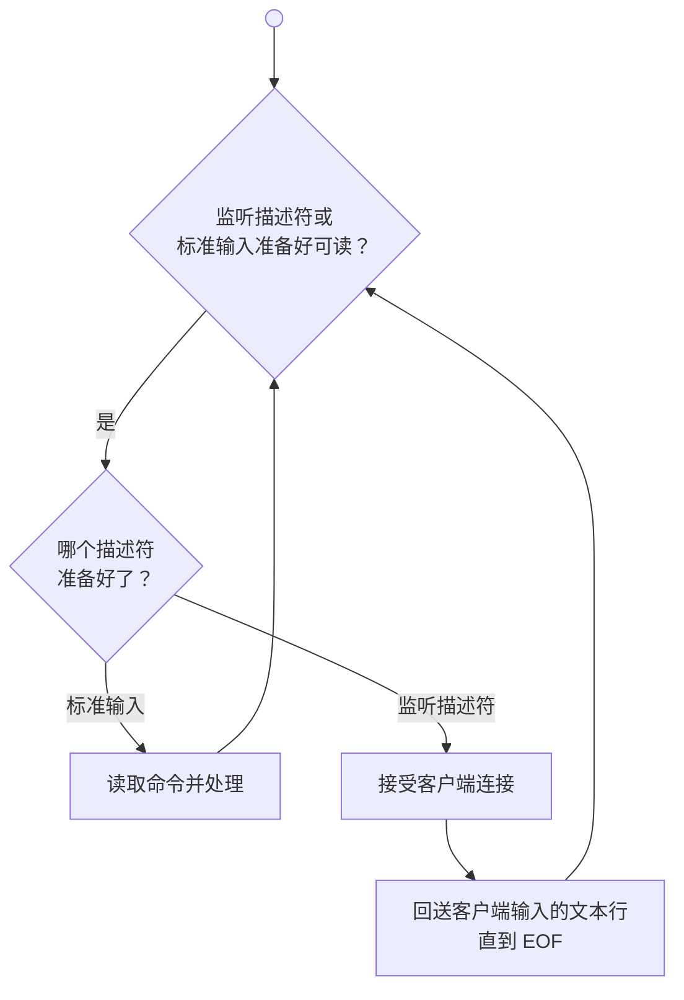

在[[csapp-8|第八章]]提到，如果两个逻辑控制流在时间上重叠，那么它们就是**并发的**（concurrent）。这种现象称为**并发**（concurrency），出现在计算机系统的许多层面。

> [!important] 本章目标
> 掌握进程、I/O 多路复用和线程的并发模型，理解共享变量、信号量、竞争和死锁，并能构造并发网络服务器。

到目前为止，我们主要将并发看做是一种操作系统内核用来运行多个应用程序的机制。但是并发不仅仅局限于内核，它也可以在应用程序中扮演重要角色。应用级并发在以下情况很有用：

- **访问慢速 I/O 设备**：当应用等待慢速 I/O 设备（例如磁盘）时，内核可以运行其他进程，使 CPU 保持繁忙
- **与人交互**：现代窗口系统通过并发实现多任务同时执行的能力
- **通过推迟工作降低延迟**：应用可以把非紧急操作放入低优先级的并发流，在空闲 CPU 周期执行
- **服务多个网络客户端**：第 11 章的迭代服务器一次只能服务一个客户端，慢速客户端会阻塞其他客户端；并发服务器为每个客户端创建一个逻辑流，可以同时服务多个客户端
- **在多核机器上进行并行计算**：并发流可以在多个核上并行执行，而不是在单核上交错执行

现代操作系统提供了三种基本的构造**并发程序**（concurrent programs）的方法：

- **进程**：每个逻辑控制流都是一个进程，由内核调度和维护，有独立的虚拟地址空间，进程之间必须使用显式的进程间通信（inter-process communication, IPC）
- **I/O 多路复用**：应用在一个进程中显式调度逻辑流，逻辑流被模型化为状态机，所有流共享同一个地址空间
- **线程**：运行在单一进程上下文中的逻辑流，由内核调度——像进程一样被内核调度，像 I/O 多路复用流一样共享虚拟地址空间

> [!summary]
>
> | 机制                     | 调度方                     | 地址空间     | 数据共享     |
> | ------------------------ | -------------------------- | ------------ | ------------ |
> | 进程                     | 内核自动调度               | 各自独立     | 需要显式 IPC |
> | I/O 多路复用（事件驱动） | 应用自己显式调度（状态机） | 单一进程共享 | 快速、方便   |
> | 线程                     | 内核自动调度               | 单一进程共享 | 快速、方便   |
>
> 同步对共享数据的并发访问是一个困难的问题，信号量的 P 和 V 操作提供了互斥访问和资源调度这两种能力，预线程化 echo 服务器展示了实际应用。
>
> 并发还引入了线程安全、可重入性、竞争、死锁等困难问题：
>
> - 被线程调用的函数必须线程安全（四类线程不安全函数各有对应的处理方式）
> - 可重入函数是线程安全函数的真子集，通常更高效
> - 竞争源于对调度顺序的错误假设
> - 死锁源于线程等待永远不会发生的事件——遵循互斥锁加锁顺序规则可以避免。

---

# 第一部分 并发编程

## 12.1 基于进程的并发编程

构造并发程序最简单的方法就是用进程，使用 `fork`、`exec` 和 `waitpid` 这些熟悉的函数。一个构造并发服务器的自然方法是：在父进程中接受客户端连接请求，然后创建一个新的子进程来为每个新客户端提供服务。

假设服务器正在监听描述符 3 上的连接请求。服务器接受客户端 1 的连接请求后返回已连接描述符 4，然后派生一个子进程——子进程获得服务器描述符表的完整副本。子进程关闭它的副本中的监听描述符 3，父进程关闭它的已连接描述符 4 的副本，因为不再需要这些描述符了。

因为父、子进程中的已连接描述符都指向同一个文件表表项，所以父进程关闭它的已连接描述符的副本是至关重要的。否则，将永不会释放已连接描述符 4 的文件表条目，由此引起的内存泄漏将最终消耗光可用的内存，使系统崩溃。

假设父进程为客户端 1 创建子进程之后，又接受了客户端 2 的连接请求，返回新的已连接描述符 5，然后再派生另一个子进程用描述符 5 为它服务。此时，父进程正在等待下一个连接请求，而两个子进程正在并发地为它们各自的客户端提供服务。

### 12.1.1 基于进程的并发服务器

```c
#include "csapp.h"
void echo(int connfd);

void sigchld_handler(int sig)
{
    while (waitpid(-1, 0, WNOHANG) > 0);

    return;
}

int main(int argc, char **argv)
{
    int listenfd, connfd;
    socklen_t clientlen;
    struct sockaddr_storage clientaddr;

    if (argc != 2) {
        fprintf(stderr, "usage: %s <port>\n", argv[0]);
        exit(0);
    }

    Signal(SIGCHLD, sigchld_handler);
    listenfd = Open_listenfd(argv[1]);
    while (1) {
        clientlen = sizeof(struct sockaddr_storage);
        connfd = Accept(listenfd, (SA *) &clientaddr, &clientlen);
        if (Fork() == 0) {
            Close(listenfd); /* 子进程关闭监听套接字 */
            echo(connfd);    /* 子进程为客户端服务 */
            Close(connfd);   /* 子进程关闭与客户端的连接 */
            exit(0);         /* 子进程退出 */
        }
        Close(connfd); /* 父进程关闭已连接套接字（重要！） */
    }
}
```

关于这个服务器，有几点重要内容需要说明：

- **必须包含 SIGCHLD 处理程序，回收僵死（zombie）子进程的资源**（`sigchld_handler`）。因为 SIGCHLD 处理程序执行时该信号被阻塞，而 Linux 信号不排队，所以处理程序必须准备好用 `while` 循环回收多个僵死子进程
- **父子进程必须各自关闭 `connfd` 副本**。对父进程而言这尤为重要，它必须关闭已连接描述符以避免内存泄漏
- 因为套接字文件表表项的引用计数，**直到父子进程的 `connfd` 都关闭了，到客户端的连接才会终止**

### 12.1.2 进程的优劣

对于父、子进程间共享状态信息，进程有一个非常清晰的模型：共享文件表，但不共享用户地址空间。进程有独立的地址空间既是优点也是缺点：

- 优点：一个进程不可能不小心覆盖另一个进程的虚拟内存，消除了许多令人迷惑的错误。
- 缺点：
  - 独立的地址空间使得进程共享状态信息变得更加困难，必须使用显式的 **IPC**（进程间通信）机制
  - 进程控制和 IPC 的开销很高，这拖慢了整个程序的运行速度

> [!note] Unix IPC
> 本书已经介绍过几种 IPC：第八章的 `waitpid` 和信号、第十一章的套接字接口。Unix IPC 通常指同一主机上进程间通信的技术，包括管道、FIFO、System V 共享内存和 System V 信号量。

## 12.2 基于 I/O 多路复用的并发编程

假设要编写一个 echo 服务器，它也要响应用户从标准输入键入的交互命令。服务器必须响应两个互相独立的 I/O 事件：网络客户端的连接请求、用户在键盘上键入命令行。如果在 `accept` 中等待连接请求，就不能响应输入命令；反之亦然，没有哪个选择是理想的。

**I/O 多路复用**（I/O multiplexing）技术解决了这个困境：使用 `select` 函数，要求内核挂起进程，只有在一个或多个 I/O 事件发生后，才将控制返回给应用程序。

`select` 是一个复杂的函数，有许多使用场景。本节只讨论最常见的一种：等待一组描述符准备好读。这时后三个参数固定传 `NULL`（不关心写就绪、异常发生，也不设置超时），调用形式简化为：`select(n, &read_set, NULL, NULL, NULL);`

```c
#include <sys/select.h>

int select(int n, fd_set *readfds, fd_set *writefds, fd_set *exceptfds, struct timeval *timeout);
/* 返回：已准备好的描述符的非零个数，若出错则为 -1 */

FD_ZERO(fd_set *fdset);           /* 清空 fdset 中所有位 */
FD_CLR(int fd, fd_set *fdset);    /* 清除 fdset 中的 fd 位 */
FD_SET(int fd, fd_set *fdset);    /* 打开 fdset 中的 fd 位 */
FD_ISSET(int fd, fd_set *fdset);  /* fdset 中的 fd 位是否打开 */
```

`select` 函数处理类型为 `fd_set` 的集合，也叫做**描述符集合**。逻辑上，我们将描述符集合看成一个大小为 $n$ 的位向量：

$$
b_{n-1},\cdots,b_1,b_0
$$

当且仅当 $b_k=1$，描述符 $k$ 才是描述符集合的一个元素。集合中元素个数称为**基数**（cardinality）。

只允许对描述符集合做三件事：

1. 分配它们
2. 把一个此类型变量赋值给另一个
3. 用 `FD_ZERO`、`FD_SET`、`FD_CLR` 和 `FD_ISSET` 宏修改和检查它们。

针对我们的目的，`select` 的两个关键输入是**读集合**（`readfds`）和该集合的基数 `n`（实际上是任何描述符集合的最大基数）。

`select` 会一直阻塞，直到读集合中至少有一个描述符准备好可以读——当且仅当一个从该描述符读一字节的请求不会阻塞时，描述符 $k$ 才**准备好可以读**。`select` 有一个副作用：它会修改`*readfds`，若描述符 $k$ 不可读，则 $b_k=0$，只留下准备好读的描述符，称为**准备好集合**（ready set）。返回值指明准备好集合的基数。由于这个副作用，每次调用 `select` 前都必须重新初始化读集合。

理解 `select` 的最好办法是研究一个具体例子。下面是用它实现一个能同时接受用户命令的迭代 echo 服务器：

```c
#include "csapp.h"
void echo(int connfd);
void command(void);

int main(int argc, char **argv)
{
    int listenfd, connfd;
    socklen_t clientlen;
    struct sockaddr_storage clientaddr;
    fd_set read_set, ready_set;

    if (argc != 2) {
        fprintf(stderr, "usage: %s <port>\n", argv[0]);
        exit(0);
    }
    listenfd = Open_listenfd(argv[1]);  // 创建监听描述符

    FD_ZERO(&read_set);             // 清空读集合
    FD_SET(STDIN_FILENO, &read_set);// 把标准输入加入读集合
    FD_SET(listenfd, &read_set);    // 把监听描述符加入读集合

    while (1) {
        ready_set = read_set;
        Select(listenfd + 1, &ready_set, NULL, NULL, NULL); // 阻塞直到监听描述符或标准输入准备好可读
        if (FD_ISSET(STDIN_FILENO, &ready_set))
            command();  // 从标准输入读取指令
        if (FD_ISSET(listenfd, &ready_set)) {
            clientlen = sizeof(struct sockaddr_storage);
            connfd = Accept(listenfd, (SA *)&clientaddr, &clientlen);
            echo(connfd);   // 回送客户端输入的文本行直到 EOF
            Close(connfd);
        }
    }
}

void command(void) {
    char buf[MAXLINE];
    if (!Fgets(buf, MAXLINE, stdin))
        exit(0);    // EOF
    printf("%s", buf);  // 回显命令（可替换为实际命令处理，此处仅作示例）
}
```



虽然这个程序是使用 select 的一个很好示例，但是它仍然留下了一些问题待解决：连接到客户端期间，服务器无法响应标准输入。

因此，在客户端与服务端断开连接之前，键入的任何命令都不会得到响应。一个更好的方法是更细粒度的多路复用，使得服务器每次循环至多回送一个文本行。

> [!question] 练习
> 在 Linux 系统里，在标准输入上键入 Ctrl+D 表示 EOF。当上述程序阻塞在对 select 的调用上时，如果你键入 Ctrl+D 会发生什么？

**答**：:spoiler[回想一下，如果一个从描述符中读一个字节的请求不会阻塞，那么这个描述符就准备好可以读了。假如 EOF 在一个描述符上为真，那么描述符也准备好可读了，因为读操作将立即返回一个零返回码，表示 EOF。因此，键入 Ctrl+D 会导致 select 函数返回，准备好的集合中有描述符 0。]

### 12.2.1 基于 I/O 多路复用的并发事件驱动服务器

I/O 多路复用可以用做并发**事件驱动**（event-driven）程序的基础：某些事件导致流向前推进。一般思路是将逻辑流模型化为**状态机**（state machine）：

- **状态**（state）
- **输入事件**（input event）
- **转移**（transition）：转移把（状态，输入事件）对映射到新状态
- **自循环**（self-loop）：同一输入和输出状态之间的转移

对每个新客户端 $k$，服务器创建一个新的状态机 $s_k$，与已连接描述符关联：

- 状态是“等待描述符 $d_k$ 准备好可读”
- 输入事件是“描述符 $d_k$ 准备好可读”
- 转移是“从描述符 $d_k$ 读一个文本行”

服务器用 `select` 检测输入事件，当已连接描述符准备好可读时，就为相应状态机执行转移。

下面是一个基于 I/O 多路复用的并发事件驱动服务器的完整示例代码：

```c
#include "csapp.h"

typedef struct {        // 连接描述符池
    int maxfd;          // 池中描述符的最大值
    fd_set read_set;    // 所有活跃描述符的集合
    fd_set ready_set;   // 描述符的可读子集
    int nready;         // 准备好集合的基数
    int maxi;           // clientfd 数组的最大索引
    int clientfd[FD_SETSIZE];   // 已连接描述符数组
    rio_t clientrio[FD_SETSIZE];// 已连接描述符的 RIO 读缓冲区数组
} pool;

int byte_cnt = 0;   // 服务器接收的总字节数

int main(int argc, char **argv)
{
    int listenfd, connfd;
    socklen_t clientlen;
    struct sockaddr_storage clientaddr;
    static pool pool;

    if (argc != 2) {
        fprintf(stderr, "usage: %s <port>\n", argv[0]);
        exit(0);
    }
    listenfd = Open_listenfd(argv[1]);
    init_pool(listenfd, &pool);

    while (1) {
        /* 阻塞直到池中某个描述符准备好可读 */
        pool.ready_set = pool.read_set;
        pool.nready = Select(pool.maxfd + 1, &pool.ready_set, NULL, NULL, NULL);

        /* 如果监听描述符准备好可读，则接受新连接并把它加入池 */
        if (FD_ISSET(listenfd, &pool.ready_set)) {
            clientlen = sizeof(struct sockaddr_storage);
            connfd = Accept(listenfd, (SA *)&clientaddr, &clientlen);
            add_client(connfd, &pool);
        }
        /* 回送所有准备好可读的已连接描述符的一个文本行 */
        check_clients(&pool);
    }
}
```

`init_pool` 初始化客户端池：`clientfd` 数组中 -1 表示可用槽位；初始时监听描述符是读集合中唯一的描述符。

```c
void init_pool(int listenfd, pool *p)
{
    /* 初始时，池中没有已连接的描述符 */
    int i;
    p->maxi = -1;
    for (i = 0; i < FD_SETSIZE; i++)
        p->clientfd[i] = -1;    // -1 表示可用槽位

    /* 初始时，读集合中只有监听描述符 */
    p->maxfd = listenfd;
    FD_ZERO(&p->read_set);
    FD_SET(listenfd, &p->read_set);
}
```

`add_client` 把新客户端加入池：在 `clientfd` 数组中找到空槽位、初始化对应的 RIO 读缓冲区、加入 `select` 读集合，并更新 `maxfd`（select 的最大描述符）和 `maxi`（`clientfd` 数组的最大索引，避免 `check_clients` 搜索整个数组）。

```c
void add_client(int connfd, pool *p)
{
    int i;
    p->nready--;
    for (i = 0; i < FD_SETSIZE; i++)
        if (p->clientfd[i] < 0) {
            /* 添加连接描述符到池中 */
            p->clientfd[i] = connfd;
            Rio_readinitb(&p->clientrio[i], connfd);
            /* 将连接描述符加入读集合 */
            FD_SET(connfd, &p->read_set);

            /* 更新最大描述符和最大索引 */
            if (connfd > p->maxfd)
                p->maxfd = connfd;
            if (i > p->maxi)
                p->maxi = i;
            break;
        }
    if (i == FD_SETSIZE)    // 达到最大客户端数
        app_error("add_client error: Too many clients");
}
```

`check_clients` 回送来自每个准备好的已连接描述符的一个文本行；累计所有客户端接收到的总字节数；检测到 EOF 时关闭连接端，从池中清除该描述符。

```c
void check_clients(pool *p)
{
    int i, connfd, n;
    char buf[MAXLINE];
    rio_t rio;

    for (i = 0; (i <= p->maxi) && (p->nready > 0); i++) {
        connfd = p->clientfd[i];
        rio = p->clientrio[i];

        /* 如果描述符准备好可读，则回送一个文本行 */
        if ((connfd > 0) && (FD_ISSET(connfd, &p->ready_set))) {
            p->nready--;
            if ((n = Rio_readlineb(&rio, buf, MAXLINE)) != 0) {
                byte_cnt += n;
                printf("Server received %d (%d total) bytes on fd %d\n",
                       n, byte_cnt, connfd);
                Rio_writen(connfd, buf, n);
            }
            /* EOF：关闭连接端，从池中清除该描述符 */
            else {
                Close(connfd);
                FD_CLR(connfd, &p->read_set);
                p->clientfd[i] = -1;
            }
        }
    }
}
```

`select` 检测输入事件，`add_client` 创建新的逻辑流（状态机），`check_clients` 回送输入行执行状态转移，客户端完成发送时删除该状态机。

> [!note] 事件驱动的 Web 服务器
> 尽管事件驱动设计有编码复杂等缺点，Node.js、nginx 和 Tornado 等高性能服务器仍广泛使用 I/O 多路复用，因为它们通常比进程和线程模型有更低的调度开销。

### 12.2.2 I/O 多路复用技术的优劣

| 优点                                                                            | 缺点                                                                                 |
| ------------------------------------------------------------------------------- | ------------------------------------------------------------------------------------ |
| 比基于进程的设计提供更多行为控制（如为不同客户端提供不同服务）                  | 编码复杂——示例服务器代码量约为基于进程版本的三倍                                     |
| 运行在单一进程上下文中，流之间共享数据容易<br>可以像调试顺序程序一样用 GDB 调试 | 不能充分利用多核处理器                                                               |
| 不需要进程上下文切换来调度新流，通常更高效                                      | 并发粒度越小，复杂性越高——若流读取部分文本行时其他流无法前进，恶意客户端可利用这一点 |

> [!note] 并发粒度
> 并发粒度是每个逻辑流在一个时间片中执行的指令数量。示例中粒度是读取一整行所需的指令数量。

## 12.3 基于线程的并发编程

前两种方法各有取舍：

- 进程由内核自动调度但地址空间私有，共享数据困难
- I/O 多路复用共享地址空间但需要自己显式调度流。

**线程**（thread）正是这两种方法的混合。

线程就是运行在进程上下文中的逻辑流，由**内核自动调度**。每个线程都有自己的**线程上下文**（thread context），包括：

- 唯一的整数**线程 ID**（Thread ID, TID）
- 栈、栈指针
- 程序计数器、通用目的寄存器
- 条件码

同一进程里的所有线程**共享该进程的整个虚拟地址空间**，包括代码、数据、堆、共享库和打开的文件。

### 12.3.1 线程执行模型

每个进程开始时都是单一线程，称为**主线程**（main thread）。主线程创建**对等线程**（peer thread）后，两个线程并发运行。

若发生慢速系统调用（如 `read`、`sleep`）或系统间隔计时器中断，控制就会通过上下文切换传递到对等线程。对等线程会执行一段时间，然后将控制移交回主线程，以此类推。

线程执行和进程有几点重要区别：

1. 线程上下文比进程上下文小得多，因此线程上下文切换比进程上下文切换快得多
2. 线程不像进程那样按严格的父子层次组织，而是组成一个**对等线程池**
   - 主线程和其他线程的区别仅在于它总是最先运行的线程
   - 一个线程可以杀死它的任何对等线程，或等待任意对等线程终止
3. 每个对等线程都能读写相同的共享数据

### 12.3.2 POSIX 线程

**POSIX 线程**（Pthreads）是 C 程序中处理线程的标准接口，定义了创建、终止、回收线程，以及安全共享数据和通知状态变化的函数。

```c
#include "csapp.h"
void *thread(void *vargp);

int main()
{
    pthread_t tid;
    Pthread_create(&tid, NULL, thread, NULL);
    Pthread_join(tid, NULL);
    exit(0);
}

void *thread(void *vargp)   // 线程例程
{
    printf("Hello, world!\n");
    return NULL;
}
```

主线程创建一个对等线程，等待它终止；对等线程输出信息后终止；主线程检测到对等线程终止后调用 `exit` 终止进程。

线程的代码和本地数据封装在**线程例程**（thread routine）中：

- 输入参数是 `void*` 指针
  - 多个输入参数可封装在结构体中，然后传递该结构体的指针
- 返回值也是 `void*` 指针
  - 多个返回值可封装在结构体中，然后返回该结构体的指针

主函数：

1. 主线程调用 `pthread_create` 创建对等线程
2. `pthread_create` 返回后两个线程同时运行，`tid` 包含新线程 ID
3. `pthread_join` 等待对等线程终止
4. `exit` 终止当时运行在这个进程中的所有线程。

### 12.3.3 创建线程

```c
#include <pthread.h>
typedef void *(func)(void *);   // 定义一个符合线程例程签名的函数类型

int pthread_create(pthread_t *tid, pthread_attr_t *attr, func *f, void *arg);
/* 成功返回 0，出错为非零 */
```

`pthread_create` 创建一个新线程，带输入变量 `arg`，在新线程上下文中运行线程例程 `f`。`attr` 可改变新线程的默认属性，具体使用超出了本章的范围。返回时 `tid` 包含新线程 ID

> [!note] 函数类型
> **函数类型**（function type）描述了函数的签名（参数类型和返回值类型），但不包含函数名。例如`int add(int a, int b);`的函数类型是`int(int, int)`。
>
> 这里的`typedef void *(func)(void *);`定义了一个函数类型`void*(void *)`的别名`func`
>
> > [!warning] 函数指针与函数类型的匹配
> > 函数指针类型必须与函数类型匹配，才能正确调用函数。例如`void *thread(void *vargp);`的函数类型是`void*(void *)`，因此可以用`func *f`来指向它。

新线程也可通过 `pthread_self` 获得自己的线程 ID。

```c
#include <pthread.h>
pthread_t pthread_self(void);
/* 返回调用者的线程 ID */
```

### 12.3.4 终止线程

一个线程以下列方式之一终止：

- **隐式终止**：顶层线程例程返回时
- **显式终止**：线程调用 `pthread_exit`
  - 若主线程调用它，主线程会终止但进程继续运行，直到其他线程也终止
- 某个对等线程调用 Linux 的 `exit` 函数，终止进程及所有相关线程
- 另一个线程调用 `pthread_cancel` 请求终止目标线程
  - 注意，`pthread_cancel` 不能强制终止目标线程，它只是发送一个请求，具体行为由目标线程决定。

```c
#include <pthread.h>
void pthread_exit(void *thread_return);   /* 从不返回 */
int pthread_cancel(pthread_t tid);        /* 成功返回 0，出错为非零错误码 */
```

### 12.3.5 回收已终止线程的资源

```c
#include <pthread.h>
int pthread_join(pthread_t tid, void **thread_return);
/* 成功返回 0，出错为非零 */
```

`pthread_join` 阻塞直到线程 `tid` 终止，把线程例程返回的 `void*` 指针存入 `thread_return`，然后回收该线程占用的所有内存资源。

> [!warning] pthread_join 只能等待指定线程
> 和 Linux 的 `wait` 不同，`pthread_join` 只能等待一个指定线程终止。Pthreads 没有等待任意线程终止的 `pthread_wait` 函数。

### 12.3.6 分离线程

线程在任何时刻是**可结合的**（joinable）或**分离的**（detached）。

- 可结合线程能被其他线程收回和杀死，回收前内存资源不释放
- 分离线程不能被回收或杀死，终止时系统自动释放其内存资源。

默认创建的线程是可结合的。为避免内存泄漏，每个可结合线程都应被显式收回，或通过 `pthread_detach` 分离：

```c
#include <pthread.h>
int pthread_detach(pthread_t tid);
/* 成功返回 0，出错为非零 */
```

线程可用 `pthread_self()` 作参数来自行分离自己。

实践中很有理由使用分离线程：例如高性能 Web 服务器为每个连接创建一个对等线程，服务器不需要（也不愿意）显式等待每个线程终止——每个对等线程应在开始处理请求前就分离自己，这样终止后能立即回收内存资源。

### 12.3.7 初始化线程

```c
#include <pthread.h>
pthread_once_t once_control = PTHREAD_ONCE_INIT;

int pthread_once(pthread_once_t *once_control,
                 void (*init_routine)(void));
/* 总是返回 0 */
```

`once_control` 是全局或静态变量，总是初始化为 `PTHREAD_ONCE_INIT`。

第一次以某个 `once_control` 调用 `pthread_once` 时会执行 `init_routine`；后续以同一 `once_control` 调用不做任何事。这在需要动态初始化多个线程共享的全局变量时很有用（见 §12.5.5）。

### 12.3.8 基于线程的并发服务器

```c
#include "csapp.h"
void echo(int connfd);
void *thread(void *vargp);

int main(int argc, char **argv)
{
    int listenfd, *connfdp;
    socklen_t clientlen;
    struct sockaddr_storage clientaddr;
    pthread_t tid;

    if (argc != 2) {
        fprintf(stderr, "usage: %s <port>\n", argv[0]);
        exit(0);
    }
    listenfd = Open_listenfd(argv[1]);

    while (1) {
        clientlen = sizeof(struct sockaddr_storage);
        connfdp = Malloc(sizeof(int));
        *connfdp = Accept(listenfd, (SA *) &clientaddr, &clientlen);
        Pthread_create(&tid, NULL, thread, connfdp);
    }
}

void *thread(void *vargp)
{
    int connfd = *((int *)vargp);
    Pthread_detach(pthread_self());
    Free(vargp);
    echo(connfd);
    Close(connfd);
    return NULL;
}
```

整体结构类似基于进程的设计，但有一个微妙问题：如何把已连接描述符传给对等线程？

容易想到的做法是直接传递 `connfd` 的地址（`&connfd`），并在对等线程中解引用它。

然而，这意味着任一线程可以随时修改 `connfd` 的值，使得其他线程无法访问到正确的描述符值，称为**竞争**（race）。在本例中，这样带来的后果是，多个线程可能会同时访问同一个描述符，而有的描述符甚至可能永远无法被访问到。

为了避免竞争，我们必须把 `accept` 返回的每个描述符分配到独立的动态内存块（`Malloc(sizeof(int))`）。

另一个要点是必须分离每个线程（不显式收回它们），并小心释放主线程分配的内存块，避免内存泄漏。

---

# 第二部分 共享变量与线程同步

## 12.4 多线程程序中的共享变量

理解一个变量是否共享，需要回答三个问题：

1. 线程的基础内存模型是什么？
2. 变量实例如何映射到内存？
3. 有多少线程引用这些实例？

一个变量是**共享的**，当且仅当多个线程引用它的某个实例。

```c
#include "csapp.h"
#define N 2
void *thread(void *vargp);

char **ptr; /* 全局变量 */

int main()
{
    int i;
    pthread_t tid;
    char *msgs[N] = {
        "Hello from foo",
        "Hello from bar"
    };

    ptr = msgs;
    for (i = 0; i < N; i++)
        Pthread_create(&tid, NULL, thread, (void *)i);
    Pthread_exit(NULL);
}

void *thread(void *vargp)
{
    int myid = (int)vargp;
    static int cnt = 0;
    printf("[%d]: %s (cnt=%d)\n", myid, ptr[myid], ++cnt);
    return NULL;
}
```

示例程序由一个创建了两个对等线程的主线程组成。主线程传递一个唯一的 ID 给每个对等线程，每个对等线程利用这个 ID 输出一条个性化的信息，以及调用该线程例程的总次数。

### 12.4.1 线程内存模型

每个线程有独立的线程上下文（线程 ID、栈、栈指针、程序计数器、条件码、通用寄存器），但和其他线程共享进程上下文的剩余部分：整个用户虚拟地址空间（只读文本、读/写数据、堆、共享库代码和数据区域）以及打开文件的集合。

寄存器从不共享，虚拟内存总是共享的——线程无法读写另一个线程的寄存器，但任何线程都能访问共享虚拟内存的任意位置。

线程栈的内存模型不那么整齐：栈保存在虚拟地址空间的栈区域，通常由对应线程独立访问，但不同线程栈**并不对其他线程设防**——如果一个线程以某种方式得到指向其他线程栈的指针，就可以读写这个栈的任何部分。示例程序里对等线程通过全局变量 `ptr` 间接引用主线程栈上的 `msgs` 数组，就展示了这一点。

### 12.4.2 将变量映射到内存

| 存储类型                    | 定义位置 | 运行时实例数               | 其他线程可访问性 |
| --------------------------- | -------- | -------------------------- | ---------------- |
| 全局变量                    | 函数外部 | 读/写区域中只有一个实例    | 可直接访问       |
| 本地自动变量（无 `static`） | 函数内部 | 每个线程的栈各有自己的实例 | 可通过地址访问   |
| 本地静态变量（带 `static`） | 函数内部 | 读/写区域中只有一个实例    | 可直接访问       |

示例中 `cnt` 只有一个运行时实例、被两个对等线程引用，是共享的；`myid` 的两个实例各只被一个线程引用，不是共享的。值得注意的是，像 `msgs` 这样的本地自动变量也能被共享（通过 `ptr` 间接引用）。

## 12.5 用信号量同步线程

共享变量引入了**同步错误**（synchronization error）的可能性。考虑下面这个 `badcnt.c`：两个线程各自把共享计数器 `cnt` 加 `niters` 次，预期最终值是 `2 × niters`：

```c title="badcnt.c"
/* WARNING: This code is buggy! */
#include "csapp.h"

void *thread(void *vargp);  // 线程例程原型

volatile long cnt = 0;  // 全局计数器

int main(int argc, char **argv)
{
    long niters;
    pthread_t tid1, tid2;

    /* 检查输入参数 */
    if (argc != 2) {
        printf("usage: %s <niters>\n", argv[0]);
        exit(0);
    }
    niters = atoi(argv[1]);

    /* 创建两个线程并等待它们完成 */
    Pthread_create(&tid1, NULL, thread, &niters);
    Pthread_create(&tid2, NULL, thread, &niters);
    Pthread_join(tid1, NULL);
    Pthread_join(tid2, NULL);

    /* 检查结果 */
    if (cnt != (2 * niters))
        printf("BOOM! cnt=%ld\n", cnt);
    else
        printf("OK cnt=%ld\n", cnt);
    exit(0);
}

void *thread(void *vargp)
{
    long i, niters = *((long *)vargp);
    for (i = 0; i < niters; i++)
        cnt++;
    return NULL;
}
```

运行结果不仅错误，而且每次都不同：

```bash
linux> ./badcnt 1000000
BOOM! cnt=1445085
linux> ./badcnt 1000000
BOOM! cnt=1919810
```

把 `cnt++` 循环拆成五个部分：

```asm
    # 1. 循环头指令块
    moveq   (%rdi), %rcx
    testq   %rcx, %rcx
    jle     .L2
    movl   $0, %eax
.L3:
    movq    cnt(%rip), %rax     # 2. 加载 cnt 到寄存器
    addq    $1, %rax            # 3. 更新寄存器
    movq    %rax, cnt(%rip)     # 4. 存回 cnt
    # 5. 循环尾指令块
    addq    $1, %rdi
    cmpq    %rdi, %rcx
    jl      .L3
.L2:
```

1. $H_i$：循环头指令块
2. $L_i$：加载 `cnt` 到寄存器
3. $U_i$：更新寄存器
4. $S_i$：存回 `cnt`
5. $T_i$：循环尾指令块

$H_i$、$T_i$ 只操作本地栈变量，$L_i$、$U_i$、$S_i$ 操作共享变量。

当`badcnt.c`中的两个对等线程在一个单核 CPU 上并发运行时，每个并发执行共同确定了指令运行的顺序。不幸的是，这些顺序中仅有部分是正确的。

**一般而言，你没有办法预测操作系统会为线程选择一个正确的顺序**。若线程 2 在第 5 步加载 `cnt`（发生在线程 1 加载 `cnt` 之后、存储更新值之前），两个线程最终都会存回值 1，而不是期望的 2。

### 12.5.1 进度图

**进度图**（progress graph）将 $n$ 个并发线程的执行模型化为 $n$ 维笛卡儿空间中的轨迹线，每条轴对应一个线程的进度，点 $(I_1,\cdots,I_n)$ 代表每个线程 $k$ 已完成指令 $I_k$ 这一状态。

合法转移只能向右（线程 1 完成一条指令）或向上（线程 2 完成一条指令）——对角线转移不允许（两条指令不能同时完成），反向移动也不合法（程序不会倒退执行）。

对线程 $i$，操作共享变量的指令 $(L_i, U_i, S_i)$ 构成一个**临界区**（critical section），不应和其他线程的临界区交替执行——即每个线程执行临界区指令时应拥有对共享变量的**互斥访问**（mutually exclusive access），这种现象叫**互斥**（mutual exclusion）。

两个临界区交集形成的状态空间区域叫**不安全区**（unsafe region，不包括与它交界的边缘状态）。绕开不安全区的轨迹线是**安全轨迹线**（safe trajectory），接触不安全区的是**不安全轨迹线**（unsafe trajectory）。要保证共享数据结构的并发程序正确执行，必须同步线程，使它们总是走安全轨迹线——信号量正是这样一种经典工具。

### 12.5.2 信号量

Dijkstra 提出了基于**信号量**（semaphore）的经典同步方法。信号量 $s$ 是具有非负整数值的全局变量，只能由 P 和 V 两种操作处理：

- $P(s)$：若 $s$ 非零，将 $s$ 减 1 并立即返回；若 $s$ 为零，挂起该线程，直到 $s$ 变为非零（由某个 V 操作重启该线程），重启后 P 操作将 $s$ 减 1
- $V(s)$：将 $s$ 加 1；若有线程阻塞在 P 操作等待 $s$ 变为非零，重启其中一个（无法预测唤醒哪一个）

P 中的检查和减 1、V 中的加 1 都是不可分割的操作。这确保了一个正确初始化的信号量绝不会取负值，这个属性叫**信号量不变性**（semaphore invariant）。

POSIX 标准定义了信号量操作函数：

```c
#include <semaphore.h>

int sem_init(sem_t *sem, int pshared, unsigned int value);
int sem_wait(sem_t *s); /* P(s) */
int sem_post(sem_t *s); /* V(s) */
/* 成功返回 0，出错为 -1 */
```

`sem_init` 把信号量 `sem` 初始化为 `value`，每个信号量使用前必须初始化；`pshared` 控制信号量是在同一进程的线程间共享还是跨进程共享，本书的用法里总是传 `0`（表示仅在同一进程内的线程间共享）。程序通过 `sem_wait`、`sem_post` 执行 P、V 操作；为简明，本书用等价的包装函数 `P`、`V`。

> [!note] P 和 V 名字的起源
> Edsger Dijkstra（1930–2002）出生于荷兰。P 和 V 来自荷兰语 Proberen（测试）和 Verhogen（增加）。

### 12.5.3 使用信号量来实现互斥

基本思想：把每个共享变量（或一组相关共享变量）关联一个信号量 $s$（初始为 1），用 $P(s)$ 和 $V(s)$ 把相应临界区包围起来。这种信号量叫**二元信号量**（binary semaphore，值总是 0 或 1），以互斥为目的的二元信号量常叫**互斥锁**（mutex）：$P$ 操作叫加锁，$V$ 操作叫解锁，加了锁未解锁的线程称为占用这个互斥锁。被用作可用资源计数器的信号量叫**计数信号量**。

P 和 V 操作创建了一组不可行状态，叫**禁止区**（forbidden region）——因为信号量不变性，禁止区完全包括了不安全区，所以每条实际可行的轨迹线都是安全的，不管运行时指令顺序如何，程序都会正确地增加计数器值。

用信号量正确同步计数器程序：

```c
volatile long cnt = 0;
sem_t mutex;

/* 主线程中初始化 */
Sem_init(&mutex, 0, 1);

/* 线程例程中保护更新 */
for (i = 0; i < niters; i++) {
    P(&mutex);
    cnt++;
    V(&mutex);
}
```

现在每次运行都能得到正确结果：

```
linux> ./goodcnt 1000000
OK cnt=2000000
```

> [!warning] 进度图的局限性
> 进度图适合可视化单处理器上的交错执行，但不能完整描述多处理器的缓存和内存系统。无论运行在单处理器还是多处理器上，都必须同步对共享变量的访问。

### 12.5.4 利用信号量来调度共享资源

除互斥外，信号量还能调度对共享资源的访问——一个线程用信号量操作通知另一个线程"某个条件已为真"。两个经典例子：生产者-消费者、读者-写者。

#### 1. 生产者-消费者问题

生产者线程和消费者线程共享一个**有 $n$ 个槽的有限缓冲区**：生产者反复生成**项目**（item）插入缓冲区，消费者不断取出项目并消费。这在多媒体系统（编码/解码视频帧）、GUI 设计（鼠标键盘事件队列）中都很常见。

只保证互斥访问是不够的，还需要调度访问：缓冲区满时生产者必须等待，缓冲区空时消费者必须等待。**SBUF** 包用三个信号量同步：`mutex` 提供互斥访问，`slots` 记录空槽位数，`items` 记录可用项目数。

```c
typedef struct {
    int *buf;
    int n;
    int front;
    int rear;
    sem_t mutex;
    sem_t slots;
    sem_t items;
} sbuf_t;

void sbuf_init(sbuf_t *sp, int n)
{
    sp->buf = Calloc(n, sizeof(int));
    sp->n = n;
    sp->front = sp->rear = 0;
    Sem_init(&sp->mutex, 0, 1);
    Sem_init(&sp->slots, 0, n);
    Sem_init(&sp->items, 0, 0);
}

void sbuf_deinit(sbuf_t *sp)
{
    Free(sp->buf);
}

void sbuf_insert(sbuf_t *sp, int item)
{
    P(&sp->slots);
    P(&sp->mutex);
    sp->buf[(++sp->rear) % (sp->n)] = item;
    V(&sp->mutex);
    V(&sp->items);
}

int sbuf_remove(sbuf_t *sp)
{
    int item;
    P(&sp->items);
    P(&sp->mutex);
    item = sp->buf[(++sp->front) % (sp->n)];
    V(&sp->mutex);
    V(&sp->slots);
    return item;
}
```

`sbuf_insert` 等待可用槽位、加锁、插入、解锁、宣布新项目可用；`sbuf_remove` 对称地等待可用项目、加锁、取出、解锁、宣布新槽位可用。

**练习**：设 $p$ 为生产者数，$c$ 为消费者数，$n$ 为缓冲区大小，判断以下场景是否需要互斥锁：

- $p=1, c=1, n>1$：**需要**——生产者和消费者会并发访问缓冲区
- $p=1, c=1, n=1$：**不需要**——非空缓冲区就等于满缓冲区，任意时刻只有一个线程能访问缓冲区
- $p>1, c>1, n=1$：**不需要**——原因同上

#### 2. 读者-写者问题

一组线程访问共享对象：**写者**修改对象、**读者**只读对象。写者需要独占访问，读者可与无限多其他读者共享访问。常见于在线预订系统（查看座位并发、预订独占）、多线程缓存代理（读取并发、写入独占）等场景。

第一类读者-写者问题（**读者优先**）：读者不因有写者在等待而等待。信号量 `w` 控制对临界区的访问，`mutex` 保护读者计数 `readcnt`：

```c
int readcnt;
sem_t mutex, w; /* 均初始为 1 */

void reader(void)
{
    while (1) {
        P(&mutex);
        readcnt++;
        if (readcnt == 1) /* 第一个进入 */
            P(&w);
        V(&mutex);

        /* 临界区：读操作 */

        P(&mutex);
        readcnt--;
        if (readcnt == 0) /* 最后一个离开 */
            V(&w);
        V(&mutex);
    }
}

void writer(void)
{
    while (1) {
        P(&w);
        /* 临界区：写操作 */
        V(&w);
    }
}
```

只有第一个进入临界区的读者对 `w` 加锁，只有最后一个离开的读者对 `w` 解锁——只要还有一个读者占用 `w`，其他读者可无障碍进入。第二类问题（**写者优先**）要求写者准备好后尽快完成写操作，后到达的读者必须等待，即使这个写者也在等待。

两种解答都可能导致**饥饿**（starvation）——线程无限期阻塞、无法进展。例如读者优先方案中，若读者不断到达，写者可能无限期等待。

**练习**：图中方案给读者较高优先级，但这种优先级"较弱"，因为离开临界区的写者可能重启另一个等待的写者，而非等待的读者。描述这种弱优先级如何导致一群写者使读者饥饿。

答案：假设信号量实现用了一个 LIFO 线程栈——线程阻塞时 ID 压栈，V 操作弹出栈顶 ID 重启。这样一个正在临界区中的竞争写者会等到另一个写者阻塞在该信号量上；两个写者来回传递控制权时，等待的读者可能永远等待下去（虽然 FIFO 队列更符合直觉，但 LIFO 栈同样符合 P 和 V 的语义）。

> [!note] 其他同步机制
> Java 线程使用 Java 监视器，提供比信号量更高层的互斥和调度抽象。Pthreads 还提供互斥锁和条件变量，条件变量可用于调度有限缓冲区等共享资源。

### 12.5.5 综合：基于预线程化的并发服务器

**预线程化**（prethreading）用生产者-消费者模型降低每个新客户端创建新线程的开销：主线程不断接受连接请求，把连接描述符放入有限缓冲区；一组工作者线程反复从缓冲区取出描述符为客户端服务。

```c
#include "csapp.h"
#include "sbuf.h"
#define NTHREADS 4
#define SBUFSIZE 16

void echo_cnt(int connfd);
void *thread(void *vargp);

sbuf_t sbuf;

int main(int argc, char **argv)
{
    int i, listenfd, connfd;
    socklen_t clientlen;
    struct sockaddr_storage clientaddr;
    pthread_t tid;

    if (argc != 2) {
        fprintf(stderr, "usage: %s <port>\n", argv[0]);
        exit(0);
    }
    listenfd = Open_listenfd(argv[1]);

    sbuf_init(&sbuf, SBUFSIZE);
    for (i = 0; i < NTHREADS; i++)
        Pthread_create(&tid, NULL, thread, NULL);

    while (1) {
        clientlen = sizeof(struct sockaddr_storage);
        connfd = Accept(listenfd, (SA *) &clientaddr, &clientlen);
        sbuf_insert(&sbuf, connfd);
    }
}

void *thread(void *vargp)
{
    Pthread_detach(pthread_self());
    while (1) {
        int connfd = sbuf_remove(&sbuf);
        echo_cnt(connfd);
        Close(connfd);
    }
}
```

`echo_cnt` 是线程安全版的 `echo`，用 `byte_cnt` 记录所有客户端收到的累计字节数；用 `pthread_once` 初始化 `byte_cnt` 和保护它的 `mutex`，调用者无需显式初始化（代价是每次调用 `echo_cnt` 都会调 `pthread_once`，尽管后续调用不会真正执行初始化函数）。

```c
#include "csapp.h"

static int byte_cnt;
static sem_t mutex;

static void init_echo_cnt(void)
{
    Sem_init(&mutex, 0, 1);
    byte_cnt = 0;
}

void echo_cnt(int connfd)
{
    int n;
    char buf[MAXLINE];
    rio_t rio;
    static pthread_once_t once = PTHREAD_ONCE_INIT;

    Pthread_once(&once, init_echo_cnt);
    Rio_readinitb(&rio, connfd);
    while ((n = Rio_readlineb(&rio, buf, MAXLINE)) != 0) {
        P(&mutex);
        byte_cnt += n;
        printf("server received %d (%d total) bytes on fd %d\n",
               n, byte_cnt, connfd);
        V(&mutex);
        Rio_writen(connfd, buf, n);
    }
}
```

对共享变量 `byte_cnt` 的访问被 P 和 V 保护。

> [!note] 基于线程的事件驱动程序
> I/O 多路复用不是事件驱动程序的唯一实现方式。预线程化服务器也可视为事件驱动系统：主线程负责接受连接和插入缓冲区，工作者线程负责取出缓冲区项目。

---

# 第三部分 线程与其他并发问题

## 12.6 使用线程提高并行性

大多数现代机器具有多核处理器，并发程序在多核上通常运行得更快，因为内核在多个核上并行调度线程，而非在单核上顺序调度。所有程序集合可划分为顺序程序（单条逻辑流）和并发程序（多条并发流）；**并行程序**是运行在多个处理器上的并发程序，是并发程序集合的真子集。

考虑并行地对序列 $0,\cdots,n-1$ 求和。最直接的方法是把序列划分成 $t$ 个不相交区域，每个线程分配一个区域（假设 $n$ 是 $t$ 的倍数，每区域 $n/t$ 个元素）。

**方案一：共享全局变量 + 互斥锁**

```c
#include "csapp.h"
#define MAXTHREADS 32

void *sum_mutex(void *vargp);

long gsum = 0;
long nelems_per_thread;
sem_t mutex;

int main(int argc, char **argv)
{
    long i, nelems, log_nelems, nthreads, myid[MAXTHREADS];
    pthread_t tid[MAXTHREADS];

    if (argc != 3) {
        printf("Usage: %s <nthreads> <log_nelems>\n", argv[0]);
        exit(0);
    }
    nthreads = atoi(argv[1]);
    log_nelems = atoi(argv[2]);
    nelems = (1L << log_nelems);
    nelems_per_thread = nelems / nthreads;
    sem_init(&mutex, 0, 1);

    for (i = 0; i < nthreads; i++) {
        myid[i] = i;
        Pthread_create(&tid[i], NULL, sum_mutex, &myid[i]);
    }
    for (i = 0; i < nthreads; i++)
        Pthread_join(tid[i], NULL);

    if (gsum != (nelems * (nelems - 1)) / 2)
        printf("Error: result=%ld\n", gsum);
    exit(0);
}

void *sum_mutex(void *vargp)
{
    long myid = *((long *)vargp);
    long start = myid * nelems_per_thread;
    long end = start + nelems_per_thread;
    long i;

    for (i = start; i < end; i++) {
        P(&mutex);
        gsum += i;
        V(&mutex);
    }
    return NULL;
}
```

在四核系统上对 $n=2^{31}$ 的序列求和，运行时间（秒）随线程数变化的结果令人吃惊：

| 版本 \\ 线程数 |  1  |  2  |  4  |  8  | 16  |
| -------------- | :-: | :-: | :-: | :-: | :-: |
| psum-mutex     | 68  | 432 | 719 | 552 | 599 |

单线程已经非常慢，而且核数越多性能越差——原因是相对于内存更新操作的开销，同步操作（P 和 V）代价太大。**教训：同步开销巨大，要尽可能避免；如果无可避免，必须用尽可能多的有用计算弥补这个开销。**

**方案二：每线程私有数组元素**（避免同步）

```c
void *sum_array(void *vargp)
{
    long myid = *((long *)vargp);
    long start = myid * nelems_per_thread;
    long end = start + nelems_per_thread;
    long i;

    for (i = start; i < end; i++) {
        psum[myid] += i;
    }
    return NULL;
}
```

每个线程写不同的数组元素 `psum[myid]`，不需要互斥锁；主线程等所有线程结束后把 `psum` 各元素相加。性能提升数量级：

| 版本 \\ 线程数 |     1 |      2 |      4 |      8 |     16 |
| -------------- | ----: | -----: | -----: | -----: | -----: |
| psum-mutex     | 68.00 | 432.00 | 719.00 | 552.00 | 599.00 |
| psum-array     |  7.26 |   3.64 |   1.91 |   1.85 |   1.84 |

**方案三：局部变量累加**（消除不必要的内存引用，参考第五章）

```c
void *sum_local(void *vargp)
{
    long myid = *((long *)vargp);
    long start = myid * nelems_per_thread;
    long end = start + nelems_per_thread;
    long i, sum = 0;

    for (i = start; i < end; i++) {
        sum += i;
    }
    psum[myid] = sum;
    return NULL;
}
```

进一步降低运行时间：

| 版本 \\ 线程数 |     1 |      2 |      4 |      8 |     16 |
| -------------- | ----: | -----: | -----: | -----: | -----: |
| psum-mutex     | 68.00 | 432.00 | 719.00 | 552.00 | 599.00 |
| psum-array     |  7.26 |   3.64 |   1.91 |   1.85 |   1.84 |
| psum-local     |  1.06 |   0.54 |   0.28 |   0.29 |   0.30 |

从这个练习能学到重要经验：**写并行程序相当棘手，代码看似微小的改动可能对性能有极大影响。**

### 刻画并行程序的性能

运行时间随线程数增加而下降，直到线程数达到核数（4 个），此后趋于平稳甚至略有增加——这是因为一个核上多个线程之间上下文切换的开销。因此并行程序常被写为每个核只运行一个线程。

**加速比**（speedup）定义为 $S_p = T_1/T_p$（$p$ 为核数，$T_k$ 为 $k$ 个核上的运行时间），也称**强扩展**（strong scaling）。$T_1$ 取顺序执行版本时，$S_p$ 叫**绝对加速比**（absolute speedup）；$T_1$ 取并行版本在单核上的执行时间时，叫**相对加速比**（relative speedup）。绝对加速比更真实地衡量并行的好处——并行程序即使在单核上运行，也常受同步开销影响，人为拉高了相对加速比的分子。但绝对加速比更难测量，需要程序的两个独立版本，对复杂并行代码往往不现实。

> [!note] psum 系列示例算的是相对加速比
> 前面表格的 $T_1$ 都取自 `psum-local` 等并行版本自身在单线程下的运行时间，而不是一份独立编写、完全没有并行同步逻辑的顺序程序，所以严格说这是相对加速比。这也是为什么后面 92% 以上的效率数字看起来这么理想——如果换成真正独立编写的顺序基准程序作为 $T_1$，绝对加速比和效率通常会更低一些，因为独立顺序程序里连线程创建、数组划分这些"并行专属"的开销都不存在。

**效率**（efficiency）定义为 $E_p = S_p/p = T_1/(p \cdot T_p)$，通常表示为 $(0,100]$ 范围的百分比，衡量并行化造成的开销——效率高说明程序把更多时间花在有用工作上，更少花在同步和通信上。

| 线程（t）         |  1   |  2   |  4   |  8   |  16  |
| ----------------- | :--: | :--: | :--: | :--: | :--: |
| 核（p）           |  1   |  2   |  4   |  4   |  4   |
| 运行时间（$T_p$） | 1.06 | 0.54 | 0.28 | 0.29 | 0.30 |
| 加速比（$S_p$）   |  1   | 1.9  | 3.8  | 3.7  | 3.5  |
| 效率（$E_p$）     | 100% | 98%  | 95%  | 91%  | 88%  |

超过 90% 的效率非常好，但不要被误导——这是因为这个问题非常容易并行化，实际中很少这样理想。

**弱扩展**（weak scaling）是加速比的另一面：随着处理器数量增加，同时增加问题规模，使每个处理器的工作量保持不变，用单位时间完成的工作总量来表达加速比和效率。若处理器数翻倍、每小时完成的工作量也翻倍，就是线性加速比和 100% 效率。弱扩展对科学计算这类容易扩大问题规模的场景更真实；但对实时信号处理这类工作总量由物理条件（如传感器）决定、难以随意扩大规模的应用，强扩展是更合适的度量。

## 12.7 其他并发问题

一旦要求同步对共享数据的访问，事情就复杂得多。以下是写并发程序时需要注意的问题（并不完整），以线程为例讨论，但这些问题在任何操作共享资源的并发流中都会出现。

### 12.7.1 线程安全

函数被称为**线程安全的**（thread-safe），当且仅当被多个并发线程反复调用时，它会一直产生正确的结果。四类线程不安全函数：

**第 1 类：不保护共享变量的函数**。例如对未受保护的全局计数器加 1。修复相对容易：用 P 和 V 保护共享变量，调用者不需要修改，代价是同步操作会减慢执行。

**第 2 类：保持跨越多个调用状态的函数**。伪随机数生成器是典型例子——当前调用的结果依赖前次调用的中间结果：

```c
unsigned next_seed = 1;

unsigned rand(void)
{
    next_seed = next_seed * 1103515245 + 12543;
    return (unsigned)(next_seed >> 16) % 32768;
}

void srand(unsigned new_seed)
{
    next_seed = new_seed;
}
```

单线程反复调用 `rand` 能得到可重复的随机序列，多线程调用则不成立。使其线程安全的唯一方式是重写它，不再使用任何 `static` 数据，而依靠调用者在参数中传递状态——缺点是要求修改所有调用位置，代码越大越麻烦。

**第 3 类：返回指向静态变量的指针的函数**。例如 `ctime`、`gethostbyname` 把结果放入 `static` 变量再返回指针——并发调用会导致一个线程的结果被另一个线程悄悄覆盖。两种处理方式：重写函数让调用者传入存放结果的地址（要求能修改源码）；或用**加锁-复制**（lock-and-copy）技术——把线程不安全函数和互斥锁关联，调用位置加锁、调用函数、把结果复制到私有内存、解锁，通常封装成一个线程安全的包装函数：

```c
char *ctime_ts(const time_t *timep, char *privatep)
{
    char *sharedp;

    P(&mutex);
    sharedp = ctime(timep);
    strcpy(privatep, sharedp); /* 把字符串从共享区复制到私有区 */
    V(&mutex);
    return privatep;
}
```

**第 4 类：调用线程不安全函数的函数**。若函数 `f` 调用不安全函数 `g`：若 `g` 是第 2 类（依赖跨调用状态），`f` 也不安全，除非重写 `g`；若 `g` 是第 1 类或第 3 类，只要用互斥锁保护调用位置和相关共享数据，`f` 仍可能是线程安全的——上面的 `ctime_ts` 就是这种情况。

### 12.7.2 可重入性

**可重入函数**（reentrant function）是线程安全函数中特殊的一类：被多个线程调用时不引用任何共享数据。可重入函数集合是线程安全函数集合的真子集——线程安全和可重入不是同义词。

可重入函数通常比不可重入的线程安全函数更高效，因为不需要同步操作；将第 2 类线程不安全函数变为线程安全的唯一方法就是重写为可重入的。例如 `rand` 的可重入版本 `rand_r`，用调用者传入的指针取代静态变量：

```c
int rand_r(unsigned int *nextp)
{
    *nextp = *nextp * 1103515245 + 12345;
    return (unsigned int)(*nextp / 65536) % 32768;
}
```

如果所有参数都是传值传递（没有指针），且所有数据引用都是本地自动栈变量（不引用静态或全局变量），函数就是**显式可重入的**（explicitly reentrant）——无论怎么调用都能断言可重入。如果放宽假设，允许一些参数是引用传递（传指针），只要调用线程小心地只传递指向非共享数据的指针，就是**隐式可重入的**（implicitly reentrant）——`rand_r` 就是隐式可重入的例子。可重入性有时既是调用者也是被调用者的属性，不只是被调用者单独的属性。

**练习**：`ctime_ts` 是线程安全的但不是可重入的，为什么？

答案：`ctime_ts` 不可重入，因为每次调用都共享 `ctime` 内部用来格式化时间字符串的那个 `static` 缓冲区；但它是线程安全的，因为对这个共享缓冲区的访问被 P 和 V 保护，实现了互斥。

### 12.7.3 在线程化的程序中使用已存在的库函数

大多数 Linux 函数（`malloc`、`free`、`realloc`、`printf`、`scanf` 等）都是线程安全的。常见例外：

| 线程不安全函数 | 类别 | Linux 线程安全版本 |
| -------------- | :--: | ------------------ |
| rand           |  2   | rand_r             |
| strtok         |  2   | strtok_r           |
| asctime        |  3   | asctime_r          |
| ctime          |  3   | ctime_r            |
| gethostbyaddr  |  3   | gethostbyaddr_r    |
| gethostbyname  |  3   | gethostbyname_r    |
| inet_ntoa      |  3   | （无）             |
| localtime      |  3   | localtime_r        |

除 `rand`、`strtok` 外，都属于第 3 类（返回指向静态变量的指针），可用加锁-复制处理。但加锁-复制有几个缺点：

- **同步开销降低程序速度**
- **深层复制**（deep copy）的代价：像 `gethostbyname` 返回的是指向复杂 `hostent` 结构的指针，结构内部还嵌着字符串数组和 IP 地址数组，深层复制意味着要递归复制这些嵌套内容，而不只是复制顶层结构体本身——这正是为什么直接用可重入版本 `gethostbyname_r` 几乎总是更省事的选择，它从设计上就避免了这层复制
- **对第 2 类函数无效**——`rand` 依赖跨调用的静态状态，加锁-复制解决不了这个问题，只能重写成 `rand_r` 这样的可重入版本

因此 Linux 系统为大多数线程不安全函数提供了以 `_r` 后缀结尾的可重入版本，建议尽可能使用它们。

### 12.7.4 竞争

当程序正确性依赖于"一个线程要在另一个线程到达 y 点之前到达它控制流中的 x 点"时，就会发生**竞争**（race）——程序员假定了某种特殊的执行顺序，却忘了多线程程序必须对任何可行的轨迹线都正确工作。

```c
/* WARNING: This code is buggy! */
#include "csapp.h"
#define N 4
void *thread(void *vargp);

int main()
{
    pthread_t tid[N];
    int i;

    for (i = 0; i < N; i++)
        Pthread_create(&tid[i], NULL, thread, &i);
    for (i = 0; i < N; i++)
        Pthread_join(tid[i], NULL);
    exit(0);
}

void *thread(void *vargp)
{
    int myid = *((int *)vargp);
    printf("Hello from thread %d\n", myid);
    return NULL;
}
```

竞争发生在主线程对 `i` 加 1（下一次循环）和对等线程间接引用并赋值 `myid`（第 22 行）之间——如果对等线程在主线程执行加 1 之前就完成了赋值，`myid` 得到正确 ID，否则得到的是其他线程的 ID。是否得到正确答案取决于内核如何调度线程执行。

修复方法：为每个整数 ID 动态分配独立内存块，传递指向该块的指针（线程例程需要负责释放这块内存以避免泄漏）：

```c
#include "csapp.h"
#define N 4
void *thread(void *vargp);

int main()
{
    pthread_t tid[N];
    int i, *ptr;

    for (i = 0; i < N; i++) {
        ptr = Malloc(sizeof(int));
        *ptr = i;
        Pthread_create(&tid[i], NULL, thread, ptr);
    }
    for (i = 0; i < N; i++)
        Pthread_join(tid[i], NULL);
    exit(0);
}

void *thread(void *vargp)
{
    int myid = *((int *)vargp);
    Free(vargp);
    printf("Hello from thread %d\n", myid);
    return NULL;
}
```

### 12.7.5 死锁

**死锁**（deadlock）指一组线程被阻塞，等待一个永远不会为真的条件。若程序员对二元信号量的 P、V 操作顺序不当，导致两个信号量的禁止区域重叠，一旦执行轨迹线到达重叠区域中的**死锁状态**，就没有任何合法方向能继续前进——每个线程都在等待其他线程执行一个根本不可能发生的 V 操作。重叠的禁止区域引起一组**死锁区域**（deadlock region）：轨迹线可以进入，但不可能离开。

死锁难以预测——同一个程序可能运行上千次都正常，某一次突然死锁；或在一台机器上运行良好，换一台就死锁。当使用二元信号量实现互斥时，有一条简单有效的规则可以避免死锁：

> **互斥锁加锁顺序规则**：给定所有互斥操作的一个全序，如果每个线程都以这个顺序获得互斥锁、以相反顺序释放，那么程序就是无死锁的。
