网络应用是计算机网络存在的理由。如果不能构想出有用的应用，就没有必要设计支持它们的网络协议。自因特网发展以来，已经出现了大量有用的网络应用，这些应用成为因特网成功的重要驱动力。

因特网应用的发展大致包括：

- 20 世纪 70、80 年代：基于文本的经典应用
  - 文本电子邮件
  - 远程访问计算机
  - 文件传输
  - 新闻组

- 20 世纪 90 年代中期：万维网 Web
  - Web 冲浪
  - 搜索
  - 电子商务

- 2000 年以后：新型应用持续出现
  - IP 电话 VoIP
  - 视频会议，如 Skype、FaceTime、Google Hangouts
  - 用户生成视频，如 YouTube
  - 点播电影，如 Netflix
  - 多方在线游戏，如《第二人生》《魔兽世界》
  - 社交网络应用，如 Facebook、Instagram、Twitter
  - 基于位置的移动应用，如 Yelp、Tinder、Waze
  - 移动支付应用，如微信支付、Apple Pay
  - 消息应用，如微信、WhatsApp

本章主要学习网络应用的原理和实现，包括：

- 应用层关键概念
- 应用程序需要的网络服务
- 客户和服务器
- 进程与套接字
- Web、电子邮件、DNS、P2P 文件分发、视频流等应用
- 运行在 TCP 和 UDP 上的网络应用开发
- 套接字接口
- 使用 Python 编写简单客户-服务器应用程序

# 第一部分 网络应用原理

本部分回答：应用跑在哪里，进程如何通信，需要运输层提供什么服务。

## 2.1 网络应用原理

研发网络应用程序的核心是：编写能够运行在不同端系统上，并通过网络彼此通信的程序。

例如：

- Web 应用：
  - 浏览器程序运行在用户主机上
  - Web 服务器程序运行在服务器主机上

- 点播视频应用，如 Netflix：
  - 客户端程序运行在智能手机、平板或台式机
  - 服务器程序运行在 Netflix 服务器主机上，通常托管在数据中心

应用开发者通常需要编写运行在端系统上的软件，可以使用 C、Java、Python 等语言。开发者一般不需要、也无法编写运行在网络核心设备，如路由器或链路层交换机上的应用层软件。

网络核心设备主要在网络层及以下层次工作，这种将应用软件限制在端系统上的设计，促进了网络应用的快速研发和部署。

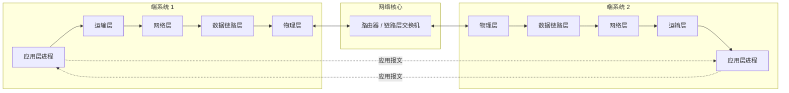

### 2.1.1 网络应用体系结构

在进行软件编码之前，需要对应用程序有一个宽泛的体系结构计划。

需要注意：

- 应用程序体系结构不同于网络体系结构。
- 从应用开发者角度看，网络体系结构是固定的，并为应用提供特定服务集合。
- 应用体系结构由应用开发者设计，规定如何在各种端系统上组织应用程序。

现代网络应用常用的两种主流体系结构是：

1. 客户-服务器体系结构（client-server）
2. 对等（peer-to-peer，P2P）体系结构

#### 1. 客户-服务器体系结构

在客户-服务器体系结构中：

- 有一个总是打开的主机，称为服务器。
- 服务器服务于来自许多其他主机的请求，这些主机称为客户。
- 客户之间不直接通信。
- 服务器具有固定的、周知的 IP 地址。
- 客户可以通过向服务器 IP 地址发送分组来联系服务器。

典型例子：

- Web：
  - Web 服务器总是打开
  - 浏览器运行在客户主机上
  - 浏览器向 Web 服务器请求对象
  - Web 服务器返回所请求对象

著名应用：

- Web
- FTP
- Telnet
- 电子邮件

在实际应用中，单台服务器可能无法处理所有客户请求。因此，常使用数据中心创建强大的虚拟服务器。

数据中心中可能包含数十万台服务器，用于支撑：

- 搜索引擎，如 Google、Bing、百度
- 电子商务，如 Amazon、eBay、阿里巴巴
- Web 电子邮件，如 Gmail、Yahoo Mail
- 社交网络，如 Facebook、Instagram、Twitter、微信

#### 2. P2P 体系结构

在 P2P 体系结构中：

- 对数据中心专用服务器的依赖很小，甚至没有。
- 应用程序在间断连接的主机对之间直接通信。
- 这些主机称为对等方。
- 对等方通常不由服务提供商拥有，而是由用户的台式机、笔记本等控制。
- 对等方通信不必通过专门服务器。

例子：

- BitTorrent 文件共享应用

P2P 体系结构的重要特性：

- 自扩展性：
  - 每个对等方在请求文件时产生工作负载
  - 但每个对等方也通过向其他对等方分发文件增加系统服务能力

- 成本效率：
  - 通常不需要庞大的服务器基础设施
  - 不需要大量服务器带宽

挑战：

- 安全性
- 性能
- 可靠性

因为 P2P 结构高度非集中式，所以未来 P2P 应用仍面临这些挑战。

#### 图 2-2：客户-服务器体系结构与 P2P 体系结构

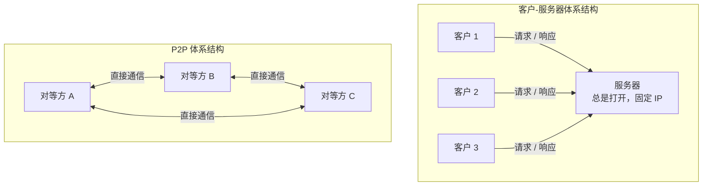

### 2.1.2 进程通信

构建网络应用前，需要了解程序如何运行在多个端系统上，以及程序之间如何相互通信。

从操作系统术语来看，真正进行通信的是进程，而不是程序。

- 进程可以认为是运行在端系统中的一个程序。
- 同一台主机上的进程通过操作系统规定的进程间通信机制通信。
- 本书关注运行在不同端系统上的进程间通信。
- 不同端系统上的进程通过跨越计算机网络交换报文进行通信。

发送进程生成并向网络发送报文；接收进程接收报文，并可能回送报文进行响应。

#### 1. 客户和服务器进程

网络应用程序由成对的进程组成，这些进程通过网络相互发送报文。

例如：

- Web 应用：
  - 浏览器进程是客户
  - Web 服务器进程是服务器

- P2P 文件共享：
  - 下载文件的对等方是客户
  - 上载文件的对等方是服务器

一个进程在 P2P 应用中可能既是客户又是服务器。但在任意一对进程通信会话中，仍然可以区分客户和服务器。

定义：

> 在一对进程之间的通信会话场景中，发起通信的进程被标识为客户；在会话开始时等待联系的进程是服务器。

例如：

- Web 中，浏览器向 Web 服务器发起联系，因此浏览器是客户，Web 服务器是服务器。
- P2P 文件共享中，对等方 A 请求对等方 B 发送某个文件，则在该会话中 A 是客户，B 是服务器。

#### 2. 进程与计算机网络之间的接口

进程通过套接字（socket）向网络发送报文，并从网络接收报文。

类比：

- 进程像一座房子
- 套接字像房子的门

当进程想向另一台主机上的进程发送报文时，它把报文推出这扇门。报文到达目的主机后，通过接收进程的门传递，然后由接收进程处理。

套接字是同一台主机内应用层与运输层之间的接口。由于套接字是建立网络应用程序的可编程接口，因此也称为应用程序和网络之间的 API。

应用开发者可以控制：

- 套接字在应用层端的一切
- 选择运输层协议
- 可能设置少量运输层参数，如最大缓存、最大报文段长度等

应用开发者对套接字的运输层端几乎没有控制权。一旦选择了运输层协议，应用程序就建立在该协议提供的运输服务之上。

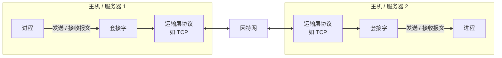

#### 3. 进程寻址

为了向特定目的地发送分组，接收进程需要有地址。

标识接收进程需要两类信息：

1. 主机的地址
2. 目的主机中指定接收进程的标识符

在因特网中：

- 主机由 IP 地址标识。
- IPv4 地址是一个 32 比特的量，IPv6 地址是一个 128 比特的量。本文后续示例使用 IPv4。
- 除主机地址外，发送进程还必须指定接收主机上的接收进程，更具体地说，是接收套接字。
- 一台主机可能运行许多网络应用，因此需要端口号来区分不同进程。

端口号用于标识目的主机中的接收进程。

常见端口号：

| 应用             | 端口号 |
| ---------------- | -----: |
| Web 服务器       |     80 |
| 邮件服务器，SMTP |     25 |
| DNS              |     53 |

所有因特网标准协议的周知端口号列表可在 `www.iana.org` 找到。

### 2.1.3 可供应用程序使用的运输服务

套接字是应用程序进程和运输层协议之间的接口。

发送端应用将报文推进套接字；套接字另一侧的运输层协议负责将报文从接收进程的套接字交付出去。

许多网络提供不止一种运输层协议。开发应用时，必须选择一种可用的运输层协议。选择方式类似于在两个城市之间旅行时选择飞机或火车：不同运输模式提供不同服务，需要根据应用需求选择。

运输层协议能够提供的服务大体可从四个方面分类：

1. 可靠数据传输
2. 吞吐量
3. 定时
4. 安全性

#### 1. 可靠数据传输

分组在计算机网络中可能丢失，例如：

- 路由器缓存溢出
- 分组比特损坏后被丢弃

对于以下应用，数据丢失可能造成严重后果：

- 电子邮件
- 文件传输
- 远程主机访问
- Web 文档传输
- 金融应用

因此，这些应用需要确保一端发送的数据正确、完整地交付给另一端。

如果一个协议提供这样的确保数据交付服务，就认为它提供了可靠数据传输。

运输层协议能够提供的重要服务之一是进程到进程的可靠数据传输。当运输协议提供该服务时，发送进程只要将数据传入套接字，就可以相信数据将无差错地到达接收进程。

如果运输协议不提供可靠数据传输，某些数据可能无法到达接收进程。这对于容忍丢失的应用可能是可以接受的，尤其是多媒体应用，如：

- 交谈式音频
- 交谈式视频

这些应用能够承受一定量数据丢失。丢失数据可能导致播放出现小干扰，而不是致命损伤。

#### 2. 吞吐量

可用吞吐量是指在一条网络路径上的两个进程之间通信时，发送进程能够向接收进程交付比特的速率。

由于其他会话共享路径带宽，且会话会到达和离开，可用吞吐量会随时间波动。

因此，运输层协议可以提供确保的可用吞吐量。应用可以请求 `r bps` 的确保吞吐量，运输协议确保可用吞吐量至少为 `r bps`。

这种服务对许多应用有吸引力。例如：

- 因特网电话应用可能以 32 kbps 对语音编码
- 它需要以该速率向网络发送数据
- 也需要以该速率向接收应用交付数据

如果运输协议不能提供这种吞吐量，应用可能需要：

- 以较低速率编码
- 或放弃发送

具有吞吐量要求的应用称为带宽敏感应用。许多多媒体应用是带宽敏感的。某些多媒体应用可采用自适应编码技术，使编码速率匹配当前可用带宽。

与带宽敏感应用相对的是弹性应用。弹性应用可以根据当时可用带宽或多或少地利用吞吐量。

例子：

- 电子邮件
- 文件传输
- Web 传送

当然，任何应用都不会嫌吞吐量太多。

#### 3. 定时

运输层协议也可以提供定时保证。

例如：

> 发送方注入套接字中的每个比特到达接收方套接字不迟于 100 ms。

这种服务对交互式实时应用有吸引力，例如：

- 因特网电话
- 虚拟环境
- 视频会议
- 多方游戏

这些应用要求数据交付有严格时间限制。

例如：

- 在因特网电话中，较长时延会导致会话出现不自然停顿。
- 在多方游戏和虚拟互动环境中，操作与环境响应之间时延过长会失去真实感。

对于非实时应用，较低时延总比较好，但对端到端时延没有严格约束。

#### 4. 安全性

运输协议可以为应用提供一种或多种安全服务，例如：

- 加密
- 数据完整性
- 端点鉴别

在发送主机中，运输协议可以加密发送进程传输的所有数据；在接收主机中，运输协议可以在将数据交付接收进程之前解密这些数据。

这可以在发送和接收进程之间提供机密性，防止数据在传输过程中被观察到。

### 2.1.4 因特网提供的运输服务

因特网，更一般地说是 TCP/IP 网络，为应用提供两个运输层协议：

- UDP
- TCP

开发新应用时，首先要决定选择 UDP 还是 TCP。每个协议提供不同的服务集合。

| 应用 | 数据丢失 | 带宽 | 时间敏感 |
| | -- | -- | - |
| 文件传输 / 下载 | 不能丢失 | 弹性 | 不 |
| 电子邮件 | 不能丢失 | 弹性 | 不 |
| Web 文档 | 不能丢失 | 弹性，几 kbps | 不 |
| 因特网电话 / 视频会议（音频） | 容忍丢失 | 几 kbps 到 1 Mbps | 是，100 ms |
| 因特网电话 / 视频会议（视频） | 容忍丢失 | 10 kbps 到 5 Mbps | 是，100 ms |
| 流式存储音频 / 视频 | 容忍丢失 | 同上 | 是，几秒 |
| 交互式游戏 | 容忍丢失 | 几 kbps 到 10 kbps | 是，100 ms |
| 智能手机讯息 | 不能丢失 | 弹性 | 是和不是 |

#### 1. TCP 服务

TCP 服务模型包括：

- 面向连接服务
- 可靠数据传输服务

当应用调用 TCP 作为运输协议时，可以获得这两种服务。

##### 面向连接服务

在应用层数据报文开始流动之前，TCP 让客户和服务器交换运输层控制信息。这个过程称为握手。

握手提醒客户和服务器，让它们为大量分组的到来做好准备。握手后，两个进程的套接字之间建立一条 TCP 连接。

TCP 连接是全双工的，即连接双方可以同时收发报文。当应用结束报文发送时，必须拆除连接。

##### 可靠数据传输服务

通信进程可以依靠 TCP 无差错、按适当顺序交付所有发送的数据。

当应用一端将字节流传进套接字时，可以依靠 TCP 将相同字节流交付给接收方套接字，没有字节丢失和冗余。

##### 拥塞控制

TCP 还具有拥塞控制（congestion control）机制。这种服务不一定直接给通信进程带来好处，但能给因特网整体带来好处。

当发送方和接收方之间网络出现拥塞时，TCP 拥塞控制会抑制发送进程。TCP 拥塞控制也试图限制每个 TCP 连接，使其公平共享网络带宽。

##### TCP 安全与 TLS

TCP 和 UDP 本身都不提供加密机制。也就是说，发送进程传进套接字的数据，与经网络传送到目的进程的数据相同。

例如，如果发送进程以明文方式发送口令，该明文口令会经过发送方与接收方之间的所有链路，可能在中间链路被嗅探。

由于隐私和安全问题非常重要，因特网定义了运输层安全 TLS。TLS 通常运行在 TCP 之上，为应用提供安全的字节流。

TLS 不是 TCP 的加强版本，也不是与 TCP、UDP 同层的第三种因特网运输协议，而是位于应用层与 TCP 之间的安全协议。

如果应用要使用 TLS 服务，需要在客户端和服务器端包括 TLS 代码。TLS 有自己的套接字 API，类似于传统 TCP 套接字 API。

使用 TLS 时流程如下：

1. 发送进程向 TLS 套接字传递明文数据。
2. 发送主机中的 TLS 加密数据。
3. TLS 将加密数据传递给 TCP 套接字。
4. 加密数据经因特网传送到接收进程中的 TCP 套接字。
5. 接收套接字将加密数据传递给 TLS。
6. TLS 解密数据。
7. TLS 通过 TLS 套接字将明文数据传递给接收进程。

TLS 提供的关键进程到进程安全服务包括：

- 加密
- 数据完整性
- 端点鉴别

#### 2. UDP 服务

UDP 是一种轻量级运输协议，只提供最低限度服务。

UDP 特点：

- 无连接
- 通信前没有握手过程
- 提供不可靠数据传输服务
- 不保证报文到达接收进程
- 报文可能乱序到达
- 不包括拥塞控制机制

UDP 发送端可以用选定速率向其下层注入数据。但实际端到端吞吐量可能小于该速率，原因可能是中间链路带宽受限或拥塞。

#### 3. 因特网运输协议不提供的服务

TCP 和 UDP 可以提供：

- 可靠数据传输，TCP 提供
- 安全性，可通过 TLS 加强 TCP 提供

但目前的因特网运输协议没有提供：

- 吞吐量保证
- 定时保证

这并不意味着因特网电话等时间敏感应用不能运行在今天因特网上。事实上，这类应用已经运行多年，并且通常工作得相当好，因为它们被设计成尽可能应对这些保证的缺失。

但在时延过大或端到端吞吐量受限时，好的设计也有限制。总之，今天的因特网通常能够为时间敏感应用提供满意服务，但不能提供定时或吞吐量保证。

| 应用 | 应用层协议 | 支撑的运输协议 |
| | -- | -- |
| 电子邮件 | SMTP，RFC 5321 | TCP |
| 远程终端访问 | Telnet，RFC 854 | TCP |
| Web | HTTP，RFC 7230（已被 RFC 9110 系列替代） | TCP |
| 文件传输 | FTP，RFC 959 | TCP |
| 流式多媒体 | HTTP，如 YouTube；DASH | TCP |
| 因特网电话 | SIP，RFC 3261；RTP，RFC 3550；或专用协议，如 Skype | UDP 或 TCP |

> [!warning] 防火墙与 UDP
> 理论上实时通话更想走 UDP，避开 TCP 拥塞控制和队首阻塞。但很多防火墙只放行 TCP，所以应用常做成“先试 UDP，不通再回落到 TCP”。

说明：

- 电子邮件、远程终端访问、Web、文件传输通常使用 TCP，因为 TCP 提供可靠数据传输。
- 因特网电话通常容忍某些丢失，但要求达到一定最小速率，因此开发者通常愿意运行在 UDP 上，以避开 TCP 拥塞控制和分组开销。
- 但由于许多防火墙会阻挡 UDP 流量，因特网电话应用通常设计为：如果 UDP 通信失败，则使用 TCP 作为备份。

### 2.1.5 应用层协议

应用层协议定义了运行在不同端系统上的应用程序进程如何相互传递报文。

应用层协议定义内容包括：

- 交换的报文类型，例如请求报文和响应报文
- 各种报文类型的语法，例如报文字段及字段描述方式
- 字段的语义，即字段中信息的含义
- 确定进程何时以及如何发送报文、如何响应报文的规则

有些应用层协议由 RFC 文档定义，位于公共域中。例如：

- HTTP，超文本传输协议，RFC 7230

如果浏览器开发者遵循 HTTP RFC 规则，开发的浏览器就能访问遵循该标准的 Web 服务器并获取页面。

也有很多应用层协议是专用的，不为公共域所用。例如：

- Skype 使用专用应用层协议

需要区分网络应用和应用层协议。应用层协议只是网络应用的一部分，尽管是非常重要的部分。

例子：

- Web 是客户-服务器应用，允许客户按需从 Web 服务器获得文档。
- Web 应用包括：
  - HTML 文档格式标准
  - Web 浏览器，如 Chrome、IE
  - Web 服务器，如 Apache、Microsoft 服务器程序
  - 应用层协议 HTTP

HTTP 只是 Web 应用的一部分。

另一个例子：

- Netflix 视频服务包括：
  - 存储和传输视频的服务器
  - 管理记账和客户端功能的其他服务器
  - 客户端，如智能手机、平板、台式机上的 Netflix 小程序
  - 应用级 DASH 协议

DASH 也只是 Netflix 应用的一部分。

### 2.1.6 本书涉及的网络应用

本章重点讨论 5 种重要应用：

1. Web
2. 电子邮件
3. 目录服务 DNS
4. 流式视频
5. P2P

讨论顺序：

- 先讨论 Web，因为 Web 极为流行，且 HTTP 较简单易懂。
- 然后讨论电子邮件，因为它是因特网上较早流行的应用程序之一。
- 电子邮件比 Web 更复杂，因为它使用多个应用层协议。
- 接着学习 DNS，它提供因特网目录服务。
- 然后讨论 P2P 文件共享。
- 最后讨论按需流式视频，包括通过内容分发网络 CDN 分发存储视频。

# 第二部分 Web：HTTP、Cookie 与缓存

本部分是应用层篇幅最大的实例。从 HTTP 报文讲到连接管理，再讲到 Cookie 和缓存。

## 2.2 Web 和 HTTP

20 世纪 90 年代以前，因特网主要使用者是研究人员、学者和大学生。他们登录远程主机、传输文件、收发新闻和电子邮件。

到了 20 世纪 90 年代初期，万维网 World Wide Web 出现。Web 是第一个引起公众注意的因特网应用，极大改变了人们交流方式。

Web 的吸引力包括：

- 按需操作：用户需要时就能得到内容
- 发布信息简单、费用低
- 超链接和搜索引擎帮助导航
- 图片和视频增强体验
- 表单、JavaScript、视频等支持交互
- Web 和 HTTP 成为许多应用的平台，如 YouTube、Gmail、Instagram、Google Maps

### 2.2.1 HTTP 概述

Web 的应用层协议是超文本传输协议 HTTP。

HTTP 定义在：

- RFC 1945（HTTP/1.0）
- RFC 7230（HTTP/1.1，已被 RFC 9110 系列替代）
- RFC 7540（HTTP/2，已被 RFC 9113 替代）

> [!note] RFC 会被替代
> 上面括号里的“替代”指 IETF 出了新版本。报文格式和语义没变，学旧编号不影响理解。查最新细节看 9110–9114 系列。

HTTP 由两个程序实现：

- 客户程序
- 服务器程序

它们运行在不同端系统中，通过交换 HTTP 报文进行会话。HTTP 定义报文结构以及客户和服务器交换报文的方式。

#### Web 术语

##### Web 页面

Web 页面也叫文档，由对象组成。

对象是一个文件，例如：

- HTML 文件
- JPEG 图形
- JavaScript 文件
- CSS 样式表文件
- 视频片段

对象可通过 URL 寻址。

多数 Web 页面包含：

- 一个 HTML 基本文件
- 若干引用对象

例如，一个页面包含 HTML 文本和 5 个 JPEG 图形，则该页面有 6 个对象。

##### URL

每个 URL 由两部分组成：

- 存放对象的服务器主机名
- 对象的路径名

例如：

```text
http://www.someSchool.edu/someDepartment/picture.gif
```

其中：

- `www.someSchool.edu` 是主机名
- `/someDepartment/picture.gif` 是路径名

##### 浏览器和 Web 服务器

Web 浏览器实现 HTTP 客户端，例如：

- Chrome
- Internet Explorer
- Firefox

Web 服务器实现 HTTP 服务器端，用于存储 Web 对象。每个对象由 URL 寻址。

流行 Web 服务器：

- Apache
- Microsoft Internet Information Server

HTTP 定义 Web 客户向 Web 服务器请求页面的方式，以及服务器向客户传送页面的方式。

当用户请求 Web 页面，例如点击超链接时，浏览器向服务器发出对该页面所包含对象的 HTTP 请求报文。服务器接收请求，并用包含这些对象的 HTTP 响应报文响应。

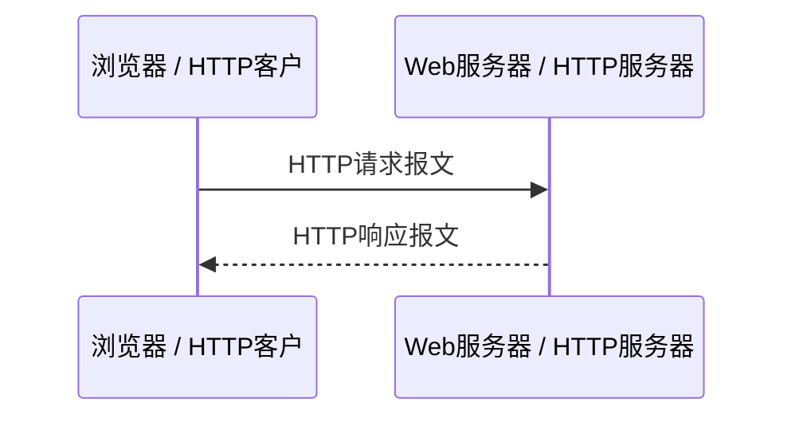

HTTP 使用 TCP 作为支撑运输协议，而不是 UDP。

HTTP 客户首先发起与服务器的 TCP 连接。连接建立后，浏览器和服务器进程通过套接字接口访问 TCP。

- 客户端套接字接口是客户进程与 TCP 连接之间的门
- 服务器端套接字接口是服务器进程与 TCP 连接之间的门

客户向套接字接口发送 HTTP 请求报文，并从套接字接口接收 HTTP 响应报文。服务器从套接字接口接收请求报文，并向套接字接口发送响应报文。

TCP 为 HTTP 提供可靠数据传输服务。这意味着：

- 客户发出的每个 HTTP 请求报文最终能完整到达服务器
- 服务器发出的每个 HTTP 响应报文最终能完整到达客户

HTTP 不用担心数据丢失，也不关注 TCP 从网络数据丢失和乱序故障中恢复的细节。那是 TCP 及协议栈较低层协议的工作。

#### HTTP 是无状态协议

服务器向客户发送被请求文件，但不存储任何关于该客户的状态信息。

如果某客户在几秒内两次请求同一对象，服务器不会因为刚刚提供过该对象就不再响应，而是重新发送该对象，就像完全忘记之前做过的事一样。

因为 HTTP 服务器不保存关于客户的任何信息，所以 HTTP 是无状态协议。

Web 使用客户-服务器应用体系结构：

- Web 服务器总是打开
- 具有固定 IP 地址
- 服务于可能来自数百万不同浏览器的请求

HTTP 初始版本为 HTTP/1.0，可追溯到 20 世纪 90 年代早期。到 2020 年，大部分 HTTP 事务采用 HTTP/1.1。越来越多浏览器和服务器也支持 HTTP/2。

### 2.2.2 非持续连接和持续连接

许多因特网应用中，客户和服务器在较长时间内通信。客户发出一系列请求，服务器对每个请求响应。

当客户-服务器交互通过 TCP 进行时，应用开发者需要决定：

- 每个请求/响应对是否使用单独 TCP 连接
- 所有请求及其响应是否使用相同 TCP 连接

前者称为非持续连接，后者称为持续连接。

HTTP 既可以使用非持续连接，也可以使用持续连接。HTTP 默认使用持续连接，但客户和服务器也可配置为非持续连接。

#### 1. 采用非持续连接的 HTTP

假设一个页面包含：

- 1 个 HTML 基本文件
- 10 个 JPEG 图形

并且这 11 个对象位于同一台服务器上。HTML 文件 URL 为：

```text
http://www.someSchool.edu/someDepartment/home.index
```

非持续连接下传送该页面的步骤：

1. HTTP 客户进程在端口号 80 发起一个到服务器 `www.someSchool.edu` 的 TCP 连接。端口 80 是 HTTP 默认端口。客户和服务器上分别有套接字与该连接相关联。
2. HTTP 客户经套接字向服务器发送 HTTP 请求报文。请求报文中包含路径名 `/someDepartment/home.index`。
3. HTTP 服务器进程经套接字接收请求报文，从存储器 RAM 或磁盘中检索对象 `someDepartment/home.index`，在 HTTP 响应报文中封装对象，并通过套接字向客户发送响应报文。
4. HTTP 服务器进程通知 TCP 断开该 TCP 连接。但直到 TCP 确认客户已经完整收到响应报文为止，才会实际中断连接。
5. HTTP 客户接收响应报文，TCP 连接关闭。报文指出封装对象是 HTML 文件。客户从响应报文中提取 HTML 文件，检查该文件，得到对 10 个 JPEG 图形的引用。
6. 对每个引用的 JPEG 图形对象重复前 4 个步骤。

当浏览器收到 Web 页面后，向用户显示该页面。不同浏览器可能以不同方式解释页面。HTTP 与客户如何解释页面无关。HTTP 规范只定义 HTTP 客户程序与 HTTP 服务器程序之间的通信协议。

非持续连接中，每个 TCP 连接只传输一个请求报文和一个响应报文。因此，如果页面有 11 个对象，则用户请求该页面时会产生 11 个 TCP 连接。

现代浏览器可以配置并行连接数。浏览器打开多个 TCP 连接，并通过多个连接请求同一页面的不同部分。使用并行连接可以缩短响应时间。

##### 往返时间 RTT

往返时间 RTT 是指一个短分组从客户到服务器再返回客户所花费的时间。

RTT 包括：

- 分组传播时延
- 分组在中间路由器和交换机上的排队时延
- 分组处理时延

当用户点击超链接时，浏览器和 Web 服务器之间发起 TCP 连接。这涉及三次握手（three-way handshake）：

1. 客户向服务器发送一个小 TCP 报文段
2. 服务器用小 TCP 报文段确认并响应
3. 客户向服务器返回确认

三次握手前两部分耗费一个 RTT。完成前两部分后，客户结合第三次握手向 TCP 连接发送 HTTP 请求报文。

请求报文到达服务器后，服务器在 TCP 连接上发送 HTML 文件。HTTP 请求/响应用去另一个 RTT。

因此，粗略地讲，总响应时间为：

```text
2 × RTT + 服务器传输 HTML 文件的时间
```

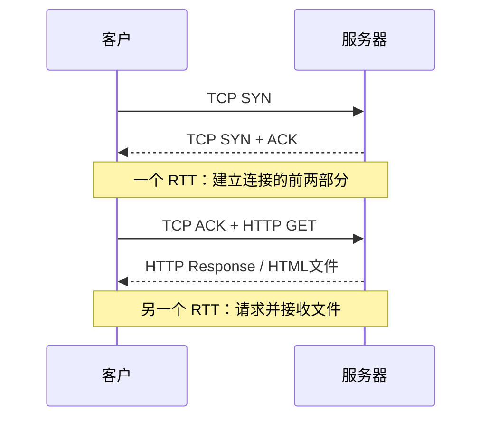

##### 非持续连接的缺点

1. 必须为每一个请求对象建立和维护全新连接。
   - 每个连接在客户和服务器中都要分配 TCP 缓冲区
   - 保持 TCP 变量
   - 给 Web 服务器带来严重负担
   - 一台 Web 服务器可能同时服务数百个客户请求

2. 每个对象经历两倍 RTT 的交付时延。
   - 一个 RTT 用于创建 TCP
   - 另一个 RTT 用于请求和接收对象

#### 2. 采用持续连接的 HTTP

在 HTTP/1.1 持续连接情况下，服务器在发送响应后保持 TCP 连接打开。

在同一客户与服务器之间，后续请求和响应报文可以通过相同连接传送。

例如，一个完整 Web 页面，包括 HTML 基本文件和 10 个图形，可以用单个持续 TCP 连接传送。

更进一步，位于同一台服务器的多个 Web 页面在从该服务器发送给同一个客户时，也可以在单个持续 TCP 连接上发送。

对对象的请求可以一个接一个发出，而不必等待未决请求的回答。这称为流水线。

通常，如果一条连接经过一定时间间隔，即可配置的超时间隔，仍未被使用，HTTP 服务器就关闭该连接。

HTTP/1.1 默认使用持久连接，并支持请求流水线。现代浏览器通常不依赖 HTTP/1.1 流水线，而是使用并行连接或 HTTP/2 多路复用。

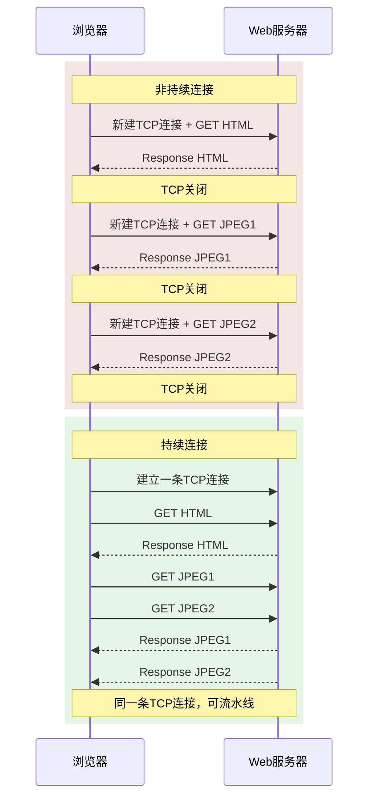

### 2.2.3 HTTP 报文格式

HTTP 规范包含 HTTP 报文格式定义。HTTP 报文有两种：

- 请求报文
- 响应报文

#### 1. HTTP 请求报文

典型 HTTP 请求报文：

```http
GET /somedir/page.html HTTP/1.1
Host: www.someschool.edu
Connection: close
User-agent: Mozilla/5.0
Accept-language: fr
```

观察该报文可以学到很多：

- 报文用普通 ASCII 文本书写，具有一定计算机知识的人可以阅读。
- 报文由 5 行组成，每行由回车和换行符结束。
- 最后一行后再附加一个回车和换行符。
- 请求报文可以有更多行，也可以至少只有一行。

HTTP 请求报文第一行叫请求行，后继行叫首部行。

请求行有 3 个字段：

- 方法字段
- URL 字段
- HTTP 版本字段

方法字段可取值包括：

- GET
- POST
- HEAD
- PUT
- DELETE

绝大部分 HTTP 请求报文使用 GET 方法。当浏览器请求对象时，使用 GET 方法。URL 字段带有请求对象标识。

例如：

```http
GET /somedir/page.html HTTP/1.1
```

表示浏览器正在请求对象 `/somedir/page.html`，并使用 HTTP/1.1 版本。

##### 常见请求首部行

| 首部行 | 含义 |
| - | |
| `Host:` | 指明对象所在主机 |
| `Connection: close` | 告诉服务器不要使用持续连接，发送完对象后关闭连接 |
| `User-agent:` | 指明用户代理，即发送请求的浏览器类型 |
| `Accept-language:` | 表示用户希望得到的对象语言版本 |

示例说明：

- `Host: www.someschool.edu` 指明对象所在主机。
- `Connection: close` 表示浏览器要求服务器发送完被请求对象后关闭连接。
- `User-agent: Mozilla/5.0` 表示浏览器类型。服务器可以为不同类型用户代理发送同一对象的不同版本。
- `Accept-language: fr` 表示用户想得到法语版本；如果没有，则发送默认版本。

##### HTTP 请求报文通用格式

```text
请求行：方法 sp URL sp 版本 crlf
首部行：首部字段名: sp 值 crlf
首部行：首部字段名: sp 值 crlf
空行：crlf
实体体
```

其中：

- `sp` 表示空格
- `crlf` 表示回车换行

使用 GET 方法时，实体体通常为空。使用 POST 方法时，才使用实体体。

当用户提交表单时，HTTP 客户常使用 POST 方法。例如用户向搜索引擎提供搜索关键词。使用 POST 报文时，用户仍可请求 Web 页面，但页面特定内容依赖用户在表单字段中输入的内容。

如果方法字段值为 POST，则实体体中包含用户在表单字段中的输入值。

不过，用表单生成的请求报文不是必须使用 POST 方法。HTML 表单也经常使用 GET 方法，并在请求 URL 中包含输入数据。

例如，一个 GET 表单有两个字段，分别填写 `monkeys` 和 `bananas`，URL 可能为：

```text
www.somesite.com/animalsearch?monkeys&bananas
```

> [!note] 原书的简化写法
> 上面 URL 是原书为讲原理写的简化形式。真实表单一般用 `?key=value&key=value` 的形式，例如 `?q=monkeys&lang=bananas`。读到这里知道“参数拼在 URL 里”就够了。

##### HTTP 方法

| 方法 | 用途 |
| | -- |
| GET | 浏览器请求对象时使用 |
| POST | 常用于表单提交，实体体包含用户输入 |
| HEAD | 类似 GET，但服务器响应时不返回请求对象，常用于调试跟踪 |
| PUT | 常与 Web 发行工具联合使用，允许用户上传对象到指定 Web 服务器指定路径 |
| DELETE | 允许用户或应用程序删除 Web 服务器上的对象 |

#### 2. HTTP 响应报文

典型 HTTP 响应报文：

```http
HTTP/1.1 200 OK
Connection: close
Date: Tue, 18 Aug 2015 15:44:04 GMT
Server: Apache/2.2.3 (CentOS)
Last-Modified: Tue, 18 Aug 2015 15:11:03 GMT
Content-Length: 6821
Content-Type: text/html

(data data data data data ...)
```

响应报文有三部分：

1. 初始状态行
2. 首部行
3. 实体体

实体体是报文主要部分，包含所请求对象本身。

状态行有 3 个字段：

- 协议版本字段
- 状态码
- 相应状态信息

例如：

```http
HTTP/1.1 200 OK
```

表示服务器使用 HTTP/1.1，并且请求成功。

##### 常见响应首部行

| 首部行 | 含义 |
| - | |
| `Connection: close` | 告诉客户发送完报文后关闭 TCP 连接 |
| `Date:` | 服务器产生并发送响应报文的日期和时间 |
| `Server:` | 指示响应报文由哪种 Web 服务器产生 |
| `Last-Modified:` | 对象创建或最后修改的时间与日期 |
| `Content-Length:` | 被发送对象中的字节数 |
| `Content-Type:` | 实体体中对象类型 |

注意：

- `Date:` 不是对象创建或最后修改时间，而是服务器从文件系统中检索对象、插入响应报文并发送响应报文的时间。
- `Last-Modified:` 对客户缓存和代理缓存非常重要。
- 对象类型应通过 `Content-Type:` 指示，而不是仅依赖文件扩展名。

##### HTTP 响应报文通用格式

```text
状态行：版本 sp 状态码 sp 短语 crlf
首部行：首部字段名: sp 值 crlf
首部行：首部字段名: sp 值 crlf
空行：crlf
实体体
```

##### 常见状态码

| 状态码 | 短语                       | 含义                                                 |
| -----: | -------------------------- | ---------------------------------------------------- |
|    200 | OK                         | 请求成功，信息在返回的响应报文中                     |
|    301 | Moved Permanently          | 请求对象已被永久转移，新 URL 在 `Location:` 首部行中 |
|    304 | Not Modified               | 条件 GET 请求中，对象未修改，可使用缓存副本          |
|    400 | Bad Request                | 通用差错代码，请求不能被服务器理解                   |
|    404 | Not Found                  | 被请求文档不在服务器上                               |
|    505 | HTTP Version Not Supported | 服务器不支持请求报文使用的 HTTP 版本                 |

##### 使用 Telnet 查看真实 HTTP 响应

可以用 Telnet 登录 Web 服务器，并输入一行 HTTP 请求报文。

例如：

```bash
telnet gaia.cs.umass.edu 80
```

然后输入：

```http
GET /kurose_ross/interactive/index.php HTTP/1.1
Host: gaia.cs.umass.edu
```

输入最后一行后连续按两次回车。

这会打开到主机 `gaia.cs.umass.edu` 的 80 端口 TCP 连接，并发送 HTTP 请求报文。你将看到包含基本 HTML 文件的响应报文。

如果只想查看 HTTP 报文行，而不获取对象本身，可以用 HEAD 代替 GET。

##### 浏览器和服务器如何决定包含哪些首部行？

浏览器产生的首部行与很多因素有关，包括：

- 浏览器类型和版本
- 浏览器用户配置
- 浏览器是否已有缓存但可能超期的对象版本

Web 服务器表现类似：

- 产品不同
- 版本不同
- 配置不同

这些都会影响响应报文中包含的首部行。

### 2.2.4 用户与服务器的交互：Cookie

HTTP 服务器是无状态的。这简化了服务器设计，并允许工程师开发可同时处理数千个 TCP 连接的高性能 Web 服务器。

但 Web 站点通常希望识别用户，原因包括：

- 限制用户访问
- 将内容与用户身份关联

为此，HTTP 使用 cookie。Cookie 定义在 RFC 6265 中，允许站点对用户进行跟踪。目前大多数商务 Web 站点都使用 cookie。

#### Cookie 技术的 4 个组件

1. HTTP 响应报文中的一个 `Set-cookie:` 首部行
2. HTTP 请求报文中的一个 `Cookie:` 首部行
3. 用户端系统中保留的一个 cookie 文件，由用户浏览器管理
4. Web 站点的一个后端数据库

#### Cookie 工作过程示例

假设 Susan 总是从家中 PC 使用 Internet Explorer 上网，她首次访问 Amazon.com。此前她访问过 eBay。

1. Susan 的请求报文到达 Amazon Web 服务器。
2. Amazon 站点产生一个唯一识别码，并在后端数据库中创建表项。
3. Amazon Web 服务器用包含 `Set-cookie:` 首部的 HTTP 响应报文响应 Susan 浏览器。

例如：

```http
Set-cookie: 1678
```

4. Susan 浏览器收到响应报文后，看到 `Set-cookie:` 首部。
5. 浏览器在它管理的 cookie 文件中添加一行，包含服务器主机名和识别码。

例如：

```text
amazon: 1678
```

该 cookie 文件中可能已经有 eBay 表项，因为 Susan 过去访问过 eBay。

6. Susan 继续浏览 Amazon 网站时，每请求一个 Web 页面，浏览器都会查询 cookie 文件，抽取她对该网站的识别码，并放入 HTTP 请求报文的 cookie 首部行中。

例如：

```http
Cookie: 1678
```

这样，Amazon 服务器可以跟踪 Susan 在 Amazon 站点的活动。Amazon 不必知道 Susan 的名字，但它知道用户 1678 按照什么顺序、在什么时间访问了哪些页面。

Amazon 使用 cookie 提供购物车服务，即维护 Susan 希望购买的物品列表，以便会话结束时一起付款。

如果 Susan 一周后再次访问 Amazon，她的浏览器会继续在请求报文中放入：

```http
Cookie: 1678
```

Amazon 可根据 Susan 过去访问页面向她推荐产品。

如果 Susan 在 Amazon 注册过，提供全名、电子邮件地址、邮政地址和信用卡账号，则 Amazon 可在数据库中将 Susan 的名字与识别码关联，以及她过去访问本站点的所有页面。

这解释了“一键购物”的原理：当 Susan 后续访问中选择购买某物品时，不必重新输入姓名、信用卡账号或地址等信息。

#### Cookie 的作用与争议

Cookie 可用于标识用户。用户首次访问站点时，可能提供用户标识。后续会话中，浏览器向服务器传递 cookie 首部，从而向服务器标识用户。

因此，cookie 可以在无状态 HTTP 之上建立用户会话层。

例如，当用户向基于 Web 的电子邮件系统注册时，浏览器向服务器发送 cookie 信息，允许服务器在用户与应用会话过程中标识用户。

虽然 cookie 能简化因特网购物活动，但其使用仍有争议，因为它被认为可能侵害用户隐私。

> [!warning] 隐私
> 结合 cookie 和注册时填的账户信息，站点能拼出很细的用户画像，还可能卖给第三方。学原理时记住这把双刃剑就行。

结合 cookie 和用户提供的账户信息，Web 站点可以得知许多有关用户的信息，并可能将这些信息卖给第三方。

#### 图 2-10：用 Cookie 跟踪用户状态

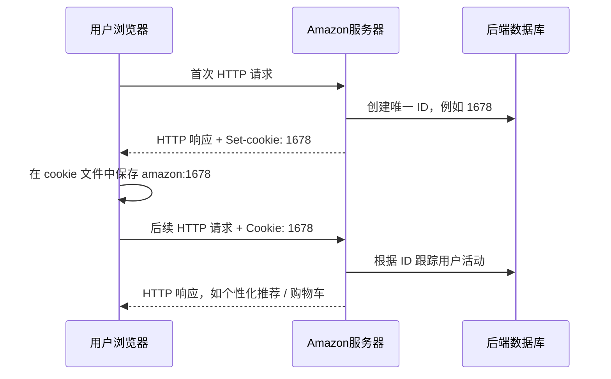

### 2.2.5 Web 缓存

Web 缓存器也叫代理服务器，是能够代表初始 Web 服务器来满足 HTTP 请求的网络实体。

Web 缓存器有自己的磁盘存储空间，并保存最近请求过对象的副本。

可以配置用户浏览器，使所有 HTTP 请求首先指向 Web 缓存器。

#### Web 缓存器工作过程

假设浏览器请求对象：

```text
http://www.someschool.edu/campus.gif
```

过程如下：

1. 浏览器创建到 Web 缓存器的 TCP 连接，并向 Web 缓存器发送该对象的 HTTP 请求。
2. Web 缓存器检查本地是否存储该对象副本。
   - 如果有，Web 缓存器向客户浏览器用 HTTP 响应报文返回该对象。
3. 如果 Web 缓存器中没有该对象：
   - 它打开与该对象初始服务器，即 `www.someschool.edu` 的 TCP 连接。
   - Web 缓存器在该连接上发送对该对象的 HTTP 请求。
   - 初始服务器收到请求后，向 Web 缓存器发送具有该对象的 HTTP 响应。
4. Web 缓存器接收到对象后：
   - 在本地存储空间存储一份副本
   - 向客户浏览器用 HTTP 响应报文发送该副本

Web 缓存器既是服务器又是客户：

- 当它接收浏览器请求并发回响应时，它是服务器。
- 当它向初始服务器发出请求并接收响应时，它是客户。

Web 缓存器通常由 ISP 购买并安装。例如：

- 大学可能在校园网上安装缓存器，并将校园网用户浏览器配置为指向它。
- 住宅 ISP，如 Comcast，可能在其网络上安装一台或多台 Web 缓存器，并预配置配套浏览器指向这些缓存器。

#### 部署 Web 缓存器的原因

1. 减少客户请求响应时间  
   特别是当客户与初始服务器之间瓶颈带宽远低于客户与 Web 缓存器之间瓶颈带宽时。

   如果客户和缓存器之间是高速连接，并且请求对象在缓存器上，则缓存器可以迅速交付对象。

2. 减少机构接入链路到因特网的通信量  
   通过减少通信量，机构不必急于增加带宽，从而降低费用。

   Web 缓存器还能从整体上减少因特网上的 Web 流量，改善所有应用性能。

#### 缓存示例计算

考虑如下场景：

- 机构内部网络是高速局域网
- 局域网通过 15 Mbps 接入链路连接到因特网
- 对象平均长度为 1 Mb
- 机构内浏览器对初始服务器的平均访问速率为每秒 15 个请求
- HTTP 请求报文很小，可忽略
- 从因特网接入链路一侧路由器转发 HTTP 请求开始，到收到响应为止的平均时间为 2 s，称为因特网时延

没有缓存时，接入链路流量强度为：

```text
(15 req/s × 1 Mb) / 15 Mbps = 1.0
```

流量强度为 1.0 时，接入链路时延很大。

解决方案是安装 Web 缓存器。现实中缓存命中率通常在 0.2 到 0.7 之间。假设命中率为 0.4。

因为客户和缓存器连接在同一高速局域网上，40% 请求几乎立即由缓存器响应，时延约 10 ms 以内。

剩下 60% 请求仍由初始服务器满足。但只有 60% 被请求对象通过接入链路，因此接入链路流量强度从 1.0 降到 0.6。

一般来说，在 15 Mbps 链路上，当流量强度小于 0.8 时，对应时延较小，约为几十毫秒。与 2 s 因特网时延相比微不足道。

平均时延可估算为：

```text
0.4 × 0.010 s + 0.6 × 2.01 s ≈ 1.206 s
```

因此，安装 Web 缓存器后响应时延更低，而且不需要升级机构到因特网的链路。缓存器成本较低，很多缓存器使用运行在廉价 PC 上的公共域软件。

#### CDN

通过使用内容分发网络 CDN，Web 缓存器在因特网中发挥越来越重要作用。

CDN 公司在因特网上安装许多地理上分散的缓存器，使大量流量本地化。

例子：

- 共享 CDN：Akamai、Limelight
- 专用 CDN：Google、Netflix

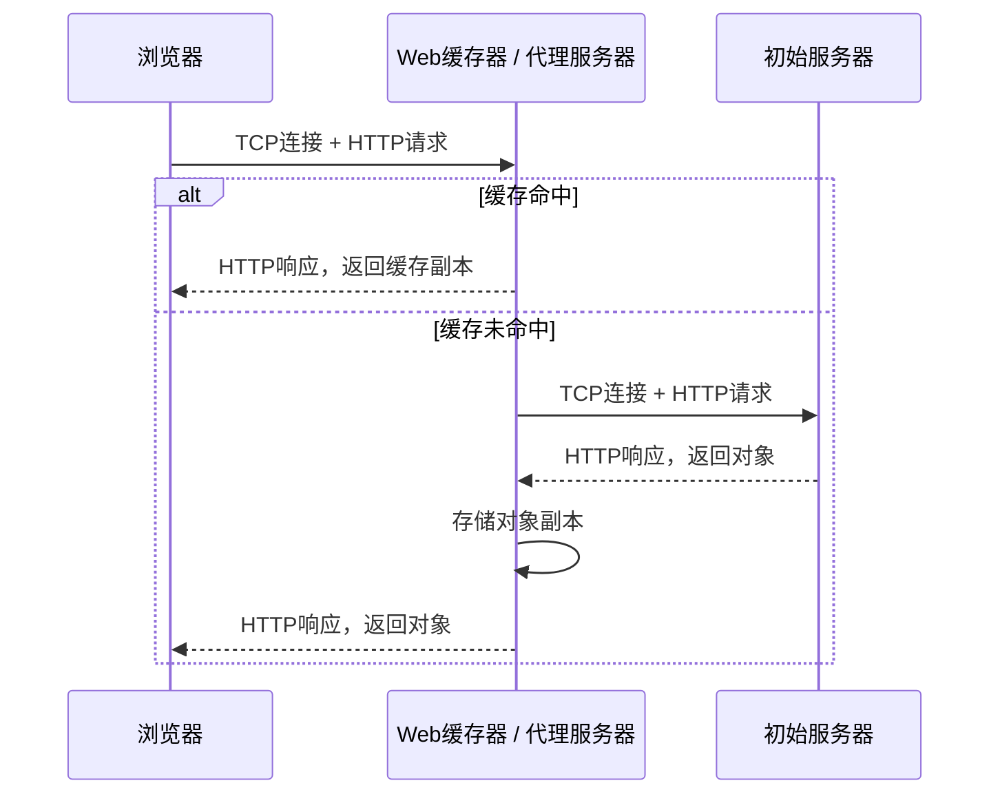

#### 条件 GET 方法

高速缓存能减少用户感知响应时间，但也引入新问题：缓存中的对象副本可能陈旧。

> [!warning] 缓存一致性
> 服务器上的对象可能在缓存后被修改。HTTP 用条件 GET 让缓存先验货，再决定用本地副本还是取新的。

也就是说，保存在服务器中的对象自副本缓存后可能已经被修改。

HTTP 有一种机制允许缓存器证实对象是最新的，这就是条件 GET。

如果 HTTP 请求报文使用 GET 方法，并且包含 `If-Modified-Since:` 首部行，那么该请求报文就是条件 GET 请求报文。

#### 条件 GET 示例

首先，代理缓存器代表请求浏览器向 Web 服务器发送请求：

```http
GET /fruit/kiwi.gif HTTP/1.1
Host: www.exotiquecuisine.com
```

Web 服务器向缓存器发送具有被请求对象的响应报文：

```http
HTTP/1.1 200 OK
Date: Sat, 3 Oct 2015 15:39:29
Server: Apache/1.3.0 (Unix)
Last-Modified: Wed, 9 Sep 2015 09:23:24
Content-Type: image/gif

(data data data data ...)
```

缓存器在将对象转发给请求浏览器的同时，也在本地缓存该对象。重要的是，缓存器存储对象时也存储最后修改日期。

一周后，另一个用户经过该缓存器请求同一对象，该对象仍在缓存器中。由于过去一周中服务器上的对象可能已被修改，缓存器发送条件 GET 执行最新检查：

```http
GET /fruit/kiwi.gif HTTP/1.1
Host: www.exotiquecuisine.com
If-Modified-Since: Wed, 9 Sep 2015 09:23:24
```

`If-Modified-Since:` 的值等于一周前服务器响应报文中的 `Last-Modified:` 值。该条件 GET 报文告诉服务器：仅当自指定日期之后对象被修改过，才发送对象。

假设该对象自 2015 年 9 月 9 日 09:23:24 后没有被修改。Web 服务器向缓存器发送响应：

```http
HTTP/1.1 304 Not Modified
Date: Sat, 10 Oct 2015 15:39:29
Server: Apache/1.3.0 (Unix)

(empty entity body)
```

作为对条件 GET 的响应，服务器仍发送响应报文，但不包含所请求对象。包含对象只会浪费带宽，并增加用户感知响应时间，特别是对象很大时。

状态行中为：

```http
304 Not Modified
```

它告诉缓存器可以使用该对象，并向请求浏览器转发缓存对象副本。

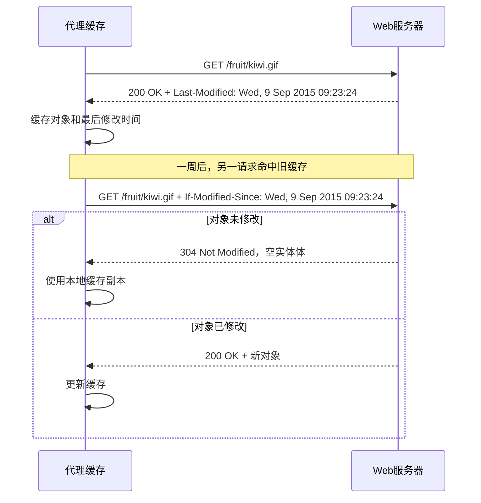

### 2.2.6 HTTP/2

HTTP/2 于 2015 年标准化，定义在 RFC 7540 中，是 HTTP/1.1 之后的首个新版本。HTTP/1.1 于 1997 年标准化。

HTTP/2 公布后，到 2020 年，在排名前 1000 万的 Web 站点中，超过 40% 支持 HTTP/2。大多数浏览器也支持 HTTP/2，包括：

- Chrome
- Internet Explorer
- Safari
- Opera
- Firefox

HTTP/2 的主要目标是减小感知时延，手段包括：

- 经单一 TCP 连接使请求与响应多路复用
- 提供请求优先次序
- 支持服务器推送（实际浏览器支持和部署效果有限）
- 提供 HTTP 首部字段有效压缩

HTTP/2 不改变：

- HTTP 方法
- 状态码
- URL
- 首部字段

它改变的是：

- 数据格式化方法
- 客户和服务器之间传输方式

#### HTTP/1.1 的问题

HTTP/1.1 使用持续 TCP 连接，允许经单一 TCP 连接将一个 Web 页面从服务器发送到客户。

由于每个 Web 页面仅用一个 TCP 连接：

- 服务器套接字数量被压缩
- 每个 Web 页面平等共享网络带宽

但 Web 浏览器开发者发现，经单一 TCP 连接发送一个 Web 页面中所有对象存在队首阻塞问题。

##### 队首阻塞 HOL Blocking

考虑一个 Web 页面，包括：

- HTML 基本页面
- 页面顶部一个大视频片段
- 视频下面许多小对象

假设服务器和客户之间通路有一条低速或中速瓶颈链路，例如低速无线链路。

使用一条 TCP 连接时，视频片段将花费很长时间通过瓶颈链路。与此同时，小对象被延迟，因为它们在视频片段之后等待。

也就是说，链路前面的视频片段阻塞了后面的小对象。

HTTP/1.1 浏览器解决该问题的典型方法是打开多个并行 TCP 连接，让同一 Web 页面的多个对象并行发送给浏览器。这样小对象可以更快到达并呈现，减小用户感知时延。

TCP 拥塞控制也使浏览器倾向于使用多条并行 TCP 连接而非单一持续连接。

粗略来说，TCP 拥塞控制针对每条共享同一条瓶颈链路的 TCP 连接，给出平等共享该链路可用带宽的结果。

如果有 n 条 TCP 连接运行在同一条瓶颈链路上，则每条连接大约得到 `1/n` 带宽。通过打开多条并行 TCP 连接传送一个 Web 页面，浏览器能够“欺骗”并霸占该链路大部分带宽。

许多 HTTP/1.1 浏览器会打开多条并行 TCP 连接（原书以 6 条为例，具体条数因浏览器版本和配置而异），并非只是为了避免 HOL 阻塞，也是为了获得更多带宽。

HTTP/2 的基本目标之一是摆脱，或至少减少传送单一 Web 页面时的并行 TCP 连接数量。这样可以：

- 减少服务器打开和维护的套接字数量
- 允许 TCP 拥塞控制按设计运行

但与只用一个 TCP 连接传送 Web 页面相比，HTTP/2 要求仔细设计相关机制以避免 HOL 阻塞。

#### 1. HTTP/2 成帧

HTTP/2 解决 HOL 阻塞的方案是：

- 将每个报文分成小帧
- 在相同 TCP 连接上交错发送请求和响应报文

考虑一个 Web 页面，包括：

- 一个大视频片段
- 8 个小对象

服务器从希望查看该页面的浏览器处接收到 9 个并行请求。对于每个请求，服务器需要向浏览器发送 9 个相互竞争的报文。

假定所有帧具有固定长度：

- 视频片段由 1000 帧组成
- 每个较小对象由 2 帧组成

使用帧交错技术：

1. 视频片段发送第一帧
2. 每个小对象发送第一帧
3. 视频片段发送第二帧
4. 每个小对象发送第二帧

因此，在总共发送 18 帧（视频 2 帧 + 小对象 16 帧）后，所有小对象就发送完成了。

如果不采用交错，则发送完其他小对象共需要发送：

```text
1000 + 8 × 2 = 1016 帧
```

因此，HTTP/2 成帧机制能够极大减小用户感知时延。

将一个 HTTP 报文分成独立帧、交错发送并在接收端装配起来的能力，是 HTTP/2 最重要的改进。

该成帧过程通过 HTTP/2 协议的成帧子层完成。

当服务器要发送 HTTP 响应时：

1. 响应由成帧子层处理
2. 响应被划分为帧
3. 响应首部字段成为一帧
4. 报文体被划分为一帧或更多附加帧
5. 该响应的帧与其他响应的帧交错并经过单一持续 TCP 连接发送

当这些帧到达客户时：

1. 先在成帧子层装配成初始响应报文
2. 然后像以往一样由浏览器处理

类似地，客户的 HTTP 请求也被划分成帧并交错发送。

除了将每个 HTTP 报文划分为独立帧外，成帧子层也对这些帧进行二进制编码。二进制协议解析更高效，会得到略小一些的帧，并且更不容易出错。

#### 2. 响应报文的优先次序和服务器推

报文优先次序允许开发者根据用户要求安排请求的相对优先权，从而更好优化应用性能。

成帧子层将报文组织为并行数据流发往相同请求方。当客户向服务器发送并发请求时，它能够为正在请求的响应确定优先次序，方法是为每个报文分配 1 到 256 之间的权重。

较大数字表明较高优先权。通过这些权重，服务器能够为具有最高优先权的响应发送第一帧。

此外，客户也可通过指明相关报文段 ID，说明每个报文段与其他报文段的相关性。

HTTP/2 还定义了服务器推送机制，允许服务器为一个客户请求发送多个响应。也就是说，除初始请求的响应外，服务器能够向客户推送额外对象，而无须客户再进行请求。不过，实际浏览器支持和部署效果有限；HTTP/3 已移除该机制。

因为 HTML 基本页指示了页面呈现所需的全部对象，所以这一点可实现。无须等待对这些对象的 HTTP 请求，服务器就能够分析 HTML 页，识别需要的对象，并在接收到明确请求前将它们发送到客户。

服务器推消除了因等待这些请求而产生的额外时延。

### 3. HTTP/3

QUIC 是一种在 UDP 之上实现的用户态运输协议。

QUIC 具有几个能够满足 HTTP 的特征，例如：

- 报文复用，即交错
- 每流流控
- 低时延连接创建

HTTP/3 设计在 QUIC 之上运行。到 2020 年为止，HTTP/3 仍处于标准化过程中；后来 HTTP/3 由 RFC 9114 标准化，QUIC 由 RFC 9000 标准化。

许多 HTTP/2 的目标，如多路复用，已经由 QUIC 的独立流和流控机制支持。HTTP/3 因而不再依赖 TCP。

# 第三部分 电子邮件与目录服务

本部分讲两个经典应用：SMTP 邮件和 DNS。两者都依赖客户-服务器模式，但一个推文件，一个做名字解析。

## 2.3 因特网中的电子邮件

自从有了因特网，电子邮件就在因特网上流行起来。当因特网还在襁褓中时，电子邮件已经成为最流行的应用程序。年复一年，它变得越来越精细、越来越强大。它仍然是当今因特网上最重要和实用的应用程序之一。

与普通邮件一样，电子邮件是异步通信媒介。人们可以方便时收发邮件，不必与他人计划协调。

与普通邮件相比，电子邮件：

- 更快速
- 易于分发
- 价格便宜

现代电子邮件功能包括：

- 添加附件
- 超链接
- HTML 格式文本
- 图片

#### 因特网电子邮件系统总体结构

因特网电子邮件系统有 3 个主要组成部分：

1. 用户代理
2. 邮件服务器
3. 简单邮件传输协议 SMTP

#### 1. 用户代理

用户代理允许用户：

- 阅读报文
- 回复报文
- 转发报文
- 保存报文
- 撰写报文

例子：

- Microsoft Outlook
- Apple Mail
- 基于 Web 的 Gmail
- 智能手机上的 Gmail 客户端

当 Alice 完成邮件撰写时，她的邮件代理向其邮件服务器发送邮件。此时邮件放在邮件服务器的外出报文队列中。

当 Bob 要阅读报文时，他的用户代理在其邮件服务器的邮箱中取得该报文。

#### 2. 邮件服务器

邮件服务器形成电子邮件体系结构的核心。

每个接收方，如 Bob，在某个邮件服务器上有一个邮箱。Bob 的邮箱管理和维护发送给他的报文。

典型邮件发送过程：

1. 从发送方用户代理开始
2. 传输到发送方邮件服务器
3. 再传输到接收方邮件服务器
4. 在接收方邮件服务器中被分发到接收方邮箱

当 Bob 要在邮箱中读取报文时，包含他邮箱的邮件服务器使用用户名和口令鉴别 Bob。

Alice 的邮箱也必须能处理 Bob 邮件服务器故障。如果 Alice 的服务器不能将邮件交付给 Bob 的服务器，Alice 的邮件服务器会在报文队列中保持该报文，并在以后尝试再次发送。

通常每 30 分钟左右尝试一次。如果几天后仍不能成功，服务器删除该报文，并以电子邮件形式通知发送方 Alice。

#### 3. SMTP

SMTP 是因特网电子邮件中主要的应用层协议。

它使用 TCP 可靠数据传输服务，从发送方邮件服务器向接收方邮件服务器发送邮件。

像大多数应用层协议一样，SMTP 也有两个部分：

- 运行在发送方邮件服务器的客户端
- 运行在接收方邮件服务器的服务器端

每台邮件服务器上既运行 SMTP 客户端，也运行 SMTP 服务器端。

当一个邮件服务器向其他邮件服务器发送邮件时，它表现为 SMTP 客户。当一个邮件服务器从其他邮件服务器接收邮件时，它表现为 SMTP 服务器。

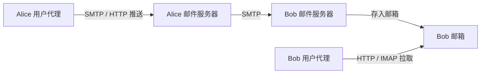

### 2.3.1 SMTP

RFC 5321 给出 SMTP 定义。SMTP 是因特网电子邮件核心。

SMTP 用于从发送方邮件服务器发送报文到接收方邮件服务器。

SMTP 问世时间比 HTTP 长得多。初始 SMTP RFC 可追溯到 1982 年，而 SMTP 在此之前很长时间就已经出现。

尽管电子邮件在因特网上有独特地位，SMTP 也有出色性质，但它仍具有某种陈旧特征，表明它是一种继承技术。

例如，经典 SMTP 的传输模型以 7 比特 ASCII 为基础。现代邮件通常通过 MIME 编码二进制附件，并可使用 8BITMIME、SMTPUTF8 等扩展。

在 20 世纪 80 年代早期，这种限制是明智的，因为当时传输能力不足，没有人会通过电子邮件发送大附件、大图片、声音或视频文件。

但在今天多媒体时代，7 比特 ASCII 限制比较痛苦。使用 SMTP 传送邮件前，需要将二进制多媒体数据编码为 ASCII 码；使用 SMTP 传输后，又需要将 ASCII 码邮件解码还原为多媒体数据。

HTTP 传送前不需要将多媒体数据编码为 ASCII 码。

#### SMTP 基本操作

假设 Alice 想给 Bob 发送一封简单 ASCII 报文。

1. Alice 调用邮件代理程序，提供 Bob 邮件地址，例如：

   ```text
   bob@someschool.edu
   ```

   她撰写报文，然后指示用户代理发送该报文。

2. Alice 的用户代理把报文发到她的邮件服务器。报文被放在报文队列中。

3. 运行在 Alice 邮件服务器上的 SMTP 客户发现报文队列中的这个报文。它创建到运行在 Bob 邮件服务器上 SMTP 服务器的 TCP 连接。

4. 经过一些初始 SMTP 握手后，SMTP 客户通过 TCP 连接发送 Alice 的报文。

5. 在 Bob 邮件服务器上，SMTP 服务器接收该报文。Bob 的邮件服务器然后将该报文放入 Bob 的邮箱中。

6. Bob 方便时调用用户代理阅读该报文。

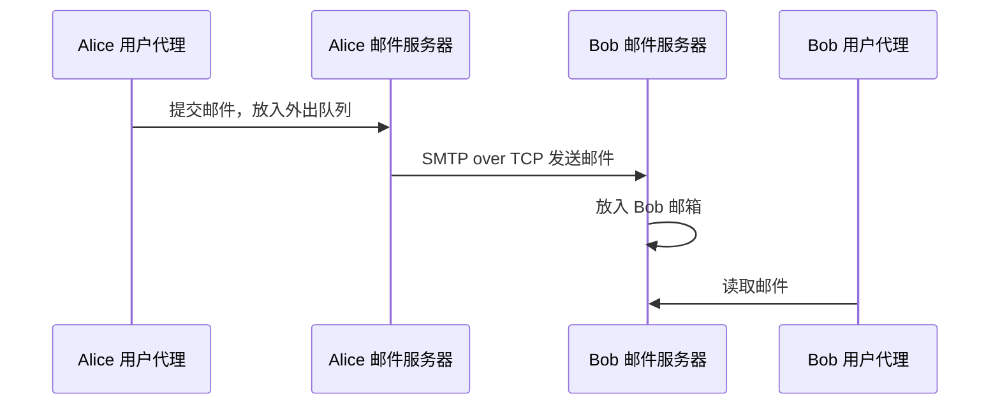

#### SMTP 一般不使用中间邮件服务器

SMTP 一般不使用中间邮件服务器发送邮件，即使两个邮件服务器位于地球两端也是如此。

例如：

- Alice 邮件服务器在中国香港
- Bob 邮件服务器在美国圣路易斯

则 TCP 连接也是从香港服务器到圣路易斯服务器之间直接相连。

特别是，如果 Bob 邮件服务器没有开机，报文会保留在 Alice 邮件服务器上并等待新的尝试。这意味着邮件并不在中间某个邮件服务器中存留。

#### SMTP 客户和服务器交互

SMTP 客户运行在发送邮件服务器主机上，SMTP 服务器运行在接收邮件服务器主机上。

客户在 25 号端口建立到服务器的 TCP 连接。如果服务器没有开机，客户会在稍后继续尝试连接。

一旦连接建立，服务器和客户执行应用层握手，就像人们相互交流前先自我介绍一样。

SMTP 握手阶段中，SMTP 客户指示发送方邮件地址和接收方邮件地址。客户和服务器彼此介绍后，客户发送报文。

SMTP 能依赖 TCP 提供的可靠数据传输，无差错地将邮件投递到接收服务器。

如果客户还有其他邮件要发送到同一服务器，就在相同 TCP 连接上重复处理；否则，它指示 TCP 关闭连接。

#### SMTP 对话示例

客户主机名为 `crepes.fr`，服务器主机名为 `hamburger.edu`。

以 `C:` 开头的 ASCII 文本行是客户交给其 TCP 套接字的行。以 `S:` 开头的 ASCII 文本行是服务器发送给其 TCP 套接字的行。

```text
S: 220 hamburger.edu
C: HELO crepes.fr
S: 250 Hello crepes.fr, pleased to meet you
C: MAIL FROM: <alice@crepes.fr>
S: 250 alice@crepes.fr ... Sender ok
C: RCPT TO: <bob@hamburger.edu>
S: 250 bob@hamburger.edu ... Recipient ok
C: DATA
S: 354 Enter mail, end with "." on a line by itself
C: Do you like ketchup?
C: How about pickles?
C: .
S: 250 Message accepted for delivery
C: QUIT
S: 221 hamburger.edu closing connection
```

客户从邮件服务器 `crepes.fr` 向邮件服务器 `hamburger.edu` 发送报文：

```text
Do you like ketchup?
How about pickles?
```

作为对话一部分，客户发送 5 条命令：

- HELO，是 HELLO 的缩写
- MAIL FROM
- RCPT TO
- DATA
- QUIT

这些命令都是自解释的。

客户通过发送一个只包含一个句点的行，向服务器指示报文结束。按照 ASCII 表示方法，每个报文以 `CRLF.CRLF` 结束，其中 CR 和 LF 分别表示回车和换行。

服务器对每条命令做出回答，每个回答含有一个回答码和一些可选英文解释。

SMTP 使用持续连接：如果发送邮件服务器有几个报文发往同一接收邮件服务器，它可以通过同一个 TCP 连接发送所有这些报文。

对每个报文，客户用新的：

```text
MAIL FROM: <alice@crepes.fr>
```

开始，用一个独立句点指示邮件结束，并且仅当所有邮件发送完后才发送 QUIT。

#### 使用 Telnet 与 SMTP 服务器对话

推荐使用 Telnet 与 SMTP 服务器直接对话。命令为：

```bash
telnet serverName 25
```

其中 `serverName` 是本地邮件服务器名称。

执行后会直接在本地主机与邮件服务器之间建立 TCP 连接。输完命令后，会立即从服务器收到 220 回答。

接下来在适当时机发出 SMTP 命令：

- HELO
- MAIL FROM
- RCPT TO
- DATA
- CRLF.CRLF
- QUIT

### 2.3.2 邮件报文格式

当 Alice 给 Bob 写一封普通信件时，她可能在信上部包含各种环境首部信息，例如：

- Bob 的地址
- 自己的回复地址
- 日期

类似地，当一个人给另一个人发送电子邮件时，包含环境信息的首部位于报文体前面。

这些环境信息包括在一系列首部行中。首部行由 RFC 5322 定义。

首部行和报文体用空行分隔，即回车和换行。

RFC 5322 定义邮件首部行和语义解释的精确格式。

如同 HTTP 一样，每个首部行包含可读文本，由关键词后跟冒号及其值组成。某些关键词必需，另一些可选。

每个报文必须含有：

- `From:` 首部行
- `To:` 首部行

一个报文也许包含：

- `Subject:` 首部行
- 其他可选首部行

重要事实：

这些首部行不同于 SMTP 命令，即使其中包含某些相同词汇，如 from 和 to。

SMTP 命令是 SMTP 握手协议的一部分。邮件首部行则是邮件报文自身的一部分。

典型报文首部：

```text
From: alice@crepes.fr
To: bob@hamburger.edu
Subject: Searching for the meaning of life.
```

在报文首部之后，紧接着一个空白行，然后是以 ASCII 格式表示的报文体。

可以用 Telnet 向邮件服务器发送包含一些首部行的报文，包括 `Subject:` 首部行。命令为：

```bash
telnet serverName 25
```

### 2.3.3 邮件访问协议

一旦 SMTP 将邮件报文从 Alice 邮件服务器交付给 Bob 邮件服务器，该报文就被放入 Bob 邮箱。

假设 Bob 在本地主机，如智能手机或 PC 上运行用户代理程序。考虑在他本地 PC 上也放置一个邮件服务器似乎很自然。这样 Alice 邮件服务器就能直接与 Bob 的 PC 对话。

但这种方法有问题。

邮件服务器管理用户邮箱，并运行 SMTP 客户端和服务器端。如果 Bob 邮件服务器位于他的 PC 上，那么为了及时接收可能任何时候到达的新邮件，他的 PC 必须总是不间断运行并保持在线。

这对许多因特网用户不现实。相反，典型用户通常在本地 PC 上运行用户代理程序，访问存储在总是保持开机的共享邮件服务器上的邮箱。该邮件服务器与其他用户共享。

#### 邮件路径

从 Alice 向 Bob 发送电子邮件报文时，在路径某些点上，需要将报文存放在 Bob 邮件服务器上。

通过让 Alice 用户代理直接向 Bob 邮件服务器发送报文，可以做到这一点。然而，通常 Alice 用户代理和 Bob 邮件服务器之间并没有直接 SMTP 对话。

相反：

1. Alice 用户代理用 SMTP 或 HTTP 将电子邮件报文推入她的邮件服务器。
2. 她的邮件服务器作为 SMTP 客户，再用 SMTP 将该邮件中继到 Bob 邮件服务器。

为什么过程分成两步？

主要是因为如果不通过 Alice 邮件服务器进行中继，Alice 用户代理将没有办法到达一个不可达的目的地邮件服务器。

通过首先将邮件存放在自己的邮件服务器中，Alice 邮件服务器可以重复尝试向 Bob 邮件服务器发送该报文，例如每 30 分钟一次，直到 Bob 邮件服务器变得可运行为止。

如果 Alice 邮件服务器关机，她能向系统管理员申告。

#### 接收方如何取回邮件

Bob 如何通过运行在本地 PC 上的用户代理，获得位于某 ISP 邮件服务器上的邮件？

Bob 的用户代理不能使用 SMTP 得到报文，因为取报文是一个拉操作，而 SMTP 是一个推协议。

今天，Bob 从邮件服务器取回邮件有两种常用方法：

1. 使用基于 Web 的电子邮件或智能手机客户端，如 Gmail。
   - 用户代理使用 HTTP 取回 Bob 的电子邮件。
   - 要求 Bob 电子邮件服务器具有 HTTP 接口和 SMTP 接口。

2. 使用因特网邮件访问协议 IMAP。
   - IMAP 定义在 RFC 3501。
   - 通常用于 Microsoft Outlook 等。

HTTP 和 IMAP 方法都支持 Bob 管理自己邮件服务器中的文件夹，包括：

- 将邮件移动到创建的文件夹
- 删除邮件
- 将邮件标记为重要邮件等


## 2.4 DNS：因特网的目录服务

人类能以很多方式标识，例如：

- 出生证上的名字
- 社会保险号码
- 驾驶证号码

这些标识方法都可用来识别一个人，但在特定环境下，某种识别方法可能比另一种更适合。

例如：

- IRS 计算机更喜欢使用定长社会保险号码，而不是出生证姓名
- 普通人乐于使用更好记的出生证姓名，而不是社会保险号码

因特网上的主机和人类一样，也可以使用多种方式进行标识。

#### 主机标识方式

##### 1. 主机名

主机名示例：

- `www.facebook.com`
- `www.google.com`
- `gaia.cs.umass.edu`

主机名便于记忆，也乐于被人们接受。

但主机名几乎没有提供，即使有也很少，关于主机在因特网中位置的信息。

例如：

```text
www.eurecom.fr
```

以国家码 `.fr` 结束，告诉我们该主机很可能在法国，仅此而已。

况且，主机名可能由不定长字母数字组成，路由器难以处理。

##### 2. IP 地址

主机也可以使用 IP 地址标识。

IP 地址由 4 个字节组成，并有严格层次结构。

例如：

```text
121.7.106.83
```

每个字节被句点分隔，表示 0 到 255 的十进制数字。

IP 地址具有层次结构，因为从左至右扫描它时，会得到越来越具体的关于主机位于因特网何处的信息，即在众多网络的哪个网络里。

类似地，当我们从下向上查看邮政地址时，能够获得该地址位于何处的越来越具体信息。

### 2.4.1 DNS 提供的服务

人们喜欢便于记忆的主机名标识方式，而路由器喜欢定长、有层次结构的 IP 地址。

为了折中这些不同偏好，需要一种能进行主机名到 IP 地址转换的目录服务。这就是域名系统 DNS 的主要任务。

DNS 是：

1. 一个由分层 DNS 服务器实现的分布式数据库
2. 一个使得主机能够查询分布式数据库的应用层协议

DNS 服务器通常是运行 BIND 软件的 UNIX 机器。BIND 是 Berkeley Internet Name Domain。

DNS 协议运行在 UDP 之上，使用 53 号端口。

#### 实践原则：DNS 通过客户-服务器模式提供重要网络功能

与 HTTP、FTP 和 SMTP 一样，DNS 协议是应用层协议，原因在于：

- 使用客户-服务器模式运行在通信端系统之间
- 在通信端系统之间通过下面的端到端运输协议传送 DNS 报文

但在其他意义上，DNS 作用非常不同于 Web 应用、文件传输应用和电子邮件应用。

DNS 不是直接和用户打交道的应用，而是为因特网上的用户应用程序以及其他软件提供一种核心功能：将主机名转换为其背后的 IP 地址。

因特网体系结构的复杂性大多位于网络边缘。DNS 通过采用位于网络边缘的客户和服务器，实现关键的名字到地址转换功能，这也是这种设计原理的另一个范例。

#### DNS 被其他应用使用

DNS 通常由其他应用层协议使用，包括：

- HTTP
- SMTP

用于将用户提供的主机名解析为 IP 地址。

例子：某用户主机上的浏览器，即 HTTP 客户，请求 URL：

```text
www.someschool.edu/index.html
```

为了使用户主机能够将 HTTP 请求报文发送到 Web 服务器 `www.someschool.edu`，用户主机必须获得 `www.someschool.edu` 的 IP 地址。

过程如下：

1. 同一台用户主机上运行 DNS 应用的客户端。
2. 浏览器从 URL 中抽取出主机名 `www.someschool.edu`，并将主机名传给 DNS 应用客户端。
3. DNS 客户向 DNS 服务器发送一个包含主机名的请求。
4. DNS 客户最终收到一份回答报文，其中含有对应于该主机名的 IP 地址。
5. 一旦浏览器接收到来自 DNS 的 IP 地址，它就向位于该 IP 地址 80 端口的 HTTP 服务器进程发起 TCP 连接。

从这个例子可以看到，DNS 给使用它的因特网应用带来额外时延，有时还相当可观。

幸运的是，想获得的 IP 地址通常缓存在一个“附近的” DNS 服务器中，这有助于减少 DNS 网络流量和 DNS 平均时延。

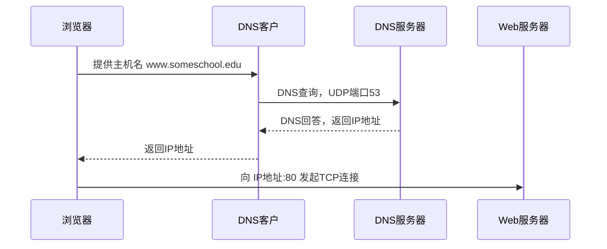

#### DNS 提供的其他服务

除了进行主机名到 IP 地址转换外，DNS 还提供一些重要服务。

##### 1. 主机别名

有着复杂主机名的主机能拥有一个或多个别名。

例如，一台名为：

```text
relay1.west-coast.enterprise.com
```

的主机，可能还有两个别名：

```text
enterprise.com
www.enterprise.com
```

在这种情况下：

```text
relay1.west-coast.enterprise.com
```

也称为规范主机名。

主机别名，当存在时，比主机规范名更容易记忆。

应用程序可以调用 DNS 来获得主机别名对应的规范主机名以及主机 IP 地址。

##### 2. 邮件服务器别名

人们也希望电子邮件地址好记。

例如，如果 Bob 在雅虎邮件上有账户，Bob 的邮件地址可能像：

```text
bob@yahoo.com
```

这样简单。

然而，雅虎邮件服务器的主机名可能更复杂，不像 `yahoo.com` 那样简单好记。例如，规范主机名可能像：

```text
relay1.west-coast.hotmail.com
```

电子邮件应用程序可以调用 DNS，对提供的主机别名进行解析，以获得该主机的规范主机名及其 IP 地址。

事实上，MX 记录允许一个公司的邮件服务器和 Web 服务器使用相同的主机别名。

例如，一个公司的 Web 服务器和邮件服务器都能叫作：

```text
enterprise.com
```

为了获得邮件服务器的规范主机名，DNS 客户应当请求一条 MX 记录；而为了获得其他服务器的规范主机名，DNS 客户应当请求 CNAME 记录。

##### 3. 负载分配（Load Distribution）

DNS 也用于在冗余服务器之间进行负载分配，例如冗余 Web 服务器。

繁忙站点，如：

```text
cnn.com
```

可能冗余分布在多台服务器上。每台服务器运行在不同的端系统上，并具有不同的 IP 地址。

由于这些冗余 Web 服务器的存在，一个规范主机名可以对应一组 IP 地址。DNS 数据库中存储这些 IP 地址集合。

当客户对映射到某地址集合的名字发出 DNS 请求时，DNS 服务器会用整个 IP 地址集合作为响应，但在每次回答中循环这些地址的次序。

因为客户通常总是向 IP 地址排在最前面的服务器发送 HTTP 请求报文，所以 DNS 就在所有这些冗余 Web 服务器之间循环分配负载。

DNS 的循环机制同样可以用于邮件服务器，因此多个邮件服务器可以具有相同的别名。

一些内容分发公司，如 Akamai，也以更复杂的方式使用 DNS，以提供 Web 内容分发。

#### DNS 的标准与复杂性

DNS 由以下 RFC 定义，并在若干附加 RFC 中更新：

- RFC 1034
- RFC 1035

DNS 是一个复杂的系统。本书只学习其运行的主要方面。感兴趣的读者可以参考：

- RFC 1034
- RFC 1035
- Albitz 和 Liu 的 DNS 书籍
- Mockapetris 关于 DNS 组成和工作原理的回顾性文章

### 2.4.2 DNS 工作机理概述

下面给出 DNS 工作过程的总体概述，重点讨论主机名到 IP 地址转换服务。

假设运行在用户主机上的某些应用程序，例如 Web 浏览器或邮件阅读器，需要将主机名转换为 IP 地址。

这些应用程序将调用 DNS 的客户端，并指明需要被转换的主机名。

在很多基于 UNIX 的机器上，应用程序可以调用名称解析函数。旧式程序可能使用 `gethostbyname()`，现代程序通常使用同时支持 IPv4 和 IPv6 的 `getaddrinfo()`：

```c
getaddrinfo()
```

用户主机上的 DNS 客户端接到请求后，向网络中发送一个 DNS 查询报文。

传统 DNS 查询通常使用 UDP 53 端口。响应过大、执行区域传送或特定实现需要时，也会使用 TCP。现代部署还包括 DNS over TLS、DNS over HTTPS 和 DNS over QUIC。

经过若干毫秒到若干秒的时延后，用户主机上的 DNS 客户端接收到一个提供所希望映射的 DNS 回答报文。

这个映射结果随后被传递到调用 DNS 的应用程序。

因此，从用户主机上调用应用程序的角度看，DNS 是一个提供简单、直接转换服务的黑盒子。

但事实上，实现这个服务的黑盒子非常复杂。它由分布于全球的大量 DNS 服务器，以及定义 DNS 服务器与查询主机通信方式的应用层协议组成。

#### 为什么 DNS 不采用单一集中式服务器？

DNS 的一种简单设计是在因特网上只使用一个 DNS 服务器，该服务器包含所有主机名到 IP 地址的映射。

在这种集中式设计中：

- 客户将所有查询直接发往单一 DNS 服务器
- 该 DNS 服务器直接对所有查询客户做出响应

尽管这种设计具有简单性吸引力，但它不适用于当今因特网，因为因特网有着数量巨大并持续增长的主机。

集中式设计的问题包括：

##### 1. 单点故障 Single Point of Failure

如果该 DNS 服务器崩溃，整个因特网随之瘫痪。

##### 2. 通信容量 Traffic Volume

单个 DNS 服务器不得不处理所有 DNS 查询。

这些查询要服务于上亿台主机产生的所有 HTTP 请求报文和电子邮件报文。

##### 3. 远距离的集中式数据库 Distant Centralized Database

单个 DNS 服务器不可能“邻近”所有查询客户。

例如，如果将单台 DNS 服务器放在纽约市，那么所有来自澳大利亚的查询必须传播到地球的另一边，中间也许还要经过低速和拥塞的链路。

这将导致严重时延。

##### 4. 维护 Maintenance

单个 DNS 服务器将不得不为所有因特网主机保留记录。

这不仅将使中央数据库无比庞大，而且它不得不为解决每个新添加的主机而频繁更新。

总的来说，在单一 DNS 服务器上运行集中式数据库完全没有可扩展能力。

因此，DNS 采用了分布式设计方案。

事实上，DNS 是在因特网上实现分布式数据库的精彩范例。

### 2.4.2.1 分布式、层次数据库

为了处理扩展性问题，DNS 使用了大量 DNS 服务器。

这些 DNS 服务器以层次方式组织，并且分布在全世界范围内。

没有一台 DNS 服务器拥有因特网上所有主机的映射。这些映射分布在所有 DNS 服务器上。

大致说来，有三种类型的 DNS 服务器：

1. 根 DNS 服务器
2. 顶级域 TLD DNS 服务器
3. 权威 DNS 服务器

这些服务器构成层次结构。

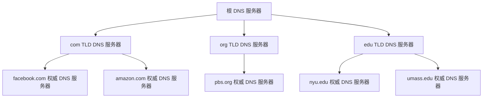

#### 1. 根 DNS 服务器

有超过 1000 台根 DNS 服务器实体遍及全世界。

这些根服务器是 13 个不同根服务器的副本，由 12 个不同组织管理，并通过因特网号码分配机构 IANA 协调。

根名字服务器的全部清单，连同管理它们的组织及其 IP 地址，可以在根服务器相关列表中查到。

根名字服务器提供 TLD 服务器的 IP 地址。

#### 2. 顶级域 TLD DNS 服务器

对于每个顶级域，例如：

```text
com
org
net
edu
gov
```

以及所有国家顶级域，例如：

```text
uk
fr
ca
jp
```

都有 TLD 服务器或服务器集群。

例如：

- Verisign Global Registry Services 公司维护 `com` 顶级域的 TLD 服务器
- Educause 公司维护 `edu` 顶级域的 TLD 服务器

支持 TLD 的网络基础设施可能是大而复杂的。

所有顶级域的列表可以在 TLD 列表中查到。

TLD 服务器提供权威 DNS 服务器的 IP 地址。

#### 3. 权威 DNS 服务器

在因特网上具有公共可访问主机，例如 Web 服务器和邮件服务器的每个组织机构，必须提供公共可访问的 DNS 记录。

这些 DNS 记录将这些主机的名字映射为 IP 地址。

一个组织机构的权威 DNS 服务器收藏这些 DNS 记录。

实现方式有两种：

1. 组织机构自己实现权威 DNS 服务器，以保存这些记录
2. 组织机构支付费用，让这些记录存储在某个服务提供商的权威 DNS 服务器中

多数大学和大公司实现并维护它们自己的基本和辅助备份权威 DNS 服务器。

#### 4. 本地 DNS 服务器

根、TLD 和权威 DNS 服务器都处在 DNS 服务器的层次结构中。

还有另一类重要 DNS 服务器，称为本地 DNS 服务器。

严格说来，本地 DNS 服务器并不属于该层次结构，但它对 DNS 层次结构至关重要。

每个 ISP，例如居民区 ISP 或机构 ISP，都有一台本地 DNS 服务器，也叫默认名字服务器。

当主机与某个 ISP 连接时，该 ISP 提供一台主机的 IP 地址，该主机具有一台或多台本地 DNS 服务器的 IP 地址。通常通过 DHCP 配置。

通过访问 Windows 或 UNIX 的网络状态窗口，用户能够容易地确定自己的本地 DNS 服务器的 IP 地址。

主机的本地 DNS 服务器通常“邻近”本主机。

- 对某机构 ISP 而言，本地 DNS 服务器可能就与主机在同一个局域网中
- 对某居民区 ISP 来说，本地 DNS 服务器通常与主机相隔不超过几台路由器

当主机发出 DNS 请求时，该请求被发往本地 DNS 服务器。

本地 DNS 服务器起着代理作用，并将该请求转发到 DNS 服务器层次结构中。

#### DNS 查询示例：解析 `gaia.cs.umass.edu`

我们来看一个简单的例子。

假设主机：

```text
cse.nyu.edu
```

想知道主机：

```text
gaia.cs.umass.edu
```

的 IP 地址。

同时假设：

- 纽约大学主机 `cse.nyu.edu` 的本地 DNS 服务器为 `dns.nyu.edu`
- `gaia.cs.umass.edu` 的权威 DNS 服务器为 `dns.umass.edu`

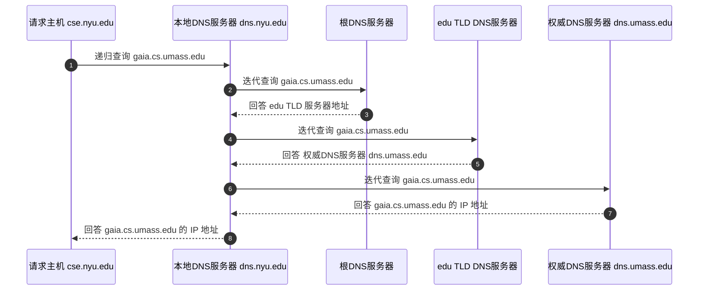

在这个过程中：

1. 主机 `cse.nyu.edu` 首先向它的本地 DNS 服务器 `dns.nyu.edu` 发送 DNS 查询报文
2. 查询报文含有被转换的主机名 `gaia.cs.umass.edu`
3. 本地 DNS 服务器将该报文转发到根 DNS 服务器
4. 根 DNS 服务器注意到 `.edu` 后缀，用 edu TLD DNS 服务器的 IP 地址进行响应
5. 本地 DNS 服务器再向 edu TLD DNS 服务器查询
6. TLD DNS 服务器用负责马萨诸塞大学的权威 DNS 服务器 `dns.umass.edu` 的 IP 地址进行响应
7. 本地 DNS 服务器直接向 `dns.umass.edu` 重发查询报文
8. `dns.umass.edu` 用 `gaia.cs.umass.edu` 的 IP 地址进行响应

注意到在本例中，为了获得一台主机名的映射，共发送了 8 份 DNS 报文：

- 4 份查询报文
- 4 份回答报文

我们将很快看到利用 DNS 缓存减少这种查询流量的方法。

#### 更一般情况：TLD 服务器可能只知道中间 DNS 服务器

前面的例子假设 TLD 服务器知道用于主机的权威 DNS 服务器的 IP 地址。

一般而言，这种假设并不总是正确。

相反，TLD 服务器可能只是知道中间的某个 DNS 服务器，该中间 DNS 服务器依次才能知道用于该主机的权威 DNS 服务器。

例如，再次假设马萨诸塞大学有一台用于本大学的 DNS 服务器：

```text
dns.umass.edu
```

同时假设该大学的每个系都有自己的 DNS 服务器，每个系的 DNS 服务器是本系所有主机的权威服务器。

在这种情况下，当中间 DNS 服务器 `dns.umass.edu` 收到对某主机的请求时，如果该主机名以：

```text
cs.umass.edu
```

结尾，则 `dns.umass.edu` 向 `dns.nyu.edu` 返回：

```text
dns.cs.umass.edu
```

的 IP 地址。

`dns.cs.umass.edu` 是所有以 `cs.umass.edu` 结尾的主机的权威服务器。

本地 DNS 服务器 `dns.nyu.edu` 则向权威 DNS 服务器发送查询，该权威 DNS 服务器向本地 DNS 服务器返回所希望的映射，本地服务器再向请求主机返回该映射。

在这个例子中，共发送了 10 份 DNS 报文。

#### 递归查询与迭代查询

图 2-18 所示的例子利用了：

- 递归查询 recursive query
- 迭代查询 iterative query

从 `cse.nyu.edu` 到 `dns.nyu.edu` 发出的查询是递归查询，因为该查询以自己的名义请求 `dns.nyu.edu` 来获得映射。

而后继的 3 个查询是迭代查询，因为所有回答都是直接返回给 `dns.nyu.edu`。

从理论上讲，任何 DNS 查询既可以是迭代的，也可以是递归的。

例如，图 2-19 显示了一条 DNS 查询链，其中所有查询都是递归的。

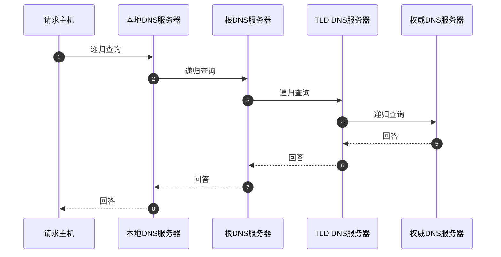

实践中，查询通常遵循图 2-18 中的模式：

- 从请求主机到本地 DNS 服务器的查询是递归的
- 其余查询是迭代的

#### DNS 缓存

至此我们的讨论一直忽略了 DNS 系统的一个非常重要特色：DNS 缓存。

实际上，为了改善时延性能并减少在因特网上到处传输的 DNS 报文数量，DNS 广泛使用了缓存技术。

DNS 缓存的原理非常简单。

在一个请求链中，当某 DNS 服务器接收一个 DNS 回答，例如包含某主机名到 IP 地址的映射时，它就能将映射缓存在本地存储器中。

例如，在图 2-18 中，每当本地 DNS 服务器 `dns.nyu.edu` 从某个 DNS 服务器接收到一个回答，它就能够缓存包含在该回答中的任何信息。

如果在 DNS 服务器中缓存了一个主机名/IP 地址对，另一个对相同主机名的查询到达该 DNS 服务器时，该 DNS 服务器就能够提供所要求的 IP 地址，即使它不是该主机名的权威服务器。

由于主机名与 IP 地址间的映射并不是永久的，DNS 服务器在一段时间后（例如两天，具体 TTL 因域名而异）将丢弃缓存的信息。

#### DNS 缓存示例

假定主机：

```text
apricot.nyu.edu
```

向：

```text
dns.nyu.edu
```

查询主机名：

```text
cnn.com
```

的 IP 地址。

此后，假定过了几个小时，纽约大学的另外一台主机，例如：

```text
kiwi.nyu.edu
```

也向 `dns.nyu.edu` 查询相同主机名。

因为有了缓存，该本地 DNS 服务器可以立即返回 `cnn.com` 的 IP 地址，而不必查询任何其他 DNS 服务器。

本地 DNS 服务器也能够缓存 TLD 服务器的 IP 地址，因而允许本地 DNS 绕过查询链中的根 DNS 服务器。

事实上，因为缓存，除了少数 DNS 查询以外，根服务器通常被绕过。

### 2.4.3 DNS 记录和报文

共同实现 DNS 分布式数据库的所有 DNS 服务器存储了资源记录 Resource Record，简称 RR。

RR 提供了主机名到 IP 地址的映射。

每个 DNS 回答报文包含一条或多条资源记录。

资源记录是一个包含下列字段的四元组：

```text
(Name, Value, Type, TTL)
```

其中：

- TTL 是该记录的生存时间
- TTL 决定了资源记录应当从缓存中删除的时间

在下面给出的记录例子中，我们忽略 TTL 字段。

Name 和 Value 的意义取决于 Type。

#### DNS 资源记录类型

| Type | Name 含义 | Value 含义 | 示例 |
| -- | | -- | - |
| A | 主机名 | 该主机名对应的 IP 地址 | `(relay1.bar.foo.com, 145.37.93.126, A)` |
| NS | 域名，如 `foo.com` | 知道如何获得该域中主机 IP 地址的权威 DNS 服务器主机名 | `(foo.com, dns.foo.com, NS)` |
| CNAME | 主机别名 | 该别名对应的规范主机名 | `(foo.com, relay1.bar.foo.com, CNAME)` |
| MX | 邮件服务器别名 | 该别名对应的邮件服务器规范主机名 | `(foo.com, mail.bar.foo.com, MX)` |

#### 类型 A 记录

如果 Type = A，则对该主机名而言：

- Name 是主机名
- Value 是该主机名对应的 IP 地址

因此，一条类型为 A 的资源记录提供了标准的主机名到 IP 地址映射。

例如：

```text
(relay1.bar.foo.com, 145.37.93.126, A)
```

就是一条类型 A 的记录。

#### 类型 NS 记录

如果 Type = NS，则对该域中的主机而言：

- Name 是域，例如 `foo.com`
- Value 是一个知道如何获得该域中主机 IP 地址的权威 DNS 服务器的主机名

这个记录用于沿着查询链来路由 DNS 查询。

例如：

```text
(foo.com, dns.foo.com, NS)
```

就是一条类型为 NS 的记录。

#### 类型 CNAME 记录

如果 Type = CNAME，则：

- Name 是主机别名
- Value 是该别名对应的规范主机名

该记录能够向查询的主机提供一个主机名对应的规范主机名。

例如：

```text
(foo.com, relay1.bar.foo.com, CNAME)
```

就是一条 CNAME 类型的记录。

#### 类型 MX 记录

如果 Type = MX，则：

- Name 是邮件服务器别名
- Value 是该别名对应的邮件服务器规范主机名

例如：

```text
(foo.com, mail.bar.foo.com, MX)
```

就是一条 MX 记录。

MX 记录允许邮件服务器主机名具有简单的别名。这里为讲原理做了简化：真实 MX 记录的值还带一个优先级数字（同一域名可配多台邮件服务器，按优先级试）。下面的例子只看“别名指到哪台规范主机”这一层。

值得注意的是，通过使用 MX 记录，一个公司的邮件服务器和其他服务器，例如它的 Web 服务器，可以使用相同的别名。

为了获得邮件服务器的规范主机名，DNS 客户应当请求一条 MX 记录；而为了获得其他服务器的规范主机名，DNS 客户应当请求 CNAME 记录。

#### 权威服务器与非权威服务器中的记录

如果一台 DNS 服务器是某特定主机名的权威 DNS 服务器，那么该 DNS 服务器会有一条包含用于该主机名的类型 A 记录。

即使该 DNS 服务器不是其权威 DNS 服务器，它也可能在缓存中包含一条类型 A 记录。

如果服务器不是用于某主机名的权威服务器，那么该服务器将包含一条类型 NS 记录，该记录对应于包含主机名的域。

它还将包含一条类型 A 记录，该记录提供了在 NS 记录的 Value 字段中的 DNS 服务器的 IP 地址。

举例来说，假设一台 edu TLD 服务器不是主机：

```text
gaia.cs.umass.edu
```

的权威 DNS 服务器。

则该服务器将包含一条包括主机 `gaia.cs.umass.edu` 的域记录，例如：

```text
(umass.edu, dns.umass.edu, NS)
```

该 edu TLD 服务器还将包含一条类型 A 记录，例如：

```text
(dns.umass.edu, 128.119.40.111, A)
```

该记录将名字 `dns.umass.edu` 映射为一个 IP 地址。

### 2.4.4 DNS 报文

在本节前面，我们提到了 DNS 查询和回答报文。

DNS 只有这两种报文，并且查询和回答报文有着相同的格式。

DNS 报文可分为首部区域和四个数据区域。

| 区域                 | 字段/内容   | 说明                                                                  |
| -------------------- | ----------- | --------------------------------------------------------------------- |
| 首部区域，前 12 字节 | 标识符      | 16 比特数，用于标识查询。回答报文复制该标识符，以便客户匹配请求和回答 |
|                      | 标志        | 包含若干标志位                                                        |
|                      | 问题数      | 问题区域中的条目数                                                    |
|                      | 回答 RR 数  | 回答区域中的资源记录数                                                |
|                      | 权威 RR 数  | 权威区域中的资源记录数                                                |
|                      | 附加 RR 数  | 附加信息区域中的资源记录数                                            |
| 问题区域             | 名字字段    | 正在被查询的主机名字                                                  |
|                      | 类型字段    | 询问的问题类型，例如 A 或 MX                                          |
| 回答区域             | 资源记录 RR | 对最初请求名字的响应，可包含多条 RR                                   |
| 权威区域             | 资源记录 RR | 其他权威服务器的记录                                                  |
| 附加信息区域         | 资源记录 RR | 其他有帮助的记录                                                      |

#### DNS 标志字段中的关键标志

| 标志 | 含义 |
| | - |
| 查询/回答标志位 | 1 比特。0 表示查询报文，1 表示回答报文 |
| 权威的标志位 | 1 比特。当某 DNS 服务器是所请求名字的权威 DNS 服务器时，在回答报文中置位 |
| 希望递归标志位 | 1 比特。如果客户在该 DNS 服务器没有某记录时希望它执行递归查询，则设置该位 |
| 递归可用标志位 | 1 比特。如果该 DNS 服务器支持递归查询，则在回答报文中置位 |

#### 问题区域

问题区域包含了正在进行的查询信息。

该区域包括：

1. 名字字段  
   包含正在被查询的主机名字。

2. 类型字段  
   指出有关该名字的正被询问的问题类型。

例如：

- 主机地址是否与一个名字相关联，类型为 A
- 某个名字的邮件服务器是否与某个名字相关联，类型为 MX

#### 回答区域

在来自 DNS 服务器的回答中，回答区域包含了对最初请求名字的资源记录。

每个资源记录中有：

- Type 字段，如 A、NS、CNAME、MX
- Value 字段
- TTL 字段

在回答报文的回答区域中可以包含多条 RR。

因此，一个主机名能够有多个 IP 地址。

例如，前面讨论的冗余 Web 服务器就可能出现这种情况。

#### 权威区域

权威区域包含了其他权威服务器的记录。

#### 附加信息区域

附加信息区域包含了其他有帮助的记录。

例如，对于一个 MX 请求的回答报文：

- 回答区域包含一条资源记录，该记录提供了邮件服务器的规范主机名
- 附加信息区域包含一个类型 A 记录，该记录提供了用于该邮件服务器规范主机名的 IP 地址

#### 使用 nslookup 发送 DNS 查询

你愿意从正在工作的主机直接向某些 DNS 服务器发送 DNS 查询报文吗？

使用 `nslookup` 程序能够容易地做到这一点。

对于多数 Windows 和 UNIX 平台，`nslookup` 程序是可用的。

例如，从一台 Windows 主机打开命令提示符界面，直接键入：

```bash
nslookup
```

即可调用 `nslookup` 程序。

在调用 `nslookup` 后，你能够向任何 DNS 服务器发送 DNS 查询，包括：

- 根 DNS 服务器
- TLD DNS 服务器
- 权威 DNS 服务器

在接收到来自 DNS 服务器的回答后，`nslookup` 将显示包括在该回答中的记录，格式为人可读形式。

从你自己的主机运行 `nslookup` 还有一种方法，即访问允许你远程应用 `nslookup` 的许多 Web 站点之一。

在一个搜索引擎中键入 `nslookup`，就能够得到这些站点中的一个。

本章最后的 DNS Wireshark 实验将使读者更为详细地研究 DNS。

### 2.4.5 在 DNS 数据库中插入记录

上面的讨论只是关注如何从 DNS 数据库中取数据。

你可能想知道这些数据最初是怎么进入数据库中的。

我们在一个特定例子中看看这是如何完成的。

假定你刚刚创建了一个称为网络乌托邦 Network Utopia 的创业公司：

```text
networkutopia.com
```

你必定要做的第一件事是在注册登记机构注册域名。

注册登记机构是一个商业实体，它：

- 验证该域名的唯一性
- 将该域名输入 DNS 数据库
- 对提供的服务收取少量费用

1999 年前，唯一的注册登记机构是 Network Solutions，它独家经营对于 `com`、`net` 和 `org` 域名的注册。

但是现在有许多注册登记机构竞争客户。

因特网名字和地址分配机构 ICANN 向各种注册登记机构授权。

在：

```text
http://www.internic.net
```

可以找到授权的注册登记机构的完整列表。

#### 注册域名时提供权威 DNS 服务器信息

当你向某些注册登记机构注册域名：

```text
networkutopia.com
```

时，需要向该机构提供你的基本、辅助权威 DNS 服务器的名字和 IP 地址。

假定该名字和 IP 地址是：

```text
dns1.networkutopia.com
dns2.networkutopia.com
```

以及：

```text
212.212.212.1
212.212.212.2
```

对这两个权威 DNS 服务器的每一个，该注册登记机构确保将一个类型 NS 和一个类型 A 的记录输入 TLD `com` 服务器。

特别是对于用于 `networkutopia.com` 的基本权威服务器，该注册登记机构将下列两条资源记录插入 DNS 系统中：

```text
(networkutopia.com, dns1.networkutopia.com, NS)
```

```text
(dns1.networkutopia.com, 212.212.212.1, A)
```

你还必须确保用于 Web 服务器：

```text
www.networkutopia.com
```

的类型 A 资源记录，以及用于邮件服务器：

```text
mail.networkutopia.com
```

的类型 MX 资源记录被输入你的权威 DNS 服务器中。

直到最近，每台 DNS 服务器中的内容都是静态配置的，例如来自系统管理员创建的配置文件。

最近，在 DNS 协议中添加了一个 UPDATE 选项，允许通过 DNS 报文对数据库中的内容进行动态添加或删除。

RFC 2136 和 RFC 3007 定义了 DNS 动态更新。

#### 验证 DNS 记录插入后的访问过程

一旦完成所有这些步骤，人们将能够访问你的 Web 站点，并向你公司的雇员发送电子邮件。

我们通过验证该说法的正确性来总结 DNS 的讨论。

这种验证也有助于充实我们已经学到的 DNS 知识。

假定在澳大利亚的 Alice 要观看：

```text
www.networkutopia.com
```

的 Web 页面。

如前面所讨论，她的主机将首先向其本地 DNS 服务器发送请求。

该本地服务器接着联系一个 TLD `com` 服务器。

如果 TLD `com` 服务器的地址没有被缓存，该本地 DNS 服务器也将必须与根 DNS 服务器相联系。

该 TLD 服务器包含前面列出的类型 NS 和类型 A 资源记录，因为注册登记机构将这些资源记录插入所有 TLD `com` 服务器。

该 TLD `com` 服务器向 Alice 的本地 DNS 服务器发送一个回答，该回答包含了这两条资源记录。

本地 DNS 服务器则向：

```text
212.212.212.1
```

发送一个 DNS 查询，请求对应于：

```text
www.networkutopia.com
```

的类型 A 记录。

该记录提供了所希望的 Web 服务器的 IP 地址，例如：

```text
212.212.71.4
```

本地 DNS 服务器将该地址回传给 Alice 的主机。

Alice 的浏览器此时能够向主机：

```text
212.212.71.4
```

发起一个 TCP 连接，并在该连接上发送一个 HTTP 请求。

当一个人在网上冲浪时，背后正在进行许多 DNS、TCP 和 HTTP 交互。

### 2.4.6 关注安全性：DNS 脆弱性

我们已经看到 DNS 是因特网基础设施的一个至关重要的组件。

对于包括 Web、电子邮件等许多重要服务，没有 DNS 都不能正常工作。

因此，我们自然要问：

- DNS 怎么会受到攻击？
- DNS 是一个易受攻击的目标吗？
- 它是将会被淘汰的服务吗？
- 大多数因特网应用会随之一起无法工作吗？

#### 1. DDoS 带宽洪泛攻击

想到的第一种针对 DNS 服务的攻击是分布式拒绝服务 DDoS 带宽洪泛攻击。

例如，某攻击者可能试图向每个 DNS 根服务器发送大量分组，使得大多数合法 DNS 请求得不到回答。

这种对 DNS 根服务器的大规模 DDoS 攻击实际发生在 2002 年 10 月 21 日。

在这次攻击中，攻击者利用一个僵尸网络向 13 个 DNS 根服务器中的每个都发送了大批 ICMP ping 报文负载。

幸运的是，这种大规模攻击所带来的损害很小，对用户的因特网体验几乎没有或根本没有影响。

攻击者的确成功地将大量分组指向了根服务器，但许多 DNS 根服务器受到了分组过滤器的保护。

配置的分组过滤器阻挡了所有指向根服务器的 ICMP ping 报文。

这些被保护的服务器因此未受伤害，并且与平常一样发挥着作用。

此外，大多数本地 DNS 服务器缓存了顶级域名服务器的 IP 地址，使得这些请求过程通常为 DNS 根服务器分流。

#### 2. 针对 TLD 服务器的 DDoS 攻击

对 DNS 更为有效的潜在 DDoS 攻击，将是向顶级域名服务器发送大量 DNS 请求。

例如，向所有处理 `.com` 域的顶级域名服务器发送大量请求。

过滤指向 DNS 服务器的 DNS 请求将更为困难，并且顶级域名服务器不像根服务器那样容易绕过。

这种对顶级域名服务提供商的攻击发生在 2016 年 10 月 21 日。

该 DDoS 攻击是通过发送大量 DNS 查找请求进行的。

这些请求来自一个由十万多个物联网设备组成的僵尸网络。

这些设备包括被 Mirai 恶意软件感染的：

- 打印机
- 网络相机
- 住宅网关
- 婴儿监视器

攻击几乎持续了一整天。

亚马逊、推特、Netflix、GitHub 和 Spotify 都受到了干扰。

#### 3. 中间人攻击与 DNS 投毒

DNS 也可能潜在地以其他方式被攻击。

在中间人攻击中，攻击者截获来自主机的请求，并返回伪造的回答。

在 DNS 投毒攻击中，攻击者向一台 DNS 服务器发送伪造的回答，诱使服务器在它的缓存中接收伪造的记录。

这些攻击中的任意一种都可能被用于不良用途。

例如，将没有疑心的 Web 用户重定向到攻击者的 Web 站点。

DNS 安全扩展套件 DNSSEC 已经设计并部署，用于防范这些漏洞。

作为 DNS 的安全版本，DNSSEC 能对抗不少这类攻击，但部署是渐进的，各域覆盖程度不一（相关标准见 RFC 4033 系列）。

相关标准包括：

- RFC 4033

# 第四部分 P2P 与视频分发

本部分从文件分发讲到流媒体。P2P 解决扩展性，CDN 解决距离和热点。

## 2.5 P2P 文件分发

到目前为止本章中描述的应用，包括 Web、电子邮件和 DNS，都采用了客户-服务器体系结构，极大地依赖于总是打开的基础设施服务器。

2.1.1 节讲过，使用 P2P 体系结构，对总是打开的基础设施服务器依赖最少，或者没有依赖。

与之相反，成对间歇连接的主机，称为对等方，彼此直接通信。

这些对等方并不为服务提供商所拥有，而是受用户控制的桌面计算机和笔记本电脑。

在本节中，我们将研究一个非常自然的 P2P 应用，即从单一服务器向大量主机，称为对等方，分发一个大文件。

该文件也许是：

- 一个新版的 Linux 操作系统
- 对于现有操作系统或应用程序的一个软件补丁
- 一个 MPEG 视频文件

在客户-服务器文件分发中，服务器必须向每个对等方发送该文件的一个副本。

也就是说，服务器承受了极大负担，并且消耗了大量服务器带宽。

在 P2P 文件分发中，每个对等方能够向任何其他对等方重新分发它已经收到的该文件的任何部分，从而在分发过程中协助服务器。

到 2020 年为止，最为流行的 P2P 文件分发协议是 BitTorrent。

该应用程序最初由 Bram Cohen 研发。

现在有许多不同的、独立且符合 BitTorrent 协议的 BitTorrent 客户，就像有许多符合 HTTP 协议的 Web 浏览器客户一样。

在下面的小节中，我们首先考察在文件分发环境中 P2P 体系结构的自扩展性。

然后我们更为详细地描述 BitTorrent，突出它的最为重要的特性。

### 2.5.1 P2P 体系结构的扩展性

为了将客户-服务器体系结构与 P2P 体系结构进行比较，阐述 P2P 的内在自扩展性，我们现在考虑一个用于两种体系结构类型的简单定量模型。

该模型用于将一个文件分发给一个固定对等方集合。

如图 2-21 所示，服务器和对等方使用接入链路与因特网相连。

其中：

- `us` 表示服务器接入链路的上载速率
- `ui` 表示第 `i` 对等方接入链路的上载速率
- `di` 表示第 `i` 对等方接入链路的下载速率
- `F` 表示被分发的文件长度，以比特计
- `N` 表示要获得该文件副本的对等方数量

分发时间 distribution time 是所有 `N` 个对等方得到该文件副本所需要的时间。

在下面分析分发时间的过程中，我们对客户-服务器和 P2P 体系结构做了简化，并且通常是准确的假设：

- 因特网核心具有足够带宽
- 所有瓶颈都在网络接入链路
- 服务器和客户没有参与任何其他网络应用
- 它们的所有上传和下载访问带宽能被全部用于分发该文件

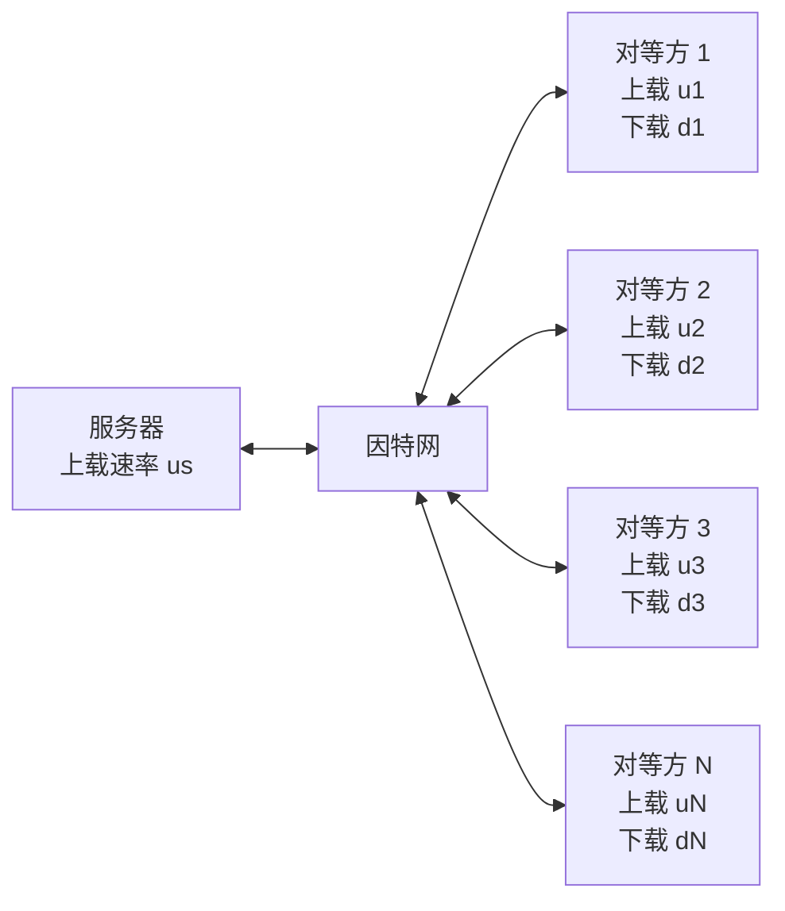

#### 客户-服务器体系结构的分发时间

我们首先来确定对于客户-服务器体系结构的分发时间，将其表示为：

```text
D_CS
```

在客户-服务器体系结构中，没有对等方帮助分发文件。

我们的观察如下。

##### 观察 1：服务器必须发送 N 个副本

服务器必须向 N 个对等方的每个传输该文件的一个副本。

因此，该服务器必须传输：

```text
N F bit
```

因为该服务器的上载速率是 `us`，分发该文件的时间必定至少为：

```text
NF / us
```

##### 观察 2：最慢下载者决定下限

令 `dmin` 表示具有最小下载速率的对等方的下载速率，即：

```text
dmin = min{d1, d2, ..., dN}
```

具有最小下载速率的对等方不可能在少于：

```text
F / dmin
```

的时间内获得该文件的所有 F bit。

因此，最小分发时间至少为：

```text
F / dmin
```

将这两个观察放在一起，我们得到：

$$
D_{CS} \ge \max \left\{ \frac{NF}{u_s}, \frac{F}{d_{\min}} \right\}
$$

该式提供了对于客户-服务器体系结构的最小分发时间的下界。

在课后习题中将请你给出服务器能够调度它的传输以便实际取得该下界的方法。

因此我们取上面提供的这个下界作为实际发送时间，即：

$$
D_{CS} = \max \left\{ \frac{NF}{u_s}, \frac{F}{d_{\min}} \right\}
\tag{2-1}
$$

我们从式 2-1 看到，对足够大的 N，客户-服务器分发时间由：

```text
NF / us
```

确定。

所以，该分发时间随着对等方 N 的数量线性增加。

因此举例来说，如果从某星期到下星期对等方的数量从 1000 增加了 1000 倍，到了 100 万，将该文件分发到所有对等方所需要的时间就要增加 1000 倍。

#### P2P 体系结构的分发时间

我们现在来对 P2P 体系结构进行简单分析。

其中每个对等方能够帮助服务器分发该文件。

特别是，当一个对等方接收到某些文件数据，它能够使用自己的上载能力重新将数据分发给其他对等方。

计算 P2P 体系结构的分发时间在某种程度上比计算客户-服务器体系结构的更为复杂，因为分发时间取决于每个对等方如何向其他对等方分发该文件的各个部分。

无论如何，能够得到对该最小分发时间的一个简单表达式。

至此，我们先做如下观察。

##### 观察 1：服务器至少要发送文件一次

在分发的开始，只有服务器具有文件。

为了使社区的这些对等方得到该文件，该服务器必须经其接入链路至少发送该文件的每个比特一次。

因此，最小分发时间至少是：

```text
F / us
```

与客户-服务器方案不同，由服务器发送过一次的比特可能不必由该服务器再次发送，因为对等方在它们之间可以重新分发这些比特。

##### 观察 2：最慢下载者仍然决定下限

与客户-服务器体系结构相同，具有最低下载速率的对等方不能够以小于：

```text
F / dmin
```

的分发时间获得所有 F bit。

因此，最小分发时间至少为：

```text
F / dmin
```

##### 观察 3：系统总上载能力决定下限

最后，观察到系统整体的总上载能力等于服务器的上载速率加上每个单独对等方的上载速率，即：

$$
u_{\text{total}} = u_s + u_1 + u_2 + \cdots + u_N
$$

系统必须向这 N 个对等方的每个交付 F bit，因此总共交付：

```text
NF bit
```

这不能以快于 `u_total` 的速率完成。

因此，最小的分发时间也至少是：

$$
\frac{NF}{u_s + u_1 + u_2 + \cdots + u_N}
$$

将这三项观察放在一起，我们获得了对 P2P 的最小分发时间，表示为：

```text
D_P2P
```

$$
D_{P2P} \ge \max \left\{
\frac{F}{u_s},
\frac{F}{d_{\min}},
\frac{NF}{u_s + \sum_{i=1}^{N} u_i}
\right\}
\tag{2-2}
$$

式 2-2 提供了对于 P2P 体系结构的最小分发时间的下界。

这说明，如果我们认为一旦每个对等方接收到一个比特就能够重分发一个比特的话，则存在一个重新分发方案能实际取得这种下界。

我们将在课后习题中证明该结果的一种特殊情形。

实际上，被分发的是文件块，而不是一个个比特。

式 2-2 能够作为实际最小分发时间的很好近似。

因此，我们取由式 2-2 提供的下界作为实际的最小分发时间，即：

$$
D_{P2P} = \max \left\{
\frac{F}{u_s},
\frac{F}{d_{\min}},
\frac{NF}{u_s + \sum_{i=1}^{N} u_i}
\right\}
\tag{2-3}
$$

图 2-22 比较了客户-服务器和 P2P 体系结构的最小分发时间。

其中假定所有对等方具有相同的上载速率 `u`。

设置：

```text
F / u = 1 小时
us = 10u
dmin >= us
```

因此：

- 在一个小时中一个对等方能够传输整个文件
- 服务器的传输速率是对等方上载速率的 10 倍
- 为了简化起见，对等方的下载速率被设置得足够大，使之不会产生影响

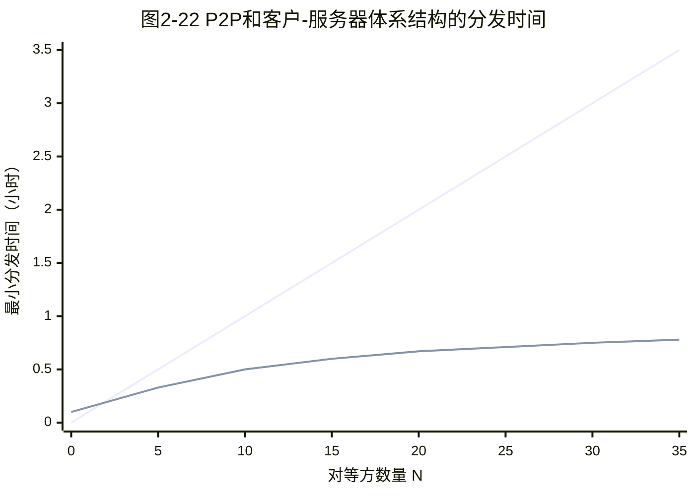

说明：

- 上方近似直线表示客户-服务器体系结构
- 下方逐渐趋于饱和的曲线表示 P2P 体系结构

我们从图 2-22 中看到，对于客户-服务器体系结构，随着对等方数量的增加，分发时间呈线性增长并且没有界。

然而，对于 P2P 体系结构，最小分发时间不仅总是小于客户-服务器体系结构的分发时间，并且对于任意的对等方数量 N，总是小于 1 小时。

因此，具有 P2P 体系结构的应用程序能够是自扩展的。

这种扩展性的直接成因是：对等方除了是比特的消费者外，还是它们的重新分发者。

### 2.5.2 BitTorrent

BitTorrent 是一种用于文件分发的流行 P2P 协议。

用 BitTorrent 的术语来讲，参与一个特定文件分发的所有对等方的集合被称为一个洪流 torrent。

在一个洪流中的对等方彼此下载等长度的文件块 chunk。

典型的块长度为 256 KB。

当一个对等方首次加入一个洪流时，它没有块。

随着时间的流逝，它累积了越来越多的块。

当它下载块时，也为其他对等方上载了多个块。

一旦某对等方获得了整个文件，它也许：

- 自私地离开洪流
- 或者大公无私地留在该洪流中，并继续向其他对等方上载块

同时，任何对等方可能在仅具有块的子集的情况下就离开该洪流，并在以后重新加入该洪流中。

#### BitTorrent 的主要机制

每个洪流具有一个基础设施节点，称为追踪器 tracker。

当一个对等方加入某洪流时，它向追踪器注册自己，并周期性地通知追踪器它仍在该洪流中。

以这种方式，追踪器跟踪参与在洪流中的对等方。

一个给定的洪流可能在任何时刻具有数以百计或数以千计的对等方。

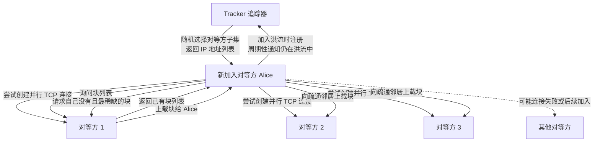

#### 邻近对等方

如图 2-23 所示，当一个新的对等方 Alice 加入该洪流时，追踪器随机地从参与对等方的集合中选择对等方的一个子集。

为了具体起见，设有 50 个对等方。

追踪器将这 50 个对等方的 IP 地址发送给 Alice。

Alice 持有对等方的这张列表，试图与该列表上的所有对等方创建并行的 TCP 连接。

我们称所有这样与 Alice 成功创建一个 TCP 连接的对等方为邻近对等方。

在图 2-23 中，Alice 显示了仅有三个邻近对等方。

通常，她应当有更多对等方。

随着时间的流逝，这些对等方中的某些可能离开，其他对等方，最初 50 个以外的，可能试图与 Alice 创建 TCP 连接。

因此一个对等方的邻近对等方将随时间而波动。

#### 块请求：最稀缺优先

在任何给定时间，每个对等方将具有来自该文件的块的子集，并且不同对等方具有不同子集。

Alice 周期性地经 TCP 连接询问每个邻近对等方它们所具有的块列表。

如果 Alice 具有 L 个不同邻居，她将获得 L 个块列表。

有了这个信息，Alice 将对她当前还没有的块发出请求，仍通过 TCP 连接。

因此在任何给定时刻，Alice 将具有块的子集，并知道它的邻居具有哪些块。

利用这些信息，Alice 将做出两个重要决定：

1. 她应当从她的邻居请求哪些块？
2. 她应当向哪些向她请求块的邻居发送块？

在决定请求哪些块的过程中，Alice 使用一种称为最稀缺优先 rarest first 的技术。

这种技术的思路是：

- 针对她没有的块，在她的邻居中决定最稀缺的块
- 最稀缺的块就是那些在她的邻居中副本数量最少的块
- Alice 首先请求那些最稀缺的块

这样，最稀缺块得到更为迅速的重新分发。

其目标是大致均衡每个块在洪流中的副本数量。

#### 块响应：对换算法与一报还一报

为了决定她响应哪个请求，BitTorrent 使用了一种机灵的对换算法。

其基本想法是，Alice 根据当前能够以最高速率向她提供数据的邻居，给出其优先权。

特别是，Alice 对于她的每个邻居都持续地测量接收到比特的速率，并确定以最高速率流入的 4 个邻居。

每过 10 秒，她重新计算该速率，并可能修改这 4 个对等方的集合。

用 BitTorrent 术语来说，这 4 个对等方被称为疏通 unchoked。

重要的是，每过 30 秒，她也要随机地选择另外一个邻居并向其发送块。

我们将这个被随机选择的对等方称为 Bob。

因为 Alice 正在向 Bob 发送数据，她可能成为 Bob 前 4 位上载者之一。

这样的话，Bob 将开始向 Alice 发送数据。

如果 Bob 向 Alice 发送数据的速率足够高，Bob 接下来也能成为 Alice 的前 4 位上载者。

换言之，每过 30 秒，Alice 将随机地选择一名新的对换伴侣，并开始与那位伴侣进行对换。

如果这两名对等方都满足此对换，它们将对方放入其前 4 位列表中，并继续与对方进行对换，直到该对等方之一发现了一个更好的伴侣为止。

这种效果是对等方能够以趋向于找到彼此的协调速率上载。

随机选择邻居也允许新的对等方得到块，因此它们能够具有对换的东西。

除了这 5 个对等方，即前 4 个对等方和一个试探对等方之外，所有其他相邻对等方均被阻塞。

也就是说，它们不能从 Alice 接收到任何块。

BitTorrent 有一些有趣的机制没有在这里讨论，包括：

- 片，小块
- 流水线
- 随机优先选择
- 残局模型
- 反怠慢

刚刚描述的关于交换的激励机制常被称为一报还一报 tit-for-tat。

已证实这种激励方案能被回避。

无论如何，BitTorrent 生态系统取得了广泛成功。

数以百万计的并发对等方在数十万条洪流中积极地共享文件。

如果 BitTorrent 被设计为不采用一报还一报，或一种变种，然而在别的方面却完全相同的协议，BitTorrent 现在将很可能不复存在了，因为大多数用户将成为搭便车者。

#### 分布式散列表 DHT

我们简要地提一下另一种 P2P 应用：分布式散列表 DHT。

分布式散列表是一种简单的数据库，其数据库记录分布在一个 P2P 系统的多个对等方上。

DHT 得到了广泛实现，例如在 BitTorrent 中，并成为大量研究的主题。

在配套网站的 Video Note 中对 DHT 进行了概述。

## 2.6 视频流和内容分发网

众多评估数据显示，包括 Netflix、YouTube 和亚马逊 Prime 在内的流式视频，大约占 2020 年因特网流量的 80%。

在本节中，我们将概述流行的视频流式服务在今天的因特网中是如何实现的。

我们将看到，其实现使用了应用层协议，以及以某种方式起到高速缓存作用的服务器。

### 2.6.1 因特网视频

在流式存储视频应用中，基础的媒体是预先录制的视频。

例如：

- 电影
- 电视节目
- 录制好的体育事件
- 录制好的用户生成视频，如通常在 YouTube 上可见的那些

这些预先录制好的视频放置在服务器上。

用户按需向这些服务器发送请求来观看视频。

许多因特网公司现在提供流式视频，这些公司包括：

- Netflix
- YouTube，谷歌
- 亚马逊
- 抖音

#### 视频媒体特征

但在开始讨论视频流之前，我们先迅速感受一下视频媒体。

视频是一系列的图像，通常以一种恒定速率展现，例如每秒 24 或 30 张图像。

一幅未压缩、数字编码的图像由像素阵列组成，其中每个像素由一些比特编码来表示亮度和颜色。

视频的一个重要特征是能够被压缩，因而可用比特率来权衡视频质量。

今天现成的压缩算法能够将一个视频压缩成所希望的任何比特率。

当然，比特率越高，图像质量越好，用户的总体视觉感受越好。

#### 视频的高比特率

从网络的观点看，也许视频最为突出的特征是高比特率。

压缩的因特网视频的比特率范围通常从：

- 用于低质量视频的 100 kbps
- 到用于流式高分辨率电影的超过 4 Mbps
- 再到用于 4K 在线播放的超过 10 Mbps

这能够转换为巨大的流量和存储，特别是对高端视频。

例如，单一 2 Mbps 视频在 67 分钟期间将耗费 1 GB 的存储和流量。

到目前为止，对流式视频最为重要的性能度量是平均端到端吞吐量。

为了提供连续不断的播放，网络必须为流式应用提供平均吞吐量，这个流式应用至少与压缩视频的比特率一样大。

#### 多版本编码

我们也能使用压缩生成相同视频的多个版本，每个版本有不同质量等级。

例如，我们能够使用压缩生成相同视频的 3 个版本，比特率分别为：

```text
300 kbps
1 Mbps
3 Mbps
```

用户则能够根据他们当前可用带宽来决定观看哪个版本。

具有高速因特网连接的用户也许选择 3 Mbps 版本。

使用智能手机通过 3G 观看视频的用户可能选择 300 kbps 版本。

### 2.6.2 HTTP 流和 DASH

#### HTTP 流

在 HTTP 流中，视频只是存储在 HTTP 服务器中作为一个普通文件。

每个文件有一个特定 URL。

当用户要看该视频时，客户与服务器创建一个 TCP 连接，并发送对该 URL 的 HTTP GET 请求。

服务器则以底层网络协议和流量条件允许的尽可能快速率，在一个 HTTP 响应报文中发送该视频文件。

在客户一侧，字节被收集在客户应用缓存中。

一旦该缓存中的字节数量超过预先设定的门限，客户应用程序就开始播放。

特别是，流式视频应用程序周期性地从客户应用程序缓存中抓取帧，对这些帧解压缩，并且在用户屏幕上展现。

因此，流式视频应用接收到视频就进行播放，同时缓存该视频后面部分的帧。

#### HTTP 流的缺陷

如前一小节所述，尽管 HTTP 流在实践中已经得到广泛部署，例如自 YouTube 发展初期开始，但它具有严重缺陷。

即所有客户接收到相同编码的视频。

尽管对不同的客户，或者对于相同客户的不同时间而言，客户可用的带宽大小有很大不同。

这导致了一种新型基于 HTTP 的流的研发，它常常被称为经 HTTP 的动态适应性流 Dynamic Adaptive Streaming over HTTP，简称 DASH。

#### DASH 基本思想

在 DASH 中，视频编码为几个不同版本。

每个版本具有不同比特率，对应于不同质量水平。

客户动态地请求来自不同版本且长度为几秒的视频段数据块。

当可用带宽量较高时，客户自然地选择来自高速率版本的块。

当可用带宽量较低时，客户自然地选择来自低速率版本的块。

客户用 HTTP GET 请求报文一次选择一个不同块。

DASH 允许客户使用不同因特网接入速率流式播放具有不同编码速率的视频。

使用低速 3G 连接的客户能够接收低比特率、低质量的版本。

使用光纤连接的客户能够接收高质量版本。

如果端到端带宽在会话过程中改变，DASH 允许客户适应可用带宽。

这种特色对于移动用户特别重要。

当移动用户相对于基站移动时，通常他们能感受到其可用带宽的波动。

#### DASH 的工作方式

使用 DASH 后，每个视频版本存储在 HTTP 服务器中，每个版本都有一个不同 URL。

HTTP 服务器也有一个告示文件 manifest file。

该文件为每个版本提供了一个 URL 及其比特率。

客户首先请求该告示文件，并且得知各种各样的版本。

然后客户通过在 HTTP GET 请求报文中对每块指定一个 URL 和一个字节范围，一次选择一块。

在下载块的同时，客户也测量接收带宽，并运行一个速率决定算法来选择下次请求的块。

自然地：

- 如果客户缓存的视频很多，并且测量的接收带宽较高，它将选择一个高速率版本
- 如果客户缓存的视频很少，并且测量的接收带宽较低，它将选择一个低速率版本

因此 DASH 允许客户自由地在不同质量等级之间切换。

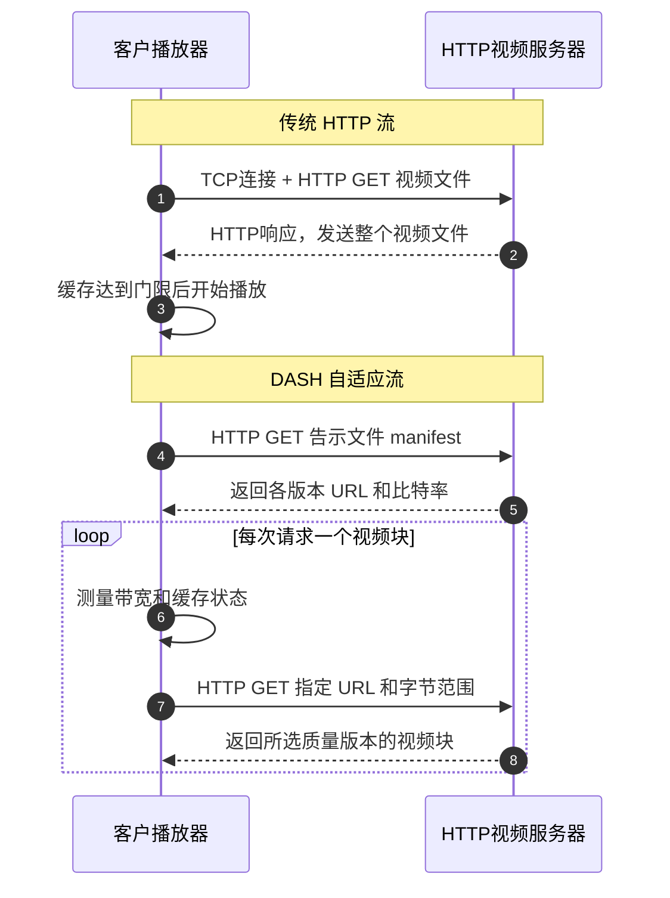

### 2.6.3 内容分发网

今天，许多因特网视频公司日复一日地向数以百万计的用户按需分发每秒数兆比特的流。

例如，YouTube 的视频库藏有几亿个视频，每天向全世界的用户分发几亿条流。

向位于全世界的所有用户流式传输所有流量，同时提供连续播放和高交互性，显然是一项有挑战性的任务。

#### 单一数据中心的问题

对于一个因特网视频公司，或许提供流式视频服务最为直接的方法是建立单一的大规模数据中心。

在数据中心中存储其所有视频，并直接从该数据中心向世界范围的客户传输流式视频。

但是这种方法存在三个问题。

##### 问题 1：客户远离数据中心导致吞吐量不足

如果客户远离数据中心，服务器到客户的分组将跨越许多通信链路，并很可能通过许多 ISP。

其中某些 ISP 可能位于不同的大洲。

如果这些链路之一提供的吞吐量小于视频消耗速率，端到端吞吐量也将小于该消耗速率，给用户带来恼人的停滞时延。

第 1 章讲过，一条流的端到端吞吐量由瓶颈链路的吞吐量所决定。

出现这种事件的可能性随着端到端路径中链路数量的增加而增加。

##### 问题 2：流行视频重复传输浪费带宽

第二个缺陷是，流行的视频很可能经过相同通信链路发送许多次。

这不仅浪费了网络带宽，因特网视频公司自己也将为向因特网反复发送相同字节而向其 ISP 运营商，即连接到数据中心的运营商，支付费用。

##### 问题 3：单点故障

这种解决方案的第三个问题是，单个数据中心代表一个单点故障。

如果数据中心或其通向因特网的链路崩溃，它将不能够分发任何视频流。

#### CDN 的基本思想

为了应对向分布于全世界的用户分发巨量视频数据的挑战，几乎所有主要视频流公司都利用内容分发网 Content Distribution Network，简称 CDN。

CDN 管理分布在多个地理位置上的服务器。

CDN 在它的服务器中存储视频和其他类型 Web 内容的副本，包括：

- 文档
- 图片
- 音频

并且 CDN 试图将每个用户请求定向到一个将提供最好用户体验的 CDN 位置。

CDN 可以是：

1. 专用 CDN private CDN  
   由内容提供商自己所拥有。

   例如，谷歌的 CDN 分发 YouTube 视频和其他类型内容。

2. 第三方 CDN third-party CDN  
   代表多个内容提供商分发内容。

   例如：
   - Akamai
   - Limelight
   - Level-3

关于现代 CDN 的可读性强的展望，可以参考相关文献。

#### 学习案例：谷歌的网络基础设施

为了支持谷歌的巨量云服务阵列，包括：

- 搜索
- Gmail
- 日程表
- YouTube 视频
- 地图
- 文档
- 社交网络

谷歌已经部署了一个广泛的专用网和 CDN 基础设施。

谷歌的 CDN 基础设施具有三个等级的服务器集群（以下数量是原书统计时点的大致规模，现已变化，只看分级思想）：

##### 1. 兆数据中心

在北美、欧洲和亚洲有 19 个兆数据中心。

每个数据中心拥有的服务器数量达到 10 万台量级。

这些兆数据中心负责为动态并且经常是个性化的内容提供服务，包括：

- 搜索结果
- Gmail 报文

##### 2. IXP 集群

约 90 个集群分布于全球，位于因特网交换点 IXP 中。

每个集群中的服务器数量达到数百台量级。

这些集群负责为静态内容提供服务，包括：

- YouTube 视频

##### 3. 深入集群

数以百计的“深入”集群位于一个接入 ISP 中。

一个集群通常由位于一个机架上的数十台服务器组成。

这些深入服务器执行 TCP 分岔，并服务于静态内容，包括体现搜索结果的 Web 网页的静态部分。

所有这些数据中心和集群位置与谷歌自己的专用网连接在一起。

当某用户进行搜索请求时，该请求常常先经过本地 ISP 发送到邻近的深入服务器缓存中。

从这里检索静态内容。

在将静态内容提供给客户的同时，邻近缓存也经谷歌专用网将请求转发给兆数据中心。

从这里检索个性化的搜索结果。

对于某 YouTube 视频：

- 视频本身可能来自一个邀请做客服务器缓存
- 围绕该视频的 Web 网页部分可能来自邻近深入服务器缓存
- 围绕该视频的广告来自数据中心

总的来说，除了本地 ISP，谷歌云服务在很大程度上是由独立于公共因特网的网络基础设施提供的。

#### CDN 的两种服务器安置原则

CDN 通常采用两种不同服务器安置原则。

##### 1. 深入

第一个原则由 Akamai 首创。

该原则是通过在遍及全球的接入 ISP 中部署服务器集群，来深入到 ISP 的接入网中。

Akamai 在数以千计个位置采用这种方法部署集群。

其目标是靠近端用户。

通过减少端用户和 CDN 集群之间链路和路由器的数量，从而改善用户感受的时延和吞吐量。

因为这种高度分布式设计，维护和管理集群的任务成为挑战。

##### 2. 邀请做客

第二个设计原则由 Limelight 和许多其他 CDN 公司所采用。

该原则是通过在少量关键位置建造大集群，来邀请到 ISP 做客。

不是将集群放在接入 ISP 中，这些 CDN 通常将它们的集群放置在因特网交换点 IXP。

与深入设计原则相比，邀请做客设计通常产生较低维护和管理开销。

但可能以对端用户的较高时延和较低吞吐量为代价。

##### CDN 内容复制与拉策略

一旦 CDN 的集群准备就绪，它就可以跨集群复制内容。

CDN 可能不希望将每个视频的副本放置在每个集群中。

因为某些视频很少观看，或仅在某些国家中流行。

事实上，许多 CDN 没有将视频推入它们的集群，而是使用一种简单拉策略。

如果客户向一个未存储该视频的集群请求某视频，则该集群从某中心仓库或者从另一个集群检索该视频。

在向客户流式传输视频的同时，在本地存储一个副本。

类似于 Web 缓存，当某集群存储器变满时，它删除不经常请求的视频。

##### 2.6.3.1 CDN 操作

在讨论过这两种部署 CDN 的重要方法后，我们现在深入看看 CDN 操作的细节。

当用户主机中的一个浏览器指令检索一个特定视频，该视频由 URL 标识时，CDN 必须截获该请求，以便能够：

1. 确定此时适合用于该客户的 CDN 服务器集群
2. 将客户的请求重定向到该集群的某台服务器

我们很快将讨论 CDN 是如何能够确定一个适当集群的。

但是我们首先考察截获和重定向请求所依赖的机制。

大多数 CDN 利用 DNS 来截获和重定向请求。

##### CDN 使用 DNS 重定向示例

我们考虑用一个简单例子来说明通常是怎样使用 DNS 的。

假定有一个内容提供商 NetCinema，雇用了第三方 CDN 公司 King CDN 来向其客户分发视频。

在 NetCinema 的 Web 网页上，它的每个视频都被指派了一个 URL。

该 URL 包括字符串：

```text
video
```

以及该视频本身的独特标识符。

例如，《变形金刚 7》可以指派为：

```text
http://video.netcinema.com/6Y7B23V
```

接下来出现如图 2-24 所示的 6 个步骤。

```mermaid
sequenceDiagram
  autonumber
  participant U as 用户主机
  participant B as 浏览器
  participant L as 本地DNS服务器 LDNS
  participant N as NetCinema 权威DNS服务器
  participant K as KingCDN 权威DNS服务器
  participant C as KingCDN 内容分发服务器

  B->>U: 访问 www.netcinema.com
  U->>B: 返回 NetCinema Web 页面
  B->>U: 用户点击视频链接 video.netcinema.com/6Y7B23V
  U->>L: DNS 请求 video.netcinema.com
  L->>N: 中继 DNS 请求 video.netcinema.com
  N-->>L: 不返回 IP，而返回 KingCDN 主机名 a1105.kingcdn.com
  L->>K: 第二个 DNS 请求 a1105.kingcdn.com
  K-->>L: 返回 KingCDN 内容服务器 IP 地址
  L-->>U: 转发 KingCDN 内容服务器 IP 地址
  U->>C: 创建 TCP 连接
  U->>C: HTTP GET 请求视频
  C-->>U: 返回视频内容，或使用 DASH 返回告示文件和视频块
```

##### 步骤解释

1. 用户访问位于 NetCinema 的 Web 网页。

2. 当用户点击链接：

   ```text
   http://video.netcinema.com/6Y7B23V
   ```

   该用户主机发送了一个对于：

   ```text
   video.netcinema.com
   ```

   的 DNS 请求。

3. 用户的本地 DNS 服务器 LDNS 将该 DNS 请求中继到一台用于 NetCinema 的权威 DNS 服务器。

   该服务器观察到主机名：

   ```text
   video.netcinema.com
   ```

   中的字符串：

   ```text
   video
   ```

   为了将该 DNS 请求移交给 King CDN，NetCinema 权威 DNS 服务器并不返回一个 IP 地址，而是向 LDNS 返回一个 King CDN 域的主机名，例如：

   ```text
   a1105.kingcdn.com
   ```

4. 从这时起，DNS 请求进入了 King CDN 专用 DNS 基础设施。

   用户的 LDNS 则发送第二个请求，此时是对：

   ```text
   a1105.kingcdn.com
   ```

   的 DNS 请求。

   King CDN 的 DNS 系统最终向 LDNS 返回 King CDN 内容服务器的 IP 地址。

   所以正是在这里，在 King CDN 的 DNS 系统中，指定了 CDN 服务器，客户将能够从这台服务器接收到它的内容。

5. LDNS 向用户主机转发内容服务 CDN 节点的 IP 地址。

6. 一旦客户收到 King CDN 内容服务器的 IP 地址，它与具有该 IP 地址的服务器创建了一条直接 TCP 连接，并且发出对该视频的 HTTP GET 请求。

   如果使用了 DASH，服务器将首先向客户发送具有 URL 列表的告示文件。

   每个 URL 对应视频的每个版本。

   客户将动态地选择来自不同版本的块。

### 2.6.3.2 集群选择策略

任何 CDN 部署，其核心是集群选择策略 cluster selection strategy。

即动态地将客户定向到 CDN 中的某个服务器集群或数据中心的机制。

如我们刚才所见，经过客户的 DNS 查找，CDN 得知了该客户的 LDNS 服务器的 IP 地址。

在得知该 IP 地址之后，CDN 需要基于该 IP 地址选择一个适当集群。

CDN 一般采用专用的集群选择策略。

我们现在简单介绍一些策略，每种策略都有其优点和缺点。

#### 策略 1：地理上最为邻近

一种简单策略是指派客户到地理上最为邻近的集群。

使用商用地理位置数据库，例如：

- Quova
- MaxMind

每个 LDNS IP 地址都映射到一个地理位置。

当从一个特殊 LDNS 接收到一个 DNS 请求时，CDN 选择地理上最接近的集群，即离 LDNS 最少几千米远的集群，“就像鸟飞一样”。

这样的解决方案对于众多用户来说能够工作得相当好。

但对于某些客户，该解决方案可能执行效果较差。

因为就网络路径长度或跳数而言，地理最邻近的集群可能并不是最近的集群。

此外，所有基于 DNS 的方法都具有的问题是，某些端用户配置使用位于远地的 LDNS。

在这种情况下，LDNS 位置可能远离客户位置。

此外，这种简单策略忽略了时延和可用带宽随因特网路径时间而变化，总是为特定客户指派相同集群。

#### 策略 2：实时测量

为了基于当前流量条件为客户确定最好集群，CDN 能够对其集群和客户之间的时延和丢包性能执行周期性实时测量。

例如，CDN 能够让它的每个集群周期性地向位于全世界的所有 LDNS 发送探测分组，例如：

- ping 报文
- DNS 请求

这种方法的一个缺点是许多 LDNS 被配置为不响应这些探测。

### 2.6.4 学习案例：Netflix 和 YouTube

通过观察两个高度成功的大规模部署 Netflix 和 YouTube，我们对流式存储视频的讨论进行总结。

我们将看到，这些系统采用的方法差异很大，但却应用了在本节中讨论的许多根本原则。

#### 1. Netflix

到 2020 年为止，Netflix 已经成为美国首屈一指的在线电影和 TV 节目的服务提供商。

Netflix 视频分发具有两个主要部件：

1. 亚马逊云
2. Netflix 自己的专用 CDN 基础设施

##### Netflix 的 Web 网站与亚马逊云

Netflix 有一个 Web 网站来处理若干功能。

这些功能包括：

- 用户注册和登录
- 计费
- 用于浏览和搜索的电影目录
- 一个电影推荐系统

这个 Web 网站以及与它关联的后端数据库，完全运行在亚马逊云中的亚马逊服务器上。

此外，亚马逊云处理下列关键功能。

###### 1. 内容摄取

在 Netflix 能够向它的用户分发某电影之前，它必须首先获取和处理该电影。

Netflix 接收制片厂电影的母带，并且将其上载到亚马逊云的主机上。

###### 2. 内容处理

亚马逊云中的机器为每部电影生成许多不同格式，以适合在以下设备上运行的不同类型客户视频播放器：

- 桌面计算机
- 智能手机
- 与电视机相连的游戏机

为每种格式和比特率都生成一种不同版本。

这允许使用 DASH 的经 HTTP 适应性播放流。

###### 3. 向其 CDN 上载版本

一旦某电影的所有版本均已生成，在亚马逊云中的主机向其 CDN 上载这些版本。

```mermaid
graph LR
  subgraph AWS["亚马逊云"]
    Web["Netflix Web 网站<br/>用户注册、登录、计费、目录、推荐"]
    Ingest["内容摄取<br/>接收制片厂母带"]
    Process["内容处理<br/>生成多格式、多比特率版本"]
    Select["服务器选择<br/>确定最佳 CDN 服务器"]
  end

  CDN["Netflix 专用 CDN<br/>IXP 机架 / ISP 机架"]
  Client["客户设备<br/>智能手机、平板、电视、PC"]

  Ingest --> Process
  Process -->|"上载视频版本"| CDN
  Web --> Select
  Select -->|"发送 CDN 服务器 IP<br/>和资源配置文件/告示文件"| Client
  Client -->|"HTTP GET / DASH 块请求"| CDN
  CDN -->|"视频块"| Client
```

##### Netflix 专用 CDN：Open Connect

当 Netflix 于 2007 年首次推出视频流式服务时，它雇用了 3 个第三方 CDN 公司来分发视频内容。

自 Netflix 创建了专用 CDN 起，便开始从这些专用 CDN 发送所有视频。

为了创建专用 CDN，Netflix 在 IXP 和接入 ISP 中安装服务器机架（以下位置和容量数字是原书统计时点的例子，现已变化）：

Netflix 当前在超过 200 个 IXP 位置配有服务器机架。

也有数百个 ISP 位置存放 Netflix 机架。

Netflix 向潜在 ISP 合作伙伴提供了在其网络中安装一个免费 Netflix 机架的操作指南。

在机架中每台服务器具有：

- 几个 10 Gbps 以太网端口
- 超过 100 TB 的存储

在一个机架中服务器的数量是变化的：

- IXP 安装通常有数十台服务器，并包含整个 Netflix 流式视频库，包括多个版本视频以支持 DASH
- 本地 IXP 也许仅有一台服务器，并仅包含最为流行的视频

Netflix 不使用拉高速缓存以在 IXP 和 ISP 中扩充它的 CDN 服务器。

反而在非高峰时段通过推将这些视频分发在它的 CDN 服务器。

对于不能保存整个库的那些位置，Netflix 仅推送最为流行的视频。

视频的流行度是基于逐天数据来决定的。

##### Netflix 客户与服务器交互

描述了 Netflix 体系结构的组件后，我们来更为仔细地看一下客户与各台服务器之间的交互，这些服务器与电影交付有关。

如前面指出的那样，浏览 Netflix 视频库的 Web 网页由亚马逊云中的服务器提供服务。

当用户选择一个电影准备播放时，运行在亚马逊云中的 Netflix 软件首先确定它的哪个 CDN 服务器具有该电影的拷贝。

在具有拷贝的服务器中，该软件决定客户请求的“最好的”服务器。

如果该客户正在使用一个住宅 ISP，并且该 ISP 中具有安装在该 ISP 中的 Netflix CDN 服务器机架，并且该机架具有所请求电影的拷贝，则通常选择这个机架中的一台服务器。

倘若不是，通常选择邻近 IXP 的一台服务器。

一旦 Netflix 确定了交付内容的 CDN 服务器，它向该客户发送特定服务器的 IP 地址，以及资源配置文件。

该文件具有所请求电影不同版本的 URL。

该客户和那台 CDN 服务器则使用专用版本的 DASH 进行交互。

具体而言，如 2.6.2 节所述，该客户使用 HTTP GET 请求报文中的字节范围首部，以请求来自电影不同版本的块。

Netflix 使用大约 4 秒长的块。

随着这些块的下载，客户测量收到的吞吐量，并且运行一个速率确定算法来确定下一个要请求块的质量。

##### Netflix 的关键设计特点

Netflix 包含了本节前面讨论的许多关键原则，包括：

- 适应性流
- CDN 分发

然而，因为 Netflix 使用专用 CDN，而它仅分发视频而非 Web 网页，所以 Netflix 已经能够简化并定制其 CDN 设计。

特别是：

1. Netflix 不需要用 DNS 重定向来将特殊客户连接到一台 CDN 服务器  
   相反，Netflix 软件运行在亚马逊云中，直接告知该客户使用一台特定 CDN 服务器。

2. Netflix CDN 使用推高速缓存，而不是拉高速缓存  
   内容在非高峰时段的预定时间被推入服务器，而不是在高速缓存未命中时动态地被推入。

#### 2. YouTube

YouTube 拥有每分钟数百小时的视频上载量和每天几十亿次观看，毫无疑问是世界上最大的视频共享站点。

YouTube 于 2005 年 4 月开始提供服务，并于 2006 年 11 月被谷歌公司收购。

尽管谷歌/YouTube 的设计和协议是专用的，但通过几次独立测量结果，我们能够基本理解 YouTube 的工作原理。

与 Netflix 一样，YouTube 广泛地利用 CDN 技术来分发它的视频。

类似于 Netflix，谷歌使用其专用 CDN 来分发 YouTube 视频，并且已经在几百个不同 IXP 和 ISP 位置安装了服务器集群。

从这些位置以及从它的巨大数据中心，谷歌分发 YouTube 视频。

然而，与 Netflix 不同，谷歌使用拉高速缓存和 DNS 重定向。

在大部分时间，谷歌的集群选择策略将客户定向到某个集群，使得客户与集群之间的 RTT 是最低的。

然而，为了平衡流经集群的负载，有时客户被定向，经 DNS，到一个更远集群。

##### YouTube 的视频流方式

YouTube 应用 HTTP 流。

经常使少量不同版本为一个视频可用，每个具有不同比特率和对应质量等级。

> [!note] 写在原书时点的描述
> 原书写作时 YouTube 主要靠用户人工选清晰度。之后 YouTube 已广泛使用自适应流。读这段时抓住对比点就行：固定版本 HTTP 流 vs 按带宽动态切块的 DASH。

为了节省那些将被重定位或提前终止而浪费的带宽和服务器资源，YouTube 在获取视频的目标量之后，使用 HTTP 字节范围请求来限制传输的数据流。

##### YouTube 视频上载与处理

每天有几百万视频被上载到 YouTube。

不仅 YouTube 视频经 HTTP 以流方式从服务器到客户，而且 YouTube 上载者也经 HTTP 从客户到服务器上载他们的视频。

YouTube 处理它收到的每个视频：

- 将它转换为 YouTube 视频格式
- 创建具有不同比特率的多个版本

这种处理完全发生在谷歌数据中心。

# 第五部分 套接字编程

本部分动手。用同一道“大写转换”题，分别走 UDP 和 TCP，体会连接、地址和字节流的区别。

## 2.7 套接字编程：生成网络应用

我们已经看到了一些重要网络应用，下面探讨一下网络应用程序是如何实际编写的。

在 2.1 节讲过，典型网络应用是由一对程序组成的，即客户程序和服务器程序。

它们位于两个不同端系统中。

当运行这两个程序时，创建了一个客户进程和一个服务器进程。

同时它们通过从套接字读出和写入数据在彼此之间进行通信。

开发者创建一个网络应用时，其主要任务就是编写客户程序和服务器程序的代码。

#### 网络应用程序的两类

网络应用程序有两类。

##### 1. 开放协议实现

一类是由协议标准，如一个 RFC 或某种其他标准文档，中所定义操作的实现。

这样的应用程序有时称为“开放”的，因为定义其操作的这些规则为人们所共知。

对于这样的实现，客户程序和服务器程序必须遵守由该 RFC 所规定的规则。

例如：

- 某客户程序可能是 HTTP 协议客户端的一种实现
- 其服务器程序能够是 HTTP 服务器协议的一种实现

如果一个开发者编写客户程序的代码，另一个开发者编写服务器程序的代码，并且两者都完全遵从该 RFC 的各种规则，那么这两个程序将能够交互操作。

实际上，今天许多网络应用程序涉及客户和服务器程序间的通信，这些程序都是由独立程序员开发的。

例如：

- 谷歌 Chrome 浏览器与 Apache Web 服务器通信
- BitTorrent 客户与 BitTorrent 跟踪器通信

##### 2. 专用网络应用程序

另一类网络应用程序是专用网络应用程序。

在这种情况下，由客户和服务器程序部署的应用层协议没有公开发布在某 RFC 中或其他地方。

独立开发者或开发团队创建客户和服务器程序，并且开发者完全控制该代码的功能。

但是因为这些代码并没有实现开放协议，所以其他独立开发者将无法开发出和该应用程序交互的代码。

#### 选择 TCP 还是 UDP

在本节中，我们将考察研发客户-服务器应用程序的关键问题。

我们将“亲力亲为”来实现一个非常简单的客户-服务器应用程序代码。

在研发阶段，开发者必须最先做的一个决定是：

- 应用程序是运行在 TCP 上
- 还是运行在 UDP 上

前面讲过，TCP 是面向连接的，并且为两个端系统之间的数据流动提供可靠字节流通道。

UDP 是无连接的，从一个端系统向另一个端系统发送独立数据分组，不对交付提供任何保证。

前面也讲过，当客户或服务器程序实现了一个由某 RFC 定义的协议时，它应当使用与该协议关联的周知端口号。

与之相反，当研发一个专用应用程序时，研发者必须注意避免使用这些周知端口号。

端口号已在 2.1 节简要讨论过，第 3 章将进行更为详细介绍。

我们通过一个简单 UDP 应用程序和一个简单 TCP 应用程序来介绍 UDP 和 TCP 套接字编程。

我们用 Python 3 来呈现这些简单 TCP 和 UDP 程序。

也可以用 Java、C 或 C++ 来编写这些程序。

我们选择用 Python 最主要原因是 Python 清楚地揭示了关键套接字概念。

使用 Python，代码行数更少，并且向编程新手解释每一行代码不会有困难。

如果你不熟悉 Python，也用不着担心。

只要你有过一些用 Java、C 或 C++ 编程的经验，就应该很容易看懂下面的代码。

如果读者对用 Java 进行客户-服务器编程感兴趣，建议查看与本书配套的 Web 网站。

事实上，能够在那里找到用 Java 编写的本节中所有例子和相关实验。

如果读者对用 C 进行客户-服务器编程感兴趣，有一些优秀参考资料可供使用。

我们下面的 Python 例子具有类似于 C 的外观和感觉。

### 2.7.1 UDP 套接字编程

在本小节中，我们将编写使用 UDP 的简单客户-服务器程序。

在下一小节中，我们将编写使用 TCP 的简单程序。

2.1 节讲过，运行在不同机器上的进程彼此通过向套接字发送报文来进行通信。

我们说过每个进程好比是一座房子，该进程的套接字则好比是一扇门。

应用程序位于房子中门的一侧。

运输层位于该门朝外的另一侧。

应用程序开发者在套接字的应用层一侧可以控制所有东西。

然而，它几乎无法控制运输层一侧。

#### UDP 通信过程

现在我们仔细观察使用 UDP 套接字的两个通信进程之间的交互。

在发送进程能够将数据分组推出套接字之门之前，当使用 UDP 时，必须先将目的地址附在该分组之上。

在该分组传过发送方的套接字之后，因特网将使用该目的地址通过因特网为该分组选路到接收进程的套接字。

当分组到达接收套接字时，接收进程将通过该套接字取回分组，然后检查分组内容并采取适当动作。

因此你可能现在想知道，附在分组上的目的地址包含了什么？

如你所期待的那样，目的主机的 IP 地址是目的地址的一部分。

通过在分组中包括目的地的 IP 地址，因特网中的路由器将能够通过因特网将分组选路到目的主机。

但是因为一台主机可能运行许多网络应用进程，每个进程具有一个或多个套接字，所以在目的主机指定特定套接字也是必要的。

当生成一个套接字时，就为它分配一个称为端口号 port number 的标识符。

因此，如你所期待的，分组的目的地址也包括该套接字的端口号。

总的来说，发送进程为分组附上目的地址，该目的地址是由：

- 目的主机的 IP 地址
- 目的地套接字的端口号

组成的。

此外，如我们很快将看到的那样，发送方的源地址也是由：

- 源主机的 IP 地址
- 源套接字的端口号

组成。

该源地址也要附在分组之上。

然而，将源地址附在分组之上通常并不是由 UDP 应用程序代码所为，而是由底层操作系统自动完成的。

#### 示例应用：大写转换服务器

我们将使用下列简单客户-服务器应用程序来演示对于 UDP 和 TCP 的套接字编程。

应用需求如下：

1. 客户从其键盘读取一行字符，即数据，并将该数据向服务器发送。
2. 服务器接收该数据，并将这些字符转换为大写。
3. 服务器将修改的数据发送给客户。
4. 客户接收修改的数据，并在其监视器上将该行显示出来。

```mermaid
sequenceDiagram
  autonumber
  participant C as UDPClient 客户
  participant CS as 客户套接字 clientSocket
  participant NET as 因特网 / UDP
  participant SS as 服务器套接字 serverSocket
  participant S as UDPServer 服务器

  C->>CS: 创建套接字 socket(AF_INET, SOCK_DGRAM)
  C->>CS: 发送 message，并附上目的地址 (serverName, serverPort)
  CS->>NET: sendto()
  NET->>SS: UDP 数据报到达服务器端口
  SS->>S: recvfrom() 读取报文和客户端地址
  S->>S: 将报文转换为大写
  S->>SS: sendto(modifiedMessage, clientAddress)
  SS->>NET: UDP 响应报文
  NET->>CS: 数据报到达客户套接字
  CS->>C: recvfrom() 读取响应
  C->>C: 打印大写句子并关闭套接字
```

现在我们自己动手来查看用 UDP 实现这个简单应用程序的一对客户-服务器程序。

我们在每个程序后也提供一个详细、逐行的分析。

我们将以 UDP 客户开始。

该程序将向服务器发送一个简单应用级报文。

服务器为了能够接收并回答该客户的报文，它必须准备好并已经在运行。

这就是说，在客户发送其报文之前，服务器必须作为一个进程正在运行。

客户程序被称为：

```text
UDPClient.py
```

服务器程序被称为：

```text
UDPServer.py
```

为了强调关键问题，我们有意提供最少的代码。

“好代码”无疑将具有更多辅助性代码行，特别是用于处理出现差错的情况。

对于本应用程序，我们任意选择了 12000 作为服务器的端口号。

#### 2.7.1.1 UDPClient.py

下面是该应用程序客户端的代码（原书用 Python 2，以下已按 Python 3 改写，主要是收发时加 `encode()` / `decode()`）。

```python
from socket import *

serverName = 'hostname'
serverPort = 12000

clientSocket = socket(AF_INET, SOCK_DGRAM)

message = input('Input lowercase sentence: ')
clientSocket.sendto(message.encode(), (serverName, serverPort))

modifiedMessage, serverAddress = clientSocket.recvfrom(2048)
print(modifiedMessage.decode())

clientSocket.close()
```

**逐行分析**

##### 导入 socket 模块

```python
from socket import *
```

该 `socket` 模块形成了在 Python 中所有网络通信的基础。

包括了这行，我们将能够在程序中创建套接字。

##### 设置服务器名和端口号

```python
serverName = 'hostname'
serverPort = 12000
```

第一行将变量 `serverName` 置为字符串 `"hostname"`。

这里，我们提供了或者包含服务器 IP 地址的字符串，例如：

```text
128.138.32.126
```

或者包含服务器主机名的字符串，例如：

```text
cis.poly.edu
```

如果我们使用主机名，则将自动执行 DNS lookup，从而得到 IP 地址。

第二行将整数变量 `serverPort` 置为 12000。

##### 创建 UDP 套接字

```python
clientSocket = socket(AF_INET, SOCK_DGRAM)
```

该行创建了客户的套接字，称为 `clientSocket`。

第一个参数指示了地址簇。

特别是：

```python
AF_INET
```

指示了底层网络使用了 IPv4。

此时不必担心，我们将在第 4 章中讨论 IPv4。

第二个参数指示了该套接字是：

```python
SOCK_DGRAM
```

类型的。

这意味着它是一个 UDP 套接字，而不是一个 TCP 套接字。

值得注意的是，当创建套接字时，我们并没有指定客户套接字的端口号。

相反，我们让操作系统为我们做这件事。

既然已经创建了客户进程的门，我们将要生成通过该门发送的报文。

##### 从键盘读取用户输入

```python
message = input('Input lowercase sentence: ')
```

`input()` 是 Python 中的内置功能。

当执行这条命令时，客户上的用户将以单词：

```text
Input lowercase sentence:
```

进行提示。

用户则使用她的键盘输入一行。

该内容被放入变量 `message` 中。

既然我们有了一个套接字和一条报文，我们将要通过该套接字向目的主机发送报文。

##### 发送 UDP 报文

```python
clientSocket.sendto(message.encode(), (serverName, serverPort))
```

在上述这行中，我们首先将报文由字符串类型转换为字节类型。

因为我们需要向套接字中发送字节。

这将使用 `encode()` 方法完成。

方法 `sendto()` 为报文附上目的地址：

```python
(serverName, serverPort)
```

并且向进程的套接字 `clientSocket` 发送结果分组。

如前面所述，源地址也附到分组上，尽管这是自动完成的，而不是显式地由代码完成的。

经一个 UDP 套接字发送一个客户到服务器的报文非常简单。

在发送分组之后，客户等待接收来自服务器的数据。

##### 接收服务器响应

```python
modifiedMessage, serverAddress = clientSocket.recvfrom(2048)
```

对于上述这行，当一个来自因特网的分组到达该客户套接字时：

- 该分组的数据被放置到变量 `modifiedMessage` 中
- 其源地址被放置到变量 `serverAddress` 中

变量 `serverAddress` 包含了服务器的 IP 地址和服务器的端口号。

程序 `UDPClient` 实际上并不需要服务器的地址信息，因为它从起始就已经知道了该服务器地址。

而这行 Python 代码仍然提供了服务器的地址。

方法 `recvfrom()` 也取缓存长度 2048 作为输入。

该缓存长度用于多种目的。

##### 打印响应

```python
print(modifiedMessage.decode())
```

这行将报文从字节转化为字符串后，在用户显示器上打印出 `modifiedMessage`。

它应当是用户键入的原始行，但现在变为大写的了。

##### 关闭套接字

```python
clientSocket.close()
```

该行关闭了套接字。

然后关闭了该进程。

#### 2.7.1.2 UDPServer.py

现在来看看这个应用程序的服务器端。

```python
from socket import *

serverPort = 12000

serverSocket = socket(AF_INET, SOCK_DGRAM)
serverSocket.bind(('', serverPort))

print("The server is ready to receive")

while True:
    message, clientAddress = serverSocket.recvfrom(2048)
    modifiedMessage = message.decode().upper()
    serverSocket.sendto(modifiedMessage.encode(), clientAddress)
```

**逐行分析**

注意到 `UDPServer` 的开始部分与 `UDPClient` 类似。

它也是导入套接字模块。

也将整数变量 `serverPort` 设置为 12000。

并且也创建套接字类型：

```python
SOCK_DGRAM
```

即一种 UDP 套接字。

与 `UDPClient` 有很大不同的第一行代码是：

```python
serverSocket.bind(('', serverPort))
```

上面行将端口号 12000 与该服务器的套接字绑定，即分配在一起。

因此在 `UDPServer` 中，由应用程序开发者编写的代码显式地为该套接字分配一个端口号。

以这种方式，当任何人向位于该服务器 IP 地址的端口 12000 发送一个分组，该分组将导向该套接字。

`UDPServer` 然后进入一个 `while` 循环。

该 `while` 循环将允许 `UDPServer` 无限期地接收并处理来自客户的分组。

在该 `while` 循环中，`UDPServer` 等待一个分组的到达。

##### 接收客户报文

```python
message, clientAddress = serverSocket.recvfrom(2048)
```

这行代码类似于我们在 `UDPClient` 中看到的。

当某分组到达该服务器的套接字时：

- 该分组的数据被放置到变量 `message` 中
- 其源地址被放置到变量 `clientAddress` 中

变量 `clientAddress` 包含了客户的 IP 地址和客户的端口号。

这里，`UDPServer` 将利用该地址信息，因为它提供了返回地址，类似于普通邮政邮件的返回地址。

使用该源地址信息，服务器此时知道了它应当将回答发向何处。

##### 转换为大写

```python
modifiedMessage = message.decode().upper()
```

此行是这个简单应用程序的关键部分。

它在将报文转化为字符串后，获取由客户发送的行，并使用方法 `upper()` 将其转换为大写。

##### 发送响应给客户

```python
serverSocket.sendto(modifiedMessage.encode(), clientAddress)
```

最后一行将该客户的地址，即 IP 地址和端口号，附到大写报文上。

在将字符串转化为字节后，并将所得分组发送到服务器的套接字中。

如前面所述，服务器地址也附在分组上，尽管这是自动而不是显式地由代码完成的。

然后因特网将分组交付到该客户地址。

在服务器发送该分组后，它仍维持在 `while` 循环中，等待从运行在任一台主机上的任何客户发送的另一个 UDP 分组到达。

##### 测试 UDP 程序

为了测试这对程序，可在一台主机上运行：

```text
UDPClient.py
```

并在另一台主机上运行：

```text
UDPServer.py
```

保证在 `UDPClient.py` 中包括适当服务器主机名或 IP 地址。

接下来，在服务器主机上执行编译的服务器程序 `UDPServer.py`。

这在服务器上创建了一个进程，等待着某个客户与之联系。

然后，在客户主机上执行客户端程序 `UDPClient.py`。

这在客户上创建了一个进程。

最后，在客户上使用应用程序，键入一个句子并以回车结束。

可以通过稍加修改上述客户和服务器程序来研制自己的 UDP 客户-服务器程序。

例如：

- 不必将所有字母转换为大写
- 服务器可以计算字母 `s` 出现的次数并返回该数字

或者能够修改客户程序，使其在收到一个大写句子后，用户能够向服务器继续发送更多句子。

### 2.7.2 TCP 套接字编程

与 UDP 不同，TCP 是一个面向连接的协议。

这意味着在客户和服务器能够开始互相发送数据之前，它们先要握手并创建一个 TCP 连接。

TCP 连接的一端与客户套接字相联系，另一端与服务器套接字相联系。

当创建该 TCP 连接时，我们将其与：

- 客户套接字地址，即 IP 地址和端口号
- 服务器套接字地址，即 IP 地址和端口号

关联起来。

使用创建的 TCP 连接，当一侧要向另一侧发送数据时，它只需经过其套接字将数据丢进 TCP 连接。

这与 UDP 不同。

UDP 服务器在将分组丢进套接字之前必须为其附上一个目的地地址。

#### TCP 中客户和服务器的交互

现在我们仔细观察一下 TCP 中客户程序和服务器程序的交互。

客户具有向服务器发起接触的任务。

服务器为了能够对客户的初始接触做出反应，服务器必须已经准备好。

这意味着两件事。

第一，与在 UDP 中的情况一样，TCP 服务器在客户试图发起接触前必须作为进程运行起来。

第二，服务器程序必须具有一扇特殊的门，更精确地说是一个特殊套接字。

该门欢迎来自运行在任意主机上客户进程的某种初始接触。

使用房子与门来比喻进程与套接字，有时我们将客户的初始接触称为“敲欢迎之门”。

随着服务器进程的运行，客户进程能够向服务器发起一个 TCP 连接。

这是由客户程序通过创建一个 TCP 套接字完成的。

当该客户生成其 TCP 套接字时，它指定了服务器中欢迎套接字的地址，即：

- 服务器主机的 IP 地址
- 其套接字的端口号

生成其套接字后，该客户发起了一个三次握手，并创建与服务器的一个 TCP 连接。

发生在运输层的三次握手，对于客户和服务器程序是完全透明的。

在三次握手期间，客户进程敲服务器进程的欢迎之门。

当该服务器“听”到敲门声时，它将生成一扇新门，更精确地讲是一个新套接字。

该新套接字专门用于特定客户。

在下面的例子中：

- 欢迎之门是一个我们称为 `serverSocket` 的 TCP 套接字对象
- 专门对客户进行连接的新生成套接字称为 `connectionSocket`

初次遇到 TCP 套接字的学生有时会混淆：

1. 欢迎套接字  
   这是所有要与服务器通信的客户的起始接触点。

2. 每个新生成的服务器侧连接套接字  
   这是随后为与每个客户通信而生成的套接字。

从应用程序观点来看，客户套接字和服务器连接套接字直接通过一根管道连接。

```mermaid
graph LR
  subgraph ClientHost["客户主机"]
    CP["客户进程"]
    CS["客户套接字<br/>clientSocket"]
  end

  subgraph ServerHost["服务器主机"]
    SP["服务器进程"]
    WS["欢迎套接字<br/>serverSocket"]
    ConnS["连接套接字<br/>connectionSocket"]
  end

  CP <--> CS
  CS <-->|"TCP 连接 / 字节流"| ConnS
  ConnS <--> SP
  WS -.->|"接受新连接后生成"| ConnS
```

客户进程可以向它的套接字发送任意字节，并且 TCP 保证服务器进程能够按发送顺序接收，通过连接套接字，每个字节。

TCP 因此在客户和服务器进程之间提供了可靠服务。

此外，就像人们可以从同一扇门进和出一样：

- 客户进程不仅能向它的套接字发送字节，也能从中接收字节
- 服务器进程不仅从它的连接套接字接收字节，也能向其发送字节

#### 示例应用：TCP 大写转换服务器

我们使用同样简单客户-服务器应用程序来展示 TCP 套接字编程。

客户向服务器发送一行数据，服务器将这行改为大写并回送给客户。

```mermaid
sequenceDiagram
  autonumber
  participant C as TCPClient 客户
  participant CS as 客户套接字 clientSocket
  participant S as TCPServer 服务器
  participant WS as 欢迎套接字 serverSocket
  participant ConnS as 连接套接字 connectionSocket

  S->>WS: 创建 TCP 套接字
  S->>WS: bind(serverPort)
  S->>WS: listen()
  C->>CS: 创建 TCP 套接字
  C->>WS: connect(serverName, serverPort)
  WS-->>ConnS: accept() 生成专用连接套接字
  Note over CS,ConnS: TCP 三次握手完成，连接建立
  C->>ConnS: send(sentence)
  ConnS->>S: recv() 读取字节流
  S->>S: 转换为大写
  S->>ConnS: send(capitalizedSentence)
  ConnS->>C: recv() 读取响应
  C->>C: 打印并关闭 clientSocket
  S->>ConnS: 关闭 connectionSocket
```

#### 2.7.2.1 TCPClient.py

这里给出了应用程序客户端的代码。

```python
from socket import *

serverName = 'servername'
serverPort = 12000

clientSocket = socket(AF_INET, SOCK_STREAM)
clientSocket.connect((serverName, serverPort))

sentence = input('Input lowercase sentence: ')
clientSocket.sendall((sentence + '\n').encode())

modifiedSentence = clientSocket.recv(1024).decode().rstrip('\n')
print('From Server: ', modifiedSentence)

clientSocket.close()
```

**逐行分析**

现在我们查看这些代码中与 UDP 实现有很大差别的各行。

第一行是客户套接字的创建。

```python
clientSocket = socket(AF_INET, SOCK_STREAM)
```

该行创建了客户的套接字，称为 `clientSocket`。

第一个参数仍指示底层网络使用的是 IPv4。

第二个参数指示该套接字是：

```python
SOCK_STREAM
```

类型。

这表明它是一个 TCP 套接字，而不是一个 UDP 套接字。

值得注意的是，当我们创建该客户套接字时仍未指定其端口号。

相反，我们让操作系统为我们做此事。

此时的下一行代码与我们在 `UDPClient` 中看到的极为不同：

```python
clientSocket.connect((serverName, serverPort))
```

前面讲过，在客户能够使用一个 TCP 套接字向服务器发送数据之前，反之亦然，必须在客户与服务器之间创建一个 TCP 连接。

上面这行就发起了客户和服务器之间的这条 TCP 连接。

`connect()` 方法的参数是这条连接中服务器端的地址。

这行代码执行完后，执行三次握手，并在客户和服务器之间创建起一条 TCP 连接。

##### 从用户获得句子

```python
sentence = input('Input lowercase sentence: ')
```

如同 `UDPClient` 一样，上一行从用户获得了一个句子。

字符串 `sentence` 连续收集字符，直到用户键入回车以终止该行为止。

代码的下一行也与 `UDPClient` 极为不同：

```python
clientSocket.sendall((sentence + '\n').encode())
```

上一行通过该客户的套接字并进入 TCP 连接发送字符串 `sentence`。末尾补一个换行符，是应用层自己定的消息边界。TCP 是字节流，不保留报文边界。不加这个分隔，服务器就不知道一行在哪里结束。

值得注意的是，该程序并未显式地创建一个分组并为该分组附上目的地址，而使用 UDP 套接字却要那样做。

相反，该客户程序只是将字符串 `sentence` 中的字节放入该 TCP 连接中去。

客户然后就等待接收来自服务器的字节。

##### 接收服务器响应

```python
modifiedSentence = clientSocket.recv(1024).decode().rstrip('\n')
```

`recv(1024)` 最多读取 1024 个字节，但不保证一次读取完整的一行。这个示例使用换行符作为应用层消息边界；生产代码还应循环读取，直到找到换行符或连接关闭。

在打印大写句子后，我们关闭客户的套接字。

```python
print('From Server: ', modifiedSentence.decode())
```

##### 关闭套接字

```python
clientSocket.close()
```

最后一行关闭了套接字，因此关闭了客户和服务器之间的 TCP 连接。

它引起客户中的 TCP 向服务器中的 TCP 发送一条 TCP 报文。

参见第 3 章。

#### 2.7.2.2 TCPServer.py

现在我们看一下服务器程序。

```python
from socket import *

serverPort = 12000

serverSocket = socket(AF_INET, SOCK_STREAM)
serverSocket.bind(('', serverPort))
serverSocket.listen(1)

print('The server is ready to receive')

while True:
    connectionSocket, addr = serverSocket.accept()
    sentence = connectionSocket.recv(1024).decode().rstrip('\n')
    capitalizedSentence = sentence.upper()
    connectionSocket.sendall((capitalizedSentence + '\n').encode())
    connectionSocket.close()
```

**逐行分析**

现在我们来看看上述与 `UDPServer` 及 `TCPClient` 有显著不同的代码行。

与 `TCPClient` 相同的是，服务器创建一个 TCP 套接字，执行：

```python
serverSocket = socket(AF_INET, SOCK_STREAM)
```

与 `UDPServer` 类似，我们将服务器的端口号 `serverPort` 与该套接字关联起来：

```python
serverSocket.bind(('', serverPort))
```

但对 TCP 而言，`serverSocket` 将是我们的欢迎套接字。

在创建这扇欢迎之门后，我们将等待并聆听某个客户敲门：

```python
serverSocket.listen(1)
```

该行让服务器聆听来自客户的 TCP 连接请求。

其中参数表示监听套接字连接等待队列的长度提示，不是服务器能够处理的最大连接数。

##### 接受客户连接

```python
connectionSocket, addr = serverSocket.accept()
```

当客户敲门时，程序为 `serverSocket` 调用 `accept()` 方法。

这在服务器中创建了一个称为 `connectionSocket` 的新套接字，由这个特定客户专用。

客户和服务器则完成了握手，在客户的 `clientSocket` 和服务器的 `connectionSocket` 之间创建了一个 TCP 连接。

借助于创建的 TCP 连接，客户与服务器现在能够通过该连接相互发送字节。

使用 TCP，从一侧发送的所有字节不仅确保到达另一侧，而且确保按序到达。

##### 读取、转换、发送

```python
sentence = connectionSocket.recv(1024).decode().rstrip('\n')
capitalizedSentence = sentence.upper()
connectionSocket.sendall((capitalizedSentence + '\n').encode())
```

这几行完成：

1. 从连接套接字读取客户发送的字节
2. 将字节解码为字符串，并去掉末尾换行分隔
3. 将字符串转换为大写
4. 将大写字符串编码为字节，补上换行分隔
5. 通过连接套接字发送回客户

##### 关闭连接套接字

```python
connectionSocket.close()
```

在此程序中，在向客户发送修改的句子后，我们关闭了该连接套接字。

但由于 `serverSocket` 保持打开，所以另一个客户此时能够敲门并向该服务器发送一个句子要求修改。

我们现在完成了 TCP 套接字编程的讨论。

建议你在两台单独主机上运行这两个程序，也可以修改它们以达到稍微不同目的。

你应当将前面两个 UDP 程序与这两个 TCP 程序进行比较，观察它们的不同之处。

你也应当做在第 2、4 和 9 章后面描述的套接字编程作业。

最后，我们希望在掌握了这些和更先进套接字程序后的某天，你将能够编写你自己的流行网络应用程序，变得非常富有和声名卓著，并记得本书作者。

## 2.8 小结

在本章中，我们学习了网络应用的概念和实现两个方面。

我们学习了被因特网应用普遍采用的客户-服务器模式，并且看到了该模式在 HTTP、SMTP 和 DNS 等协议中的使用。

我们已经更为详细地学习了这些重要应用层协议，以及与之对应的相关应用：

- Web
- 文件传输
- 电子邮件
- DNS

我们也学习了 P2P 体系结构，并将它与客户-服务器体系结构进行了对比。

我们也学习了流式视频，以及现代视频分发系统是如何利用 CDN 的。

对于面向连接的 TCP 和无连接的 UDP 端到端传输服务，我们走马观花般地学习了套接字的使用。

至此，我们在分层网络体系结构中的向下之旅已经完成了第一步。

在本书一开始的 1.1 节中，我们对协议给出了一个相当含糊的框架性定义：

> 在两个或多个通信实体之间交换报文的格式和次序，以及对某报文或其他事件传输和/或接收所采取的操作。

本章中的内容，特别是我们对 HTTP、SMTP、IMAP 和 DNS 协议进行的细致研究，已经为这个定义加入了相当可观的实质性内容。

协议是网络连接中的核心概念。

对应用层协议的学习，为我们提供了有关协议内涵的更为直观认识。

在 2.1 节中，我们描述了 TCP 和 UDP 为调用它们的应用提供的服务模型。

当我们在 2.7 节中开发运行在 TCP 和 UDP 之上的简单应用程序时，我们对这些服务模型进行了更加深入的观察。

然而，我们几乎没有介绍 TCP 和 UDP 是如何提供这种服务模型的。

例如，我们知道 TCP 提供了一种可靠数据服务，但我们未说它是如何做到这一点的。

在下一章中，我们将不仅关注运输协议是什么，而且还关注它如何工作以及为什么要这么做。

有了因特网应用程序结构和应用层协议的知识之后，我们现在准备继续沿该协议栈向下，在第 3 章中探讨运输层。
