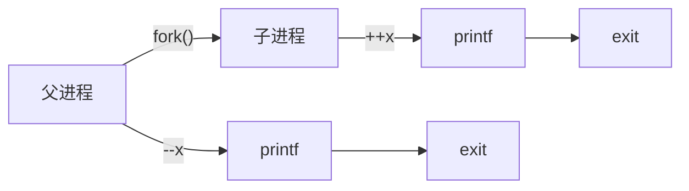

# 控制流

从给处理器加电开始，直到断电为止，假设程序计数器中值的序列

$$
a_0,\; a_1,\; a_2,\; \cdots,\; a_{n-1}
$$

其中$a_k$表示第$k$条指令$I_k$的地址，每次从 $a_k$ 到 $a_{k+1}$ 的过渡称为**控制转移**（control transfer）。这样的控制转移序列叫做处理器的**控制流**（flow of control 或 control flow）。

若每条指令的地址均是相邻的，则称其为平滑的，这也是最为简单的控制流。这种平滑流的突变（也就是$I_k$与$I_{k+1}$不相邻）通常是由于跳转或调用等指令引起的。

但同时，系统也必须能够对系统状态的变化做出反应，这些系统状态不是被内部程序变量捕获的，而且也不一定要和程序的执行相关。比如，一个硬件定时器定期产生信号，这个事件必须得到处理。包到达网络适配器后，必须存放在内存中。程序向磁盘请求数据，然后休眠，直到被通知说数据已就绪。当子进程终止时，创造这些子进程的父进程必须得到通知。

现代系统通过使控制流发生突变来对这些情况做出反应。一般而言，我们把这些突变称为**异常控制流**（Exceptional Control Flow，ECF）。

作为程序员，理解 ECF 很重要，这有很多原因：

- 理解 ECF 将帮助你理解重要的系统概念。ECF 是操作系统用来实现 I/O、进程和虚拟内存的基本机制。在能够真正理解这些重要概念之前，你必须理解 ECF。

- 理解 ECF 将帮助你理解应用程序是如何与操作系统交互的。应用程序通过使用一个叫做陷阱（trap）或者系统调用（system call）的 ECF 形式，向操作系统请求服务。比如，向磁盘写数据、从网络读取数据、创建一个新进程，以及终止当前进程，都是通过应用程序调用系统调用来实现的。理解基本的系统调用机制将帮助你理解这些服务是如何提供给应用的。

- 理解 ECF 将帮助你编写有趣的新应用程序。操作系统为应用程序提供了强大的 ECF 机制，用来创建新进程、等待进程终止、通知其他进程系统中的异常事件，以及检测和响应这些事件。如果理解了这些 ECF 机制，那么你就能用它们来编写诸如 Unix shell 和 Web 服务器之类的有趣程序了。

- 理解 ECF 将帮助你理解并发。ECF 是计算机系统中实现并发的基本机制。在运行中的并发的例子有：中断应用程序执行的异常处理程序，在时间上重叠执行的进程和线程，以及中断应用程序执行的信号处理程序。理解 ECF 是理解并发的第一步。我们会在第 12 章中更详细地研究并发。

- 理解 ECF 将帮助你理解软件异常如何工作。像 C++ 和 Java 这样的语言通过 `try`、`catch` 以及 `throw` 语句来提供软件异常机制。软件异常允许程序进行非本地跳转（即违反通常的调用/返回栈规则的跳转）来响应错误情况。非本地跳转是一种应用层 ECF，在 C 中是通过 setjmp 和 longjmp 函数提供的。理解这些低级函数将帮助你理解高级软件异常如何得以实现。

# 异常

## 异常处理

在处理器中，状态被编码为不同的位和信号。状态变化称为**事件**（event）。这些事件可能是由正在执行的指令引起的，也可能是由外部事件引起的。总之，任何情况下，处理器都必须对这些事件做出反应。处理器从执行应用程序切换到异常处理程序，处理完成后，根据异常处理程序的结果，处理器可能会返回到应用程序继续执行，也可能会终止应用程序。


> [!tip]
> 异常处理是硬件与软件共同完成的。注意辨认二者的分工。

在任何情况下，当处理器检测到有事件发生时，它就会通过一张叫做**异常表**（exception table）的跳转表，进行一个间接过程调用（异常），到一个专门设计用来处理这类事件的操作系统子程序（**异常处理程序**（exception handler））。

> [!note]
> 异常表的一部分内容由处理器硬件定义，另一部分内容由操作系统定义。异常表的每一项都包含一个异常处理程序的起始地址（指针）。

在系统启动时，操作系统会将异常表初始化并加载到处理器中。异常号就是异常表中每一项的索引。

异常表的起始地址通常存放在一个叫做**异常表基址寄存器**（exception table base register）的特殊寄存器中。

异常处理与函数调用类似，但有一些不同之处：

1. 异常的返回地址要么是异常发生的指令，要么是下一条指令。
2. 处理异常时，处理器会把处理器额外的状态信息保存到栈中，以便恢复应用程序的执行。
3. 如果控制从应用程序转移到系统内核，所有内容保存在内核栈中，而不是用户栈中
4. 异常处理程序运行在内核态，拥有对所有系统资源的访问权限

当异常处理程序完成处理后，根据引起异常的事件的类型，会发生以下 3 种情况中的一种：

- 处理程序将控制返回给当前指令 $I_{curr}$，即当事件发生时正在执行的指令。

- 处理程序将控制返回给 $I_{next}$，如果没有发生异常将会执行的下一条指令。

- 处理程序终止被中断的程序。

## 异常类型

异常可以分为四类：中断（interrupt），陷阱（trap）、故障（fault）和终止（abort）。

| 类别 | 原因              | 异步/同步 | 返回行为           |
| :--: | ----------------- | :-------: | ------------------ |
| 中断 | 来自I/O设备的信号 |   异步    | 总是返回到下一条   |
| 陷阱 | 有意的异常        |   同步    | 总是返回到下一条   |
| 故障 | 潜在可恢复的错误  |   同步    | 可能返回到当前指令 |
| 终止 | 不可恢复的错误    |   同步    | 不会返回           |

异步异常是由处理器外部的 I/O 设备中的事件产生的。同步异常是执行一条指令的直接产物

### 1. 中断

I/O 设备，例如网络适配器、磁盘控制器和定时器芯片，通过向处理器芯片上的一个引脚发信号，并将异常号放到系统总线上，来触发中断，这个异常号标识了引起中断的设备。

在当前指令完成执行之后，处理器注意到中断引脚的电压变高了，就从系统总线读取异常号，然后调用适当的中断处理程序。当处理程序返回时，它就将控制返回给下一条指令（也即如果没有发生中断，在控制流中会在当前指令之后的那条指令）。结果是程序继续执行，就好像没有发生过中断一样。

剩下的异常类型（陷阱、故障和终止）是同步发生的，是执行当前指令的结果。我们把这类指令叫做故障指令（faulting instruction）。

### 2. 陷阱和系统调用

陷阱是有意的异常，是执行一条指令的结果。就像中断处理程序一样，陷阱处理程序将控制返回到下一条指令。陷阱最重要的用途是在用户程序和内核之间提供一个像过程一样的接口，叫做系统调用。

用户程序经常需要向内核请求服务，比如读一个文件（read）、创建一个新的进程（fork），加载一个新的程序（execve），或者终止当前进程（exit）。为了允许对这些内核服务的受控的访问，处理器提供了一条特殊的 `syscall n` 指令，当用户程序想要请求服务 $n$ 时，可以执行这条指令。执行 `syscall` 指令会导致一个到异常处理程序的陷阱，这个处理程序解析参数，并调用适当的内核程序。

### 3. 故障

故障由错误情况引起，它可能能够被故障处理程序修正。当故障发生时，处理器将控制转移给故障处理程序。

- 如果处理程序能够修正这个错误情况，它就将控制**返回到引起故障的指令**，从而**重新执行**它。
- 否则，处理程序返回到内核中的 abort 例程，abort 例程会终止引起故障的应用程序。

一个经典的故障示例是缺页异常，当指令引用一个虚拟地址，而与该地址相对应的物理页面不在内存中，因此必须从磁盘中取出时，就会发生故障。就像我们将在第 9 章中看到的那样，一个页面就是虚拟内存的一个连续的块（典型的是 4KB）。缺页处理程序从磁盘加载适当的页面，然后将控制返回给引起故障的指令。当指令再次执行时，相应的物理页面已经驻留在内存中了，指令就可以没有故障地运行完成了。

### 4. 终止

终止是不可恢复的致命错误造成的结果，通常是一些硬件错误，比如 DRAM 或者 SRAM 位被损坏时发生的奇偶错误。终止处理程序从不将控制返回给应用程序，而是直接终止它。

## Linux/x86-64 系统中的异常

在x86-64 系统中一共定义了 256 种异常类型，其中0\~31号异常是由Intel的架构师设计的，对于任意的x86-64处理器都是一样的。32\~255号异常是由操作系统定义的，Linux使用了其中的一部分。

| 异常号  | 描述                     |     异常类别     |
| :-----: | ------------------------ | :--------------: |
|    0    | Divide Error             |      Fault       |
|   13    | General Protection fault |      Fault       |
|   14    | Page Fault               |      Fault       |
|   18    | Machine Check            |      Abort       |
| 32\~255 | OS-defined exceptions    | Trap / Interrupt |

### Linux/x86-64 的故障和终止

除法错误。当应用试图除以零时，或者当一个除法指令的结果对于目标操作数来说太大了的时候，就会发生除法错误（异常 0）。Unix 不会试图从除法错误中恢复，而是选择终止程序。Linuxshell 通常会把除法错误报告为“浮点异常（Floating exception）”。

一般保护故障。许多原因都会导致不为人知的一般保护故障（异常 13），通常是因为一个程序引用了一个未定义的虚拟内存区域，或者因为程序试图写一个只读的文本段。Linux 不会尝试恢复这类故障。Linux shell 通常会把这种一般保护故障报告为“段故障（Segmentation fault）”。

缺页（异常 14）是会重新执行产生故障的指令的一个异常示例。处理程序将适当的磁盘上虚拟内存的一个页面映射到物理内存的一个页面，然后重新执行这条产生故障的指令。我们将在第 9 章中看到缺页是如何工作的细节。

机器检查。机器检查（异常 18）是在导致故障的指令执行中检测到致命的硬件错误时发生的。机器检查处理程序从不返回控制给应用程序。

### Linux/86-64 系统调用

Linux 提供几百种系统调用，当应用程序想要请求内核服务时可以使用，包括读文件、写文件或是创建一个新进程。

| 编号 | 名字  | 描述               | 编号 |  名字  | 描述                 |
| :--: | :---: | ------------------ | :--: | :----: | -------------------- |
|  0   | read  | 读文件             |  33  | pause  | 挂起进程直到信号到达 |
|  1   | write | 写文件             |  37  | alarm  | 调度告警信号的传送   |
|  2   | open  | 打开文件           |  39  | getpid | 获取进程ID           |
|  3   | close | 关闭文件           |  57  |  fork  | 创建新进程           |
|  4   | stat  | 获取文件信息       |  59  | execve | 执行新程序           |
|  9   | mmap  | 将内存页映射到文件 |  60  | \_exit | 终止进程             |
|  12  |  brk  | 重置堆顶           |  61  | wait4  | 等待一个进程终止     |
|  32  | dup2  | 复制文件描述符     |  62  |  kill  | 向进程发送信号       |

C 程序用 `syscall` 函数可以直接调用任何系统调用。然而，实际中几乎没必要这么做。对于大多数系统调用，标准 C 库提供了一组方便的包装函数。这些包装函数将参数打包到一起，以适当的系统调用指令陷入内核，然后将系统调用的返回状态传递回调用程序。在本书中，我们将系统调用和与它们相关联的包装函数都称为系统级函数，这两个术语可以互换地使用。

在 X86-64 系统上，系统调用是通过一条称为 `syscall` 的陷阱指令来提供的。研究程序能够如何使用这条指令来直接调用 Linux 系统调用是很有趣的。

所有到 Linux 系统调用的参数都是通过通用寄存器而不是栈传递的。按照惯例，寄存器 `%rax` 包含系统调用号，寄存器 `%rdi`、`%rsi`、`%rdx`、`%r10`、`%r8` 和 `%r9` 包含最多 6 个参数。第一个参数在 `％rdi` 中，第二个在 `％rsi` 中，以此类推。从系统调用返回时，寄存器 `%rcx` 和 `%r11` 都会被破坏，`%rax` 包含返回值。`-4095` 到 `-1` 之间的负数返回值表明发生了错误，对应于负的 `errno`。

例如，一个简单的 hello world 程序可以使用 `syscall` 函数来直接调用 Linux 系统调用。下面是一个简单的示例：

```c
int main() {
    write(1, "Hello, world!\n", 13); // 1 -> stdout, 13 -> length of string
    _exit(0);
}
```

```asm
.section .data
string:
  .ascii "hello, world\n"
string_end:
  .equ len, string_end - string
.section .text
.globl main
main:
  # First, call write(1, "hello, world\n", 13)
  movq $1, %rax                 # write is system call 1
  movq $1, %rdi                 # Arg1: stdout has descriptor 1
  movq $string, %rsi            # Arg2: hello world string
  movq $len, %rdx               # Arg3: string length
  syscall                       # Make the system call

  # Next, call _exit(0)
  movq $60, %rax                # _exit is system call 60
  movq $0, %rdi                 # Arg1: exit status is 0
  syscall                       # Make the system call
```

# 进程

异常是允许操作系统内核提供**进程**（process）概念的基本构造块，进程是计算机科学中最深刻、最成功的概念之一。

进程的经典定义就是一个执行中程序的实例。系统中的每个程序都运行在某个进程的**上下文**（context）中。上下文是由程序正确运行所需的状态组成的。这个状态包括存放在内存中的程序的代码和数据，它的栈、通用目的寄存器的内容、程序计数器、环境变量以及打开文件描述符的集合。

每次用户通过向 shell 输入一个可执行目标文件的名字，运行程序时，shell 就会创建一个新的进程，然后在这个新进程的上下文中运行这个可执行目标文件。应用程序也能够创建新进程，并且在这个新进程的上下文中运行它们自己的代码或其他应用程序。

关于操作系统如何实现进程的细节的讨论超出了本书的范围。反之，我们将关注进程提供给应用程序的关键抽象：

- 一个独立的逻辑控制流，它提供一个假象，好像我们的程序独占地使用处理器。

- 一个私有的地址空间，它提供一个假象，好像我们的程序独占地使用内存系统。让我们更深入地看看这些抽象。

## 逻辑控制流

如果想用调试器单步执行程序，我们会看到一系列的程序计数器（PC）的值，这些值唯一地对应于包含在程序的可执行目标文件中的指令，或是包含在运行时动态链接到程序的共享对象中的指令。这个 PC 值的序列叫做**逻辑控制流**（logical control flow），或者简称**逻辑流**。

考虑一个运行着三个进程的系统，如图所示。处理器的一个物理控制流被分成了三个逻辑流，每个进程一个。图中每个竖直的条表示一个进程的逻辑流的一部分。在这个例子中，三个逻辑流的执行是交错的。进程 A 运行了一会儿，然后是进程 B 开始运行到完成。然后，进程 C 运行了一会儿，进程 A 接着运行直到完成。最后，进程 C 可以运行到结束了。

```
            A       B       c
      │     │
      │             │
      │             │
 time │                     │
      │     │
      │     │
      │                     │
      

```

关键点在于进程是轮流使用处理器的。每个进程执行它的流的一部分，然后被**抢占**（preempted）（暂时挂起），然后轮到其他进程。对于一个运行在这些进程之一的上下文中的程序，它看上去就像是在独占地使用处理器。唯一的反面例证是，如果我们精确地测量每条指令使用的时间，会发现在程序中一些指令的执行之间，CPU 好像会周期性地停顿。然而，每次处理器停顿，它随后会继续执行我们的程序，并不改变程序内存位置或寄存器的内容。

## 并发流

每个进程执行它的流的一部分，我们把一个逻辑流的执行在时间上与另一个逻辑流重叠的情况称为**并发流**（concurrent flows）。两个逻辑流的执行称为**并发运行**。可见，A 和 B，A 和 C 是并发运行的，而 B 和 C 不是，因为 C 在 B 运行完成后才开始运行。

多个流并发地执行的一般现象被称为**并发**（concurrency）。一个进程和其他进程轮流运行的概念称为**多任务**（multitasking）o 一个进程执行它的控制流的一部分的每一时间段叫做**时间片**（time slice）。因此，多任务也叫做**时间分片**（timeslicing）。例如，进程 A 的流由两个时间片组成。

> [!tip]
> 注意，并发流的思想与流运行的处理器核数或者计算机数无关。如果两个流在时间上重叠，那么它们就是并发的，即使它们是运行在同一个处理器上。不过，有时我们会发现确认并行流是很有帮助的，它是并发流的一个真子集。如果两个流并发地运行在不同的处理器核或者计算机上，那么我们称它们为并行流（parallel flow），它们并行地运行（running in parallel），且并行地执行（parallel execution）。

## 私有地址空间

进程也为每个程序提供一种假象，好像它独占地使用系统地址空间。在一台 $n$ 位地址的机器上，地址空间是$2^n$个可能地址的集合，$0, 1, \ldots, 2^n - 1$。进程为每个程序提供它自己的**私有地址空间**。一般而言，和这个空间中某个地址相关联的那个内存字节是不能被其他进程读或者写的，从这个意义上说，这个地址空间是私有的。

## 用户模式和内核模式

为了限制一个应用可以执行的指令以及它可以访问的地址空间范围。通常，处理器是用控制寄存器中的**模式位**（mode bit）来提供这种功能的，该寄存器描述了进程当前享有的特权。

- 当设置了模式位时，进程就运行在内核模式中（有时叫做超级用户模式）。
  - 一个运行在内核模式的进程可以执行指令集中的任何指令，并且可以访问系统中的任何内存位置。

- 没有设置模式位时，进程就运行在用户模式中。
  - 用户模式中的进程不允许执行**特权指令**（privileged instruction），比如停止处理器、改变模式位，或者发起一个 I/O 操作。
  - 也不允许用户模式中的进程直接引用地址空间中内核区内的代码和数据。任何这样的尝试都会导致致命的保护故障。反之，用户程序必须通过系统调用接口间接地访问内核代码和数据。

运行应用程序代码的进程初始时是在用户模式中的。进程从用户模式变为内核模式的唯一方法是通过诸如中断、故障或者陷入系统调用这样的异常。当异常发生时，控制传递到异常处理程序，处理器将模式从用户模式变为内核模式。处理程序运行在内核模式中，当它返回到应用程序代码时，处理器就把模式从内核模式改回到用户模式。

Linux 提供了一种聪明的机制，叫做 `/proc` 文件系统，它允许用户模式进程访问内核数据结构的内容。`/proc` 文件系统将许多内核数据结构的内容输出为一个用户程序可以读的文本文件的层次结构。比如，你可以使用 / proc 文件系统找出一般的系统属性，比如 CPU 类型（`/proc/cpuinfo`），或者某个特殊的进程使用的内存段（`/proc/<process-id>/maps`）。2.6 版本的 Linux 内核引入 /sys 文件系统，它输岀关于系统总线和设备的额外的低层信息。

## 上下文切换

操作系统内核使用一种称为**上下文切换**（context switch）的较高层形式的异常控制流来实现多任务。上下文切换机制是建立在 8.1 节中已经讨论过的那些较低层异常机制之上的。

内核为每个进程维持一个**上下文**（context）。上下文就是内核重新启动一个被抢占的进程所需的状态。它由一些对象的值组成，这些对象包括

- 通用目的寄存器、浮点寄存器
- 程序计数器、用户栈、状态寄存器
- 内核栈和各种内核数据结构，比如描述地址空间的页表、包含有关当前进程信息的进程表，以及包含进程已打开文件的信息的文件表。

在进程执行的某些时刻，内核可以决定抢占当前进程，并重新开始一个先前被抢占了的进程。这种决策就叫做**调度**（scheduling），是由内核中称为**调度器**（scheduler）的代码处理的。当内核选择一个新的进程运行时，我们说内核调度了这个进程。在内核调度了一个新的进程运行后，它就抢占当前进程，并使用一种称为上下文切换的机制来将控制转移到新的进程，上下文切换分为三步

1. 保存当前进程的上下文
2. 恢复某个先前被抢占的进程被保存的上下文
3. 将控制传递给这个新恢复的进程。

当内核代表用户执行系统调用时，可能会发生上下文切换。如果系统调用因为等待某个事件发生而阻塞，那么内核可以让当前进程休眠，切换到另一个进程。比如，如果一个 read 系统调用需要访问磁盘，内核可以选择执行上下文切换，运行另外一个进程，而不是等待数据从磁盘到达。另一个示例是 sleep 系统调用，它显式地请求让调用进程休眠。一般而言，即使系统调用没有阻塞，内核也可以决定执行上下文切换，而不是将控制返回给调用进程。

中断也可能引发上下文切换。比如，所有的系统都有某种产生周期性定时器中断的机制，通常为每 1 毫秒或每 10 毫秒。每次发生定时器中断时，内核就能判定当前进程已经运行了足够长的时间，并切换到一个新的进程。

图中展示了一对进程 A 和 B 之间上下文切换的示例。在这个例子中，进程 A 初始运行在用户模式中，直到它通过执行系统调用 read 陷入到内核。内核中的陷阱处理程序请求来自磁盘控制器的 DMA 传输，并且安排在磁盘控制器完成从磁盘到内存的数据传输后，磁盘向处理器发送中断。


磁盘取数据要用一段相对较长的时间（数量级为几十毫秒），所以内核执行从进程 A 到进程 B 的上下文切换，而不是在这个间歇时间内等待，什么都不做。注意在切换之前，内核正代表进程 A 在用户模式下执行指令（即没有单独的内核进程）。在切换的第一部分中，内核代表进程 A 在内核模式下执行指令。然后在某一时刻，它开始代表进程 B（仍然是内核模式下）执行指令。在切换之后，内核代表进程 B 在用户模式下执行指令。

随后，进程 B 在用户模式下运行一会儿，直到磁盘发出一个中断信号，表示数据已经从磁盘传送到了内存。内核判定进程 B 已经运行了足够长的时间，就执行一个从进程 B 到进程 A 的上下文切换，将控制返回给进程 A 中紧随在系统调用 read 之后的那条指令。进程 A 继续运行，直到下一次异常发生，依此类推。

# 系统调用错误处理

当 Unix 系统级函数遇到错误时，它们通常会返回 `-1`，并设置全局整数变量 `errno` 来表示什么出错了。程序员应该总是检查错误

```c
void unix_error(char *msg) /* Unix-style error */
{
    fprintf(stderr, "%s: %s\n", msg, strerror(errno));
    exit(0);
}
```

# 进程控制

Unix 提供了大量从 C 程序中操作进程的系统调用。这一节将描述这些重要的函数，并举例说明如何使用它们。

## 获取进程ID

每个进程都有一个唯一的正数（非零）进程 ID（PID）。`getpid `函数返回调用进程的 PID。`getppid` 函数返回它的父进程的 PID（创建调用进程的进程）。

`getpid` 和 `getppid` 函数返回一个类型为 `pid_t` 的整数值，在 Linux 系统上它在 `types.h` 中被定义为 `int`。

## 创建和终止进程

从程序员的角度，我们可以认为进程总是处于下面三种状态之一：

- **运行。** 进程要么在 CPU 上 执行，要么在等待被执行且最终会被内核调度。

- **停止。** 进程的执行被**挂起**（suspended），且不会被调度。当收到 `SIGSTOP`、`SIGTSTP`、`SIGTTIN` 或者 `SIGTTOU` 信号时，进程就停止，并且保持停止直到它收到一个 `SIGCONT` 信号，在这个时刻，进程再次开始运行。（信号是一种软件中断的形式，将在 8.5 节中详细描述。）

- **终止。** 进程永远地停止了。进程会因为三种原因终止：
  1. 收到一个信号，该信号的默认行为是终止进程；
  2. 从主程序返回；
  3. 调用 `exit` 函数。

`void exit(int status)` 函数以 `status` 退出状态来终止进程。status 是一个整数值，通常为 0 表示成功，非零表示失败。`exit` 函数不会返回。

父进程通过调用 `pid_t fork(void)` 函数创建一个新的运行的子进程。

新创建的子进程几乎但不完全与父进程相同。子进程得到与父进程用户级虚拟地址空间相同的（但是独立的）一份副本，包括代码和数据段、堆、共享库以及用户栈。子进程还获得与父进程任何打开文件描述符相同的副本，这就意味着当父进程调用 fork 时，子进程可以读写父进程中打开的任何文件。父进程和新创建的子进程之间最大的区别在于它们有不同的 PID。

fork 函数是有趣的（也常常令人迷惑），因为它只被调用一次，却会返回两次：一次是在调用进程（父进程）中，一次是在新创建的子进程中。在父进程中，fork 返回子进程的 PID。在子进程中，fork 返回 0。因为子进程的 PID 总是为非零，返回值就提供一个明确的方法来分辨程序是在父进程还是在子进程中执行。

> [!tip]
> 子进程与父进程只有PID不同。它们的代码运行位置也是相同的，也就是说，父进程和子进程在 fork 返回后都从下一条指令开始执行。
>
> 对于创建该子进程的那个`fork`函数，在该子进程中视为返回值为`0`

```c
int main()
{
    pid_t pid;
    int x = 1;

    pid = Fork();
    if (pid == 0) { /* Child */
        printf("child : x=%d\n", ++x);
        exit(0);
    }

    /* Parent */
    printf("parent: x=%d\n", --x);
    exit(0);
}
```

运行上面的程序会产生如下输出：

```bash
linux> ./fork
parent：x=0
child ：x=2
```



这个简单的例子有一些微妙的方面。

- **调用一次，返回两次。** fork 函数被父进程调用一次，但是却返回两次。一次是返回到父进程，一次是返回到新创建的子进程。对于只创建一个子进程的程序来说，这还是相当简单直接的。但是具有多个 fork 实例的程序可能就会令人迷惑，需要仔细地推敲了。

- **并发执行。** 父进程和子进程是并发运行的独立进程。内核能够以任意方式交替执行它们的逻辑控制流中的指令。在我们的系统上运行这个程序时，父进程先完成它的 printf 语句，然后是子进程。然而，在另一个系统上可能正好相反。一般而言，作为程序员，我们决不能对不同进程中指令的交替执行做任何假设。

- **相同但是独立的地址空间。** 如果能够在 fork 函数在父进程和子进程中返回后立即暂停这两个进程，我们会看到两个进程的地址空间都是相同的。每个进程有相同的用户栈、相同的本地变量值、相同的堆、相同的全局变量值，以及相同的代码。因此，在我们的示例程序中，当 fork 函数在第 6 行返回时，本地变量 x 在父进程和子进程中都为 1。然而，因为父进程和子进程是独立的进程，它们都有自己的私有地址空间。后面，父进程和子进程对 x 所做的任何改变都是独立的，不会反映在另一个进程的内存中。这就是为什么当父进程和子进程调用它们各自的 printf 语句时，它们中的变量 x 会有不同的值。

- **共享文件。** 当运行这个示例程序时，我们注意到父进程和子进程都把它们的输出显示在屏幕上。原因是子进程继承了父进程所有的打开文件。当父进程调用 fork 时，stdout 文件是打开的，并指向屏幕。子进程继承了这个文件，因此它的输出也是指向屏幕的。

类似的，我们看接下来的程序

```c
int main(){
    Fork();
    Fork();
    printf("hello\n");
    exit(0);
}
```

程序会打印出4行 hello。这是因为第一次 fork 的子进程也会执行第二次 fork。

## 回收子进程

当一个进程由于某种原因终止时，内核并不是立即把它从系统中清除。相反，进程被保持在一种已终止的状态中，直到被它的父进程**回收**（reaped）。当父进程回收已终止的子进程时，内核将子进程的退出状态传递给父进程，然后抛弃已终止的进程，从此时开始，该进程就不存在了。一个终止了但还未被回收的进程称为**僵死进程**（zombie）。

如果一个父进程终止了，内核会安排 init 进程成为它的孤儿进程的养父。init 进程的 PID 为 1，是在系统启动时由内核创建的，它不会终止，是所有进程的祖先。如果父进程没有回收它的僵死子进程就终止了，那么内核会安排 init 进程去回收它们。不过，长时间运行的程序，比如 shell 或者服务器，总是应该回收它们的僵死子进程。即使僵死子进程没有运行，它们仍然消耗系统的内存资源。

一个进程可以通过调用 waitpid 函数来等待它的子进程终止或者停止。

```c
#include <sys/types.h>
#include <sys/wait.h>

pid_t waitpid(pid_t pid, int *statusp, int options);

// 返回：如果成功，则为子进程的 PID，如果 WNOHANG，则为 0，如果其他错误，则为 -1。
```

waitpid 函数有点复杂。默认情况下（当 `options=0` 时），waitpid 挂起调用进程的执行，直到它的**等待集合**（wait set）中的一个子进程终止。如果等待集合中的一个进程在刚调用的时刻就已经终止了，那么 waitpid 就立即返回。在这两种情况中，waitpid 返回导致 waitpid 返回的已终止子进程的 PID。此时，已终止的子进程已经被回收，内核会从系统中删除掉它的所有痕迹。

### 判定等待集合的成员

等待集合的成员是由参数 pid 来确定的：

- 如果 `Pid > 0`，那么等待集合就是一个单独的子进程，它的进程 ID 等于 pid。

- 如果 `Pid = -1`，那么等待集合就是由父进程所有的子进程组成的。

waitpid 函数还支持其他类型的等待集合，包括 Unix 进程组，对此我们将不做讨论。

### 修改默认行为

可以通过将 options 设置为常量 `WNOHANG`，`WUNTRACED` 和 `WCONTINUED` 的各种组合来修改默认行为：

- **WNOHANG：** 如果等待集合中的任何子进程都还没有终止，那么就立即返回（返回值为 0）。默认的行为是挂起调用进程，直到有子进程终止。在等待子进程终止的同时，如果还想做些有用的工作，这个选项会有用。

- **WUNTRACED：** 挂起调用进程的执行，直到等待集合中的一个进程变成已终止或者被停止，返回的 PID 为导致返回的已终止或被停止子进程的 PID。默认的行为是只返回已终止的子进程。当你想要检査已终止和被停止的子进程时，这个选项会有用。

- **WCONTINUED：** 挂起调用进程的执行，直到等待集合中一个正在运行的进程终止或等待集合中一个被停止的进程收到 SIGCONT 信号重新开始执行。（8.5 节会解释这些信号。）

可以用或运算把这些选项组合起来。例如：

- **WNOHANG | WUNTRACED：** 立即返回，如果等待集合中的子进程都没有被停止或终止，则返回值为 0；如果有一个停止或终止，则返回值为该子进程的 PID。

### 检查已回收子进程的退出状态

如果 statusp 参数是非空的，那么 waitpid 就会在 status 中放上关于导致返回的子进程的状态信息，status 是 statusp 指向的值。wait.h 头文件定义了解释 status 参数的几个宏：

- WIFEXITED(status)：如果于进程通过调用 exit 或者一个返回（return）正常终止，就返回真。

- WEXITSTATUS(status)：返回一令正常终止的子进程的退出状态。只有在 WIFEXITED() 返回为真时，才会定义这个状态。

- WIFSIGNALED(status)：如果子进程是因为一个未被捕获的信号终止的，. 那么就返回真。

- WTERMSIG(status)：返回导致子进程终止的信号的编号。只有在 WIFSIGNALED() 返回为真时，才定义这个状态。

- WIFSTOPPED(status)：如果引起返回的子进程当前是停止的，那么就返回真。

- WSTOPSIG(status)：返回引起子进程停止的信号的编号。只有在 WIFSTOPPED() 返回为真时，才定义这个状态。

- WIFCONTINUED(status)：如果子进程收到 SIGCONT 信号重新启动，则返回真。

### 错误条件

如果调用进程没有子进程，那么 `waitpid` 返回 `-1`，并且设置 `errno` 为 `ECHILD`。如果 `waitpid` 函数被一个信号中断，那么它返回 `-1`，并设置 `errno` 为 `EINTR`。

### wait 函数

```c
#include <sys/types.h>
#include <sys/wait.h>

pid_t wait(int *statusp);
// 返回：如果成功，则为子进程的 PID，如果出错，则为 -1。
```

调用 `wait(&status)` 等价于调用 `waitpid(-1, &status, 0)`。

### waitpid 示例

```c
#include "csapp.h"
#define N 2

int main()
{
    int status, i;
    pid_t pid;

    /* Parent creates N children */
    for (i = 0; i < N; i++)
        if ((pid = Fork()) == 0) /* Child */
            exit(100+i);

    /* Parent reaps N children in no particular order */
    while ((pid = waitpid(-1, &status, 0)) > 0) {
        if (WIFEXITED(status))
            printf("child %d terminated normally with exit status=%d\n",
                   pid, WEXITSTATUS(status));
        else
            printf("child %d terminated abnormally\n", pid);
    }

    /* The only normal termination is if there are no more children */
    if (errno != ECHILD)
        unix_error("waitpid error");

    exit(0);
}
```

注意，程序不会按照特定的顺序回收子进程。子进程回收的顺序是这台特定的计算机系统的属性。在另一个系统上，甚至在同一个系统上再执行一次，两个子进程都可能以相反的顺序被回收。这是非确定性行为的一个示例，这种非确定性行为使得对并发进行推理非常困难。两种可能的结果都同样是正确的，作为一个程序员，你绝不可以假设总是会出现某一个结果，无论多么不可能出现另一个结果。唯一正确的假设是每一个可能的结果都同样可能出现。

我们可以通过将 `waitpid` 的第一个参数修改为对应子线程的pid来确定等待顺序，不过这要求我们储存所有子线程的pid

## 让进程休眠

sleep函数将一个进程挂起一段指定的时间。

```c
#include <unistd.h>
unsigned int sleep(unsigned int secs);

// 返回：还要休眠的秒数。
```

如果请求的时间量已经到了，sleep 返回 0，否则返回还剩下的要休眠的秒数。后一种情况是可能的，如果因为 sleep 函数被一个信号中断而过早地返回。我们将在 8.5 节中详细讨论信号。

我们会发现另一个很有用的函数是 pause 函数，该函数让调用函数休眠，直到该进程收到一个信号。

```c
#include <unistd.h>
int pause(void);

// 总是返回 -1。
```

## 加载并运行程序

execve 函数在当前进程的上下文中加载并运行一个新程序。

```c
#include <unistd.h>
int execve(const char *filename, const char *argv[], const char *envp[]);

// 如果成功，则不返回，如果错误，则返回 -1。
```

execve 函数加载并运行可执行目标文件 filename，且带参数列表 argv 和环境变量列表 envp。只有当出现错误时，例如找不到 filename，execve 才会返回到调用程序。所以，与 fork 一次调用返回两次不同，execve 调用一次并从不返回。

例如在shell中调用`ls -lt /user/include`，那么`argv[0]`,`argv[1]`,`argv[2]`就分别为`"ls"`,`"-lt"`,`"/user/include"`

类似的，环境变量列表`envp`也指向包含当前环境变量（如当前文件路径、用户名）字符串的列表，每个串都是形如 “name=value” 的名字—值对。
