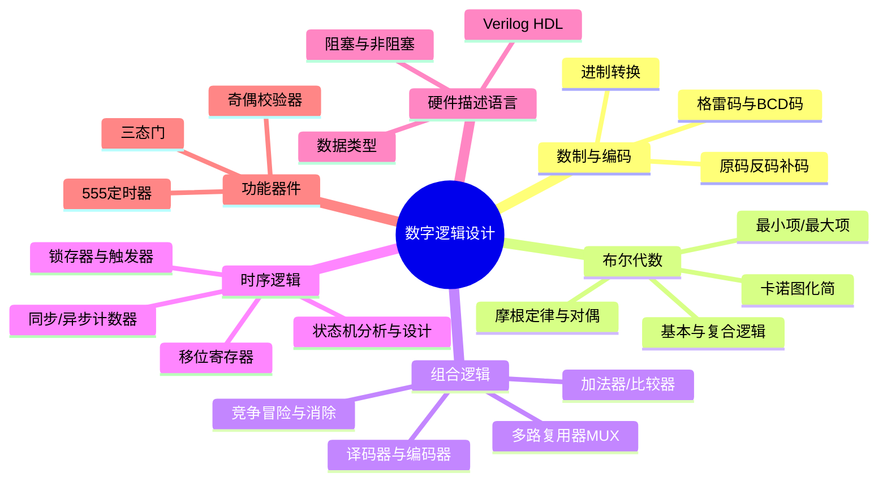
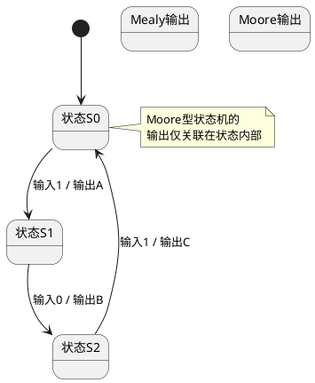
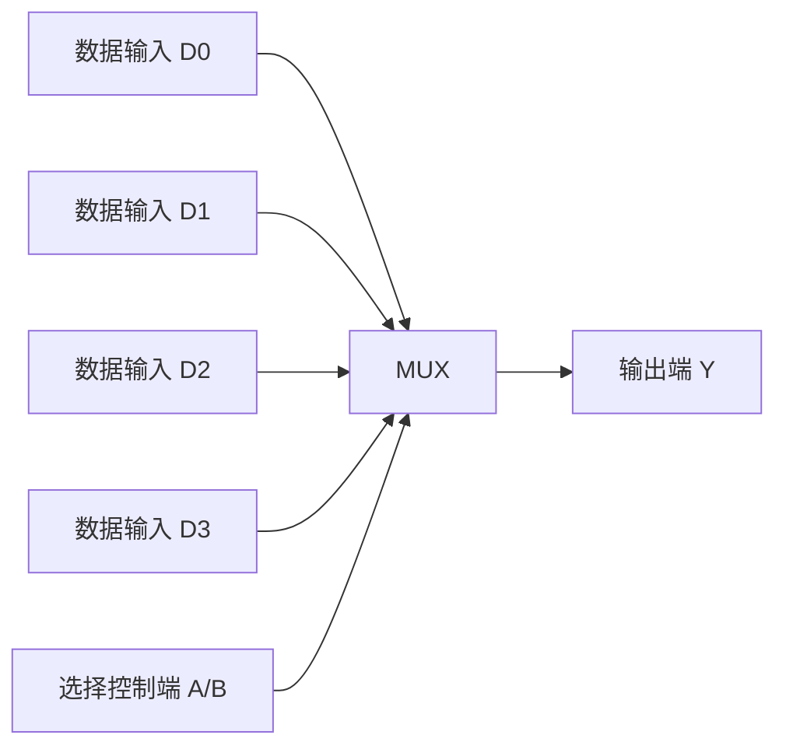

# 数字逻辑设计完整知识体系笔记

## 一、 知识架构总览 (Mermaid 架构图)

---

## 二、 数制与编码基础

### 1. 数制转换

- **十进制 → 二进制**
  - **整数部分：** 除2取余，逆序排列（例：$107_{10} \to 1101011_2$）。
  - **小数部分：** 乘2取整，顺序排列（例：$0.4375_{10} \to 0.0111_2$）。
- **二进制 → 十进制**：按权展开相加。
- **二进制 ↔ 八进制**：三位并一位。
- **二进制 ↔ 十六进制**：四位并一位（注意位数不够补零）。

### 2. 机器数的编码

- **原码**：最高位为符号位（0正1负），其余为数值位。
- **反码**：正数同原码，负数符号位不变，其余位取反。
- **补码**：正数同原码，负数反码加一。
  - _重点：_ $N$位补码的表示范围：$-(2^{N-1}) \sim + (2^{N-1} -1)$。
- **其他编码**：
  - **BCD码**：8421码（最常见）、5421码、2421码。
  - **余3码**：BCD码 + 3。
  - **格雷码**：相邻两个数之间只有一位不同。
    - _计算：_ 二进制数转换为格雷码时，**最高位相同，其余位两两异或**（相同取0，不同取1）。
    - _例：_ 二进制 `10110110` → 格雷码 `11101101`。

---

## 三、 逻辑代数与函数化简

### 1. 基本逻辑运算

- **与 (AND)、或 (OR)、非 (NOT)**。
- **复合逻辑**：与非 (NAND)、或非 (NOR)、与或非、**异或 (XOR)**、**同或 (XNOR)**。
  - _特征方程_：异或 $F=A \oplus B = AB' + A'B$；同或 $F = A \odot B = AB + A'B'$。
- **逻辑代数的基本定律**：交换律、结合律、分配律。
- **摩根定律**（反演律）：$(A+B)' = A' \cdot B'$， $(AB)' = A' + B'$。
- **对偶规则与反演规则**：在逻辑电路设计中非常实用，用于函数和求解。

### 2. 最大项与最小项

- **最小项 ($m$)**：取值组合中输出为 **1** 的项（取原变量）。
- **最大项 ($M$)**：取值组合中输出为 **0** 的项（取反变量）。
- **重要性质**：
  1. 全部最小项之和恒等于 "1"。
  2. 全部最大项之积恒等于 "0"。
  3. 一部分最小项之和的反，等于其他所有最小项之和。
- **标准表达式**：函数可表示为 $Y = \sum m(\text{编号})$ 或 $Y = \prod M(\text{编号})$。

### 3. 卡诺图化简 (核心技能)

- **化简原则**：
  1.  **圈"1"法**：写出**与或式**。圈内的方格数必须是 $2^n$ 个。
  2.  **圈"0"法**：写出**或与式**（常用于电路实现时反变量较多的情况）。
- **无关项处理**：
  - **约束项**：不可能出现的输入组合（对逻辑无影响）。
  - **任意项**：输出为任意值（0或1都可），用于扩大化简圈，使电路更简单。
  - _注意_：最简表达式可能不唯一，但实现代价（逻辑门使用数）通常相同。

### 4. 组合逻辑的设计流程

- 真值表 → 卡诺图化简 → 逻辑表达式 → 门电路实现。

---

## 四、 组合逻辑电路设计

### 1. 二级门电路设计（逻辑变换）

- **给定最简与或式 → 最简与非式**：两次取反，应用反演律。
- **给定最简与或式 → 最简或非式**：先求反函数的与或式，再取反。
- **方法总结**：根据提供的逻辑门，善用**对偶**和**反演**原则转换表达式。

### 2. 多输出门电路设计

- _策略_：找出多个逻辑函数之间**共同的逻辑项**（共享“与”项，复用逻辑门），减少电路总面积。

### 3. 组合电路中的险象（竞争冒险）

- **静态冒险**：输入变化一次，电路产生了一个错误的脉冲（毛刺）。
  - _代数法判断_：若某个变量同时以原变量和反变量形式出现在逻辑式中（如 $F = A + A'$ 产生0型冒险，或 $F = A \cdot A'$ 产生1型冒险）。
  - _卡诺图法判断_：化简后的卡诺图中存在**相切**的圈（圈与圈边界相连但无重叠区域）。
- **动态冒险**：在多级门电路中，输入变化一次，输出发生**多次**错误翻转。
- **险象消除**：
  1.  添加冗余项（在卡诺图中添加重合圈）。
  2.  添加滤波电容（吸收窄脉冲毛刺）。
  3.  添加选通脉冲（封闭电路在输入端变化期间输出）。

---

## 五、 时序逻辑电路设计

### 1. 锁存器 (Latch) 与 触发器 (Flip-Flop)

- _区别_：锁存器不含时钟（电平触发），触发器带时钟（边沿触发，理想状态）。
- **基本RS锁存器**：有不定态（输入约束），“双稳态”特性。
- **门控D锁存器**：解决了输入不定态问题，但存在**空翻**（亚稳态风险）。
- **边沿触发器（核心）**：
  - **D触发器**：$Q^{n+1} = D$。
  - **JK触发器**：$Q^{n+1} = JQ' + K'Q$（无不定态，万能触发器）。
  - **T触发器**：$Q^{n+1} = T \oplus Q^n$（当$T=1$时翻转）。
  - **T'触发器**：$Q^{n+1} = Q'$ （每个时钟翻转一次，用于计数）。

### 2. 触发器类型转换

- **无脑转换法**：使用卡诺图求解驱动方程。
- _示例_：**JK触发器 → D触发器**：对比特征方程 $Q^{n+1} = JQ' + K'Q$ 与 $Q^{n+1} = D$，变换推导出 $J=D, K=D'$ 即可。

### 3. 时序电路分析与设计 (状态机)

- **Mealy型状态机**：输出取决于 **当前状态 + 当前输入**。
- **Moore型状态机**：输出仅取决于 **当前状态**。

### 4. 状态化简与状态分配

- **隐含表化简法**：寻找输出相同、且次态等效的状态进行合并。
- **状态分配原则**：尽量把相邻状态的编码定为相邻（如 $00 \to 01 \to 10 \to 11$ 的格雷码分配），以减少组合逻辑。

### 5. 典型时序电路

- **移位寄存器**：右移、左移、串入串出/并入并出、双向移位寄存器。
- **计数器**：
  - 异步计数器（速度较慢，存在传输延迟）。
  - 同步计数器（速度较快，无毛刺，推荐使用）。
  - _扭环形计数器_：编码资源利用率低（$2N$个状态），但**无译码冒险**，后级译码只需2输入门，构成模8计数器。

---

## 六、 硬件描述语言 Verilog HDL

### 1. 数据类型与赋值

- **4种逻辑值**：`0` (低电平), `1` (高电平), `X` (未知状态), `Z` (高阻态)。
- **数据类型**：`wire` 类型（用于连接，默认为Z），`reg` 类型（用于存储状态，默认为X）。
- **赋值语句**：
  - **阻塞赋值 (`=`)**：顺序执行，用于**组合逻辑**。
  - **非阻塞赋值 (`<=`)**：并行执行，用于**时序逻辑**（`always @(posedge clk)`）。
- **运算符**：算数、移位、位运算、拼接、等式（`===` 匹配不定态X，`==` 不匹配）。

### 2. 过程块与条件语句

- **组合逻辑**：`always @(*)` + 阻塞赋值。
- **时序逻辑**：`always @(posedge clk or negedge rst_n)` + 非阻塞赋值。
- **条件语句**：`if...else` 和 `case` 语句。注意不要产生隐含的**锁存器（Latch）**（必须要覆盖所有条件分支，或加上 `default`）。

---

## 七、 中规模集成逻辑部件 (MSI) 应用

这部分是计科逻辑设计考试和工程应用中最常用、最重要的模块。

### 1. 多路复用器 (MUX / 数据选择器)

- **功能**：利用选择控制端，从多路输入数据中选出1路送到输出端。
- **应用**：**使用MUX实现任意组合逻辑函数**。
  - _降维法_：将一部分变量接在控制端，剩余变量接入数据输入端，并列出卡诺图进行匹配。
  - _实现示例_：8选1 MUX 实现4变量逻辑函数。

### 2. 译码器 (Decoder) 与 编码器 (Encoder)

- **3线-8线译码器 (74LS138)**：
  - 输入3位二进制，输出8位独热码（低电平有效）。
  - **应用**：**实现多路输出的组合逻辑**。
  - _方法_：引出所有对应最小项的输出，再进行“与”或“或”连线。
- **编码器 (74LS148)**：
  - 输入8位信号，输出3位二进制码（输入输出均低电平有效）。
  - _优先级问题_：允许同时输入多路信号，只对优先级最高的信号编码。
- **奇偶校验器 (74LS280)**：产生1位奇偶校验位，用于数据传输的错误检测。

### 3. 加法器与数值比较器

- **全加器**：$S*i = a_i \oplus b_i \oplus c_i$， $C*{i+1} = a_i b_i + c_i(a_i \oplus b_i)$。
- **并行加法器**：
  - **串行进位**：低位进位输出作为高位进位输入，速度较慢，电路简单。
  - **并行进位/先行进位**：通过额外逻辑直接算出进位值，速度较快。
- **数值比较器 (Magnitude Comparator)**：
  - 分为1位比较和多位数比较。
  - _实现方式_：**串行方式**（速度慢），**并行方式**（速度快），如16位比较可以分成4组并行。

---
