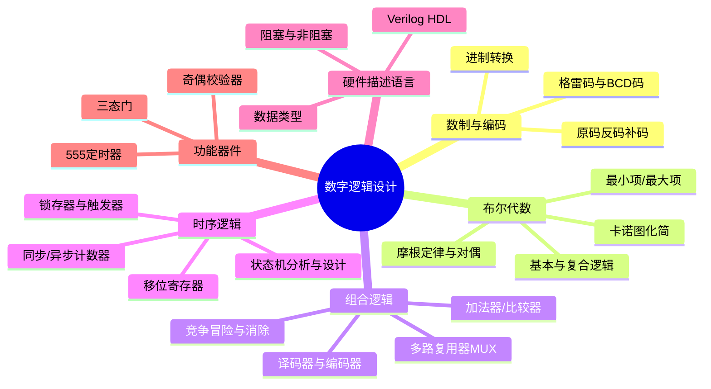
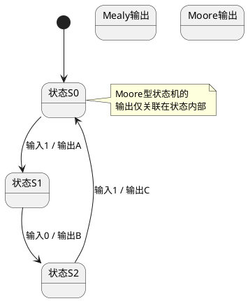
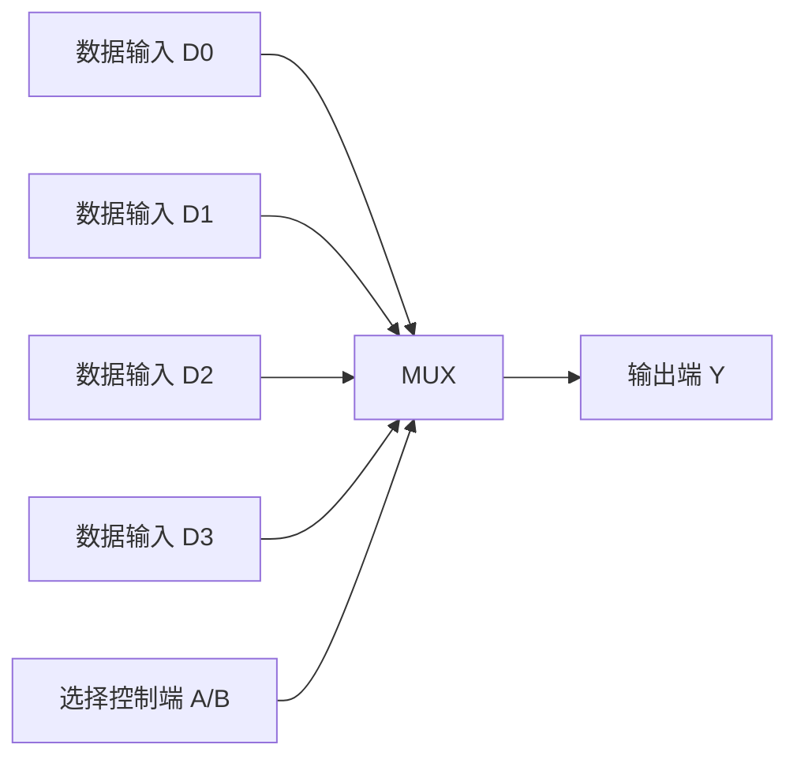

# 数字逻辑设计完整知识体系笔记

## 一、 知识架构总览

```mermaid
mindmap
  root((数字逻辑设计))
    数制与编码
      进制转换
      原码反码补码
      格雷码与BCD码
    布尔代数
      基本与复合逻辑
      摩根定律与对偶
      卡诺图化简
      最小项/最大项
    组合逻辑
      多路复用器MUX
      译码器与编码器
      加法器/比较器
      竞争冒险与消除
    时序逻辑
      锁存器与触发器
      移位寄存器
      同步/异步计数器
      状态机分析与设计
    硬件描述语言
      Verilog HDL
      阻塞与非阻塞
      数据类型
    功能器件
      奇偶校验器
      三态门
      555定时器
```

---

## 二、 数制与编码基础

### 1. 数制转换

- **十进制 → 二进制**
  - **整数部分：** 除2取余，逆序排列
  - **小数部分：** 乘2取整，顺序排列
- **二进制 → 十进制**：按权展开相加。
- **二进制 ↔ 八进制**：三位并一位。
- **二进制 ↔ 十六进制**：四位并一位（注意位数不够补零）。

> [!question] 例1
> 将十进制数 $-13.625$ 转换为二进制数。

**解**：

1.  整数部分
    | 整数部分 | 余数 |
    | :---: | :---: |
    | 13 ÷ 2 | 1 |
    | 6 ÷ 2 | 0 |
    | 3 ÷ 2 | 1 |
    | 1 ÷ 2 | 1 |

    逆序排列余数：$1101$

2.  小数部分
    | 小数部分 | 整数 |
    | :---: | :---: |
    | 0.625 × 2 | 1 |
    | 0.25 × 2 | 0 |
    | 0.5 × 2 | 1 |

    顺序排列整数：$101$
    所以 $-13.625_{10} = -1101.101_2$

### 2. 机器数的编码

- **原码**：最高位为符号位（0正1负），其余为数值位。
- **反码**：正数同原码，负数符号位不变，其余位取反。
- **补码**：正数同原码，负数反码加一。
  - _重点：_ $N$位补码的表示范围：$-(2^{N-1}) \sim + (2^{N-1} -1)$。
- **其他编码**：
  - **BCD码**：将每个十进制数位用4位二进制表示
    - **8421码**：最常用的BCD码，权值分别为8、4、2、1。
    - **5421码**： 另一种BCD码，权值分别为5、4、2、1。具有自补码特性（即 $9 - n$ 的补码为 $n$ 的补码）。
  - **余3码**：8421码 + 3。具有自补码特性，常用于数字电路中。
  - **格雷码**：相邻两个数之间只有一位不同。
    - _计算：_ 若 $G_i$ 为格雷码的第 $i$ 位，$B_i$ 为二进制码的第 $i$ 位，则有：
      $$
      G_n=B_n,\qquad G_i = B_i \oplus B_{i+1}, \quad i=1,\,2,\,\dots,\,n-1
      $$
    - _反推：_ 若 $B_n$ 为二进制码的第 $n$ 位，
      $$
      B_n=G_n,\qquad B_i = G_i \oplus B_{i+1}, \quad i=1,\,2,\,\dots,\,n-1
      $$

> [!question] 例2
> 试写出63的八位源码、反码、补码、8421码、5421码、余3码。

**解**：

1.  十进制数63的二进制表示为 $00111111$。
2.  原码：$00111111$，反码：$11000000$，补码：$11000001$。
3.  8421码：$6\rightarrow 0\times 8 + 1\times 4 + 1\times 2 + 0\times 1 = 6$
    $3\rightarrow 0\times 8 + 0\times 4 + 1\times 2 + 1\times 1 = 3$，所以8421码为 $0110\ 0011$。
4.  5421码：$6\rightarrow 0\times 5 + 1\times 4 + 1\times 2 + 0\times 1 = 6$
    $3\rightarrow 0\times 5 + 0\times 4 + 1\times 2 + 1\times 1 = 3$，所以5421码为 $0110\ 0011$。
5.  余3码：$6\rightarrow 6 + 3 = 9 \rightarrow (9)_{10} = (1001)_{2}$，$3\rightarrow 3+3=6 \rightarrow (6)_{10} = (0110)_{2}$，所以余3码为 $1001\ 0110$。

> [!question] 例3
> 给定一组余3码 $1001\ 0101$，试将其转换为典型8位格雷码。

**解**：

1.  将余3码转换为8421码：
    - $1001-0011=0110$，$0101-0011=0001$，所以8421码为 $0110\ 0001$。
2.  将8421码转换为二进制码：
    - $0110\ 0001$ 对应的十进制数为 $61$，其二进制表示为 $00111101$。
3.  将二进制码转换为格雷码：
    | 位数 | 8 | 7 | 6 | 5 | 4 | 3 | 2 | 1 |
    | --- | :--: | :--: | :--: | :--: | :--: | :--: | :--: | :--: |
    | 二进制码 | 0 | 0 | 1 | 1 | 1 | 1 | 0 | 1 |
    | 格雷码 | 0 | 0 | 1 | 0 | 0 | 0 | 1 | 1 |

---

## 三、 布尔代数与函数化简

### 1. 逻辑运算

- 基本逻辑运算：与（AND）、或（OR）、非（NOT）。
  - 与：$A \cdot B$，输出为1当且仅当 $A=1$ 且 $B=1$。
  - 或：$A + B$，输出为1当且仅当 $A=1$ 或 $B=1$。
  - 非：$A',\;\bar{A}$，输出为1当且仅当 $A=0$。
- 复合逻辑运算：与非（NAND）、或非（NOR）、异或（XOR）、同或（XNOR）。
  - 与非：$A \uparrow B = \overline{(A \cdot B)}$
  - 或非：$A \downarrow B = \overline{(A+B)}$
  - **异或**：$A \oplus B = A\bar{B} + \bar{A}B$
  - 同或：$A \odot B = AB + \bar{A}\bar{B}$

- **布尔代数的基本定律**：
  | 定律 | 公式 | 对偶 |
  | ---------- | ------------------------------------------------------- | ------------------------------------------------------ |
  | 交换律 | $A + B = B + A$ | $A \cdot B = B \cdot A$ |
  | 结合律 | $A + (B + C) = (A + B) + C$ | $A \cdot (B \cdot C) = (A \cdot B) \cdot C$ |
  | 分配律 | $A + B \cdot C = (A + B) \cdot (A + C)$ | $A \cdot (B + C) = (A \cdot B) + (A \cdot C)$ |
  | 吸收律 | $A + (A \cdot B) = A$ | $A \cdot (A + B) = A$ |
  | 消去律 | $A + (\bar{A}+B) = A + B$ | $A \cdot (\bar{A}+B) = A \cdot B$ |
  | 德摩根律 | $\overline{A + B} = \bar{A} \cdot \bar{B}$ | $\overline{A \cdot B} = \bar{A} + \bar{B}$ |
  | 蕴含律 | $AB + \bar{A}C + BC = AB + \bar{A}C$ | $(A + B)(B + C)(\bar{A} + C) = (A + B)(\bar{A} + C)$ |
  | 异或非定理 | $\overline{A\bar{B} + \bar{A}B} = \bar{A}\bar{B} + A B$ | $\overline{AB + \bar{A}\bar{B}} = \bar{A}B + A\bar{B}$ |
- **对偶规则与反演规则**：
  - 对偶规则：将逻辑式中的$(\;\cdot\;,\,+) 、(0,\,1)、(\oplus,\,\odot)$互换，得到的式子称为原式的对偶式。若两个逻辑表达式相等，则它们的对偶式也相等。
  - 反演规则：在对偶式的基础上，将变量取反，得到的式子称为原式的反演式。反演式与原式恒等。（广义德摩根律）

### 2. 最小项与最大项

设 $f: \{0,1\}^n \to \{0,1\}$ 为定义在 $n$ 个布尔变量 $\bm{x} = (x_1, x_2, \dots, x_n)$ 上的布尔函数。

#### 2.1 定义与性质

对于任意赋值向量 $\bm{a} = (a_1, a_2, \dots, a_n) \in \{0,1\}^n$，定义其整数索引为

$$
j(\bm{a}) = \sum_{i=1}^{n} a_i \cdot 2^{n-i}
$$

记 $x_i^1 = x_i$，$x_i^0 = \bar{x}_i$

- **最小项 ($m_j$)**：对应赋值 $\bm{a}$ 的最小项为
  $$
  m_{j(\bm{a})}(\bm{x}) = \sum_{i=1}^{n} x_i^{a_i}
  $$
  当且仅当 $\bm{x} = \bm{a}$ 时，$m_{j(\bm{a})}(\bm{x}) = 1$。
- **最大项 ($M_j$)**：对应赋值 $\bm{a}$ 的最大项为
  $$
  M_{j(\bm{a})}(\bm{x}) = \prod_{i=1}^{n} x_i^{1-a_i}
  $$
  当且仅当 $\bm{x} = \bm{a}$ 时，$M_{j(\bm{a})}(\bm{x}) = 0$

最小项与最大项互为反函数：

$$m_j = \overline{M_j}, \qquad M_j = \overline{m_j}$$

全部最小项的析取为 $1$，全部最大项的合取为 $0$：

$$
\prod_{j=0}^{2^n-1} m_j = 1, \qquad
\sum_{j=0}^{2^n-1} M_j = 0
$$

#### 2.2 真值赋值集合

函数值为 $1$ 和 $0$ 的赋值集合分别为：

- **使函数为 $1$ 的赋值集**：$S_1 = \{\bm{a} \in \{0,1\}^n \mid f(\bm{a}) = 1\}$
- **使函数为 $0$ 的赋值集**：$S_0 = \{\bm{a} \in \{0,1\}^n \mid f(\bm{a}) = 0\}$

显然，$S_1 \cap S_0 = \varnothing$，且 $S_1 \cup S_0 = \{0,1\}^n$。

#### 2.3 范式唯一性定理

- **定理 1（最小项表达式）**：对于任意布尔函数 $f(\bm{x})$，存在唯一的索引子集 $I_m \subseteq \{0,1,\dots,2^n-1\}$，使得
  $$
  f(\bm{x}) = \prod_{j \in I_m} m_j(\bm{x}),
  \qquad I_m = \{j(\bm{a}) \mid \bm{a} \in S_1\}
  $$
  当 $S_1 = \varnothing$ 时，$f$ 为恒 $0$ 函数，析取和定义为布尔零元 $0$。
- **定理 2（最大项表达式）**：对于任意布尔函数 $f(\bm{x})$，存在唯一的索引子集 $I_M \subseteq \{0,1,\dots,2^n-1\}$，使得
  $$
  f(\bm{x}) = \sum_{j \in I_M} M_j(\bm{x}),
  \qquad I_M = \{j(\bm{a}) \mid \bm{a} \in S_0\}
  $$
  当 $S_0 = \varnothing$ 时，$f$ 为恒 $1$ 函数，合取积定义为布尔幺元 $1$。

### 3. 卡诺图化简 (核心技能)

- **化简原则**：
  1.  **圈"1"法**：写出**与或式**。圈内的方格数必须是 $2^n$ 个。
  2.  **圈"0"法**：写出**或与式**（常用于电路实现时反变量较多的情况）。
- **无关项处理**：
  - **约束项**：不可能出现的输入组合（对逻辑无影响）。
  - **任意项**：输出为任意值（0或1都可），用于扩大化简圈，使电路更简单。
  - _注意_：最简表达式可能不唯一，但实现代价（逻辑门使用数）通常相同。

---

## 四、 组合逻辑电路设计

### 1. 二级门电路设计（逻辑变换）

- **给定最简与或式 → 最简与非式**：两次取反，应用反演律。
- **给定最简与或式 → 最简或非式**：先求反函数的与或式，再取反。
- **方法总结**：根据提供的逻辑门，善用**对偶**和**反演**原则转换表达式。

### 2. 多输出门电路设计

- _策略_：找出多个逻辑函数之间**共同的逻辑项**（共享“与”项，复用逻辑门），减少电路总面积。

### 3. 组合电路中的险象（竞争冒险）

- **静态冒险**：输入变化一次，电路产生了一个错误的脉冲（毛刺）。
  - _代数法判断_：若某个变量同时以原变量和反变量形式出现在逻辑式中（如 $F = A + \overline{A}$ 产生0型冒险，或 $F = A \cdot \overline{A}$ 产生1型冒险）。
  - _卡诺图法判断_：化简后的卡诺图中存在**相切**的圈（圈与圈边界相连但无重叠区域）。
- **动态冒险**：在多级门电路中，输入变化一次，输出发生**多次**错误翻转。
- **险象消除**：
  1.  添加冗余项（在卡诺图中添加重合圈）。
  2.  添加滤波电容（吸收窄脉冲毛刺）。
  3.  添加选通脉冲（封闭电路在输入端变化期间输出）。

---

## 五、 时序逻辑电路设计

### 1. 锁存器 (Latch) 与 触发器 (Flip-Flop)

- _区别_：锁存器不含时钟（电平触发），触发器带时钟（边沿触发，理想状态）。
- **基本RS锁存器**：有不定态（输入约束），“双稳态”特性。
- **门控D锁存器**：解决了输入不定态问题，但存在**空翻**（亚稳态风险）。
- **边沿触发器（核心）**：
  - **D触发器**：$Q^{n+1} = D$。
  - **JK触发器**：$Q^{n+1} = JQ' + K'Q$（无不定态，万能触发器）。
  - **T触发器**：$Q^{n+1} = T \oplus Q^n$（当$T=1$时翻转）。
  - **T'触发器**：$Q^{n+1} = Q'$ （每个时钟翻转一次，用于计数）。

### 2. 触发器类型转换

- **无脑转换法**：使用卡诺图求解驱动方程。
- _示例_：**JK触发器 → D触发器**：对比特征方程 $Q^{n+1} = JQ' + K'Q$ 与 $Q^{n+1} = D$，变换推导出 $J=D, K=D'$ 即可。

### 3. 时序电路分析与设计 (状态机)

- **Mealy型状态机**：输出取决于 **当前状态 + 当前输入**。
- **Moore型状态机**：输出仅取决于 **当前状态**。

```plantuml
@startuml

state "状态S0" as S0
state "状态S1" as S1
state "状态S2" as S2
state "Mealy输出" as MealyOut
state "Moore输出" as MooreOut

[*] --> S0
S0 --> S1 : 输入1 / 输出A
S1 --> S2 : 输入0 / 输出B
S2 --> S0 : 输入1 / 输出C

note right of S0
  Moore型状态机的
  输出仅关联在状态内部
end note
@enduml
```

### 4. 状态化简与状态分配

- **隐含表化简法**：寻找输出相同、且次态等效的状态进行合并。
- **状态分配原则**：尽量把相邻状态的编码定为相邻（如 $00 \to 01 \to 10 \to 11$ 的格雷码分配），以减少组合逻辑。

### 5. 典型时序电路

- **移位寄存器**：右移、左移、串入串出/并入并出、双向移位寄存器。
- **计数器**：
  - 异步计数器（速度较慢，存在传输延迟）。
  - 同步计数器（速度较快，无毛刺，推荐使用）。
  - _扭环形计数器_：编码资源利用率低（$2N$个状态），但**无译码冒险**，后级译码只需2输入门，构成模8计数器。

---

## 六、 硬件描述语言 Verilog HDL

### 1. 数据类型与赋值

- **4种逻辑值**：`0` (低电平), `1` (高电平), `X` (未知状态), `Z` (高阻态)。
- **数据类型**：`wire` 类型（用于连接，默认为Z），`reg` 类型（用于存储状态，默认为X）。
- **赋值语句**：
  - **阻塞赋值 (`=`)**：顺序执行，用于**组合逻辑**。
  - **非阻塞赋值 (`<=`)**：并行执行，用于**时序逻辑**（`always @(posedge clk)`）。
- **运算符**：算数、移位、位运算、拼接、等式（`===` 匹配不定态X，`==` 不匹配）。

### 2. 过程块与条件语句

- **组合逻辑**：`always @(*)` + 阻塞赋值。
- **时序逻辑**：`always @(posedge clk or negedge rst_n)` + 非阻塞赋值。
- **条件语句**：`if...else` 和 `case` 语句。注意不要产生隐含的**锁存器（Latch）**（必须要覆盖所有条件分支，或加上 `default`）。

---

## 七、 中规模集成逻辑部件 (MSI) 应用

这部分是计科逻辑设计考试和工程应用中最常用、最重要的模块。

### 1. 多路复用器 (MUX / 数据选择器)

- **功能**：利用选择控制端，从多路输入数据中选出1路送到输出端。
- **应用**：**使用MUX实现任意组合逻辑函数**。
  - _降维法_：将一部分变量接在控制端，剩余变量接入数据输入端，并列出卡诺图进行匹配。
  - _实现示例_：8选1 MUX 实现4变量逻辑函数。

```mermaid
graph LR
    I0[数据输入 D0] --> MUX
    I1[数据输入 D1] --> MUX
    I2[数据输入 D2] --> MUX
    I3[数据输入 D3] --> MUX
    S[选择控制端 A/B] --> MUX
    MUX --> Output[输出端 Y]
```

### 2. 译码器 (Decoder) 与 编码器 (Encoder)

- **3线-8线译码器 (74LS138)**：
  - 输入3位二进制，输出8位独热码（低电平有效）。
  - **应用**：**实现多路输出的组合逻辑**。
  - _方法_：引出所有对应最小项的输出，再进行“与”或“或”连线。
- **编码器 (74LS148)**：
  - 输入8位信号，输出3位二进制码（输入输出均低电平有效）。
  - _优先级问题_：允许同时输入多路信号，只对优先级最高的信号编码。
- **奇偶校验器 (74LS280)**：产生1位奇偶校验位，用于数据传输的错误检测。

### 3. 加法器与数值比较器

- **全加器**：$S*i = a_i \oplus b_i \oplus c_i$， $C*{i+1} = a_i b_i + c_i(a_i \oplus b_i)$。
- **并行加法器**：
  - **串行进位**：低位进位输出作为高位进位输入，速度较慢，电路简单。
  - **并行进位/先行进位**：通过额外逻辑直接算出进位值，速度较快。
- **数值比较器 (Magnitude Comparator)**：
  - 分为1位比较和多位数比较。
  - _实现方式_：**串行方式**（速度慢），**并行方式**（速度快），如16位比较可以分成4组并行。

---
