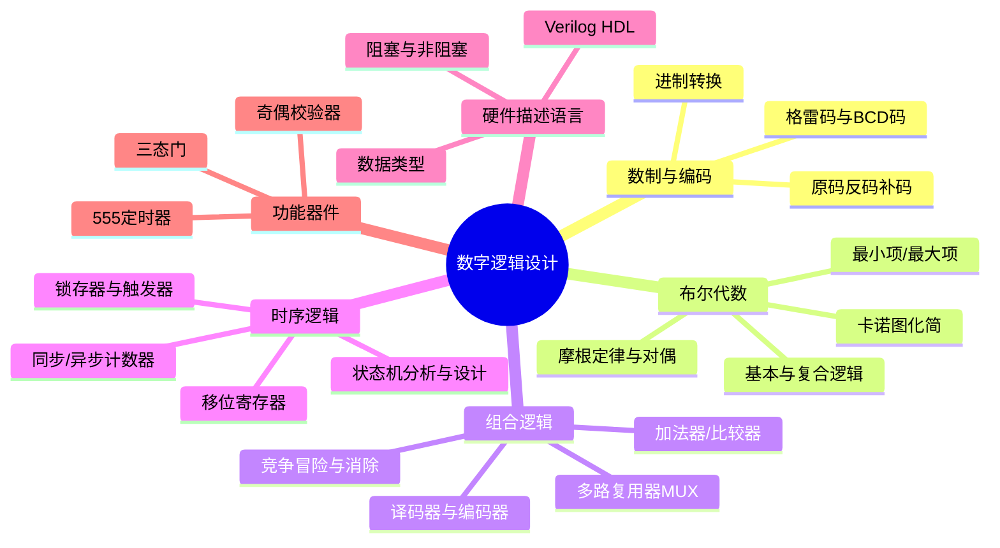
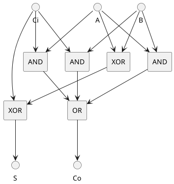
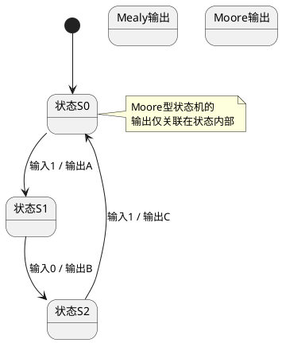

# 一、 知识架构总览


```mermaid
mindmap
  root((数字逻辑设计))
    数制与编码
      进制转换
      原码反码补码
      格雷码与BCD码
    布尔代数
      基本与复合逻辑
      摩根定律与对偶
      卡诺图化简
      最小项/最大项
    组合逻辑
      多路复用器MUX
      译码器与编码器
      加法器/比较器
      竞争冒险与消除
    时序逻辑
      锁存器与触发器
      移位寄存器
      同步/异步计数器
      状态机分析与设计
    硬件描述语言
      Verilog HDL
      阻塞与非阻塞
      数据类型
    功能器件
      奇偶校验器
      三态门
      555定时器
```

---

# 二、 数制与编码基础

## 1. 数制转换

- **十进制 → 二进制**
  - **整数部分：** 除2取余，逆序排列
  - **小数部分：** 乘2取整，顺序排列
- **二进制 → 十进制**：按权展开相加。
- **二进制 ↔ 八进制**：三位并一位。
- **二进制 ↔ 十六进制**：四位并一位（注意位数不够补零）。

> [!question] 例1
> 将十进制数 $-13.625$ 转换为二进制数。

**解**：

1.  整数部分
    | 整数部分 | 余数 |
    | :---: | :---: |
    | 13 ÷ 2 | 1 |
    | 6 ÷ 2 | 0 |
    | 3 ÷ 2 | 1 |
    | 1 ÷ 2 | 1 |

    逆序排列余数：$1101$

2.  小数部分
    | 小数部分 | 整数 |
    | :---: | :---: |
    | 0.625 × 2 | 1 |
    | 0.25 × 2 | 0 |
    | 0.5 × 2 | 1 |

    顺序排列整数：$101$
    所以 $-13.625_{10} = -1101.101_2$

## 2. 机器数的编码

- **原码**：最高位为符号位（0正1负），其余为数值位。
- **反码**：正数同原码，负数符号位不变，其余位取反。
- **补码**：正数同原码，负数反码加一。
  - _重点：_ $N$位补码的表示范围：$-(2^{N-1}) \sim + (2^{N-1} -1)$。
- **其他编码**：
  - **BCD码**：将每个十进制数位用4位二进制表示
    - **8421码**：最常用的BCD码，权值分别为8、4、2、1。
    - **5421码**： 另一种BCD码，权值分别为5、4、2、1。具有自补码特性（即 $9 - n$ 的补码为 $n$ 的补码）。
  - **余3码**：8421码 + 3。具有自补码特性，常用于数字电路中。
  - **格雷码**：相邻两个数之间只有一位不同。
    - _计算：_ 若 $G_i$ 为格雷码的第 $i$ 位，$B_i$ 为二进制码的第 $i$ 位，则有：
      $$
      G_n=B_n,\qquad G_i = B_i \oplus B_{i+1}, \quad i=1,\,2,\,\dots,\,n-1
      $$
    - _反推：_ 若 $B_n$ 为二进制码的第 $n$ 位，
      $$
      B_n=G_n,\qquad B_i = G_i \oplus B_{i+1}, \quad i=1,\,2,\,\dots,\,n-1
      $$

> [!question] 例2
> 试写出63的八位源码、反码、补码、8421码、5421码、余3码。

**解**：

1.  十进制数63的二进制表示为 $00111111$。
2.  原码：$00111111$，反码：$11000000$，补码：$11000001$。
3.  8421码：$6\rightarrow 0\times 8 + 1\times 4 + 1\times 2 + 0\times 1 = 6$
    $3\rightarrow 0\times 8 + 0\times 4 + 1\times 2 + 1\times 1 = 3$，所以8421码为 $0110\ 0011$。
4.  5421码：$6\rightarrow 0\times 5 + 1\times 4 + 1\times 2 + 0\times 1 = 6$
    $3\rightarrow 0\times 5 + 0\times 4 + 1\times 2 + 1\times 1 = 3$，所以5421码为 $0110\ 0011$。
5.  余3码：$6\rightarrow 6 + 3 = 9 \rightarrow (9)_{10} = (1001)_{2}$，$3\rightarrow 3+3=6 \rightarrow (6)_{10} = (0110)_{2}$，所以余3码为 $1001\ 0110$。

> [!question] 例3
> 给定一组余3码 $1001\ 0101$，试将其转换为典型8位格雷码。

**解**：

1.  将余3码转换为8421码：
    - $1001-0011=0110$，$0101-0011=0001$，所以8421码为 $0110\ 0001$。
2.  将8421码转换为二进制码：
    - $0110\ 0001$ 对应的十进制数为 $61$，其二进制表示为 $00111101$。
3.  将二进制码转换为格雷码：
    | 位数 | 8 | 7 | 6 | 5 | 4 | 3 | 2 | 1 |
    | --- | :--: | :--: | :--: | :--: | :--: | :--: | :--: | :--: |
    | 二进制码 | 0 | 0 | 1 | 1 | 1 | 1 | 0 | 1 |
    | 格雷码 | 0 | 0 | 1 | 0 | 0 | 0 | 1 | 1 |

---

# 三、 布尔代数与函数化简

## 1. 逻辑运算

- 基本逻辑运算：与（AND）、或（OR）、非（NOT）。
  - 与：$A \cdot B$，输出为1当且仅当 $A=1$ 且 $B=1$。
  - 或：$A + B$，输出为1当且仅当 $A=1$ 或 $B=1$。
  - 非：$A',\;\bar{A}$，输出为1当且仅当 $A=0$。
- 复合逻辑运算：与非（NAND）、或非（NOR）、异或（XOR）、同或（XNOR）。
  - 与非：$A \uparrow B = \overline{(A \cdot B)}$
  - 或非：$A \downarrow B = \overline{(A+B)}$
  - **异或**：$A \oplus B = A\bar{B} + \bar{A}B$
  - 同或：$A \odot B = AB + \bar{A}\bar{B}$

- **布尔代数的基本定律**：
  | 定律 | 公式 | 对偶 |
  | ---------- | ------------------------------------------------------- | ------------------------------------------------------ |
  | 交换律 | $A + B = B + A$ | $A \cdot B = B \cdot A$ |
  | 结合律 | $A + (B + C) = (A + B) + C$ | $A \cdot (B \cdot C) = (A \cdot B) \cdot C$ |
  | 分配律 | $A + B \cdot C = (A + B) \cdot (A + C)$ | $A \cdot (B + C) = (A \cdot B) + (A \cdot C)$ |
  | 吸收律 | $A + (A \cdot B) = A$ | $A \cdot (A + B) = A$ |
  | 消去律 | $A + (\bar{A}+B) = A + B$ | $A \cdot (\bar{A}+B) = A \cdot B$ |
  | 德摩根律 | $\overline{A + B} = \bar{A} \cdot \bar{B}$ | $\overline{A \cdot B} = \bar{A} + \bar{B}$ |
  | 蕴含律 | $AB + \bar{A}C + BC = AB + \bar{A}C$ | $(A + B)(B + C)(\bar{A} + C) = (A + B)(\bar{A} + C)$ |
  | 异或非定理 | $\overline{A\bar{B} + \bar{A}B} = \bar{A}\bar{B} + A B$ | $\overline{AB + \bar{A}\bar{B}} = \bar{A}B + A\bar{B}$ |
- **对偶规则与反演规则**：
  - 对偶规则：将逻辑式中的$(\;\cdot\;,\,+) 、(0,\,1)、(\oplus,\,\odot)$互换，得到的式子称为原式的对偶式。若两个逻辑表达式相等，则它们的对偶式也相等。
  - 反演规则：在对偶式的基础上，将变量取反，得到的式子称为原式的反演式。反演式与原式恒等。（广义德摩根律）

## 2. 最小项与最大项

设 $f: \{0,1\}^n \to \{0,1\}$ 为定义在 $n$ 个布尔变量 $\bm{x} = (x_1, x_2, \dots, x_n)$ 上的布尔函数。

### 2.1 定义与性质

对于任意赋值向量 $\bm{a} = (a_1, a_2, \dots, a_n) \in \{0,1\}^n$，定义其整数索引为

$$
j(\bm{a}) = \prod_{i=1}^{n} a_i \cdot 2^{n-i}
$$

记 $x_i^1 = x_i$，$x_i^0 = \bar{x}_i$

- **最小项 ($m_j$)**：对应赋值 $\bm{a}$ 的最小项为
  $$
  m_{j(\bm{a})}(\bm{x}) = \prod_{i=1}^{n} x_i^{a_i}
  $$
  当且仅当 $\bm{x} = \bm{a}$ 时，$m_{j(\bm{a})}(\bm{x}) = 1$。
- **最大项 ($M_j$)**：对应赋值 $\bm{a}$ 的最大项为
  $$
  M_{j(\bm{a})}(\bm{x}) = \sum_{i=1}^{n} x_i^{1-a_i}
  $$
  当且仅当 $\bm{x} = \bm{a}$ 时，$M_{j(\bm{a})}(\bm{x}) = 0$

最小项与最大项互为反函数：

$$
m_j = \overline{M_j}, \qquad M_j = \overline{m_j}
$$

全部最小项的析取为 $1$，全部最大项的合取为 $0$：

$$
\sum_{j=0}^{2^n-1} m_j = 1, \qquad
\prod_{j=0}^{2^n-1} M_j = 0
$$

### 2.2 真值赋值集合

函数值为 $1$ 和 $0$ 的赋值集合分别为：

- **使函数为 $1$ 的赋值集**：$S_1 = \{\bm{a} \in \{0,1\}^n \mid f(\bm{a}) = 1\}$
- **使函数为 $0$ 的赋值集**：$S_0 = \{\bm{a} \in \{0,1\}^n \mid f(\bm{a}) = 0\}$

显然，$S_1 \cap S_0 = \varnothing$，且 $S_1 \cup S_0 = \{0,1\}^n$。

### 2.3 范式唯一性定理

- **定理 1（最小项表达式）**：对于任意布尔函数 $f(\bm{x})$，存在唯一的索引子集 $I_m \subseteq \{0,1,\dots,2^n-1\}$，使得
  $$
  f(\bm{x}) = \sum_{j \in I_m} m_j(\bm{x}),
  \qquad I_m = \{j(\bm{a}) \mid \bm{a} \in S_1\}
  $$
  当 $S_1 = \varnothing$ 时，$f$ 为恒 $0$ 函数，析取和定义为布尔零元 $0$。
- **定理 2（最大项表达式）**：对于任意布尔函数 $f(\bm{x})$，存在唯一的索引子集 $I_M \subseteq \{0,1,\dots,2^n-1\}$，使得
  $$
  f(\bm{x}) = \prod_{j \in I_M} M_j(\bm{x}),
  \qquad I_M = \{j(\bm{a}) \mid \bm{a} \in S_0\}
  $$
  当 $S_0 = \varnothing$ 时，$f$ 为恒 $1$ 函数，合取积定义为布尔幺元 $1$。

## 3. 卡诺图化简 (核心技能)

看视频吧

1. [2分钟搞定卡诺图](https://www.bilibili.com/video/BV12BZyB7EJh/)
2. [卡诺图化简详解](https://www.bilibili.com/video/BV1P7ZYY9EDX/)

# 四、组合逻辑电路设计

## 1. 组合逻辑电路的分析

分析是设计的逆过程。题目给出一张逻辑电路图，让你说出它是干什么的。

**分析四步法（必须熟记）：**

1.  **写表达式**：从输入到输出，逐级写出每个逻辑门的输出表达式。
2.  **列真值表**：将输入变量的所有组合代入表达式，算出输出值，填入真值表。
3.  **化简表达式**：利用布尔代数或卡诺图将表达式化简（如果需要）。
4.  **得出结论**：根据真值表或化简后的表达式，说明电路的**逻辑功能**（如：全加器、多数表决器、奇偶校验器等）。

> [!example] 例1
> 分析下图所示的逻辑电路，说明它的功能。
>
> ```plantuml
> @startuml
> skinparam defaultFontName Arial
> skinparam nodesep 20
> skinparam ranksep 20
>
> rectangle "A" as A
> rectangle "B" as B
> rectangle "C" as C
>
> rectangle "AND" as And1
> rectangle "AND" as And2
> rectangle "AND" as And3
> rectangle "OR" as Or1
>
> ' 连线
> A --> And1
> B --> And1
> A --> And2
> C --> And2
> B --> And3
> C --> And3
> And1 --> Or1
> And2 --> Or1
> And3 --> Or1
> Or1 --> F
> @enduml
> ```
>
> 1. **写表达式**：$F = AB + AC + BC$
> 2. **列真值表**：略（在纸上列写8种输入组合，代入计算）。
> 3. **看功能**：当A、B、C三个输入中，有**两个或两个以上**为1时，输出F为1。
> 4. **结论**：这是一个**三人多数表决器**（少数服从多数）。

## 2. 组合逻辑电路的设计

**设计四步法（经典流程）：**

1.  **逻辑抽象**：确定输入变量（如A、B、C）和输出变量（如F），并定义它们取值为0或1的含义。
2.  **列真值表**：根据文字描述的逻辑关系，列出真值表。
3.  **化简表达式**：用卡诺图或布尔代数进行化简，得到最简逻辑表达式。
4.  **画逻辑图**：根据最简表达式，使用所需的逻辑门（如与门、或门、与非门）画出电路图。

### 例题2：设计一个“1位全加器”

**需求描述**：设计一个全加器，输入为被加数 $A$，加数 $B$，以及低位进位 $C_i$。输出为本位和 $S$ 和进位输出 $C_o$。

**设计过程：**

1. **真值表**（列出8种输入组合）：

|  A  |  B  | Ci  |  S  | Co  |
| :-: | :-: | :-: | :-: | :-: |
|  0  |  0  |  0  |  0  |  0  |
|  0  |  0  |  1  |  1  |  0  |
|  0  |  1  |  0  |  1  |  0  |
|  0  |  1  |  1  |  0  |  1  |
|  1  |  0  |  0  |  1  |  0  |
|  1  |  0  |  1  |  0  |  1  |
|  1  |  1  |  0  |  0  |  1  |
|  1  |  1  |  1  |  1  |  1  |

2. **化简表达式**（用卡诺图）：
   - $S = A'B'C_i + A'BC_i' + AB'C_i' + ABC_i = A \oplus B \oplus C_i$
   - $C_o = A'BC_i + AB'C_i + ABC_i' + ABC_i = AB + AC_i + BC_i$
3. **画逻辑图**：
   - **和 $S$**：使用两个异或门实现 $S = (A \oplus B) \oplus C_i$。
   - **进位 $C_o$**：使用三个与门和一个或门实现 $C_o = AB + AC_i + BC_i$。


```plantuml
@startuml
circle "A" as A
circle "B" as B
circle "Ci" as Ci

rectangle "XOR" as X1
rectangle "XOR" as X2
rectangle "AND" as A1
rectangle "AND" as A2
rectangle "AND" as A3
rectangle "OR" as O1

A --> A1
B --> A1
A --> A2
Ci --> A2
B --> A3
Ci --> A3
A1 --> O1
A2 --> O1
A3 --> O1
O1 --> Co

A --> X1
B --> X1
X1 --> X2
Ci --> X2
X2 --> S
@enduml
```

## 3. 二级门电路设计（最简逻辑变换）

在实际工程中，芯片厂商可能只提供**与非门**或**或非门**（因为它们制造工艺最简单，速度最快）。我们必须把化简后的“与或式”转换为我们手头有的门电路形式。

### 3.1 用“与非门”实现（与非-与非式）

**方法**：对最简“与或式”**两次取反**，然后应用摩根定律。

- **例子**：已知 $F = AB + CD$
- 第一步：$F = \overline{\overline{AB + CD}}$
- 第二步：应用摩根定律，$F = \overline{(\overline{AB}) \cdot (\overline{CD})}$
- **电路**：用两个与非门得到 $\overline{AB}$ 和 $\overline{CD}$，再用一个与非门把它们合起来。

### 3.2 用“或非门”实现（或非-或非式）

**方法**：先求反函数 $F'$ 的最简“与或式”，然后对 $F'$ 取反，应用摩根定律。

- **例子**：已知 $F = (A+B)(C+D)$
- 求反：$F' = A'B' + C'D'$
- 对 $F'$ 两次取反：$F = \overline{\overline{A'B' + C'D'}}$
- 应用摩根定律：$F = \overline{(\overline{A'B'}) \cdot (\overline{C'D'})} = \overline{(A+B) \cdot (C+D)}$
- **电路**：用两个或非门得到 $(A+B)$ 和 $(C+D)$，再用一个或非门（实现非与）把它们合起来。

### 3.3 用“与或非门”实现

**方法**：直接对反函数 $F'$ 化简，得到 $F' = AB + CD$ 的形式，然后用一个与或非门直接输出 $F$。

## 4. 多输出门电路设计

多输出电路是指**同一个电路有多个输出端**。设计的核心原则是：**找出多个输出函数之间共同的逻辑项，共享子表达式，以减少逻辑门的总数**。

### 例题3：设计一个多输出电路

**需求**：输出 $F_1$ 和 $F_2$ 的逻辑表达式如下：

- $F_1 = AB + BC + AC$
- $F_2 = AB + BC + A'C$

**常规设计（不共享）**：

- $F_1$ 需要：AB、BC、AC 三个与门，一个或门。
- $F_2$ 需要：AB、BC、A'C 三个与门，一个或门。
- 总共需要 **6个与门 + 2个或门**。

**多输出优化设计（找公共项）**：
观察发现，**$AB$ 和 $BC$ 是两者共有的项**。

- 我们只需要产生 $AB$、$BC$、$AC$、$A'C$ 这四个与项。
- 然后把 $AB$ 和 $BC$ 的输出分别接到两个或门的输入端。
- 总共只需要 **4个与门 + 2个或门**（省了2个与门）。

**这就是多输出电路设计的核心思想：共享子逻辑，减少门数。**

---

## 5. 组合逻辑电路的险象（竞争冒险）与消除

### 5.1 什么是竞争与冒险？

- **竞争**：当一个逻辑门的**两个输入端同时向相反方向变化**时（例如一个从0变1，另一个从1变0），由于信号传输延迟不同，到达输出端的时间有先后，这种现象叫竞争。
- **冒险**：由于竞争，导致电路输出端出现一个**不应有的窄脉冲（毛刺）**，这个现象叫冒险。

### 5.2 代数判别法（判断有没有冒险）

- **0型冒险**：如果表达式在某种输入组合下，能化简成 $F = A + A'$ 的形式，则会产生**0型冒险**（输出本应保持1，但可能会跳变到0）。
- **1型冒险**：如果表达式能化简成 $F = A \cdot A'$ 的形式，则会产生**1型冒险**（输出本应保持0，但可能会跳变到1）。

### 5.3 卡诺图判别法

在化简后的卡诺图中，如果**两个相切的圈（相邻但不相交）**之间，存在某个变量在一个圈里是原变量，在另一个圈里是反变量，那么这两个圈的交界处就可能存在冒险。

### 5.4 消除冒险的方法

1.  **增加冗余项（代数法）**：在卡诺图中，给相切的两个圈再画一个**“重合圈”**把它们连起来。这样表达式里就多了一个冗余项，消除了冒险。
2.  **增加滤波电容（硬件法）**：在输出端并接一个小电容，吸收掉窄脉冲毛刺（会导致波形变缓，适合对速度要求不高的电路）。
3.  **加选通脉冲（时序法）**：在电路稳定后，才让选通脉冲打开输出门，避开信号变化时的竞争期。

---

# 五、 组合逻辑器件

- 使能端（Enable）是指**控制器件工作与否的输入端**，通常为高电平有效（1使能，0禁止），也有低电平有效的器件。

## 1. 编码器

- **功能**：将二进制码转换为特定的编码形式，使其具有特定含义

### 二进制编码器

- 输入：$N$位独热码（仅有一位为1，其余为0），用 $I_0, I_1, \dots, I_{N-1}$ 表示。
- 输出：$n$位二进制码，$n = \lceil \log_2 N \rceil$，用 $Y_0, Y_1, \dots, Y_{n-1}$ 表示。若 $I_j = 1$，输出有

  $$
  \sum_{i=0}^{n-1} Y_i \cdot 2^i = j
  $$

  即输出的二进制码表示输入独热码的索引。

- 命名：$N$线-$n$线编码器
  - 常用的有 8-3 编码器、16-4 编码器等。

### 优先编码器

- **优先级**：预设的输入优先级，允许同时输入多路信号，只对优先级最高的信号编码。
  - 最常用的优先级预设：只看输入端为 1 的**最高位**，即 $I_{N-1}$ 的优先级最高，$I_0$ 的优先级最低。
- 使用时常在输入和输出端加上非门，形成**低电平有效的编码器**。
- 命名：$N$线-$n$线优先编码器
  - 常用的有74LS148（8-3优先编码器）、74LS147（10-4优先编码器）等，均为低电平有效，高位优先。

## 2. 译码器

- **功能**：将编码器的输出信号还原为输入信号。
- **应用**：常用于地址译码、数据选择等场合。
- 同样常在输入和输出端加上非门，形成**低电平有效的译码器**。
- 命名：$n$线-$N$线译码器
  - 常用的有 3-8 译码器（74LS138）， 4-16 译码器（74LS154）等，均为低电平有效。

### 地址译码器

- **功能**：将 CPU 的地址总线信号译码为片选信号，选择特定的存储器或外设。
- 输入：CPU 地址总线的高位地址信号，通常为 $A_{n-1}, A_{n-2}, \dots, A_0$。
- 输出：片选信号 $CS_0, CS_1, \dots, CS_{N-1}$，每个片选信号对应一个存储器或外设。

## 4. 多路复用器 (MUX / 数据选择器)

- **功能**：利用选择控制端，从多路输入数据中选出1路送到输出端。
- 输入：$N$路数据输入 $D_0, D_1, \dots, D_{N-1}$，$n$位选择控制端 $S_0, S_1, \dots, S_{n-1}$，$n = \lceil \log_2 N \rceil$。
- 输出：$Y$，输出的值为被选择的输入数据，即
  $$
  Y = D_j, \quad j = \sum_{i=0}^{n-1} S_i \cdot 2^i
  $$
- 可以将译码器的输出连接到数据通路的使能端，就是一个多路复用器的实现方式。
- 命名：$N$选1多路复用器
  - 常用的有 4选1、8选1（74LS151）等。
    - 双4选1多路复用器（74LS153）将两个独立的4选1复用器组合在一起，输出端为 $Y_0$ 和 $Y_1$，选择控制端为 $S_0$ 和 $S_1$，使能端为 $G_0$ 和 $G_1$。
      - 注意到，选择控制端 $S_0$ 和 $S_1$ 是两个复用器共享的
- **应用**：常用于数据选择、信号切换等场合。

### 扩展多路选择器

- **功能**：将多个多路复用器级联，实现更多路数的选择。
- **应用**：常用于需要更多输入通道的场合。

## 5. 三态门 (Tri-State Gate)

- 三态：
  - **高电平**：输出为逻辑1。
  - **低电平**：输出为逻辑0。
  - **高阻态**：输出端呈现高阻抗状态，相当于断开电路，用Z表示。
- 输入：数据输入 $D$，使能端 $E$。
- 输出：$Y$，输出的值为
  $$
  Y = \begin{cases}
  D, & E = 1 \\
  Z, & E = 0
  \end{cases}
  $$
- 可在使能端或输出端加上非门，实现不同的逻辑功能。

## 6. 奇偶校验器 (Parity Generator / Checker)

- 输入：数据输入 $D_0, D_1, \dots, D_{N-1}$。
- 输出：奇偶校验位 $P$
  - **奇校验**：$P = D_0 \oplus D_1 \oplus \dots \oplus D_{N-1}$
  - **偶校验**：$P = \overline{D_0 \oplus D_1 \oplus \dots \oplus D_{N-1}}$

## 7. 数值比较器 (Comparator)

- 输入：两个二进制数值输入 $A = A_{n-1}A_{n-2}\dots A_0$ 和 $B = B_{n-1}B_{n-2}\dots B_0$。
- 输出：三个比较结果 $A>B$、$A=B$、$A<B$。
- **实现方式**：一位比较器可以通过逻辑门实现，多个一位比较器可以级联实现多位数值比较。
  - **串行比较**：使用一个一位比较器，从高位开始逐位比较，直到找到不同的位，速度较慢。
  - **并行比较**：使用多个一位比较器，同时比较所有位，速度较快。
- **应用**：常用于数字电路中的大小比较、排序等场合。

## 8. 只读存储器 (ROM)

- **功能**：将输入地址信号映射到预先存储的输出数据，实现固定逻辑功能。
- 输入：地址输入 $A_0, A_1, \dots, A_{n-1}$。
- 输出：数据输出 $D_0, D_1, \dots, D_{m-1}$。
- **实现方式**：通过查找表（LUT）实现，将地址输入作为索引，从存储器中读取对应的数据输出。

---

# 六、 硬件描述语言 Verilog HDL

## 1. 数据类型与赋值

- **4种逻辑值**：`0` (低电平), `1` (高电平), `X` (未知状态), `Z` (高阻态)。
- **数据类型**：`wire` 类型（用于连接，默认为Z），`reg` 类型（用于存储状态，默认为X）。
- **赋值语句**：
  - **阻塞赋值 (`=`)**：顺序执行，用于**组合逻辑**。
  - **非阻塞赋值 (`<=`)**：并行执行，用于**时序逻辑**（`always @(posedge clk)`）。
- **运算符**：算数、移位、位运算、拼接、等式（`===` 匹配不定态X，`==` 不匹配）。

## 2. 过程块与条件语句

- **组合逻辑**：`always @(*)` + 阻塞赋值。
- **时序逻辑**：`always @(posedge clk or negedge rst_n)` + 非阻塞赋值。
- **条件语句**：`if...else` 和 `case` 语句。注意不要产生隐含的**锁存器（Latch）**（必须要覆盖所有条件分支，或加上 `default`）。

# 七、 时序逻辑电路设计

## 1. 锁存器 (Latch) 与 触发器 (Flip-Flop)

- _区别_：锁存器不含时钟（电平触发），触发器带时钟（边沿触发，理想状态）。
- **基本RS锁存器**：有不定态（输入约束），“双稳态”特性。
- **门控D锁存器**：解决了输入不定态问题，但存在**空翻**（亚稳态风险）。
- **边沿触发器（核心）**：
  - **D触发器**：$Q^{n+1} = D$。
  - **JK触发器**：$Q^{n+1} = JQ' + K'Q$（无不定态，万能触发器）。
  - **T触发器**：$Q^{n+1} = T \oplus Q^n$（当$T=1$时翻转）。
  - **T'触发器**：$Q^{n+1} = Q'$ （每个时钟翻转一次，用于计数）。

## 2. 触发器类型转换

- **无脑转换法**：使用卡诺图求解驱动方程。
- _示例_：**JK触发器 → D触发器**：对比特征方程 $Q^{n+1} = JQ' + K'Q$ 与 $Q^{n+1} = D$，变换推导出 $J=D, K=D'$ 即可。

## 3. 时序电路分析与设计 (状态机)

- **Mealy型状态机**：输出取决于 **当前状态 + 当前输入**。
- **Moore型状态机**：输出仅取决于 **当前状态**。


```plantuml
@startuml

state "状态S0" as S0
state "状态S1" as S1
state "状态S2" as S2
state "Mealy输出" as MealyOut
state "Moore输出" as MooreOut

[*] --> S0
S0 --> S1 : 输入1 / 输出A
S1 --> S2 : 输入0 / 输出B
S2 --> S0 : 输入1 / 输出C

note right of S0
  Moore型状态机的
  输出仅关联在状态内部
end note
@enduml
```

## 4. 状态化简与状态分配

- **隐含表化简法**：寻找输出相同、且次态等效的状态进行合并。
- **状态分配原则**：尽量把相邻状态的编码定为相邻（如 $00 \to 01 \to 10 \to 11$ 的格雷码分配），以减少组合逻辑。

## 5. 典型时序电路

- **移位寄存器**：右移、左移、串入串出/并入并出、双向移位寄存器。
- **计数器**：
  - 异步计数器（速度较慢，存在传输延迟）。
  - 同步计数器（速度较快，无毛刺，推荐使用）。
  - _扭环形计数器_：编码资源利用率低（$2N$个状态），但**无译码冒险**，后级译码只需2输入门，构成模8计数器。

---
