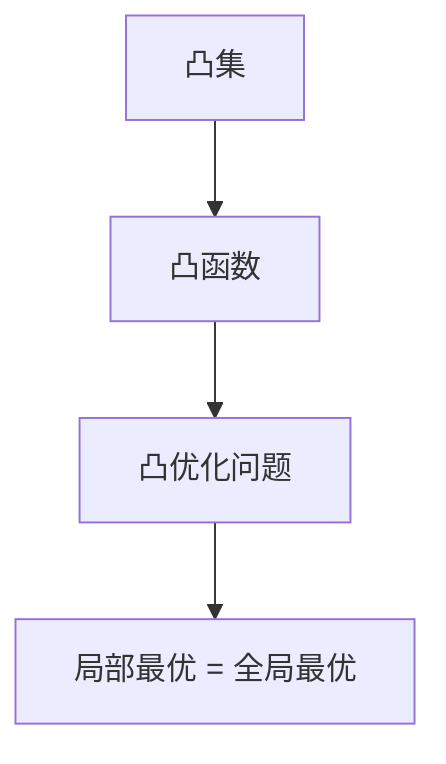
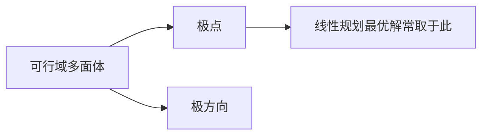
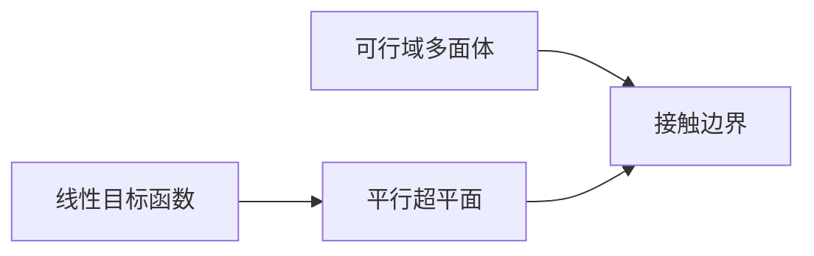

# 最优化方法

最优化方法研究的是：在一定约束条件下，如何从可行解中找到“最好”的解。这里的“最好”可以是最小的成本、最短的时间、最大的收益，或最小的误差。

本课程的核心目标不是只会算一个题，而是要理解三件事：问题如何建模、理论为什么成立、算法为什么有效。按照这个思路，本章将从统一的优化问题形式出发，依次介绍基本概念、线性规划、无约束优化和约束优化。

## 学习路线

1. 先把实际问题写成“目标函数 + 约束条件”的形式。
2. 再判断问题是否具有凸性、线性性或光滑性。
3. 然后选择合适的算法：单纯形法、梯度法、牛顿法、KKT 方法等。
4. 最后把数值结果解释回原问题。

这一思路与国外教材一致：先看问题结构，再看算法设计，而不是把公式分散地背下来。

# 最优化的基本概念

## 最优化问题

最优化问题的本质，是在所有满足约束条件的解中，找到使目标函数达到极小或极大的点。

### 为什么需要最优化

工程设计、资源分配、路径规划、机器学习参数训练，最终都可以归结为“在限制条件下做最好选择”的问题。例如：

- 如何让生产成本最低；
- 如何让运输时间最短；
- 如何让模型误差最小；
- 如何在资源有限时使收益最大。

### 统一数学形式

一个典型的最优化问题可写为

$$
\min_{x \in \mathbb{R}^n} f(x)
$$

或者带约束地写成

$$
\begin{aligned}
\min_{x \in \mathbb{R}^n} \quad & f(x) \\
\operatorname{s.t.} \quad & g_i(x) \le 0, \quad i=1,2,\dots,m, \\
& h_j(x) = 0, \quad j=1,2,\dots,p.
\end{aligned}
$$

其中 $f(x)$ 是目标函数，$g_i(x) \le 0$ 是不等式约束，$h_j(x)=0$ 是等式约束。

### 可行域与最优解

- **可行域**：满足所有约束的点集。
- **可行解**：位于可行域中的点。
- **最优解**：使目标函数取得最小值的可行解。

如果一个点满足约束，但不是最优点，就只是普通可行解。优化的任务不是找到任意可行点，而是找到最优点。

### 局部最优与全局最优

- **局部最优解**：在某个邻域内最优。
- **全局最优解**：在整个可行域内最优。

一般非凸问题中，局部最优不一定是全局最优；而在凸优化中，这两者常常一致，这是凸性的关键意义。

### 典型分类

- 无约束优化：没有显式约束。
- 线性规划：目标函数与约束都是线性的。
- 非线性规划：目标函数或约束中出现非线性。
- 凸优化：目标函数凸、可行域凸、约束结构满足凸性要求。

## 凸集、凸函数与凸优化问题

凸性是优化理论中最重要的结构之一。它的作用在于：一旦问题是凸的，局部最优就不会“骗”我们，很多算法也更容易分析收敛性。

### 凸集

先看直观含义：如果一个集合中任意两点之间的线段都完全落在集合内部，那么这个集合就是凸集。

严格定义：集合 $C \subseteq \mathbb{R}^n$ 若对任意 $x,y \in C$ 和任意 $\lambda \in [0,1]$，都有

$$
\lambda x + (1-\lambda)y \in C,
$$

则称 $C$ 为凸集。

### 凸函数

直观上，凸函数的图像不会高于连接任意两点的弦。也就是说，在两点之间做线性插值时，函数值不会“向上拱起”超过该插值线。

严格定义：函数 $f:C \to \mathbb{R}$ 若对任意 $x,y \in C$ 和 $\lambda \in [0,1]$，满足

$$
f(\lambda x + (1-\lambda)y) \le \lambda f(x) + (1-\lambda)f(y),
$$

则称 $f$ 在凸集 $C$ 上是凸函数。

### 凸优化问题

若最优化问题满足以下条件：

- 目标函数是凸函数；
- 等式约束是仿射约束；
- 不等式约束定义的可行域是凸集；

则称该问题为凸优化问题。

### 为什么凸性重要

凸优化的重要结论是：

- 任意局部最优解都是全局最优解；
- 一阶条件往往就足以刻画最优性；
- 许多数值算法具有更好的收敛保证。

这也是国外教材特别强调凸性的原因：它把“问题结构”和“算法效果”联系了起来。

### 常见判别

- 若 $f''(x) \ge 0$，则一元函数凸。
- 若二阶可导函数的 Hessian 矩阵半正定，则函数凸。
- 凸函数的非负加权和仍是凸函数。

## 多面体、极点与极方向

线性规划的可行域通常是一个多面体，因此理解多面体结构非常重要。

### 多面体

由有限个线性不等式和等式约束确定的集合称为多面体。在线性规划中，可行域通常就是多面体。

### 极点

直观上，极点就是多面体的“角点”。在二维中它对应多边形的顶点，在更高维中对应可行域的极端位置。

严格地说，若某点不能写成可行域内两个不同点的非平凡凸组合，则该点称为极点。

### 极方向

若在某个方向上可以一直移动而不离开可行域，则该方向称为极方向。它反映了可行域的“无界延伸”特征。

### 在线性规划中的作用

线性规划的一个重要结论是：若最优解存在，则最优解往往可以在极点处取得。这解释了为什么单纯形法只在顶点之间移动，却仍能找到最优解。

### 直观理解

- 有界多面体：极点有限，最优解通常在某个顶点上取得。
- 无界多面体：可能存在极方向，目标函数可能无下界。

## 导数和梯度

在连续优化中，导数和梯度决定了函数在局部的变化趋势，因此它们是设计算法的基础。

### 一元函数的导数

导数描述函数在某一点的瞬时变化率。若一元函数在最优点附近下降，则导数往往与下降方向相关。

### 多元函数的梯度

设函数$f: \mathbb{R}^n \to \mathbb{R}$，其梯度 $\nabla f(x)$ 是一个向量，包含了函数在各个方向上的偏导数：

$$
\nabla f(x) = \left(\frac{\partial f}{\partial x_1}, \frac{\partial f}{\partial x_2}, \dots, \frac{\partial f}{\partial x_n}\right)^T.
$$

梯度指向函数增长最快的方向，因此最速下降法常取负梯度方向作为搜索方向。

### 一阶最优性条件

若 $x^*$ 是无约束问题的局部极小点，且 $f$ 可微，则必须有

$$
\nabla f(x^*) = 0.
$$

这只是必要条件，不是充分条件。为了判断是否真是极小点，还需要二阶信息。

## Jacobian矩阵和Hessian矩阵

### Jacobian 矩阵

设函数$f: \mathbb{R}^n \to \mathbb{R}^m$，如果函数 $f=(f_1, f_2, \dots, f_m)$ 的每个分量关于 $\bm{x}=(x_1, x_2, \dots, x_n)^T$ 的每个分量都是可微的，则其 Jacobian 矩阵 $J$ 定义为：

$$
J =Df(\bm{x}) = \begin{bmatrix} \dfrac{\partial f_1}{\partial x_1} & \dfrac{\partial f_1}{\partial x_2} & \cdots & \dfrac{\partial f_1}{\partial x_n} \\[1.5em]
\dfrac{\partial f_2}{\partial x_1} & \dfrac{\partial f_2}{\partial x_2} & \cdots & \dfrac{\partial f_2}{\partial x_n} \\[0.6em]
\vdots & \vdots & \ddots & \vdots \\[0.6em]
\dfrac{\partial f_m}{\partial x_1} & \dfrac{\partial f_m}{\partial x_2} & \cdots & \dfrac{\partial f_m}{\partial x_n} \end{bmatrix}_{m \times n}
$$

可以看作梯度在多维空间的推广

$$
Df(\bm{x}) = D\begin{bmatrix}f_1(\bm{x}) \\ f_2(\bm{x}) \\ \vdots \\ f_m(\bm{x}) \end{bmatrix} = \begin{bmatrix} \nabla f_1(\bm{x})^T \\ \nabla f_2(\bm{x})^T \\ \vdots \\ \nabla f_m(\bm{x})^T \end{bmatrix}.
$$

### Hessian 矩阵

设函数 $f: \mathbb{R}^n \to \mathbb{R}$ 可二阶连续可导，则其 Hessian 矩阵定义为

$$
\nabla^2 f(x) =\begin{bmatrix} \nabla\dfrac{\partial f}{\partial x_1} & \nabla\dfrac{\partial f}{\partial x_2} & \cdots & \nabla\dfrac{\partial f}{\partial x_n} \end{bmatrix}
=\begin{bmatrix} \dfrac{\partial^2 f}{\partial x_1^2} & \dfrac{\partial^2 f}{\partial x_1 \partial x_2} & \cdots & \dfrac{\partial^2 f}{\partial x_1 \partial x_n} \\[1.4em]
\dfrac{\partial^2 f}{\partial x_2 \partial x_1} & \dfrac{\partial^2 f}{\partial x_2^2} & \cdots & \dfrac{\partial^2 f}{\partial x_2 \partial x_n} \\[0.6em]
\vdots & \vdots & \ddots & \vdots \\[0.6em]
\dfrac{\partial^2 f}{\partial x_n \partial x_1} & \dfrac{\partial^2 f}{\partial x_n \partial x_2} & \cdots & \dfrac{\partial^2 f}{\partial x_n^2} \end{bmatrix}
$$

它描述函数的局部曲率。

### 二阶最优性条件

若 $\nabla f(x^*)=0$ 且 Hessian 矩阵在 $x^*$ 处正定，则 $x^*$ 是严格局部极小点。

### 为什么 Hessian 重要

- 梯度只告诉我们“往哪边降”；
- Hessian 告诉我们“下降曲线有多弯”。

这也是牛顿法比梯度下降法收敛更快的根本原因：它利用了二阶信息。

---

# 线性规划

线性规划研究的是目标函数和约束条件都为线性的优化问题。它既是最优化理论的基础模型，也是很多更复杂方法的出发点。

## 线性规划模型与几何意义

### 为什么先学线性规划

线性规划形式简单，但能很好地展示优化中的基本思想：

- 可行域如何形成；
- 最优解为什么常在边界或顶点；
- 算法如何利用问题结构逐步改进解。

### 标准形式

线性规划通常写成

$$
\begin{aligned}
\min \quad & c^T x \\
\operatorname{s.t.} \quad & Ax = b, \\
& x \ge 0.
\end{aligned}
$$

也可写成不等式形式或混合形式，经过引入松弛变量、剩余变量后可以互相转换。

### 几何意义

线性规划的可行域是多面体，目标函数的水平集是一组平行超平面。最优解就是让目标超平面“尽可能向下降”并第一次接触可行域的位置。

如果接触点不是唯一，可能出现多个最优解；如果超平面一直推进而不相交，则问题无界。

## 单纯形法

单纯形法不是在可行域内部乱走，而是在极点之间跳转。它的思想是：既然线性规划的最优解常在极点，那么就从一个极点出发，沿着能改进目标值的边移动到相邻极点，直到无法继续改进。

### 算法思想

- 维护一个基可行解；
- 判断是否存在改进方向；
- 若存在，就换基得到更好的顶点；
- 重复直到最优。

### 为什么这样有效

线性目标函数在多面体上的最优点可在极点取得，而相邻极点可以通过一次换基得到。单纯形法实际上是在“顶点图”上做局部改进。

### 退化、循环与枢轴选择

- **退化**：某些基可行解对应相同顶点，可能导致目标值不变。
- **循环**：极端情况下可能在若干基之间重复。
- **防循环规则**：如 Bland 规则。

### 算法步骤

1. 选取初始基可行解。
2. 计算检验数，判断是否最优。
3. 若非最优，选入基变量和出基变量。
4. 做枢轴变换，更新单纯形表。
5. 重复直到无改进方向。

## 单纯形表计算

单纯形表是单纯形法的表格式实现。它把约束系数、基变量和目标函数统一表示在一个表中，便于进行枢轴操作。

### 表的作用

- 快速计算检验数；
- 快速执行变量替换；
- 便于手工演算。

### 计算要点

- 先判断检验数是否满足最优条件；
- 再选入基列和出基行；
- 通过主元变换把入基变量变成新的基变量。

### 典型应用

手算题中常要求根据单纯形表判断：

- 当前解是否最优；
- 是否存在无界；
- 某变量入基后目标值如何变化。

## 线性规划的对偶问题

对偶理论是线性规划中最重要的理论之一。它告诉我们：一个最优化问题不仅可以从“原问题”看，也可以从“对偶问题”看。

### 直观理解

原问题在寻找最优决策；对偶问题则在寻找约束的影子价格。它揭示了资源约束的价值。

### 原问题与对偶问题

对偶问题可以由原问题系统地构造出来。一般来说，

- 原问题是最小化；
- 对偶问题通常变成最大化；
- 原问题的约束对应对偶变量；
- 对偶约束对应原变量。

### 对偶的意义

- 提供最优值的上下界；
- 便于证明最优性；
- 在灵敏度分析中具有解释作用。

### 弱对偶与强对偶

- **弱对偶**：任意原问题可行解和任意对偶可行解之间，对偶目标值不会超过原问题目标值（最小化情形下）。
- **强对偶**：在满足一定条件时，原问题和对偶问题的最优值相等。

强对偶是线性规划理论的核心结论，也是 KKT 条件在凸优化中的重要原型。

## 对偶理论与灵敏度分析

### 互补松弛条件

若原变量和对偶松弛变量之间满足互补关系，则通常可判断两边是否达到最优。

### 灵敏度分析

灵敏度分析研究的是：当目标系数、右端项或约束矩阵发生小变化时，最优解和最优值如何变化。

这在工程中很重要，因为实际参数往往不是固定不变的。对偶变量可以解释为“参数变化对最优值的边际影响”。

### 本章小结

线性规划的价值在于它把“优化”变成了一个结构清晰、可计算、可解释的问题。单纯形法提供求解方法，对偶理论提供理论基础，灵敏度分析提供结果解释。

---

# 无约束最优化

无约束最优化没有显式约束，主要研究目标函数本身的结构和下降机制。它是所有数值优化算法的基础。

## 无约束优化问题

一般形式为

$$
\min_{x \in \mathbb{R}^n} f(x).
$$

### 为什么单独研究无约束问题

很多约束优化方法最终都会把问题转化为一系列无约束子问题，例如罚函数法、乘子法。因此，无约束优化不是“简单版本”，而是后续方法的基础。

### 典型场景

- 最小二乘拟合；
- 机器学习模型训练；
- 参数估计；
- 工程调参。

## 无约束优化的最优性条件

### 一阶必要条件

若 $f$ 可微且 $x^*$ 是局部极小点，则

$$
\nabla f(x^*) = 0.
$$

### 二阶必要条件

若 $x^*$ 是局部极小点且 $f$ 二阶可导，则 Hessian 在 $x^*$ 处半正定。

### 二阶充分条件

若 $\nabla f(x^*)=0$ 且 Hessian 正定，则 $x^*$ 是严格局部极小点。

### 这些条件的意义

最优性条件的作用有两个：

1. 判断一个点是否可能是最优点；
2. 为算法设计提供停止准则。

## 一维搜索

很多下降法都会先确定一个下降方向，再沿该方向选择合适步长，这就是一维搜索。

### 为什么要做一维搜索

如果步长太小，收敛慢；步长太大，可能越过最优点甚至发散。因此“方向”与“步长”要分开处理。

### 精确搜索

在方向 $d_k$ 上求

$$
\alpha_k = \arg\min_{\alpha \ge 0} f(x_k + \alpha d_k).
$$

精确搜索理论上清晰，但计算代价通常较高。

### 非精确搜索

工程中更常用非精确搜索，例如：

- Armijo 条件：要求有足够下降；
- Wolfe 条件：在下降和曲率之间取得平衡。

### 一维搜索的角色

它不是单独的优化方法，而是大多数迭代法中的“步长控制器”。

## 最速下降法

### 思想

在当前点，负梯度方向是局部下降最快的方向，因此最速下降法直接沿 $-\nabla f(x_k)$ 方向前进。

### 迭代格式

$$
x_{k+1} = x_k - \alpha_k \nabla f(x_k).
$$

### 为什么这样更新

梯度是函数增长最快的方向，取负梯度就得到最陡下降方向。再通过步长 $\alpha_k$ 控制前进幅度。

### 局限性

- 在狭长谷地中容易“之字形”震荡；
- 收敛速度通常不快；
- 对步长较敏感。

### 收敛性

在合适步长规则下，目标函数值单调下降；若目标函数凸且满足一定光滑条件，可证明收敛到全局最优解。

## 牛顿法

### 思想

牛顿法用二阶泰勒展开近似目标函数，再求近似模型的最小点。它同时利用梯度和 Hessian，因此通常比梯度法更快。

### 迭代格式

$$
x_{k+1} = x_k - [\nabla^2 f(x_k)]^{-1}\nabla f(x_k).
$$

### 为什么有效

在最优点附近，函数可以看成二次函数；对二次函数而言，牛顿步通常能一次性给出最优方向。因此牛顿法在局部常具有很快的收敛速度。

### 注意事项

- 若 Hessian 不正定，方向可能不是下降方向；
- 直接求逆代价较高，实际中常解线性方程组而不是显式求逆；
- 远离最优点时可能不稳定，因此常与线搜索结合使用。

### 收敛性

在满足一定条件时，牛顿法具有局部二次收敛性，这是它最大的优点。

## 拟牛顿法

### 为什么需要拟牛顿法

牛顿法虽然快，但 Hessian 的计算和求逆代价较高。拟牛顿法的思路是：不用直接算 Hessian，而是用迭代信息逐步构造其近似。

### 基本思想

通过相邻两步的位移和梯度变化来更新 Hessian 近似矩阵或其逆矩阵。

### 典型方法

- DFP 方法；
- BFGS 方法。

其中 BFGS 在实践中更常见，因为其稳定性较好。

### 优点

- 不需要显式计算 Hessian；
- 比一阶方法收敛快；
- 适合中等规模问题。

## 共轭梯度法

### 适用问题

共轭梯度法特别适合大型稀疏二次规划和线性方程组问题。

### 核心思想

它不是简单沿梯度方向前进，而是构造一组彼此“共轭”的搜索方向，使得沿这些方向逐步优化时不会互相抵消。

### 迭代特点

- 第一个方向通常取负梯度；
- 后续方向由当前梯度与前一方向组合得到；
- 理想情况下，n 维正定二次函数可在有限步内求得精确解。

### 为什么重要

共轭梯度法把“局部下降”和“方向正交化”结合起来，既保留了梯度法的简单性，又明显改善了收敛速度。

### 本章小结

无约束优化的主线是：先理解最优性条件，再理解下降方向与步长，再学习不同算法如何利用一阶或二阶信息改进迭代。

---

# 约束最优化

约束优化比无约束优化更一般，也更贴近实际。它的难点不只在目标函数，还在约束如何处理。

## 约束优化问题

一般形式为

$$
\begin{aligned}
\min_{x \in \mathbb{R}^n} \quad & f(x) \\
\operatorname{s.t.} \quad & g_i(x) \le 0, \quad i=1,2,\dots,m, \\
& h_j(x) = 0, \quad j=1,2,\dots,p.
\end{aligned}
$$

### 为什么约束会增加难度

因为优化方向不能只考虑目标函数下降，还必须保证不违反约束。也就是说，算法不仅要“向下走”，还要“在可行域里走”。

## KKT条件

KKT 条件是约束优化中最重要的最优性条件之一。它可以看作拉格朗日乘子法在不等式约束下的推广。

### 直观解释

在最优点处，目标函数的下降趋势与约束边界的几何限制要达到平衡。若继续往下降方向走，就会违反约束；若沿约束边界滑动，则要满足某种平衡关系。

### 拉格朗日函数

定义

$$
L(x,\lambda,\mu)=f(x)+\sum_{i=1}^m \lambda_i g_i(x)+\sum_{j=1}^p \mu_j h_j(x).
$$

其中 $\lambda_i \ge 0$。

### KKT 条件

若 $x^*$ 是最优解，则在一定条件下存在乘子 $\lambda^*,\mu^*$ 使得：

1. 原始可行性：$g_i(x^*) \le 0,\ h_j(x^*)=0$；
2. 对偶可行性：$\lambda_i^* \ge 0$；
3. 梯度驻点条件：$\nabla_x L(x^*,\lambda^*,\mu^*) = 0$；
4. 互补松弛条件：$\lambda_i^* g_i(x^*) = 0$。

### 为什么 KKT 条件重要

- 它把“目标函数最优”与“约束满足”统一起来；
- 它是凸优化中最优性的核心刻画；
- 它也是罚函数法和乘子法的理论基础。

## 既约梯度法

### 思想

对于等式约束问题，可以把变量分成“基变量”和“自由变量”，在保持约束满足的前提下，只沿可行方向下降。

### 为什么可行方向重要

因为直接沿负梯度走可能立刻违反约束，因此约束优化算法必须先找“既满足约束又能下降”的方向。

### 算法特点

- 迭代点始终保持可行；
- 每步只在可行流形上搜索；
- 适合中小规模约束问题。

## 罚函数法

### 思想

把约束违反程度加入目标函数中，把约束问题转化为一系列无约束问题。

### 常见形式

若有约束 $g_i(x) \le 0$ 和 $h_j(x)=0$，可以构造罚函数

$$
\Phi(x,r) = f(x) + r \cdot P(x),
$$

其中 $P(x)$ 度量约束违反程度，$r>0$ 是罚参数。

### 直观理解

当约束违反越严重，罚得越重；随着 $r$ 增大，最优解会被迫向可行域靠近。

### 优点与缺点

- 优点：思路简单，能借助无约束优化算法求解；
- 缺点：罚参数过大时数值条件变差，过小时约束满足不充分。

## 乘子法

### 为什么要用乘子法

纯罚函数法需要把罚参数不断增大，这会带来数值不稳定。乘子法通过引入拉格朗日乘子与适度罚项，减轻这个问题。

### 思想

把“约束信息”保存在乘子里，而不是完全靠增大罚参数来逼近可行解。

### 常见形式

增广拉格朗日函数通常写成

$$
\mathcal{L}_r(x,\lambda) = f(x) + \lambda^T h(x) + \frac{r}{2}\|h(x)\|^2
$$

等式约束问题尤为常见。

### 优点

- 比单纯罚函数法更稳定；
- 对约束满足的控制更强；
- 在工程计算中应用广泛。

### 与 KKT 的关系

乘子法的目标就是逐步逼近满足 KKT 条件的点，因此它不是孤立算法，而是最优性条件的数值实现。

## 约束最优化小结

约束优化的关键，不是把约束“扔掉”再算，而是理解约束如何影响最优点的结构。KKT 条件提供理论刻画，罚函数法和乘子法提供数值路径，既约梯度法提供可行方向上的直接搜索。

---

# 全书总结

最优化方法可以概括为一条连续的主线：

1. 把实际问题写成优化模型；
2. 分析问题是否线性、凸或光滑；
3. 用最优性条件判断“什么才算最优”；
4. 根据结构选择算法；
5. 用收敛性与数值结果验证算法有效性。

从这个角度看，线性规划、无约束优化和约束优化并不是彼此割裂的三门课，而是同一套方法论在不同问题结构下的展开。

对于本科阶段学习，最重要的不是背很多公式，而是能回答下面几个问题：

- 为什么这个问题可以这样建模？
- 为什么这种算法会朝最优解走？
- 为什么凸性会让问题更容易？
- 为什么不同约束需要不同处理方法？

如果能把这些问题讲清楚，就说明已经真正进入了最优化方法的思维方式。
