# 前言

对于jk学生来说，模拟电路基础是一个很没用的课程，学了也不会用。但苦于学分压力，还是得学。

## 概述

在模拟电路中，最重要就是介绍各种各样非线性元器件（二极管、三极管、场效应管等），其输入特性和输出特性自然是考试的重点。其次是一些基本放大电路的分析方法。

在具体电路中，由于非线性元器件事实上我们无法计算，所以我们需要一些~~奇技淫巧~~近似技巧，而我们唯一真正能算的模型其实只要线性模型，故而，**线性化**或者说 **泰勒一阶近似** 便是唯一选择。

既然选择了泰勒一阶近似，那么展开点也即 **静态工作点Q** 自然是我们分析的核心，所有的分析方法都是围绕着Q点展开的。

当然，作为电路元件，其UI特性曲线也是我们分析的基础，要注意的是，不同于以往的一端口线性元件，三极管有三个端口，有三个电流和三个电压，两个输入一个输出，但幸好一般输出接地，所以我们实际上只要分析两个输入的特性曲线就行了。

## 符号说明

| 符号形式 | 含义 | 示例 |
|:---:|:---|:---|
| **大写字母，大写下标** | 直流分量（静态值） | $I_B, U_{CE}, V_{CC}$ |
| **小写字母，小写下标** | 纯交流瞬时值 | $i_b, u_{ce}$ |
| **小写字母，大写下标** | 总瞬时值（直流+交流） | $i_B, u_{BE}$ |
| **大写字母，小写下标** | 交流有效值 | $U_{be}, I_{c}$ |

### 常用下标

- $B$：基极
- $C$：集电极
- $E$：发射极
- $Q$：静态工作点
- $R_o$：输出端口等效电阻
- $R_i$：输入端口等效电阻
---

# 第一章 常用半导体器件

## 1.1 半导体基础知识

### 1.1.1 本征半导体
- **定义**：纯净、无缺陷、具有晶体结构的半导体（Si、Ge）。
- **本征激发**：热/光作用下，价电子挣脱共价键，产生**自由电子-空穴对**。
- **载流子**：自由电子和空穴，数量相等，共同导电。
- **复合**：自由电子与空穴相遇消失。
- **浓度**：$n_i = p_i = BT^{3/2}e^{-E_g/(2kT)}$，室温下硅 $n_i=1.5\times10^{10}\text{cm}^{-3}$。
- **温度影响**：$T\uparrow$ → 载流子浓度 $\uparrow$ → 导电性 $\uparrow$。

### 1.1.2 杂质半导体
- **N型**：掺**五价**元素（P），**自由电子**为多子，施主杂质。
- **P型**：掺**三价**元素（B），**空穴**为多子，受主杂质。
- **特点**：
  - 多子浓度由掺杂浓度决定，受温度影响小；
  - 少子浓度由本征激发决定，对温度**非常敏感**；
  - 杂质半导体整体电中性。

### 1.1.3 PN结
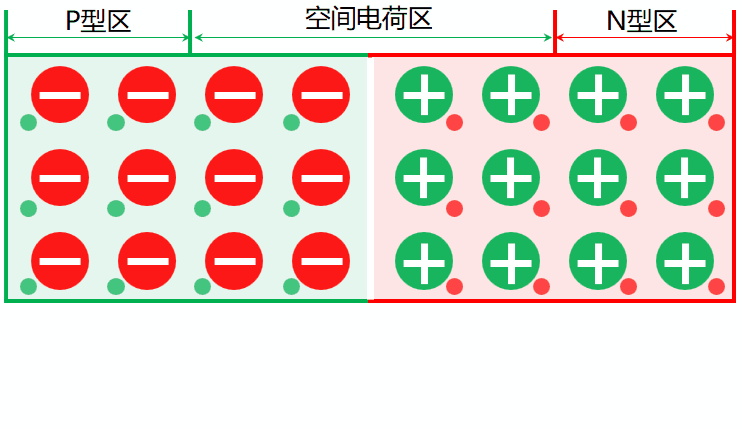
- 形成（了解即可）：P型和N型半导体接触面，多子扩散形成**空间电荷区**（耗尽层），产生内电场（$N \to P$），阻碍扩散、促进漂移，动态平衡时PN结稳定。
- **内建电势**：$V_{\text{bi}} = U_T \ln\frac{N_a N_d}{n_i^2}$，室温下约0.757V（硅）。
- **单向导电性**：
  - **正偏**（P接正、N接负）：外电场削弱内电场，耗尽层变窄，扩散为主，形成**大**正向电流 → **导通**。
  - **反偏**（P接负、N接正）：外电场增强内电场，耗尽层变宽，漂移为主，形成**微小**反向饱和电流 $I_S$ → **截止**。
- **伏安特性**：
  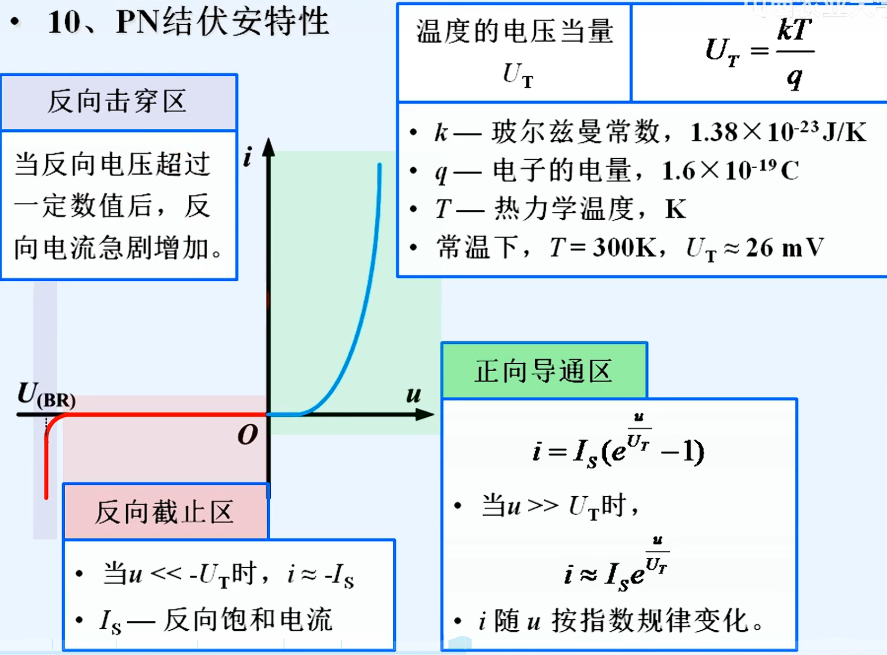
  $$
  i_D = I_S (e^{\frac{u_D}{U_T}} - 1)
  $$
  - $U_T = \dfrac{kT}{e}$，室温下约**26mV**。
  - $I_S$：反向饱和电流，受PN结面积、掺杂浓度、温度等影响，通常很小。

- **反向击穿**：
  - **雪崩击穿**：低掺杂、宽耗尽层，强电场加速载流子碰撞电离。温度升高，击穿电压**升高**。
  - **齐纳击穿**：高掺杂、窄耗尽层，强电场直接拉出价电子。温度升高，击穿电压**降低**。
  - **电击穿**（可逆） vs **热击穿**（不可逆，烧毁）。

## 1.2 半导体二极管
### 1.2.1 结构与类型
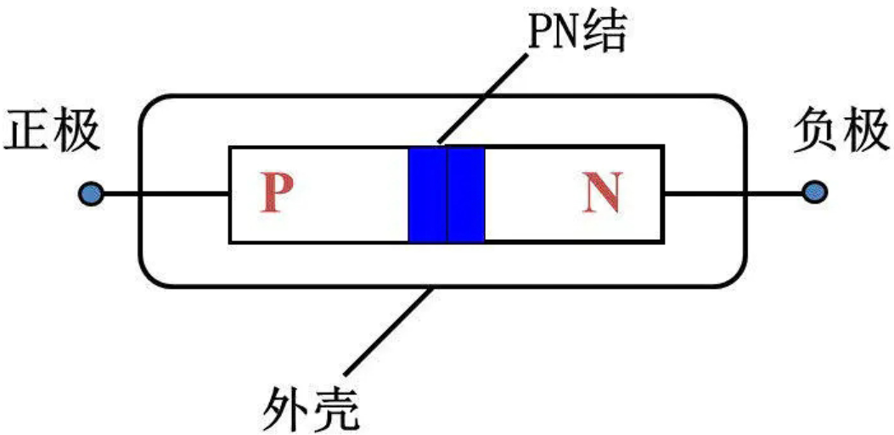
- **结构**：PN结 + 引线 + 管壳。
- **类型**：点接触型（高频小电流）、面接触型（低频大电流，整流）、平面型（集成）。

### 1.2.2 伏安特性
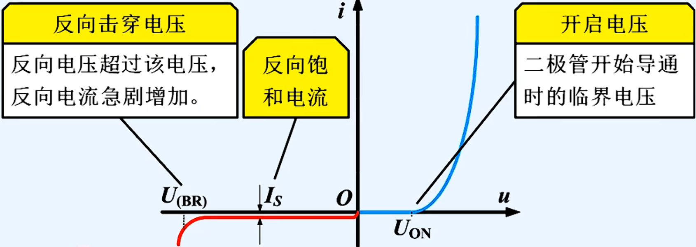
- **与PN结差异**：存在体电阻和表面漏电流，正向压降稍大，反向电流稍大。
- **开启电压 $U_{on}$**：硅管0.5V，锗管0.1V。
- **导通电压**：硅管0.6~0.8V（常取0.7V），锗管0.2~0.3V（常取0.2V）。
- **温度特性**：$T\uparrow$ → 正向曲线左移（$-2\text{mV}/^\circ\text{C}$），反向曲线下移（$I_S$每10℃翻倍）。

### 1.2.3 等效模型
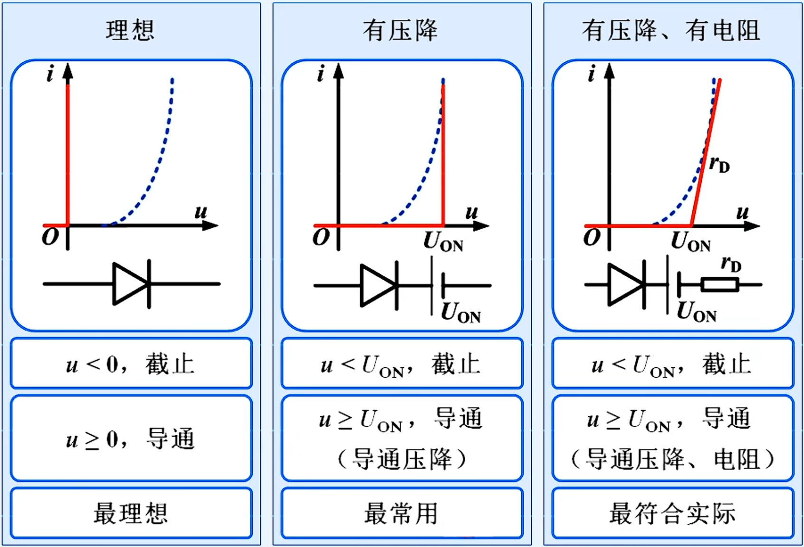
1. **理想模型**：正向短路（$U_D=0$），反向开路（$I_D=0$）。
2. **恒压降模型**：正向串联恒压源 $U_{on}$（硅0.7V，锗0.2V）。
3. **微变等效模型（小信号）**：用静态工作点Q处的切线近似描述**小范围内**二极管的动态特性
   - 动态电阻 $r_d = \dfrac{U_T}{I_{DQ}}$，$I_{DQ}$ 为静态工作点电流。
   - 用于叠加在直流上的小交流信号分析。

主要参数：
- **最大整流电流 $I_F$**：允许通过的最大正向平均电流。
- **最大反向工作电压 $U_{RM}$**：约为击穿电压 $U_{BR}$ 的一半。
- **反向电流 $I_R$**：未击穿时的反向电流（硅管nA级，锗管μA级）。
- **最高工作频率 $f_M$**：由结电容决定，超过后单向导电性变差。

### 1.2.4 稳压二极管
- **工作区**：反向击穿区，击穿后可恢复。
- **主要参数**：
  - 稳定电压 $U_Z$，稳定电流 $I_{Zmin}$，最大耗散功率 $P_{ZM}$。
  - 动态电阻 $r_z = \Delta U_Z / \Delta I_Z$，越小稳压性越好。
  - **温度系数 $\alpha$**：$|U_Z|<4\text{V}$ 负（齐纳），$|U_Z|>7\text{V}$ 正（雪崩），$4\sim7\text{V}$ 近零（高稳定基准）。
- **限流电阻计算**（给定 $U_{I\min},U_{I\max},I_{L\min},I_{L\max},I_{Z\min},I_{Z\max}$）：
  $$R_{\max} = \frac{U_{I\min}-U_Z}{I_{Z\min}+I_{L\max}},\quad R_{\min} = \frac{U_{I\max}-U_Z}{I_{Z\max}+I_{L\min}}$$
  选取 $R_{\min} \le R \le R_{\max}$。

## 1.3 晶体三极管（BJT）

### 1.3.1 结构与类型
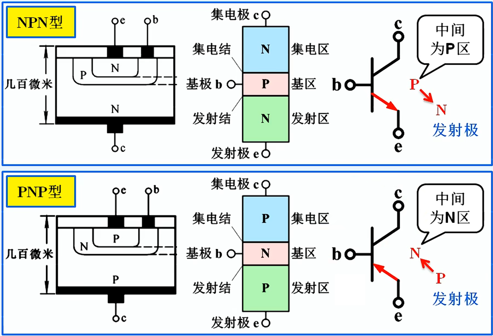
- **结构**：三个区（发射区、基区、集电区），两个PN结（发射结、集电结）。
- **类型**：NPN、PNP。
- **特点**：基区薄、掺杂低；发射区掺杂高；集电区面积大。

### 1.3.2 电流放大作用
- **外部条件**：发射结**正偏**，集电结**反偏**（NPN：$U_{BE}>U_{on}$，$U_{CE}>U_{BE}$）。
- **电流关系**：
  1. $I_E = I_B + I_C$ (始终成立)
  2. $I_C = \bar{\beta} I_B + I_{CEO} \approx \bar{\beta} I_B$ (放大区常用)
    - **直流放大系数** $\bar{\beta} \approx I_C/I_B$
    - **交流放大系数** $\beta = \Delta i_C/\Delta i_B$。

### 1.3.3 共射特性曲线

- **输入特性**：$i_B = f(u_{BE})|_{u_{CE}=常数}$。$u_{CE}$增大，曲线右移（因为集电结反偏增强，基区复合减少）。
- **输出特性**：$i_C = f(u_{CE})|_{i_B=常数}$。
  | 工作状态 | 电压判据 (NPN) | 条件描述 | 特点 |
  | :--- | :--- | :--- | :--- |
  | **放大区** | $u_C > u_B > u_E$ | 发射结正偏，集电结反偏（$u_{CE} \ge u_{BE}$） | $i_C = \beta i_B$，电流受控，曲线平坦 |
  | **饱和区** | $u_B > u_E, u_B > u_C$ | 发射结正偏，集电结正偏或零偏（$u_{CE} < u_{BE}$） | $u_{CE} \approx 0.3\text{V}$，$i_C < \beta i_B$ |
  | **截止区** | $u_B < u_E$ | 发射结反偏（或零偏） | $i_B \approx 0, i_C\approx I_{CEO}\approx 0$ |

  输出特性曲线如下：
  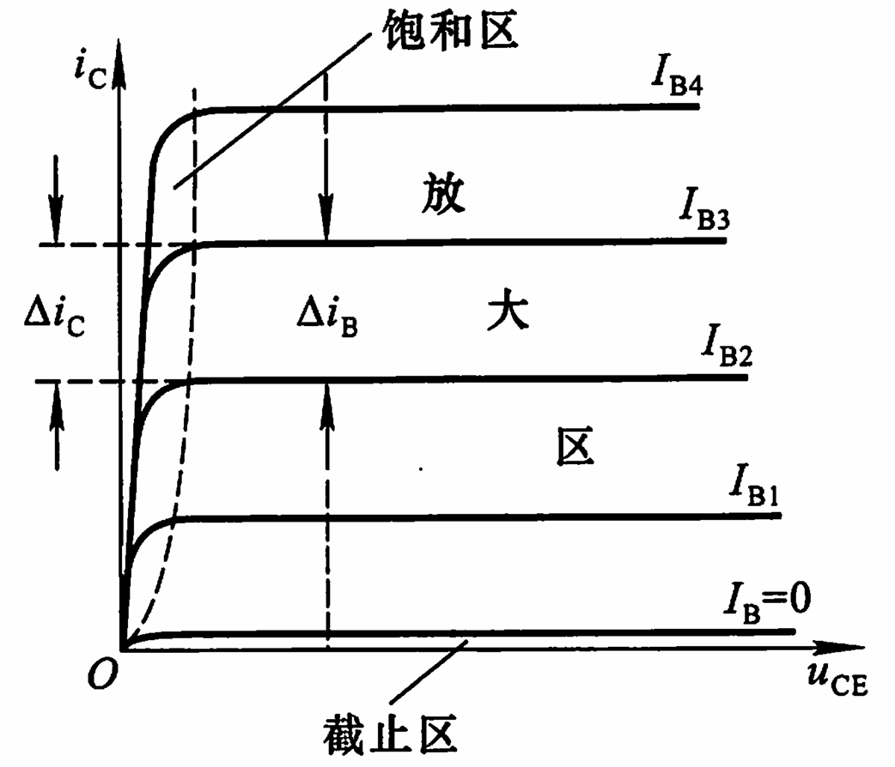

主要参数：
- **直流参数**：$\overline{\beta}$，$I_{CBO}$（发射极开路，集电结反向电流），$I_{CEO}=(1+\beta)I_{CBO}$（穿透电流）。
- **交流参数**：$\beta$，特征频率 $f_T$（$\beta$ 降至1时的频率）。
- **极限参数**：$I_{CM}$（$\beta$明显下降时的$I_C$），$P_{CM}=i_C u_{CE}$，$U_{(BR)CEO}$（基极开路时的C-E击穿电压）。

## 1.4 场效应管（FET）

### 1.4.1 结构与类型
  2. **电容的场效应**：栅极电压改变沟道载流子浓度，增强型：栅压控制沟道导通；耗尽型：栅压控制沟道截止。
- **场效应管**：利用输入回路的电场效应控制输出回路的半导体器件
  - 结型场效应管（JFET）：PN结反偏形成耗尽层，耗尽层$\uparrow$ → 沟道载流子$\downarrow$ → 导电$\downarrow$
    - 栅极-gate-g
    - 源极-source-s
    - 漏极-drain-d
    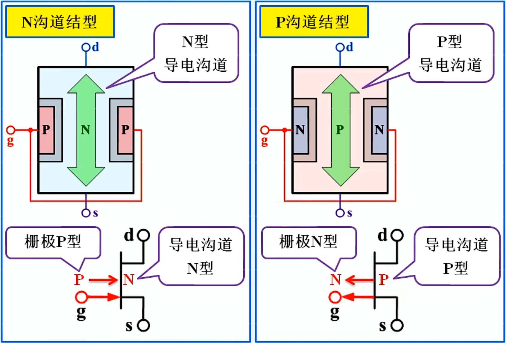
  - 绝缘栅场效应管（MOS管）：用栅极和衬底形成电容。
    - 增强型：感应电压$\uparrow$ → 反型层（导电沟道）形成（扩大） → 导电$\uparrow$。
    - 耗尽型：在绝缘层掺入正电荷或负电荷，构建反型层。感应电压$\downarrow$ → 反型层缩小 → 导电$\downarrow$。
    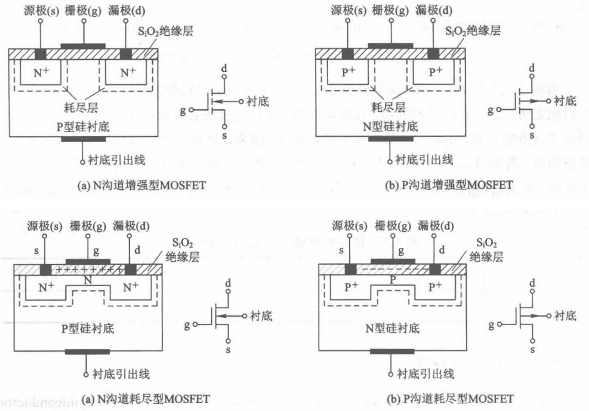
### 1.4.2 JFET的特性（N沟道）
- 输出特性：漏极电流与漏-源电压的关系，受栅-源电压控制。
  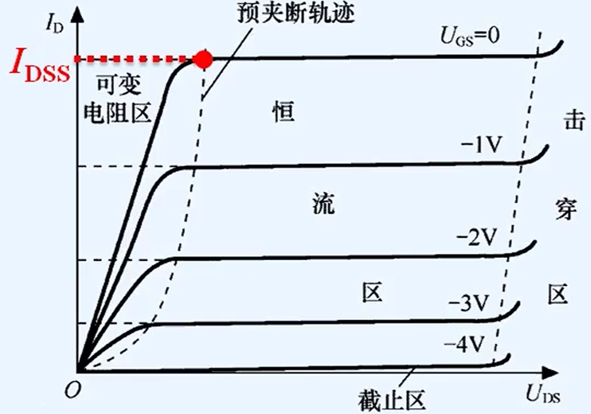
  - 部分参数说明：
    - $I_{DSS}$：$u_{GS}=0$ 时的漏极电流。
    - $U_{GS(off)}$：夹断电压，当 $u_{GS}=u_{GS(off)}$ 时，$i_D \le 5\mu \mathrm{A} \approx 0$。图中$u_{GS(off)}$ 约为 $-4\mathrm{V}$。
    - 输出特性曲线在 $u_{GS}=0$ 时达到最大 $i_D$，随着 $u_{GS}$ 的负向增加，$i_D$ 逐渐减小，直到 $u_{GS}=u_{GS(off)}$ 时 $i_D \approx 0$。
  - 区域划分：
    - **可变电阻区**：$0 > u_{GS} > u_{GS(off)}$，沟道部分夹断，漏极电流随 $u_{DS}$ 增加而增加。
    - **恒流区**：$u_{DS} > u_{DS(sat)}$，沟道完全夹断，漏极电流基本不随 $u_{DS}$ 增加而增加，近似恒定。
    - 击穿区：$u_{DS} > u_{DS(BR)}$，发生击穿，漏极电流急剧增加。
    - 截止区：$u_{GS} < u_{GS(off)}$，沟道完全夹断，漏极电流近似为零。
- 转移特性：漏极电流与栅-源电压的关系，受漏-源电压控制。
  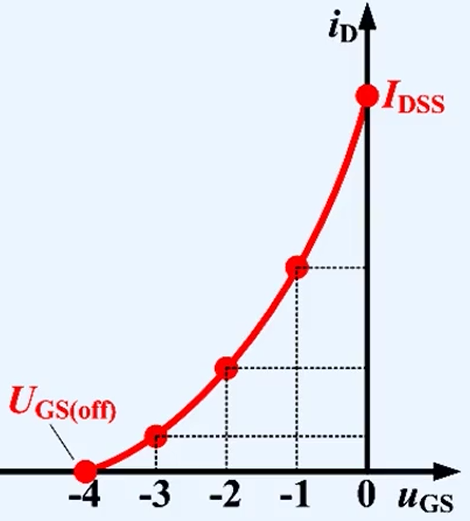
  $$
  i_D = I_{DSS}\left(1-\frac{u_{GS}}{U_{GS(off)}}\right)^2,\quad u_{GS} \le 0\text{且}U_{DS} \ge U_{DS(sat)}
  $$
  - 转移特性描述了在固定漏源电压 $U_{DS}$ 下，漏极电流 $i_D$ 随栅源电压 $U_{GS}$ 的变化关系。
  - 当 $u_{GS}=0$ 时，$i_D$ 达到最大值 $I_{DSS}$；当 $u_{GS}$ 逐渐变负时，$i_D$ 按照上述公式逐渐减小，直到 $u_{GS}=U_{GS(off)}$ 时 $i_D \approx 0$。

### 1.4.3 增强型MOS管的特性
- 输出特性：漏极电流与漏-源电压的关系，受栅-源电压控制。
  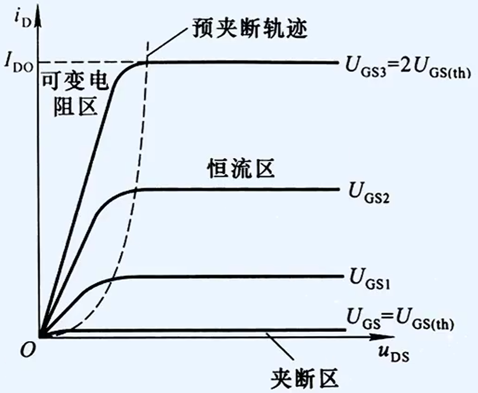
  - 部分参数说明：
    - $I_{DO}$：$u_{GS}=2U_{GS(th)}$ 时的漏极电流。
    - $U_{GS(th)}$：开启电压，当 $u_{GS}=U_{GS(th)}$ 时，$i_D \ge 5\mu \mathrm{A}$，管子开始导通。
  - 区域划分：
    - **可变电阻区**：$u_{DS} < u_{GS}-U_{GS(th)}$，漏极电流随 $u_{DS}$ 增加而增加，近似线性。
    - **恒流区**：$u_{DS} \ge u_{GS}-U_{GS(th)}$，漏极电流基本不随 $u_{DS}$ 增加而增加，近似恒定。
    - 夹断区：$u_{GS} < U_{GS(th)}$，管子截止，漏极电流近似为零。
- 转移特性：漏极电流与栅-源电压的关系，受漏-源电压控制。
  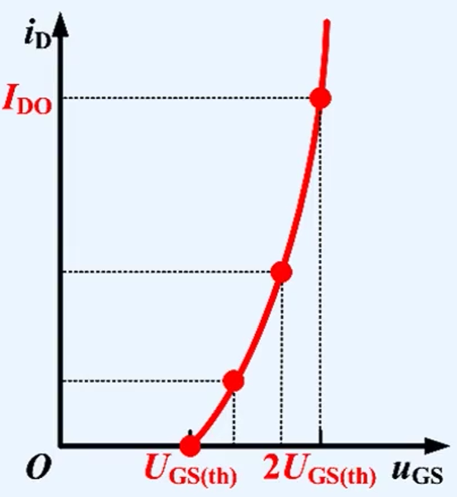
  $$
  i_D = I_{DO}\left(\frac{u_{GS}}{U_{GS(th)}}-1\right)^2,\quad u_{GS} \ge U_{GS(th)}\text{且}u_{DS} \ge u_{GS}-U_{GS(th)}
  $$
  - 转移特性描述了在固定漏源电压 $U_{DS}$ 下，漏极电流 $i_D$ 随栅源电压 $U_{GS}$ 的变化关系。
  - 当 $u_{GS}=U_{GS(th)}$ 时，$i_D$ 开始导通；当 $u_{GS}$ 逐渐增加时，$i_D$ 按照上述公式逐渐增加，直到 $u_{GS}=2U_{GS(th)}$ 时 $i_D = I_{DO}$。

---

# 第二章 基本放大电路

## 2.1 放大的概念与性能指标

- **放大的概念**：
  - **特征**：实现功率的放大，同时保持信号的波形不失真。
  - **本质**：能量的控制与转换，由直流电源提供能量。
- **性能指标**：
  - **放大倍数**：
    | 类型 | 定义 | 公式 |
    |:---:|:---:|:---:|
    | 电压放大倍数 $\dot{A_{uu}}$ | 输出电压与输入电压之比 | $\dot{A_{uu}} = \dot{A_u} = \dfrac{\dot{U_o}}{\dot{U_i}}$ |
    | 电流放大倍数 $\dot{A_{ii}}$ | 输出电流与输入电流之比 | $\dot{A_{ii}} = \dot{A_i} = \dfrac{\dot{I_o}}{\dot{I_i}}$ |
    | 互阻放大倍数 $\dot{A_{ui}}$ | 输出电压与输入电流之比 | $\dot{A_{ui}} = \dfrac{\dot{U_o}}{\dot{I_i}}$ |
    | 互导放大倍数 $\dot{A_{iu}}$ | 输出电流与输入电压之比 | $\dot{A_{iu}} = \dfrac{\dot{I_o}}{\dot{U_i}}$ |
  - **输入电阻** $R_i = U_i/I_i$：从输入端看进去的等效电阻。
  - **输出电阻** 
    $$
    R_o = \left(\frac{U_{o}'}{U_o}-1\right)R_L
    $$
    - $U_o'$为空载输出电压
    - $U_o$为带$R_L$时的输出电压
  - **通频带** $f_{bw}=f_H-f_L$：放大倍数大于最大值的$\dfrac{1}{\sqrt{2}}$的频率范围。

## 2.2 基本共射放大电路的工作原理
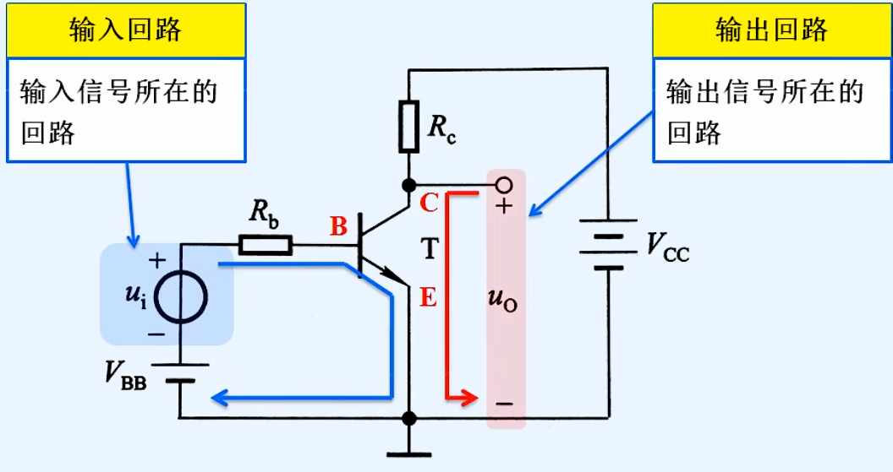
- **电路特点**：输入回路与输出回路**共**用发**射**极

### 2.2.1 电路组成（阻容耦合）

- $T$：NPN晶体管，提供电流放大作用。
- $V_{BB}$：使发射结正偏的直流电压，提供静态工作点。
- $V_{CC}$：使集电结反偏的直流电压，提供放大所需的能量。
- $R_c$：集电极负载电阻，提供输出电压。

### 2.2.2 静态分析（估算法）

- 基极电流 $I_{BQ} = \dfrac{V_{BB}-U_{BEQ}}{R_b}$
- 集电极电流 $I_{CQ} = \beta I_{BQ}$
- 管压降 $U_{CEQ} = V_{CC} - I_{CQ}R_c$

### 2.2.3 波形分析

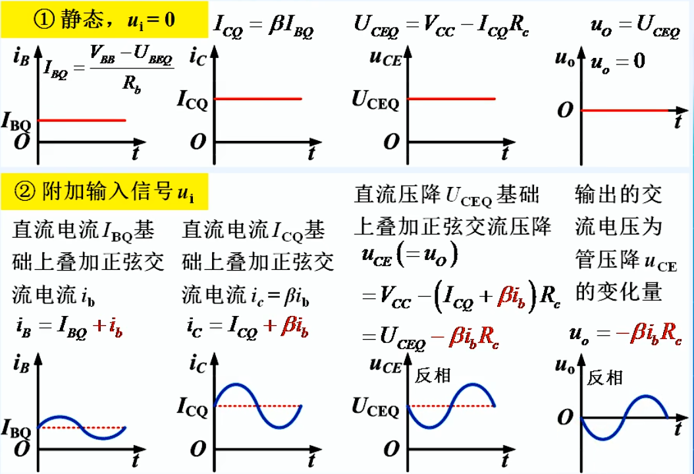

### 2.2.4 两种实用的共射放大电路

#### 1. 直接耦合共射放大电路

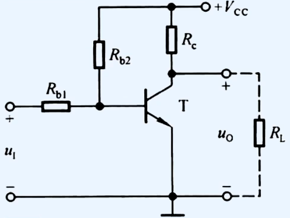
- 静态时：
  $$
  I_{BQ} = \dfrac{V_{CC}-U_{R_{b1}}}{R_{b2}},\qquad I_{CQ} = \beta I_{BQ},\qquad U_{CEQ} = V_{CC} - I_{CQ}R_c
  $$

#### 2. 阻容耦合共射放大电路

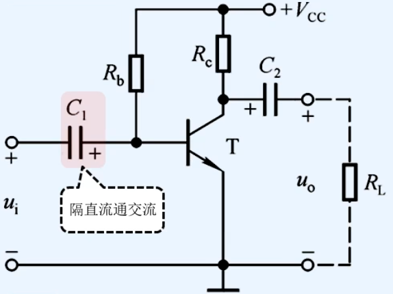
- 静态时：
  $$
  I_{BQ} = I_{Rb} = \dfrac{V_{CC}-U_{BEQ}}{R_b},\qquad I_{CQ} = \beta I_{BQ},\qquad U_{CEQ} = V_{CC} - I_{CQ}R_c
  $$
- 动态时：
  $$
  u_{BE} = u_i + U_{BEQ},\qquad u_{CE} = U_{CEQ} + u_o = U_{CEQ} - \beta R_c i_b
  $$

## 2.3 放大电路的分析方法

### 2.3.1 图解法

注意到，输入回路的输出是三极管的输入，三极管的输出又是输出回路的输入，将他们的ui特性曲线叠加在一起，找到交点即为静态工作点Q。

不过，由于三极管ui特性曲线是非线性的，所以一般是算不出来的。（顶多让你把图画出来）
类似这样
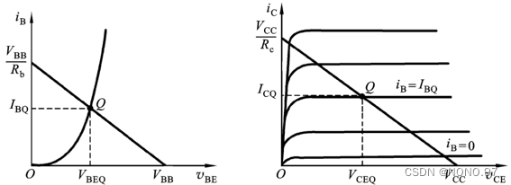

### 2.3.2 等效电路法

遇事不决线性化，三极管太可恶了，直接等效成一个线性电路 ~~(怎么等效的你别管)~~

#### 直流等效模型

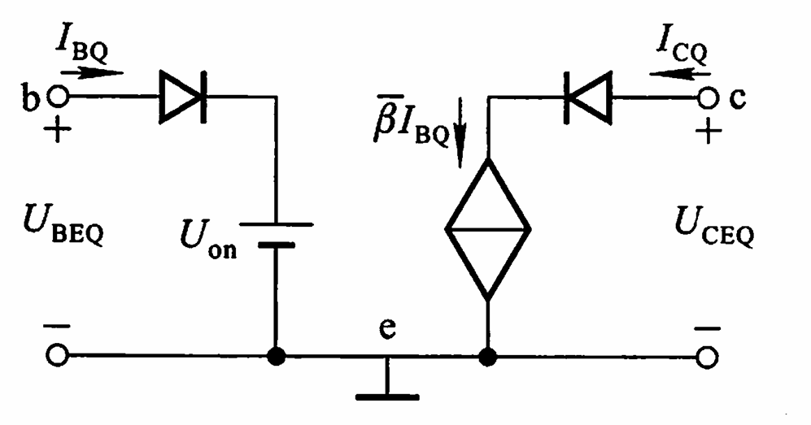

#### 共射h参数等效模型

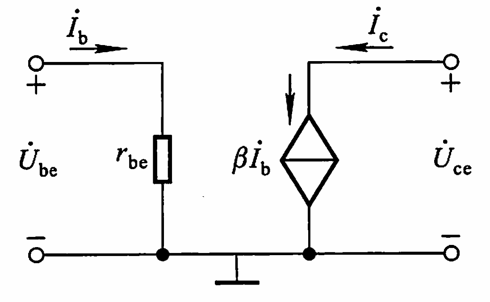

$$
r_{be} = r_{bb'} + \beta \frac{U_T}{I_{CQ}} = r_{bb'} + (1+\beta)\frac{U_T}{I_{EQ}}
$$

其中$r_{bb'}$到时候会给你的。

#### 利用等效电路分析交流小信号
总的等效电路如下：
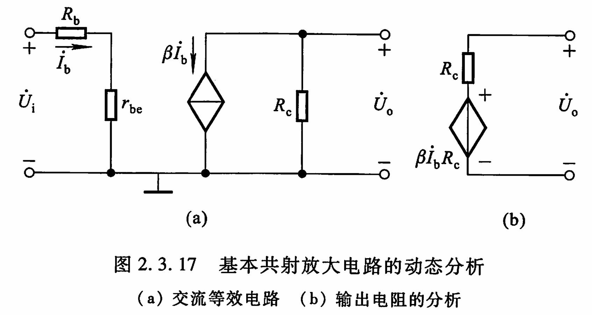

于是
$$
\dot{A_u} = \frac{\dot{U_o}}{\dot{U_i}} = - \frac{\beta R_c}{R_b+r_{be}},\qquad R_i = \frac{U_i}{I_i} = R_b + r_{be},\qquad R_o = R_c
$$
放心，考试不会这么简单的。往往在电路中稍作改动，引入一些电阻、电容，此时就需要重新画出等效电路，重新分析了。

务必观看[基本共射放大电路动态分析](https://www.bilibili.com/video/BV1hd4y1M7SC)

## 2.4 放大电路静态工作点的稳定

- **温度对Q点的影响**：$T \uparrow \; \to \; I_{CBO} \uparrow, \beta \uparrow, U_{BE} \downarrow \; \to \; I_C \uparrow$。Q点整体上移，易产生饱和失真。
- **典型电路：分压式偏置电路**：
  - **核心原理**：固定基极电位，引入直流负反馈。
  - **电路条件**：$I_1 \gg I_{BQ}$（$I_1 \approx 10I_{BQ}$），$V_{B} \gg U_{BEQ}$，使 $V_B \approx \dfrac{R_{b2}}{R_{b1}+R_{b2}} V_{CC}$，基本不受温度影响。
  - **反馈过程**：$T \uparrow \to I_C \uparrow \to I_E \uparrow \to V_E \uparrow \to U_{BE} \downarrow (U_{BE} = V_B - V_E) \to I_B \downarrow \to I_C \downarrow$。
  - **射极旁路电容 $C_e$**：若 $R_e$ 上并联了 $C_e$，则 $R_e$ 对交流短路，不损失交流电压放大倍数；若无 $C_e$，则会引入交流负反馈，使 $A_u$ 急剧下降，但提高了输入电阻和通频带。

## 2.5 晶体管单管放大电路的三种接法

由于基本共基放大电路不考，所以不学。

### 2.5.1 基本共集放大电路

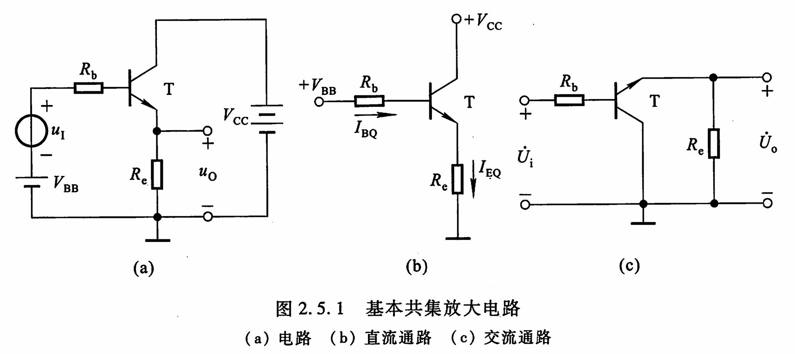
- **特点**：集电极C交流接地，输入接B，输出接E。也称**射极跟随器**。
- **性能**：
  - **电压放大倍数**：$\dot{A_u} \approx 1$ 且略小于1，同相。所以无电压放大能力。但有功率放大能力。
  - **输入电阻**：极大，常作多级放大电路的**输入级**（减小信号源负担）。
  - **输出电阻**：极小，带负载能力强，常作**输出级**或缓冲级。

#### 1. 静态分析

$$
I_{BQ} = \frac{V_{BB}-U_{BEQ}}{R_b+(1+\beta)R_e},\qquad I_{EQ} = (1+\beta) I_{BQ},\qquad U_{CEQ} = V_{CC} - I_{EQ}R_e
$$

#### 2. 动态分析

共集放大电路的交流等效电路如下：
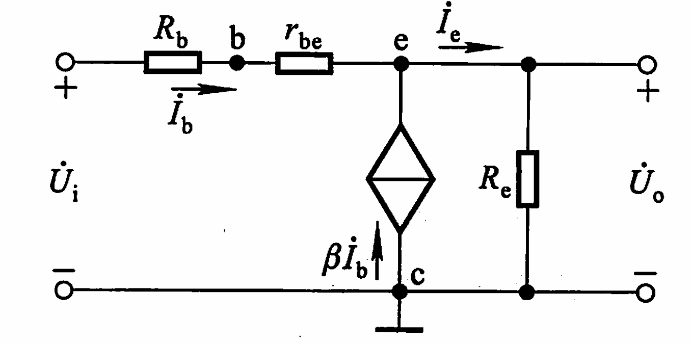

$$
\dot{A_u} = \frac{(1+\beta)R_e}{R_b+r_{be}+(1+\beta)R_e},\qquad R_i = R_b + r_{be} + (1+\beta)R_e,\qquad R_o =R_e \parallel \frac{R_b + r_{be}}{1+\beta}
$$

## 2.6 例题选讲

**例1：** 如图所示的放大电路，已知$V_{CC}=12\text{V}$，$R_C=3\text{k}\Omega$，$R_L=6\text{k}\Omega$，$R_b=240\text{k}\Omega$，$\beta=40$，$r_{be}=0.73\text{k}\Omega$，试求：
（1）负载开路和带载时的电压放大倍数；
（2）输入电阻和输出电阻；
（3）若信号源内阻为$600\Omega$，试求$\dot{A}_{us}=\frac{\dot{U}_o}{\dot{U}_s}$。
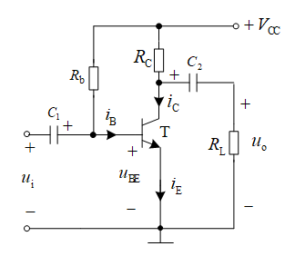
**解：** 首先画出交流等效电路（**将耦合电容视为短路，直流电源视为短路$V_{CC}=0$**）：
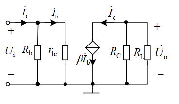
（1）容易得到：
$$
\text{负载开路时}\quad \dot{A_u} = -\frac{\beta R_C}{r_{be}} = -164.38
$$
$$
\text{带载时}\quad \dot{A_u} = -\frac{\beta (R_C \parallel R_L)}{r_{be}} = -109.59
$$
（2）计算输入和输出电阻时，把输入电压置零，输出端开路。容易发现左右两部分相互独立，输入端口等效电阻为$R_b$和$r_{be}$的并联，输出端口等效电阻为$R_C$。因此
$$
R_i = R_b \parallel r_{be} = 0.72\text{k}\Omega 
$$
$$
R_o = R_C = 3\text{k}\Omega
$$
（3）画出等效电路
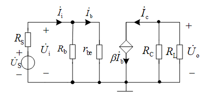
于是容易得到
$$
\dot{A}_{us} = \frac{\dot{U}_o}{\dot{U}_s} = \frac{\dot{U}_o}{\dot{U}_i} \cdot \frac{\dot{U}_i}{\dot{U}_s} = \dot{A_u} \cdot \frac{R_i}{R_i + R_s} = -60.17
$$

总结：等效电路法是分析放大电路的利器，尤其是当电路稍微复杂一些时，图解法就不太适用了。通过画出等效电路，我们可以清晰地看到各个部分的关系，从而正确地计算出放大倍数、输入输出电阻等性能指标。

**例2：** 分压式偏置电路如图所示，已知$\beta=50,\;U_{BE}=0.7\text{V},\;r_{be}=0.86\text{k}\Omega$，试求：
（1）放大电路的静态值（$I_{BQ}, I_{EQ}, U_{CEQ}, U_{BQ}$）；
（2）电压放大倍数、输入电阻和输出电阻。
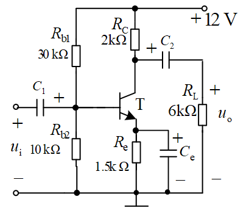
**解：** （1）画出静态电路图（耦合电容开路，交流电源$u_i$短路），分析得到
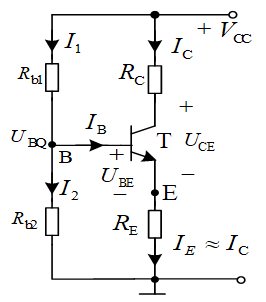
容易得到
$$
U_{BQ} = V_{CC} \cdot \frac{R_{b2}}{R_{b1}+R_{b2}} = 3\text{V}
$$
$$
I_{EQ} = \frac{U_{BQ}-U_{BEQ}}{R_e} = 1.53\text{mA}
$$
$$
I_{BQ} = \frac{I_{EQ}}{1+\beta} = 30\mu \text{A}
$$
$$
U_{CEQ} = V_{CC} - I_{EQ}R_e - I_{CQ}R_c = 6.7\text{V}
$$
（2）画出交流等效电路（耦合电容短路，直流电源短路），分析得到
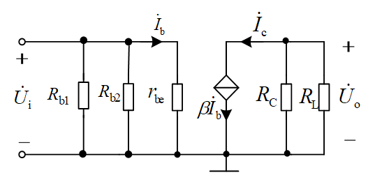
$$
\dot{A}_u = -\frac{\beta (R_c \parallel R_L)}{R_b + r_{be}} = -87.21
$$
$$
R_i = R_{b1} \parallel R_{b2} \parallel r_{be} = 0.77\text{k}\Omega
$$
$$
R_o = R_c = 2\text{k}\Omega
$$

**例3：** 在图示电路中，已知$V_{CC}=12\text{V}, \beta=60, R_b=200\text{k}\Omega, R_e=3\text{k}\Omega, R_L=3\text{k}\Omega, R_S=50\Omega, r_{be}=1\text{k}\Omega$。试求：
（1）静态工作点Q的参数（$I_{BQ}, I_{EQ}, U_{CEQ}$）；
（2）电压放大倍数、输入电阻和输出电阻；
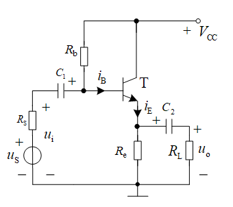
留作练习，请读者自行完成。

答案：
（1）$I_{BQ} = 30\mu \text{A}, I_{EQ} = 1.83\text{mA}, U_{CEQ} = 6.51\text{V}$
（2）$\dot{A}_u = 0.989, R_i = 63.3\text{k}\Omega, R_o = 16.21\Omega$

---

# 第三章 集成运算放大电路

## 3.1 多级放大电路

### 3.1.1 耦合方式
- **直接耦合**：将前一级输出直接连接到下一级输入
  - 可放大直流，易集成，但存在**零点漂移**（温漂），各级Q点相互影响。
- **阻容耦合**：将前一级输出通过耦合电容连接到下一级输入
  - 各级Q点独立，低频特性差，不易集成。
- **变压器耦合**：将前一级输出通过变压器连接到下一级输入
  - 可实现阻抗变换，体积大，低频差。
  - 一般看作理想变压器，狠狠等效电阻
- **光电耦合**：将前一级输出转换为光信号传输，再转换回电信号连接到下一级输入
  - 抗干扰强，用于隔离。

### 3.1.2 动态分析
- 总电压放大倍数 $\displaystyle\dot{A}_u = \prod_{k=1}^N \dot{A}_{uk}$
  - 每一级放大倍数均是以后面所有电路作为其负载计算的。
- 电压 $\dot{U}_{o1} = \dot{U}_{i2},\; \dot{U}_{o2} = \dot{U}_{i3},\; \ldots\;,\; \dot{U}_{oN-1} = \dot{U}_{iN}$
- 输入电阻 $R_i = R_{i1}$
- 输出电阻 $R_o = R_{oN}$

例：
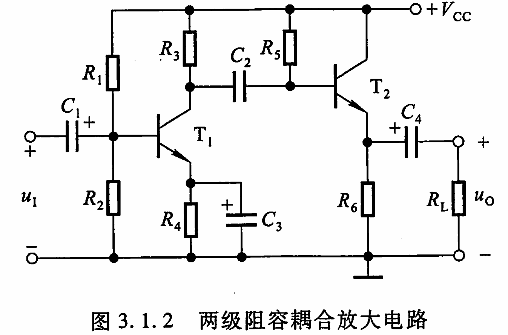
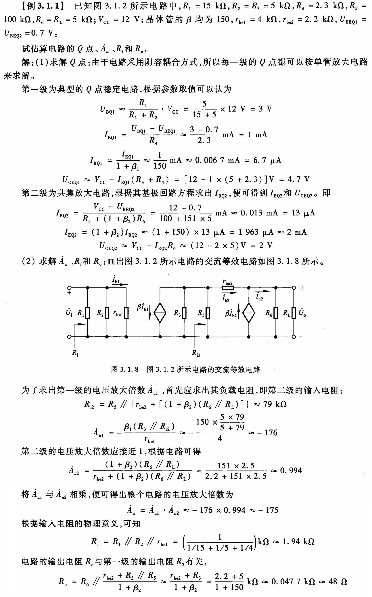
## 3.2 差分放大电路

### 3.2.1 基本概念

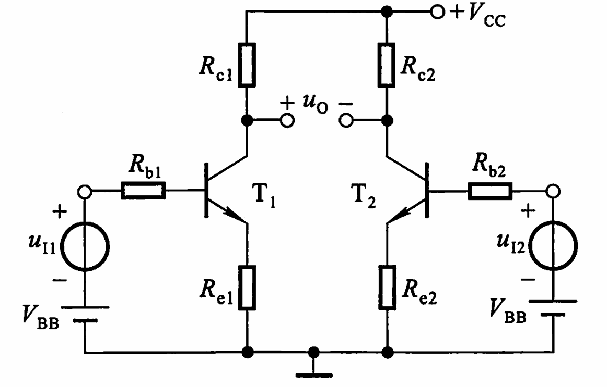

- **差模信号** ：对称电路中两输入端的电压差 $u_{Id} = u_{I1} - u_{I2}$（有用信号）
- **共模信号** ：对称电路中两输入端的电压平均值 $u_{Ic} = \frac{u_{I1} + u_{I2}}{2}$（干扰信号）
- **差模放大倍数** $A_d = \dfrac{\Delta u_{od}}{\Delta u_{Id}}$
- **共模放大倍数** $A_c = \dfrac{\Delta u_{oc}}{\Delta u_{Ic}}$
- **共模抑制比** $K_{CMR} = \left|\dfrac{A_d}{A_c}\right|$（越大性能越好）
  - 参数理想对称时，$A_c=0, A_d=2, K_{CMR}=\infty, $

### 3.2.2 长尾式差分放大电路（双端输入双端输出）

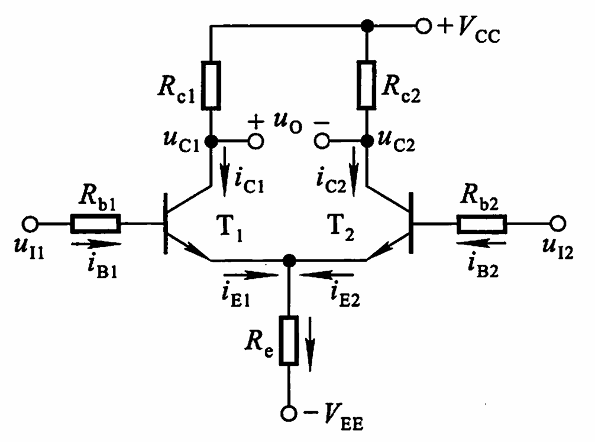

理想情况下，左右两部分完全对称

#### 1. 静态分析

此时输入端电压为0，两个三极管完全对称，于是
$$
I_{R_e} = 2I_{EQ}, \qquad I_{EQ} = \frac{V_{EE}-U_{BEQ}}{\frac{R_b}{1+\beta} + 2R_e}, \qquad I_{BQ} = \frac{I_{EQ}}{1+\beta}
$$

#### 2. 对共模信号的抑制作用

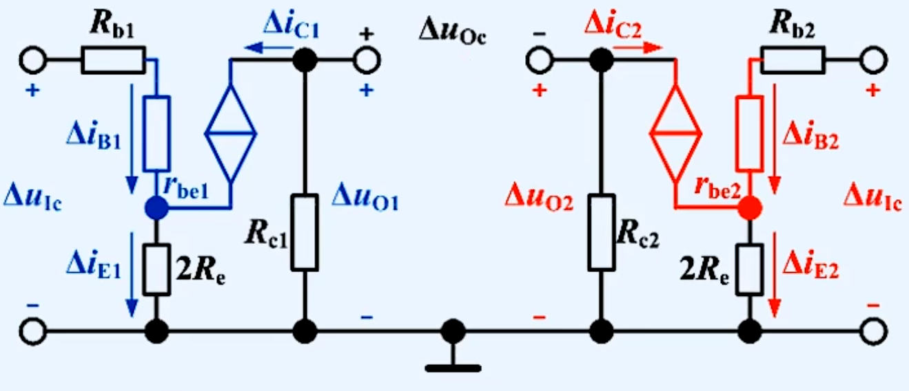

$$
\Delta u_{Ic} = \Delta i_B[R_b + r_{be} + 2(\beta + 1)R_e], \qquad \Delta u_{O1} = \Delta u_{O2} = -\beta \Delta i_B R_c
$$
$$
A_{c1} = A_{c2} = -\frac{\beta R_c}{R_b + r_{be} + 2(\beta + 1)R_e}
$$
参数理想对称时，$\Delta u_{Oc}=0,\;A_c=0$，共模信号完全被抑制。

#### 3. 对差模信号的放大作用

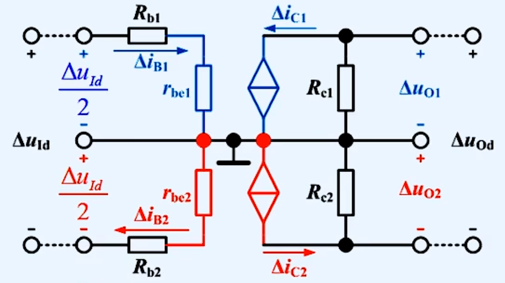

在$\Delta u_{O1}, \Delta u_{O2}$处插入电阻$\frac{R_L}{2}$，得到

$$
\Delta u_{Od} = -2\beta \Delta i_B (R_c \parallel \frac{R_L}{2}), \qquad \Delta u_{Id} = 2\Delta i_B (R_b + r_{be})
$$
于是
$$
A_d = -\frac{\beta (R_c \parallel \frac{R_L}{2})}{R_b + r_{be}}, \qquad R_i = 2(R_b + r_{be}), \qquad R_o = 2R_c
$$

### 3.2.3 输入输出方式

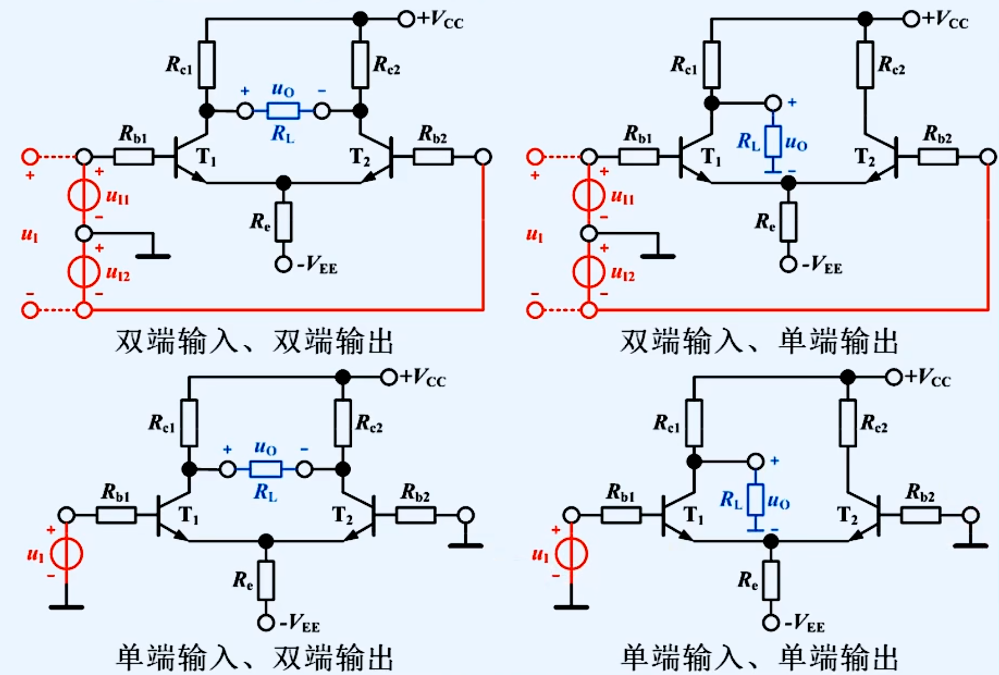

- 输入电阻均为$R_i = 2(R_b + r_{be})$
- 单端输入分解为共模+差模双端输入
- 其他参数与输出接法有关
  - 单端输出：
    $$
    A_d = -\frac{\beta (R_c \parallel R_L)}{2(R_b + r_{be})},\qquad A_c = -\frac{\beta (R_c \parallel R_L)}{R_b + r_{be} + 2(\beta + 1)R_e},\qquad R_o = R_c
    $$
  - 双端输出：
    $$
    A_d = -\frac{\beta (R_c \parallel \frac{R_L}{2})}{R_b + r_{be}},\qquad A_c = 0,\qquad R_o = 2R_c
    $$
## 3.3 电流源电路

- **镜像电流源**：$I_{C2} \approx I_{REF} = \dfrac{V_{CC}-U_{BE}}{R}$。
- **比例电流源**：$I_{C1}R_{e1} \approx I_{C2}R_{e2}$。
- **微电流源**：利用$R_e$获得微小电流。
- **威尔逊电流源**：输出电流更精确，受$\beta$影响小。
- **有源负载**：用电流源代替$R_c$，可大幅提高增益。

## 3.4 功率放大电路（功放）

### 3.4.1 分类与特点
- **甲类**：360°导通，效率<50%，失真小。
- **乙类**：180°导通，效率78.5%，存在**交越失真**。
- **甲乙类**：略大于180°，消除交越失真，效率接近乙类。

### 3.4.2 OCL电路（无输出电容，双电源）
- **原理**：$T_1$（NPN）、$T_2$（PNP）互补射极输出。
- **消除交越失真**：消除交越失真的核心方法是令静态工作点 $Q$ 略高于截止点，通过在输出管基极间引入 $U_{BE}$ 倍增电路或两个二极管，使管子进入**甲乙类**工作状态。
- **最大输出功率**：$P_{om} = \dfrac{(V_{CC}-U_{CES})^2}{2R_L}$。
- **效率**：$\eta = \dfrac{\pi}{4}\dfrac{V_{CC}-U_{CES}}{V_{CC}} \le 78.5\%$。
- **管耗**：最大管耗约为$0.2P_{om}$（当$U_{CES}=0$时）。

### 3.4.3 功放管选择
- 最大管压降 $U_{CEmax} \ge 2V_{CC}$
- 最大集电极电流 $I_{Cmax} \ge \dfrac{V_{CC}}{R_L}$
- 最大功耗 $P_{CM} \ge 0.2P_{om}$

---

# 第五章 放大电路中的反馈

## 5.1 基本概念与判断

- **反馈**：将输出量的一部分或全部引回输入回路，影响净输入量。
- **极性（瞬时极性法）**：
  - **正反馈**：反馈增强净输入 → 常用于振荡器。
  - **负反馈**：反馈削弱净输入 → 改善放大性能。
- **交直流反馈**：反馈通路存在于直流通路 → 直流反馈（稳定Q点）；存在于交流通路 → 交流反馈（改善动态）。
- **四种组态判断**：
  1. **电压/电流**：输出端短路（$u_o=0$），反馈消失 → **电压反馈**；仍存在 → **电流反馈**。
  2. **串联/并联**：反馈量与输入量在输入端**串联**（电压求和）→ **串联反馈**（增大$R_i$）；**并联**（电流求和）→ **并联反馈**（减小$R_i$）。

## 5.2 负反馈对放大电路性能的影响

| 影响 | 说明 |
|:---|:---|
| **稳定增益** | 闭环增益 $A_f = \dfrac{A}{1+AF}$，深度负反馈时 $A_f \approx 1/F$，与晶体管参数无关 |
| **增大输入电阻** | 串联负反馈 $R_{if}=(1+AF)R_i$ |
| **减小输入电阻** | 并联负反馈 $R_{if}=R_i/(1+AF)$ |
| **减小输出电阻** | 电压负反馈 $R_{of}=R_o/(1+AF)$ → 恒压源特性 |
| **增大输出电阻** | 电流负反馈 $R_{of}=(1+AF)R_o$ → 恒流源特性 |
| **展宽通频带** | $f_{Lf}=f_L/(1+AF)$，$f_{Hf}=(1+AF)f_H$ |
| **减小非线性失真** | 将输出端失真反相引回，抵消部分失真 |

## 5.3 深度负反馈的近似计算
- 条件：$1+AF \gg 1$，则 $A_f \approx 1/F$。
- **电压串联**：$F = \dfrac{U_f}{U_o}$，$A_{uf} \approx 1/F$。
- **电流串联**：$F = \dfrac{U_f}{I_o}$，$A_{uf} \approx \dfrac{I_o R_L}{U_i} \approx \dfrac{R_L}{F}$。
- **电压并联**：$F = \dfrac{I_f}{U_o}$，$A_{usf} \approx \dfrac{U_o}{I_i R_s} \approx \dfrac{1}{F R_s}$。
- **电流并联**：$F = \dfrac{I_f}{I_o}$，$A_{usf} \approx \dfrac{I_o R_L}{I_i R_s} \approx \dfrac{R_L}{F R_s}$。

---

# 第六章 信号的运算和处理

## 6.1 基本运算电路（运放线性应用）

- **条件**：深度负反馈，满足“虚短”($u_N=u_P$)和“虚断”($i_N=i_P=0$)。

| 电路 | 表达式 | 输入电阻 | 特点 |
|:---|:---|:---|:---|
| **反相比例** | $u_O = -\dfrac{R_f}{R_1}u_I$ | $R_1$ | 共模电压为0 |
| **同相比例** | $u_O = \left(1+\dfrac{R_f}{R_1}\right)u_I$ | $\infty$ | 存在共模电压 |
| **电压跟随器** | $u_O = u_I$ | $\infty$ | $R_f=0$或$R_1=\infty$ |
| **反相求和** | $u_O = -R_f\left(\dfrac{u_{I1}}{R_1}+\dfrac{u_{I2}}{R_2}+\cdots\right)$ | 各支路电阻 | 独立调节 |
| **差动（减法）** | $u_O = \dfrac{R_f}{R_1}(u_{I2}-u_{I1})$（当$R_1=R_2,R_f=R_3$） | 同反相端 | 高共模抑制 |
| **积分** | $u_O = -\dfrac{1}{RC}\int u_I dt$ | — | 方波→三角波 |
| **微分** | $u_O = -RC\dfrac{du_I}{dt}$ | — | 三角波→方波 |

## 6.2 有源滤波器

- **分类**：低通(LPF)、高通(HPF)、带通(BPF)、带阻(BEF)。
- **一阶RC低通**：$A_{up}=1$（无源）或$1+R_f/R_1$（有源），$f_p = \dfrac{1}{2\pi RC}$。
- **二阶压控电压源LPF**：$Q = \dfrac{1}{3-A_{up}}$，$A_{up}=2$时$Q=1$，幅频特性最平坦。

## 6.3 电压比较器（运放非线性应用）

- **特点**：开环或正反馈，输出只有高、低两种电平。
- **传输特性三要素**：输出高/低电平、阈值电压、跃变方向。

| 类型 | 阈值电压 | 特点 |
|:---|:---|:---|
| **过零比较器** | $U_T=0$ | 灵敏，抗干扰差 |
| **单限比较器** | $U_T = -\dfrac{R_2}{R_1}U_{REF}$（反相端输入） | 电平检测 |
| **滞回比较器** | $U_{T1}=\dfrac{R_2}{R_1+R_2}U_{OH}$，$U_{T2}=\dfrac{R_2}{R_1+R_2}U_{OL}$（同相端输入） | 抗干扰，有迟滞 |
| **窗口比较器** | 上、下两个阈值 | 区间检测 |

> **避坑提示**：对于滞回比较器，**跃变方向是“迟滞”的**。如果 $u_I$ 从小变大和从大变小，触发的阈值电压不同（如反相输入时：$u_I$ 从小变大，$U_T$ 取大值；$u_I$ 从大变小，$U_T$ 取小值）。判定跃变方向是极易出错的陷阱。
> **三要素法求波形**：电容电压 $u_C(t)=u_C(\infty)+[u_C(0^+)-u_C(\infty)]e^{-t/\tau}$。
