# 前言

对于jk学生来说，模拟电路基础是一个很没用的课程，学了也用不上。但苦于学分压力，还是得学。

## 概述

在模拟电路中，首先就是介绍各种各样非线性元器件（二极管、三极管、场效应管等），其次是这些元器件在电路中的运用，也就是一些放大电路和反馈电路的分析方法。

在具体电路中，由于非线性元器件事实上我们无法计算，所以我们需要一些~~奇技淫巧~~近似技巧，而我们唯一真正能算的模型其实只要线性模型，故而，**线性化**或者说**泰勒一阶近似**便是唯一选择。

既然选择了泰勒一阶近似，那么展开点也即**静态工作点Q**自然是我们分析的核心，所有的分析方法都是围绕着Q点展开的。

当然，作为电路元件，其UI特性曲线也是我们分析的基础，要注意的是，不同于以往的一端口线性元件，三极管有三个端口，有三个电流和三个电压，两个输入一个输出，但幸好一般输出接地，所以我们实际上只要分析两个输入的特性曲线就行了。

放大电路中，在静态工作点的基础上，将其**等效为线性电路**，便可以使用线性电路的分析方法进行分析。

注意：

- 静态分析时，将交流源视为短路，所有的电容都是开路。
- 动态分析时，将直流源视为短路且接地，所有的电容都是短路。

反馈电路中重点掌握识别电路类型和深度反馈电路的分析方法

运算电路本质大背诵

## 符号说明

|        符号形式        | 含义                  | 示例                  |
| :--------------------: | :-------------------- | :-------------------- |
| **大写字母，大写下标** | 直流分量（静态值）    | $I_B, U_{CE}, V_{CC}$ |
| **小写字母，小写下标** | 纯交流瞬时值          | $i_b, u_{ce}$         |
| **小写字母，大写下标** | 总瞬时值（直流+交流） | $i_B, u_{BE}$         |
| **大写字母，小写下标** | 交流有效值            | $U_{be}, I_{c}$       |

### 常用下标

- $B$：base 基极
- $C$：collector 集电极
- $E$：emitter 发射极
- $Q$：静态工作点Q
- $R_o$：输出端口等效电阻
- $R_i$：输入端口等效电阻

---

# 第一章 常用半导体器件

## 1.1 半导体基础知识

### 1.1.1 本征半导体

- **定义**：纯净、无缺陷、具有晶体结构的半导体（Si、Ge）。
- **本征激发**：热/光作用下，价电子挣脱共价键，产生**自由电子-空穴对**。
- **载流子**：自由电子和空穴，数量相等，共同导电。
- **复合**：自由电子与空穴相遇消失。
- **温度影响**：$T\uparrow \rightarrow$ 载流子浓度 $\uparrow \rightarrow$ 导电性 $\uparrow$。

### 1.1.2 杂质半导体

- **N型**：掺**五价**元素（P），**自由电子**为多子，施主杂质。
- **P型**：掺**三价**元素（B），**空穴**为多子，受主杂质。
- **特点**：
  - 多子浓度由掺杂浓度决定，受温度影响小；
  - 少子浓度由本征激发决定，对温度**非常敏感**；
  - 杂质半导体整体电中性。

### 1.1.3 PN结

- 形成（了解即可）：P型和N型半导体接触面，多子扩散形成**空间电荷区**（耗尽层），产生内电场（$N \to P$），阻碍扩散、促进漂移，动态平衡时PN结稳定。
- **内建电势**：$V_{\text{bi}} = U_T \ln\frac{N_a N_d}{n_i^2}$，室温下约0.757V（硅）。
- **单向导电性**：
  - **正偏**（P接正、N接负）：外电场削弱内电场，耗尽层变窄，扩散为主，形成**大**正向电流 → **导通**。
  - **反偏**（P接负、N接正）：外电场增强内电场，耗尽层变宽，漂移为主，形成**微小**反向饱和电流 $I_S$ → **截止**。
- **伏安特性**：
  

  $$
  i_D = I_S (e^{\frac{u_D}{U_T}} - 1)
  $$
  - $U_T = \dfrac{kT}{e}$，室温下约**26mV**。
  - $I_S$：反向饱和电流，受PN结面积、掺杂浓度、温度等影响，通常很小。

- **反向击穿**：
  - **雪崩击穿**：低掺杂、宽耗尽层，强电场加速载流子碰撞电离。温度升高，击穿电压**升高**。
  - **齐纳击穿**：高掺杂、窄耗尽层，强电场直接拉出价电子。温度升高，击穿电压**降低**。
  - **电击穿**（可逆） vs **热击穿**（不可逆，烧毁）。

## 1.2 半导体二极管

### 1.2.1 结构与类型

- **结构**：PN结 + 引线 + 管壳。
- **类型**：点接触型（高频小电流）、面接触型（低频大电流，整流）、平面型（集成）。

### 1.2.2 伏安特性

- **与PN结差异**：存在体电阻和表面漏电流，正向压降稍大，反向电流稍大。
- **开启电压 $U_{on}$**：硅管0.5V，锗管0.1V。
- **导通电压**：硅管0.6\~0.8V（常取0.7V），锗管0.2\~0.3V（常取0.2V）。
- **温度特性**：$T\uparrow$ → 正向曲线左移（$-2\text{mV}/^\circ\text{C}$），反向曲线下移（$I_S$每10℃翻倍）。

### 1.2.3 等效模型

1. **理想模型**：正向短路（$U_D=0$），反向开路（$I_D=0$）。
2. **恒压降模型**：正向串联恒压源 $U_{on}$（硅0.7V，锗0.2V）。
3. **微变等效模型（小信号）**：用静态工作点Q处的切线近似描述**小范围内**二极管的动态特性
   - 动态电阻 $r_d = \dfrac{U_T}{I_{DQ}}$，$I_{DQ}$ 为静态工作点电流。
   - 用于叠加在直流上的小交流信号分析。

主要参数：

- **最大整流电流 $I_F$**：允许通过的最大正向平均电流。
- **最大反向工作电压 $U_{RM}$**：约为击穿电压 $U_{BR}$ 的一半。
- **反向电流 $I_R$**：未击穿时的反向电流（硅管nA级，锗管μA级）。
- **最高工作频率 $f_M$**：由结电容决定，超过后单向导电性变差。

### 1.2.4 稳压二极管

- **工作区**：反向击穿区，击穿后可恢复。
- **主要参数**：
  - 稳定电压 $U_Z$，稳定电流 $I_{Zmin}$，最大耗散功率 $P_{ZM}$。
  - 动态电阻 $r_z = \Delta U_Z / \Delta I_Z$，越小稳压性越好。
  - **温度系数 $\alpha$**：$|U_Z|<4\text{V}$ 负（齐纳），$|U_Z|>7\text{V}$ 正（雪崩），$4\sim7\text{V}$ 近零（高稳定基准）。
- **限流电阻计算**（给定 $U_{I\min},U_{I\max},I_{L\min},I_{L\max},I_{Z\min},I_{Z\max}$）：
  $$R_{\max} = \frac{U_{I\min}-U_Z}{I_{Z\min}+I_{L\max}},\quad R_{\min} = \frac{U_{I\max}-U_Z}{I_{Z\max}+I_{L\min}}$$
  选取 $R_{\min} \le R \le R_{\max}$。

## 1.3 晶体三极管（BJT）

### 1.3.1 结构与类型

- **结构**：三个区（发射区、基区、集电区），两个PN结（发射结、集电结）。
- **类型**：NPN、PNP。
- **特点**：基区薄、掺杂低；发射区掺杂高；集电区面积大。

### 1.3.2 电流放大作用

- **外部条件**：发射结**正偏**，集电结**反偏**（NPN：$U_{BE}>U_{on}$，$U_{CE}>U_{BE}$）。
- **电流关系**：
  1. $I_E = I_B + I_C$ (始终成立)
  2. $I_C = \bar{\beta} I_B + I_{CEO} \approx \bar{\beta} I_B$ **(最常用)**
- **放大系数**：
  - **直流放大系数** $\bar{\beta} \approx I_C/I_B$
  - **交流放大系数** $\beta = \Delta i_C/\Delta i_B$。

### 1.3.3 共射特性曲线

- **输入特性**：$i_B = f(u_{BE})\Big|_{u_{CE}}$。$u_{CE}$增大，曲线右移（因为集电结反偏增强，基区复合减少）。
- **输出特性**：$i_C = f(u_{CE})\Big|_{i_B}$。
  | 工作状态 | 电压判据 (NPN) | 条件描述 | 特点 |
  | :--- | :--- | :--- | :--- |
  | **放大区** | $u_C > u_B > u_E$ | 发射结正偏，集电结反偏（$u_{CE} \ge u_{BE}$） | $i_C = \beta i_B$，电流受控，曲线平坦 |
  | **饱和区** | $u_B > u_E, u_B > u_C$ | 发射结正偏，集电结正偏或零偏（$u_{CE} < u_{BE}$） | $u_{CE} \approx 0.3\text{V}$，$i_C < \beta i_B$ |
  | **截止区** | $u_B < u_E$ | 发射结反偏（或零偏） | $i_B \approx 0, i_C\approx I_{CEO}\approx 0$ |

  输出特性曲线如下：
  

主要参数：

- **直流参数**：$\overline{\beta}$，$I_{CBO}$（发射极开路，集电结反向电流），$I_{CEO}=(1+\beta)I_{CBO}$（穿透电流）。
- **交流参数**：$\beta$，特征频率 $f_T$（$\beta$ 降至1时的频率）。
- **极限参数**：$I_{CM}$（$\beta$明显下降时的$I_C$），$P_{CM}=i_C u_{CE}$，$U_{(BR)CEO}$（基极开路时的C-E击穿电压）。

## 1.4 练习

**例1：** 电路如图所示，$D_{Z1}$ 稳压电压为3V，$D_{Z2}$ 稳压电压为6V，正向导通电压均为0.7V，求 $U_{o1}$ 和 $U_{o2}$。
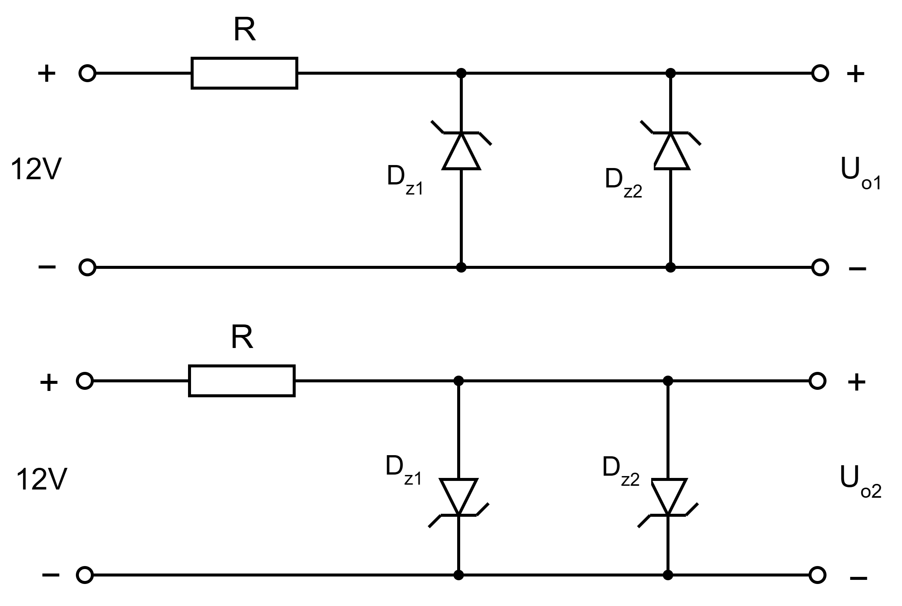
**解：**

1. $U_{o1}$
   此时两管反向并联，两端电压为两管稳压电压的最小值，即 $U_{o1} = 3\text{V}$。
2. $U_{o2}$
   此时两管正向并联，电压为正向导通电压，即 $U_{o2} = 0.7\text{V}$。

---

# 第二章 基本放大电路

## 2.1 放大的概念与性能指标

- **放大的概念**：
  - **特征**：实现功率的放大，同时保持信号的波形不失真。
  - **本质**：能量的控制与转换，由直流电源提供能量。
- **性能指标**：
  - **放大倍数**：
    | 类型 | 定义 | 公式 |
    |:---:|:---:|:---:|
    | 电压放大倍数 $\dot{A_{uu}}$ | 输出电压与输入电压之比 | $\dot{A_{uu}} = \dot{A_u} = \dfrac{\dot{U_o}}{\dot{U_i}}$ |
    | 电流放大倍数 $\dot{A_{ii}}$ | 输出电流与输入电流之比 | $\dot{A_{ii}} = \dot{A_i} = \dfrac{\dot{I_o}}{\dot{I_i}}$ |
    | 互阻放大倍数 $\dot{A_{ui}}$ | 输出电压与输入电流之比 | $\dot{A_{ui}} = \dfrac{\dot{U_o}}{\dot{I_i}}$ |
    | 互导放大倍数 $\dot{A_{iu}}$ | 输出电流与输入电压之比 | $\dot{A_{iu}} = \dfrac{\dot{I_o}}{\dot{U_i}}$ |
  - **输入电阻** $R_i = U_i/I_i$：从输入端看进去的等效电阻。
  - **输出电阻**
    $$
    R_o = \left(\frac{U_{o}'}{U_o}-1\right)R_L
    $$
    - $U_o'$为空载输出电压
    - $U_o$为带$R_L$时的输出电压
  - **通频带** $f_{bw}=f_H-f_L$：放大倍数大于最大值的$\dfrac{1}{\sqrt{2}}$的频率范围。

## 2.2 基本共射放大电路的工作原理

- **电路特点**：输入回路与输出回路**共**用发**射**极

### 2.2.1 电路组成（阻容耦合）

- $T$：NPN晶体管，提供电流放大作用。
- $V_{BB}$：使发射结正偏的直流电压，提供静态工作点。
- $V_{CC}$：使集电结反偏的直流电压，提供放大所需的能量。
- $R_c$：集电极负载电阻，提供输出电压。

### 2.2.2 静态分析（估算法）

- 基极电流 $I_{BQ} = \dfrac{V_{BB}-U_{BEQ}}{R_b}$
- 集电极电流 $I_{CQ} = \beta I_{BQ}$
- 管压降 $U_{CEQ} = V_{CC} - I_{CQ}R_c$

### 2.2.3 波形分析

### 2.2.4 两种实用的共射放大电路

#### 1. 直接耦合共射放大电路

- 静态时：
  $$
  I_{BQ} = \dfrac{V_{CC}-U_{R_{b1}}}{R_{b2}}-\frac{U_{BEQ}}{R_{b1}},\qquad I_{CQ} = \beta I_{BQ},\qquad U_{CEQ} = V_{CC} - I_{CQ}R_c
  $$

#### 2. 阻容耦合共射放大电路

- 静态时：
  $$
  I_{BQ} = I_{Rb} = \dfrac{V_{CC}-U_{BEQ}}{R_b},\qquad I_{CQ} = \beta I_{BQ},\qquad U_{CEQ} = V_{CC} - I_{CQ}R_c
  $$
- 动态时：
  $$
  u_{BE} = u_i + U_{BEQ},\qquad u_{CE} = U_{CEQ} + u_o = U_{CEQ} - \beta R_c i_b
  $$

## 2.3 放大电路的分析方法

### 2.3.1 图解法

注意到，输入回路的输出是三极管的输入，三极管的输出又是输出回路的输入，将他们的ui特性曲线叠加在一起，找到交点即为静态工作点Q。

不过，由于三极管ui特性曲线是非线性的，所以一般是算不出来的。（顶多让你把图画出来）
类似这样

### 2.3.2 等效电路法

遇事不决线性化，三极管太可恶了，直接等效成一个线性电路 ~~(怎么等效的你别管)~~

#### 直流等效模型

#### 共射h参数等效模型

$$
r_{be} = r_{bb'} + \beta \frac{U_T}{I_{CQ}} = r_{bb'} + (1+\beta)\frac{U_T}{I_{EQ}}
$$

其中$r_{bb'}$到时候会给你的。

值得注意的是，等效出的受控电流源的等效阻值可视为**无穷大**，此时，对于输出电阻来说，可以无视这个受控电流源的存在，直接将其开路即可。

#### 利用等效电路分析交流小信号

总的等效电路如下：

于是

$$
\dot{A_u} = \frac{\dot{U_o}}{\dot{U_i}} = - \frac{\beta R_c}{R_b+r_{be}},\qquad R_i = \frac{U_i}{I_i} = R_b + r_{be},\qquad R_o = R_c
$$

放心，考试不会这么简单的。往往在电路中稍作改动，引入一些电阻、电容，此时就需要重新画出等效电路，重新分析了。

务必观看[基本共射放大电路动态分析](https://www.bilibili.com/video/BV1hd4y1M7SC)

## 2.4 放大电路静态工作点的稳定

- **温度对Q点的影响**：$T \uparrow \; \to \; I_{CBO} \uparrow, \beta \uparrow, U_{BE} \downarrow \; \to \; I_C \uparrow$。Q点整体上移，易产生饱和失真。
- **典型电路：分压式偏置电路**：
  - **核心原理**：固定基极电位，引入直流负反馈。
  - **电路条件**：$I_1 \gg I_{BQ}$（$I_1 \approx 10I_{BQ}$），$V_{B} \gg U_{BEQ}$，使 $V_B \approx \dfrac{R_{b2}}{R_{b1}+R_{b2}} V_{CC}$，基本不受温度影响。
  - **反馈过程**：$T \uparrow \to I_C \uparrow \to I_E \uparrow \to V_E \uparrow \to U_{BE} \downarrow (U_{BE} = V_B - V_E) \to I_B \downarrow \to I_C \downarrow$。
  - **射极旁路电容 $C_e$**：若 $R_e$ 上并联了 $C_e$，则 $R_e$ 对交流短路，不损失交流电压放大倍数；若无 $C_e$，则会引入交流负反馈，使 $A_u$ 急剧下降，但提高了输入电阻和通频带。

## 2.5 晶体管单管放大电路的三种接法

由于基本共基放大电路不考，所以不学。

### 2.5.1 基本共集放大电路

- **特点**：集电极C交流接地，输入接B，输出接E。也称**射极跟随器**。
- **性能**：
  - **电压放大倍数**：$\dot{A_u} \approx 1$ 且略小于1，同相。所以无电压放大能力。但有功率放大能力。
  - **输入电阻**：极大，常作多级放大电路的**输入级**（减小信号源负担）。
  - **输出电阻**：极小，带负载能力强，常作**输出级**或缓冲级。

#### 1. 静态分析

$$
I_{BQ} = \frac{V_{BB}-U_{BEQ}}{R_b+(1+\beta)R_e},\qquad I_{EQ} = (1+\beta) I_{BQ},\qquad U_{CEQ} = V_{CC} - I_{EQ}R_e
$$

#### 2. 动态分析

共集放大电路的交流等效电路如下：

$$
\dot{A_u} = \frac{(1+\beta)R_e}{R_b+r_{be}+(1+\beta)R_e},\qquad R_i = R_b + r_{be} + (1+\beta)R_e,\qquad R_o =R_e \parallel \frac{R_b + r_{be}}{1+\beta}
$$

## 2.6 例题选讲

**例1：** 如图所示的放大电路，已知$V_{CC}=12\text{V}$，$R_C=3\text{k}\Omega$，$R_L=6\text{k}\Omega$，$R_b=240\text{k}\Omega$，$\beta=40$，$r_{be}=0.73\text{k}\Omega$，试求：
（1）负载开路和带载时的电压放大倍数；
（2）输入电阻和输出电阻；
（3）若信号源内阻为$600\Omega$，试求$\dot{A}_{us}=\frac{\dot{U}_o}{\dot{U}_s}$。

**解：** 首先画出交流等效电路（**将耦合电容视为短路，直流电源视为短路$V_{CC}=0$**）：

（1）容易得到：

$$
\text{负载开路时}\quad \dot{A_u} = -\frac{\beta R_C}{r_{be}} = -164.38
$$

$$
\text{带载时}\quad \dot{A_u} = -\frac{\beta (R_C \parallel R_L)}{r_{be}} = -109.59
$$

（2）计算输入和输出电阻时，把输入电压置零，输出端开路。容易发现左右两部分相互独立，输入端口等效电阻为$R_b$和$r_{be}$的并联，输出端口等效电阻为$R_C$。因此

$$
R_i = R_b \parallel r_{be} = 0.72\text{k}\Omega
$$

$$
R_o = R_C = 3\text{k}\Omega
$$

（3）画出等效电路

于是容易得到

$$
\dot{A}_{us} = \frac{\dot{U}_o}{\dot{U}_s} = \frac{\dot{U}_o}{\dot{U}_i} \cdot \frac{\dot{U}_i}{\dot{U}_s} = \dot{A_u} \cdot \frac{R_i}{R_i + R_s} = -60.17
$$

**例2：** 分压式偏置电路如图所示，已知$\beta=50,\;U_{BE}=0.7\text{V},\;r_{be}=0.86\text{k}\Omega$，试求：

（1）放大电路的静态值（$I_{BQ}, I_{EQ}, U_{CEQ}, U_{BQ}$）；

（2）电压放大倍数、输入电阻和输出电阻。

**解：** （1）画出静态电路图（耦合电容开路，交流电源$u_i$短路），分析得到

三极管基极电流极小，故 $B$ 极电压近似等于分压电压，故有

$$
U_{BQ} = V_{CC} \cdot \frac{R_{b2}}{R_{b1}+R_{b2}} = 3\text{V}
$$

$$
I_{EQ} = \frac{U_{BQ}-U_{BEQ}}{R_e} = 1.53\text{mA}
$$

$$
I_{BQ} = \frac{I_{EQ}}{1+\beta} = 30\mu \text{A}
$$

$$
U_{CEQ} = V_{CC} - I_{EQ}R_e - I_{CQ}R_c = 6.7\text{V}
$$

（2）画出交流等效电路（耦合电容短路，直流电源短路），分析得到

$$
\dot{A}_u = -\frac{\beta (R_c \parallel R_L)}{r_{be}} = -87.21
$$

$$
R_i = R_{b1} \parallel R_{b2} \parallel r_{be} = 0.77\text{k}\Omega
$$

$$
R_o = R_c = 2\text{k}\Omega
$$

**例3：** 在图示电路中，已知$V_{CC}=12\text{V}, \beta=60, U_{BE}=0.6\text{V}, R_b=200\text{k}\Omega, R_e=3\text{k}\Omega, R_L=3\text{k}\Omega, R_S=50\Omega, r_{be}=1\text{k}\Omega$。试求：

（1）静态工作点Q的参数（$I_{BQ}, I_{EQ}, U_{CEQ}$）；

（2）电压放大倍数 $\dot{A}_{us}=\dfrac{\dot{U}_o}{\dot{U}_s}$、输入电阻和输出电阻；

留作练习，请读者自行完成。

答案：
（1）$I_{BQ} = 30\mu \text{A}, I_{EQ} = 1.83\text{mA}, U_{CEQ} = 6.51\text{V}$
（2）$\dot{A}_u = 0.989, R_i = 63.3\text{k}\Omega, R_o = 16.21\Omega$

### 小结

放大电路的一般求法：

直流等效求静态工作点Q

- 交流电源置零，耦合电容视为断路
- 若 $U_{BE}$ 未直接给出（一般不会不给）
  - 硅管：$U_{BE} \approx 0.7\text{V}$
  - 锗管：$U_{BE} \approx 0.3\text{V}$

$$
\begin{cases}
V_{CC}\\
U_{BE}\\
\beta
\end{cases}\implies Q\\
$$

交流等效求放大倍数、输入输出电阻

- 直流电源视为接地，耦合电容视为短路
- 三极管等效电流源电流方向与流经 $r_{be}$ 的电流方向相同

做交流等效之前并不需要知道静态工作点Q的参数，一样能算

---

# 第三章 集成运算放大电路

## 3.1 多级放大电路

### 3.1.1 耦合方式

- **直接耦合**：将前一级输出直接连接到下一级输入
  - 可放大直流，易集成，但存在**零点漂移**（温漂），各级Q点相互影响。
  - [两级直接耦合放大电路分析](https://www.bilibili.com/video/BV1wW4y1E7fA)
- **阻容耦合**：将前一级输出通过耦合电容连接到下一级输入
  - 各级Q点独立，低频特性差，不易集成。
  - [两级阻容耦合放大电路分析](https://www.bilibili.com/video/BV1Ce411V7td)
- **变压器耦合**：将前一级输出通过变压器连接到下一级输入
  - 可实现阻抗变换，体积大，低频差。
  - 一般看作理想变压器，狠狠等效电阻
- **光电耦合**：将前一级输出转换为光信号传输，再转换回电信号连接到下一级输入
  - 抗干扰强，用于隔离。

### 3.1.2 动态分析

- 总电压放大倍数 $\displaystyle\dot{A}_u = \prod_{k=1}^N \dot{A}_{uk}$
  - 每一级放大倍数均是以后面所有电路作为其负载计算的。
- 电压 $\dot{U}_{o1} = \dot{U}_{i2},\; \dot{U}_{o2} = \dot{U}_{i3},\; \ldots\;,\; \dot{U}_{oN-1} = \dot{U}_{iN}$
- 输入电阻 $R_i = R_{i1}$
- 输出电阻 $R_o = R_{oN}$

## 3.2 差分放大电路

### 3.2.1 基本概念

- **差模信号** ：对称电路中两输入端的电压差 $u_{I\mathrm{d}} = u_{I1} - u_{I2}$（有用信号）
- **共模信号** ：对称电路中两输入端的电压平均值 $u_{I\mathrm{c}} = \frac{u_{I1} + u_{I2}}{2}$（干扰信号）
- **差模放大倍数** $A_\mathrm{d} = \dfrac{\Delta u_{o\mathrm{d}}}{\Delta u_{I\mathrm{d}}}$
- **共模放大倍数** $A_\mathrm{c} = \dfrac{\Delta u_{o\mathrm{c}}}{\Delta u_{I\mathrm{c}}}$
- **共模抑制比** $K_{CMR} = \left|\dfrac{A_\mathrm{d}}{A_\mathrm{c}}\right|$（越大性能越好）
  - 参数理想对称时，$A_\mathrm{c}=0, A_\mathrm{d}=2, K_{CMR}=\infty$

### 3.2.2 长尾式差分放大电路（双端输入双端输出）

理想情况下，左右两部分完全对称

#### 1. 静态分析

此时输入端电压为0，两个三极管完全对称，于是

$$
I_{R_e} = 2I_{EQ}, \qquad I_{EQ} = \frac{V_{EE}-U_{BEQ}}{\frac{R_b}{1+\beta} + 2R_e}, \qquad I_{BQ} = \frac{I_{EQ}}{1+\beta}
$$

#### 2. 对共模信号的抑制作用

$$
\Delta u_{Ic} = \Delta i_B[R_b + r_{be} + 2(\beta + 1)R_e], \qquad \Delta u_{O1} = \Delta u_{O2} = -\beta \Delta i_B R_c
$$

$$
A_{c1} = A_{c2} = -\frac{\beta R_c}{R_b + r_{be} + 2(\beta + 1)R_e}
$$

参数理想对称时，$\Delta u_{Oc}=0,\;A_c=0$，共模信号完全被抑制。

#### 3. 对差模信号的放大作用

在$\Delta u_{O1}, \Delta u_{O2}$处插入电阻$\frac{R_L}{2}$，得到

$$
\Delta u_{Od} = -2\beta \Delta i_B (R_c \parallel \frac{R_L}{2}), \qquad \Delta u_{Id} = 2\Delta i_B (R_b + r_{be})
$$

于是

$$
A_d = -\frac{\beta (R_c \parallel \frac{R_L}{2})}{R_b + r_{be}}, \qquad R_i = 2(R_b + r_{be}), \qquad R_o = 2R_c
$$

### 3.2.3 输入输出方式

- 输入电阻均为$R_i = 2(R_b + r_{be})$
- 单端输入分解为共模+差模双端输入
- 其他参数与输出接法有关
  - 单端输出：
    $$
    A_d = -\frac{\beta (R_c \parallel R_L)}{2(R_b + r_{be})},\qquad A_c = -\frac{\beta (R_c \parallel R_L)}{R_b + r_{be} + 2(\beta + 1)R_e},\qquad R_o = R_c
    $$
  - 双端输出：
    $$
    A_d = -\frac{\beta (R_c \parallel \frac{R_L}{2})}{R_b + r_{be}},\qquad A_c = 0,\qquad R_o = 2R_c
    $$

## 3.3 练习

**例1：** 如图所示的两级放大电路，已知$R_1=15\text{k}\Omega, R_2=R_3=5\text{k}\Omega, R_4=2.3\text{k}\Omega, R_5=100\text{k}\Omega, R_6=R_L=5\text{k}\Omega;V_{CC}=12\text{V}, \beta_1 = \beta_2 = \beta = 150, r_{be1} = 4\text{k}\Omega, r_{be2} = 2.2\text{k}\Omega, U_{BEQ1} = U_{BEQ2} = 0.7\text{V}$，试求：

（1）静态工作点Q的参数（$I_{BQ1}, I_{EQ1}, U_{CEQ1}, I_{BQ2}, I_{EQ2}, U_{CEQ2}$）；

（2）电压放大倍数、输入电阻和输出电阻。
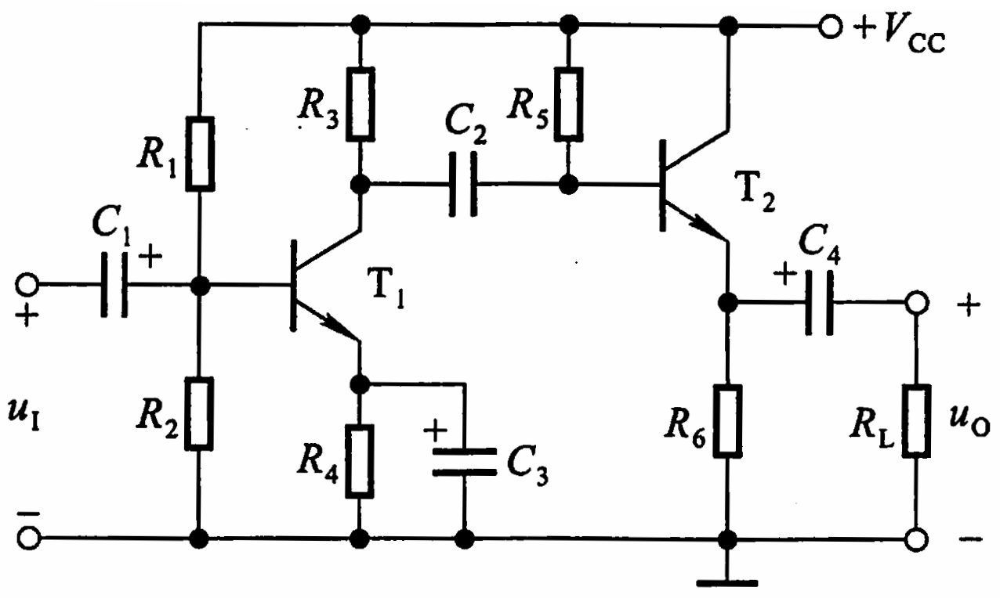
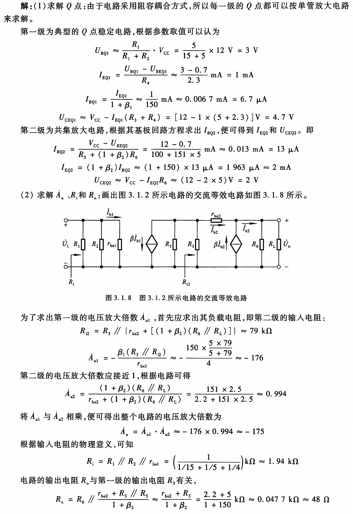

**例2：** 如图所示电路参数理想对称，$\beta = 50,\;r_{bb'} = 100\Omega,\;U_{BEQ} \approx 0.7\text{V}$。试计算 $R_W$ 滑动端在中点时 $T_1$管和 $T_2$管的发射极静态电流 $I_{EQ}$，以及动态参数 $A_\mathrm{d}$ 和 $R_i$。
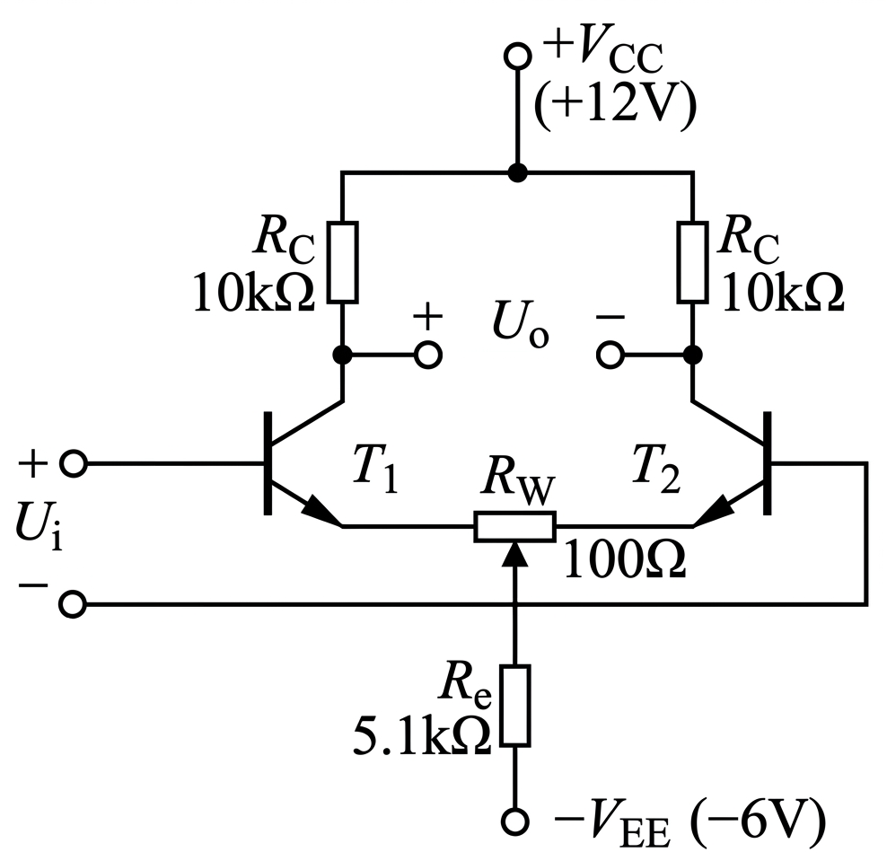

**解：** 先求静态工作点

$$
U_{BEQ}+I_{EQ}\frac{R_W}{2}+2I_{EQ}R_e = V_{EE}\implies I_{EQ} = \frac{V_{EE}-U_{BEQ}}{\frac{R_W}{2}+2R_e} = 0.517\text{~mA}
$$

然后求动态参数

画出交流等效电路，由于对称性，$R_e$ 上无电流，$U_o^+ = -U_o^-$，我们只画一半等效电路
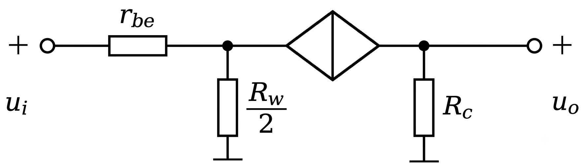

$$
u_i=i_br_{be}+(1+\beta)i_b\frac{R_W}{2},\qquad u_o=-\beta i_bR_c\\[1em]
r_{be}=r_{bb'}+\beta\frac{U_T}{I_{EQ}}=100+50\cdot\frac{26\text{mV}}{0.517\text{mA}}=2.61\text{k}\Omega
$$

于是

$$
A_\mathrm{d} = \frac{u_o}{u_i} = -\frac{\beta R_c}{r_{be}+(1+\beta)\frac{R_W}{2}} = -96.90\\[1em]
R_i = 2\frac{u_i}{i_b} = 2\left[r_{be}+(1+\beta)\frac{R_W}{2}\right] = 10.32\text{k}\Omega
$$

---

# 第五章 放大电路中的反馈

## 5.1 基本概念与判断

- **反馈**：将放大电路输出量（电压或电流）的一部分或全部，通过一定方式引回到输入回路，影响净输入量，称为反馈。
- **极性（瞬时极性法）**：
  - **正反馈**：反馈增强净输入 → 常用于振荡器。
  - **负反馈**：反馈削弱净输入 → 改善放大性能。
- **交直流反馈**：反馈通路存在于直流通路 → 直流反馈（稳定Q点）；存在于交流通路 → 交流反馈（改善动态）。

|     组态     | 反馈信号 | 净输入信号 | 稳定对象 |           $A_f = X_o/X_i$           |   典型电路    |
| :----------: | :------: | :--------: | :------: | :---------------------------------: | :-----------: |
| **电压串联** |   电压   |   电压差   | 输出电压 |          $A_{uuf}=U_o/U_i$          | 同相比例运放  |
| **电流串联** |   电压   |   电压差   | 输出电流 | $A_{iuf}=I_o/U_i$（$U_o$对应$I_o$） | 带$R_e$的共射 |
| **电压并联** |   电流   |   电流差   | 输出电压 |      $A_{uif}=U_o/I_i$（互阻）      | 反相比例运放  |
| **电流并联** |   电流   |   电流差   | 输出电流 |    $A_{iif}=I_o/I_i$（电流增益）    | 共射+反馈电阻 |

- **四种组态判断**：
  1. **电压/电流**：输出端短路（$u_o=0$）时
     - 反馈消失 → **电压反馈**
     - 仍存在 → **电流反馈**。
  2. **串联/并联**：
     - 反馈量与输入量在输入端**串联**（电压求和）→ **串联反馈**
     - 反馈量与输入量在输入端**并联**（电流求和）→ **并联反馈**

## 5.2 负反馈放大电路的方块图及一般表达式

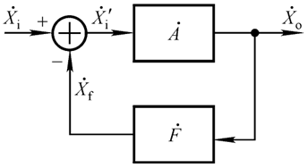

- $\dot{X}_i$：输入量
- $\dot{X}_o$：输出量
- $\dot{X}_f$：反馈量
- $\dot{F}=\dfrac{\dot{X}_f}{\dot{X}_o}$：反馈系数
- $\dot{A}=\dfrac{\dot{X}_o}{\dot{X}'_i}$：开环放大倍数
- $\dot{A}_f=\dfrac{\dot{X}_o}{\dot{X}_i}=\dfrac{\dot{A}}{1 + \dot{A}\dot{F}}$：闭环放大倍数

其中 $\dot{A}\dot{F}$ 称为**环路放大倍数**。

- 当 $1+\dot{A}\dot{F} \gg 1$ 时，称为**深度负反馈**，此时 $\dot{A}_f \approx \dfrac{1}{\dot{F}}$。
  - 多数负反馈电路都是深度负反馈
- 对于负反馈，$1+\dot{A}\dot{F} > 1$，$|\dot{A}_f| < |\dot{A}|$。
- 对于正反馈，$1+\dot{A}\dot{F} < 1$，当 $1+\dot{A}\dot{F}=0$ 时产生自激振荡。

## 5.3 深度负反馈放大电路放大倍数的分析

### 5.3.1 深度负反馈的实质

当 $1+\dot{A}\dot{F} \gg 1$ 时，$\dot{A}_f \approx \dfrac{1}{\dot{F}}$，且
$$\dot{X}_{id} = \dfrac{\dot{X}_i}{1+\dot{A}\dot{F}} \approx 0$$
即**净输入量近似为零**。对于运放：$\dot{u}_P \approx \dot{u}_N$（虚短），$\dot{i}_P \approx \dot{i}_N \approx 0$（虚断）。

### 5.3.2 四种组态反馈系数 $F$ 及 $A_f$ 估算

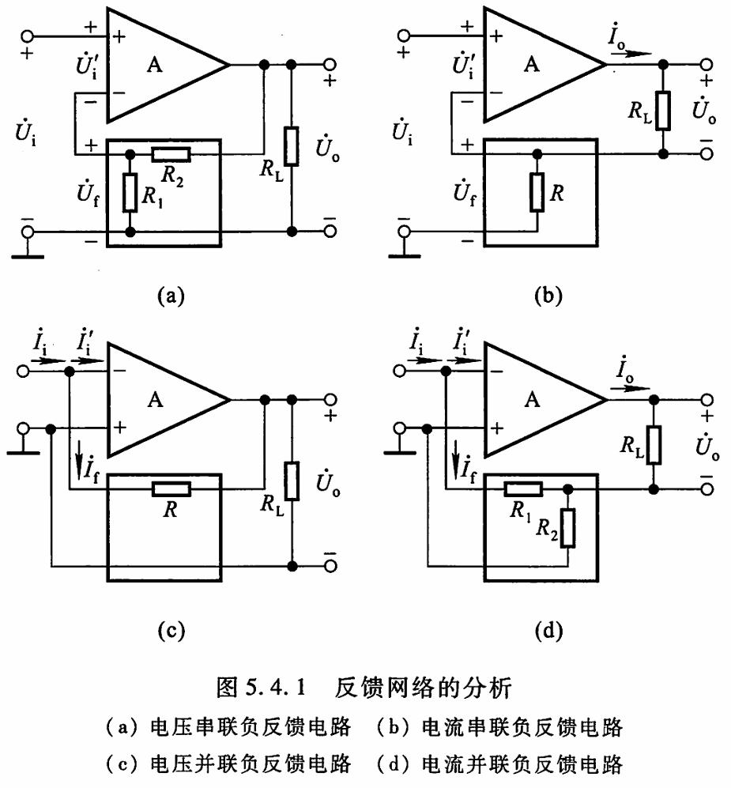

设反馈网络为纯电阻网络。

|     组态     |              反馈系数 $\dot{F}$               | $A_f \approx 1/\dot{F}$                                                  |            $A_{uf}$            |
| :----------: | :-------------------------------------------: | :----------------------------------------------------------------------- | :----------------------------: |
| **电压串联** | $\dot{F}_{uu} = \dfrac{\dot{U}_f}{\dot{U}_o}$ | $A_{uuf} = \dfrac{1}{\dot{F}_{uu}}$                                      |   $\dfrac{1}{\dot{F}_{uu}}$    |
| **电流串联** | $\dot{F}_{ui} = \dfrac{\dot{U}_f}{\dot{I}_o}$ | $A_{iuf} = \dfrac{\dot{I}_o}{\dot{U}_i} \approx \dfrac{1}{\dot{F}_{ui}}$ |  $\dfrac{R_L}{\dot{F}_{ui}}$   |
| **电压并联** | $\dot{F}_{iu} = \dfrac{\dot{I}_f}{\dot{U}_o}$ | $A_{uif} = \dfrac{\dot{U}_o}{\dot{I}_i} \approx \dfrac{1}{\dot{F}_{iu}}$ |  $\dfrac{1}{\dot{F}_{iu}R_S}$  |
| **电流并联** | $\dot{F}_{ii} = \dfrac{\dot{I}_f}{\dot{I}_o}$ | $A_{iif} = \dfrac{\dot{I}_o}{\dot{I}_i} \approx \dfrac{1}{\dot{F}_{ii}}$ | $\dfrac{R_L}{\dot{F}_{ii}R_S}$ |

### 5.3.3 理想运放情况下的估算

- **理想运放参数**：$\dot{A}_{od} \to \infty$，$\dot{r}_{id} \to \infty$，$\dot{r}_o \to 0$
- **深度负反馈时**：$\dot{u}_P \approx \dot{u}_N$（虚短），$\dot{i}_P = \dot{i}_N = 0$（虚断）
- 可直接用“虚短、虚断”列方程求解 $\dot{A}_f$，无需单独求 $\dot{F}$。

## 5.4 例题

**例1：** 电路如图所示
（1）判断电路中引人了哪种组态的交流负反馈；
（2）求出在深度负反馈条件下的$\dot{A}_f$和$\dot{A}_{uf}$。
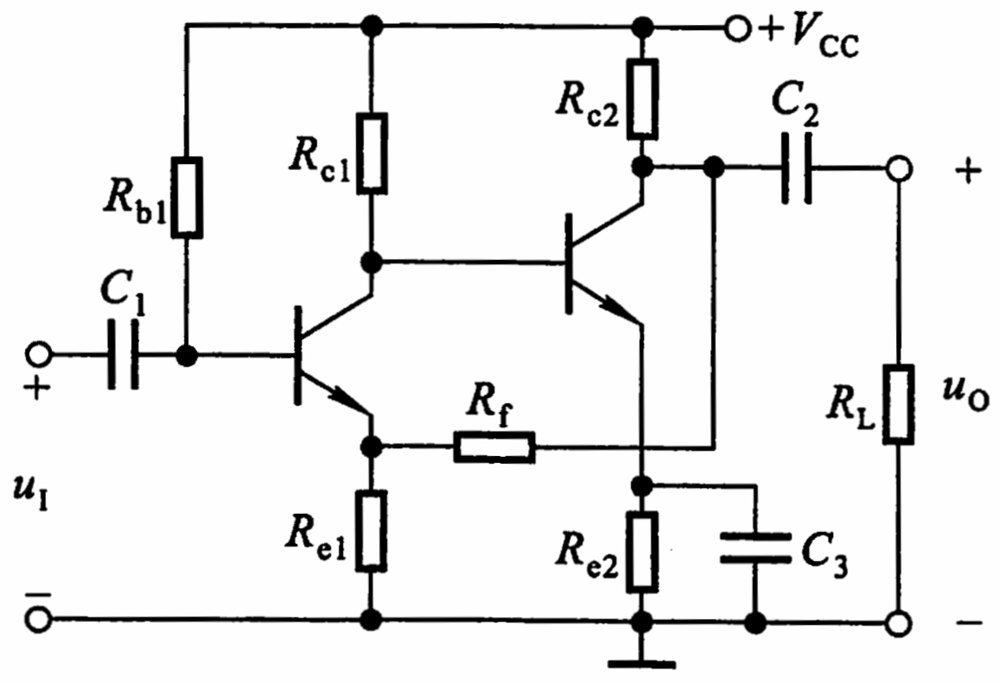
**解：**（1）电压串联负反馈
（2） $\dot{U}_o$ 与 $\dot{U}_i$ 同向，故 $\dot{A}_f$ 和 $\dot{A}_{uf}$ 均为正值。

$$
\dot{A}_f = \dot{A}_{uf} \approx \frac{1}{\dot{F}_{uu}} = 1 + \frac{R_f}{R_{e1}}
$$

**例2：** 电路如图所示，已知$R_s=R_{e1}=R_{e2}=1\text{k}\Omega, R_{c1}=R_{c2}=R_L=10\text{k}\Omega$
（1）判断电路中引人了哪种组态的交流负反馈；
（2）在深度负反馈条件下，若要 $T_2$ 管集电极动态电流与输入电流的比值 $|\dot{A}_i|\approx 10$，则反馈电阻 $R_f$ 的阻值约取多少？此时 $\dot{A}_{usf}=\dot{U}_o/\dot{U}_s \approx\;?$
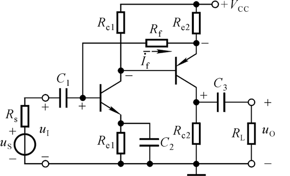
**解：**（1）电流并联负反馈
（2）$\dot{U}_o$ 与 $\dot{U}_i$ 同向，故 $\dot{A}_f$ 和 $\dot{A}_{uf}$ 均为正值。
反馈电流

$$
\dot{I}_f = \frac{R_{e2}}{R_{e2} + R_f}\cdot \dot{I}_o
$$

因此反馈系数

$$
\dot{F}_{ii} = \frac{\dot{I}_f}{\dot{I}_o} = \frac{R_{e2}}{R_{e2} + R_f}
$$

放大倍数

$$
\dot{A}_{iif} = \frac{\dot{I}_o}{\dot{I}_i} \approx \frac{1}{\dot{F}_{ii}} = 1 + \frac{R_f}{R_{e2}} = 10
$$

带入数值，得到 $R_f = 9\text{k}\Omega$。此时

$$
\dot{A}_{usf} = \frac{\dot{U}_o}{\dot{U}_s} = \frac{\dot{I}_o R_L'}{\dot{I}_i R_s} \approx 10 \cdot \frac{R_{c2} \parallel R_L}{R_s} = 50
$$

**例3：** $T_1$、$T_2$ 的参数 $\beta_1 = \beta_2 = 100, r_{be1} =1\text{~k}\Omega, r_{be2} = 1.3\text{~k}\Omega$，输出负载 $R_L = 10\text{~k}\Omega$，求

（1）$R_f$开路时，$R_i,\;R_o,\;\dot{A}_u$；
（2）交流负反馈类型与深度负反馈下的 $R_{if},\;R_{of},\;\dot{A}_{usf}$
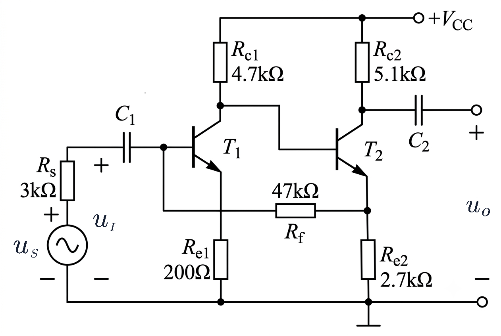

> [!danger] 本题答案由AI生成

**解：** （1）画出等效电路如下
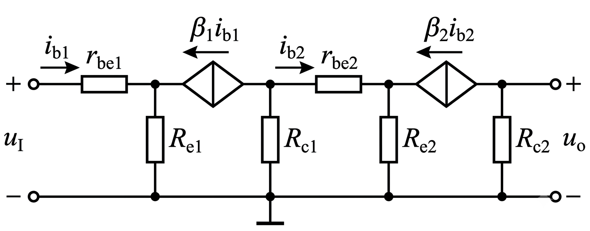

$$
u_{{\tiny I}} = i_{b1}r_{be1} + (1+\beta_1)i_{b1}R_{e1} \implies R_i = r_{be1} + (1+\beta_1)R_{e1} = 21.2\text{~k}\Omega\\[0.5em]
R_o \approx R_{c2} = 10\text{~k}\Omega
$$

接下来计算 $\dot{A}_{u1}, \dot{A}_{u2}$，首先，第一级的输出电压为 $R_{c1}$ 两端的电压，那么

$$
\dot{A}_{u1} = \frac{u_{o1}}{u_i} = -\frac{\beta[R_{c1}\parallel (r_{be2} + (1+\beta_2)R_{e2})]}{R_i} = -21.79\\[0.5em]
\dot{A}_{u2} = \frac{u_o}{u_{o1}} = -\frac{\beta_2 (R_{c2} \parallel R_L)}{r_{be2} + (1+\beta_2)R_{e2}} = -1.23
$$

于是

$$
\dot{A}_u = \dot{A}_{u1} \cdot \dot{A}_{u2} = 26.87
$$

（2）容易看出电路为电流并联负反馈

反馈系数 $F_{ii} = \dfrac{R_{e2}}{R_{e2}+R_f}$，深度负反馈下

$$
\dot{A}_{usf} = \frac{\dot{I}_o (R_{c2} \parallel R_L)}{\dot{I}_i R_S} \approx \frac{1}{F_{ii}} \cdot \frac{R_{c2} \parallel R_L}{R_S} = 20.72
$$

|      串联       |    并联    |    电压    |      电流       |
| :-------------: | :--------: | :--------: | :-------------: |
| $R_{if}=\infty$ | $R_{if}=0$ | $R_{of}=0$ | $R_{of}=\infty$ |

本题为电流并联负反馈，深度负反馈下$R_{if} \approx 0, R_{of} \approx \infty$。

---

# 第六章 信号的运算和处理

## 6.1 基本运算电路

- **条件**：深度负反馈，理想运放满足“虚短”($u_N=u_P$)和“虚断”($i_N=i_P=0$)。

### 6.1.1 比例运算电路

#### 1. 反相比例运算电路

1. 基本反相比例运算电路
   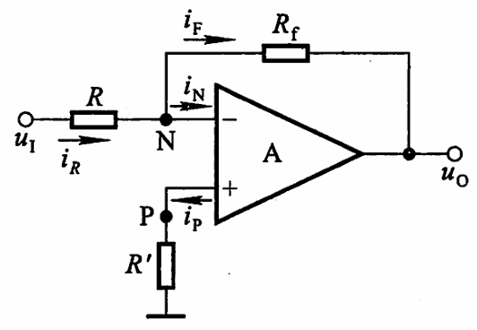

$$
u_O = -\frac{R_f}{R}u_I,\qquad R_i = R,\qquad R_o = 0
$$

2. T型反相比例运算电路
   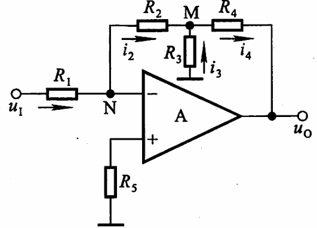
   $$
   u_O = -\frac{R_2+R_4}{R_1}(1+\frac{R_2 \parallel R_4}{R_3})U_I,\qquad R_i = R_1,\qquad R_o = 0
   $$

#### 2. 同相比例运算电路

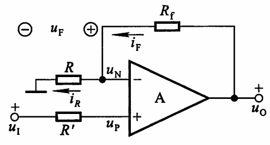

$$
u_O = (1+\frac{R_f}{R})u_I,\qquad R_i = +\infty,\qquad R_o = 0
$$

### 6.1.2 加减运算电路

#### 1. 求和运算电路

1. 反相求和运算电路
   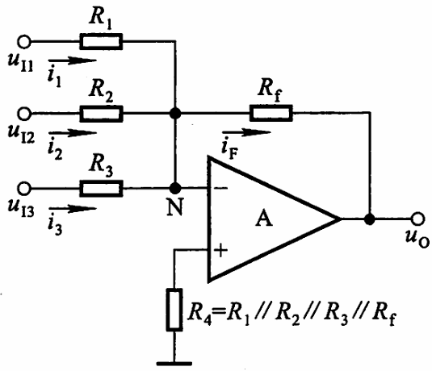

   $$
   u_O = -R_f\left(\frac{u_{I1}}{R_1}+\frac{u_{I2}}{R_2}+\frac{u_{I3}}{R_3}\right)
   $$

2. 同相求和运算电路
   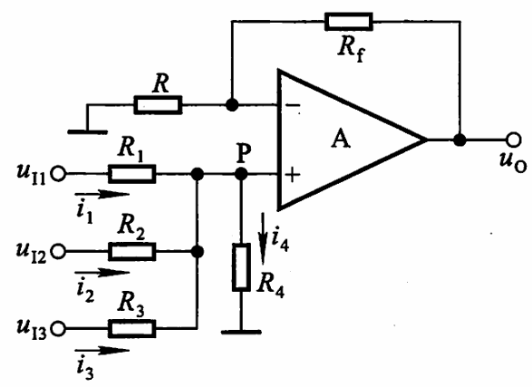
   记$R_P = R_1 \parallel R_2 \parallel R_3 \parallel R_4,\quad R_N = R \parallel R_f$，则
   $$
   u_P = R_P\left(\frac{u_{I1}}{R_1}+\frac{u_{I2}}{R_2}+\frac{u_{I3}}{R_3}\right),\qquad u_O = \frac{R_f}{R_N}u_P
   $$
   若 $R_P = R_N$，则 $u_O = R_f\left(\frac{u_{I1}}{R_1}+\frac{u_{I2}}{R_2}+\frac{u_{I3}}{R_3}\right)$。

#### 2. 加减运算电路

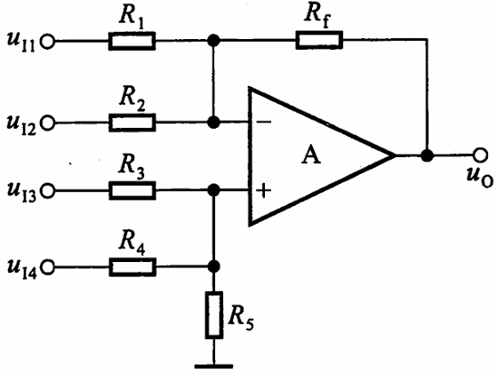

当 $R_1 \parallel R_2 \parallel R_f = R_3 \parallel R_4 \parallel R_5$ 时

$$
u_O = R_f\left(\frac{u_{I3}}{R_3}+\frac{u_{I4}}{R_4}-\frac{u_{I1}}{R_1}-\frac{u_{I2}}{R_2}\right)
$$

### 6.1.3 积分运算电路和微分运算电路

#### 1. 积分运算电路

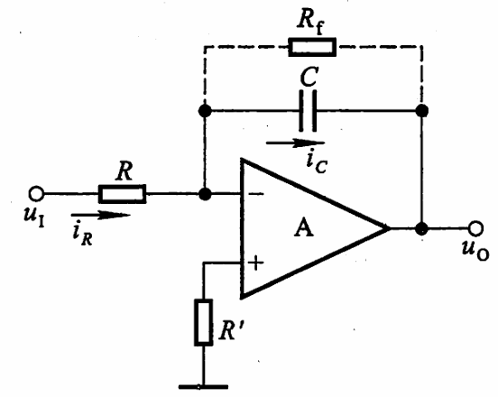

$$
u_O = -\frac{1}{RC}\int u_I dt
$$

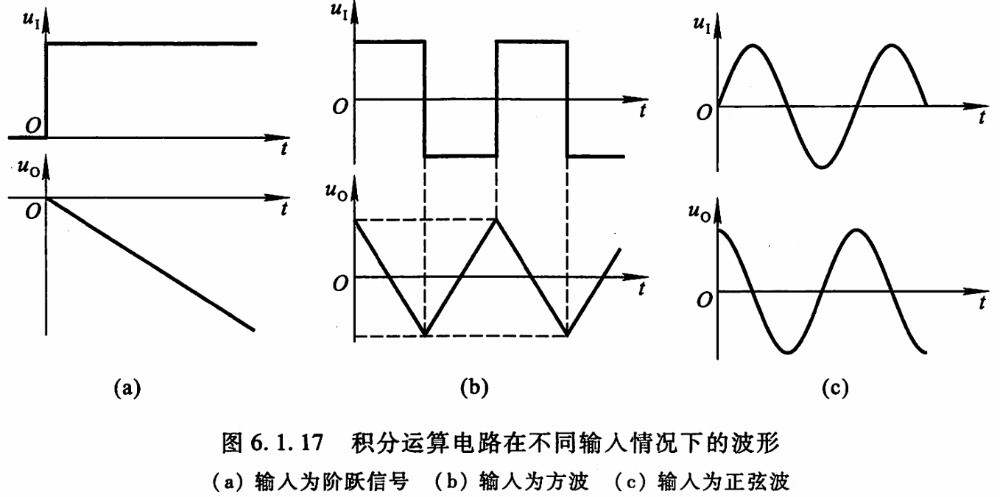
可见，利用积分运算电路可以实现方波-三角波的波形变换和正弦-余弦的移相功能。

#### 2. 微分运算电路

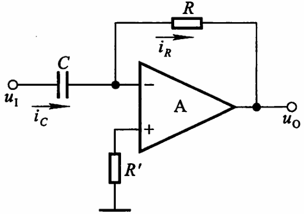

$$
u_O = -RC\frac{du_I}{dt}
$$

## 6.2 例题

**例1：** 电路如图所示，已知$R_2 \gg R_4, R_1 = R_2$，试求：
（1）$u_O$与$u_I$的比例系数；（2）若$R_4$开路，则$u_O$与$u_I$的比例系数
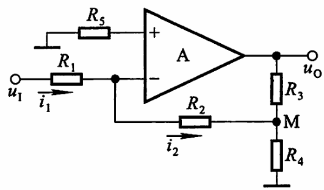
**解：** 不难发现电路为T型反相比例运算电路
（1）由于虚短、虚断

$$
i_2=i_1=\frac{u_I}{R_1}
$$

$M$点电位为

$$
u_M = -i_2R_2 = -u_I
$$

由于$R_2 \gg R_4$，可以认为

$$
u_O \approx \left(1+\frac{R_3}{R_4}\right)u_M = -\left(1+\frac{R_3}{R_4}\right)u_I
$$

（2）若$R_4$开路，则电路为基本反相比例运算电路，于是

$$
u_O = -\frac{R_2+R_3}{R_1}u_I = -\left(1+\frac{R_3}{R_1}\right)u_I
$$

**例2：** 已知电路如图所示，试求输出电压 $u_O$
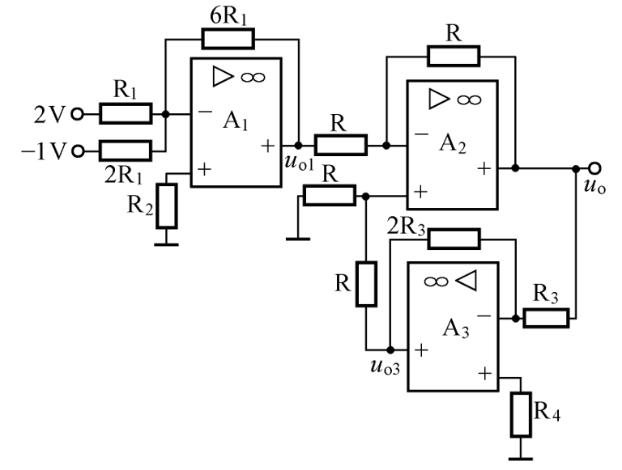
**解：** 图中为三个加减运算电路，于是

$$
u_{O1}=6R_1\left(-\frac{2\text{V}}{R_1}-\frac{-1\text{V}}{2R_1}\right)=-9\text{V}
$$

$$
u_{O}=R\left(-\frac{u_{O1}}{R}+\frac{u_{O3}}{R}\right)=u_{O3}-u_{O1}
$$

$$
u_{O3}=2R_3\left(-\frac{u_O}{R_3}\right)=-2u_O
$$

于是

$$
u_O=3\text{V}
$$
