# 第一章 电路元件与电路基本定律

## 1.1 电压、电流与电功率

### 一、电流与电压

**1. 电流**

- **定义**：单位时间内通过导体横截面的电荷量，$i = \frac{dq}{dt}$
- **参考方向**：在未知电流流向的情况下，任意假设的电流方向。
  - 当 $i > 0$ 时，真实方向与参考方向一致；
  - 当 $i < 0$ 时，真实方向与参考方向相反。
    :::warning
    参考方向一经标定，不能再随意改变。
    :::
    **2. 电压与电位**
- **电压**：两点之间的电位差，单位伏特（V）
- **电位**：某点相对于参考点的电压。若选c点为参考点，则a点电位为 $U_{ac}$。
- **注意事项**：
  - 分析电路前必须选定电压和电流的参考方向
  - 参考方向一经选定，必须在图中标注
  - 参考方向不同时，表达式相差一负号，但实际方向不变

**3. 电动势**

- 在电源内部，把单位正电荷从低电位移动到高电位，局外电场力所作的功：$e = \frac{dw}{dq}$
- 电动势的实际方向：从低电位指向高电位，与电压的实际方向相反。
- 电压、电位、电动势具有相同的单位：V（伏特）

### 二、参考方向体系

**关联参考方向**：电流从电压的正极性端流入，负极性端流出。

- 吸收功率：$p = ui$

**非关联参考方向**：电流从电压的负极性端流入，正极性端流出。

- 吸收功率：$p = -ui$

### 三、电功率与电能

**1. 电功率**

- 定义：衡量电能转换或传输速率的物理量，$p = \frac{dw}{dt}$
- 计算：
  - 关联参考方向：$p = ui$
    - p > 0 表示吸收功率
    - p < 0 表示发出功率
  - 非关联参考方向：$p = -ui$
    - p > 0 表示发出功率
    - p < 0 表示吸收功率

**2. 电能**
$$w(t) = \int_{t_0}^{t} p(\xi) d\xi = \int_{t_0}^{t} u(\xi)i(\xi) d\xi \quad \text{单位：焦耳（J）}$$

恒功率时：$W = P \times \Delta t = ui \times \Delta t$

- 电能计量单位：kWh（度），1度电 = 1kWh = 3,600,000J
- 电气设备额定功率 = 额定电压 × 额定电流

## 1.2 电阻元件

**1. 线性电阻的欧姆定律**

- 关联参考方向：$u = Ri$ 或 $i = Gu$（G = 1/R 为电导）
- 电阻单位：欧姆（Ω），电导单位：西门子（S）

**2. 电阻的功率**
$$p = ui = i^2R = \frac{u^2}{R} \geq 0$$

- 电阻总是吸收功率，为无源元件

**3. 端口的概念**

- 二端元件有两个端子，形成一个端口
- 端口电压和端口电流构成端口特性

## 1.3 电容元件

**1. 电容的特性方程**

- 库伏特性：$q = Cu$
- 伏安特性（关联参考方向）：$i = \frac{dq}{dt} = C\frac{du}{dt}$
- 积分形式：$u(t) = u(t_0) + \frac{1}{C}\int_{t_0}^{t} i(t) dt$

**2. 电容的特点**

- 电容为"记忆元件"：任一时刻的电容电压取决于电流全部过去的历史状况
- 电容电压不能跃变
- 对于实际电容，直流稳态时相当于开路

**3. 电容的储能**
$$w_C(t) = \frac{1}{2}Cu^2(t)$$

## 1.4 电感元件

**1. 电感的特性方程**

- 韦安特性：$\psi = Li$
- 伏安特性（关联参考方向）：$u = \frac{d\psi}{dt} = L\frac{di}{dt}$
- 积分形式：$i(t) = i(t_0) + \frac{1}{L}\int_{t_0}^{t} u(t) dt$

**2. 电感的特点**

- 电感为"记忆元件"：任一时刻的电感电流取决于电压全部过去的历史状况
- 电感电流不能跃变

**3. 电感的储能**
$$w_L(t) = \frac{1}{2}Li^2(t)$$

## 1.5 独立电源

### 一、电压源

**理想电压源特性**：

- 能够提供确定的源电压 $u_s$，与流过电压源的电流无关
- 电压源的电流由外电路决定
- 大小为0V的电压源，对外等效为短路

**电压源的功率**：$P = u_s i$

- 当 $P > 0$，电压源实际发出功率，处在供电状态——电源
- 当 $P < 0$，电压源实际吸收功率，处在用电状态——负载

**实际电压源**：有最大工作电流限制

### 二、电流源

**理想电流源特性**：

- 能够提供确定的源电流 $i_s$，与电流源两端的电压无关
- 电流源的电压由外电路决定
- 源电流置零时，电流源相当于断路

**电流源的功率**：$P = u i_s$

- 当 $P > 0$，电流源工作在 $i-u$ 平面的一、三象限时，实际发出功率
- 当 $P < 0$，电流源工作在 $i-u$ 平面的二、四象限时，实际吸收功率

### 三、独立电源总结

1. 电压源能提供确定的源电压，电流源能提供确定的源电流，故称独立电源
2. 电压源提供的电流和功率由外电路决定；电流源提供的电压和功率由外电路决定
3. 电压源的源电压置零时相当于短路；电流源的源电流置零时相当于断路
4. 电压源和电流源作为元件模型，能无限地对外提供电能，属于有源元件
5. 电压源和电流源在电路中能够激发电压和电流，称为激励；被激发的电压和电流称为响应

## 1.6 受控电源

受控电源的电压或电流受电路中其他支路电压或电流的控制，分为四种类型：

- 电压控制电压源（VCVS）
  - $u_s=\alpha u_c$
- 电压控制电流源（VCCS）
  - $i_s=gu_c$
- 电流控制电压源（CCVS）
  - $u_s=ri_c$
- 电流控制电流源（CCCS）
  - $i_s=\beta i_c$

## 1.7 基尔霍夫定律

### 一、电路结构术语

- **支路**：每个二端元件称为一条支路
- **节点**：若干支路的联接点
- **路径**：在两节点之间，由$m$条不同的支路和$m-1$个不同的节点依次联接成的通路
- **回路**：闭合的路径
- **网孔**：平面电路中内部或外部不包含任何支路的回路

### 二、基尔霍夫电流定律（KCL）

**基本表述（针对节点）**：
$$\sum i_k = 0$$
在集中参数电路中，任一时刻流出（或流入）任一节点的支路电流代数和等于零。

- 规定：流出节点时 $i_k$ 前面取 "+" 号；流入节点时取 "-" 号

**推论**：任一时刻，流出任一节点电流的代数和等于流入该节点电流的代数和
$$\sum i_{\text{流入}} = \sum i_{\text{流出}}$$

**广义表述（针对闭合边界）**：
任一时刻流出（或流入）任一闭合边界S的支路电流代数和等于零。

**方程的独立性**：
在含有n个节点的电路中，任意n-1个节点的KCL方程是一组独立方程，这些节点称为独立节点。

**应用于元件**：

- 二端元件流入一个端子的电流等于流出另一个端子的电流，二端元件只有一个电流
- 任一时刻，流入或流出一个多端元件的端子电流之和为零

### 三、基尔霍夫电压定律（KVL）

**基本表述**：
$$\sum u_k = 0$$
在集中参数电路中，任一时刻沿任一回路各支路电压的代数和等于零。

- 规定：$u_k$ 参考方向与回路方向相同时取 "+" 号，否则取 "-" 号

**推论**：
沿任一回路，各支路电压降的代数和等于电压升的代数和。

**应用推论**：在集中参数电路中，任意两点之间的电压具有确定值，与计算路径无关。

**方程的独立性**：
平面电路网孔上的KVL方程是一组独立方程。每个网孔的KVL方程不能表示成其余网孔KVL方程的代数和或其它线性组合。

---

# 第二章 线性直流电路

## 2.1 电阻网络的等效

### 一、等效的概念

等效：被化简的电阻网络 $N_1$ 与等效电阻具有相同的 $u-i$ 关系（即端口方程），从而用等效电阻 $R_{eq}$ 代替电阻网络 $N_1$ 之后，不改变其余部分的电压和电流。

:::note
等效只是对外电路等效
:::

### 二、电阻的串联

**等效电阻**：$R_{eq} = R_1 + R_2 + \cdots + R_n$

**分压公式**：$u_k = \frac{R_k}{R_{eq}} u$

**功率分配**：$p_k = i^2 R_k$，总功率 $p = i^2 R_{eq}$

### 三、电阻的并联

**等效电导**：$G_{eq} = G_1 + G_2 + \cdots + G_n$

等效电阻：$\frac{1}{R_{eq}} = \frac{1}{R_1} + \frac{1}{R_2} + \cdots + \frac{1}{R_n}$

**两个电阻并联**：$R_{eq} = \frac{R_1 R_2}{R_1 + R_2}$

**分流公式**：

- 两个电阻并联：$i_1 = \frac{R_2}{R_1 + R_2} i$，$i_2 = \frac{R_1}{R_1 + R_2} i$

### 四、星形-三角形变换（Y-Δ变换）

**Y→Δ 等效变换公式**：
$$R_{12} = \frac{R_1R_2 + R_2R_3 + R_3R_1}{R_3}$$
$$R_{23} = \frac{R_1R_2 + R_2R_3 + R_3R_1}{R_1}$$
$$R_{31} = \frac{R_1R_2 + R_2R_3 + R_3R_1}{R_2}$$

**Δ→Y 等效变换公式**：
$$R_1 = \frac{R_{12}R_{31}}{R_{12} + R_{23} + R_{31}}$$
$$R_2 = \frac{R_{23}R_{12}}{R_{12} + R_{23} + R_{31}}$$
$$R_3 = \frac{R_{31}R_{23}}{R_{12} + R_{23} + R_{31}}$$

**对称情况**：

- 三个相等的电阻接成Y形：$$R_Y = \frac{1}{3}R_{\Delta}$$
- 三个相等的电阻接成Δ形：$$R_{\Delta} = 3R_Y$$

**结构变化**：

- Y→Δ：减少一个节点，增加一个回路
- Δ→Y：减少一个回路，增加一个节点

## 2.2 含源支路的等效变换

### 戴维南与诺顿电路的等效

**戴维南电路**：电压源 $U_S$ 与电阻 $R_1$ 串联

- 端口特性：$U = U_S - R_1I$

**诺顿电路**：电流源 $I_S$ 与电导 $G_1$ 并联

- 端口特性：$I = I_S - G_1U$

**等效条件**：
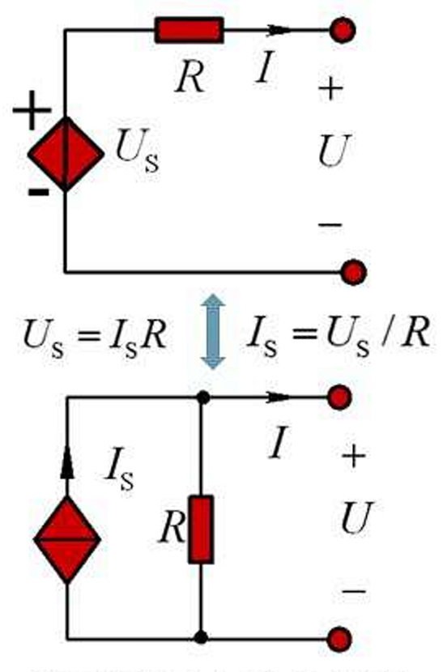
$$I_S = \frac{U_S}{R}, \quad U_S = I_SR$$

:::warning
电压源内阻 $R_1 = 0$（理想电压源），电流源内导 $G_1 = 0$（理想电流源）时，不能相互等效，因为0不能取倒数。
:::

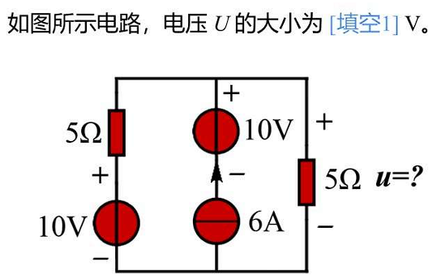

## 2.3 支路电流法

**基本思想**：以各支路电流为未知量，列写KCL和KVL方程。

**方程数量**：b个方程（n-1个KCL方程 + b-(n-1)个KVL方程）

**特点**：

- 优点：方程列写方便、直观
- 缺点：方程数量较多，宜于在支路数不多的情况下使用

**特殊处理**：

- **受控源**：补充受控源控制量方程，用支路电流表示控制量
- **电流源**：设未知的电流源两端电压为变量列入方程；或适当选取回路使电流源支路只包含在一个回路中，可不列写该回路的KVL方程

## 2.4 回路电流法

**基本思想**：

- 假设在每个独立回路中闭合流动的电流（回路电流）
- 以回路电流为待求量，对$b-(n-1)$个独立回路列写KVL方程
- 支路电流是回路电流的线性组合

**优点**：回路电流自动满足KCL

**方程数量**：$b-(n-1)$个

**标准形式**：
对于$m$个回路：

$$
\begin{cases} R_{11}I_{m1} + R_{12}I_{m2} +\cdots + R_{1m}I_{m3} = \sum_{\text{回路}1} U_{S1} \\
 R_{21}I_{m1} + R_{22}I_{m2} +\cdots +R_{2m}I_{m3} = \sum_{\text{回路}2} U_{S2} \\
 \vdots \\
  R_{m1}I_{m1} + R_{m2}I_{m2} +\cdots + R_{mm}I_{m3} = \sum_{\text{回路}m} U_{Sm} \end{cases}
$$

**列写规则**：

1. **自阻** $R_{ii}$：本回路各支路电阻之和，恒为正
2. **互阻** $R_{ij}$：两回路公共支路上的电阻。若两回路电流在此公共支路上方向相同，互阻为正；否则为负。在只含独立电源和电阻的电路中，$R_{ij} = R_{ji}$
3. $\sum U_S$：沿回路电压源的代数和，电位升取正号、电位降取负号

**特殊处理**：

- **受控源**：先按独立电源处理，然后用回路电流表示控制量
- **电流源**：
  - 适当选取回路使电流源支路只包含在一个回路中，可不列写该回路的KVL方程
  - 当电流源中流过两个回路电流时，设未知的电流源两端电压为变量列入方程
    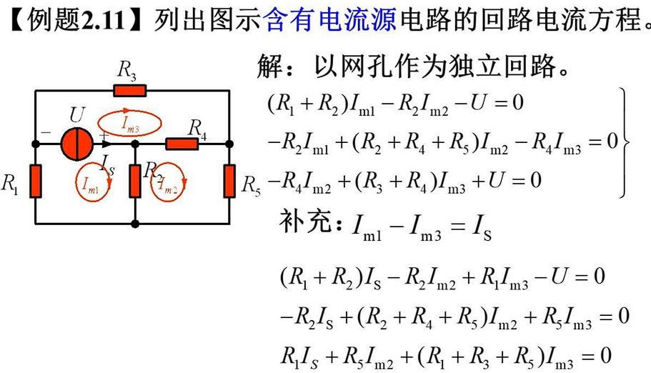
    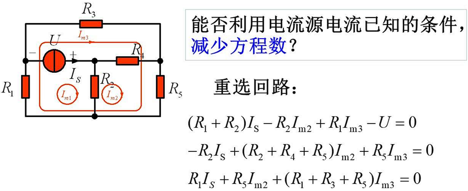

## 2.5 节点电压法

### 一、基本概念

**节点电压**：任选一点作为参考点，其它各点与参考点之间的电压称为该点的节点电压或节点电位。

**节点电压的特点**：

- 具有单值性，与路径无关
- 当用节点电压表示支路电压时，相当于等价地列写了KVL方程，KVL自动满足

### 二、基本思想

以n-1个节点电压为待求量，对n-1个节点列写KCL方程。

**方程数量**：n-1个，比支路电流法减少b-(n-1)个方程。

### 三、节点电压方程的列写规则

**标准形式**：
对于$n$个独立节点：

$$
\begin{cases} G_{11}U_{n1} + G_{12}U_{n2}+\cdots +G_{1n}U_{nn} = \sum I_{S1}\\
 G_{21}U_{n1} + G_{22}U_{n2} + \cdots +G_{2n}U_{nn}= \sum I_{S2} \\
 \vdots\\
 G_{n1}U{n1}+G_{n2}U_{n2}+\cdots +G_{nn}U_{nn} = \sum I_{Sn} \end{cases}
$$

**列写规则**：

1. **自导** $G_{ii}$：与节点 i 直接相连的各支路电导之和，恒为正
2. **互导** $G_{ij}$：直接联接在节点 i 和 j 之间的诸支路电导之和，恒为负
3. $\sum I_{Si}$：与节点 i 相连的电流源电流代数和，流入节点时取 "+" 号，流出取 "-" 号

**一般步骤**：

1. 选定参考节点，标定n-1个独立节点
2. 对n-1个独立节点，以节点电压为未知量，列写KCL方程
3. 求解方程，得到n-1个节点电压
4. 通过节点电压求得各支路电流

**特殊处理**：

- **受控源**：当作独立源处理，再把受控源的控制量用节点电压来表示
- **无伴电压源**：将电压源支路的电流设为变量列入方程，补充电压源两端节点电压之差等于电压源的源电压
- **电压源与电阻串联**：等效为诺顿支路
- **电流源与电阻串联**：直接无视该电阻
  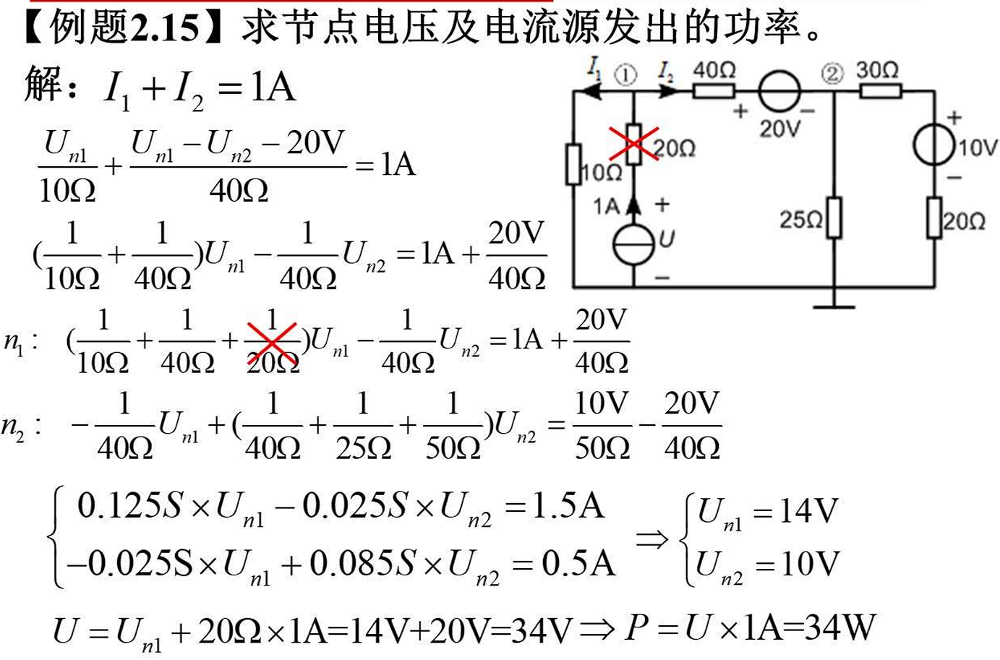

## 2.6 运算放大器

运算放大器（运放）是一种用集成电路工艺制成的多端元件。
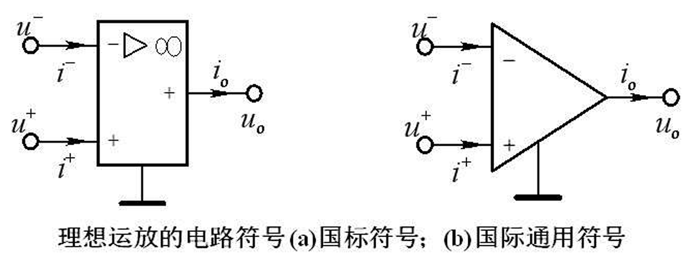
**理想运算放大器特性**：

- 输入端口电流为零（"虚断"）：$i_+ = i_- = 0$
- 输入端口电压为零（"虚短"）：$u_+ = u_-$
- 输出电阻为零

**典型应用——反相放大器**：
$$\frac{u_o}{u_i} = -\frac{R_f}{R_1}$$

当 $R_1 = R_f$ 时，$u_o = -u_i$，电路称为反相器。

---

# 第三章 电路定理

## 3.1 置换定理

**定理内容**：在任意线性或非线性电路中，若某一端口网络的端口电压为$U$，端口电流为$I$，则可用 $U_s = U$ 的电压源或 $I_s = I$ 的电流源**置换**该一端口，如果置换后的电路有唯一解，则置换不影响电路其它部分的电压、电流。

**原理**：替代前后KCL、KVL关系相同，其余支路的$u$、$i$关系不变。

**注意**：

- 置换定理既适用于线性电路，也适用于非线性电路
- 置换后电路必须有唯一解
  - 置换后其余支路及参数不能改变
  - 无全部由电压源构成的回路
  - 无电流源节点

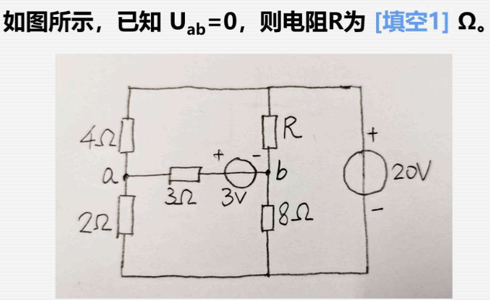

## 3.2 齐性定理和叠加定理

### 一、齐性定理

**内容**：在**只有一个激励**$X$作用的线性电路中，设任一响应为$Y$，若将该激励乘以常数$K$，则对应的响应$Y'$也等于原来响应乘以同一常数，即：
$$Y' = f(KX) = Kf(X) = KY$$

**直观表述**：若电路中只有一个激励，则**响应与激励成正比**，比例系数取决于电路的结构和参数，与激励源无关。

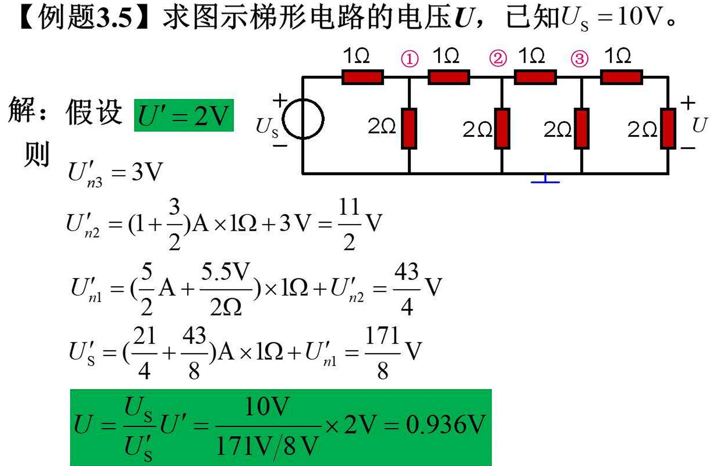

### 二、叠加定理

**内容**：在线性电路中，由几个独立电源共同作用产生的响应等于各个独立电源单独作用时产生相应响应的代数叠加。

**注意事项**：

1. 只适用于线性电路，不适用于非线性电路
2. 电压、电流叠加时要注意方向
3. 功率不是激励的线性函数，不能用每个独立电源作用时的功率叠加来求得总功率
4. 只是对独立电源而言，受控源要保留在电路中
5. 不作用的电压源用短路线代替，不作用的电流源用开路代替
6. 线性直流电路的任一响应是该电路中所有独立电源的线性组合

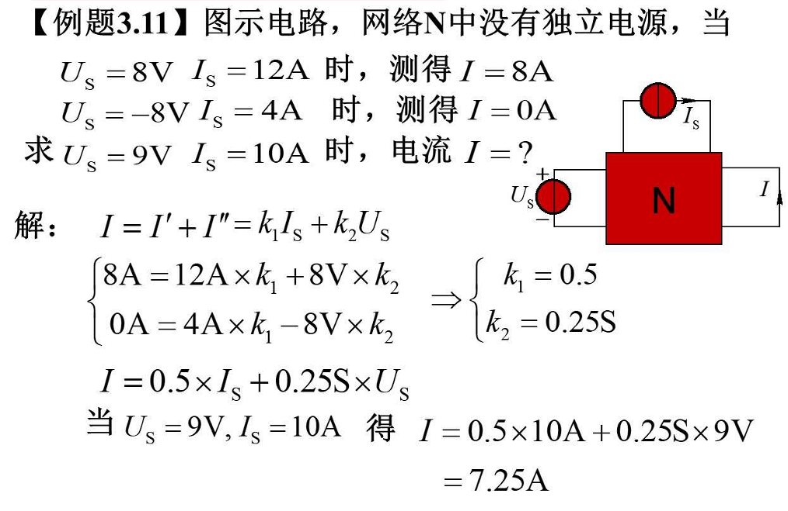

## 3.3 等效电源定理

### 一、戴维南定理（Thevenin's Theorem）

**内容**：线性含源一端口网络的对外作用可以用一个电压源串联电阻的电路来等效代替。其中，电压源的源电压等于此一端口网络的开路电压 $U_{OC}$，电阻等于此网络内部各独立源置零后网络的等效电阻 $R_1$。

### 二、诺顿定理（Norton's Theorem）

**内容**：线性含源一端口网络的对外作用可以用一个电流源并联电导的电路来等效代替。其中，电流源的源电流等于此一端口网络的短路电流 $I_{SC}$，电导等于此网络内部各独立源置零后网络的等效电导 $G_1$。

### 三、戴维南与诺顿的等效关系

$$I_{SC} = \frac{U_{OC}}{R_1}, \quad R_1 = \frac{1}{G_1} = \frac{U_{OC}}{I_{SC}}$$

### 四、等效电阻的计算方法

1. **等效化简法**：对不含受控源的简单一端口网络，令内部独立电源为零，通过电阻的串并联或星形-三角形化简得到等效电阻

2. **外施激励法**：对复杂的或含受控源的一端口网络，令内部独立电源为零，在端口处加一独立电压源或独立电流源，利用端口处电压和电流之比得到等效电阻：$R_i = \frac{U}{I}$

3. **开路短路法**：求出含源一端口网络的开路电压 $U_{OC}$ 和短路电流 $I_{SC}$，二者之比即为等效电阻：$R_1 = \frac{U_{OC}}{I_{SC}}$

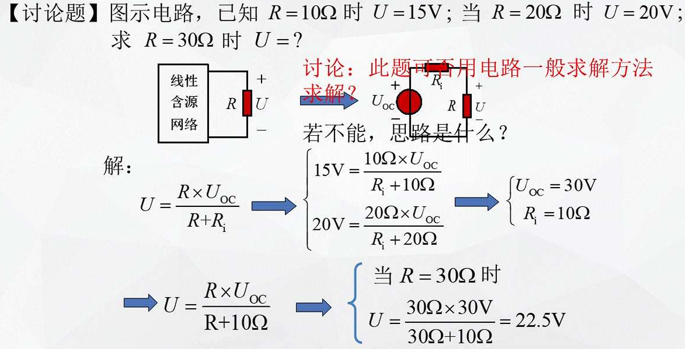

### 五、最大功率传输定理

当负载电阻等于电源内阻抗时，负载获得最大功率。
即当$R_i = R_x$时，有：
$$P_{\max} = \frac{U_{OC}^2}{4R_x}$$

**注**：当负载获得最大功率时，电源内阻和负载电阻消耗的功率相等，电能的利用率只有50%。

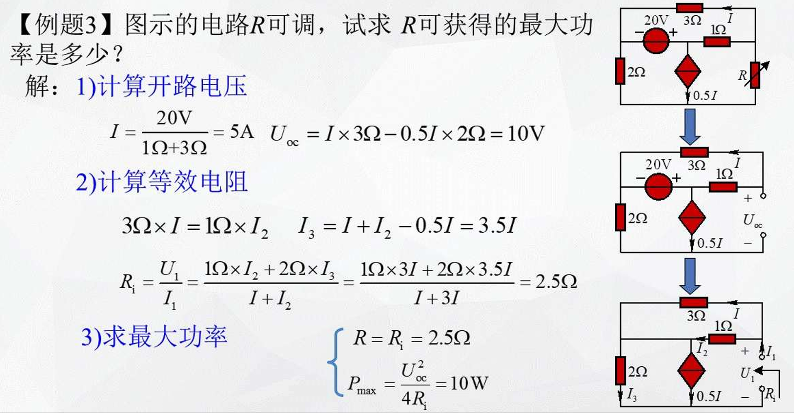

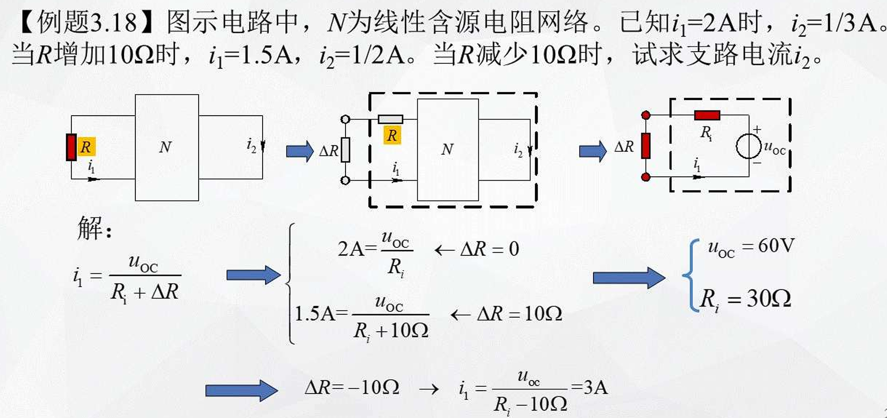

## 3.4 特勒根定理

**定理内容**：电路N中各支路电压 $u_k$ 与电路 $\hat{N}$ 中对应支路电流 $\hat{i}_k$ 的乘积之和等于零：
$$\sum_{k=1}^{b} u_k \hat{i}_k = 0 \quad \text{与} \quad \sum_{k=1}^{b} \hat{u}_k i_k = 0$$

**应用于同一电路**：得到功率守恒定理
$$\sum_{k=1}^{b} p_k = 0$$

意义：在任一瞬间，一个电路中各支路吸收功率的代数和等于零。

**应用于不同电路**：虽然具有相同的形式，但不具备任何物理意义，称为似功率守恒定理。

**注意事项**:

- 两个电路的对应电压和电流的参考方向取向要一致
- 同一个电路各支路电压、电流参考方向的取向要一致（全关联或全非关联）

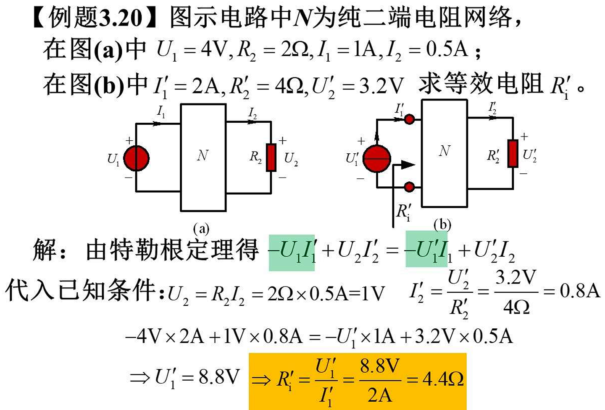

## 3.5 互易定理

**适用条件**：含有一个独立源和若干线性二端电阻的电路。

**三种形式**：
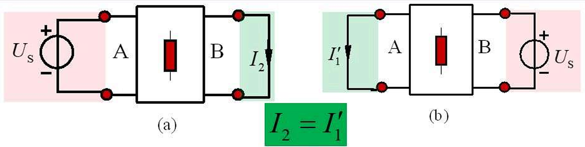
**形式一**：当电压源在端口A作用时，在端口B产生的短路电流等于把此电压源移到端口B作用而在端口A所产生的短路电流。
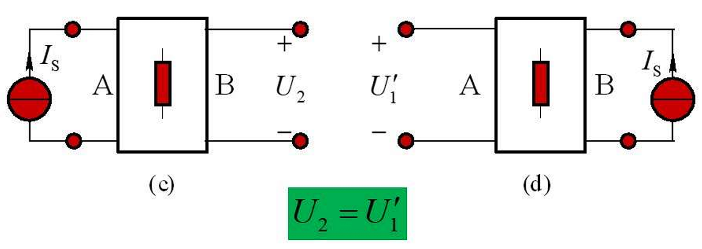
**形式二**：当电流源在端口A作用时，在端口B产生的开路电压等于把此电流源移到端口B作用而在端口A所产生的开路电压。
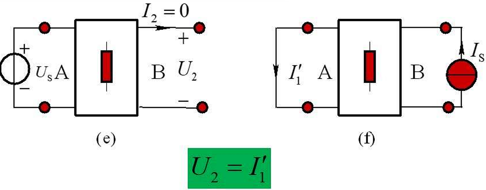
**形式三**：如果在数值上 $I_s$ 与 $U_s$ 相等，则 $U_2$ 与 $I'$ 在数值上也相等。

**注意**：

- 只适用于线性电路，不适用于非线性电路
- 应用时要注意参考方向，如果两个网络的端口电压和电流的参考方向不一致，应在不一致的电流和电压前加负号
- 在激励与响应互换位置时，电路其余结构不能发生变化

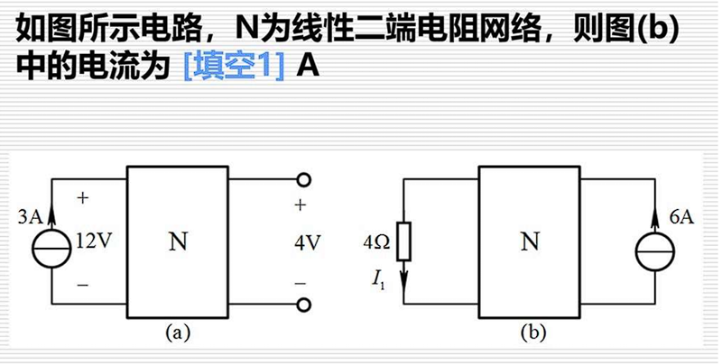

## 3.6 对偶原理

**内容**：如果电路中某一定理（或方程、关系式等）的表述是成立的，则将其中的概念（变量、参数、元件、结构等）用其对偶因素置换所得的对偶表述也一定是成立的。

**部分对偶因素**：

| 原因素                  | 对偶因素                |
| ----------------------- | ----------------------- |
| 电压                    | 电流                    |
| 基尔霍夫电压定律（KVL） | 基尔霍夫电流定律（KCL） |
| 电阻                    | 电导                    |
| 电压源                  | 电流源                  |
| 串联                    | 并联                    |
| 戴维南定理              | 诺顿定理                |
| 节点                    | 网孔                    |
| 开路                    | 短路                    |
| 自阻                    | 自导                    |
| 互阻                    | 互导                    |

---

# 第四章 正弦电流电路

## 4.1 正弦电流

### 一、基本概念

**正弦电流**：随时间按正弦规律变动的电流，一般表达式为：
$$i = I_m \cos(\omega t + \psi_i)$$

其中：

- $I_m$：振幅（最大值）
- $\omega$：角频率（rad/s），$\omega = 2\pi f$
- $\psi_i$：初相位

**工频**：我国电力系统标准频率为50Hz，相应的角频率 $\omega = 100\pi$ rad/s

### 二、有效值

**定义**：当周期电流 $i = f(t)$ 和直流 $I$ 分别通过相同的电阻 $R$，若二者做功的平均效果相同，则将此直流 $I$ 的量值规定为周期电流 $i$ 的有效值。

$$I = \sqrt{\frac{1}{T}\int_0^T i^2 dt}$$

**正弦电流有效值与最大值的关系**：
$$I = \frac{I_m}{\sqrt{2}}$$

正弦电流可表示为：$i = \sqrt{2}I \cos(\omega t + \psi_i)$

### 三、相位差

同频率正弦电压和正弦电流的相位差为初相之差：
$$\varphi = (\omega t + \psi_u) - (\omega t + \psi_i) = \psi_u - \psi_i$$

- $\varphi > 0$：电压越前（超前）电流于 $\phi$
- $\varphi < 0$：电压滞后电流于 $\phi$
- $\varphi = 0$：电压与电流同相
- $\varphi = \pm 90°$：电压与电流相位正交
- $\varphi = 180°$：电压与电流相位相反

**参考正弦量**：初相为零的正弦量

- 一旦选定一个正弦量作为参考量，其他同频率正弦量的相位就可以用与参考量的相位差来表示。

## 4.2 正弦量的相量表示法

### 一、相量表示原理

正弦量 $f(t) = A_m \cos(\omega t + \psi)$ 可表示为：
$$f(t) = \text{Re}[A_m e^{j(\omega t + \psi)}] = \text{Re}[\dot{A}_m e^{j\omega t}]$$

其中 $\dot{A}_m = A_m e^{j\psi} = A_m \angle \psi$ 称为相量。

对应关系：$f(t) = A_m \cos(\omega t + \psi) \rightleftharpoons \dot{A}_m = A_m \angle \psi$

### 二、相量运算规则

**1. 唯一性**：两个同频率正弦量相等的充要条件是代表这两个正弦量的相量相等。

**2. 线性性**：N个同频率正弦量线性组合（具有实系数）的相量等于各个正弦量相量的同样的线性组合。
$$\sum_{k=1}^{N} b_k \cdot f_k(t) \rightleftharpoons \sum_{k=1}^{N} b_k \dot{A}_{mk}$$

**3. 微分**：
$$\frac{d}{dt}f(t) \rightleftharpoons j\omega \dot{A}_m$$

**4. 积分**：
$$\int f(t) dt \rightleftharpoons \frac{1}{j\omega}\dot{A}_m$$

**相量法的意义**：

- 把时域问题转化为复数问题
- 把微积分方程转化为复数代数方程
- 可以把直流电路中的方法应用于交流电路求解

:::warring
仅适用于线性同频正弦交流电路
:::

## 4.3 基尔霍夫定律的相量形式

**KCL的相量形式**：
$$\sum \dot{I}_m = 0 \quad \text{或} \quad \sum \dot{I} = 0$$

**KVL的相量形式**：
$$\sum \dot{U}_m = 0 \quad \text{或} \quad \sum \dot{U} = 0$$

## 4.4 电容和电感

关联参考方向下，有：

好的，我将之前补充的电感和电容基本性质（储能、直流稳态特性、连续性等）合并到 4.4 节的元件对比表格中，形成更完整的综合对比。

---

### 4.4 RLC 元件上电压与电流的相量关系（综合性质表）

| 性质           | 电阻 R                          | 电感 L                                              | 电容 C                                                      |
| -------------- | ------------------------------- | --------------------------------------------------- | ----------------------------------------------------------- |
| **时域 VCR**   | $u_R = Ri_R$                    | $u_L = L\frac{di_L}{dt}$                            | $i_C = C\frac{du_C}{dt}$                                    |
| **积分形式**   | —                               | $i_L = i_L(t_0) + \frac{1}{L}\int_{t_0}^{t} u_L dt$ | $u_C = u_C(t_0) + \frac{1}{C}\int_{t_0}^{t} i_C dt$         |
| **相量 VCR**   | $\dot{U}_R = R\dot{I}_R$        | $\dot{U}_L = j\omega L\dot{I}_L$                    | $\dot{U}_C = \frac{1}{j\omega C}\dot{I}_C = -jX_C\dot{I}_C$ |
| **有效值关系** | $U_R = RI_R$                    | $U_L = \omega LI_L = X_LI_L$                        | $U_C = \frac{I_C}{\omega C} = \|X_C\|I_C$                   |
| **相位关系**   | 同相 ($\psi_u = \psi_i$)        | 电压超前电流 $90°$                                  | 电压滞后电流 $90°$                                          |
| **相量图**     | $\dot{U}_R$ 与 $\dot{I}_R$ 同向 | $\dot{U}_L$ 超前 $\dot{I}_L$ $90°$                  | $\dot{U}_C$ 滞后 $\dot{I}_C$ $90°$                          |
| **阻抗/电抗**  | $Z_R = R$                       | $Z_L = j\omega L = jX_L$                            | $Z_C = \frac{1}{j\omega C} = -jX_C$                         |
| **储能**       | 不储能，消耗能量                | 储存磁场能：$w_L = \frac{1}{2}Li_L^2$               | 储存电场能：$w_C = \frac{1}{2}Cu_C^2$                       |
| **连续性**     | 电压、电流均可跃变              | **电流不能跃变**                                    | **电压不能跃变**                                            |
| **直流稳态**   | $u = Ri$                        | **相当于短路** ($u = 0$)                            | **相当于开路** ($i = 0$)                                    |
| **记忆性**     | 无记忆                          | 有记忆（记忆电压历史）                              | 有记忆（记忆电流历史）                                      |
| **有功功率**   | $P = I^2R > 0$（总是消耗）      | $P = 0$（不消耗）                                   | $P = 0$（不消耗）                                           |
| **无功功率**   | $Q = 0$                         | $Q_L = I^2X_L > 0$（感性）                          | $Q_C = -I^2\|X_C\| < 0$（容性）                             |
| **元件性质**   | 无源（耗能元件）                | 无源（储能元件）                                    | 无源（储能元件）                                            |

**说明**：

- 电感电流不能跃变、电容电压不能跃变，是分析**暂态过程**中确定初始条件的关键依据
- 直流稳态时电感短路、电容开路，是**直流电路化简**的重要结论
- 感抗 $X_L = \omega L$ 与频率成正比，容抗 $\|X_C\| = 1/(\omega C)$ 与频率成反比
- 电容、电感的功率在一个周期内正负交替，平均值为零，表明它们与电源之间存在能量交换但不消耗能量

---

此表格可直接替换或插入到笔记 4.4 节中原有的对比表格位置。

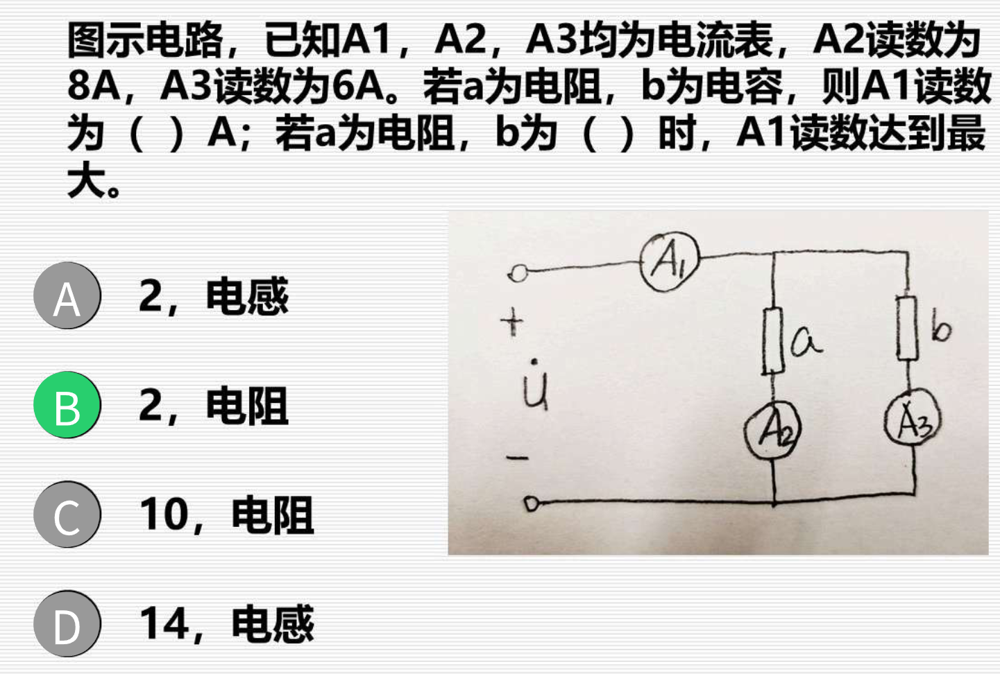

## 4.5 阻抗和导纳

### 一、阻抗

**定义**：阻抗Z等于端口电压相量与电流相量之比。
$$Z = \frac{\dot{U}}{\dot{I}} = \frac{U \angle \psi_u}{I \angle \psi_i} = \frac{U}{I} \angle (\psi_u - \psi_i) = |Z| \angle \varphi$$

**RLC串联阻抗**：
$$Z = R + j(\omega L - \frac{1}{\omega C}) = R + j(X_L + X_C) = R + jX$$

- 阻抗模：$|Z| = \sqrt{R^2 + (X_L + X_C)^2}$
- 阻抗角：$\varphi = \arctan \frac{X_L + X_C}{R}$
- 电阻：R
- 电抗：$X = X_L + X_C$

**阻抗性质**：

- $X_L > |X_C|$，$\varphi > 0$：感性，电压超前电流
- $X_L < |X_C|$，$\varphi < 0$：容性，电压滞后电流
- $X_L = |X_C|$，$\varphi = 0$：阻性，电压与电流同相

### 二、导纳

**定义**：导纳Y等于端口电流相量与电压相量之比。
$$Y = \frac{\dot{I}}{\dot{U}} = \frac{I}{U} \angle (\psi_i - \psi_u) = |Y| \angle \varphi_Y$$

**GCL并联导纳**：
$$Y = G + j(\omega C - \frac{1}{\omega L}) = G + j(B_C + B_L) = G + jB$$

- 容纳：$B_C = \omega C$
- 感纳：$B_L = -\frac{1}{\omega L}$
- 电纳：$B = B_C + B_L$

**阻抗与导纳的关系**：$Y = \frac{1}{Z}$
:::warning
等效的Z或Y与频率有关。
:::

## 4.6 正弦电流电路的相量分析法

**一般过程**：

1. 将电阻推广为阻抗，将电导推广为导纳
2. 将激励用相量形式表示
3. 按线性直流电路分析方法计算相量模型电路
4. 将电压、电流相量计算结果变换成正弦表达式

**适用的分析方法**：

- 支路电流法
- 回路电流法
- 节点电压法
- 叠加定理
- 等效电源定理（戴维南定理、诺顿定理）

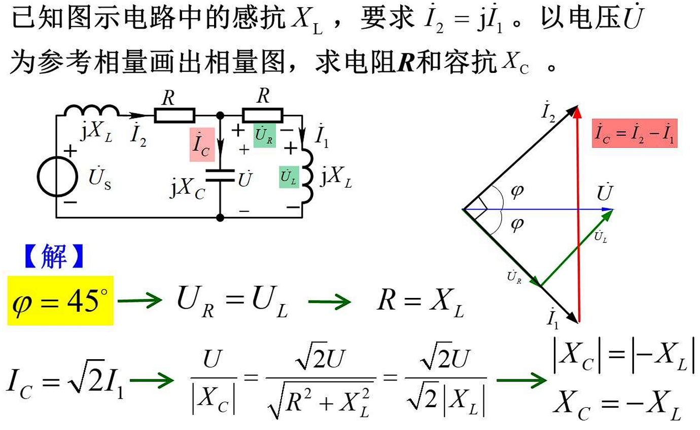

## 4.7 正弦电流电路的功率

### 一、瞬时功率

$$p = ui = UI \cos(\psi_u - \psi_i) + UI \cos(2\omega t + \psi_u + \psi_i)$$

包含两个分量：

- 恒定分量：$UI \cos(\psi_u - \psi_i) \geq 0$（吸收的能量）
- 交变分量：$UI \cos(2\omega t + \psi_u + \psi_i)$（交换的能量，一个周期内平均值为零）

### 二、有功功率（平均功率）

$$P = \frac{1}{T}\int_0^T p dt = UI \cos(\psi_u - \psi_i) = UI \cos \varphi = UI\lambda$$

- 单位：瓦（W）
- $\varphi = \psi_u - \psi_i$：功率因数角
- $\lambda = \cos \varphi$：功率因数

**各元件功率特点**：

| 元件  | 平均功率                | 功率因数      | 说明           |
| ----- | ----------------------- | ------------- | -------------- |
| 电阻R | $P = UI = I^2R = U^2/R$ | $\lambda = 1$ | 总是吸收功率   |
| 电感L | $P = 0$                 | $\lambda = 0$ | 不消耗有功功率 |
| 电容C | $P = 0$                 | $\lambda = 0$ | 不消耗有功功率 |

**结论**：

- 在正弦电流电路中，同相位的电压与电流产生平均功率，且等于其有效值之积；
- 相位正交的电压与电流不产生平均功率。

### 三、无功功率

$$Q = UI \sin \varphi$$

- 单位：乏（var）
- 感性：$Q > 0$
- 容性：$Q < 0$

电感和电容的无功功率：

- $Q_L = UI \sin 90° = UI = I^2\omega L = \displaystyle\frac{U^2}{\omega L}$
   
- $Q_C = UI \sin(-90°) = -UI = -\displaystyle\frac{I^2}{\omega C}= -U^2\omega C$

### 四、视在功率

$$S = UI = \sqrt{P^2 + Q^2}$$

- 单位：伏安（VA）
- 表示电气设备容量

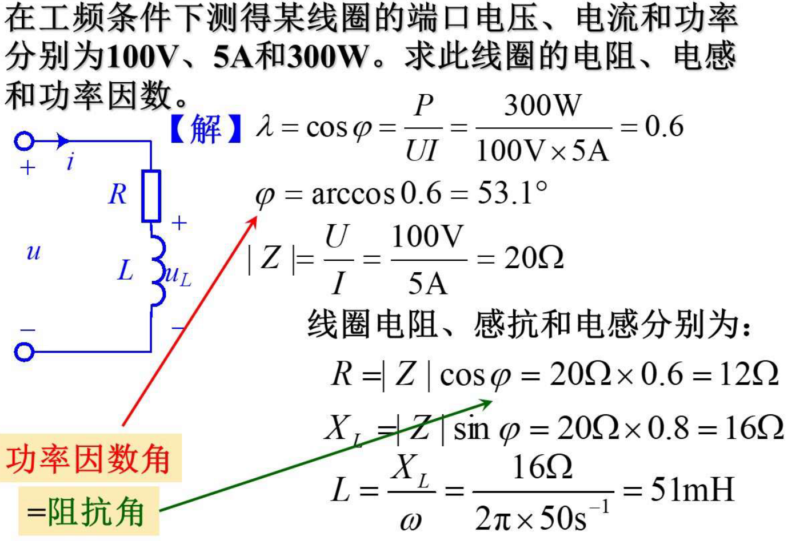

### 五、复功率

$$\tilde{S} = P + jQ = UI \cos \varphi + jUI \sin \varphi = UIe^{j\varphi} = \dot{U}\dot{I}^*$$

- $\dot{I}^*$号表示共轭复数$\bar{\dot{I}}$，即$\dot{I}^* = I \angle (-\psi_i)$
- 复功率等于电压相量与电流相量共轭复相量的乘积
- $|\tilde{S}| = S = UI$
- $\arctan \frac{Q}{P} = \varphi$

**复功率守恒性**：各支路发出的复功率代数和等于零。
$$\sum_{k=1}^{b} \dot{U}_k \dot{I}_k^* = \sum_{k=1}^{b} P_k + j\sum_{k=1}^{b} Q_k = 0$$

### 六、功率因数的提高

**意义**：

- 通过减少线路电流来减小线路损耗
- 提高发电设备利用率

**原理**：利用电场能量与磁场能量的相互转换（容性无功与感性无功的相互补偿），来减少电源输出电流的无功分量。

**方法**：在感性负载两端并联电容。

**并联电容计算**：
$$C = \frac{P(\tan \varphi_1 - \tan \varphi_2)}{\omega U^2}$$
其中 $\varphi_1$ 为补偿前功率因数角，$\varphi_2$ 为补偿后功率因数角。

**注意**：串联电容理论上可进行无功补偿，但实际中不采用，因为：

- 改变了负载工作电压
- 增加了线损

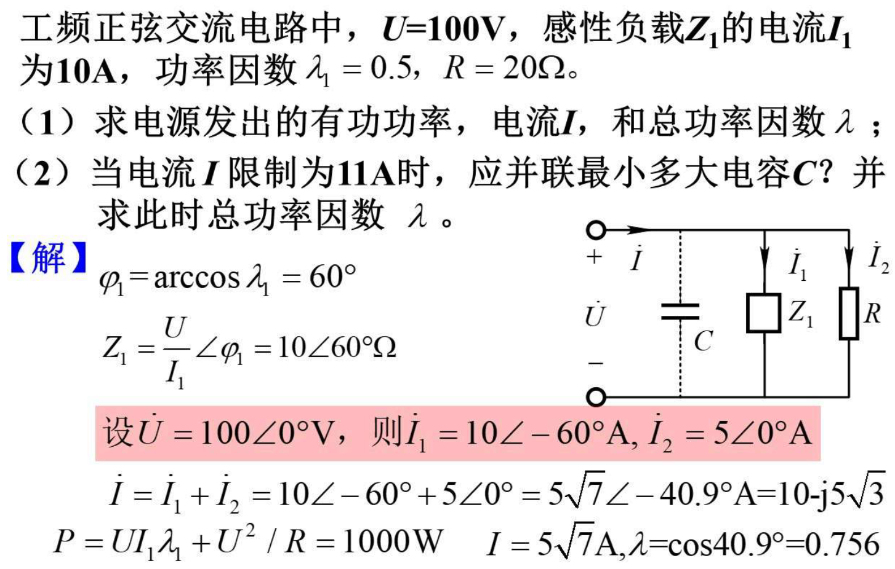
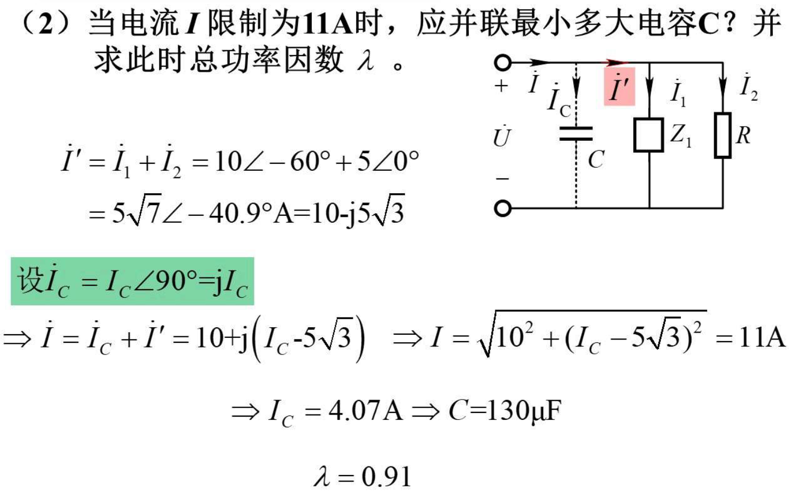

## 4.8 最大功率传输定理（正弦电路中）

### 一、共轭匹配（负载可任意改变）

**条件**：负载阻抗等于内阻抗的共轭复数，即：$$Z_L = R_L + jX_L = R_S - jX_S = Z_S^*$$

**最大功率**：$$P_{L\max} = \frac{U_S^2}{4R_S} = \frac{U_S^2}{4R_L}$$

此时电能的利用率只有50%

### 二、模匹配（只有负载的模可改变）

**条件**：$|Z_L| = |Z_S|$

**最大功率**：$$P_{L\max} = \frac{U_S^2 \cos \varphi_L}{2|Z_S|[1 + \cos(\varphi_S - \varphi_L)]}$$

- 其中 $\varphi_S = \arctan\frac{X_S}{R_S}$、$\varphi_L=\arctan\frac{X_L}{R_L}$ 分别为内阻抗和负载阻抗的阻抗角

**常见情况**：

- 电源内阻抗 $Z_s = R_s + jX_s$，纯电阻负载获得最大功率的条件是 $R_L = |Z_s|$
- 电源内阻抗为纯电阻 $R_s$，电阻负载获得最大功率的条件是 $R_L = R_s$

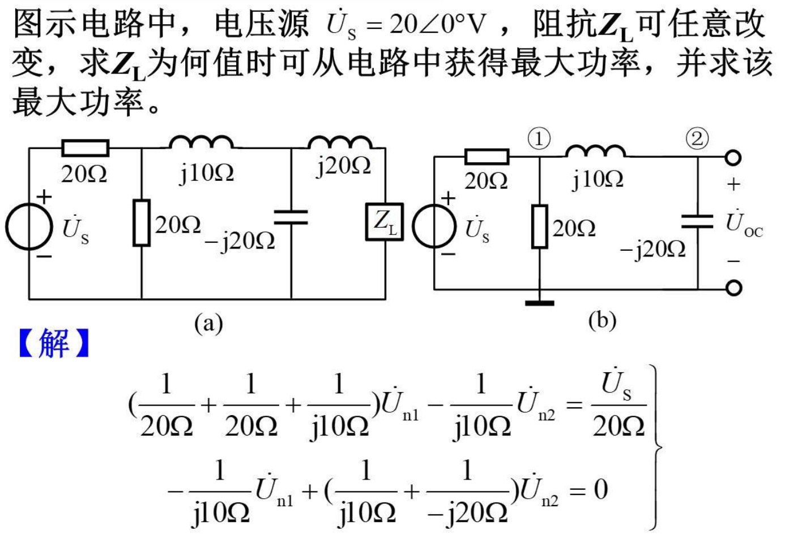
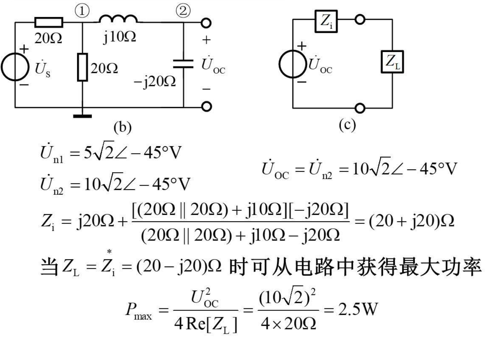

## 4.9 耦合电感

### 一、基本概念

**互感**：当几个线圈之间存在着磁耦合，便形成了多端口电感。二端口电感习惯上称为互感。

**自感**：$L_1$、$L_2$
**互感**：$M = L_{12} = L_{21}$

**耦合系数**：$k = \frac{M}{\sqrt{L_1 L_2}}$，$0 \leq k \leq 1$

- $k = 0$：两个线圈无耦合
- $k = 1$：两个线圈全耦合

### 二、同名端

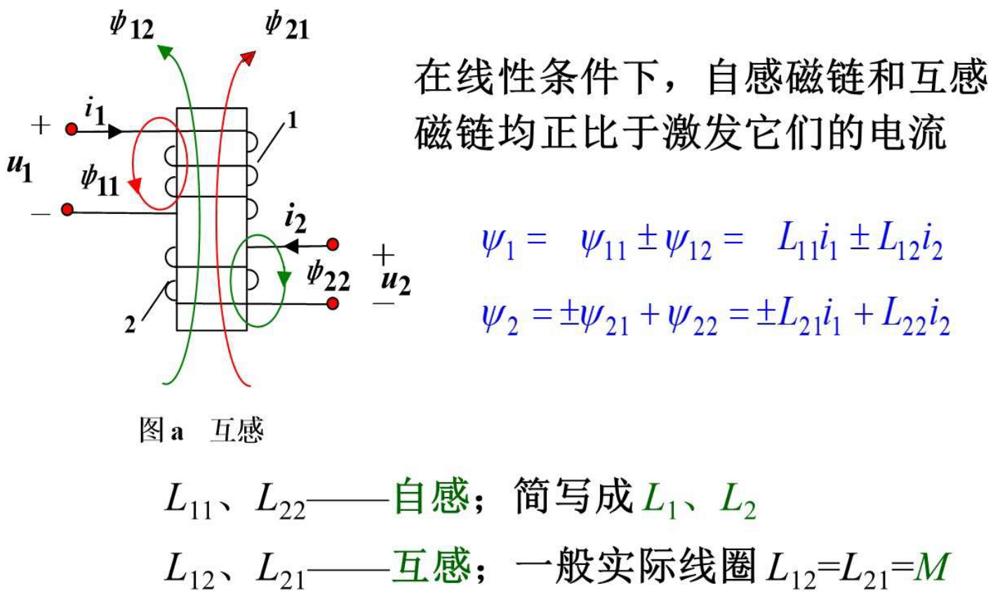
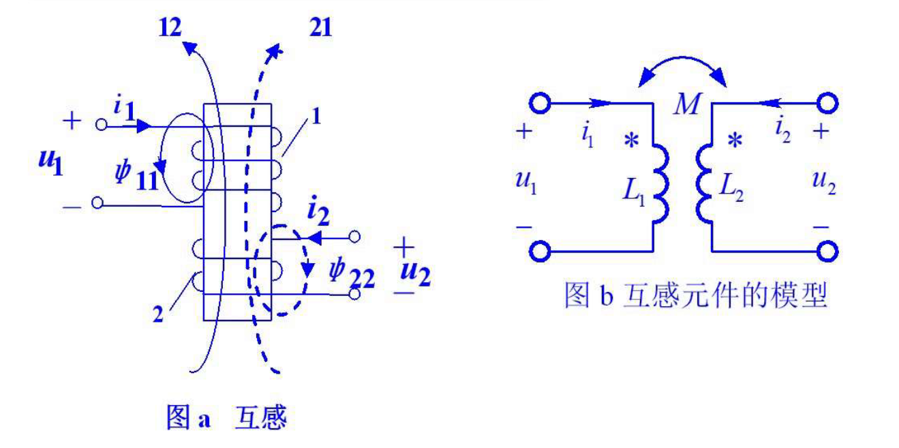

**定义**：使所激发的自感磁链和互感磁链方向一致的两个线圈电流的进端或出端。

换言之，两个端口电流都流进（或流出）同名端，表示它们所激发的自感磁链和互感磁链方向一致。

### 三、互感元件的特性方程

**时域形式**：
$$\begin{cases} u_1 = L_1 \frac{di_1}{dt} \pm M \frac{di_2}{dt} \\ u_2 = \pm M \frac{di_1}{dt} + L_2 \frac{di_2}{dt} \end{cases}$$

**相量形式**：
$$\begin{cases} \dot{U}_1 = j\omega L_1 \dot{I}_1 \pm j\omega M \dot{I}_2 \\ \dot{U}_2 = \pm j\omega M \dot{I}_1 + j\omega L_2 \dot{I}_2 \end{cases}$$

**符号判断规则**：

- 自感电压：若 $u_1$、$i_1$ 或 $u_2$、$i_2$ 的参考方向关联，则 $L_1$ 或 $L_2$ 前取正号
- 互感电压：若 $u_1$、$i_2$ 或 $u_2$、$i_1$ 的参考方向相对同名端（星标\*）是相同的，则M前取正号

### 四、互感元件的连接

**1. 串联**

- 正串（顺接，电流从同名端流入）：$$L_{eq} = L_1 + L_2 + 2M$$
- 反串（反接，电流从异名端流入）：$$L_{eq} = L_1 + L_2 - 2M$$

**2. 并联**

- 同名端连接：$$L_{eq} = \frac{L_1 L_2 - M^2}{L_1 + L_2 - 2M}$$
- 异名端连接：$$L_{eq} = \frac{L_1 L_2 - M^2}{L_1 + L_2 + 2M}$$

**3. 去耦等效（T型联接）**

同名端连接时(a)：
$$\begin{cases} L_a = M \\ L_b = L_1 - M \\ L_c = L_2 - M \end{cases}$$

异名端连接时(b)：
$$\begin{cases} L_a = -M \\ L_b = L_1 + M \\ L_c = L_2 + M \end{cases}$$

:::note
原来中心点经变换后应等效于下方空心圆点位置
:::

### 五、互感储能

$$w_m = \frac{1}{2}L_1 i_1^2 + \frac{1}{2}L_2 i_2^2 \pm M i_1 i_2 \geq 0$$

存在磁耦合时，要增减一项 $M i_1 i_2$，增减视互感的作用是使磁场增强还是减弱而定。

## 4.10 含互感元件的正弦电路分析

**分析方法**：

1. 列写相量形式的电路方程（以电流为待求量）
2. 当两个耦合线圈相串联或存在公共节点时，可通过消去互感，变换成等效的不含互感电路来分析

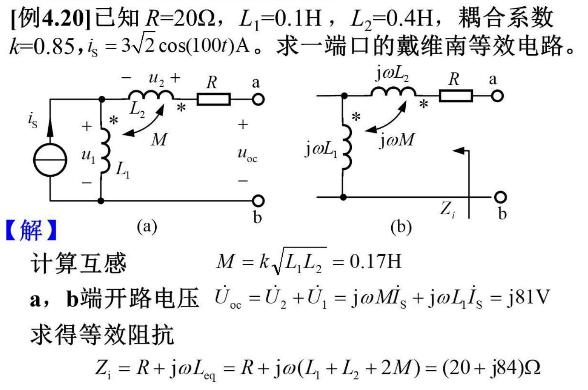

**互感电路的一次侧等效**：
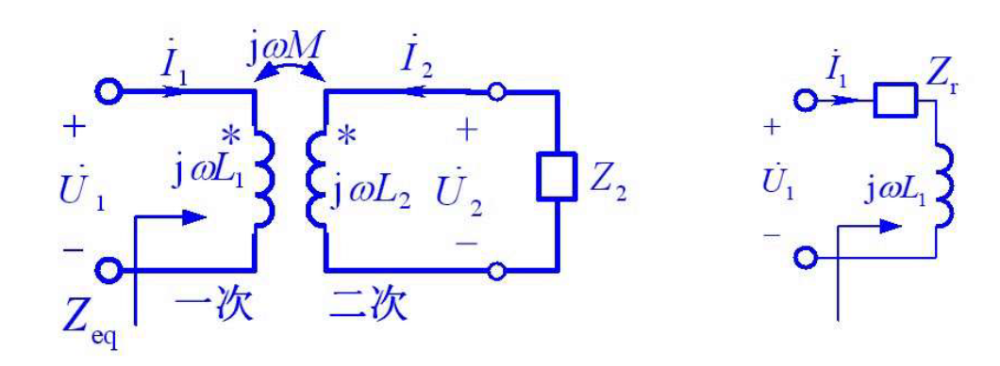

从一次侧看进去的等效阻抗：
$$Z_{eq} = \frac{(\omega M)^2}{Z_2 + j\omega L_2} + j\omega L_1 = Z_r + j\omega L_1$$

其中 $$Z_r = \frac{(\omega M)^2}{\text{二次侧回路总阻抗}}$$ 称为反映阻抗。

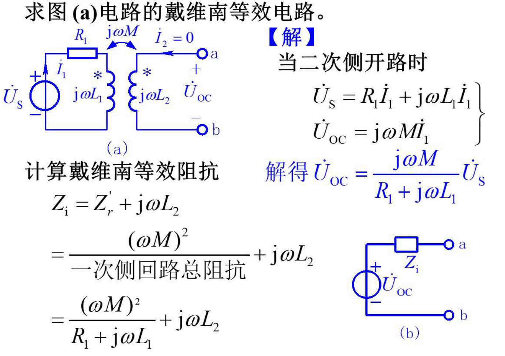

## 4.11 理想变压器

**理想化条件**：

1. 铁心的磁导率 $\mu \to \infty$，$H = B/\mu = 0$
2. 每个线圈的漏磁通为零（全耦合）
3. 线圈电阻为零
4. 铁心的损耗为零

**特性方程**：
$$\begin{cases} u_1 = n u_2 \\ i_1 = -\frac{1}{n} i_2 \end{cases}$$

其中 $n = \frac{N_1}{N_2}$ 称为变比。

**相量形式**：
$$\begin{cases} \dot{U}_1 = n\dot{U}_2 \\ \dot{I}_1 = -\dot{I}_2/n \end{cases}$$

**功率特性**：$p = u_1 i_1 + u_2 i_2 = 0$

- 理想变压器既无能量损耗，也无能量存储，为非能元件

**阻抗变换作用**：
$$Z_i = \frac{\dot{U}_1}{\dot{I}_1} = n^2 Z_2$$

当理想变压器输出端口接阻抗 $Z_2$ 时，折算到输入端口的等效阻抗为 $n^2 Z_2$

**符号判断**：理想变压器方程与 $u$、$i$ 的参考方向和两线圈同名端位置有关。

- 电压 $u_1$、$u_2$ 的参考方向相对同名端相同时，$u_1 = n u_2$
- 电流 $i_1$、$i_2$ 的参考方向相对同名端相同时，$i_1 = -\frac{1}{n}i_2$

## 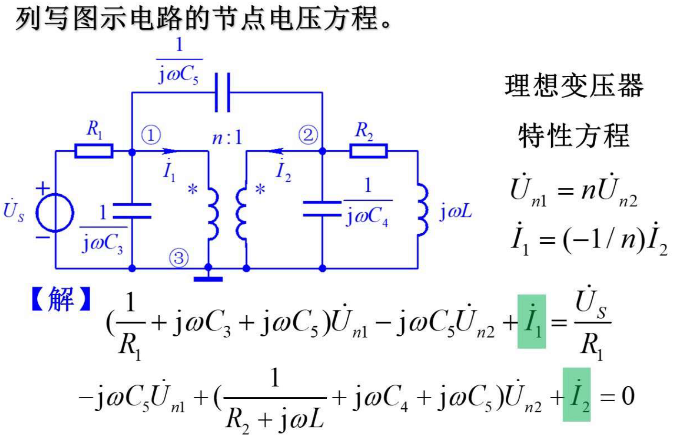

---

# 第五章 三相电路

## 5.1 三相电源和三相电路

### 一、对称三相电压

**定义**：频率相同、波形相同、幅值相同、变动进程的时间差相等的三相电压。

$$u_A = \sqrt{2}U \cos(\omega t + \varphi)$$
$$u_B = \sqrt{2}U \cos[\omega(t - \frac{kT}{3}) + \varphi] = \sqrt{2}U \cos(\omega t + \varphi - \frac{2k\pi}{3})$$
$$u_C = \sqrt{2}U \cos[\omega(t - \frac{2kT}{3}) + \varphi] = \sqrt{2}U \cos(\omega t + \varphi - \frac{4k\pi}{3})$$

### 二、相序

- **$k=1$ — 正序（顺序）**：$u_A$ 超前 $u_B$ 120°，$u_B$ 超前 $u_C$ 120°
- **$k=2$ — 负序（逆序）**：$u_B$ 超前 $u_A$ 120°，$u_C$ 超前 $u_B$ 120°
- **$k=3$ — 零序**：三相电压相位相同

**电力系统一般采用正序。**

**正序相量表示**（取 $\varphi = 0°$）：
$$\dot{U}_A = U \angle 0° \text{ V}$$
$$\dot{U}_B = U \angle -120° \text{ V}$$
$$\dot{U}_C = U \angle 120° \text{ V}$$

**对称三相电压的性质**：
$$\dot{U}_A + \dot{U}_B + \dot{U}_C = 0$$

### 三、对称三相负载

三相负载通常由三个单相负载组成。若各相参数都相同，即 $Z_A = Z_B = Z_C = Z$，则称为对称三相负载。

**对称三相电路**：由对称三相电源和对称三相负载组成的电路。

### 四、三相电路的连接方式

1. **星形联结（Y形）**：三个末端连接在一起，形成中性点N
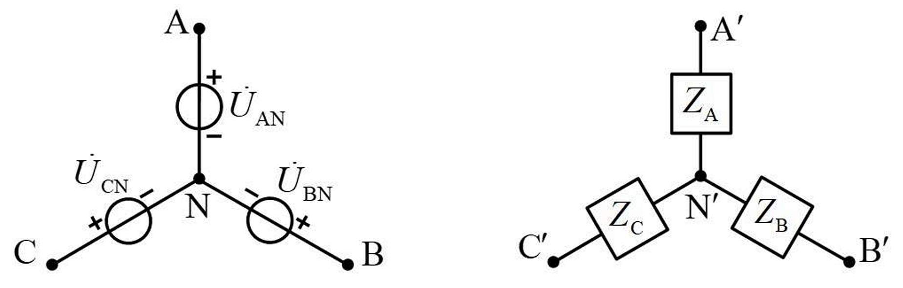
1. **三角形联结（Δ形）**：各相首尾依次相接
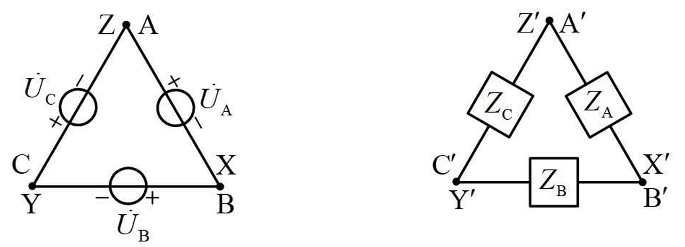
**注意**：只有对称三相电源才可以接成三角形，并且要保证各相首尾相接。

## 5.2 星形联结和三角形联结

### 一、三相电路的常用术语
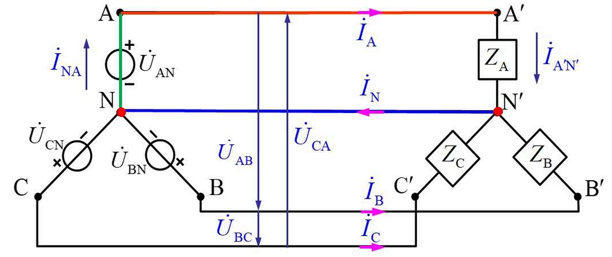
- **中性点**：N、N'
- **中线**：N-N'
- **端线（火线）**：A-A'、B-B'、C-C'
- **中线电流**：流过中线的电流$\dot{I}_N$
- **线电流**：流过端线的电流 $\dot{I}_A, \dot{I}_B, \dot{I}_C$
- **线电压**：每两条端线之间的电压 $\dot{U}_{AB}, \dot{U}_{BC}, \dot{U}_{CA}$
- **相电压**：电源或负载各相中的电压 $\dot{U}_{AN}, \dot{U}_{BN}, \dot{U}_{CN}$
- **相电流**：电源或负载各相中的电流 $\dot{I}_{AN}, \dot{I}_{BN}, \dot{I}_{CN}$

在对称三相电路中，容易计算出：$$\dot{I}_N=0$$

### 二、Y-Y 联结
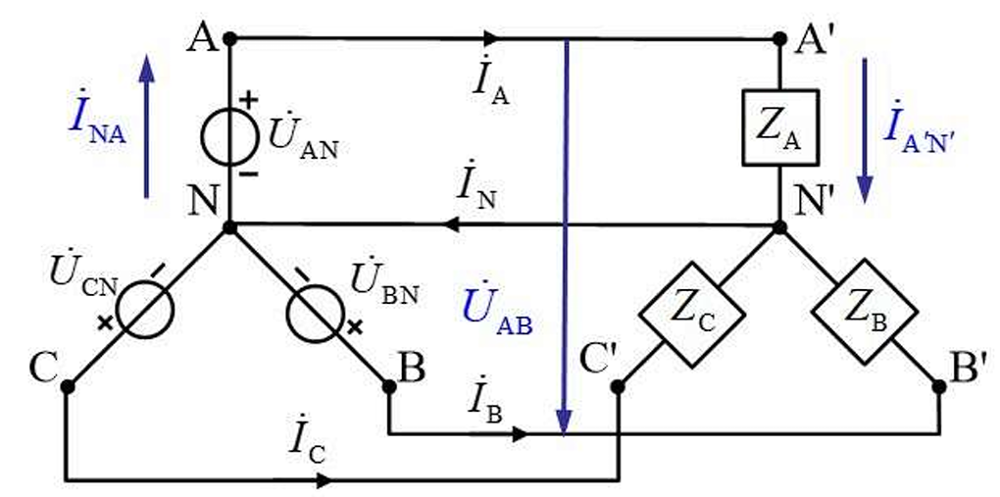
**线电流 = 相电流**：$I_l = I_p$

**线电压与相电压的关系**：
$$\dot{U}_{AB} = \dot{U}_{AN} - \dot{U}_{BN} = \sqrt{3}\dot{U}_{AN}\angle 30°$$
$$\dot{U}_{BC} = \dot{U}_{BN} - \dot{U}_{CN} = \sqrt{3}\dot{U}_{BN}\angle 30°$$
$$\dot{U}_{CA} = \dot{U}_{CN} - \dot{U}_{AN} = \sqrt{3}\dot{U}_{CN}\angle 30°$$

- 在星形接法中，线电压是相电压有效值的 $\sqrt{3}$ 倍，即 $U_l = \sqrt{3}U_p$
- 在相位上，线电压**超前**于先行相电压 $30°$

### 三、Δ-Δ 联结
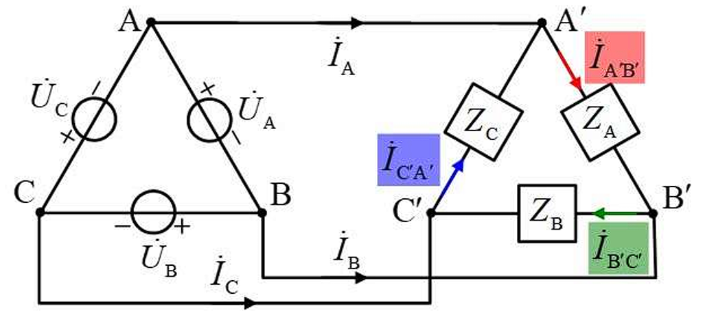
**线电压 = 相电压**：$U_l = U_p$

**线电流与相电流的关系**：
$$\dot{I}_A = \dot{I}_{A'B'} - \dot{I}_{C'A'} = \sqrt{3}\dot{I}_{A'B'}\angle -30°$$
$$\dot{I}_B = \dot{I}_{B'C'} - \dot{I}_{A'B'} = \sqrt{3}\dot{I}_{B'C'}\angle -30°$$
$$\dot{I}_C = \dot{I}_{C'A'} - \dot{I}_{B'C'} = \sqrt{3}\dot{I}_{C'A'}\angle -30°$$

- **(a)** 在三角形接法中，线电流是相电流有效值的 $\sqrt{3}$ 倍，即 $I_l = \sqrt{3}I_p$
- **(b)** 在相位上，线电流**滞后**于先行相电流 $30°$

### 四、对称三相电路相/线关系小结

| 联结方式 | 相/线电压关系 | 相/线电流关系 |
|:---:|:---|:---|
| **星形** | $U_l = \sqrt{3}U_p$，线电压超前先行相电压 $30°$ | $I_l = I_p$ |
| **三角形** | $U_l = U_p$ | $I_l = \sqrt{3}I_p$，线电流滞后先行相电流 $30°$ |

**常见联结组合**：Y-Y、Y-Δ、Δ-Y、Δ-Δ。

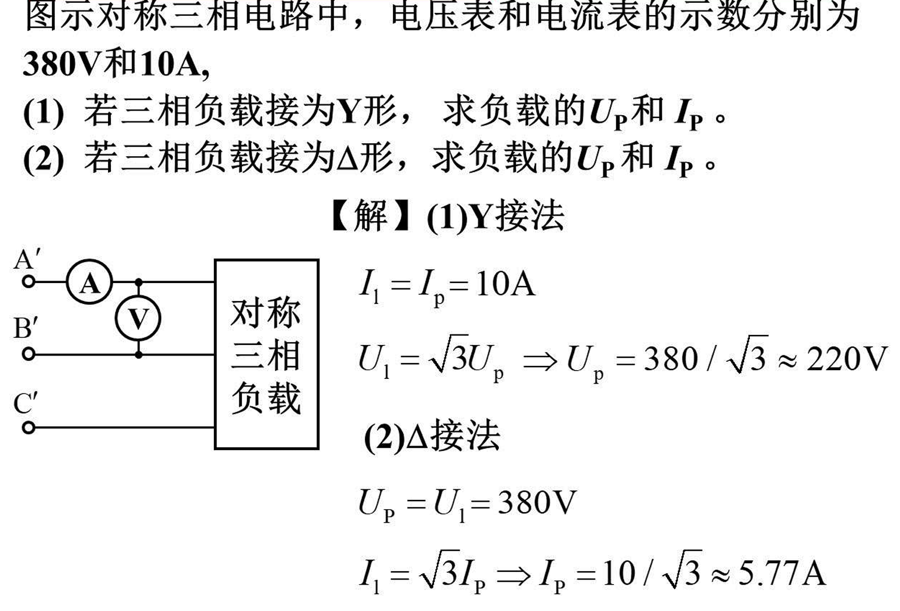
## 5.3 对称三相电路的计算

### 一、对称 Y-Y 联结电路的计算
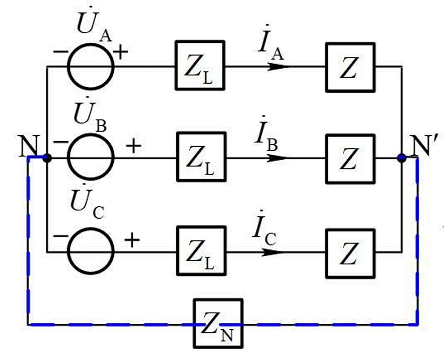
对 N' 点列节点电压方程：
$$(\frac{3}{Z_L + Z} + \frac{1}{Z_N})\dot{U}_{N'N} = \frac{\dot{U}_A + \dot{U}_B + \dot{U}_C}{Z_L + Z}$$

由于三相电源对称，$\dot{U}_A + \dot{U}_B + \dot{U}_C = 0$，所以 $\dot{U}_{N'N} = 0$。

**Y-Y 联结对称三相电路的特点**：
1. Y形联结的各中性点是等电位的（$\dot{U}_{N'N} = 0$），中性线电流恒为零，中线阻抗对各相电压电流分布无影响
2. 由于中性点等电位，各相电流仅决定于各自相电压和相阻抗值，各相计算具有**独立性**。计算时可把各中性点相连组成单相图，任取一相计算
3. 因为电路中任一组相/线电压和电流是对称的，当用单相图计算出一组相电压和电流后，其余两相可由对称性直接得到

### 二、复杂对称三相电路的计算

**基本思路**：化为单相电路进行计算。

**计算步骤**：
1. 把各三角形联结的电源和负载都**等效变换为星形联结**（$Z_Y = \frac{1}{3}Z_{\Delta}$）
2. 画一条无阻抗的假想中线，把电源和负载的中性点连接起来（原有中线阻抗被假想中线短路）
3. **取出一相**进行计算
4. 根据对称关系推算其它相（线）电压、电流

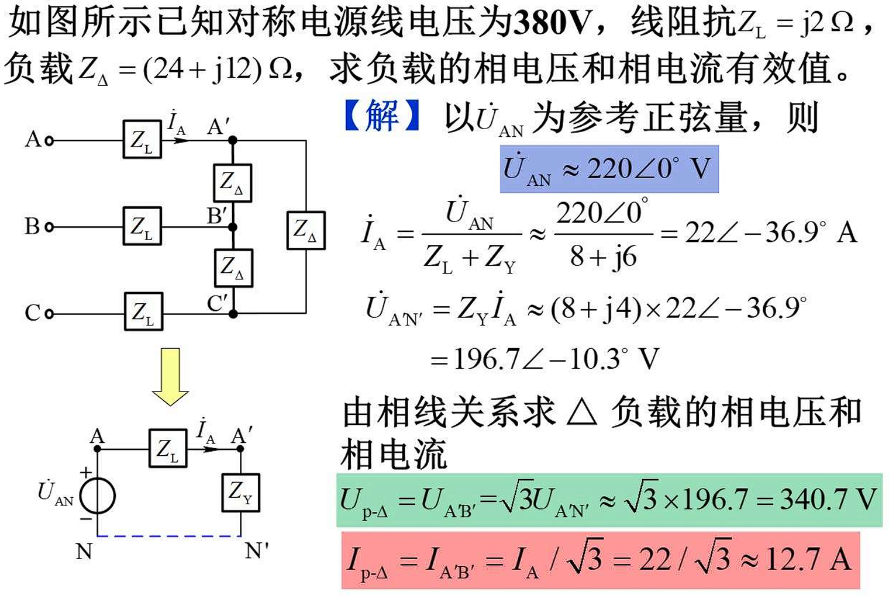
## 5.4 不对称三相电路

当三相电路中电源电压或电路参数不对称时，电路中的电流一般将不再对称，这种电路称为不对称三相电路。

**分析方法**：不对称三相电路不能简化为单相计算，需要按一般正弦电路的方法进行求解（如节点电压法、回路电流法等）。

## 5.5 三相电路的功率

**对称三相电路的有功功率**：$P = 3U_p I_p \cos \varphi = \sqrt{3}U_l I_l \cos \varphi$

**对称三相电路的无功功率**：$Q = 3U_p I_p \sin \varphi = \sqrt{3}U_l I_l \sin \varphi$

**对称三相电路的视在功率**：$S = 3U_p I_p = \sqrt{3}U_l I_l$

其中 $\varphi$ 为相电压与相电流的相位差（即单相负载的阻抗角）。

**对称三相电路瞬时功率的特点**：对称三相电路的瞬时功率恒定，等于有功功率，不随时间变化。

---
