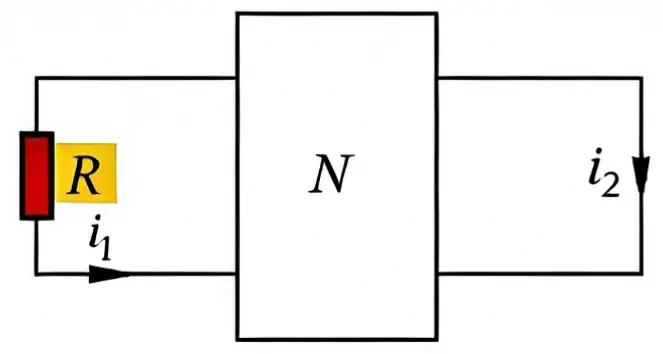
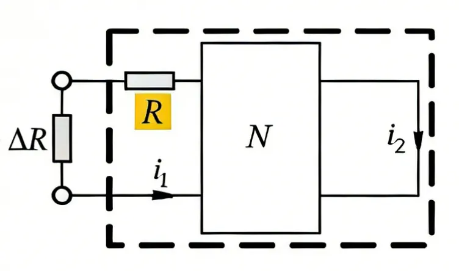
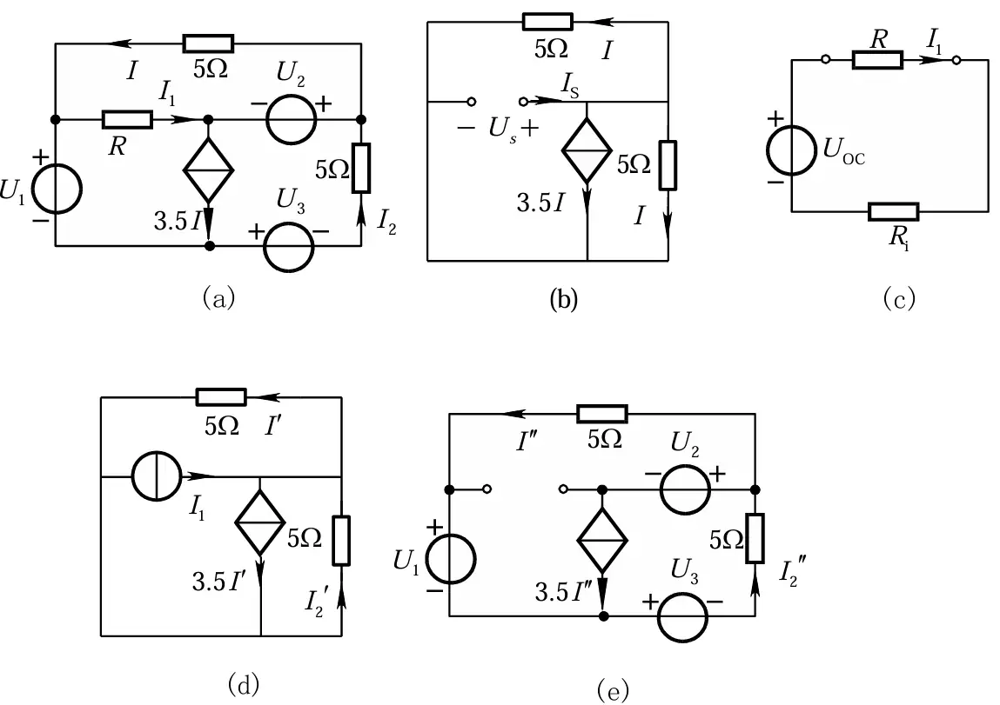

# 例1
图示电路中，$N$为线性含源电阻网络。已知$i_1 = 2\text{A}$时，$i_2 = \frac{1}{3}\text{A}$；当$R$增加$10\Omega$时，$i_1 = 1.5\text{A}$，$i_2 = 0.5\text{A}$。求：当$R$减少$10\Omega$时，$i_2$的值。

解：

不妨将除$\Delta R$以外的元件等效为一个电压源和一个内阻的串联组合。于是有：
$$i_1 = \frac{U_{oc}}{R_i+\Delta R}$$
代入数据可得：
$$
\begin{cases}
2\text{A} = \dfrac{U_{oc}}{R_i}\quad &\leftarrow \Delta R = 0 \\
1.5\text{A} = \dfrac{U_{oc}}{R_i + 10\Omega} &\leftarrow \Delta R = 10\Omega
\end{cases}
$$
解出
$$
\begin{cases}
U_{oc} = 60\text{V} \\
R_i = 30\Omega
\end{cases}
$$
当$R$减少$10\Omega$时，$\Delta R = -10\Omega$，则
$$
i_1 = \frac{U_{oc}}{R_i + \Delta R} = \frac{60\text{V}}{30\Omega - 10\Omega} = 3\text{A}
$$
根据叠加原理，将$\Delta R$和$R+N$分别看成两个独立的激励源（$\Delta R$可以等效为一个电流源），$i_2$的值为两者的叠加，不妨设两者单独作用时$i_2$的值分别为$i_{\Delta R}$和$i_{N}$，而线性电路中，各部分满足线性关系，故$i_{\Delta R} = k i_1$，则
$$
i_2 = k i_1 + i_{\Delta R}
$$
易得
$$
k = -\frac{1}{3}, \quad i_{\Delta R} = 1 \text{A}
$$
于是
$$
i_2\Big|_{\Delta R = -10\Omega} = k i_1 + i_{\Delta R}\Big|_{i_1=3\text{A}} = -\frac{1}{3} \times 3\text{A} + 1\text{A} = 0
$$

# 例2
电路如图(a)所示，已知当 $R=2\Omega$ 时，$I_1 = 5\text{A}$，$I_2 = 4\text{A}$。求当 $R=4\Omega$ 时 $I_1$ 和 $I_2$ 的值。

解：应用戴维南定理求 $I_1$。由图 (b) 有
$$
\begin{cases}
    U_s = 5 \Omega I\\
    I_s = I + I + 3.5I = 5.5I
\end{cases}
$$
等效电阻
$$
R_i = \frac{U_s}{I_s} = \frac{10}{11}\Omega
$$
又由已知条件得
$$
U_{oc} = (R_i + 2\Omega) \times I_1 = \frac{160}{11}\text{V}
$$
简化后的电路如图 (c) 所示。
所以当 $R=4\Omega$ 时
$$
I_1 = \frac{U_{oc}}{R + R_i} = \frac{\frac{160}{11}\text{V}}{(4 + \frac{10}{11})\Omega} = \frac{80}{27}\text{A}
$$

将 $I_1$ 用电流源来置换，用叠加定理分析置换后的电路，即将 $I_2$ 分解成
$$
I_2 = I_2' + I_2''
$$
其中 $I_2'$ 为电流源 $I_1$ 单独作用时的解答，如图 (d) 所示；$I_2''$ 是其余电源共同作用时的解答，如图 (e) 所示。由图 (d) 可得：

$$
\begin{cases}
    \text{KVL: }\quad 5\Omega I_2' + 5\Omega I' = 0 \\
    \text{KCL: }\quad -I_1 + 3.5I' - I_2' + I' = 0
\end{cases}
$$

联立解得
$$
I_2' = -\frac{2}{11}I_1
$$
因此，电流 $I_2$ 可以写成：$I_2 = I_2' + I_2'' = -\frac{2}{11}I_1 + I_2''$
由已知条件得
$$
4\text{A} = -\frac{2}{11} \times 5\text{A} + I_2'' \implies I_2'' = \frac{54}{11}\text{A}
$$
所以，当 $R=4\Omega$ 时，
$$
I_2 = -\frac{2}{11} \times \frac{80}{27}\text{A} + \frac{54}{11}\text{A}=\frac{118}{27}\text{A}
$$
