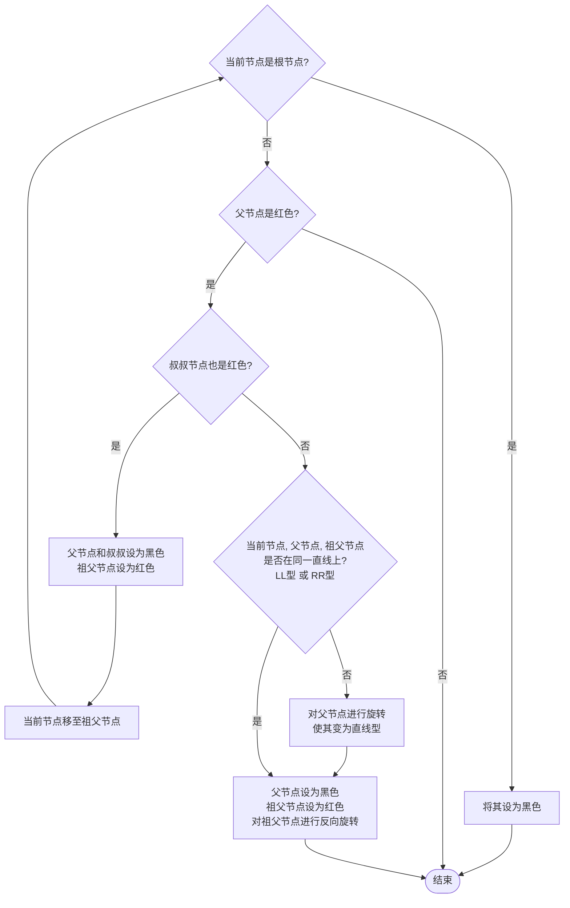
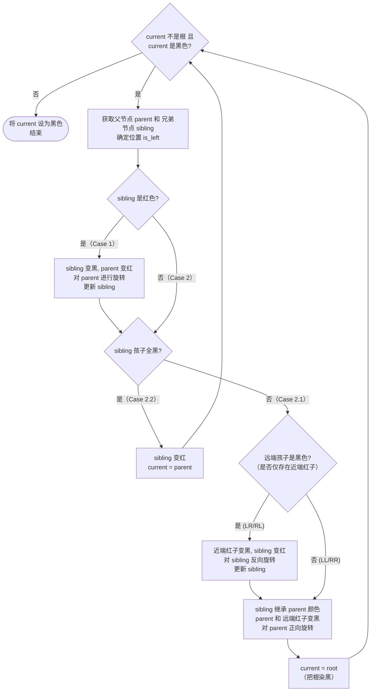
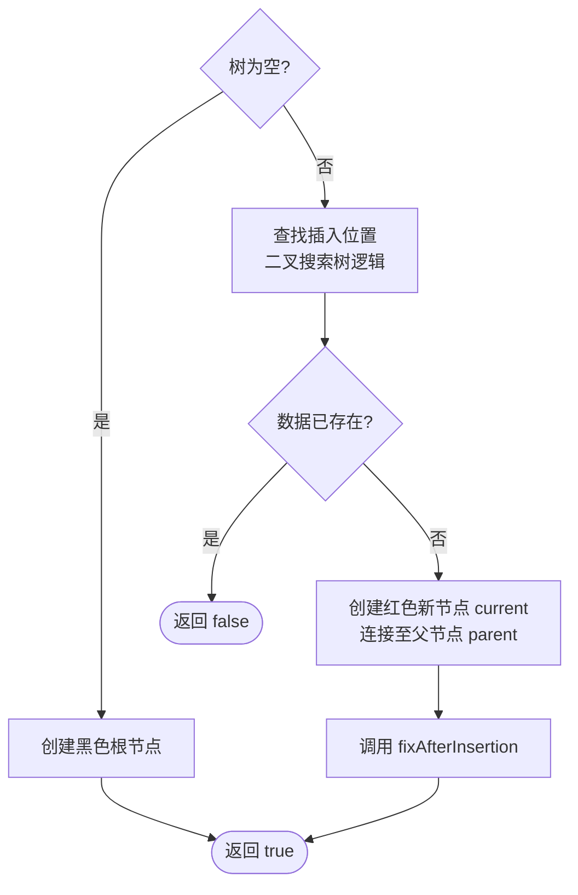
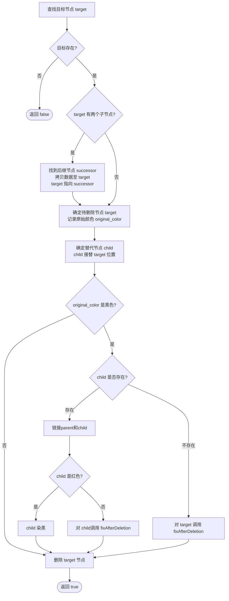

# 红黑树

在上一篇博客中，我们实现了一个基于二叉树基类的AVL树。而红黑树也是一种自平衡二叉搜索树，但在平衡条件和调整方式上与AVL树有所不同。

> [!warning]
> 以下代码仅供参考，实际应用中可能需要根据具体需求进行调整和优化。

## 红黑树的性质

红黑树满足以下性质：

1. 每个节点要么是红色，要么是黑色。
2. 根节点必须是黑色。
3. 每个叶子节点（NIL节点）都是黑色的。
4. 如果一个节点是红色的，则它的两个子节点必须是黑色的（即不能有两个连续的红色节点）。
5. 从任一节点到其所有后代叶子节点的路径上必须包含相同数目的黑色节点。

## 红黑树的代码结构

同样的，红黑树有一个基于二叉树的节点类 `RedBlackNode` 和一个红黑树类 `RedBlackTree`。
节点类与AVL树的节点类类似，但增加了一个颜色属性来表示节点的颜色（红色或黑色）。
在红黑树类中，我们需要实现以下功能：

- 插入节点：实现一个方法来插入节点，并在插入后检查树的平衡状态，进行必要的旋转操作和颜色调整。
- 删除节点：实现一个方法来删除节点，并在删除后检查树的平衡状态，进行必要的旋转操作和颜色调整。
- 修正调整：
  - 双红修正：当插入一个红色节点导致父节点也是红色时，需要进行修正操作来恢复平衡。
  - 双黑修正：当删除一个黑色节点导致树不平衡时，需要进行修正操作来恢复平衡。
- 旋转操作：实现左旋、右旋方法，用于调整树的结构以保持平衡。
- 判断是否满足红黑树性质：实现一个方法来判断红黑树是否满足其性质，可以通过检查节点的颜色和结构来判断。

## 红黑树的代码结构

### 红黑树节点类

一个红黑树节点类 `RBNode` 包含以下属性：

- `data`：节点存储的数据。
- `color`：节点的颜色，通常用一个布尔值表示（例如，True表示红色，False表示黑色）。
- `left_child`：指向左子节点的指针。
- `right_child`：指向右子节点的指针。
- `parent`：指向父节点的指针。
  > [!note]
  > 虽然一般`color`属性可以用布尔值表示，但为了代码的可读性，这里我使用枚举类型来表示节点的颜色。

  > 孩子指针也可以用指针数组来表示，可以减少代码量，但为了代码的可读性，这里我使用单独的属性来表示左右子节点。
  >
  > 在节点类中，就不实现获取颜色或者设置颜色的方法了，因为由于红黑树对空节点的特殊处理，空节点（NIL节点）通常被视为黑色，而节点类中的颜色属性只适用于非空节点，因此在节点类中不需要实现获取颜色或者设置颜色的方法。对于空节点，我们可以在红黑树类中统一处理，将其视为黑色即可。

### 红黑树类

一个红黑树类 `RBTree` 包含以下属性和方法：

- `root`：指向树根节点的指针。
- `insert`：插入节点的方法，接受一个数据值作为参数，在树中插入一个新的节点，并进行必要的调整以保持红黑树的性质。
- `erase`：删除节点的方法，接受一个数据值作为参数，在树中删除对应的节点，并进行必要的调整以保持红黑树的性质。
- `rotate`：旋转方法，接受一个节点和旋转方向作为参数，执行左旋或右旋操作以调整树的结构。
- `fixAfterInsertion`：修正插入后树不平衡的方法，进行双红修正，参数：双红节点。
- `fixAfterDeletion`：修正删除后树不平衡的方法，进行双黑修正，参数：双黑节点。
- `checkValid`：判断树是否满足红黑树性质的方法，返回一个布尔值表示树是否有效。
- `setColor`：设置节点颜色的方法，接受一个节点和颜色值作为参数，设置节点的颜色。
- `getColor`：获取节点颜色的方法，接受一个节点作为参数，返回节点的颜色值。
  可以看到，红黑树的代码结构与AVL树类似，同时增加了颜色属性和相关的调整方法来维护红黑树的性质。
  除此之外，旋转方法相较上一篇博客中的AVL树旋转方法进行了升级，将两种旋转（左旋和右旋）合并成一个方法，并通过参数来指定旋转方向，这样可以减少代码量并提高代码的可读性。~~上一篇博客中没这样写是因为我菜~~

# 具体代码实现

同样的逐段讲解代码实现，以下是红黑树的具体代码实现：

## RBTreeNode类

```cpp title="RBTree.hpp"
#ifndef RBTREE_HPP
#define RBTREE_HPP

#include "binaryTree.hpp"

namespace mystruct {
    template<class Data>
    class RBTreeNode : public treeNode<Data, RBTreeNode<Data> > {

        using BaseNode = treeNode<Data, RBTreeNode<Data> >;

        template<class Node>
        friend class RBTree;

        friend bool operator<(const RBTreeNode<Data> &lhs, const RBTreeNode<Data> &rhs);

    protected:
        RBTreeNode *parent;

        enum Color {
            BLACK,
            RED
        } color;

    public:
        RBTreeNode() = delete;

        explicit RBTreeNode(Data data) : BaseNode(std::move(data)), parent(nullptr), color(RED) {
        }

        RBTreeNode(const RBTreeNode &) = delete;
        RBTreeNode &operator=(const RBTreeNode &) = delete;
        RBTreeNode(RBTreeNode &&) = delete;
        RBTreeNode &operator=(RBTreeNode &&) = delete;
    };

    template<typename Data>
    bool operator<(const RBTreeNode<Data> &lhs, const RBTreeNode<Data> &rhs) {
        return lhs.data < rhs.data;
    }
```

~~其实也没什么好说的，和上一篇博客中的AVL树节点类基本一样，只是增加了一个颜色属性来表示节点的颜色（红色或黑色），以及一个指向父节点的指针。~~

## RBTree类

```cpp title="RBTree.hpp" startLineNumber=50
        template<typename Data>
    class RBTree : public binaryTree<RBTreeNode<Data> > {
        using RBNode = RBTreeNode<Data>;
        using BaseTree = binaryTree<RBNode>;

    public:
        RBTree() = default;
    private:
```

### 旋转函数

```cpp title="RBTree.hpp" startLineNumber=56
        void rotate(RBNode *node, const bool left) {
            RBNode *child;
            RBNode *parent = node->parent;
            if (left) {
                child = node->right_child;
                node->right_child = child->left_child;
                if (child->left_child) child->left_child->parent = node;
            } else {
                child = node->left_child;
                node->left_child = child->right_child;
                if (child->right_child) child->right_child->parent = node;
            }

            child->parent = parent;
            if (!parent) this->root = child;
            else if (node == parent->left_child) parent->left_child = child;
            else parent->right_child = child;

            if (left) child->left_child = node;
            else child->right_child = node;
            node->parent = child;
        }
```

就是把上一篇博客中的AVL树的两种旋转（左旋和右旋）合并成一个方法，并通过参数来指定旋转方向，这样可以减少代码量并提高代码的可读性~~（好像更难读了）~~。

### 一些基本工具函数

```cpp title="RBTree.hpp" startLineNumber=77
        bool checkValidRecursive(RBNode *node, int currentBlackHeight, int &blackHeight) const {
            if (!node) {
                if (blackHeight == -1) blackHeight = currentBlackHeight;
                return currentBlackHeight == blackHeight;
            }

            // 性质 4: 红色节点的孩子必须是黑色
            if (node->color == RBNode::RED) {
                if (getColor(node->left_child) == RBNode::RED || getColor(node->right_child) == RBNode::RED)
                    return false;
            }

            if (node->color == RBNode::BLACK) currentBlackHeight++;

            return checkValidRecursive(node->left_child, currentBlackHeight, blackHeight) &&
                   checkValidRecursive(node->right_child, currentBlackHeight, blackHeight);
        }

        static typename RBNode::Color getColor(RBNode *node) {
            return node ? node->color : RBNode::BLACK;
        }

        static void setColor(RBNode *node, typename RBNode::Color color) {
            if (node) node->color = color;
        }
```

这些函数分别用于检查树是否满足红黑树性质、获取节点颜色和设置节点颜色。

- `checkValidRecursive`：递归检查树是否满足红黑树性质，特别是检查性质4（红色节点的孩子必须是黑色）和性质5（从任一节点到其所有后代叶子节点的路径上必须包含相同数目的黑色节点）。~~其实不写也没关系，毕竟这个函数主要是用来验证树的正确性的，不是红黑树的核心功能。~~
- `getColor`：获取节点颜色，如果节点为`nullptr`（即NIL节点），则返回黑色。
- `setColor`：设置节点颜色，如果节点不为`nullptr`，则设置其颜色。

### 双红修正

#### 双红修正的步骤

当一个节点为红色且其父节点也是红色时，违反了性质4（红节点不能有红孩子），需要进行修正。可分为两种情况：

1. 叔叔节点为红色
2. 叔叔节点为黑色（或叔叔节点不存在）

##### Case 1：叔叔节点为红色

将父节点和叔叔节点染黑，祖父节点染红，然后将“当前节点”上移到祖父，继续向上检查。

##### Case 2：叔叔节点为黑色

此时需要根据当前节点的位置进行旋转调整：

1. **LL** （父节点是祖父的左孩子，当前节点是父节点的左孩子）：将父节点染黑，祖父节点染红，然后对祖父节点进行右旋。
2. **LR** （父节点是祖父的左孩子，当前节点是父节点的右孩子）：先对父节点进行左旋，将其转成LL的结构，转到1的情况。
3. **RR** （父节点是祖父的右孩子，当前节点是父节点的右孩子）：将父节点染黑，祖父节点染红，然后对祖父节点进行左旋。
4. **RL** （父节点是祖父的右孩子，当前节点是父节点的左孩子）：先对父节点进行右旋，将其转成RR的结构，转到3的情况。

#### 流程图



#### 代码实现

```cpp title="RBTree.hpp" startLineNumber=110
        void fixAfterInsertion(RBNode *current) {
            while (current != this->root && getColor(current->parent) == RBNode::RED) {
                RBNode *parent = current->parent;
                RBNode *grandparent = parent->parent;
                bool is_left = (parent == grandparent->left_child);
                RBNode *uncle = is_left ? grandparent->right_child : grandparent->left_child;

                if (getColor(uncle) == RBNode::RED) {
                    setColor(parent, RBNode::BLACK);
                    setColor(uncle, RBNode::BLACK);
                    setColor(grandparent, RBNode::RED);
                    current = grandparent;
                } else {
                    if (current == (is_left ? parent->right_child : parent->left_child)) {
                        current = parent;
                        rotate(current, is_left);
                        parent = current->parent;
                    }
                    setColor(parent, RBNode::BLACK);
                    setColor(grandparent, RBNode::RED);
                    rotate(grandparent, !is_left);
                }
            }
            this->root->color = RBNode::BLACK;
        }
```

### 双黑修正

当删除一个黑色节点时，可能违反性质5（从任一节点到其所有后代叶子节点的路径上必须包含相同数目的黑色节点），此时需要进行双黑修正来恢复平衡。
双黑节点：认为该节点额外多加上一个黑色，使得路径上的黑色节点数增加1。一般来说，双黑节点可以是一个实际存在的节点（如果被删除的节点有一个黑色子节点），也可以是一个虚拟的NIL节点（如果被删除的节点没有子节点）。无论是哪种情况，双黑修正的目标都是通过旋转和颜色调整来恢复红黑树的性质。

#### 双黑修正的步骤

双黑修正会遇到下列情况：

1. 兄弟节点为红色
2. 兄弟节点为黑色
   2.1 兄弟节点至少一个子节点为红色
   2.2 兄弟节点的两个子节点都是黑色

##### Case 1：兄弟节点为红色

将兄弟节点染黑，父节点染红，然后对父节点进行旋转（朝双黑节点方向），使兄弟节点成为新的父节点。旋转后，新的兄弟节点为黑色，进入Case 2的情况。

##### Case 2：兄弟节点为黑色

###### Case 2.1 兄弟节点至少一个子节点为红色

根据兄弟节点和红子节点的位置，可以分为以下四种旋转情况：

1. **LL型**（兄弟是父的左孩子，兄弟的左孩子是红色）：将兄弟染成**父节点的原色**，父节点和红子节点染黑，对父节点进行**右旋**。
2. **LR型**（兄弟是父的左孩子，兄弟的右孩子是红色）：将红子节点染黑，兄弟节点染红，对兄弟进行**左旋**。此时结构变为了 **LL型**，按上述情况 1 处理。
3. **RR型**（兄弟是父的右孩子，兄弟的右孩子是红色）：将兄弟染成**父节点的原色**，父节点和红子节点染黑，对父节点进行**左旋**。
4. **RL型**（兄弟是父的右孩子，兄弟的左孩子是红色）：将红子节点染黑，兄弟节点染红，对兄弟进行**右旋**。此时结构变为了 **RR型**，按上述情况 3 处理。

###### Case 2.2 兄弟节点的两个子节点都是黑色

将兄弟节点染红，如果父节点是红色，则将父节点染黑，修复完成；如果父节点是黑色，则将父节点视为新的双黑节点，继续向上检查。

#### 流程图



> [!note]
> 近端和远端：图中的近端指离双黑节点较近的一侧，远端指离双黑节点较远的一侧。
> 
> 正向和反向的概念：在双黑修正中，正向指的是向双黑节点所在的方向进行旋转，反向指的是向与双黑节点相反的方向进行旋转。

#### 代码实现

```cpp title="RBTree.hpp" startLineNumber=150
        void fixAfterDeletion(RBNode *current) {
            while (current != this->root && getColor(current) == RBNode::BLACK) {
                RBNode *parent = current->parent;
                if (!parent) break;
                bool is_left = (current == parent->left_child);
                RBNode *sibling = is_left ? parent->right_child : parent->left_child;

                if (getColor(sibling) == RBNode::RED) {
                    setColor(sibling, RBNode::BLACK);
                    setColor(parent, RBNode::RED);
                    rotate(parent, is_left);
                    sibling = is_left ? parent->right_child : parent->left_child;
                }

                if (getColor(sibling->left_child) == RBNode::BLACK
                && getColor(sibling->right_child) == RBNode::BLACK) {
                    setColor(sibling, RBNode::RED);
                    current = parent;
                } else {
                    if (getColor(is_left ? sibling->right_child : sibling->left_child) == RBNode::BLACK) {
                        setColor(is_left ? sibling->left_child : sibling->right_child, RBNode::BLACK);
                        setColor(sibling, RBNode::RED);
                        rotate(sibling, !is_left);
                        sibling = is_left ? parent->right_child : parent->left_child;
                    }
                    setColor(sibling, getColor(parent));
                    setColor(parent, RBNode::BLACK);
                    setColor(is_left ? sibling->right_child : sibling->left_child, RBNode::BLACK);
                    rotate(parent, is_left);
                    current = this->root;
                    break;
                }
            }
            setColor(current, RBNode::BLACK);
        }
```

### 插入函数

#### 流程图



#### 代码实现

```cpp title="RBTree.hpp" startLineNumber=200
    public:
        bool insert(const Data &data) {
            if (!this->root) {
                this->root = new RBNode(data);
                this->root->color = RBNode::BLACK;
                return true;
            }

            RBNode *current = this->root, *parent = nullptr;
            while (current) {
                if (data == current->data) return false;
                parent = current;
                current = (data < current->data) ? current->left_child : current->right_child;
            }

            current = new RBNode(data);
            current->parent = parent;
            (data < parent->data ? parent->left_child : parent->right_child) = current;

            fixAfterInsertion(current);
            return true;
        }
```

### 删除函数

#### 流程图



#### 代码实现

```cpp title="RBTree.hpp" startLineNumber=250
        bool erase(const Data &data) {
            RBNode *target = this->root;
            while (target && target->data != data)
                target = (data < target->data) ? target->left_child : target->right_child;

            if (!target) return false;

            typename RBNode::Color original_color = target->color;

            if (target->left_child && target->right_child) {
                RBNode *successor = target->right_child;
                while (successor->left_child) successor = successor->left_child;
                original_color = successor->color;
                const_cast<Data &>(target->data) = successor->data;
                target = successor;
            }

            RBNode *child = target->left_child ? target->left_child : target->right_child;
            RBNode *parent = target->parent;
            if (child) {
                child->parent = parent;
                if (!parent) this->root = child;
                else if (parent->left_child == target) parent->left_child = child;
                else parent->right_child = child;

                if (original_color == RBNode::BLACK) {
                    if (getColor(child) == RBNode::RED) setColor(child, RBNode::BLACK);
                    else fixAfterDeletion(child);
                }
            }
            else {
                if (original_color == RBNode::BLACK) fixAfterDeletion(target);

                if (!target->parent) this->root = nullptr;
                else if (target->parent->left_child == target) target->parent->left_child = nullptr;
                else target->parent->right_child = nullptr;
            }

            target->left_child = target->right_child = nullptr;
            delete target;
            return true;

        }
```

### 验证函数

```cpp title="RBTree.hpp" startLineNumber=300
        [[nodiscard]] bool isValid() const {
            if (!this->root) return true;
            if (this->root->color != RBNode::BLACK) return false;

            int blackHeight = -1;
            return checkValidRecursive(this->root, 0, blackHeight);
        }
    };
}
#endif // RBTREE_HPP
```

# 结语

## 与AVL树的比较

红黑树和AVL树都是自平衡二叉搜索树，但它们在平衡策略和性能方面有一些区别：

1. **平衡策略**：AVL树通过严格的平衡条件（每个节点的左右子树高度差不超过1）来保持平衡，而红黑树通过颜色属性和旋转操作来维持较为宽松的平衡条件（从任一节点到其所有后代叶子节点的路径上必须包含相同数目的黑色节点）。
2. **性能**：
   - AVL树在查找操作上通常比红黑树更快，因为它更严格地保持平衡，但在插入和删除操作上需要相对更多的旋转来恢复平衡。
   - 红黑树在插入和删除操作上通常比AVL树更快，因为它允许更宽松的平衡条件，但在查找操作上有时慢于AVL树。
3. **使用场景**：AVL树适用于读操作频繁且对性能要求较高的场景，而红黑树适用于插入和删除操作较多的场景，如内存管理、数据库索引等。
4. **实现复杂度**：AVL树的实现相对较简单，因为它只需要维护节点的高度信息，而红黑树需要维护节点的颜色属性，并且在插入和删除时需要处理更多的旋转和颜色调整情况。~~写红黑树真的比写AVL树麻烦多了。~~

## 结论

红黑树的重要性在于它提供了一种高效的自平衡二叉搜索树实现，广泛应用于各种数据结构和算法中，尽管无论是理解还是实现都比AVL树更复杂，但它在实际应用中表现出色，所以有必要深入学习和掌握红黑树的原理和实现细节~~不得不学~~。
