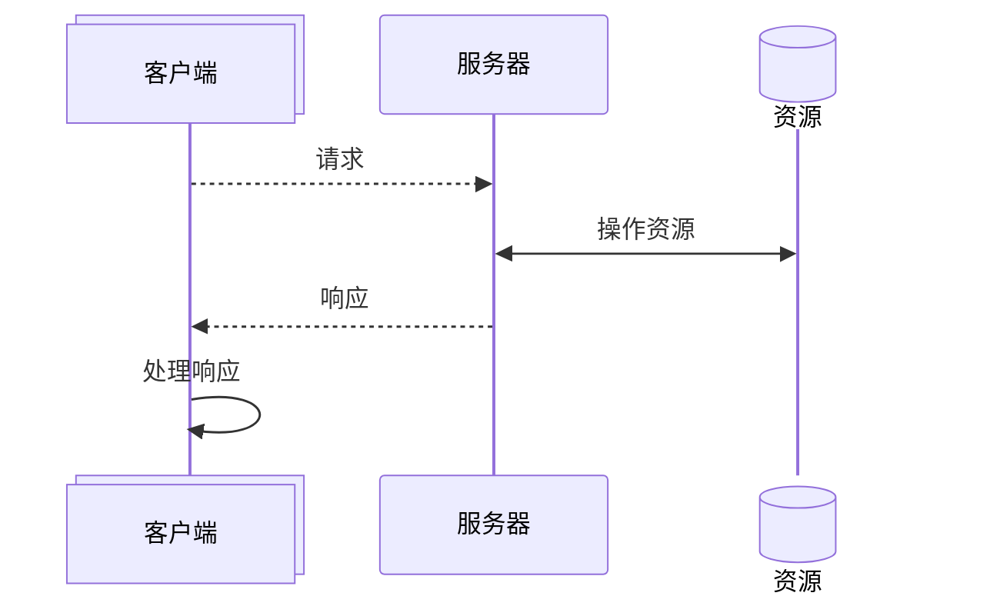
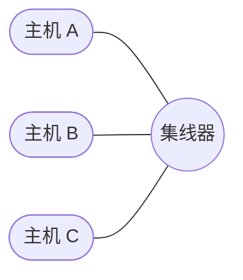
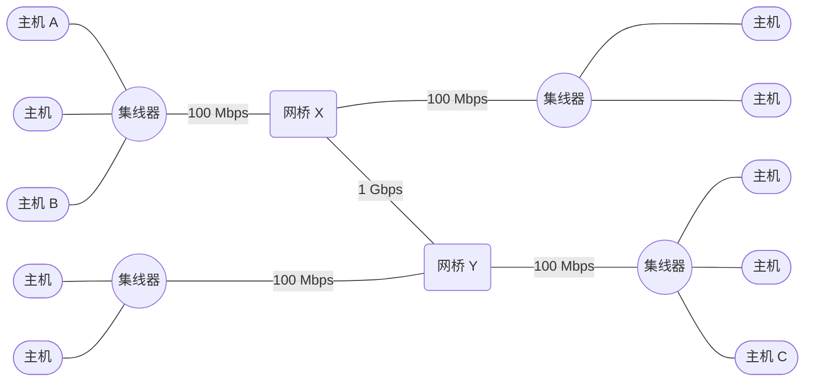
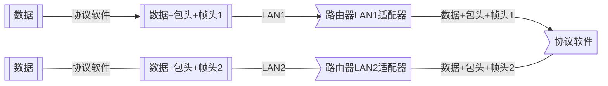
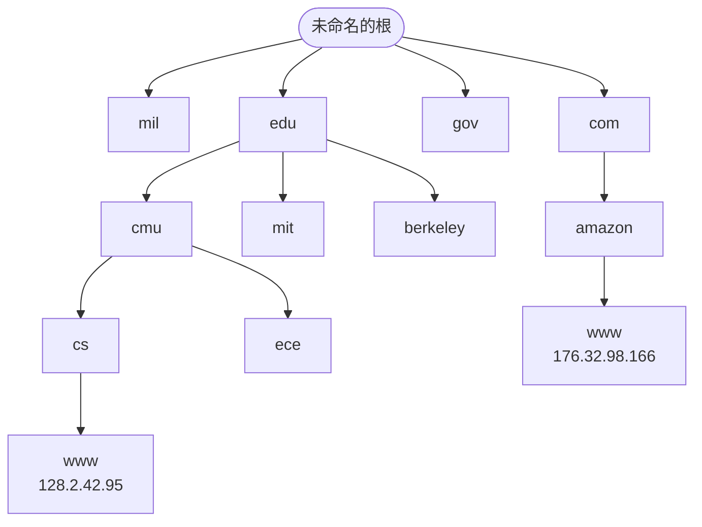

网络应用随处可见。浏览 Web、发送 email、玩在线游戏，都在使用网络应用。所有网络应用都基于相同的基本编程模型，有相似的整体逻辑结构，依赖相同的编程接口。

> [!summary] 本章内容
> 网络应用依赖很多已学过的概念：进程、信号、字节顺序、内存映射、动态内存分配。本章还要掌握新概念：
>
> - 客户端—服务器编程模型
> - 如何编写使用因特网服务的客户端—服务器程序
> - 如何把这些概念组合成一个功能齐全的 Web 服务器
>
> 最后，真正开发一个 Tiny Web 服务器，能处理 HTTP 请求，返回静态文件和动态内容。

---

# 第一部分 客户端-服务器模型与网络

## 11.1 客户端—服务器编程模型

每个网络应用都基于**客户端—服务器模型**。一个应用由一个服务器进程和一个或多个客户端进程组成。

服务器管理某种资源，并通过操作资源为客户端提供服务。例如：

- Web 服务器管理磁盘文件，代表客户端检索和执行
- FTP 服务器管理磁盘文件，为客户端存储和检索
- 电子邮件服务器管理文件，为客户端读和更新

客户端—服务器模型中的基本操作是**事务**（transaction）。一个事务由四步组成：

1. 客户端向服务器发送请求，发起事务
2. 服务器收到请求，解释它，并操作资源
3. 服务器给客户端发送**响应**，并等待下一个请求
4. 客户端收到响应并处理它



> [!caution] 客户端和服务器是进程
> 一台主机可以同时运行多个客户端和服务器。事务可以在同一台或不同主机上进行。

> [!info] 与数据库事务的区别
> 客户端—服务器事务不是数据库事务，没有数据库事务的任何特性，例如原子性。在我们的上下文中，事务仅仅是客户端和服务器执行的一系列歩骤。

## 11.2 网络

客户端和服务器通常运行在不同主机上，通过**计算机网络**通信。

对主机而言，网络只是又一种 I/O 设备，是数据源和数据接收方。一个插到 I/O 总线扩展槽的适配器提供到网络的物理接口。接收的数据从适配器经 I/O 和内存总线复制到内存，通常通过 DMA（直接内存访问）传送；数据也能从内存复制到网络。

### 11.2.1 局域网与以太网

物理上，网络按地理远近组成层次系统。最低层是 **LAN**（Local Area Network，局域网），覆盖一个建筑或校园。

最流行的局域网技术是**以太网**（Ethernet），由施乐 PARC 在 20 世纪 70 年代中期提出。以太网从 3 Mb/s 演变到 10 Gb/s。

一个**以太网段**包括电缆（一般是双绞线）和一个**集线器**（hub），通常覆盖一个房间或楼层。每根电缆有相同的最大位带宽（通常是 100 Mb/s 或 1 Gb/s），集线器不加分辨地把从一个端口收到的每个位复制到其他所有端口，每台主机都能看到每个位。



每个以太网适配器有全球唯一的 48 位地址，存储在非易失性存储器中。主机发送的位称为**帧**（frame），包含：

- 固定长度的**头部**位
  - 标识源地址、目的地址和帧长度
- 数据位：**有效载荷**（payload）

所有主机适配器都能看到帧，但只有目的主机读取它。

多个以太网段通过**网桥**（bridge）连接成**桥接以太网**，可跨越整个建筑或校区。



网桥比集线器更充分利用带宽——它随时间学习哪个主机通过哪个端口可达，只在必要时有选择地复制帧。

> [!example]
> 如果主机 A 发送一个帧到同网段上的主机 B，当该帧到达网桥 X 的输入端口时，X 就将丢弃此帧，因而节省了其他网段上的带宽。然而，如果主机 A 发送一个帧到一个不同网段上的主机 C，那么网桥 X 只会把此帧复制到和网桥 Y 相连的端口上，网桥 Y 会只把此帧复制到与主机 C 的网段连接的端口。

### 11.2.2 互联网络

在更高层次，多个不兼容的局域网通过**路由器**（router）连接成 internet（互联网络）。每台路由器对每个连接的网络有一个适配器（端口），也能连接高速点到点电话连接，即 **WAN**（Wide-Area Network，广域网），可用各种局域网和广域网构建互联网络。

> [!info] Internet 和 internet
> 小写 internet 指一般概念；大写 Internet 指具体实现，即全球 IP 因特网。

互联网络的关键特性：它能由完全不同的、不兼容的技术组成。问题是：源主机如何跨过不兼容的网络发送数据到目的主机？

解决办法是一层运行在每台主机和路由器上的协议软件。这个协议必须提供两种基本能力：

- **命名机制**：定义一致的主机地址格式，每台主机分配至少一个互联网络地址
- **传送机制**：定义把数据位捆扎成**包**（packet）的统一方式，包由包头和有效载荷组成

### 11.2.3 数据如何跨网络传送



数据从主机 A 传送到主机 B 有 8 个基本步骤：

1. 客户端系统调用，从虚拟地址空间复制数据到内核缓冲区
2. 协议软件附加互联网络包头和 LAN1 帧头，创建 LAN1 帧，传送给适配器
3. LAN1 适配器复制帧到网络
4. 帧到达路由器，LAN1 适配器读取并传送到协议软件
5. 路由器提取目的地址，用路由表确定转发方向，剥落旧帧头，加新帧头
6. 路由器的 LAN2 适配器复制帧到网络
7. 帧到达主机 B，适配器读取并传送到协议软件
8. 协议软件剥落包头和帧头，数据复制到服务器虚拟地址空间

> [!important] 封装是关键
> LAN1 帧的有效载荷是互联网络包，互联网络包的有效载荷是用户数据。这种封装是网络互联的基本方法。

## 11.3 全球 IP 因特网

全球 IP 因特网是最著名、最成功的互联网络实现，从 1969 年起以这样或那样的形式存在。

每台因特网主机运行实现 **TCP/IP** 协议（Transmission Control Protocol / Internet Protocol，传输控制协议/互联网络协议）的软件。因特网客户端和服务器混合使用**套接字接口**函数和 Unix I/O 函数通信。

> [!tip] 协议分层
> 网络协议以分层方式组织，每层提供服务给上一层，使用下一层的服务。每层有自己的协议，定义了如何使用该层的服务。
>
> 具体来说，网络协议有五层：
>
> 1. 应用层：定义了应用程序如何使用运输层和网络层服务，比如 HTTP、FTP、SMTP、DNS
>    - 这一层的数据称为**报文**（message）
> 2. 运输层：定义了进程间通信的服务，比如 TCP、UDP
>    - 这一层的数据称为**段**（segment）
> 3. 网络层：定义了主机间通信的服务，比如 IP、ICMP、ARP
>    - 这一层的数据称为**数据报**（datagram）
> 4. 链路层：定义了主机和路由器如何在局域网或广域网上发送数据，比如以太网、WiFi
>    - 这一层的数据称为**帧**（frame）
> 5. 物理层：定义了如何在物理媒体上传送比特流，比如电缆、光纤、无线电波

TCP/IP 是一个协议族，提供运输层和网络层服务：

- 运输层：
  - TCP 提供进程间可靠全双工字节流服务
  - UDP 提供进程间不可靠数据报服务
- 网络层：
  - IP 定义了在数据报中的各个字段以及端系统和路由器如何作用于这些字段

从程序员角度，因特网是一个世界范围的主机集合：

- 主机集合映射为一组 32 位 **IP 地址**
- IP 地址映射为一组**因特网域名**（internet domain name）的标识符
- 因特网主机上的进程能通过**连接**（connection）和任何其他因特网主机上的进程通信

> [!info] IPv4 和 IPv6
> 最初的因特网协议使用 32 位地址，称 IPv4。1996 年 IETF 提出 IPv6，使用 128 位地址。但直到 2015 年，大部分流量仍由 IPv4 承载。本章只讨论 IPv4 的概念。

### 11.3.1 IP 地址

一个 IP 地址是 32 位无符号整数。网络程序把 IP 地址存放在 **IP 地址结构**中：

```c
struct in_addr {
    uint32_t s_addr; /* 网络字节顺序（大端）的地址 */
};
```

> [!note] 为什么使用结构体
> 把标量地址放在结构中，是套接字接口早期实现的不幸产物。为 IP 地址定义标量类型更有意义，但更改已太迟。

由于因特网主机可以有不同的主机字节顺序没，TCP/IP 为任意整数数据项定义统一的**网络字节顺序**（network byte order，大端）。IP 地址总是以网络字节顺序存放，即使主机是小端。

Unix 提供字节顺序转换函数：

```c
#include <arpa/inet.h>

uint32_t htonl(uint32_t hostlong);  // host to network long
uint16_t htons(uint16_t hostshort); // host to network short
/* 返回：按照网络字节顺序的值 */

uint32_t ntohl(uint32_t netlong);   // network to host long
uint16_t ntohs(uint16_t netshort);  // network to host short
/* 返回：按照主机字节顺序的值 */
```

`htonl` 把 32 位整数从主机字节顺序转网络字节顺序，`ntohl` 反向转换；`htons`/`ntohs` 是 16 位无符号整数的相应转换。注意，没有处理 64 位值的函数。

IP 地址通常用**点分十进制表示法**表示，每个字节用十进制值、用句点分隔。例如 `128.2.194.242` 是地址 `0x8002c2f2` 的点分十进制表示。

应用程序用 `inet_pton` 和 `inet_ntop` 实现 IP 地址和点分十进制串的转换：

```c
#include <arpa/inet.h>

int inet_pton(AF_INET, const char *src, void *dst); // internet presentation to network
/* 返回：成功为 1，src 为非法地址为 0，出错为 -1 */

const char *inet_ntop(AF_INET, const void *src, char *dst, socklen_t size); // internet network to presentation
/* 返回：成功返回指向点分十进制字符串的指针，出错为 NULL */
```

函数名中 "n" 代表网络，"p" 代表表示，可处理 32 位 IPv4 地址（`AF_INET`）或 128 位 IPv6 地址（`AF_INET6`）。`inet_pton` 把点分十进制串转成二进制网络字节顺序 IP 地址，`inet_ntop` 反向转换。

### 11.3.2 因特网域名

大整数 IP 地址很难记忆。因特网定义了一组更人性化的**域名**（domain name），以及把域名映射到 IP 地址的机制。

域名集合形成层次结构，每个域名编码它在层次中的位置：

- 第一层是未命名的根节点；下一层是**一级域名**，由 ICANN 定义，如 com、edu、gov、org、net
- 下一层是**二级域名**，如 cmu.edu，由 ICANN 授权代理按先到先服务分配。组织获得二级域名后，可在子域中创建任何新域名，如 cs.cmu.edu。



因特网定义域名集合和 IP 地址集合之间的映射。直到 1988 年，这个映射还是通过文本文件 `HOSTS.TXT` 手工维护。此后，分布式数据库 **DNS**（Domain Name System，域名系统）取代了该文本。DNS 数据库由上百万**主机条目结构**（host entry structures）组成，每条定义一组域名和一组 IP 地址的映射。

每台因特网主机有本地定义的域名 `localhost`，总是映射为**回送地址**（loopback address）`127.0.0.1`。

> [!tip] localhost 的用途
> localhost 为引用运行在同一台机器上的客户端和服务器提供便利、可移植的方式，对调试很有用。

域名和 IP 地址的映射有几种情况：

- 一一映射

  ```bash
  ❯ nslookup whaleshark.ics.cs.cmu.edu
  Name:    whaleshark.ics.cs.cmu.edu
  Address:  128.2.204.3
  ```

- 多个域名映射同一个 IP 地址

  ```bash
  ❯ nslookup cs.mit.edu
  Address:  18.25.0.23
  Aliases:  cs.mit.edu

  ❯ nslookup eecs.mit.edu
  Address:  18.25.0.23
  ```

- 多个域名映射同一组多个 IP 地址

  ```bash
  ❯ nslookup cloudflare.com
  Addresses:  2606:4700::6810:84e5
              2606:4700::6810:85e5
              104.16.132.229
              104.16.133.229

  ❯ nslookup www.cloudflare.com
  Addresses:  2606:4700::6810:7c60
              2606:4700::6810:7b60
              104.16.124.96
              104.16.123.96
  ```

- 某些合法域名不映射到任何 IP 地址。

  ```bash
  ❯ nslookup ics.cs.cmu.edu
  *** Can't find ics.cs.cmu.edu: No answer
  ```

### 11.3.3 因特网连接

因特网客户端和服务器通过在连接上发送和接收字节流通信。连接有三个特性：

- **点对点**：连接一对进程
- **全双工**：数据可同时双向流动
- **可靠**：源进程发出的字节流最终以发出的顺序被目的进程收到

一个**套接字**（socket）是连接的一个端点。每个套接字有相应的套接字地址，由因特网地址和 16 位整数**端口**组成，用 `address: port` 表示。

> [!note] 这里的端口是软件端口，与网络中交换机和路由器的硬件端口无关

客户端发起连接时，客户端端口由内核自动分配，称**临时端口**（ephemeral port）

服务器端口通常是**知名端口**，与特定服务对应，并对应一个知名名字：

- Web 服务器通知名端口 80，知名名字 http
- 电子邮件服务知名端口 25，知名名字 smtp

文件 `/etc/services` 包含知名名字和知名端口的映射。

一个连接由两端的套接字地址唯一确定，这对地址叫**套接字对**（socket pair），用一个元组表示：

$$
\bigl(cliaddr:cliport,\;servaddr:servport\bigr)
$$

- `cliaddr` ：客户端 IP 地址
- `cliport` ：客户端端口
- `servaddr` ：服务器 IP 地址
- `servport` ：服务器端口。

> [!example]
> Web 客户端套接字地址 `128.2.194.242:51213`（临时端口），Web 服务器套接字地址 `208.216.181.15:80`（知名端口）。连接由套接字对 `(128.2.194.242:51213, 208.216.181.15:80)` 唯一确定。

---

# 第二部分 套接字接口

## 11.4 套接字接口

**套接字接口**（socket interface）是一组函数，与 Unix I/O 函数结合，用于创建网络应用。大多数现代系统都实现它。

> [!note] 套接字接口的起源
> 套接字接口由加州大学伯克利分校在 20 世纪 80 年代早期提出，因此也叫伯克利套接字。第一个实现针对 TCP/IP，包含在 Unix 4.2 BSD 内核中。

### 11.4.1 套接字地址结构

从内核角度看，套接字是通信端点。从程序角度看，套接字是有相应描述符的打开文件。

因特网套接字地址存放在 `sockaddr_in` 类型的 16 字节结构中：

```c
/* IP 套接字地址结构 */
struct sockaddr_in {             /* socket address: internet */
    uint16_t       sin_family;   /* 协议族（总是 AF_INET） */
    uint16_t       sin_port;     /* 网络字节序的端口号 */
    struct in_addr sin_addr;     /* 网络字节序的 IP 地址 */
    unsigned char  sin_zero[8];  /* 对齐 sockaddr 的填充 */
};

/* 通用套接字地址结构（用于 connect、bind、accept） */
struct sockaddr {
    uint16_t  sa_family;    /* 协议族 */
    char      sa_data[14];  /* 地址数据 */
};
```

> [!note] 为什么需要 `sockaddr` 结构
> 套接字有多种类型，每种类型有不同的地址结构。而 `connect`、`bind`、`accept` 等函数必须能处理所有类型的套接字地址。受制于当时 C 语言还没有 `void *`，所以定义了 `sockaddr` 结构，作为所有套接字地址的通用类型。`sockaddr_in` 是 `sockaddr` 的一个特定实现。

### 11.4.2 socket 函数

客户端和服务器用 `socket` 函数创建**套接字描述符**（socket descriptor）：

```c
#include <sys/types.h>
#include <sys/socket.h>

int socket(int domain, int type, int protocol);
/* 返回：成功为非负描述符，出错为 -1 */
```

使套接字成为连接端点，用硬编码参数调用：

```c
clientfd = Socket(AF_INET, SOCK_STREAM, 0);
```

- domain：`AF_INET` 表示 IPv4，`AF_INET6` 表示 IPv6
- type：端点类型
  - `SOCK_STREAM` 表示字节流套接字（TCP）
  - `SOCK_DGRAM` 表示数据报套接字（UDP）
  - `SOCK_RAW` 表示原始套接字（用于实现自定义协议）
- protocol：
  - `0`（默认协议）或`IPPROTO_TCP` 表示 TCP
  - `IPPROTO_UDP` 表示 UDP
  - `IPPROTO_IP` 表示原始 IP 协议（配合 `SOCK_RAW`）

> [!tip] 可以用 [`getaddrinfo`](#1-getaddrinfo-函数) 自动生成参数，使代码与协议无关

`socket` 返回的描述符仅是部分打开的，还不能读写。

### 11.4.3 connect 函数

客户端调用 `connect` 建立与服务器的连接：

```c
#include <sys/socket.h>

int connect(int clientfd, const struct sockaddr *addr, socklen_t addrlen);
/* 返回：成功为 0，出错为 -1 */
```

`connect` 试图与套接字地址 `addr` 的服务器建立连接，`addrlen` 是 `sizeof(sockaddr_in)`。

`connect` 阻塞直到连接成功或出错，成功后 `clientfd` 准备好读写。连接由套接字对

<center>

`(x:y, addr.sin_addr:addr.sin_port)`

</center>

刻画。`x` 是客户端 IP，`y` 是临时端口，它们唯一确定了客户端主机上的客户端进程。

### 11.4.4 bind 函数

`bind`、`listen`、`accept` 是服务器用来建立连接的函数。

```c
#include <sys/socket.h>

int bind(int sockfd, const struct sockaddr *addr, socklen_t addrlen);
/* 返回：成功为 0，出错为 -1 */
```

`bind` 告诉内核把 `addr` 中的服务器套接字地址和描述符 `sockfd` 联系起来，`addrlen` 是 `sizeof(sockaddr_in)`。

### 11.4.5 listen 函数

客户端是发起连接的主动实体，服务器是等待连接的被动实体。默认情况下，内核认为 `socket` 创建的描述符对应**主动套接字**（active socket），用于发起连接。

```c
#include <sys/socket.h>

int listen(int sockfd, int backlog);
/* 返回：成功为 0，出错为 -1 */
```

`listen` 把 `sockfd` 从主动套接字转化为**监听套接字**（listening socket），可接受客户端连接请求。

`backlog` 暗示内核在拒绝连接前队列中排队的未完成连接数，确切含义需要理解 TCP/IP，超出本章范围，通常设置为较大值，如 1024。

### 11.4.6 accept 函数

服务器调用 `accept` 等待客户端连接请求：

```c
#include <sys/socket.h>

int accept(int listenfd, struct sockaddr *addr, socklen_t *addrlen);
/* 返回：成功为非负连接描述符，出错为 -1 */
```

`accept` 等待连接请求到达 `listenfd`，在 `addr` 中填写客户端套接字地址，返回**已连接描述符**（connected descriptor）。

监听描述符和已连接描述符的区别：

| 描述符       | 作用                 | 生命周期                                         |
| ------------ | -------------------- | ------------------------------------------------ |
| 监听描述符   | 客户端连接请求的端点 | 创建一次，存在于服务器整个生命周期               |
| 已连接描述符 | 已建立连接的一个端点 | 每次接受连接创建一次，只存在于服务一个客户端期间 |

当`accept`返回`connfd`时，客户端的`connect`函数也成功将`clientfd`与连接对应，然后，客户端和服务器就可以分别通过读和写 `clientfd` 和 `connfd` 来回传送数据了。

### 11.4.7 主机和服务的转换

Linux 提供 `getaddrinfo` 和 `getnameinfo`，实现二进制套接字地址结构和主机名、主机地址、服务名、端口号字符串之间的转换，使程序独立于特定 IP 协议版本。

#### 1. getaddrinfo 函数

`getaddrinfo` 把主机名、主机地址、服务名、端口号的字符串表示转化成套接字地址结构，是已弃用的 `gethostbyname` 和 `getservbyname` 的替代品，可重入，适用于任何协议。

```c
#include <sys/types.h>
#include <sys/socket.h>
#include <netdb.h>

int getaddrinfo(const char *host, const char *service,
                const struct addrinfo *hints,
                struct addrinfo **result);
/* 返回：成功为 0，出错为非零错误代码 errcode */

void freeaddrinfo(struct addrinfo *result);

const char *gai_strerror(int errcode);
/* 返回：错误消息 */
```

给定 `host` 和 `service`，`getaddrinfo` 返回 `result`，一个指向 `addrinfo` 结构链表的指针，每个结构指向一个对应的套接字地址结构：

```c
struct addrinfo {
    int              ai_flags;      /* hints 参数标志 */
    int              ai_family;     /* socket 函数第一个参数 */
    int              ai_socktype;   /* socket 函数第二个参数 */
    int              ai_protocol;   /* socket 函数第三个参数 */
    char            *ai_canonname;  /* 权威主机名 */
    size_t           ai_addrlen;    /* ai_addr 结构大小 */
    struct sockaddr *ai_addr;       /* 指向套接字地址结构 */
    struct addrinfo *ai_next;       /* 指向链表下一项 */
};
```

客户端遍历列表，依次尝试每个套接字地址，直到 `socket` 和 `connect` 成功；服务器遍历列表，直到 `socket` 和 `bind` 成功；最后必须调用 `freeaddrinfo` 释放链表，避免内存泄漏；错误时调用 `gai_strerror` 把错误代码转成消息字符串。

参数规则：`host` 可以是域名或数字地址，`service` 可以是服务名（如 http）或十进制端口号，可以设置其中一个为 NULL，但必须指定至少一个。

`hints` 参数提供对返回列表的控制，只能设置 `ai_family`、`ai_socktype`、`ai_protocol` 和 `ai_flags`，其他字段必须为 0（或 NULL），实际中用 `memset` 清零整个结构再有选择地设置字段：

- `ai_family`：默认返回 IPv4 和 IPv6 地址，设为 `AF_INET` 限制为 IPv4，`AF_INET6` 限制为 IPv6
- `ai_socktype`：默认最多返回三个结构（连接、数据报、原始套接字），设为 `SOCK_STREAM` 限制为每个地址最多一个连接端点
- `ai_flags`：位掩码，可修改默认行为

  | 标志             | 作用                                                                                                                                                         |
  | ---------------- | ------------------------------------------------------------------------------------------------------------------------------------------------------------ |
  | `AI_ADDRCONFIG`  | 只在本地主机配置为 IPv4 时返回 IPv4 地址，IPv6 类似                                                                                                          |
  | `AI_CANONNAME`   | 让第一个结构的 `ai_canonname` 指向 host 的权威名字                                                                                                           |
  | `AI_NUMERICSERV` | 强制 `service` 参数为端口号                                                                                                                                  |
  | `AI_PASSIVE`     | 返回的地址可能被服务器用作监听套接字，`host` 应为 `NULL`，地址字段为通配符地址（wildcard address），告诉内核此服务器将接收发送到该主机所有 IP 地址的连接请求 |

> [!tip] addrinfo 字段的不透明性
> `addrinfo` 的字段可直接传递给套接字接口函数：`ai_family`、`ai_socktype`、`ai_protocol` 直接传给 `socket`；`ai_addr` 和 `ai_addrlen` 直接传给 `connect` 和 `bind`。这使代码独立于 IP 协议版本。

#### 2. getnameinfo 函数

`getnameinfo` 与 `getaddrinfo` 相反，把套接字地址结构转换成主机和服务名字符串，是已弃用的 `gethostbyaddr` 和 `getservbyport` 的替代品，可重入、与协议无关。

```c
#include <sys/socket.h>
#include <netdb.h>

int getnameinfo(const struct sockaddr *sa, socklen_t salen,
                char *host, size_t hostlen,
                char *service, size_t servlen, int flags);
/* 返回：成功为 0，出错为非零错误代码 errcode */
```

`sa` 指向套接字地址结构，`salen` 是其大小，`host` 和 `service` 指向缓冲区，存储主机名和服务名，`hostlen` 和 `servlen` 是缓冲区大小，`flags` 控制返回值的格式。

如果不需要主机名或服务名，把相应的指针设为 NULL，但必须指定至少一个。

有用的 `flags` 值：

| 标志             | 作用                                              |
| ---------------- | ------------------------------------------------- |
| `NI_NUMERICHOST` | 返回数字地址字符串而非域名                        |
| `NI_NUMERICSERV` | 跳过 `/etc/services` 查找，返回端口号而不是服务名 |

> [!example] HOSTINFO 程序展示域名到 IP 地址的映射
>
> ```c
> #include "csapp.h"
>
> int main(int argc, char **argv)
> {
>     struct addrinfo *p, *listp, hints;
>     char buf[MAXLINE];
>     int rc, flags;
>
>     if (argc != 2) {
>         fprintf(stderr, "usage: %s <domain name>\n", argv[0]);
>         exit(0);
>     }
>
>     /* 获取域名对应的套接字地址结构链表 */
>     memset(&hints, 0, sizeof(struct addrinfo));
>     hints.ai_family = AF_INET;        // 只返回 IPv4 地址
>     hints.ai_socktype = SOCK_STREAM;  // 只返回连接端点
>     if ((rc = getaddrinfo(argv[1], NULL, &hints, &listp)) != 0) {
>         fprintf(stderr, "getaddrinfo error: %s\n", gai_strerror(rc));
>         exit(1);
>     }
>
>     /* 遍历链表，打印每个套接字地址的数字 IP 地址 */
>     flags = NI_NUMERICHOST;   // 只返回数字地址字符串
>     for (p = listp; p; p = p->ai_next) {
>         Getnameinfo(p->ai_addr, p->ai_addrlen, buf, MAXLINE, NULL, 0, flags);
>         printf("%s\n", buf);
>     }
>
>     /* 释放链表内存 */
>     Freeaddrinfo(listp);
>     exit(0);
> }
> ```
>
> ```bash
> linux> ./hostinfo twitter.com
> 199.16.156.102
> 199.16.156.230
> 199.16.156.6
> 199.16.156.70
> ```

> [!note] 对比
> 用 `inet_ntop` 需要麻烦的强制类型转换和深层嵌套结构引用。`getnameinfo` 简单许多，因为它完成了这些工作。

### 11.4.8 套接字接口的辅助函数

`getaddrinfo` 和套接字接口初学时有些可怕，用高级辅助函数包装会方便很多：`open_clientfd` 和 `open_listenfd`。

#### 1. open_clientfd 函数

```c
#include "csapp.h"

int open_clientfd(char *hostname, char *port);
/* 返回：成功为描述符，出错为 -1 */
```

`open_clientfd` 函数建立与服务器的连接，该服务器运行在主机 `hostname` 上，并在端口号 `port` 上监听连接请求。它返回一个打开的套接字描述符，该描述符准备好了，可以用 Unix I/O 函数做输入和输出。

```c
int open_clientfd(char *hostname, char *port) {
    int clientfd;
    struct addrinfo hints, *listp, *p;

    /* 获取套接字地址结构链表 */
    memset(&hints, 0, sizeof(struct addrinfo));
    hints.ai_socktype = SOCK_STREAM;    // 连接端点
    hints.ai_flags = AI_NUMERICSERV;    // 使用端口号而非服务名
    hints.ai_flags |= AI_ADDRCONFIG;    // 字节流的推荐设置
    Getaddrinfo(hostname, port, &hints, &listp);

    /* 遍历链表，尝试每个套接字地址 */
    for (p = listp; p; p = p->ai_next) {
        /* 创建套接字 */
        if ((clientfd = socket(p->ai_family, p->ai_socktype, p->ai_protocol)) < 0)
            continue;   // 套接字创建失败，尝试下一条

        /* 连接服务器 */
        if (connect(clientfd, p->ai_addr, p->ai_addrlen) != -1)
            break;      // 连接成功，跳出循环
        Close(clientfd);// 连接失败，关闭套接字，尝试下一条
    }

    /* 释放链表内存 */
    Freeaddrinfo(listp);
    if (!p) // 没有成功连接任何套接字地址
        return -1;
    else    // 成功连接，返回套接字描述符
        return clientfd;
}
```

#### 2. open_listenfd 函数

```c
#include "csapp.h"

int open_listenfd(char *port);
/* 返回：成功为描述符，出错为 -1 */
```

open_listenfd 函数打开和返回一个监听描述符，这个描述符准备好在端口 port_h 接收连接请求。

```c
int open_listenfd(char *port)
{
    struct addrinfo hints, *listp, *p;
    int listenfd, optval = 1;

    /* 获取套接字地址结构链表 */
    memset(&hints, 0, sizeof(struct addrinfo));
    hints.ai_socktype = SOCK_STREAM;            // 连接端点
    hints.ai_flags = AI_PASSIVE | AI_ADDRCONFIG;// 接收所有 IP 地址的连接请求
    hints.ai_flags |= AI_NUMERICSERV;           // 使用端口号而非服务名
    Getaddrinfo(NULL, port, &hints, &listp);

    /* 遍历链表，尝试每个套接字地址 */
    for (p = listp; p; p = p->ai_next) {
        /* 创建套接字 */
        if ((listenfd = socket(p->ai_family, p->ai_socktype, p->ai_protocol)) < 0)
            continue;   // 套接字创建失败，尝试下一条

        /* 排除来自 bind 的 "Address already in use" 错误 */
        Setsockopt(listenfd, SOL_SOCKET, SO_REUSEADDR,
                   (const void *)&optval, sizeof(int));

        /* 绑定套接字地址 */
        if (bind(listenfd, p->ai_addr, p->ai_addrlen) == 0)
            break;
        Close(listenfd);
    }

    /* 释放链表内存 */
    Freeaddrinfo(listp);
    if (!p)
        return -1;

    /* 转换为监听描述符 */
    if (listen(listenfd, LISTENQ) < 0) {
        Close(listenfd);
        return -1;
    }
    return listenfd;
}
```

在第 20 行，我们使用 `setsockopt` 函数（本书中没有讲述）来配置服务器，使得服务器能够被终止、重启和立即开始接收连接请求。一个重启的服务器默认将在大约 30 秒内拒绝客户端的连接请求，这严重地阻碍了调试。

### 11.4.9 echo 客户端和服务器的示例

echo 客户端：

```c title="echo_client.c"
#include "csapp.h"

int main(int argc, char **argv)
{
    int clientfd;
    char *host, *port, buf[MAXLINE];
    rio_t rio;

    if (argc != 3) {
        fprintf(stderr, "usage: %s <host> <port>\n", argv[0]);
        exit(0);
    }
    host = argv[1];
    port = argv[2];

    clientfd = Open_clientfd(host, port);
    Rio_readinitb(&rio, clientfd);

    while (Fgets(buf, MAXLINE, stdin) != NULL) {
        Rio_writen(clientfd, buf, strlen(buf));
        Rio_readlineb(&rio, buf, MAXLINE);
        Fputs(buf, stdout);
    }
    Close(clientfd);
    exit(0);
}
```

建立连接后进入循环，从标准输入读取文本行发送给服务器，从服务器读取回送的行输出到标准输出。

`fgets` 遇到 EOF 时循环终止（Ctrl+D 或输入文件用尽）。

循环终止后，客户端关闭描述符。这导致发送 EOF 通知到服务器，服务器检测到 EOF 后关闭连接。

> [!tip] 显式关闭
> 进程终止时内核自动关闭所有打开的描述符，但显式关闭是良好习惯。

迭代 echo 服务器：

```c title="echo_server.c"
#include "csapp.h"

void echo(int connfd);

int main(int argc, char **argv)
{
    int listenfd, connfd;
    socklen_t clientlen;
    struct sockaddr_storage clientaddr;
    char client_hostname[MAXLINE], client_port[MAXLINE];

    if (argc != 2) {
        fprintf(stderr, "usage: %s <port>\n", argv[0]);
        exit(0);
    }

    listenfd = Open_listenfd(argv[1]);
    while (1) {
        clientlen = sizeof(struct sockaddr_storage);
        connfd = Accept(listenfd, (SA *)&clientaddr, &clientlen);
        Getnameinfo((SA *) &clientaddr, clientlen, client_hostname, MAXLINE,
                    client_port, MAXLINE, 0);
        printf("Connected to (%s, %s)\n", client_hostname, client_port);
        echo(connfd);
        Close(connfd);
    }
    exit(0);
}
```

打开监听描述符后进入无限循环，每次循环等待客户端连接请求，输出已连接客户端的域名和 IP 地址，调用 `echo` 服务客户端，`echo` 返回后关闭已连接描述符。

> [!note] sockaddr_storage
> `clientaddr` 声明为 `struct sockaddr_storage` 而非 `sockaddr_in`，它足够大，能装下任何类型的套接字地址，保持代码协议无关。

> [!note] 迭代服务器
> 这个 echo 服务器一次只能处理一个客户端，称为**迭代服务器**（iterative server）。第 12 章将学习能同时处理多个客户端的**并发服务器**（concurrent server）。

echo 函数：

```c title="echo.c"
#include "csapp.h"

void echo(int connfd)
{
    size_t n;
    char buf[MAXLINE];
    rio_t rio;

    Rio_readinitb(&rio, connfd);
    while ((n = Rio_readlineb(&rio, buf, MAXLINE)) != 0) {
        printf("server received %d bytes\n", (int)n);
        Rio_writen(connfd, buf, n);
    }
}
```

> [!note] 连接中的 EOF
> 没有真正的 EOF 字符。EOF 是内核检测到的条件，应用程序通过 `read` 返回 0 时发现它。对磁盘文件，当前文件位置超出文件长度时发生 EOF。对因特网连接，一个进程关闭连接它的一端时发生 EOF，另一端在读取最后一个字节之后的字节时检测到。

---

# 第三部分 Web 服务器

## 11.5 Web 服务器

### 11.5.1 Web 基础

Web 客户端和服务器用基于文本的应用级协议 **HTTP**（Hypertext Transfer Protocol，超文本传输协议）交互：Web 客户端（浏览器）打开到服务器的因特网连接，请求内容；服务器响应内容，关闭连接；浏览器读取内容并显示。

Web 内容用 **HTML**（Hypertext Markup Language，超文本标记语言）编写，包含指令（标记）告诉浏览器如何显示文本和图形对象：

```html
<b> Make me bold! </b>
```

HTML 的强大之处在于页面可包含指针（超链接），指向任何因特网主机上的内容：

```html
<a href="http://www.cmu.edu/index.html">Carnegie Mellon</a>
```

> [!note] 万维网的起源
> 万维网由 Tim Berners-Lee 于 1989 年在 CERN 发明。1993 年 Marc Andreesen 和 NCSA 同事发布图形化浏览器 MOSAIC 后，Web 兴趣爆发。到 2015 年，世界上有超过 9.75 亿个 Web 网站。

### 11.5.2 Web 内容

对 Web 客户端和服务器而言，**内容**是与 **MIME**（Multipurpose Internet Mail Extensions，多用途网际邮件扩充协议）类型相关的字节序列：

| MIME 类型              | 描述                      |
| ---------------------- | ------------------------- |
| text/html              | HTML 页面                 |
| text/plain             | 无格式文本                |
| application/postscript | Postscript 文档           |
| image/gif              | GIF 格式编码的二进制图像  |
| image/png              | PNG 格式编码的二进制图像  |
| image/jpeg             | JPEG 格式编码的二进制图像 |

Web 服务器以两种方式提供内容：**静态内容**（取磁盘文件并返回内容）和**动态内容**（运行可执行文件并返回输出）。每条内容与服务器管理的某个文件关联，每个文件有唯一名字 **URL**（Universal Resource Locator，通用资源定位符）。

例如 URL `http://www.google.com:80/index.html`表示主机 `www.google.com` 上名为 `/index.html` 的 HTML 文件，由监听端口 80 的 Web 服务器管理，端口号可选，默认为知名 HTTP 端口 80。

可执行文件的 URL 可在文件名后包括参数，"?" 分隔文件名和参数，每个参数用 "&" 分隔：`http://bluefish.ics.cs.cmu.edu:8000/cgi-bin/adder?15000&213` 标识可执行文件 `/cgi-bin/adder`，带两个参数 15000 和 213。

事务中，客户端使用前缀（`http://www.google.com:80`）决定联系哪类服务器、服务器在哪、监听端口；服务器使用后缀（`/index.html`）发现文件，确定请求静态还是动态内容。确定静态还是动态内容没有标准规则，每个服务器有自己的规则，经典方法是确定一组目录（如 `cgi-bin`），所有可执行文件必须存放其中。后缀中最开始的 "/" 不表示 Linux 根目录，而是被请求内容类型的主目录；最小 URL 后缀是 "/"，所有服务器扩展为默认主页（如 `/index.html`）。

### 11.5.3 HTTP 事务

HTTP 基于在因特网连接上传送的文本行，可用 TELNET 程序与任何 Web 服务器执行事务，对调试很方便。一个服务静态内容的 HTTP 事务：

```text
linux> telnet www.aol.com 80
Trying 205.188.146.23...
Connected to aol.com.
Escape character is '^]'.
GET / HTTP/1.1
Host: www.aol.com

HTTP/1.0 200 OK
MIME-Version: 1.0
Date: Mon, 8 Jan 2010 4:59:42 GMT
Server: Apache-Coyote/1.1
Content-Type: text/html
Content-Length: 42092

<html>
...
</html>
Connection closed by foreign host.
linux>
```

TELNET 每次输入一行并回车，会读取该行，加上回车和换行符（`\r\n`）发送到服务器；HTTP 标准要求每个文本行由回车和换行符对结束。

#### 1. HTTP 请求

HTTP 请求由**请求行**（request line）组成，后跟零个或更多**请求报头**（request header），再跟空文本行终止报头列表。请求行形式为 `method URI version`。

HTTP 支持多种方法：GET、POST、OPTIONS、HEAD、PUT、DELETE、TRACE，本章只讨论 GET。GET 指导服务器生成并返回 **URI**（Uniform Resource Identifier，统一资源标识符）标识的内容，URI 是 URL 的后缀，包括文件名和可选参数。

> [!note] URI 与代理
> 只有当浏览器请求内容时 URI 才是 URL 的后缀。如果代理服务器请求内容，URI 必须是完整 URL。

`version` 字段表明请求遵循的 HTTP 版本：最新版本是 HTTP/1.1；HTTP/1.0 是 1996 年以来的老版本；HTTP/1.1 定义附加报头，支持缓冲、安全等高级特性，支持**持久连接**（persistent connection）上执行多个事务；两个版本互相兼容，HTTP/1.0 客户端和服务器会忽略 HTTP/1.1 报头。

> [!note] 持久连接的意义
> 在没有持久连接的情况下（如 HTTP/1.0 的默认行为），每取一个对象都要重新建立一次 TCP 连接，也就是重复一次三次握手的开销；一个页面往往引用几十个图片、样式表等对象，逐个新建连接的代价很可观。持久连接允许在同一个 TCP 连接上连续发送多个请求和响应，避免了这部分重复的建连开销，是 HTTP/1.1 相对 1.0 的核心性能改进之一。本章后面的 TINY 服务器按 HTTP/1.0 的方式实现——每次事务处理完就 `Close(connfd)`，响应头里也带了 `Connection: close`，这正是没有使用持久连接的体现。

请求报头格式为 `header-name: header-data`。唯一需要关注的报头是 Host 报头：在 HTTP/1.1 请求中需要，HTTP/1.0 不需要；**代理缓存**（proxy cache）使用它——代理缓存是浏览器和**原始服务器**（origin server）的中介，客户端和原始服务器之间可有多个代理，即**代理链**（proxy chain），Host 报头指示原始服务器域名，使代理判断是否可在本地缓存拥有副本。

#### 2. HTTP 响应

HTTP 响应由**响应行**（response line）组成，后跟零个或更多**响应报头**（response header），再跟空行，再跟**响应主体**（response body）。响应行形式为 `version status-code status-message`。

常见状态码：

| 状态代码 | 状态消息        | 描述                               |
| -------- | --------------- | ---------------------------------- |
| 200      | 成功            | 处理请求无误                       |
| 301      | 永久移动        | 内容已移动到 location 头指明的主机 |
| 400      | 错误请求        | 服务器不能理解请求                 |
| 403      | 禁止            | 服务器无权访问所请求的文件         |
| 404      | 未发现          | 服务器不能找到所请求的文件         |
| 501      | 未实现          | 服务器不支持请求的方法             |
| 505      | HTTP 版本不支持 | 服务器不支持请求的版本             |

最重要的两个响应报头：**Content-Type**（告诉客户端响应主体内容的 MIME 类型）和 **Content-Length**（指示响应主体的字节大小）。

### 11.5.4 服务动态内容

服务器如何提供动态内容？这带来几个问题：客户端如何把程序参数传递给服务器？服务器如何把参数传递给子进程？服务器如何把其他信息传递给子进程？子进程把输出发送到哪里？**CGI**（Common Gateway Interface，通用网关接口）标准解决了这些问题。

#### 1. 客户端如何把程序参数传递给服务器

GET 请求的参数在 URI 中传递："?" 分隔文件名和参数，每个参数用 "&" 分隔，参数中不允许空格，用字符串 "%20" 表示，其他特殊字符有相似编码。

> [!note] POST 请求
> HTTP POST 请求的参数在请求主体中而不是 URI 中传递。

#### 2. 服务器如何把参数传递给子进程

服务器收到请求后调用 `fork` 创建子进程，调用 `execve` 在子进程上下文执行 CGI 程序，子进程把 CGI 环境变量 `QUERY_STRING` 设置为参数字符串，CGI 程序运行时用 `getenv` 引用它。

#### 3. 服务器如何把其他信息传递给子进程

CGI 定义大量环境变量：

| 环境变量       | 描述                          |
| -------------- | ----------------------------- |
| QUERY_STRING   | 程序参数                      |
| SERVER_PORT    | 父进程侦听的端口              |
| REQUEST_METHOD | GET 或 POST                   |
| REMOTE_HOST    | 客户端的域名                  |
| REMOTE_ADDR    | 客户端的点分十进制 IP 地址    |
| CONTENT_TYPE   | 只对 POST：请求体的 MIME 类型 |
| CONTENT_LENGTH | 只对 POST：请求体的字节大小   |

#### 4. 子进程把输出发送到哪里

CGI 程序把动态内容发送到标准输出：子进程加载运行 CGI 程序前，用 `dup2` 把标准输出重定向到已连接描述符，任何 CGI 程序写到标准输出的东西直接到达客户端。父进程不知道内容的类型或大小，子进程负责生成 Content-type 和 Content-length 响应报头及终止空行。

对两个整数求和的 CGI 程序：

```c
#include "csapp.h"

int main(void) {
    char *buf, *p;
    char arg1[MAXLINE], arg2[MAXLINE], content[MAXLINE];
    int n1 = 0, n2 = 0;

    /* Extract the two arguments */
    if ((buf = getenv("QUERY_STRING")) != NULL) {
        p = strchr(buf, '&');
        *p = '\0';
        strcpy(arg1, buf);
        strcpy(arg2, p + 1);
        n1 = atoi(arg1);
        n2 = atoi(arg2);
    }

    /* Make the response body */
    sprintf(content, "QUERY_STRING=%s", buf);
    sprintf(content, "Welcome to add.com: ");
    sprintf(content, "%sTHE Internet addition portal.\r\n<p>", content);
    sprintf(content, "%sThe answer is: %d + %d = %d\r\n<p>",
            content, n1, n2, n1 + n2);
    sprintf(content, "%sThanks for visiting!\r\n", content);

    /* Generate the HTTP response */
    printf("Connection: close\r\n");
    printf("Content-length: %d\r\n", (int)strlen(content));
    printf("Content-type: text/html\r\n\r\n");
    printf("%s", content);
    fflush(stdout);

    exit(0);
}
```

> [!note] 第一行 sprintf 没有实际效果
> 上面代码里第一行 `sprintf(content, "QUERY_STRING=%s", buf)` 写入的内容，会被紧接着的第二行 `sprintf(content, "Welcome to add.com: ")` 整体覆盖掉，从未被使用或输出——这行确认是 CSAPP 原书源码的写法，很可能是留下的调试语句。它不影响程序的最终行为（后续每一行 `sprintf` 都以 `content` 已有内容为前缀正确地累加），但读者若照着抄写自己的 CGI 程序，可以直接省略这一行。

> [!warning] 反复自引用的 sprintf 需要小心
> 后面几行 `sprintf(content, "%s...", content, ...)` 把 `content` 自身既当作 `sprintf` 的写入目标、又当作格式串里的参数来源，这种写法在 C 标准中属于**未定义行为**（第三章讨论过：标准不保证读取和写入同一块内存在求值顺序上的行为）。这同样是 CSAPP 原书的写法，在 glibc 的具体实现下通常能按"直觉的顺序"正确工作——因为格式化参数在开始写入目标缓冲区之前已经被读取——但这依赖具体实现细节而非语言标准保证，不建议在新代码里模仿；更稳妥的做法是用一个独立的临时缓冲区，或者用 `snprintf` 配合显式的偏移量来追加内容。

> [!note] POST 请求的参数
> 对 POST 请求，子进程需要重定向标准输入到已连接描述符，CGI 程序从标准输入读取请求主体中的参数。

**练习**：在第十章我们警告过在网络应用中使用 C 标准 I/O 函数的危险，然而 CGI 程序却能没有问题地使用标准 I/O，为什么？

答案：子进程中运行的 CGI 程序不需要显式关闭输入输出流，子进程终止时内核自动关闭所有描述符。

## 11.6 综合：TINY Web 服务器

TINY 是一个虽小但功能齐全的 Web 服务器，在约 250 行代码中结合了进程控制、Unix I/O、套接字接口和 HTTP。

> [!note] TINY 的定位
> TINY 缺乏实际服务器的功能性、健壮性和安全性，但足够为实际 Web 浏览器提供静态和动态内容。

### 1. TINY 的 main 程序

TINY 是迭代服务器，监听命令行传递的端口：

```c
/*
* tiny.c - A simple, iterative HTTP/1.0 Web server that uses the
* GET method to serve static and dynamic content
*/
#include "csapp.h"

void doit(int fd);
void read_requesthdrs(rio_t *rp);
int parse_uri(char *uri, char *filename, char *cgiargs);
void serve_static(int fd, char *filename, int filesize);
void get_filetype(char *filename, char *filetype);
void serve_dynamic(int fd, char *filename, char *cgiargs);
void clienterror(int fd, char *cause, char *errnum,
                 char *shortmsg, char *longmsg);

int main(int argc, char **argv)
{
    int listenfd, connfd;
    char hostname[MAXLINE], port[MAXLINE];
    socklen_t clientlen;
    struct sockaddr_storage clientaddr;

    if (argc != 2) {
        fprintf(stderr, "usage: %s <port>\n", argv[0]);
        exit(1);
    }

    listenfd = Open_listenfd(argv[1]);
    while (1) {
        clientlen = sizeof(clientaddr);
        connfd = Accept(listenfd, (SA *)&clientaddr, &clientlen);
        Getnameinfo((SA *) &clientaddr, clientlen, hostname, MAXLINE,
                    port, MAXLINE, 0);
        printf("Accepted connection from (%s, %s)\n", hostname, port);
        doit(connfd);
        Close(connfd);
    }
}
```

main 逻辑：调用 `open_listenfd` 打开监听套接字；执行无限服务器循环；接受连接请求，执行事务，关闭连接。

### 2. doit 函数

```c
void doit(int fd)
{
    int is_static;
    struct stat sbuf;
    char buf[MAXLINE], method[MAXLINE], uri[MAXLINE], version[MAXLINE];
    char filename[MAXLINE], cgiargs[MAXLINE];
    rio_t rio;

    Rio_readinitb(&rio, fd);
    Rio_readlineb(&rio, buf, MAXLINE);
    printf("Request headers:\n");
    printf("%s", buf);
    sscanf(buf, "%s %s %s", method, uri, version);
    if (strcasecmp(method, "GET")) {
        clienterror(fd, method, "501", "Not implemented",
                    "Tiny does not implement this method");
        return;
    }
    read_requesthdrs(&rio);

    is_static = parse_uri(uri, filename, cgiargs);
    if (stat(filename, &sbuf) < 0) {
        clienterror(fd, filename, "404", "Not found",
                    "Tiny couldn't find this file");
        return;
    }

    if (is_static) {
        if (!(S_ISREG(sbuf.st_mode)) || !(S_IRUSR & sbuf.st_mode)) {
            clienterror(fd, filename, "403", "Forbidden",
                        "Tiny couldn't read the file");
            return;
        }
        serve_static(fd, filename, sbuf.st_size);
    }
    else {
        if (!(S_ISREG(sbuf.st_mode)) || !(S_IXUSR & sbuf.st_mode)) {
            clienterror(fd, filename, "403", "Forbidden",
                        "Tiny couldn't run the CGI program");
            return;
        }
        serve_dynamic(fd, filename, cgiargs);
    }
}
```

doit 逻辑：读和解析请求行；TINY 只支持 GET，其他方法发送错误信息并返回；读取并忽略请求报头；把 URI 解析为文件名和 CGI 参数字符串，设置静态/动态标志；文件不存在时发送错误信息；静态内容验证是普通文件且有读权限；动态内容验证是可执行文件。

### 3. clienterror 函数

```c
void clienterror(int fd, char *cause, char *errnum,
                 char *shortmsg, char *longmsg)
{
    char buf[MAXLINE], body[MAXBUF];

    sprintf(body, "<html><title>Tiny Error</title>");
    sprintf(body, "%s<body bgcolor=\"ffffff\">\r\n", body);
    sprintf(body, "%s%s: %s\r\n", body, errnum, shortmsg);
    sprintf(body, "%s<p>%s: %s\r\n", body, longmsg, cause);
    sprintf(body, "%s<hr><em>The Tiny Web server</em>\r\n", body);

    sprintf(buf, "HTTP/1.0 %s %s\r\n", errnum, shortmsg);
    Rio_writen(fd, buf, strlen(buf));
    sprintf(buf, "Content-type: text/html\r\n");
    Rio_writen(fd, buf, strlen(buf));
    sprintf(buf, "Content-length: %d\r\n\r\n", (int)strlen(body));
    Rio_writen(fd, buf, strlen(buf));
    Rio_writen(fd, body, strlen(body));
}
```

> [!warning] 同上：自引用 sprintf
> 这里 `sprintf(body, "%s...", body)` 同样是 §11.5.4 提到的那种把 `body` 自身既当目标又当参数来源的写法，是 CSAPP 原书的实际代码，技术上属于未定义行为，实践中在 glibc 上能正确工作，不建议在新代码里照搬。

> [!note] 设计要点
> HTML 响应应指明主体内容的大小和类型。选择把 HTML 内容创建为字符串，可简单确定大小。所有输出使用健壮的 `rio_writen`。

### 4. read_requesthdrs 函数

TINY 不使用请求报头中的信息，只读取并忽略：

```c
void read_requesthdrs(rio_t *rp)
{
    char buf[MAXLINE];

    Rio_readlineb(rp, buf, MAXLINE);
    while (strcmp(buf, "\r\n")) {
        Rio_readlineb(rp, buf, MAXLINE);
        printf("%s", buf);
    }
    return;
}
```

终止请求报头的空文本行由回车和换行符对组成。

### 5. parse_uri 函数

TINY 的策略：静态内容主目录是当前目录；可执行文件主目录是 `./cgi-bin`；任何包含 `cgi-bin` 的 URI 表示动态内容；默认文件名是 `./home.html`。

```c
int parse_uri(char *uri, char *filename, char *cgiargs)
{
    char *ptr;

    if (!strstr(uri, "cgi-bin")) {
        strcpy(cgiargs, "");
        strcpy(filename, ".");
        strcat(filename, uri);
        if (uri[strlen(uri) - 1] == '/')
            strcat(filename, "home.html");
        return 1;
    }
    else {
        ptr = index(uri, '?');
        if (ptr) {
            strcpy(cgiargs, ptr + 1);
            *ptr = '\0';
        }
        else
            strcpy(cgiargs, "");
        strcpy(filename, ".");
        strcat(filename, uri);
        return 0;
    }
}
```

逻辑：静态内容清除 CGI 参数字符串，把 URI 转换为相对路径名，URI 以 "/" 结尾时加默认文件名；动态内容抽取所有 CGI 参数，把 URI 剩余部分转换为相对文件名。

### 6. serve_static 函数

TINY 提供五种静态内容：HTML、无格式文本、GIF、PNG、JPG 图片。

```c
void serve_static(int fd, char *filename, int filesize)
{
    int srcfd;
    char *srcp, filetype[MAXLINE], buf[MAXBUF];

    get_filetype(filename, filetype);
    sprintf(buf, "HTTP/1.0 200 OK\r\n");
    sprintf(buf, "%sServer: Tiny Web Server\r\n", buf);
    sprintf(buf, "%sConnection: close\r\n", buf);
    sprintf(buf, "%sContent-length: %d\r\n", buf, filesize);
    sprintf(buf, "%sContent-type: %s\r\n\r\n", buf, filetype);
    Rio_writen(fd, buf, strlen(buf));
    printf("Response headers:\n");
    printf("%s", buf);

    srcfd = Open(filename, O_RDONLY, 0);
    srcp = Mmap(0, filesize, PROT_READ, MAP_PRIVATE, srcfd, 0);
    Close(srcfd);
    Rio_writen(fd, srcp, filesize);
    Munmap(srcp, filesize);
}

void get_filetype(char *filename, char *filetype)
{
    if (strstr(filename, ".html"))
        strcpy(filetype, "text/html");
    else if (strstr(filename, ".gif"))
        strcpy(filetype, "image/gif");
    else if (strstr(filename, ".png"))
        strcpy(filetype, "image/png");
    else if (strstr(filename, ".jpg"))
        strcpy(filetype, "image/jpeg");
    else
        strcpy(filetype, "text/plain");
}
```

serve_static 逻辑：检查文件名后缀判断文件类型；发送响应行和响应报头，用空行终止报头；用 `mmap` 把文件映射到虚拟内存；关闭文件描述符（避免内存泄漏）；用 `rio_writen` 复制映射的字节到客户端；用 `munmap` 释放映射区域。

> [!note] mmap 的使用
> `mmap` 把文件的前 filesize 个字节映射到私有只读虚拟内存区域（见第九章 §9.8）。映射后不再需要描述符，关闭它；传送后释放映射区域，避免内存泄漏。

### 7. serve_dynamic 函数

```c
void serve_dynamic(int fd, char *filename, char *cgiargs)
{
    char buf[MAXLINE], *emptylist[] = { NULL };

    sprintf(buf, "HTTP/1.0 200 OK\r\n");
    Rio_writen(fd, buf, strlen(buf));
    sprintf(buf, "Server: Tiny Web Server\r\n");
    Rio_writen(fd, buf, strlen(buf));

    if (Fork() == 0) {
        setenv("QUERY_STRING", cgiargs, 1);
        Dup2(fd, STDOUT_FILENO);
        Execve(filename, emptylist, environ);
    }
    Wait(NULL);
}
```

serve_dynamic 逻辑：发送表明成功的响应行和 Server 报头，CGI 程序负责发送响应剩余部分；派生子进程；子进程设置 `QUERY_STRING` 环境变量；子进程重定向标准输出到已连接描述符；子进程加载运行 CGI 程序；父进程阻塞在 `wait`，回收子进程资源。

> [!note] 健壮性
> 这个实现没有考虑 CGI 程序遇到错误的可能性，不如我们希望的那样健壮。

> [!warning] 处理过早关闭的连接
> 如果服务器写一个已被客户端关闭的连接，第一次写正常返回，第二次写引起 SIGPIPE 信号，默认行为是终止进程。如果捕获或忽略 SIGPIPE，第二次写返回 -1，errno 设为 EPIPE。健壮服务器必须捕获 SIGPIPE，检查 write 是否有 EPIPE 错误。
>
> 最简单常见的做法是在 `main` 函数开头忽略这个信号：
>
> ```c
> Signal(SIGPIPE, SIG_IGN);
> ```
>
> 忽略之后，对已关闭连接的写操作不会再让进程被信号杀死，而是像其他系统调用出错一样直接返回 `-1` 并把 `errno` 设为 `EPIPE`，服务器只需在每次 `write`/`rio_writen` 后正常检查返回值即可，不需要另外编写信号处理程序。

## 11.7 小结

每个网络应用都基于客户端—服务器模型。服务器管理资源，为客户端提供服务。基本操作是事务，由客户端请求和服务器响应组成。

从程序员角度，因特网是全球范围的主机集合：每个因特网主机有唯一 32 位名字，即 IP 地址；IP 地址集合映射为因特网域名集合；不同主机上的进程能通过连接通信。

客户端和服务器通过套接字接口建立连接。套接字是连接端点，以文件描述符形式提供给应用程序，客户端和服务器通过读写描述符通信。

Web 服务器用 HTTP 协议与客户端通信：静态内容从服务器磁盘取得文件并返回；动态内容在子进程上下文运行程序并返回输出；CGI 标准管理参数传递、信息传递和输出发送。

只用几百行 C 代码就能实现提供静态和动态内容的 Web 服务器。但 TINY 终究是一个**迭代服务器**——一次只能处理一个客户端连接，如果某个客户端连接长时间挂起（比如网络很慢的客户端，或者故意不发完整请求的恶意连接），会阻塞后面所有排队等待的客户端。这正是下一章要解决的问题：如何让服务器同时服务多个客户端，构造真正的**并发服务器**。

## 参考文献说明

因特网官方信息源保存在 **RFC**（Requests for Comments，请求注解）文档中，可在 rfc-editor.org 获得可搜索索引。

- HTTP/1.1 协议记录在 RFC 2616
- MIME 类型权威列表在 iana.org/assignments/media-types
- Kerrisk 的 Linux 编程书提供现代网络编程详细讨论
- W. Richard Stevens 编写了 Unix 编程和网络编程的经典文献
