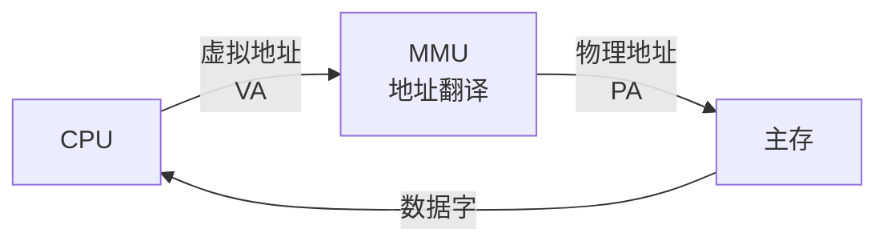
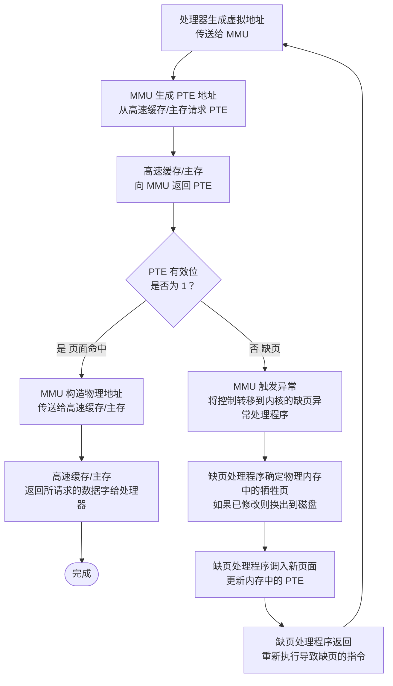

import DFD, {
  WHITE,
  BLACK,
  PINK,
  AMBER,
  ORANGE,
  LIME,
  GREEN,
  CYAN,
  TEAL,
  INDIGO,
  BLUE,
  VIOLET,
  PURPLE,
  ROSE,
  FONT_MATH,
} from "@/components/custom/DataFlowDiagram.svelte";

一个系统中的进程会和其他进程共享 CPU 和主存资源，这带来两个关键问题：

- 进程之间会争用有限的主存
- 一个进程写错地址时，很容易破坏另一个进程的状态

现代系统通过一种抽象机制解决这些问题，这就是**虚拟内存**（Virtual Memory，VM）。它把磁盘上的大地址空间伪装成主存中连续、私有、可管理的空间，让每个进程都觉得自己独占整个地址空间。

虚拟内存的核心能力可以概括为三点：

1. 把主存看成磁盘地址空间的缓存，只保留"正在用"的页面，按需在磁盘和主存之间搬运数据
2. 给每个进程提供一致的虚拟地址空间，简化内存管理
3. 通过页级权限和地址翻译保护每个进程的地址空间，不让其他进程破坏它

> [!important] 理解虚拟内存的重要性
>
> - **虚拟内存是核心的**。它遍布整个计算机系统：异常处理、链接器、加载器、共享对象、文件和进程都依赖它。理解它之后，才能真正理解系统为何会在看似简单的代码下表现出复杂的行为。
> - **虚拟内存是强大的**。虚拟内存给予应用程序强大的能力，可以创建和销毁内存片（chunk）、将内存片映射到磁盘文件的某个部分，以及与其他进程共享内存。
> - **虚拟内存是危险的**。不正确的内存操作会导致内存泄漏、溢出等问题，最可怕的是，程序也许在运行一段时间后才崩溃。

> [!summary] 本章内容
> 这一章从两个角度看虚拟内存：
>
> 1. 前半部分解释它如何工作——地址翻译、页表、缺页、TLB
> 2. 后半部分解释程序如何使用它——内存映射、`fork`、`execve`、`malloc`/`free`

---

# 第一部分 虚拟内存基础

## 9.1 物理和虚拟寻址

计算机系统的主存可以看成一个由 $M$ 个连续字节组成的数组，每个字节都有唯一的**物理地址**（Physical Address，PA），第一个字节地址是 0，随后依次递增。

如果 CPU 直接使用物理地址访问主存，就叫做**物理寻址**（physical addressing）。举例来说，CPU 执行一条加载指令时可能生成有效物理地址 4，然后把它发到内存总线；主存读取从地址 4 开始的 4 个字节，返回给 CPU。

早期 PC 和一些专用处理器依赖物理寻址。现代处理器普遍采用**虚拟寻址**（virtual addressing）：CPU 生成的是**虚拟地址**（Virtual Address，VA），在发往主存之前先由硬件翻译成正确的物理地址。



将一个虚拟地址转换为物理地址的任务叫做**地址翻译**（address translation）。它是软硬结合的，由 CPU 芯片上的**内存管理单元**（Memory Management Unit，MMU）和操作系统共同负责：MMU 查页表得到映射信息，页表内容由内核维护。

## 9.2 地址空间

**地址空间**（address space）是一个非负整数地址的集合 $\{0,1,2,\cdots\}$。如果地址集合是连续的，称为**线性地址空间**（linear address space）。本文默认使用线性地址空间。

在带虚拟内存的系统中，CPU 生成的虚拟地址来自一个大小为 $N = 2^n$ 的**虚拟地址空间**（virtual address space）：$\{0,1,2,\cdots,N-1\}$。地址空间的大小由地址位数决定，常见的有 32 位和 64 位。

系统中的物理内存也有一个**物理地址空间**（physical address space）：$\{0,1,2,\cdots,M-1\}$，其中 $M$ 表示物理内存的字节数，通常假设 $M = 2^m$。

> [!note] 基本思想
> 地址空间把数据对象（字节）和属性（地址）分开了。于是一份数据可以在不同地址空间中拥有多个独立地址——主存中的每个字节都同时拥有一个虚拟地址和一个物理地址。

---

# 第二部分 虚拟内存的三重角色

## 9.3 虚拟内存作为缓存的工具

从概念上看，虚拟内存是一个存放在磁盘上的大数组，由 $N$ 个连续字节组成，每个字节都有唯一的虚拟地址作为数组的索引。磁盘上的内容被缓存到主存中。

和其他缓存一样，虚拟内存系统分"块"处理数据。磁盘中的块称为**虚拟页**（Virtual Page，VP），主存中的块称为**物理页**（Physical Page，PP）或**页帧**（page frame）。每个虚拟页大小为 $P = 2^p$ 字节，物理页同样是 $P$ 字节。

在任意时刻，虚拟页的集合都划分为三个子集：

- **未分配的**：还没有创建的页
  - 没有数据与其产生关联
  - 没有在磁盘上保留空间
- **已缓存的**：已缓存在物理内存中的已分配页
- **未缓存的**：未缓存在物理内存中的已分配页

### 9.3.1 DRAM 缓存的组织结构

为区分不同层次的缓存，用 **SRAM 缓存**表示 CPU 和主存之间的 L1、L2、L3 高速缓存，用 **DRAM 缓存**表示虚拟内存系统中主存缓存虚拟页的那一层。

DRAM 比 SRAM 慢大约 10 倍，磁盘又比 DRAM 慢大约 100000 倍。因此，DRAM 缓存不命中的代价极大

这直接导致了四点设计选择：

- 虚拟页通常较大，常见大小是 4 KB 到 2 MB
- DRAM 缓存通常是**全相联**的：任意虚拟页都可以放在任意物理页中
- 替换算法更复杂，因为错误替换会带来更高的磁盘代价
- 因为磁盘访问很慢，DRAM 缓存通常采用**写回**而不是直写。

> [!question] 为什么 DRAM 缓存使用全相联？
> 直接映射和组相联，会将多个虚拟页映射到同一个物理页或同一个组，这允许缩小缓存容量，却会导致大量的冲突不命中。
>
> 全相联允许任意虚拟页映射到任意物理页，大大减少了这种冲突。

### 9.3.2 页表

同任何缓存一样，虚拟内存系统需要回答两个问题：某个虚拟页是否在主存中？如果在，位于哪个物理页？这项工作由**页表**（page table）完成。

页表是一个数组，每个元素叫做**页表条目**（page table entry，PTE），对应一个虚拟页。每个 PTE 包含两个字段：

- **有效位**（valid bit）：表示该虚拟页是否已被缓存到主存
- **地址字段**：
  - 有效位为 1，地址字段表明该虚拟页在主存中的物理页起始地址
  - 有效位为 0
    - 如果虚拟页未分配，地址字段为空地址（`NULL`）
    - 如果虚拟页已分配但未缓存，地址字段指向磁盘上该虚拟页的起始地址

操作系统维护这些状态，并在需要时把页换入或换出。

例如一个有 8 个虚拟页和 4 个物理页的系统的页表。四个虚拟页（VP 1、VP 2、VP 4 和 VP 7）当前被缓存在 DRAM 中。两个页（VP 0 和 VP 5 ）还未被分配，而剩下的页（VP 3 和 VP 6）已经被分配了，但是当前还未被缓存。

| 有效位 | 地址指向的页  |
| :----: | ------------- |
|   0    | NULL          |
|   1    | PP 0 （VP 1） |
|   1    | PP 1 （VP 2） |
|   0    | VP 3          |
|   1    | PP 3 （VP 4） |
|   0    | NULL          |
|   0    | VP 6          |
|   1    | PP 2 （VP 7） |

### 9.3.3 页命中

考虑 CPU 想要读包含在 VP2 中的一个字，VP2 被缓存在 DRAM 中。地址翻译硬件将虚拟地址作为索引定位 PTE 2，从内存中读取它；因为设置了有效位，硬件知道 VP2 缓存在内存中，于是用 PTE 中的物理地址构造出这个字的物理地址。

### 9.3.4 缺页

DRAM 缓存不命中称为**缺页**（page fault）。例如 CPU 引用了未缓存的 VP3：地址翻译硬件读取 PTE 3，从有效位推断出 VP3 未被缓存，触发缺页异常。缺页处理程序选择一个牺牲页（如 PP3 中的 VP4），若 VP4 已被修改则复制回磁盘，并修改 VP4 的页表条目；接着把 VP3 从磁盘复制到 PP3，更新 PTE 3，然后返回。异常处理程序返回后会重新启动导致缺页的指令，此时 VP3 已缓存在主存中，命中由地址翻译硬件正常处理。

| 有效位 | 地址指向的页  |
| :----: | ------------- |
|   0    | NULL          |
|   1    | PP 0 （VP 1） |
|   1    | PP 1 （VP 2） |
|   0    | VP 3          |
|   1    | PP 3 （VP 3） |
|   0    | NULL          |
|   0    | VP 6          |
|   1    | PP 2 （VP 7） |

> [!info] 术语
> 虚拟内存发明于 20 世纪 60 年代早期，远早于 SRAM 缓存的出现，因此使用了和 SRAM 缓存不同的术语，即使许多概念是相似的：块被称为页，在磁盘和内存之间传送页的活动叫做**交换**（swapping）或**页面调度**（paging）。一直等到不命中发生时才换入页面的策略称为**按需页面调度**（demand paging），所有现代系统都使用这种方式。

### 9.3.5 分配页面

当操作系统分配一个新的虚拟内存页时（例如调用 malloc 的结果），会在磁盘上创建空间并更新对应 PTE，使其指向磁盘上新创建的页面。

例如，VP5 的分配过程是在磁盘上创建空间并更新 PTE 5，使它指向磁盘上这个新创建的页面。

| 有效位 | 地址指向的页  |
| :----: | ------------- |
|   0    | NULL          |
|   1    | PP 0 （VP 1） |
|   1    | PP 1 （VP 2） |
|   0    | VP 3          |
|   1    | PP 3 （VP 3） |
|   0    | VP 5          |
|   0    | VP 6          |
|   1    | PP 2 （VP 7） |

### 9.3.6 又是局部性救了我们

虚拟内存的不命中代价很高，直觉上容易担心页面调度会严重拖累性能。实际上虚拟内存工作得相当好，这主要归功于**局部性**（locality）。

尽管程序在整个运行过程中引用的不同页面总数可能超出物理内存大小，但局部性原则保证了在任意时刻，程序趋向于在一个较小的**活动页面**（active page）集合上工作，这个集合叫做**工作集**（working set）或**常驻集合**（resident set）。初始开销（把工作集页面调度到内存）之后，接下来对工作集的引用将命中，不产生额外磁盘流量。

如果工作集大小超出物理内存大小，程序将产生**抖动**（thrashing）：页面不断换进换出，性能急剧下降。

> [!tip] 统计缺页次数
> 可以用 Linux 的 `getrusage` 函数监测缺页数量以及其他多项运行时信息。

## 9.4 虚拟内存作为内存管理的工具

操作系统为每个进程提供一个独立的页表，因而也就有一个独立的虚拟地址空间。

> [!caution] 多个虚拟页面可以映射到同一个共享物理页面
> 不同进程的页表可以把不同的虚拟页面映射到同一个物理页面上，这样就可以在进程间共享数据。共享的物理页面通常是只读的，防止一个进程破坏另一个进程的状态。

按需页面调度和独立虚拟地址空间的结合，简化了链接和加载、代码和数据共享，以及应用程序的内存分配：

- **简化链接**：独立的地址空间让每个进程的内存映像使用相同的基本格式，不管代码和数据实际存放在物理内存的何处。对 64 位地址空间，代码段总是从虚拟地址 `0x400000` 开始，数据段紧随其后，栈占据地址空间最高部分并向下生长。这种一致性极大简化了链接器的设计，使其能生成完全独立于物理内存最终位置的可执行文件。

- **简化加载**：加载可执行文件时，Linux 加载器为代码和数据段分配虚拟页，标记为无效（未缓存），并将页表条目指向目标文件中的适当位置。每个页首次被引用时，虚拟内存系统会按需自动调入。

  这种把一组连续虚拟页映射到文件中任意位置的技术称为**内存映射**（memory mapping），Linux 通过 `mmap` 系统调用暴露给应用程序（详见 [§9.8](#98-内存映射)）。

- **简化共享**：每个进程通常有私有的代码、数据、堆和栈区域，映射到不连续的物理页。但内核代码和 C 标准库这类需要被所有进程共享的代码，操作系统会将不同进程中相应的虚拟页映射到同一组物理页，只在物理内存中保留一份副本。

- **简化内存分配**：当用户进程要求额外堆空间时（如 `malloc`），操作系统分配 $k$ 个连续的虚拟页，映射到物理内存中**任意**位置的 $k$ 个物理页而不必是连续的。

## 9.5 虚拟内存作为内存保护的工具

不应该允许用户进程修改其只读代码段，不应该允许它读写内核代码和数据结构，不应该允许它读写其他进程的私有内存，也不允许它修改与其他进程共享的虚拟页面（除非所有共享者显式允许）。

因为每次 CPU 生成地址时地址翻译硬件都会读一个 PTE，所以在 PTE 上添加额外的许可位就能实现页面级的访问控制。常见的许可位包括：

- **SUP** 位：表示进程是否必须运行在内核（超级用户）模式下才能访问该页
- **READ** 位、**WRITE** 位：控制对页面的读、写权限

如果一条指令违反了这些许可条件，CPU 会触发一个一般保护故障，将控制传递给内核中的异常处理程序。Linux shell 通常将这种异常报告为"段错误（segmentation fault）"。

---

# 第三部分 地址翻译

## 9.6 地址翻译

这一节讲述地址翻译的基础知识，重点是硬件在支持虚拟内存中的角色。图 9-11 概括了本节使用的符号：

| 符号         | 描述                           |
| ------------ | ------------------------------ |
| $N=2^n$      | 虚拟地址空间中的地址数量       |
| $M=2^m$      | 物理地址空间中的地址数量       |
| $P=2^p$      | 页的大小（字节）               |
| VPO / VPN    | 虚拟页面偏移量 / 虚拟页号      |
| TLBI / TLBT  | TLB 索引 / TLB 标记            |
| PPO / PPN    | 物理页面偏移量 / 物理页号      |
| CO / CI / CT | 高速缓存块内偏移 / 索引 / 标记 |

形式上，地址翻译是 $N$ 元素的虚拟地址空间（VAS）中的元素和 $M$ 元素的物理地址空间（PAS）中元素之间的映射：

$$
\mathrm{MAP}: \mathrm{VAS} \longrightarrow \mathrm{PAS} \cup \varnothing
$$

$$
\operatorname{MAP}(A) = \begin{cases} A' &\text{如果虚拟地址 } A \text{ 处的数据在 PAS 的物理地址 } A' \text{ 处}\\
\varnothing &\text{如果虚拟地址 } A \text{ 处的数据不在物理内存中} \end{cases}
$$

CPU 中的**页表基址寄存器**（Page Table Base Register，PTBR）指向当前页表。$n$ 位虚拟地址包含一个 $p$ 位的**虚拟页面偏移**（VPO）和一个 $(n-p)$ 位的**虚拟页号**（VPN）。MMU 用 VPN 选择对应的 PTE，将 PTE 中的**物理页号**（PPN）和虚拟地址的 VPO 串联起来，得到相应的物理地址。因为物理和虚拟页面大小相同，**物理页面偏移**（PPO）和 VPO 相同。

<DFD
  client:load
  width={760}
  height={560}
  custom={[
    {
      x: 80,
      y: 60,
      label: "PTBR",
      w: 120,
      h: 76,
      rx: 8,
      fill: {
        light: "oklch(0.92 0.05 var(--hue))",
        dark: "oklch(0.18 0.06 var(--hue))",
      },
      fontSize: 18,
      stroke: {
        light: "oklch(0.55 0.18 var(--hue))",
        dark: "oklch(0.65 0.15 var(--hue))",
      },
      strokeWidth: 2,
    },
    {
      x: 380,
      y: 60,
      label: "VPN",
      w: 250,
      h: 40,
      rx: 0,
      fontSize: 18,
      stroke: INDIGO,
      strokeWidth: 1.5,
    },
    {
      x: 605,
      y: 60,
      label: "VPO",
      w: 200,
      h: 40,
      rx: 0,
      fontSize: 18,
      stroke: INDIGO,
      strokeWidth: 1.5,
    },
    {
      x: 380,
      y: 500,
      label: "PPN",
      w: 250,
      h: 40,
      rx: 0,
      fontSize: 18,
      stroke: INDIGO,
      strokeWidth: 1.5,
    },
    {
      x: 605,
      y: 500,
      label: "PPO",
      w: 200,
      h: 40,
      rx: 0,
      fontSize: 18,
      stroke: INDIGO,
      strokeWidth: 1.5,
    },
    {
        x: 380,
        y: 240,
        label: "",
        w: 360,
        h: 160,
        rx: 1,
        stroke: AMBER,
    }
  ]}
    polylines={[
        // PTBR -> PTE
        { points: [
            [80, 98],
            [80, 160],
            [200, 160],
        ],
        color: PINK,
        },
        // VPN -> PTE
        { points: [
            [255, 60],
            [165, 60],
            [165, 220],
            [200, 220],
        ],
            color: TEAL,
        }
    ]}
  lines={[
    // PTE
    { x1: 280, y1: 320, x2: 280, y2: 160, color: AMBER, noArrow: true, },
    { x1: 200, y1: 240, x2: 560, y2: 240, color: AMBER, noArrow: true, },
    { x1: 200, y1: 280, x2: 560, y2: 280, color: AMBER, noArrow: true, },
    { x1: 200, y1: 200, x2: 560, y2: 200, color: AMBER, noArrow: true, },
    // PPN -> PPN
    { x1: 420, y1: 220, x2: 420, y2: 480, color: LIME, },
    // VPO -> PPO
    { x1: 620, y1: 80, x2: 620, y2: 480, color: LIME, },
  ]}
    
    circles={[
        { cx: 420, cy: 220, r: 4, color: LIME}
    ]}

    labels={[
    { x: 240, y: 155, text: "Valid Bit", fontSize: 18,},
    { x: 420, y: 155, text: "PPN", fontSize: 18, },
    { x: 580, y: 240, text: "VP", fontSize: 22, },
    { x: 240, y: 105, text: "as index in VP", fontSize: 18, },
    //VPN与VPO的位数
    { x: 260, y: 35, text: "n-1", fontSize: 18, fontFamily: FONT_MATH, fontStyle: "italic", },
    { x: 490, y: 35, text: "p", fontSize: 18, fontFamily: FONT_MATH, fontStyle: "italic", },
    { x: 525, y: 35, text: "p-1", fontSize: 18, fontFamily: FONT_MATH, fontStyle: "italic", },
    { x: 705, y: 35, text: "0", fontSize: 18, fontFamily: FONT_MATH, fontStyle: "italic", },
    // PPN与PPO的位数
    { x: 260, y: 475, text: "m-1", fontSize: 18, fontFamily: FONT_MATH, fontStyle: "italic", },
    { x: 490, y: 475, text: "p", fontSize: 18, fontFamily: FONT_MATH, fontStyle: "italic", },
    { x: 525, y: 475, text: "p-1", fontSize: 18, fontFamily: FONT_MATH, fontStyle: "italic", },
    { x: 705, y: 475, text: "0", fontSize: 18, fontFamily: FONT_MATH, fontStyle: "italic", },

]}

/>



### 9.6.1 结合高速缓存和虚拟内存

在既使用虚拟内存又使用 SRAM 高速缓存的系统中，存在用虚拟地址还是物理地址访问 SRAM 高速缓存的问题。大多数系统选择物理寻址：这样多个进程同时在高速缓存中存储块、共享来自相同虚拟页面的块都很简单，而且高速缓存无需处理保护问题，因为访问权限检查是地址翻译过程的一部分。主要思路是地址翻译发生在高速缓存查找之前，页表条目本身也可以像其他数据字一样被缓存。

### 9.6.2 利用 TLB 加速地址翻译

每次 CPU 产生虚拟地址，MMU 就必须查阅一个 PTE。最糟情况下这要求从内存多取一次数据，代价是几十到几百个周期；如果 PTE 恰好缓存在 L1 中，开销降到 1~2 个周期。为进一步消除这一开销，许多系统在 MMU 中包含一个关于 PTE 的小缓存，称为**翻译后备缓冲器**（Translation Lookaside Buffer，TLB）。

TLB 是一个小的、虚拟寻址的缓存，每行保存一个由单个 PTE 组成的块，通常有高度的相联度。用于组选择和行匹配的索引和标记字段是从虚拟地址的 VPN 中提取的：若 TLB 有 $T = 2^t$ 个组，**TLB 索引**（TLBI）由 VPN 的 $t$ 个最低位组成，**TLB 标记**（TLBT）由 VPN 中剩余的位组成。

|    TLBT    |  TLBI  |  VPO   |
| :--------: | :----: | :----: |
| $n-p-t$ 位 | $t$ 位 | $p$ 位 |

**TLB 命中**时（通常情况），所有地址翻译步骤都在芯片上的 MMU 中完成，非常快：CPU 产生虚拟地址 → MMU 从 TLB 中取出相应 PTE → MMU 将虚拟地址翻译成物理地址并发送到高速缓存/主存 → 返回数据字给 CPU。

**TLB 不命中**时，MMU 必须从 L1 缓存中取出相应的 PTE，新取出的 PTE 存放在 TLB 中，可能覆盖已有条目。

> [!note] 多级 TLB
> 与高速缓存类似，现代处理器通常采用多级 TLB：L1 TLB 通常分为指令 TLB 和数据 TLB，容量小但访问快；L2 TLB 统一存放指令和数据的翻译条目，容量更大但稍慢。§9.7 中提到 Core i7 每个核心"包含一个层次结构的 TLB"，指的正是这种设计，工作原理与多级高速缓存（第六章）类似。

### 9.6.3 多级页表

如果有一个 32 位地址空间、4 KB 页面和 4 字节 PTE，那么即使应用只引用虚拟地址空间的很小一部分，也总是需要一个 4 MB 的页表驻留在内存中（$2^{32}/2^{12} \times 4\mathrm{B} = 4\mathrm{MB}$）。对 64 位系统，问题更严重。

压缩页表的常用方法是**层次结构的页表**。以一个具体示例说明：假设 32 位虚拟地址空间被分为 4 KB 页，每个 PTE 4 字节。一级页表中的每个 PTE 负责映射虚拟地址空间中一个 4 MB 的**片**（chunk），每片由 1024 个连续页面组成；若地址空间是 4 GB，1024 个一级 PTE 就足够覆盖整个空间。

如果片 $i$ 中的每个页面都未被分配，一级 PTE $i$ 就为空；如果片 $i$ 中至少有一个页已分配，一级 PTE $i$ 就指向一个二级页表的基址。二级页表中的每个 PTE 负责映射一个 4 KB 的虚拟内存页面，就像只有一级页表时一样。

这种方法从两方面减少内存要求：其一，若一级 PTE 为空，相应二级页表就根本不存在——对典型程序而言，4 GB 虚拟地址空间的大部分都是未分配的，这是巨大的潜在节约；其二，一级页表需要总是在主存中，虚拟内存系统可以按需创建、调入或调出二级页表，而其中只有最常用的部分二级页表需要缓存在主存中。

对于 $k$ 级页表层次结构，虚拟地址被划分成 $k$ 个 VPN 和 1 个 VPO：每个 VPN $i$（$1 \le i \le k$）是到第 $i$ 级页表的索引，第 $j$ 级页表中的每个 PTE（$1 \le j \le k-1$）指向第 $j+1$ 级某个页表的基址，第 $k$ 级页表中的每个 PTE 包含物理页面的 PPN 或磁盘块地址。构造物理地址前，MMU 必须访问 $k$ 个 PTE——看上去昂贵，但 TLB 通过缓存不同层次上的 PTE 使得带多级页表的地址翻译并不比单级页表慢很多。

<DFD
  client:load
  width={780}
  height={460}
  custom={[
    // VP
    {
      x: 100,
      y: 60,
      label: "VPN 1",
      w: 160,
      h: 50,
      rx: 0,
      fontSize: 18,
      stroke: INDIGO,
      strokeWidth: 1.5,
    },
    {
      x: 260,
      y: 60,
      label: "VPN 2",
      w: 160,
      h: 50,
      rx: 0,
      fontSize: 18,
      stroke: INDIGO,
      strokeWidth: 1.5,
    },
    {
      x: 420,
      y: 60,
      label: "...",
      w: 160,
      h: 50,
      rx: 0,
      fontSize: 18,
      stroke: INDIGO,
      strokeWidth: 1.5,
    },
    {
      x: 580,
      y: 60,
      label: "VPN k",
      w: 160,
      h: 50,
      rx: 0,
      fontSize: 18,
      stroke: INDIGO,
      strokeWidth: 1.5,
    },
    {
      x: 700,
      y: 60,
      label: "VPO",
      w: 120,
      h: 50,
      rx: 0,
      fontSize: 18,
      stroke: INDIGO,
      strokeWidth: 1.5,
    },
    // PP
    {
      x: 420,
      y: 400,
      label: "PPN",
      w: 440,
      h: 50,
      rx: 0,
      fontSize: 18,
      stroke: INDIGO,
      strokeWidth: 1.5,
    },
    {
      x: 700,
      y: 400,
      label: "PPO",
      w: 120,
      h: 50,
      rx: 0,
      fontSize: 18,
      stroke: INDIGO,
      strokeWidth: 1.5,
    },
    // PT
    { x: 120, y: 240, w: 80, h: 150, rx: 1, stroke: AMBER },
    { x: 280, y: 240, w: 80, h: 150, rx: 1, stroke: AMBER },
    { x: 580, y: 240, w: 80, h: 150, rx: 1, stroke: AMBER },
    // PTE
    {
      x: 120,
      y: 260,
      w: 80,
      h: 30,
      rx: 0,
      stroke: AMBER,
      fill: "oklch(0.66 0.8 200 / .25)",
    },
    {
      x: 280,
      y: 200,
      w: 80,
      h: 30,
      rx: 0,
      stroke: AMBER,
      fill: "oklch(0.66 0.8 200 / .25)",
    },
    {
      x: 580,
      y: 280,
      label: "PPN",
      fontSize: 16,
      w: 80,
      h: 30,
      rx: 0,
      stroke: AMBER,
      fill: "oklch(0.66 0.8 200 / .25)",
    },
  ]}
  polylines={[
    // VPN 1 -> PTE 1
    {
      points: [
        [40, 85],
        [40, 260],
        [80, 260],
      ],
      color: VIOLET,
    },
    // VPN 2 -> PTE 2
    {
      points: [
        [200, 85],
        [200, 200],
        [240, 200],
      ],
      color: VIOLET,
    },
    // VPN k -> PTE k
    {
      points: [
        [520, 85],
        [520, 280],
        [540, 280],
      ],
      color: VIOLET,
    },
    // PTE 1 -> PT 2
    {
      points: [
        [160, 260],
        [175, 260],
        [175, 165],
        [240, 165],
      ],
      color: ROSE,
    },
    // PTE 2 -> ...
    {
      points: [
        [320, 200],
        [335, 200],
        [335, 165],
        [400, 165],
      ],
      color: ROSE,
    },
    // ... -> PT k
    {
      points: [
        [480, 165],
        [540, 165],
      ],
      color: ROSE,
    },
    // PTE k -> PPN
    {
      points: [
        [620, 280],
        [650, 280],
        [650, 350],
        [420, 350],
        [420, 375],
      ],
      color: LIME,
    },
  ]}
  lines={[
    // VPO -> PPO
    { x1: 700, y1: 85, x2: 700, y2: 375, color: LIME },
  ]}
  circles={[
    { cx: 420, cy: 165, r: 2, color: ROSE },
    { cx: 440, cy: 165, r: 2, color: ROSE },
    { cx: 460, cy: 165, r: 2, color: ROSE },
  ]}
  labels={[
    { x: 120, y: 160, text: "1st PT", fontSize: 18 },
    { x: 280, y: 160, text: "2nd PT", fontSize: 18 },
    { x: 580, y: 160, text: "k-th PT", fontSize: 18 },
  ]}
/>

## 9.7 案例研究：Intel Core i7 / Linux 内存系统

以运行 Linux 的 Intel Core i7 总结虚拟内存的讨论。底层 Haswell 微体系结构允许完全的 64 位虚拟和物理地址空间，实际的 Core i7 实现支持 48 位（256 TB）虚拟地址空间和 52 位（4 PB）物理地址空间，还有兼容模式支持 32 位（4 GB）虚拟和物理地址空间。

**处理器封装**（processor package）包括四个核、一个所有核共享的大 L3 高速缓存，以及一个 DDR3 内存控制器。每个核包含一个层次结构的 TLB、一个层次结构的数据和指令高速缓存，以及基于 QuickPath 技术的快速点到点链路。TLB 是虚拟寻址的、四路组相联的。L1、L2、L3 高速缓存是物理寻址的，块大小 64 字节，L1 和 L2 是 8 路组相联，L3 是 16 路组相联。Linux 使用 4 KB 页。

### 9.7.1 Core i7 地址翻译

Core i7 采用**四级页表层次结构**。每个进程有自己私有的页表层次结构，与已分配页相关联的页表都驻留在内存中。**CR3** 控制寄存器指向第一级页表（L1）的起始位置，CR3 的值是每个进程上下文的一部分，每次上下文切换都会被恢复。

第一、二、三级页表条目中，当 $P=1$（Linux 中总是如此）时，地址字段包含一个 40 位物理页号（PPN），指向下一级页表的开始处；这要求物理页表 4 KB 对齐。第四级页表条目的地址字段同样是 40 位 PPN，指向物理内存中某一页的基地址，同样要求 4 KB 对齐。

PTE 有三个权限位：**R/W** 位确定页内容可读写还是只读；**U/S** 位确定是否能在用户模式中访问该页，从而保护内核代码和数据不被用户程序访问；**XD**（禁止执行）位是 64 位系统中引入的新特性，可禁止从某些内存页取指令，通过限制只能执行只读代码段来降低缓冲区溢出攻击的风险。

MMU 翻译每个虚拟地址时还会更新两个内核缺页处理程序会用到的位：**A 位**（引用位，reference bit）在每次访问页时被设置，内核用它实现页替换算法；**D 位**（修改位/脏位，dirty bit）在每次对页写入后被设置，告诉内核复制替换页之前是否必须写回牺牲页。内核可通过特殊的内核模式指令清除这两个位。

36 位 VPN 被划分成四个 9 位的片，每个片用作到一个页表的偏移量：CR3 寄存器包含 L1 页表的物理地址，VPN 1 提供到一个 L1 PTE 的偏移量（该 PTE 包含 L2 页表的基地址），VPN 2 提供到一个 L2 PTE 的偏移量，以此类推。

> [!note] 优化地址翻译
> 实际硬件实现允许"MMU 翻译虚拟地址"和"将物理地址传送到 L1 高速缓存"这两个步骤部分重叠。以页面大小 4 KB 的 Core i7 为例，虚拟地址有 12 位的 VPO，与物理地址中 PPO 的 12 位相同。八路组相联、物理寻址的 L1 高速缓存有 64 个组、64 字节的块，每个物理地址有 6 个缓存偏移位和 6 个索引位，恰好凑成 12 位——这绝非偶然。CPU 发送 VPN 到 MMU 的同时发送 VPO 到 L1 缓存；当 MMU 从 TLB 得到 PPN 时，缓存已经用 VPO 找到对应组并读出了 8 个标记，可以立即尝试匹配。

### 9.7.2 Linux 虚拟内存系统

Linux 为每个进程维护一个单独的虚拟地址空间，包括代码、数据、堆、共享库以及栈段，内核虚拟内存位于用户栈之上。内核虚拟内存包含内核中的代码和数据结构，部分区域被映射到所有进程共享的物理页面（如内核代码和全局数据结构）。Linux 还把一组连续的虚拟页面（大小等于系统 DRAM 总量）映射到相应的一组连续物理页面，为内核提供便利的方式来访问物理内存中任何特定位置——例如访问页表，或对映射到特定物理内存位置的设备执行内存映射 I/O。

<DFD
  client:load
  width={800}
  height={680}
  custom={[
    {
      x: 400,
      y: 60,
      label: "与进程相关的数据结构<br>（例如，页表、task和mm结构，内核栈）",
      w: 380,
      h: 100,
      rx: 1,
      fontSize: 18,
      stroke: VIOLET,
    },
    {
      x: 400,
      y: 140,
      label: "物理内存",
      w: 380,
      h: 60,
      rx: 0,
      fontSize: 18,
      stroke: VIOLET,
    },
    {
      x: 400,
      y: 200,
      label: "内核代码和数据",
      w: 380,
      h: 60,
      rx: 0,
      fontSize: 18,
      stroke: VIOLET,
    },
    {
      x: 400,
      y: 245,
      label: "用户栈",
      w: 380,
      h: 30,
      rx: 0,
      fontSize: 18,
      stroke: VIOLET,
    },
    {
      x: 400,
      y: 295,
      w: 380,
      h: 70,
      rx: 0,
      stroke: VIOLET,
      fill: "oklch(0.30 0.8 225 / .25)",
    },
    {
      x: 400,
      y: 360,
      label: "共享库的内存映射区域",
      w: 380,
      h: 60,
      rx: 0,
      fontSize: 18,
      stroke: VIOLET,
    },
    {
      x: 400,
      y: 430,
      w: 380,
      h: 80,
      rx: 0,
      stroke: VIOLET,
      fill: "oklch(0.30 0.8 225 / .25)",
    },
    {
      x: 400,
      y: 500,
      label: "运行时堆<br>（malloc分配的）",
      w: 380,
      h: 60,
      rx: 0,
      fontSize: 18,
      stroke: VIOLET,
    },
    {
      x: 400,
      y: 545,
      label: "未初始化的数据段（.bss）",
      w: 380,
      h: 30,
      rx: 0,
      fontSize: 18,
      stroke: VIOLET,
    },
    {
      x: 400,
      y: 575,
      label: "初始化的数据段（.data）",
      w: 380,
      h: 30,
      rx: 0,
      fontSize: 18,
      stroke: VIOLET,
    },
    {
      x: 400,
      y: 605,
      label: "代码段（.text）",
      w: 380,
      h: 30,
      rx: 0,
      fontSize: 18,
      stroke: VIOLET,
    },
    {
      x: 400,
      y: 640,
      w: 380,
      h: 40,
      rx: 0,
      stroke: VIOLET,
      fill: "oklch(0.30 0.8 225 / .25)",
    },
  ]}
  lines={[
    { x1: 180, y1: 260, x2: 210, y2: 260, color: ROSE }, //rsp
    { x1: 180, y1: 470, x2: 210, y2: 470, color: ROSE }, //brk
    { x1: 180, y1: 620, x2: 210, y2: 620, color: ROSE }, //0x40000000
    { x1: 400, y1: 260, x2: 400, y2: 285, color: VIOLET },
    { x1: 400, y1: 330, x2: 400, y2: 305, color: VIOLET },
    { x1: 400, y1: 470, x2: 400, y2: 435, color: VIOLET },
  ]}
  braces={[
    {
      x1: 200,
      y1: 12,
      x2: 200,
      y2: 108,
      side: "left",
      color: ORANGE,
      label: "对每个进程<br>都不相同",
      fontSize: 18,
    },
    {
      x1: 200,
      y1: 112,
      x2: 200,
      y2: 228,
      side: "left",
      color: ORANGE,
      label: "对每个进程<br>都一样",
      fontSize: 18,
    },
    {
      x1: 600,
      y1: 12,
      x2: 600,
      y2: 228,
      color: ORANGE,
      label: "内核虚拟内存",
      fontSize: 18,
    },
    {
      x1: 600,
      y1: 232,
      x2: 600,
      y2: 658,
      color: ORANGE,
      label: "进程虚拟内存",
      fontSize: 18,
    },
  ]}
  labels={[
    { x: 155, y: 265, text: "%rsp", fontSize: 18 },
    { x: 160, y: 475, text: "brk", fontSize: 18 },
    { x: 120, y: 625, text: "0x40000000", fontSize: 18 },
    { x: 195, y: 665, text: "0", fontSize: 18 },
  ]}
/>

**Linux 虚拟内存区域**：Linux 将虚拟内存组织成一些**区域**（area，也叫段）的集合，一个区域是已经存在的（已分配的）虚拟内存连续片，这些页以某种方式相关联，例如代码段、数据段、堆、共享库段、用户栈。区域的概念很重要，因为它允许虚拟地址空间有间隙——内核不用记录不存在的虚拟页，这样的页不占用任何额外资源。

内核为每个进程维护一个 `task_struct`，其中一个条目指向 `mm_struct`，描述虚拟内存的当前状态。我们感兴趣的两个字段：

- `pgd` 指向第一级页表（页全局目录）的基址
- `mmap` 指向一个 `vm_area_struct`（区域结构）的链表，每个描述当前虚拟地址空间的一个区域。区域结构包含
  - `vm_start`（起始处）
  - `vm_end`（结束处）
  - `vm_prot`（读写权限）
  - `vm_flags`（是否与其他进程共享）
  - `vm_next`（下一区域结构）

**Linux 缺页异常处理**：假设 MMU 在翻译虚拟地址 A 时触发缺页，内核缺页处理程序执行以下步骤：

1. **虚拟地址 A 是合法的吗**：即 A 是否在某个区域结构定义的区域内。缺页处理程序搜索区域结构链表，将 A 与每个区域的 `vm_start`、`vm_end` 比较；若不合法则触发段错误，终止进程。（实际中 Linux 会在链表基础上构建树结构以加速查找。）
2. **试图进行的内存访问是否合法**：进程是否有读、写或执行该区域内页面的权限。若不合法则触发保护异常，终止进程。
3. **处理合法的缺页**：选择牺牲页面，若已修改则换出，换入新页面并更新页表。缺页处理程序返回后，CPU 重新启动引起缺页的指令，这次会正常翻译成功。

---

# 第四部分 内存映射

## 9.8 内存映射

Linux 通过将一个虚拟内存区域与磁盘上的**对象**（object）关联来初始化该区域的内容，这个过程称为**内存映射**（memory mapping）。虚拟内存区域可以映射到两种对象之一：

1. **Linux 文件系统中的普通文件**：区域映射到一个普通磁盘文件的连续部分，例如可执行目标文件。文件区被分成页大小的片，每片包含一个虚拟页面的初始内容。由于按需页面调度，这些虚拟页面直到 CPU 首次引用时才实际调入物理内存。如果区域比文件区大，用零填充余下部分。
2. **匿名文件**：由内核创建，全部是二进制零。CPU 首次引用这样一个区域内的虚拟页面时，内核找到一个合适的牺牲页面（若被修改则换出），用二进制零覆盖并更新页表标记为驻留在内存中。磁盘和内存之间没有实际数据传送，因此映射到匿名文件的页面也叫**请求二进制零的页**（demand-zero page）。
   > [!info] 匿名文件的用途
   > 匿名文件的主要用途是为进程的堆和栈区域提供初始内容。当进程申请更多空间时，内核会创建新的匿名文件并映射到进程的虚拟地址空间中。
   > 如此一来，进程的堆和栈区域就可以按需增长，而不需要在进程创建时就分配大量物理内存。

无论哪种情况，虚拟页面一旦被初始化（首次引用后），就在内核维护的专门**交换文件**（swap file，也叫交换空间）与物理内存之间换来换去。在任何时刻，交换空间都限制着当前运行的进程能够分配的虚拟页面总数。

> [!note] 交换文件
> 交换文件是 Linux 内核维护的一个特殊文件，通常位于 `/swapfile` 或 `/dev/sdX`（其中 `X` 是某个磁盘分区）。它用于存储被换出的内存页面，以便在需要时重新加载到物理内存中。这种方式允许系统在物理内存不足时，将不常用的页面换出到磁盘上，从而释放物理内存。交换文件的大小和位置可以通过系统配置进行调整，以满足不同应用程序的内存需求。

### 9.8.1 再看共享对象

许多进程有相同的**只读**代码区域（如多个 bash 进程的代码区域、C 标准库中 `printf` 这样的函数），如果每个进程都在物理内存中保持这些常用代码的独立副本，将极端浪费。内存映射提供了控制多个进程如何共享对象的机制。

一个对象可以被映射到虚拟内存的一个区域，作为**共享对象**或**私有对象**。若进程将共享对象映射到虚拟地址空间的一个区域，该进程对区域的任何写操作，对其他也把这个对象映射到虚拟内存的进程都可见，且这些变化会反映在磁盘上的原始对象中。映射到共享对象的区域叫做**共享区域**。

对于映射到**私有对象**的区域，对其所做的改变对其他进程不可见，也不会反映在磁盘对象上。私有对象使用**写时复制**（copy-on-write）技术映射：

- 一个私有对象开始时与共享对象方式相同，物理内存中只保存一份副本，映射它的每个进程的页表条目都标记为只读，区域结构标记为私有的写时复制。只要没有进程试图写自己的私有区域，它们就继续共享物理内存中的单独副本
- 一旦有进程试图写私有区域内的某个页面，这个写操作就会触发一个保护故障。故障处理程序注意到这是由写私有的写时复制区域引起的，就在物理内存中创建该页面的新副本，更新页表条目指向新副本，恢复该页面的可写权限；处理程序返回后 CPU 重新执行写操作，这次在新页面上正常完成。

通过延迟私有对象中的副本直到最后可能的时刻，写时复制最充分地使用了稀有的物理内存。

### 9.8.2 再看 fork 函数

理解了虚拟内存和内存映射后，可以清晰地理解 `fork` 如何创建一个带有独立虚拟地址空间的新进程：

- `fork` 调用时，内核执行：
  - 为新进程创建各种数据结构并分配唯一 PID
  - 创建子进程的 `mm_struct`、区域结构和页表的原样副本
  - 将两个进程中的每个页面标记为只读，每个区域结构标记为私有的写时复制。
- `fork` 返回时，新进程的虚拟内存刚好和调用 `fork` 时存在的虚拟内存相同；此后任一进程进行写操作时，写时复制机制创建新页面，为每个进程保持私有地址空间的抽象。

### 9.8.3 再看 execve 函数

假设当前进程执行 `execve("a.out", NULL, NULL)`，加载并运行 `a.out` 需要以下步骤：

1. **删除已存在的用户区域**：删除当前进程虚拟地址用户部分中已存在的区域结构
2. **映射私有区域**：为新程序的代码、数据、bss 和栈区域创建新区域结构，均为私有的、写时复制的。代码和数据区域映射为 `a.out` 文件中的 `.text` 和 `.data` 区；bss 区域是请求二进制零的，映射到匿名文件；栈和堆区域也是请求二进制零的，初始长度为零
3. **映射共享区域**：如果 `a.out` 与共享对象（如 `libc.so`）动态链接，将这些对象映射到用户虚拟地址空间中的共享区域
4. **设置程序计数器（PC）**：指向代码区域的入口点

私有区域的映射关系：

| 区域                     | 私有/共享 |  初始内容来源  |
| ------------------------ | :-------: | :------------: |
| 用户栈                   |  私有的   | 请求二进制零的 |
| 共享库的内存映射区域     |  共享的   |   文件提供的   |
| 运行时堆                 |  私有的   | 请求二进制零的 |
| 未初始化的数据段（bss）  |  私有的   | 请求二进制零的 |
| 已初始化的数据段（data） |  私有的   |   文件提供的   |
| 代码段（text）           |  私有的   |   文件提供的   |

下一次调度这个进程时，它将从这个入口点开始执行，Linux 根据需要换入代码和数据页面。

**`mmap` 函数**允许应用程序自己做内存映射：

```c
#include <unistd.h>
#include <sys/mman.h>

void *mmap(void *start, size_t length, int prot, int flags, int fd, off_t offset);
/* 返回：成功时为指向映射区域的指针，出错时为 MAP_FAILED（-1） */
```

`mmap` 要求内核创建一个新的虚拟内存区域，最好从地址 `start` 开始，并将文件描述符 `fd` 指定的对象中一个连续片映射到这个区域；片大小为 `length` 字节，从文件偏移 `offset` 字节处开始。`start` 仅是一个暗示，通常传 `NULL`。

<DFD
  client:load
  width={680}
  height={400}
  custom={[
    { x: 250, y: 200, rx: 1, w: 60, h: 280, stroke: VIOLET }, //fd
    { x: 450, y: 180, rx: 1, w: 60, h: 320, stroke: VIOLET }, //VM
    {
      x: 250,
      y: 200,
      rx: 0,
      w: 60,
      h: 120,
      stroke: VIOLET,
      fill: "oklch(0.40 0.7 205 / .25)",
    }, //length->file
    {
      x: 450,
      y: 150,
      rx: 0,
      w: 60,
      h: 120,
      stroke: VIOLET,
      fill: "oklch(0.40 0.7 205 / .25)",
    }, //length->VM
  ]}
  lines={[
    {
      //line_up
      x1: 280,
      y1: 140,
      x2: 420,
      y2: 90,
      color: BLUE,
      noArrow: true,
      dash: 0.6,
    },
    {
      //line_down
      x1: 280,
      y1: 260,
      x2: 420,
      y2: 210,
      color: BLUE,
      noArrow: true,
      dash: 0.6,
    },
    { x1: 180, y1: 260, x2: 220, y2: 260, color: ROSE }, //offset
    { x1: 520, y1: 210, x2: 480, y2: 210, color: ROSE }, //start
  ]}
  braces={[
    {
      x1: 215,
      y1: 150,
      x2: 215,
      y2: 250,
      side: "left",
      color: ORANGE,
      label: "length（字节）",
      fontSize: 18,
    },
    {
      x1: 485,
      y1: 100,
      x2: 485,
      y2: 200,
      side: "right",
      color: ORANGE,
      label: "length（字节）",
      fontSize: 18,
    },
  ]}
  labels={[
    { x: 250, y: 370, text: "文件描述符fd<br>指定的磁盘文件", fontSize: 18 },
    { x: 450, y: 360, text: "进程虚拟内存", fontSize: 18 },
    { x: 142, y: 265, text: "offset", fontSize: 18 },
    {
      x: 549,
      y: 237,
      text: "start<br>或由内核<br>选定地址",
      fontSize: 18,
    },
  ]}
/>

`prot` 描述新区域的访问权限：

- `PROT_EXEC`（页面可执行）
- `PROT_READ`（可读）
- `PROT_WRITE`（可写）
- `PROT_NONE`（不能访问）

`flags` 描述被映射对象的类型：

- `MAP_ANON` 表示匿名对象（请求二进制零）
- `MAP_PRIVATE` 表示私有的写时复制对象
- `MAP_SHARED` 表示共享对象

例如

```c
bufp = Mmap(NULL, size, PROT_READ, MAP_PRIVATE|MAP_ANON, 0, 0);
```

让内核创建一个包含 `size` 字节的只读、私有、请求二进制零的虚拟内存区域，成功时 `bufp` 包含新区域的地址。

`munmap` 删除虚拟内存区域：

```c
#include <unistd.h>
#include <sys/mman.h>

int munmap(void *start, size_t length);
/* 返回：成功时为 0，出错时为 -1 */
```

删除从虚拟地址 `start` 开始、由接下来 `length` 字节组成的区域，之后对已删除区域的引用会导致段错误。

---

# 第五部分 动态内存分配

## 9.9 动态内存分配

虽然可以用低级的 `mmap`/`munmap` 创建和删除虚拟内存区域，但 C 程序员更常用**动态内存分配器**（dynamic memory allocator），因为它更方便、更具可移植性。

动态内存分配器维护一个进程的虚拟内存区域，称为**堆**（heap）——一个请求二进制零的区域，紧接在未初始化数据区域后开始，向上生长。内核为每个进程维护一个变量 `brk`（读作 "break"），指向堆的顶部。

分配器将堆视为一组不同大小**块**（block）的集合来维护，每个块是一个连续的虚拟内存片，要么**已分配**，要么**空闲**。分配器有两种基本风格：

- **显式分配器**（explicit allocator）：要求应用显式释放已分配的块。C 标准库的 `malloc`/`free`、C++ 的 `new`/`delete` 都属于此类
- **隐式分配器**（implicit allocator）：也叫**垃圾收集器**（garbage collector），要求分配器自动检测已分配块何时不再被使用并释放它。Lisp、ML、Java 等语言依赖垃圾收集

本节讨论显式分配器的设计和实现，§9.10 讨论隐式分配器。

## 9.10 malloc 和 free 函数

C 标准库提供 `malloc` 程序包这一显式分配器：

```c
#include <stdlib.h>

void *malloc(size_t size);
/* 返回：成功时为已分配块的指针，出错时为 NULL */
```

`malloc` 返回一个指针，指向大小至少为 `size` 字节的内存块，对齐方式适合块内可能包含的任何数据对象类型。实际中对齐依赖于 32 位模式（`gcc -m32`）还是 64 位模式（默认）：32 位模式下返回地址总是 8 的倍数，64 位模式下总是 16 的倍数。

> [!note] 一个字有多大
> 第三章中 Intel 将 4 字节对象称为双字。本节中假设字是 4 字节对象，双字是 8 字节对象，这和传统术语一致。

如果 `malloc` 遇到问题（例如请求的内存块比可用虚拟内存还大），返回 `NULL` 并设置 `errno`。`malloc` 不初始化返回的内存；需要已初始化内存的应用可以使用 `calloc`（基于 `malloc` 的瘦包装函数，将分配的内存初始化为零）。

程序通过 `free` 释放已分配的堆块：

```c
#include <stdlib.h>

void free(void *ptr);
/* 返回：无 */
```

`ptr` 必须指向一个从 `malloc`、`calloc` 或 `realloc` 获得的已分配块的起始位置，否则行为未定义；更棘手的是 `free` 什么都不返回，不会告诉应用出现了错误。

> [!warning] realloc 的边界行为
> `realloc` 用于改变一个已分配块的大小，其语义比"扩大或缩小"更细致，写代码时容易踩坑：
>
> - 若原块所在的空闲空间足够扩展，`realloc` 可能原地扩展，返回同一个指针
> - 若不能原地扩展，`realloc` 会分配一块新内存、复制旧数据、释放旧块，返回新指针——原指针不再有效，不能继续使用
> - 若 `ptr` 为 `NULL`，`realloc(NULL, size)` 等价于 `malloc(size)`
> - 若 `size` 为 0 且 `ptr` 非空，`realloc(ptr, 0)` 的行为等价于 `free(ptr)`（具体返回值因实现而异，不应依赖）
> - 因为原指针可能失效，正确用法是 `p = realloc(p, newsize)` 前先用临时变量接住返回值，避免 `realloc` 失败（返回 `NULL`）时丢失原指针导致内存泄漏

分配器（包括 `malloc`）可以通过 `mmap`/`munmap`，或者 `sbrk` 函数显式地分配和释放堆内存：

```c
#include <unistd.h>

void *sbrk(intptr_t incr);
/* 返回：成功时为旧的 brk 指针，出错时为 -1 */
```

`sbrk` 通过将内核的 `brk` 指针增加 `incr` 来扩展和收缩堆。成功时返回 `brk` 的旧值；`incr` 为零时返回 `brk` 的当前值；用负的 `incr` 调用是合法的，返回值（`brk` 旧值）指向距新堆顶向上 `abs(incr)` 字节处。

## 9.11 为什么要使用动态内存分配

程序使用动态内存分配的最重要原因是：直到程序实际运行时，才知道某些数据结构的大小。用硬编码的最大数组大小是一种反模式——最大值是任意的，与实际可用虚拟内存无关，如果使用者需要更大的数组，唯一办法是用更大的值重新编译程序。更好的方法是在运行时、已知需求量后动态分配数组，这样数组大小的上限就只受可用虚拟内存限制。

## 9.12 分配器的要求和目标

显式分配器必须在相当严格的约束条件下工作：

- **处理任意请求序列**：分配器不能假设分配和释放请求的顺序，只需满足每个释放请求对应一个由以前分配请求获得的当前已分配块
- **立即响应请求**：不允许分配器为提高性能重新排列或缓冲请求
- **只使用堆**：分配器使用的任何非标量数据结构都必须保存在堆里
- **对齐块**：分配器必须对齐块，使其能保存任何类型的数据对象
- **不修改已分配的块**：一旦块被分配，就不允许修改或移动它，因此压缩已分配块这样的技术是不允许的

在这些限制下，分配器编写者要在**吞吐率**和**内存使用率**这两个通常相互冲突的目标之间取得平衡：

**目标 1：最大化吞吐率**。给定 $n$ 个分配和释放请求序列 $R_0, R_1, \cdots, R_{n-1}$，吞吐率定义为每单位时间完成的请求数。一般通过使满足请求的平均时间最小化来最大化吞吐率。

**目标 2：最大化内存利用率**。虚拟内存不是无限资源，一个系统中所有进程分配的虚拟内存总量受磁盘交换空间限制。描述堆使用效率最有用的标准是**峰值利用率**（peak utilization）：若一个应用请求 $p$ 字节的块，得到的已分配块的**有效载荷**（payload）就是 $p$ 字节；请求 $R_k$ 完成后的**聚集有效载荷** $P_k$ 是当前已分配块有效载荷之和，$H_k$ 是堆的当前（单调非递减）大小。前 $k+1$ 个请求的峰值利用率 $U_k$ 为：

$$U_k = \frac{\max_{i \le k} P_i}{H_k}$$

分配器的目标是使整个序列的峰值利用率 $U_{n-1}$ 最大化。以牺牲堆利用率为代价编写吞吐率最大化的分配器很容易，分配器设计的一个有趣挑战就是在两个目标之间找到适当的平衡。

> [!note] 放宽单调性假设
> 可以通过让 $H_k$ 成为前 $k+1$ 个请求的最高峰，从而放宽 $U_k$ 定义中"堆大小单调非递减"的假设，允许堆增长和降低。

## 9.13 碎片

堆利用率低的主要原因是**碎片**（fragmentation）：虽然有未使用的内存，但不能用来满足分配请求。碎片分为两种：

**内部碎片**（internal fragmentation）：已分配块比有效载荷大时发生。可能因为分配器实现对已分配块强加最小大小值，或为满足对齐约束条件而增加块大小。内部碎片的量化是简单明了的——已分配块大小和其有效载荷大小之差的和，只取决于以前请求的模式和分配器的实现方式。

**外部碎片**（external fragmentation）：空闲内存合计足够满足一个分配请求，但没有单独的空闲块足够大来处理这个请求时发生。外部碎片比内部碎片难量化得多，因为它不仅取决于以前请求的模式和分配器实现，还取决于将来的请求模式——例如若所有空闲块大小都是 4 个字，这个堆是否有外部碎片，取决于将来的分配请求是否会要求比 4 个字更大的块。因为外部碎片难以量化且不可能预测，分配器通常采用启发式策略试图维持少量大空闲块，而不是大量小空闲块。

## 9.14 实现问题

可以想象出最简单的分配器：将堆组织成一个大字节数组，指针 `p` 初始指向数组第一字节；`malloc` 将 `p` 增加 `size` 并返回旧值；`free` 什么都不做。这个分配器吞吐率极好（每次操作只执行很少指令），但内存利用率极差（从不重复使用任何块）。

实际分配器要在吞吐率和利用率之间取得平衡，必须考虑以下问题：

- **空闲块组织**：如何记录空闲块
- **放置**：如何选择合适的空闲块来放置新分配的块
- **分割**：将新分配的块放置到某个空闲块后，如何处理该空闲块中的剩余部分
- **合并**：如何处理刚被释放的块

本节剩下的部分在**隐式空闲链表**这种简单的空闲块组织结构中介绍这些技术。

### 9.14.1 隐式空闲链表

任何实际分配器都需要一些数据结构来区别块边界，以及区别已分配块和空闲块。一个简单方法是让每个块由一个字的**头部**、有效载荷以及可能的额外填充组成。头部编码了这个块的大小（包括头部和所有填充）以及是已分配还是空闲。若强加双字对齐约束，块大小总是 8 的倍数，最低 3 位总是零，因此只需要块大小的高 29 位，释放剩余 3 位编码其他信息，最低位（已分配位）指明块的状态。

例如一个大小为 24（0x18）字节的已分配块，头部为 $\texttt{0x18} \mathbin{|} \texttt{0x1} = \texttt{0x19}$；一个大小为 40（0x28）字节的空闲块，头部为 $\texttt{0x28} \mathbin{|} \texttt{0x0} = \texttt{0x28}$。

这种结构称为**隐式空闲链表**，因为空闲块通过头部中的大小字段隐含地连接着；分配器通过遍历堆中所有块间接地遍历整个空闲块集合，需要一个特殊标记的结束块（设置了已分配位而大小为零的终止头部）。

隐式空闲链表的优点是简单，缺点是任何操作（例如放置分配的块）都要求搜索空闲链表，所需时间与堆中已分配块和空闲块的总数呈线性关系。

系统对齐要求和块格式的选择会对分配器的最小块大小有强制要求：假设双字对齐要求，每个块大小必须是双字（8 字节）的倍数，因此上述块格式的最小块大小为两个字——一个字作头部，另一个字维持对齐要求。即使应用只请求一字节，分配器也仍需创建一个两字的块。

### 9.14.2 放置已分配的块

当应用请求一个 $n$ 字节的块时，分配器搜索空闲链表查找足够大的空闲块，搜索方式由**放置策略**（placement policy）确定：

- **首次适配**（first fit）：从头开始搜索，选择第一个合适的空闲块。趋向于将大空闲块保留在链表后面，但容易在靠近链表起始处留下小空闲块的碎片，增加对较大块的搜索时间
- **下一次适配**（next fit）：与首次适配相似，但不从链表起始处开始每次搜索，而是从上一次查询结束的地方开始。运行起来比首次适配明显更快，尤其当链表前面布满小碎片时；但研究表明其内存利用率比首次适配低得多
- **最佳适配**（best fit）：检查每个空闲块，选择适合所需大小的最小空闲块。内存利用率比首次适配和下一次适配都高，但在隐式空闲链表这样的简单组织结构中，要求对堆进行彻底搜索

### 9.14.3 分割空闲块

找到匹配的空闲块后，分配器必须决定分配这个空闲块中多少空间。若匹配不太好，分配器通常选择将空闲块分割为两部分：第一部分变成分配块，剩下部分变成新的空闲块。

### 9.14.4 获取额外的堆内存

如果分配器找不到合适的空闲块，一个选择是合并物理上相邻的空闲块创建更大的块（下一节描述）；如果这样仍不能生成足够大的块，分配器就调用 `sbrk` 向内核请求额外堆内存，转化成一个大空闲块插入空闲链表，再将请求的块放置在这个新空闲块中。

### 9.14.5 合并空闲块

释放一个已分配块后，可能出现相邻的空闲块，若不处理，堆里就容易出现看上去有空闲空间、但没有单独块能满足新请求的情况——两个相邻的小空闲块合起来足够满足请求，但因为分成了两个独立块，请求仍会失败，这就是**外部碎片**的一个具体表现。

因此真实分配器必须执行**合并**（coalescing）：把相邻空闲块合成更大的空闲块。这带来策略选择：

- **立即合并**：每次释放块后立刻检查前后相邻块，最简单，能在常数时间内完成
- **延迟合并**：等到更合适的时机统一处理，通常更复杂，但在某些请求模式下更高效

本节的实现默认采用立即合并。

### 9.14.6 带边界标记的合并

如何在常数时间内合并前面的空闲块？关键技巧是给每个块附加一个**脚部**（footer），即头部的副本。释放当前块时，分配器就能在常数时间内检查前一个块和后一个块是否空闲，从而处理四种情况：前后都已分配（不合并）、前已分配后空闲（与后面合并）、前空闲后已分配（与前面合并）、前后都空闲（合并三块）。

这个技巧非常实用，因为它让"向前找相邻块"也能在常数时间内完成。代价是每个块都多出一份头部副本，导致小对象的内存开销增加。一种优化是：若已分配块不需要脚部，可以把前一个块的状态信息隐藏在当前块头部额外的低位里，让已分配块保留更大的有效载荷；空闲块仍需要脚部以便释放时判断前驱状态。

### 9.14.7 综合：实现一个简单的分配器

设计一个分配器不只是"写几个宏"，而要同时处理块布局、边界条件、空闲块组织、对齐要求和释放时合并。这里用隐式空闲链表和边界标记合并说明一个简洁但完整的实现，最大块大小可达 $2^{32}=4$ GB，可在 32 位和 64 位环境使用。

**内存模型**由 `memlib.c` 提供，把堆看作一个大字节数组，用 `mem_brk` 维护当前堆顶：

```c
static char *mem_heap;     /* 指向堆的第一个字节 */
static char *mem_brk;      /* 指向堆的最后一个字节之后 */
static char *mem_max_addr; /* 最大合法堆地址之后 */

void mem_init(void)
{
    mem_heap = (char *)Malloc(MAX_HEAP);
    mem_brk = (char *)mem_heap;
    mem_max_addr = (char *)(mem_heap + MAX_HEAP);
}

void *mem_sbrk(int incr)
{
    char *old_brk = mem_brk;
    if ((incr < 0) || ((mem_brk + incr) > mem_max_addr)) {
        errno = ENOMEM;
        return (void *) - 1;
    }
    mem_brk += incr;
    return (void *)old_brk;
}
```

分配器本身是 `mm.c`，提供 `mm_init`、`mm_malloc`、`mm_free` 三个接口。初始化时创建一个序言块和一个结尾块，把剩余空间包装成一个初始空闲块，这样释放块时不需要额外处理堆起始和堆结束的边界条件。

**基本常数和宏**统一处理头部、脚部和块指针：

```c
#define WSIZE 4
#define DSIZE 8
#define CHUNKSIZE (1<<12)

#define MAX(x, y) ((x) > (y) ? (x) : (y))
#define PACK(size, alloc) ((size) | (alloc))

#define GET(p)       (*(unsigned int *)(p))
#define PUT(p, val)  (*(unsigned int *)(p) = (val))
#define GET_SIZE(p)  (GET(p) & ~0x7)
#define GET_ALLOC(p) (GET(p) & 0x1)

#define HDRP(bp)       ((char *)(bp) - WSIZE)
#define FTRP(bp)       ((char *)(bp) + GET_SIZE(HDRP(bp)) - DSIZE)
#define NEXT_BLKP(bp)  ((char *)(bp) + GET_SIZE(((char *)(bp) - WSIZE)))
#define PREV_BLKP(bp)  ((char *)(bp) - GET_SIZE(((char *)(bp) - DSIZE)))
```

`PACK` 把大小和已分配位打包进一个字；`GET`/`PUT` 负责读写头部和脚部；`NEXT_BLKP`/`PREV_BLKP` 负责在堆中跳到相邻块。

**创建初始空闲链表**：`mm_init` 先申请一小段堆空间写入序言块和结尾块，再调用 `extend_heap` 创建初始空闲块：

```c
int mm_init(void)
{
    if ((heap_listp = mem_sbrk(4 * WSIZE)) == (void *) - 1)
        return -1;
    PUT(heap_listp, 0);
    PUT(heap_listp + (1 * WSIZE), PACK(DSIZE, 1));  /* 序言块头部 */
    PUT(heap_listp + (2 * WSIZE), PACK(DSIZE, 1));  /* 序言块脚部 */
    PUT(heap_listp + (3 * WSIZE), PACK(0, 1));      /* 结尾块头部 */
    heap_listp += (2 * WSIZE);

    if (extend_heap(CHUNKSIZE / WSIZE) == NULL)
        return -1;
    return 0;
}

static void *extend_heap(size_t words)
{
    char *bp;
    size_t size = (words % 2) ? (words + 1) * WSIZE : words * WSIZE;
    if ((long)(bp = mem_sbrk(size)) == -1)
        return NULL;

    PUT(HDRP(bp), PACK(size, 0));
    PUT(FTRP(bp), PACK(size, 0));
    PUT(HDRP(NEXT_BLKP(bp)), PACK(0, 1));  /* 新的结尾块 */
    return coalesce(bp);
}
```

堆扩展时总保持双字对齐，新空闲块通常会和前一个空闲块合并，使堆在初始化后就能直接接受请求。

**释放和合并**：释放一个块时先标记为空闲，再调用 `coalesce` 检查相邻块：

```c
void mm_free(void *bp)
{
    size_t size = GET_SIZE(HDRP(bp));
    PUT(HDRP(bp), PACK(size, 0));
    PUT(FTRP(bp), PACK(size, 0));
    coalesce(bp);
}
```

`coalesce` 处理四种邻接情形（前后都已分配、后面空闲、前面空闲、前后都空闲），这正是边界标记的优势：无需扫描整个堆，就能在常数时间内完成相邻块判断和合并。

**分配块**：先把请求大小调整为"包括头部和脚部、满足对齐要求"的块大小，在空闲链表中搜索匹配块：

```c
void *mm_malloc(size_t size)
{
    size_t asize, extendsize;
    char *bp;

    if (size == 0)
        return NULL;

    if (size <= DSIZE)
        asize = 2 * DSIZE;
    else
        asize = DSIZE * ((size + (DSIZE) + (DSIZE - 1)) / DSIZE);

    if ((bp = find_fit(asize)) != NULL) {
        place(bp, asize);
        return bp;
    }

    extendsize = MAX(asize, CHUNKSIZE);
    if ((bp = extend_heap(extendsize / WSIZE)) == NULL)
        return NULL;
    place(bp, asize);
    return bp;
}
```

找到适合的空闲块就切出所需大小，剩余部分保留为新空闲块；没有合适块就扩展堆，再重试一次。

### 9.14.8 显式空闲链表

隐式空闲链表容易实现，但查找合适空闲块时需要扫描整个堆，耗时与堆中总块数线性相关。更高效的方案是把空闲块组织成**显式空闲链表**：每个空闲块中保存 `pred` 和 `succ` 指针（双向链表）。这样分配时不必扫描每个块，首次适配的查找时间缩短为与空闲块数成线性关系，释放操作可在常数时间或近似常数时间内完成。

常见插入策略：**LIFO**（新释放的块插到链表头部，释放操作是常数时间）和**按地址排序**（空闲块按地址顺序保存，利用率更好但插入成本更高）。

显式链表的代价：每个空闲块都必须有足够空间存放前驱/后继指针，最小块大小变大，内部碎片增加。

### 9.14.9 分离的空闲链表

另一个常见优化是**分离存储**（segregated storage）：维护多个空闲链表，每个链表对应一个大小类，例如 $\{1\}, \{2\}, \{3,4\}, \{5\sim 8\}, \{9\sim 16\}, \cdots$，或按 2 的幂分组。分配器先查对应大小类的链表，找不到就查更大一档，直到找到可用块。这比单一空闲链表快得多，因为搜索范围被限制在更小的集合中，也更容易获得较好的利用率。

- **简单分离存储**：每个大小类只包含大小固定的空闲块。分配时直接从对应链表头部取块，释放时插回相同大小类的链表头部，不分割、不合并。优点是分配和释放都是常数时间；缺点是容易造成内部碎片和外部碎片（块不分割，某些请求模式会浪费大量空间）
- **分离适配**：每个大小类中的块大小可以不同，在相应类里做首次适配搜索，找不到就去更大类搜索。搜索范围小于整个堆，允许分割和重新分类空闲块，利用率接近整堆最佳适配的效果——GNU `malloc` 使用了类似思路
- **伙伴系统**（buddy system）：分离适配的特例，每个大小类都是 2 的幂。堆初始化时只有一个大小为 $2^m$ 的空闲块；分配时按请求向上舍入到最近的 2 的幂，必要时递归拆分成两个伙伴；释放时若伙伴也空闲则合并。优点是分配和合并都很快、伙伴地址可以直接计算；缺点是块大小必须是 2 的幂，可能导致显著内部碎片，不适合一般通用的分配需求

四种设计的对比：

| 设计         | 搜索复杂度               | 额外内存开销           | 典型适用场景                             |
| ------------ | ------------------------ | ---------------------- | ---------------------------------------- |
| 隐式空闲链表 | 与总块数线性相关         | 每块 1 头部（+1 脚部） | 教学示例，简单场景                       |
| 显式空闲链表 | 与空闲块数线性相关       | 每空闲块额外 2 个指针  | 空闲块较少的中小型堆                     |
| 分离适配     | 接近常数（按大小类分桶） | 与显式链表相近         | 通用分配器主流方案（如 glibc）           |
| 伙伴系统     | 常数（按 2 的幂分桶）    | 块大小上取整到 2 的幂  | 块大小分布规律的专用场景（如内核页分配） |

## 9.15 小结：动态内存分配

动态内存分配器的本质，是在吞吐率和空间利用率之间做折中：既要快速响应请求，又要尽量减少碎片，还要适应有限的虚拟内存资源。这正是分配器演化出隐式空闲链表、显式空闲链表、分离存储、伙伴系统等多种设计的原因，它们的共同目标是在复杂的请求序列上高效地分配和回收有限的堆空间。

---

# 第六部分 垃圾收集与常见内存错误

## 9.16 垃圾收集

显式分配器要求程序显式释放不再使用的块，但很多程序容易忘记这一步，于是出现**垃圾**（garbage）：已分配但不再可达的存储块，只会浪费堆空间。**垃圾收集器**（garbage collector）自动识别这些垃圾块并回收给空闲链表，把程序员从手工释放内存的负担中解放出来。

垃圾收集最早出现在 Lisp 中，如今是 Java、ML 等运行时系统的重要部分。这里只讨论经典方法 **Mark\&Sweep**（标记-清除）。

### 9.16.1 垃圾收集器的基本知识

垃圾收集器把内存看成一张有向**可达图**（reachability graph），图中有两类节点：**根节点**（root node，不在堆里，但包含堆内地址，如寄存器、栈变量、全局变量）和**堆节点**（堆中的已分配块）。若存在一条从根节点出发最终到达节点 $p$ 的路径，就说 $p$ 是**可达的**（reachable）；不能从根出发到达的块就是垃圾。

垃圾收集器的目标是不断维护这个图并回收所有不可达块，难点在于需要准确知道哪些值是指针、需要在不移动对象的前提下识别哪些块仍然可达。对语言运行时受控的指针规则（如 Java、ML），收集器可以准确维护可达图；对 C 和 C++ 这类"裸指针"语言，收集器通常只能做**保守的**（conservative）判断——可能把一些本来不可达的块判成可达，但不会漏掉真正可达的块。

核心思想：当 `malloc` 找不到足够大的空闲块时调用垃圾收集器；收集器标记出所有可达块；未标记的已分配块被视为垃圾，调用 `free` 返还给堆。

### 9.16.2 Mark&Sweep 垃圾收集器

Mark&Sweep 由两阶段组成：**标记阶段**从根节点出发递归遍历所有可达块并做标记；**清除阶段**扫描整堆，释放所有未标记的已分配块。假设的接口包括 `isPtr(p)`（若 `p` 指向某已分配块中的某个字则返回该块起始地址）、`blockMarked(b)`、`blockAllocated(b)`、`markBlock(b)`、`length(b)`、`unmarkBlock(b)`、`nextBlock(b)`。

```c
void mark(ptr p) {
    if ((b = isPtr(p)) == NULL)
        return;
    if (blockMarked(b))
        return;
    markBlock(b);
    len = length(b);
    for (i = 0; i < len; i++)
        mark(b[i]);
    return;
}

void sweep(ptr b, ptr end) {
    while (b < end) {
        if (blockMarked(b))
            unmarkBlock(b);
        else if (blockAllocated(b))
            free(b);
        b = nextBlock(b);
    }
    return;
}
```

`mark` 沿指针图递归访问所有可达块，`sweep` 清理所有未标记的已分配块。

Mark&Sweep 的优点是不需要移动对象、适合在已有 `malloc` 包之上扩展、逻辑清晰；缺点是标记阶段需要扫描整个可达图，在 C 这样的语言中指针识别通常不精确。

### 9.16.3 C 程序的保守 Mark&Sweep

对 C 程序，Mark&Sweep 的关键问题是如何实现 `isPtr`：C 没有类型信息告诉我们某个值是不是指针，即使一个值看起来像指针，也很难判断它是否落在某个已分配块的有效载荷范围内。

常见解决方案是把已分配块维护为一棵平衡二叉树，每个已分配块头部额外保存 `left`、`right` 指针，确保左子树块地址更小、右子树块地址更大；`isPtr(p)` 就可以在这棵树上二分查找，并用块大小判断 `p` 是否落在某个块内部。这种做法保证所有从根可达的块都会被标记，从正确性角度是安全的，但仍是**保守**的——可能把某些实际不可达的块误判为可达，因为同一块字节流既可能被当成 `int`，也可能被当成指针，收集器无法可靠分辨。

这意味着：保守垃圾收集器不会错误释放真正可达的块，但可能保留一些本来可以回收的垃圾，结果是增加一些外部碎片，但不破坏程序正确性。

## 9.17 C 程序中常见的与内存有关的错误

虚拟内存抽象非常强大，但它也让程序中的低层错误更容易被延迟触发——很多内存错误不会立刻崩溃，而是在很久以后才出现"奇怪的结果"。这类错误的典型特征是错误发生点和出错表现点相隔很远、结果看起来像随机异常、现象可能在不同机器上表现不一致。

**间接引用坏指针**：对一个坏指针解引用会触发段错误。经典例子是 `scanf` 的错误调用：`scanf("%d", val)` 应写成 `scanf("%d", &val)`，前者会把 `val` 的内容当作地址并尝试写到那里，最坏时覆盖一段合法内存，造成长时间后才出现的灾难性故障。

**读未初始化的内存**：BSS 区域的全局变量会被加载器清零，但堆中的块不会。若假设 `malloc` 返回的内存已初始化为 0 就会出错，正确方法是显式清零或使用 `calloc`。

**允许栈缓冲区溢出**：若函数把用户输入直接写入栈上固定大小缓冲区（如用 `gets`），就会出现缓冲区溢出。正确做法是用 `fgets` 并显式限制读取上限。

**假设指针和它们指向的对象大小相同**：常见错误是把 `sizeof(int *)` 错写成 `sizeof(int)`，例如 `int **A = (int **)Malloc(n * sizeof(int))` 意图创建 `n` 个指针的数组，实际分配的却是 `n` 个 `int` 的空间。这个错误只有在"指针和 int 大小相同"时才不明显，在 64 位机器上常导致越界写入破坏堆元数据，通常不会立刻崩溃，而是在后面释放堆块时触发"分配器神秘失败"。

**错位错误**（off-by-one）：例如 `for (i = 0; i <= n; i++) A[i] = ...;`，若数组只分配了 `n` 个元素却写到 `A[n]`，就会覆盖数组后面的某个字，破坏另一块对象或堆头部信息。

**引用指针，而不是它所指向的对象**：C 的优先级和结合性容易让人踩坑，例如 `*size--;` 并不是"减小 `size` 指向的值"，而是先求值 `size--`（递减指针本身），再解引用旧值；真正想表达的是 `(*size)--;`。不加括号就容易混淆"修改指针本身"和"修改指向对象的值"。

**误解指针运算**：指针加法按"对象大小"而不是按"字节数"计算，例如 `p += sizeof(int);` 对一个 `int *` 类型的 `p`，会前进 `sizeof(int)` 个 `int` 元素（若 `int` 为 4 字节，即向后移动 16 字节），而不是移动 4 个字节。若循环本意是"每次前进一个元素"，应写为 `p++`，否则会跳过很多元素导致扫描错误。

**引用不存在的变量**：返回局部变量地址是经典错误，局部变量在函数返回后就不再合法，之后这段内存可能被别的栈帧复用，难以追踪。

**引用空闲堆块中的数据**：释放堆块后再访问它是危险的，此时该内存可能已被其他 `malloc` 重用，读写它可能实际上改写了另一块对象，造成隔离很远才显现的故障。

**引起内存泄漏**：程序分配堆块却忘记释放，函数返回后指针变成垃圾。若该函数被反复调用，堆中会不断积累不可达块，最终可能耗尽虚拟地址空间——对服务器和守护进程这类长期运行的程序尤其致命。

C 语言里最危险的事情之一，是把"能编译"的代码误以为"能正确运行"。很多内存错误都不是靠编译器发现的，而是靠运行时行为暴露出来。真正的关键是：明确指针是否有效、明确对象的生命周期、明确是否超界访问、明确是否对已释放内存继续使用。这也是虚拟内存最让人头痛、同时也最值得掌握的地方。
