今天的因特网是人类创造的最大系统之一，它包括：

- 数以亿计的计算机、通信链路和交换机
- 数十亿经笔记本电脑、平板电脑和智能手机接入的用户
- 大量联网"物品"，如游戏机、监视系统、手表、眼镜、温度调节装置和汽车

面对数量如此庞大、组成部分和用户如此众多的因特网，我们能否理解它的工作原理？是否存在某些指导原则和结构，能够作为理解这种规模和复杂程度惊人的系统的基础？

幸运的是，对所有这些问题都有响亮的肯定答复。本书的目的是介绍计算机网络这个动态领域的新知识，帮助读者深入理解网络的原则和实践——不仅能理解今天的网络，也能理解明天的网络。

> [!important] 本章目标
> 从整体上粗线条地勾勒出计算机网络的概貌，并描述本书内容的框架。本章包括大量的背景知识，讨论大量的计算机网络构件，并将它们放在整个网络的大环境中进行讨论。

本章的组织方式：

- 介绍某些基本术语和概念后，查看构成网络的基本硬件和软件组件
- 从网络的边缘开始，考察在网络中运行的端系统和网络应用
- 探究计算机网络的核心：查看传输数据的链路和交换机，以及将端系统与网络核心相连接的接入网和物理媒介
- 了解因特网是网络的网络，以及这些网络怎样彼此连接起来
- 从更广泛、更抽象的角度考察计算机网络：研究数据的时延、丢包和吞吐量，给出兼顾传输、传播和排队时延的端到端时延与吞吐量定量模型
- 介绍计算机联网时一些关键的体系结构原则，即协议分层和服务模型
- 了解计算机网络对许多不同类型的攻击来说是脆弱的，回顾其中的某些攻击并考虑使网络更为安全的方法
- 以计算机网络的简要历史结束本章的学习

# 第一部分 因特网全貌

从构成和服务两个角度看因特网，再定义协议。

## 1.1 什么是因特网

在本书中，我们使用一种特定的计算机网络，即公共因特网，作为讨论计算机网络及其协议的主要载体。但什么是因特网？

回答这个问题有两种方式：

1. 描述因特网的具体构成，即构成因特网的基本硬件和软件组件
2. 根据为分布式应用提供服务的联网基础设施来描述因特网

我们先从描述因特网的具体构成开始。

### 1.1.1 具体构成描述

因特网是一个世界范围的计算机网络，即一个互联了遍及全世界的数十亿计算设备的网络。

这些计算设备最初是传统的桌面 PC、Linux 工作站以及所谓的服务器，它们用于存储和传输 Web 页面、电子邮件等信息。今天，越来越多的用户使用智能手机和平板电脑接入因特网——原书写作时，接近半数的世界人口是活跃的移动因特网用户，且该比例预计仍将上升（具体数字因统计口径和年份而异）。

此外，电视、游戏机、温度调节装置、家用安全系统、家用电器、手表、眼镜、汽车、运输控制系统等非传统"物品"，正在连入因特网。

随着大量非传统设备连入因特网，计算机网络（computer network）这个术语开始显得有些过时。用因特网术语来说，所有这些设备都称为 **主机（host）** 或 **端系统（end system）**。

据估计，到 2017 年前后，已有上百亿台设备与因特网连接（具体数字因统计口径而异，且增长很快）。

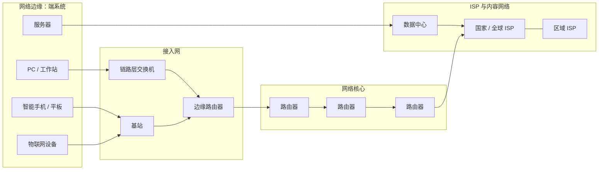
```mermaid
graph LR
  subgraph Edge["网络边缘：端系统"]
    PC["PC / 工作站"]
    SRV["服务器"]
    MOB["智能手机 / 平板"]
    IOT["物联网设备"]
  end

  subgraph Access["接入网"]
    LS["链路层交换机"]
    ER["边缘路由器"]
    BS["基站"]
  end

  subgraph Core["网络核心"]
    R1["路由器"]
    R2["路由器"]
    R3["路由器"]
  end

  subgraph Service["ISP 与内容网络"]
    REG["区域 ISP"]
    TIER["国家 / 全球 ISP"]
    DC["数据中心"]
  end

  PC --> LS --> ER
  SRV --> DC --> TIER
  MOB --> BS --> ER
  IOT --> BS
  ER --> R1 --> R2 --> R3 --> TIER
  TIER --- REG
```

端系统通过 **通信链路（communication link）** 和 **分组交换机（packet switch）** 的网络连接到一起。

1.2 节将介绍多种类型的通信链路，它们由不同的物理媒介组成，包括同轴电缆、铜线、光纤和无线电频谱。

不同的链路能够以不同的速率传输数据。链路的 **传输速率（transmission rate）** 以比特/秒（bit/s，或 bps）度量。

当一台端系统要向另一台端系统发送数据时，发送端系统将数据分段，并为每段加上首部字节。由此形成的信息包用计算机网络的术语来说就是 **分组（packet）**。

这些分组通过网络发送到目的端系统，在那里被装配成初始数据。

分组交换机从一条入通信链路接收到达的分组，并从一条出通信链路转发该分组。

市面上有各种类型、各具特色的分组交换机，但在当今的因特网中，两种常见的类型是：

- **路由器（router）**
- **链路层交换机（link-layer switch）**

这两种类型的交换机都要向最终目的地转发分组。链路层交换机通常用于接入网中，而路由器通常用于网络核心中。

从发送端系统到接收端系统，一个分组所经历的一系列通信链路和分组交换机称为通过该网络的 **路径（route 或 path）**。

思科公司曾预测，全球年度 IP 流量终将达到泽字节（ZB，$10^{21}$ 字节）量级（具体年份和数值因预测版本而异）。

用于传送分组的分组交换网络在许多方面类似于承载运输车辆的运输网络，该网络包括高速公路、公路和交叉口。

例如，一个工厂要把大量货物运到数千公里外的某个仓库。在工厂中，货物被分装到卡车上；然后，每辆卡车独立地通过高速公路、公路和立交桥组成的网络驶向仓库；在目的地卸货，并与同一批货物的其余部分堆放在一起。

因此，在许多方面：

- 分组类似于卡车；
- 通信链路类似于高速公路和公路；
- 分组交换机类似于交叉口；
- 端系统类似于建筑物。

就像卡车选取运输网络的一条路径前行一样，分组则选取计算机网络的一条路径前行。

端系统通过 **因特网服务提供商（Internet Service Provider，ISP）** 接入因特网。ISP 有多种类型：

- 住宅区 ISP，如本地有线或电话公司
- 公司 ISP 和大学 ISP
- 在机场、旅馆、咖啡店和其他公共场所提供 WiFi 接入的 ISP
- 为智能手机和其他设备提供移动接入的蜂窝数据 ISP

每个 ISP 自身就是一个由多台分组交换机和多段通信链路组成的网络。各 ISP 为端系统提供不同类型接入：住宅宽带接入（如线缆调制解调器或 DSL）、高速局域网接入和移动无线接入。ISP 也为内容提供者提供接入服务，直接将服务器连入因特网。

因特网把各处的端系统彼此连接起来，因此为端系统提供接入的 ISP 也必须互联。较低层的 ISP 通过国家的、国际的较高层 ISP 互联起来，并且这些较高层 ISP 彼此直接互联。较高层 ISP 是由通过高速光纤链路互联的高速路由器组成的。

无论是较高层还是较低层 ISP 网络，每个 ISP 网络都是独立管理的，运行着 IP 协议，遵从一定的命名和地址规则。我们将在 1.3 节中更为详细地研究 ISP 及其互联的情况。

端系统、分组交换机和其他因特网部件都要运行多个 **协议（protocol）**，这些协议控制因特网中信息的接收和发送。

TCP（Transmission Control Protocol，传输控制协议）和 IP（Internet Protocol，网际协议）是因特网中两个最为重要的协议。IP 协议定义了在路由器和端系统之间发送和接收的分组格式。因特网的主要协议统称为 TCP/IP。

我们在这一章中就开始接触这些协议。但这仅仅是个开始，本书的许多内容都与计算机网络协议有关。

鉴于因特网协议的重要性，为使人们能够创造可交互操作的系统与产品，必须就各协议及其作用达成一致。这正是标准发挥作用的地方。

因特网标准（Internet standard）由因特网工程任务组（Internet Engineering Task Force，IETF）研发。IETF 的标准文档称为 **请求评论（Request For Comment，RFC）**。RFC 最初只是普通的请求评论，因此而得名，目的是解决因特网先驱者面临的网络和协议问题。

RFC 文档往往技术性很强并且相当详细。它们定义了 TCP、IP、HTTP（用于 Web）和 SMTP（用于电子邮件）等协议。目前 RFC 已累计约 1 万个（仍在持续增加）。

其他组织也在制定用于网络组件的标准，最引人注目的是针对网络链路的标准。例如，IEEE 802 LAN/MAN 标准化委员会制定了以太网和无线 WiFi 的标准。

### 1.1.2 服务描述

前面的讨论已经辨识了构建因特网的许多部件。但是我们也能从一个完全不同的角度，即从为应用程序提供服务的基础设施的角度来描述因特网。

除了诸如电子邮件和浏览器等传统应用外，因特网应用还包括移动智能手机和平板电脑应用，其中包括即时通信、实时道路交通信息提醒、电影和电视节目、社交媒体、视频会议、多人游戏以及基于位置的推荐系统。

因为这些应用涉及多个相互交换数据的端系统，故它们被称为 **分布式应用（distributed application）**。

重要的是，因特网应用运行在端系统上，并不运行在网络核心中的分组交换机上。分组交换机虽然能够加速端系统之间的数据交换，但并不关心作为数据源或宿的应用。

下面深入探讨一下"基础设施为应用提供服务"的含义。

假定你有一个激动人心的分布式因特网应用新想法，它可能大大地造福于人类，也可能直接使你名利双收。你将如何把这种想法转换成一种实际的因特网应用呢？

应用运行在端系统上，因此你需要编写运行在端系统上的软件，可以用 Java、C 或 Python 等语言。既然这是一种分布式应用，运行在不同端系统上的软件还需要互相发送数据。

这里出现一个核心问题，它引出了描述因特网的另一种方式：作为应用的平台。

运行在一个端系统上的应用怎样才能"指挥"因特网向运行在另一个端系统上的特定目的地程序传送数据呢？

与因特网相连的端系统提供了一个 **套接字接口（socket interface）**，该接口规定了运行在一个端系统上的程序请求因特网基础设施向运行在另一个端系统上的特定目的地程序交付数据的方式。

因特网套接字接口是一套发送程序必须遵循的规则集合，因此因特网能够将数据交付给目的地。我们将在第 2 章详细讨论因特网套接字接口。

此时，我们做一个简单的类比，在本书中我们将经常使用这个类比。

假定 Alice 使用邮政服务向 Bob 发一封信。当然，Alice 不能只把信（相关数据）写好就丢出窗外。

邮政服务要求 Alice 遵循一套规则：将信放入信封，在信封上写清 Bob 的全名、地址和邮政编码，封好信封，贴上邮票，最后投入邮局的信箱。

邮政服务有自己的"邮政服务接口"，即 Alice 必须遵循的这套规则。遵循它，邮政服务才能将信件交付给 Bob。

同理，因特网也有一个发送数据的程序必须遵循的套接字接口，支持因特网向接收数据的程序交付数据。

当然，邮政服务提供快递、挂号信、普通邮件等多种服务。同样，因特网向应用提供多种服务；研发因特网应用时，必须为应用选择其中一种。我们将在第 2 章中描述因特网服务。

我们已经给出了因特网的两种描述方法：

1. 根据它的硬件和软件组件来描述；
2. 根据基础设施向分布式应用提供的服务来描述。

但是，你也许还是对什么是因特网感到困惑。什么是分组交换和 TCP/IP？什么是路由器？因特网中正在使用什么样的通信链路？什么是分布式应用？一个温度调节装置或人体秤如何与因特网相连？

如果你现在还对这些心存疑惑，请不要担心。这本书除了向你介绍因特网的具体构成外，还要介绍支配因特网的工作原理以及其中的来龙去脉。我们将在后续章节中解释这些重要的术语和问题。

### 1.1.3 什么是协议

既然我们已经对因特网是什么有了一点印象，那么下面考虑计算机网络中另一个重要的术语：**协议（protocol）**。

什么是协议？协议是用来干什么的？

#### 1. 人类活动的类比

也许理解计算机网络协议这一概念的最容易办法是先与某些人类活动进行类比，因为我们人类无时无刻不在执行协议。

考虑你想向某人询问时间时会怎样做。图 1-2 显示了一种典型的交互过程。

人类协议（至少是有礼貌的行为方式）要求一方首先进行问候，从而开始与另一个人的通信。对"你好"的典型响应是返回一个"你好"报文。

若对方用热情的"你好"回应，则隐含着一个信息：可以继续向他询问时间。若对最初的"你好"作出别的响应（例如"不要烦我"或"我不会说英语"），则表明对方勉强或无法继续通信。

在此情况下，按照人类协议，发话者就不能询问时间了。有时问题根本得不到任何回答，发话者通常会放弃询问。

注意，人类协议中既有我们发送的特定报文，也有根据收到的应答报文或其他事件（如给定时间内没有回答）而采取的操作。

可见，报文的发送与接收，以及报文收发或其他事件出现时所采取的操作，在人类协议中起到核心作用。

如果人们使用不同的协议（例如一方讲礼貌而另一方不讲，或一方明白时间概念而另一方不理解），协议就无法交互，也就不能完成有用的工作。

网络中也一样：为了完成一项工作，要求两个（或多个）通信实体运行相同的协议。

**人类协议示例**：

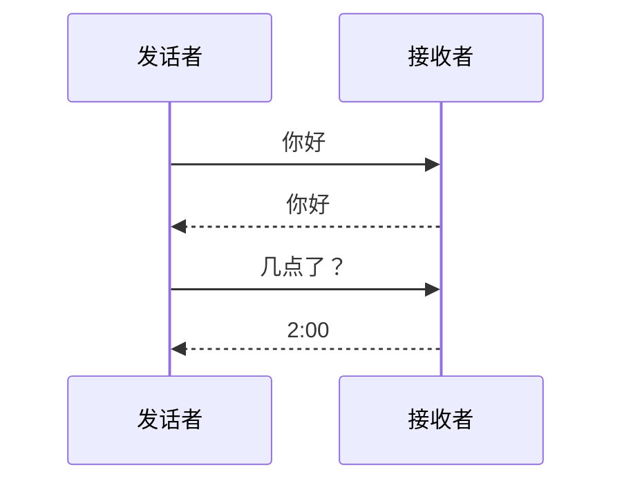
```mermaid
sequenceDiagram
    participant A as 发话者
    participant B as 接收者
    A->>B: 你好
    B-->>A: 你好
    A->>B: 几点了？
    B-->>A: 2:00
```

**计算机网络协议示例**：

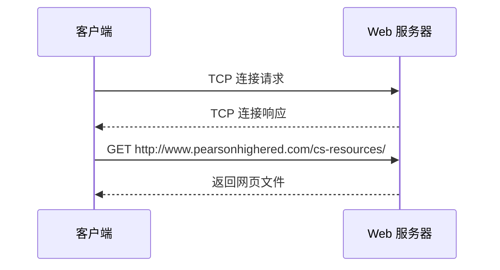
```mermaid
sequenceDiagram
    participant C as 客户端
    participant S as Web 服务器
    C->>S: TCP 连接请求
    S-->>C: TCP 连接响应
    C->>S: GET http://www.pearsonhighered.com/cs-resources/
    S-->>C: 返回网页文件
```

我们再考虑第二个人类类比的例子。

假定你正在大学课堂里上课（例如上的是计算机网络课程）。教师正在唠唠叨叨地讲述协议，而你困惑不解。这名教师停下来问："同学们有什么问题吗？"

教师发送出一个报文，该报文被所有没有睡觉的学生接收到了。你举起了手，向教师发送了一个隐含的报文。这位教师面带微笑地示意你说："请讲……"

教师发出的这个报文鼓励你提出问题，教师喜欢被问问题。接着你就问了问题，向该教师传输了你的报文。教师听取了你的问题，接收了你的问题报文，并加以回答，向你传输了回答报文。

我们再一次看到了报文的发送和接收，以及这些报文发送和接收时所采取的一系列约定俗成的操作，这些就是这个"提问与回答"协议的关键所在。

#### 2. 网络协议

网络协议类似于人类协议，只是交换报文和采取操作的实体是某些设备（可以是计算机、智能手机、平板电脑、路由器或其他具有网络能力的设备）的硬件或软件组件。

在因特网中，涉及两个或多个远程通信实体的所有活动都受协议的制约。

例如：

- 在两台物理上连接的计算机中，硬件实现的协议控制了在两块网络接口卡间的"线上"比特流；
- 在端系统中，拥塞控制协议控制了在发送方和接收方之间传输的分组发送的速率；
- 路由器中的协议决定了分组从源到目的地的路径。

在因特网中，协议无处不在，因此本书的大量篇幅都与计算机网络协议有关。

以大家可能熟悉的一个网络协议为例：当你在 Web 浏览器中键入一个网页的 URL，向 Web 服务器发出请求时，发生了什么？

图 1-2 中的网络协议示例显示了这一情形。首先，你的计算机向该 Web 服务器发送一条连接请求报文，并等待回答。Web 服务器接收到连接请求报文后，返回一条连接响应报文。

得知请求该 Web 文档正常以后，计算机在一条 GET 报文中发送该网页的名字，以从这台 Web 服务器上取回该网页。最后，Web 服务器向你的计算机返回该 Web 网页（文件）。

从上述人类活动和网络示例可见，报文的交换以及收发这些报文时所采取的操作，是定义协议的关键元素：

> [!note] 协议的定义
> **协议（protocol）** 定义了在两个或多个通信实体之间交换的报文的格式和顺序，以及报文的发送和接收或其他事件所采取的操作。

因特网（更一般地说是计算机网络）广泛使用协议。不同的协议用于完成不同的通信任务。

当你阅读完这本书后将会知道，某些协议简单且直截了当，而某些协议则复杂且晦涩难懂。掌握计算机网络知识的过程就是理解网络协议的构成、原理和工作方式的过程。

# 第二部分 网络边缘：端系统、接入网与物理媒介

从边缘看起。先看端系统，再看接入网，最后看物理媒介。

## 1.2 网络边缘

上一节给出了因特网和网络协议的总体概述，现在更深入地探究计算机网络（特别是因特网）的部件。

本节从网络边缘开始，观察我们更为熟悉的部件，即日常使用的计算机、智能手机和其他设备。在接下来的一节中，我们将从网络边缘向网络核心推进，了解计算机网络中的交换和选路。

按前一节的术语，与因特网相连的计算机和其他设备称为 **端系统**——因为它们位于因特网的边缘。

因特网的端系统包括：

- 桌面计算机，例如桌面 PC、Mac 和 Linux 设备
- 服务器，例如 Web 和电子邮件服务器
- 移动计算机，例如便携机、智能手机和平板电脑

此外，越来越多的非传统物品正被作为端系统与因特网相连。

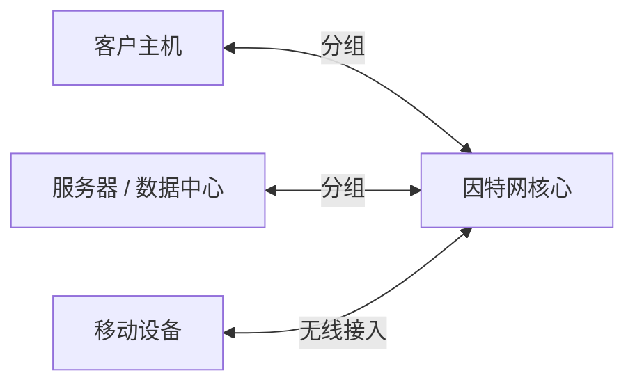
```mermaid
graph LR
  C1["客户主机"] <-->|"分组"| NET["因特网核心"]
  S1["服务器 / 数据中心"] <-->|"分组"| NET
  C2["移动设备"] <-->|"无线接入"| NET
```

端系统也称为 **主机（host）**，因为它们容纳（即运行）应用程序，如 Web 浏览器程序、Web 服务器程序、电子邮件客户程序或电子邮件服务器程序等。

本书通篇将交替使用主机和端系统这两个术语，二者含义相同。

主机有时又被进一步划分为两类：**客户（client）** 和 **服务器（server）**。

不严格地说，客户通常是桌面 PC、移动 PC 和智能手机等，而服务器通常是更为强大的机器，用于存储和发布 Web 页面、流视频、中继电子邮件等。

今天，大部分提供搜索结果、电子邮件、Web 网页、视频和移动应用内容的服务器都属于大型 **数据中心（data center）**。

例如，原书写作时谷歌公司拥有 19 个主要的数据中心，分布在世界各地，总计包括数百万台服务器（数量随时间变化）。

> [!note] 数据中心和云计算
> 诸如谷歌、微软、亚马逊和阿里巴巴这样的因特网公司已经建立了巨大的数据中心，每个数据中心容纳数万到数百万台主机。数据中心是支撑日常因特网应用的引擎，其内部也有复杂的互联网络。

以亚马逊为例，数据中心有三个用途：

1. 为用户提供亚马逊电子商务页面，例如描述产品和购买信息的页面
2. 为亚马逊专用的数据处理任务提供大规模并行计算基础设施
3. 为其他公司提供 **云计算（cloud computing）**

今天计算领域的一个主要趋势是：公司使用亚马逊这样的云提供商，几乎可以处理所有的 IT 需求。

例如，Airbnb 公司和很多其他基于因特网的公司并不拥有和管理自己的数据中心，而是在亚马逊云中运行整个基于 Web 的服务，即亚马逊 Web 服务（AWS）。

数据中心的"工蜂"是主机。它们提供内容（如 Web 页面和视频）服务、存储电子邮件和文档，并共同执行大量的分布式计算。

数据中心中的主机称为刀片服务器，其外形类似比萨盒，通常是包括 CPU、内存和磁盘存储器的商品化主机。主机堆放在机架中，每个机架通常包括 20～40 个刀片服务器，机架之间再由复杂且不断发展的数据中心网络设计连接起来。

我们将在第 6 章中更为详细地讨论数据中心网络。

### 1.2.1 接入网

了解了位于网络边缘的应用程序和端系统后，接下来考虑 **接入网**，即将端系统物理连接到其 **边缘路由器（edge router）** 的网络。

边缘路由器是端系统到任何其他远程端系统的路径上的第一台路由器。

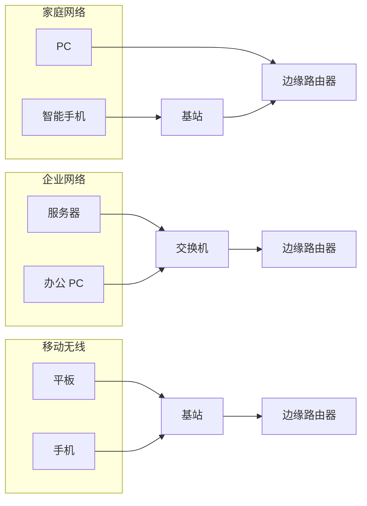
```mermaid
graph LR
  subgraph Home["家庭网络"]
    PC1["PC"]
    Phone1["智能手机"]
  end

  subgraph Company["企业网络"]
    Server["服务器"]
    PC2["办公 PC"]
  end

  subgraph Mobile["移动无线"]
    Tablet["平板"]
    Phone2["手机"]
  end

  PC1 --> ER1["边缘路由器"]
  Phone1 --> BS["基站"] --> ER1
  Server --> SW["交换机"] --> ER2["边缘路由器"]
  PC2 --> SW
  Tablet --> BS2["基站"] --> ER3["边缘路由器"]
  Phone2 --> BS2
```

#### 1. 家庭接入：DSL、电缆、FTTH 和 5G 固定式无线

到 2020 年为止，欧洲和美国超过 80% 的家庭实现了因特网接入。本节从家庭接入开始，简要介绍几种主要的接入技术。

今天，宽带住宅接入有两种最流行的类型：**数字用户线（Digital Subscriber Line，DSL）** 和 **电缆**。

住户通常从提供本地电话接入的本地电话公司处获得 DSL 因特网接入。因此，在使用 DSL 时，用户的本地电话公司也是它的 ISP。

每个用户的 DSL 调制解调器使用现有的电话线与位于电话公司的本地中心局（Central Office，CO）中的 **数字用户线接入复用器（DSLAM）** 交换数据。

家庭的 DSL 调制解调器得到数字数据后将其转换为高频音，以通过电话线传输给本地中心局；来自许多家庭的模拟信号在 DSLAM 处被转换回数字形式。

住宅电话线同时承载数据与传统的电话信号，二者用不同的频率进行编码：

- 高速下行信道，位于 $50\text{kHz} \sim 1\text{MHz}$ 频段
- 中速上行信道，位于 $4\text{kHz} \sim 50\text{kHz}$ 频段
- 普通的双向电话信道，位于 $0 \sim 4\text{kHz}$ 频段

这种方法使单根 DSL 线路看起来就像有 3 根单独的线路一样，因此一个电话呼叫和一个因特网连接能够同时共享 DSL 链路。

在用户一侧，一个分频器把到达家庭的数据信号和电话信号分隔开，并将数据信号转发给 DSL 调制解调器。在电话公司一侧，在本地中心局中，DSLAM 把数据和电话信号分隔开，并将数据送往因特网。

数百甚至上千个家庭与同一个 DSLAM 相连。

DSL 的传输速率因标准版本而异：原书所引版本定义了多个传输速率，包括 24 Mbps 和 52 Mbps 的下行速率、3.5 Mbps 和 16 Mbps 的上行速率；最新的标准还定义了总计约 1 Gbps 的上行加下行速率。

因为这些上行速率和下行速率是不同的，所以这种接入被称为 **不对称的**。

实际取得的下行和上行速率也许小于上述速率：DSL 提供商提供分等级的服务时（不同价格对应不同速率），可能有意识地限制住宅速率；家庭与本地中心局之间的距离、双绞线规格和电气干扰程度也会限制最大速率。

DSL 专为家庭与本地中心局之间的短距离接入而设计。一般而言，住宅距离本地中心局超过 5～10 英里时，就必须采用其他形式的因特网接入。

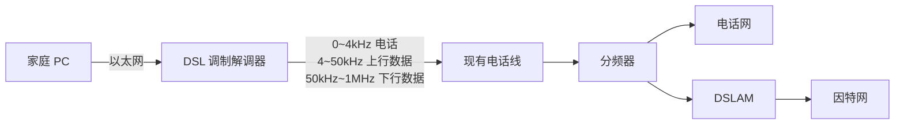
```mermaid
graph LR
  PC["家庭 PC"] -->|"以太网"| MODEM["DSL 调制解调器"]
  MODEM -->|"0~4kHz 电话\n4~50kHz 上行数据\n50kHz~1MHz 下行数据"| LINE["现有电话线"]
  LINE --> SPLIT["分频器"]
  SPLIT --> PHONE["电话网"]
  SPLIT --> DSLAM["DSLAM"]
  DSLAM --> ISP["因特网"]
```

DSL 利用电话公司现有的本地电话基础设施，而 **电缆因特网接入（cable Internet access）** 利用了有线电视公司现有的有线电视基础设施。

住宅从提供有线电视的公司获得了电缆因特网接入。

光缆将电缆头端连接到地区枢纽，从这里通过传统的同轴电缆到达各个家庭和各个公寓。每个地区枢纽通常支持 500～5000 个家庭。

因为在这个系统中既应用了光纤也应用了同轴电缆，所以它经常被称为 **混合光纤同轴（Hybrid Fiber Coax，HFC）** 系统。

电缆因特网接入需要特殊的调制解调器，这种调制解调器称为 **电缆调制解调器（cable modem）**。与 DSL 调制解调器一样，电缆调制解调器通常是一个外部设备，通过一个以太网端口连接到家庭 PC。

在电缆头端，**电缆调制解调器端接系统（Cable Modem Termination System，CMTS）** 与 DSL 网络的 DSLAM 具有类似的功能，即将来自许多下行家庭中的电缆调制解调器发送的模拟信号转换回数字形式。

电缆调制解调器将 HFC 网络划分为下行和上行两个信道。如同 DSL，接入通常是不对称的，下行信道分配的传输速率通常比上行信道的高。

DOCSIS 不同版本定义了不同的上下行速率（例如下行从数十 Mbps 到 Gbps 量级，上行从数十 Mbps 到百 Mbps 量级，具体以标准版本为准）。

与 DSL 网络一样，由于合同数据率较低或媒介损耗，实际速率可能不一定能达到最大值。

电缆因特网接入的一个重要特征是 **共享广播媒体**。特别是，由头端发送的每个分组下行经每段链路到达每个家庭；每个家庭发送的每个分组经上行信道传输到达头端。

因此，如果几个用户同时经下行信道下载一个视频文件，每个用户接收视频文件的实际速率将大大低于电缆总计的下行速率。

另一方面，如果仅有很少的活跃用户，则每个用户都可以以全部的下行速率接收 Web 网页——用户很少在完全相同的时刻请求网页。

因为上行信道也是共享的，所以需要一个分布式多路访问协议来协调传输和避免碰撞。我们将在第 6 章中更为详细地讨论碰撞问题。

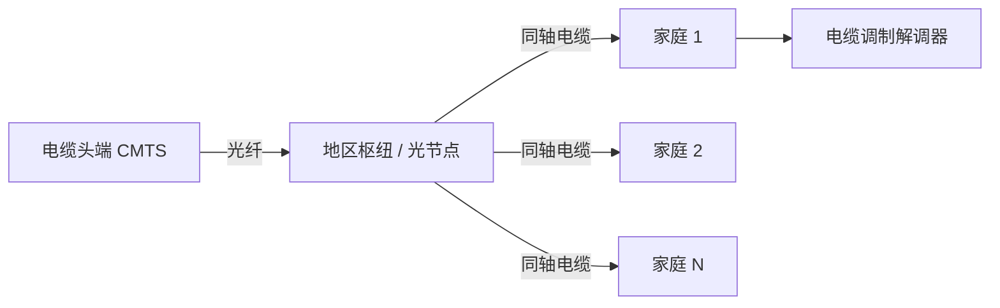
```mermaid
graph LR
  HEAD["电缆头端 CMTS"] -->|"光纤"| NODE["地区枢纽 / 光节点"]
  NODE -->|"同轴电缆"| HOME1["家庭 1"]
  NODE -->|"同轴电缆"| HOME2["家庭 2"]
  NODE -->|"同轴电缆"| HOMEN["家庭 N"]
  HOME1 --> MODEM["电缆调制解调器"]
```

DSL 和电缆网络是当前大多数美国住宅宽带接入所使用的技术，另有一种很有前途的技术：**光纤到户（Fiber To The Home，FTTH）**。

顾名思义，FTTH 提供了一条从本地中心局直达家庭的光纤路径。FTTH 能够提供大约每秒千兆比特的因特网接入速率。

从本地中心局到家庭，有几种相互竞争的光纤分布方案。

最简单的光纤分布网络称为 **直接光纤**，从本地中心局到每户设置一根光纤。

更常见的情况是：从中心局出来的每根光纤由许多家庭共享，直到相对接近这些家庭的位置，才分成每户一根光纤。

进行这种分配时，有两种光纤分布体系结构：

- **有源光纤网络（Active Optical Network，AON）**
- **无源光纤网络（Passive Optical Network，PON）**

AON 本质上就是交换以太网，我们将在第 6 章讨论。

这里简要讨论 PON，该技术用于 Verizon 的 FiOS 服务。

每个家庭都有一个 **光纤网络端接器（Optical Network Terminator，ONT）**，它由专门的光纤连接到邻近的分配器（splitter）。该分配器把一些家庭（通常少于 100 个）连接到一根共享的光纤，该光纤再连接到本地电话公司的中心局中的 **光纤线路端接器（Optical Line Terminator，OLT）**。

该 OLT 提供了光信号和电信号之间的转换，经过本地电话公司路由器与因特网相连。

在家庭中，用户将一台家庭路由器（通常是无线路由器）与 ONT 相连，并经过这台家庭路由器接入因特网。

在 PON 体系结构中，所有从 OLT 发送到分配器的分组在分配器处复制，分配器类似于一个电缆头端。

> [!note] 下行广播、上行共享
> PON 的下行分组在分配器处被复制，与 HFC 的共享下行类似；上行方向各家庭共享同一根光纤，需要协调发送。

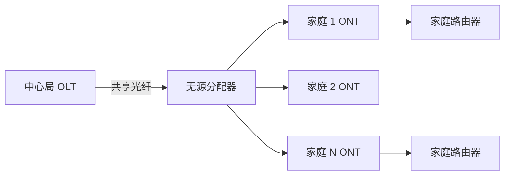
```mermaid
graph LR
  CO["中心局 OLT"] -->|"共享光纤"| SPLIT["无源分配器"]
  SPLIT --> ONT1["家庭 1 ONT"]
  SPLIT --> ONT2["家庭 2 ONT"]
  SPLIT --> ONTN["家庭 N ONT"]
  ONT1 --> ROUTER1["家庭路由器"]
  ONTN --> ROUTERN["家庭路由器"]
```

FTTH 有潜力提供每秒千兆比特的接入速率。不过，大多数 FTTH ISP 提供多档速率供选择，速率越高价格越贵。

原书所引数据中，美国 FTTH 用户在 2011 年前后的平均下行速率约为 20 Mbps，明显高于电缆接入网当时约 13 Mbps 的平均水平，更远高于 DSL 当时约 5 Mbps 的平均水平。

除了 DSL、电缆和 FTTH，**5G 固定式无线** 已经开始部署。

5G 固定式无线不仅提供高速住宅接入，而且无需布线、安装成本较低，省去了从电信公司本地中心局到家庭的易产生故障的有线系统。

采用 5G 固定式无线时，数据使用波束成形技术从供应商的基站无线发送到家中的调制解调器；无线路由器与该调制解调器相连（可能捆绑在一起），类似于 WiFi 无线路由器与电缆或 DSL 调制解调器相连的方式。

第 7 章还会介绍 5G 蜂窝网络。

#### 2. 企业（和家庭）接入：以太网和 WiFi

在公司和大学校园以及越来越多的家庭环境中，都使用 **局域网（LAN）** 将端系统连接到边缘路由器。

局域网技术有很多种，但 **以太网** 到目前为止是公司、大学和家庭网络中最为流行的接入技术。

以太网用户使用双绞铜线与一台以太网交换机相连（相关技术将在第 6 章详细讨论）；交换机或交换机网络再与更大的因特网相连。

使用以太网接入时，用户通常以 100 Mbps～1 Gbps 的速率接入以太网交换机，而服务器可能具有 1 Gbps 甚至 10 Gbps 的接入速率。

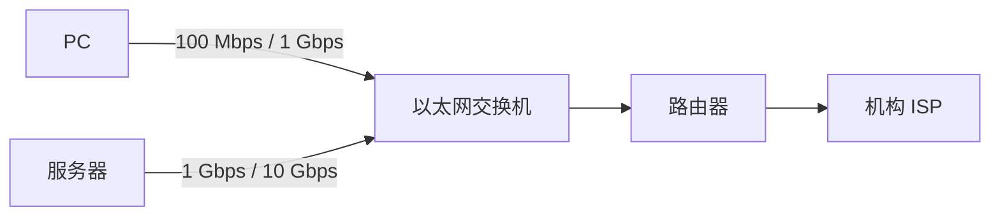
```mermaid
graph LR
  PC["PC"] -->|"100 Mbps / 1 Gbps"| SW["以太网交换机"]
  SRV["服务器"] -->|"1 Gbps / 10 Gbps"| SW
  SW --> ER["路由器"] --> ISP["机构 ISP"]
```

然而，越来越多的人使用便携机、智能手机、平板电脑和其他物品无线接入因特网。

在无线 LAN 环境中，无线用户向接入点发送分组、从接入点接收分组，该接入点与企业网连接（很可能使用有线以太网），企业网再与有线因特网相连。

无线 LAN 用户通常必须位于距离接入点几十米的范围内。

基于 IEEE 802.11 技术的无线 LAN 接入通常称为 **WiFi**，目前几乎无所不在——大学、办公室、咖啡厅、机场、家庭，甚至在飞机上都能见到。

如第 7 章将要详细讨论的那样，原书写作时 802.11 提供高达 100 Mbps 量级的共享传输速率（具体因 802.11 标准版本而异，新版本可达千兆比特量级）。

以太网和 WiFi 接入网最初出现在企业（公司或大学）环境中，如今也成为家庭网络中的常见部件。

今天许多家庭将宽带住宅接入（电缆调制解调器或 DSL）与廉价的无线局域网技术结合起来，组成强大的家用网络。

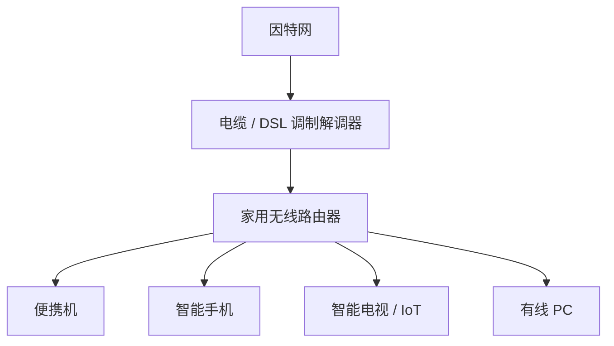
```mermaid
graph TB
  NET["因特网"] --> MOD["电缆 / DSL 调制解调器"]
  MOD --> HR["家用无线路由器"]
  HR --> LAP["便携机"]
  HR --> PHONE["智能手机"]
  HR --> TV["智能电视 / IoT"]
  HR --> PC["有线 PC"]
```

这个家庭网络组成如下：

- 一台漫游的便携机
- 多个与因特网相连的家电产品
- 一台有线 PC
- 一个与无线 PC 和家中其他无线设备通信的基站（无线接入点）
- 一个将无线接入点和家中其他无线设备与因特网相连的家用路由器

该网络允许家庭成员经宽带接入因特网，家庭中的任何成员都可以在厨房、院子或卧室漫游上网。

#### 3. 广域无线接入：3G、LTE、4G 和 5G

iPhone 和安卓等设备越来越多地用于在移动环境中发信息、在社交网络中分享照片、进行移动支付、观看视频和播放音乐等。

这些设备应用了与蜂窝移动电话相同的无线基础设施，通过蜂窝网提供商运营的基站发送和接收分组。

与 WiFi 不同，用户只需要位于距离基站数万米（而不是几十米）的范围内。

电信公司已经在所谓的第四代（4G）无线技术中进行了大量投资，4G 峰值下载速率可达数十 Mbps 量级（实际速率因部署和负载而异）。

甚至更高速率的广域接入技术，即第五代（5G）广域无线网络也已经开始部署了。

我们将在第 7 章讨论无线网络和移动性，以及 WiFi、4G 和 5G 等技术的基本原则。

### 1.2.2 物理媒介

前文概述了因特网中一些最重要的网络接入技术，也提到了它们所用的物理媒介，例如：

- HFC 使用了光缆和同轴电缆相结合的技术
- DSL 和以太网使用了双绞铜线
- 移动接入网使用了无线电频谱

本节简要概述这些媒介以及其他常在因特网中使用的传输媒介。

为明确物理媒介的含义，先来看一个比特的短暂历程。

比特从一个端系统开始传输，通过一系列链路和路由器，到达另一个端系统。这个比特被漫不经心地传输了许许多多次！

源端系统首先发送这个比特，不久后第一台路由器接收该比特；第一台路由器发送该比特，接着第二台路由器接收该比特；依此类推。

因此，比特从源到目的地传输时，会经过一系列传输器-接收器对；对每一对而言，比特都是通过传播电磁波或光脉冲的方式跨越某种 **物理媒介（physical medium）** 发送的。

物理媒介可以有多种形式，沿途每个传输器-接收器对使用的媒介不必相同。

物理媒介的例子包括：

- 双绞铜线
- 同轴电缆
- 多模光纤电缆
- 陆地无线电频谱
- 卫星无线电频谱

物理媒介分成两种类型：

1. **导引型媒介（guided media）**：电波沿着固体媒介前行，如光缆、双绞铜线或同轴电缆。
2. **非导引型媒介（unguided media）**：电波在空气或外层空间中传播，例如在无线局域网或数字卫星频道中传播。

在深入讨论各种媒介类型的特性之前，先简要看看它们的成本。

物理链路（铜线、光缆等）的实际成本与其他网络成本相比通常是相当小的。然而，安装物理链路的劳动力成本要比材料成本高出几个数量级。

因此，许多建筑商在建筑物的每个房间中都预装了双绞线、光缆和同轴电缆：即使最初只用一种媒介，将来也可能用到另一种，这样日后不必重新布线，从而节省经费。

#### 1. 双绞铜线

最便宜并且最常用的导引型传输媒介是 **双绞铜线**。

一百多年来，它一直用于电话网。事实上，从电话机到本地电话交换机的连线超过 99% 使用的是双绞铜线。

我们在自己家中和工作场所都见过双绞线。

双绞线由两根绝缘的铜线组成，每根大约 1 mm 粗，以规则的螺旋状排列。两根线绞合起来，可以减少邻近类似双绞线的电气干扰。

通常许多双绞线捆扎在一起形成一根电缆，并在这些双绞线外面覆盖上保护性防护层。一对电线构成了一条通信链路。

**无屏蔽双绞线（Unshielded Twisted Pair，UTP）** 常用在建筑物内的计算机网络中，即用于局域网中。

目前局域网中双绞线的数据速率为 10 Mbps～10 Gbps。所能达到的数据传输速率取决于导线线径以及传输方和接收方之间的距离。

20 世纪 80 年代出现光纤技术时，许多人因为双绞线比特速率相对较低而轻视它，某些人甚至认为光纤技术将完全代替双绞线。

但双绞线不是那么容易被抛弃的：现代双绞线技术（例如 6a 类电缆）能够达到 10 Gbps 的数据传输速率，距离长达 100 m，最终成为高速 LAN 联网的主导性解决方案。

如前面讨论的那样，双绞线也经常用于住宅因特网接入：拨号调制解调器技术通过双绞线能使接入速率达到 56 kbps；当用户靠近 ISP 的中心局居住时，DSL 技术通过双绞线使住宅用户以数十 Mbps 的速率接入因特网。

#### 2. 同轴电缆

与双绞线类似，同轴电缆由两根铜导体组成，但是这两根导体是同心的而不是并行的。

借助于这种结构及特殊的绝缘体和保护层，同轴电缆能够达到较高的数据传输速率。

同轴电缆在电缆电视系统中应用相当普遍。我们前面已经看到，电缆电视系统最近与电缆调制解调器结合起来，为住宅用户提供数百 Mbps 速率的因特网接入。

在电缆电视和电缆因特网接入中，发送设备将数字信号调制到某个特定的频段，产生的模拟信号从发送设备传送到一个或多个接收方。

同轴电缆可用作 **导引型共享媒介（shared medium）**：许多端系统能够直接与该电缆相连，每个端系统都能接收由其他端系统发送的内容。

#### 3. 光纤

光纤是一种细而柔软的、能够导引光脉冲的媒介，其中每个脉冲表示一个比特。

一根光纤能够支持极高的比特速率，高达数十甚至数百 Gbps。它们不受电磁干扰，对长达 100 km 的光缆信号衰减极低，并且很难窃听。

这些特征使得光纤成为长途导引型传输媒介，特别适用于跨海链路。

在美国和其他地方，许多长途电话网络现在全面使用光纤。光纤也广泛用于因特网的主干。

然而，高成本的光设备（如发射器、接收器和交换机）阻碍了光纤在短途传输中的应用，在 LAN 或家庭接入网中一般就不使用它们。

**光载波（Optical Carrier，OC）** 标准链路速率的范围从 51.8 Mbps 到 39.8 Gbps。这些标准常被称为 OC-n，其中的链路速率等于：

$$
n \times 51.8 \text{ Mbps}
$$

目前正在使用的标准包括 OC-1、OC-3、OC-12、OC-24、OC-48、OC-96、OC-192、OC-768。

#### 4. 陆地无线电信道

无线电信道用电磁频谱承载信号，不需要安装物理线路，并具有穿透墙壁、连接移动用户以及长距离承载信号的能力，因而是一种有吸引力的媒介。

无线电信道的特性极大地依赖于传播环境和信号传输的距离。环境方面的考虑包括：

- 路径损耗和遮挡衰落：信号跨距离传播及绕过或穿过阻碍物体时强度降低
- 多径衰落：干扰物体反射信号所致
- 干扰：其他传输或电磁信号所致

陆地无线电信道可大致划分为三类：

1. 一类运行在很短距离，如 1 m 或 2 m；
2. 另一类运行在局域，通常跨越数十到几百米；
3. 第三类运行在广域，跨越数万米。

个人设备如无线耳机、键盘和医疗设备跨短距离运行。在 1.2.1 节中描述的无线 LAN 技术使用了局域无线电信道，蜂窝接入技术使用了广域无线电信道。

我们将在第 7 章中详细讨论无线电信道。

#### 5. 卫星无线电信道

一颗通信卫星连接地球上的两个或多个微波发射器/接收器，它们被称为 **地面站**。

该卫星在一个频段上接收传输，使用一个转发器再生信号，并在另一个频率上发射信号。

通信中常使用两类卫星：

1. **同步卫星（geostationary satellite）**
2. **近地轨道（Low-Earth Orbiting，LEO）卫星**

同步卫星永久地停留在地球上方的相同点上。这种静止性是通过将卫星置于地球表面上方 36000 km 的轨道上而取得的。

从地面站到卫星再回到地面站的巨大距离带来了可观的传播时延：单向约 270 ms（往返约 540 ms）。不过，能以数百 Mbps 速率运行的卫星链路，通常用于无法使用 DSL 或电缆因特网接入的区域。

近地轨道卫星离地球近得多，且不固定在地球上方的某一点，而是像月亮一样围绕地球旋转；它们彼此之间可以通信，也可以与地面站通信。

为了对某个区域提供连续覆盖，需要在轨道上放置许多卫星。当前已有多套低轨道通信系统投入运行，LEO 卫星技术也被用于因特网接入。

# 第三部分 网络核心：交换与互联

核心解决一件事：分组如何从源到目的地。先讲分组交换，再讲电路交换，最后讲网络的网络。

## 1.3 网络核心

考察了因特网边缘后，现在更深入地研究 **网络核心**，即由互联因特网端系统的分组交换机和链路构成的网状网络。


```mermaid
graph LR
  subgraph Edge["边缘"]
    ES["端系统"]
  end

  subgraph Access["接入网"]
    ER["边缘路由器"]
  end

  subgraph Core["网络核心"]
    R1["路由器"]
    R2["路由器"]
    R3["路由器"]
  end

  ES --> ER --> R1 --> R2 --> R3 --> ER2["边缘路由器"] --> ES2["远程端系统"]
```

### 1.3.1 分组交换

在某种网络应用中，端系统彼此交换 **报文（message）**。

报文能够包含该应用的设计者需要的任何东西：可以执行一种控制功能，也可以包含数据，例如电子邮件数据、JPEG 图像或 MP3 音频文件。

为了将报文从源端系统发送到目的端系统，源把长报文划分为较小的数据块，即 **分组（packet）**。

在源和目的地之间，每个分组都通过通信链路和分组交换机传送。交换机主要有路由器和链路层交换机两类。

分组以等于该链路最大传输速率的速度通过通信链路。

因此，如果某源端系统或分组交换机经过一条链路发送一个 $L$ bit 的分组，链路的传输速率为 $R$ bps，则传输该分组的时间为：

$$
\frac{L}{R} \text{ s}
$$

#### 1. 存储转发传输

多数分组交换机在链路的输入端使用 **存储转发传输（store-and-forward transmission）** 机制。

存储转发传输是指在交换机开始向输出链路传输该分组的第一个比特之前，必须接收到整个分组。

为了更详细地探讨存储转发传输，考虑由两个端系统经一台路由器连接构成的简单网络。

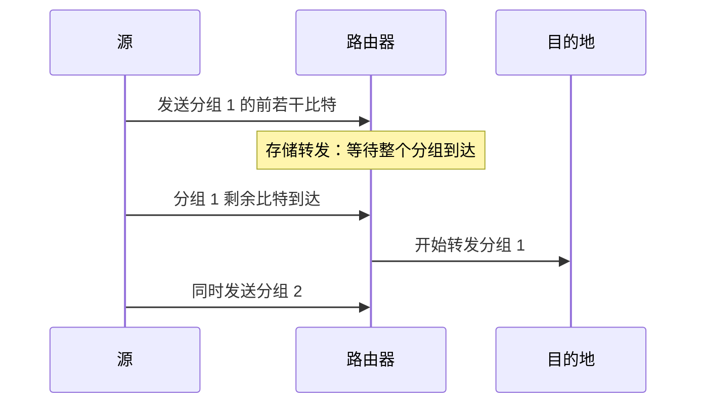
```mermaid
sequenceDiagram
    participant S as 源
    participant R as 路由器
    participant D as 目的地
    S->>R: 发送分组 1 的前若干比特
    Note over R: 存储转发：等待整个分组到达
    S->>R: 分组 1 剩余比特到达
    R->>D: 开始转发分组 1
    S->>R: 同时发送分组 2
```

一台路由器通常有多条连入的链路，因为它的任务就是把一个入分组交换到一条出链路。

在这个例子中，源有 3 个分组要发送给目的地，每个分组由 $L$ bit 组成。

在图 1-11 所示的特定时刻，源已经传输了分组 1 的一部分，分组 1 的前几个比特已经到达了路由器。由于路由器采用存储转发机制，此时它还不能转发已接收的比特，必须先缓存（即"存储"）该分组的比特。

仅当路由器已经接收完该分组的所有比特后，它才能开始向出链路传输（即"转发"）该分组。

为深刻理解存储转发，下面计算从源开始发送分组到目的地收到整个分组所经过的时间。这里忽略传播时延（比特以接近光速跨越线路所需的时间），1.4 节将讨论它。

源在时刻 0 开始传输；时刻 $L/R$ 时，源已发送完整个分组，路由器也接收并存储了该分组的全部比特（忽略传播时延）。

在时刻 $L/R$，路由器刚好接收到整个分组，所以它能够朝着目的地向出链路传输分组；在时刻 $2L/R$，路由器已经传输了整个分组，并且整个分组已经被目的地接收。

所以，总时延是：

$$
2L/R
$$

如果一旦比特到达交换机就转发比特（不必首先收到整个分组），总时延将是 $L/R$。

> [!warning] 本章默认存储转发
> 除非特别说明，本章的交换机都按存储转发方式工作：收到整个分组后才开始向出链路转发。

现在计算从源开始发送第一个分组，到目的地接收全部三个分组所需的时间。

与前面一样，时刻 $L/R$ 时路由器开始转发第一个分组；同一时刻，源已完整发送完第一个分组，于是开始发送第二个分组。

因此，在时刻 $2L/R$，目的地已经收到第一个分组并且路由器已经收到第二个分组。

类似地，在时刻 $3L/R$，目的地已经收到前两个分组并且路由器已经收到第三个分组。

最后，在时刻 $4L/R$，目的地已经收到所有 3 个分组。

下面考虑一般情况：源和目的地之间有 $N-1$ 台路由器，共 $N$ 条速率均为 $R$ 的链路，发送一个分组的端到端时延是：

$$
d_{\text{end-end}} = N \frac{L}{R}
\tag{1-1}
$$

不妨自己推导一下：$P$ 个分组经过这 $N$ 条链路序列的时延有多大？

#### 2. 排队时延和分组丢失

每台分组交换机与多条链路相连。对每条相连的链路，交换机都有一个 **输出缓存**（也称 **输出队列**），用于存储准备发往那条链路的分组。

输出缓存在分组交换中起着重要作用：如果到达的分组需要传输到某条链路，而该链路正忙于传输其他分组，该分组就必须在输出缓存中等待。

因此，除了存储转发时延，分组还要承受输出缓存的 **排队时延（queuing delay）**。

排队时延是变化的，变化程度取决于网络的拥塞等级。

缓存空间是有限的，到达的分组可能发现缓存已被其他等待传输的分组完全占满。此时将出现 **分组丢失（packet loss）**，即到达的分组或已经排队的分组之一将被丢弃。

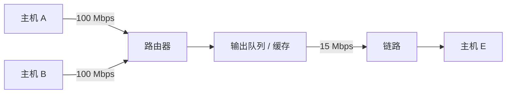
```mermaid
graph LR
  A["主机 A"] -->|"100 Mbps"| R["路由器"]
  B["主机 B"] -->|"100 Mbps"| R
  R --> Q["输出队列 / 缓存"]
  Q -->|"15 Mbps"| C["链路"] --> E["主机 E"]
```

图 1-12 显示了一个简单的分组交换网络，其中所有分组具有相同的长度。

假定主机 A 和 B 向主机 E 发送分组。主机 A 和 B 先通过 100 Mbps 的以太网链路向第一个路由器发送分组，该路由器再将这些分组导向一条 15 Mbps 的链路。

如果在一个短时间间隔内，分组到达路由器的速率超过了 15 Mbps，这些分组在经链路传输之前将在输出缓存中排队，路由器中就会出现拥塞。

例如，如果主机 A 和 B 都各发送一个 5 分组的突发块，则大多数分组将在队列中等待一段时间。

这与日常生活中在银行柜台或收费站前排队的场景完全类似。

我们将在 1.4 节中更为详细地研究这种排队时延。

#### 3. 转发表和路由选择协议

前面说过，路由器从一条相连的链路接收分组，再向另一条相连的链路转发。

那么，路由器怎样决定向哪条链路转发呢？

不同类型的计算机网络以不同方式完成分组转发，这里简要介绍因特网中所采用的方法。

在因特网中，每个端系统都有一个 **IP 地址**。源主机发送分组时，会在分组首部中包含目的地的 IP 地址。

如同邮政地址，IP 地址具有等级结构。

当一个分组到达网络中的路由器时，路由器检查该分组的目的地址的一部分，并向一台相邻的路由器转发该分组。

更具体地说，每台路由器有一个 **转发表（forwarding table）**，将目的地址（或目的地址的一部分）映射为输出链路。

分组到达路由器时，路由器检查其目的地址，用该地址搜索转发表，找到适当的出链路并将分组导向该链路。

也就是说，路由器只看目的地址的一部分，逐跳转发。下面用一个问路的类比来说明。

端到端选路过程可以用一个不使用地图而喜欢问路的汽车驾驶员来类比。

例如，假定 Joe 驾车从费城到佛罗里达州奥兰多市的 Lakeside Drive 街 156 号。

Joe 先驾车到附近的加油站问路。服务员从该地址中取出"佛罗里达州"，告诉 Joe 需要就近驶入 I-95 南州际公路，到达佛罗里达后再问当地人。

于是，Joe 沿 I-95 南州际公路到达佛罗里达的 Jacksonville，再次向加油站服务员问路。服务员从地址中取出"奥兰多市"，告诉他应当继续沿 I-95 公路到 Daytona 海滩，然后再问其他人。

在 Daytona 海滩，服务员同样取出"奥兰多"，告诉 Joe 应当走 I-4 公路直达奥兰多。

Joe 沿 I-4 公路到达奥兰多出口，又问了一位加油站服务员；对方取出"Lakeside Drive"，告诉他前往该街道的走法。

到达 Lakeside Drive 后，Joe 又向一个骑车的小孩问路；小孩取出门牌号 156，指明了房屋的方向。Joe 终于抵达最终目的地。

在这个类比中，加油站服务员和骑车的小孩都相当于路由器。

我们已经知道，路由器用目的地址索引转发表来决定出链路。但这引出了另一个问题：转发表是怎样设置的？

是对每台路由器逐台人工配置，还是由因特网用更自动的过程进行设置？

第 5 章将深入探讨这个问题。这里先给一点提示：因特网使用一些特殊的 **路由选择协议（routing protocol）** 自动设置这些转发表。

例如，路由选择协议可以计算出从每台路由器到每个目的地的最短路径，并用这些结果配置路由器中的转发表。

### 1.3.2 电路交换

通过网络链路和交换机移动数据有两种基本方法：

1. **电路交换（circuit switching）**
2. **分组交换（packet switching）**

上一小节讨论了分组交换网络，现在把注意力转向电路交换网络。

在电路交换网络中，通信会话期间会预留端系统沿路径通信所需的资源（缓存、链路传输速率）。

分组交换网络则不预留资源：会话的报文按需使用资源，代价是可能必须等待（排队）接入通信线路。

一个简单的类比是，考虑两家餐馆：

- 一家需要顾客预订；
- 另一家不需要预订，但不保证能安排顾客。

对于需要预订的餐馆，我们出门前要先打电话预订，但到达时原则上能立即入座点菜。

对于不需要预订的餐馆，省去了预订的麻烦，但到达时也许得先等一张桌子空出来。

传统的电话网络是电路交换网络的一个例子。

以通过电话网向另一个人发送信息（语音或传真）为例：在发送方能够发送信息之前，网络必须先在其与接收方之间建立一条连接。

这是一条名副其实的连接：发送方和接收方之间路径上的交换机都要为该连接维护连接状态。

用电话的术语来说，该连接被称为一条 **电路（circuit）**。

当网络创建这种电路时，它也在连接期间在该网络链路上预留了恒定的传输速率（表示为每条链路传输容量的一部分）。

带宽既已为这条发送方-接收方连接预留，发送方就能以有保证的恒定速率向接收方传送数据。

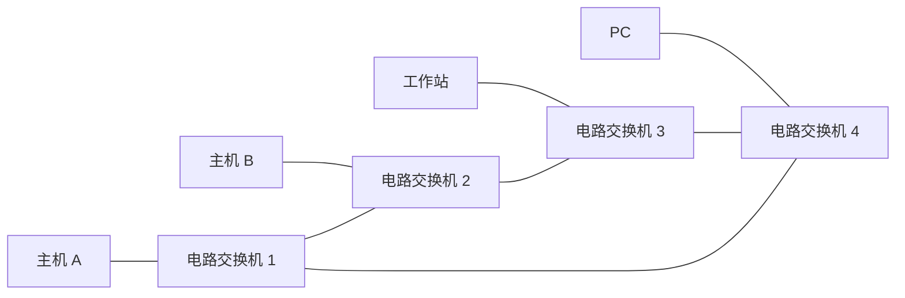
```mermaid
graph LR
  A["主机 A"] --- S1["电路交换机 1"]
  B["主机 B"] --- S2["电路交换机 2"]
  W["工作站"] --- S3["电路交换机 3"]
  PC["PC"] --- S4["电路交换机 4"]

  S1 --- S2
  S2 --- S3
  S3 --- S4
  S4 --- S1
```

这个网络用 4 条链路互联了 4 台电路交换机；每条链路包含 4 条电路，因此每条链路能支持 4 条并行连接。

每台主机（例如 PC 和工作站）都与一台交换机直接相连。

当两台主机要通信时，该网络在两台主机之间创建一条专用的 **端到端连接（end-to-end connection）**。

因此，主机 A 要与主机 B 通信，网络必须先在两条链路上各预留一条电路。

在这个例子中，这条专用的端到端连接使用第一条链路中的第二条电路和第二条链路中的第四条电路。

因为每条链路有 4 条电路，该端到端连接在连接期间获得所经每条链路总传输容量的 $1/4$。

例如，如果两台邻近交换机之间每条链路具有 1 Mbps 的传输速率，则每个端到端电路交换连接获得 250 kbps 的专用传输速率。

对比之下，考虑一台主机经过分组交换网络（如因特网）向另一台主机发送分组的情况。

与电路交换相同，分组经一系列通信链路传输；不同的是，分组被直接送入网络，不预留任何链路资源。

如果某条链路因其他分组也需经其传输而出现拥塞，该分组就不得不在发送侧的缓存中等待，从而产生时延。

因特网尽最大努力以及时方式交付分组，但不做任何保证。

#### 1. 电路交换网络中的复用

链路中的电路是通过以下两种方式实现的：

1. **频分复用（Frequency-Division Multiplexing，FDM）**
2. **时分复用（Time-Division Multiplexing，TDM）**

对于 FDM，链路的频谱由跨越链路创建的所有连接共享。具体而言，连接期间链路为每条连接专设一个频段。

在电话网络中，这个频段的宽度通常为 4 kHz（即每秒 4000 周期）。该频段的宽度称为 **带宽（bandwidth）**。

调频无线电台也使用 FDM 来共享 88 MHz～108 MHz 的频谱，其中每个电台被分配一个特定的频段。

对于一条 TDM 链路，时间被划分为固定时段的帧，并且每个帧又被划分为固定数量的时隙。

当网络跨越一条链路创建一条连接时，网络在每个帧中为该连接指定一个时隙。这些时隙专门由该连接单独使用，一个时隙（在每个帧内）可用于传输该连接的数据。

| 复用方式 | 划分维度 | 每条电路获得资源的方式                               |
| -------- | -------- | ---------------------------------------------------- |
| FDM      | 频率     | 每条电路连续地得到部分带宽                           |
| TDM      | 时间     | 每条电路在短时间间隔（即时隙）中周期性地得到所有带宽 |

对于 FDM，其频率域被分割为 4 个频段，每个频段的带宽是 4 kHz。

对于 TDM，其时域被分割为帧，在每个帧中具有 4 个时隙，在循环的 TDM 帧中每条电路被分配相同的专用时隙。

对于 TDM，一条电路的传输速率等于帧速率乘以一个时隙中的比特数量。

例如，如果链路每秒传输 8000 个帧，每个时隙由 8 个比特组成，则每条电路的传输速率是：

$$
8000 \times 8 = 64 \text{ kbps}
$$

分组交换的支持者总是争辩说，电路交换不够经济，因为在 **静默期（silent period）** 专用电路是空闲的。

例如，即使通话的一方停止讲话，空闲的网络资源（沿该连接路由的链路中的频段或时隙）也不能被其他进行中的连接使用。

作为资源不能有效使用的另一个例子，考虑一名放射科医师使用电路交换网络远程存取一系列 X 射线图像：该医师建立一条连接，请求一幅图像，然后判读该图像，再请求一幅新图像。

在放射科医师判读图像期间，分配给该连接的网络资源完全未被使用（即被浪费了）。

分组交换的支持者还津津乐道地指出：创建端到端电路、预留端到端带宽是复杂的，需要复杂的信令软件来协调沿端到端路径的交换机的操作。

在结束讨论电路交换之前，我们讨论一个数值化的例子，它更能说明问题的实质。

考虑从主机 A 到主机 B 经电路交换网络发送一个 640000 bit 的文件需要多长时间。

假如在该网络中所有链路使用具有 24 时隙的 TDM，比特速率为 1.536 Mbps。同时假定在主机 A 开始传输该文件之前，需要 500 ms 创建一条端到端电路。它需要多长时间才能发送该文件？

每条链路具有的传输速率是：

$$
\frac{1.536 \text{ Mbps}}{24} = 64 \text{ kbps}
$$

因此传输该文件需要：

$$
\frac{640 \text{ kb}}{64 \text{ kbps}} = 10 \text{ s}
$$

这个 10 s，再加上 500 ms 的电路创建时间，发送该文件共需 10.5 s。

值得注意的是，该传输时间与链路数量无关：无论端到端电路经过 1 条链路还是 100 条链路，传输时间都是 10 s。

实际的端到端时延还包括传播时延，参见 1.4 节。

#### 2. 分组交换与电路交换的对比

在描述了电路交换和分组交换之后，我们来对比一下。

分组交换的批评者经常争辩说，分组交换不适合实时服务（如电话和视频会议），因为它的端到端时延可变且不可预测（主要源于排队时延的变动）。

分组交换的支持者则争辩道：

- 它比电路交换提供更好的带宽共享
- 它比电路交换更简单、更有效，实现成本更低

概括而言，嫌餐馆预订麻烦的人宁可要分组交换，而不要电路交换。

分组交换为什么更有效呢？我们看一个简单的例子。

假定多个用户共享一条 1 Mbps 的链路，每个用户的活跃周期不断变化：

- 活跃期间，用户以 100 kbps 的恒定速率产生数据
- 静止期间，用户不产生数据

再假定每个用户仅有 10% 的时间活跃（其余 90% 的时间空闲下来喝咖啡）。

对于电路交换，无论用户是否活跃，都必须为其预留 100 kbps。

例如，对于 TDM 电路交换，一个 1 s 的帧被划分为 10 个时隙（每个 100 ms），每个用户分配一个时隙。

因此，该电路交换链路仅能支持 $\dfrac{1 \text{ Mbps}}{100 \text{ kbps}} = 10$ 个并发用户。

对于分组交换，一个特定用户活跃的概率是 0.1。如果有 35 个用户，同时有 11 个及以上活跃用户的概率约为 0.0004（二项分布 $B(35, 0.1)$ 的尾概率）。

当并发用户不超过 10 个（概率 0.9996）时，聚合到达数据速率不超过链路输出速率 1 Mbps。

因此，当活跃用户不超过 10 个时，通过该链路的分组流基本没有时延，与电路交换的情况一样。

当同时活跃的用户超过 10 个时，聚合到达速率超过链路输出容量，输出队列开始变长，直到聚合输入速率重新低于 1 Mbps 才回落。

由于本例中同时活跃用户超过 10 个的概率极小，分组交换几乎总能提供与电路交换相同的性能——而且是在用户数量为其 3 倍的情况下。

再看第二个简单的例子。

假定有 10 个用户，其中一个用户突然产生 1000 个 1000 bit 的分组，其他用户保持静默。

在每帧含 10 个时隙、每时隙 1000 bit 的 TDM 电路交换中，活跃用户每帧只能使用一个时隙，其余 9 个时隙保持空闲：传输全部 $10^6$ bit 数据需要 10 s。

在分组交换中，由于没有其他用户的分组与之复用，活跃用户能够持续以全部链路速率 1 Mbps 发送，所有数据 1 s 内即可发送完毕。

上面的例子从两个方面表明：分组交换的性能优于电路交换。

这些例子也强调了两种链路共享方式的关键差异：

- 电路交换不考虑需求，预先分配传输链路，已分配而闲置的链路时间无法被利用
- 分组交换按需分配链路，链路传输能力在所有需要传输的用户之间逐分组共享

虽然分组交换和电路交换在今天的电信网络中都被普遍采用，但趋势无疑朝着分组交换发展——许多电路交换电话网正在缓慢向分组交换迁移，例如在昂贵的越洋电话部分使用分组交换。

### 1.3.3 网络的网络

前面看到，端系统（PC、智能手机、Web 服务器、电子邮件服务器等）经过一个接入 ISP 与因特网相连。

接入 ISP 能提供有线或无线连接，使用 DSL、电缆、FTTH、WiFi 和蜂窝等多种接入技术。

值得注意的是，接入 ISP 不必是电信局或电缆公司，也可以是大学（为学生、职员和教师提供接入）或公司（为其雇员提供接入）这样的单位。

但为端用户和内容提供商提供接入，只解决了连接难题中的很小一部分——因特网由数以亿计的用户组成。

要解决这个难题，接入 ISP 自身必须互联，即创建 **网络的网络**。这是理解因特网的关键。

"网络的网络"年复一年演化为一个非常复杂的结构，其演化很大程度上由经济和国家策略驱动，而不是由性能考虑驱动。

为了理解今天因特网的网络结构，下面以逐步递进的方式建造一系列网络结构，每个新结构都更接近现在复杂的因特网。

回顾互联接入 ISP 的中心目标：使所有端系统能够彼此发送分组。

一种朴素的做法是让每个接入 ISP 直接与其他所有接入 ISP 连接。

我们的第一个网络结构即 **网络结构 1**，用单一的全球传输 ISP 互联所有接入 ISP。

这个假想的全球传输 ISP 由路由器和通信链路构成，不仅跨越全球，而且至少有路由器邻近数十万接入 ISP 中的每一个。

建造这样大规模的全网络耗资巨大，为了有利可图，自然要向每个连接的接入 ISP 收费，其价格大致反映（不一定正比于）一个接入 ISP 经过全球 ISP 交换的流量大小。

因为接入 ISP 向全球传输 ISP 付费，故接入 ISP 被认为是 **客户（customer）**，而全球传输 ISP 被认为是 **提供商（provider）**。

如果一家公司建立并运营一个可赢利的全球传输 ISP，其他公司自然会建立自己的全球传输 ISP 与之竞争。

这导致了 **网络结构 2**，它由数十万接入 ISP 和多个全球传输 ISP 组成。

相比网络结构 1，接入 ISP 无疑更喜欢网络结构 2——它们可以根据价格和服务在多个相互竞争的全球传输提供商之间选择。

不过要注意，这些全球传输 ISP 之间必须互联，否则连接到不同全球传输 ISP 的接入 ISP 之间将无法通信。

网络结构 2 是一种两层的等级结构：全球传输提供商位于顶层，接入 ISP 位于底层。

这假设全球传输 ISP 既有能力邻近每个接入 ISP，也在经济上愿意这样做。

现实中，尽管某些 ISP 确实具有令人印象深刻的全球覆盖，并且确实直接与许多接入 ISP 连接，但世界上没有哪个 ISP 是无处不在的。

相反，在任何给定的区域，可能有一个 **区域 ISP（regional ISP）**，区域中的接入 ISP 与之连接。每个区域 ISP 则与 **第一层 ISP（tier-1 ISP）** 连接。

第一层 ISP 类似于我们假想的全球传输 ISP，尽管它不是在世界上每个城市中都存在，但它确实存在。

有大约十几个第一层 ISP，包括 Level 3 Communications、AT&T、Sprint 和 NTT（原书写作时的例子；如 Sprint 已并入 T-Mobile，Level 3 今属 Lumen，名单随并购变化）。

有趣的是，没有组织正式认可第一层 ISP 的地位。俗话说，如果必须问你是否是一个组织的成员，你可能不是。

再来讨论这个网络的网络，不仅有多个竞争的第一层 ISP，而且在一个区域可能有多个竞争的区域 ISP。

在这样的等级结构中，每个接入 ISP 向其连接的区域 ISP 支付费用，并且每个区域 ISP 向它连接的第一层 ISP 支付费用。

一个接入 ISP 也能直接与第一层 ISP 连接，这样它就向第一层 ISP 付费。

因此，在这个等级结构的每一层，都有客户-提供商关系。

值得注意的是，第一层 ISP 不向任何人付费，因为它们位于该等级结构的顶部。

更为复杂的情况是，在某些区域，可能有较大的区域 ISP（可能跨越整个国家），该区域中较小的区域 ISP 与之相连，较大的区域 ISP 则与第一层 ISP 连接。

例如，在中国，每个城市有接入 ISP，它们与省级 ISP 连接，省级 ISP 又与国家级 ISP 连接，国家级 ISP 最终与第一层 ISP 连接。

这个多层等级结构仍然仅仅是今天因特网的粗略近似，我们称它为 **网络结构 3**。

为了建造一个与今天的因特网更为相似的网络，我们必须在等级化网络结构 3 上增加：

- **存在点（Point of Presence，PoP）**
- **多宿（multi-home）**
- **对等（peer）**
- **因特网交换点（Internet Exchange Point，IXP）**

PoP 存在于等级结构的所有层次，但底层（接入 ISP）等级除外。

一个 PoP 只是提供商网络中的一台或多台路由器（在相同位置）群组，其中客户 ISP 能够与提供商 ISP 连接。

对于要与提供商 PoP 连接的客户网络，它能从第三方电信提供商租用高速链路并将它的路由器之一直接连接到位于该 PoP 的一台路由器。

任何 ISP（除了第一层 ISP）都可以选择 **多宿**，即可以与两个或更多提供商 ISP 连接。

例如，一个接入 ISP 可能与两个区域 ISP 多宿，或者在与两个区域 ISP 多宿的同时与一个第一层 ISP 多宿。

当一个 ISP 为多宿时，即使提供商之一出现故障，它仍然能够继续在因特网中发送和接收分组。

正如我们刚才学习的，客户 ISP 向它们的提供商 ISP 付费以获得全球因特网互联能力。客户 ISP 支付给提供商 ISP 的费用数额反映了它通过提供商交换的通信流量。

为了减少这些费用，位于相同等级结构层次的邻近的一对 ISP 能够 **对等（peer）**，也就是说，能够直接将它们的网络连到一起，使它们之间的所有流量经直接连接而不是通过上游的中间 ISP 传输。

当两个 ISP 对等时，通常不进行结算，即任何一个 ISP 都不向其对等付费。

如前面提到的那样，第一层 ISP 也相互对等，它们之间无结算。

沿着相同的路线，第三方公司能够创建一个 **因特网交换点（IXP）**。IXP 是一个汇合点，多个 ISP 能够在这里一起对等。

IXP 通常位于一个有自己的交换机群的独立建筑物中。在原书写作时因特网中有 600 多个 IXP（现已更多）。

我们称这个生态系统为 **网络结构 4**，由接入 ISP、区域 ISP、第一层 ISP、PoP、多宿、对等和 IXP 组成。

我们现在最终得到了 **网络结构 5**，它描述了现今的因特网。

它在网络结构 4 顶部增加 **内容提供商网络（content provider network）** 构建而成。

谷歌是当前这样的内容提供商网络的一个突出例子。

在本书写作之时，谷歌拥有 19 个主要的数据中心，分布于北美、欧洲、亚洲、南美和澳大利亚。其中的某些数据中心容纳了数万或数十万台的服务器，而另一些数据中心则较小，仅容纳数百台服务器。

这些较小的数据中心通常位于 IXP 中。

谷歌数据中心都经过专用的 TCP/IP 网络互联，该网络跨越全球，不过独立于公共因特网。

重要的是，谷歌专用网络仅承载出入谷歌服务器的流量。

谷歌专用网络通过与较低层 ISP 对等（无结算），尝试"绕过"因特网的较高层，采用的方式可以是直接与它们连接，或者在 IXP 处与它们连接。

然而，因为许多接入 ISP 仍然仅能通过第一层网络的中转到达，所以谷歌网络也与第一层 ISP 连接，并就与这些 ISP 交换的流量向它们付费。

通过创建自己的网络，内容提供商不仅减少了向顶层 ISP 支付的费用，而且对其服务最终如何交付给端用户有了更多的控制。

谷歌的网络基础设施在 2.6 节中进行了详细描述。

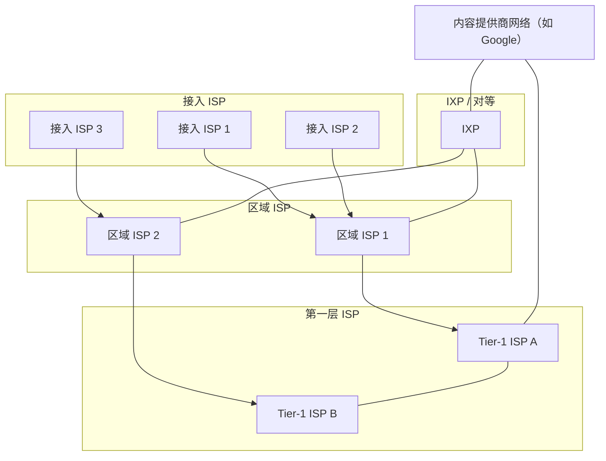
```mermaid
graph TB
  subgraph Tier1["第一层 ISP"]
    T1A["Tier-1 ISP A"]
    T1B["Tier-1 ISP B"]
  end

  subgraph Regional["区域 ISP"]
    R1["区域 ISP 1"]
    R2["区域 ISP 2"]
  end

  subgraph Access["接入 ISP"]
    A1["接入 ISP 1"]
    A2["接入 ISP 2"]
    A3["接入 ISP 3"]
  end

  subgraph IXP["IXP / 对等"]
    IX1["IXP"]
  end

  CP["内容提供商网络（如 Google）"]

  A1 --> R1
  A2 --> R1
  A3 --> R2
  R1 --> T1A
  R2 --> T1B
  T1A --- T1B
  CP --- IX1
  IX1 --- R1
  IX1 --- R2
  CP --- T1A
```

总结一下，今天的因特网是一个网络的网络，其结构复杂，由十多个第一层 ISP 和数十万个较低层 ISP 组成。

> [!note] 拓扑图对照
> 本节的几张拓扑图是同一网络的不同侧面：边缘（端系统与接入）→ 核心（路由器网状互联）→ 各层 ISP 与内容网。抓住"边缘—区域—第一层—对等/IXP—内容网"这条线即可。

ISP 覆盖的范围不同，有些跨越多个大洲和大洋，有些限于狭窄的地理区域。

较低层的 ISP 与较高层的 ISP 相连，较高层的 ISP 彼此互联。用户和内容提供商是较低层 ISP 的客户，较低层 ISP 是较高层 ISP 的客户。

近年来，主要的内容提供商也已经创建自己的网络，直接在可能的地方与较低层 ISP 互联。

# 第四部分 性能、体系结构、安全与历史

先量化性能（时延、丢包、吞吐量），再讲分层体系结构，最后看安全与历史。

## 1.4 分组交换网中的时延、丢包和吞吐量

1.1 节讲过，可以把因特网看成一种基础设施，它为运行在端系统上的分布式应用提供服务。

理想情况下，我们希望因特网能在任意两个端系统之间随心所欲地瞬间移动数据而没有任何丢失。然而，这是一个极高的目标，实践中难以达到。

相反，计算机网络必然会限制端系统之间的吞吐量（每秒能够传送的数据量），在端系统之间引入时延，而且实际上也会丢失分组。

物理定律引入的时延、丢包和吞吐量限制令人无奈；但也正因为存在这些问题，如何处理它们有许多令人着迷的话题——多到足以开设一门网络课程、支撑上千篇博士论文！

本节将研究和量化计算机网络中的时延、丢包和吞吐量。

### 1.4.1 分组交换网中的时延

前面讲过，分组从一台主机（源）出发，通过一系列路由器传输，在另一台主机（目的地）结束它的历程。

分组沿路径从一个节点（主机或路由器）传到后继节点时，会在每个节点经受几种不同的时延。其中比较重要的是：

1. **节点处理时延（nodal processing delay）**
2. **排队时延（queuing delay）**
3. **传输时延（transmission delay）**
4. **传播时延（propagation delay）**

这些时延累加起来是 **节点总时延（total nodal delay）**。

搜索、Web 浏览器、电子邮件、地图、即时通信和 IP 语音等因特网应用，其性能都受网络时延影响很大。

要深入理解分组交换和计算机网络，必须理解这些时延的性质和重要性。


```mermaid
flowchart LR
  IN["分组到达路由器 A"] --> PROC["处理时延 d_proc"]
  PROC --> QUEUE["排队时延 d_queue"]
  QUEUE --> TRANS["传输时延 d_trans = L/R"]
  TRANS --> PROP["传播时延 d_prop = d/s"]
  PROP --> OUT["到达路由器 B"]
```

作为源与目的地之间端到端路由的一部分，一个分组从上游节点经路由器 A 向路由器 B 发送。

目标是在路由器 A 刻画节点时延。路由器 A 具有通往路由器 B 的出链路，该链路前有一个队列（也称缓存）。

分组从上游节点到达路由器 A 时，路由器 A 检查其首部以决定适当的出链路，并将分组导向该链路——在本例中即通向路由器 B 的那条链路。

仅当该链路上没有其他分组正在传输、且队列中没有其他分组等待时，才能立即传输新到达的分组；否则，该分组将加入排队。

#### 1. 处理时延

检查分组首部、决定分组导向何处所需的时间，是处理时延的一部分。

处理时延还包括其他因素，例如检查比特级差错所需的时间——差错可能出现在从上游节点向路由器 A 传输分组比特的过程中。

高速路由器的处理时延通常是微秒或更低的数量级。

节点处理完成后，路由器将该分组引向通往路由器 B 的链路之前的队列。

#### 2. 排队时延

分组在链路上等待传输时，将在队列中经受排队时延。

一个分组的排队时延取决于先期到达、正在排队等待传输的分组数量。

如果队列为空且当前没有其他分组正在传输，则该分组的排队时延为 0。

反之，如果流量很大、许多其他分组也在等待传输，排队时延就会很长。

稍后将看到，分组到达时队列中的分组数量，是到达流量的强度和性质的函数。

实际的排队时延可以是微秒到毫秒量级。

#### 3. 传输时延

假定分组按先到先服务方式传输（这是分组交换网中常见的方式）：只有已经到达的分组全部传输完毕后，才能传输刚到达的分组。

用 $L$ 表示分组长度，$R$ 表示从路由器 A 到路由器 B 的链路传输速率。例如：

- 对于 10 Mbps 的以太网链路，$R = 10$ Mbps
- 对于 100 Mbps 的以太网链路，$R = 100$ Mbps

传输时延是：

$$
d_{\text{trans}} = \frac{L}{R}
$$

这是将所有分组比特推向链路（即传输，或说发射）所需的时间。

实际的传输时延通常在微秒到毫秒量级。

#### 4. 传播时延

比特被推向链路后，需要沿链路向路由器 B 传播。

从链路起点传播到路由器 B 所需的时间是传播时延。

传播速率取决于链路的物理媒介（即光纤、双绞铜线等），其范围是：

$$
2 \times 10^8 \sim 3 \times 10^8 \text{ m/s}
$$

该速率等于或略小于光速。

传播时延等于两台路由器之间的距离除以传播速率：

$$
d_{\text{prop}} = \frac{d}{s}
$$

其中：

- $d$ 是路由器 A 和路由器 B 之间的距离
- $s$ 是该链路的传播速率

当分组的最后一个比特传播到节点 B 时，该比特及其前面的所有比特已存储于路由器 B，随后路由器 B 继续执行转发。

在广域网中，传播时延为毫秒量级。

#### 5. 传输时延和传播时延的比较

传输时延与传播时延之间的差异微妙而重要，新手常常难以分清。

- **传输时延** 是路由器推出分组所需要的时间，它是分组长度和链路传输速率的函数，与两台路由器之间的距离无关
- **传播时延** 是一个比特从一台路由器传播到另一台路由器所需要的时间，它是两台路由器之间距离的函数，与分组长度或链路传输速率无关

下面用类比来阐明这两个概念。

考虑一条每 100 km 设一个收费站的公路：收费站之间的公路段相当于链路，收费站相当于路由器。

假定汽车以 100 km/h 的速度行驶，即离开收费站后立即加速并在站间保持该速度。

有 10 辆汽车组成车队、保持固定顺序行驶：每辆汽车可视为一个比特，整个车队是一个分组。

假定每个收费站以每辆车 12 s 的速度提供服务，且时值深夜，公路上只有这一批汽车。

再假定车队的第一辆汽车到达收费站后要在入口等待，直到其余 9 辆到齐、整队依次通过——整个车队在"转发"前必须先存储在收费站。

收费站将整个车队推向公路所需要的时间是：

$$
\frac{10 \text{ 辆}}{5 \text{ 辆/min}} = 2 \text{ min}
$$

该时间类比于一台路由器中的传输时延。

一辆汽车从一个收费站出口行驶到下一个收费站所需要的时间是：

$$
\frac{100 \text{ km}}{100 \text{ km/h}} = 1 \text{ h}
$$

这个时间类比于传播时延。

因此，从车队在第一个收费站完成整队，到在下一个收费站重新整队，经历的时间是"传输时延"与"传播时延"之和，本例中为 62 min。

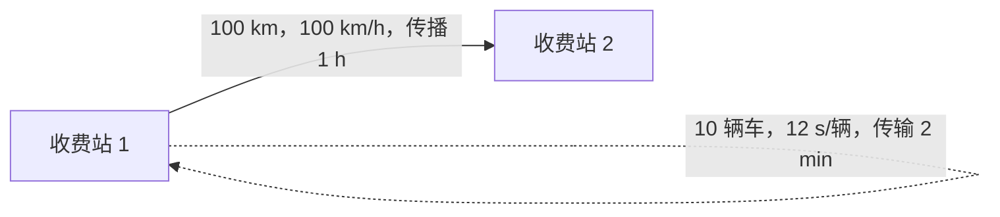
```mermaid
flowchart LR
  T1["收费站 1"] -->|"100 km，100 km/h，传播 1 h"| T2["收费站 2"]
  T1 -.->|"10 辆车，12 s/辆，传输 2 min"| T1
```

进一步探讨这个类比：如果收费站的服务时间大于汽车站间行驶的时间，会发生什么？

假定汽车以 1000 km/h 的速度行驶，收费站以每分钟一辆汽车的速度服务。

此时站间行驶时延为 6 min，而收费站服务整个车队需要 10 min。

于是，车队中后面的汽车还没离开第一个收费站，前面的汽车就已到达第二个收费站。

分组交换网中也会发生同样的情况：分组的前几个比特已到达一台路由器，而其余比特仍在前面的路由器中等待传输。

俗话说一图胜千言，一个动画则胜百万言：原书配套网站提供了一个交互式动画，直观地展现并对比了传输时延与传播时延，推荐读者访问。

令 $d_{\text{proc}}$、$d_{\text{queue}}$、$d_{\text{trans}}$、$d_{\text{prop}}$ 分别表示处理、排队、传输和传播时延，则节点总时延为：

$$
d_{\text{nodal}} = d_{\text{proc}} + d_{\text{queue}} + d_{\text{trans}} + d_{\text{prop}}
$$

四种时延对照如下：

| 时延         | 公式              | 取决于             | 典型量级                                 |
| ------------ | ----------------- | ------------------ | ---------------------------------------- |
| 处理 d_proc  | 检查首部+差错检测 | 路由器性能         | 微秒或更低                               |
| 排队 d_queue | 随拥塞变化        | 流量强度 La/R      | 微秒到毫秒                               |
| 传输 d_trans | L/R               | 分组长度、链路速率 | 微秒到毫秒                               |
| 传播 d_prop  | d/s               | 距离、媒介         | 校园网微秒级，广域网毫秒级，卫星数百毫秒 |

各时延成分所起的作用可能差别很大。

例如，对于连接同一大学校园内两台路由器的链路，$d_{\text{prop}}$ 可能只有数微秒到数十微秒，微不足道；而经由同步卫星链路互联的两台路由器，$d_{\text{prop}}$ 为几百毫秒，是 $d_{\text{nodal}}$ 的主要成分。

类似地，$d_{\text{trans}}$ 的影响也可能微不足道，也可能很大：对 10 Mbps 及更高速率的信道（如 LAN）微不足道；而通过低速拨号调制解调器链路发送较长的因特网分组时，可达数百毫秒。

处理时延 $d_{\text{proc}}$ 通常微不足道，但它对路由器的最大吞吐量有重要影响——最大吞吐量即路由器能够转发分组的最大速率。

### 1.4.2 排队时延和丢包

节点时延中最复杂也最有趣的成分是排队时延 $d_{\text{queue}}$。

排队时延的重要性与受关注程度，从数以千计的论文和大量专著即可见一斑。

这里只给出关于排队时延的总体、直觉性讨论；想深入理解的读者可以自行查阅相关书籍（或者最终写一篇这方面的博士论文）。

与另外 3 项时延（$d_{\text{proc}}$、$d_{\text{trans}}$、$d_{\text{prop}}$）不同，排队时延对不同分组可能不同。

例如，10 个分组同时到达空队列时，第一个传输的分组没有排队时延，而最后一个传输的分组排队时延相对较大——它要等待前 9 个分组传输完毕。

因此，描述排队时延通常使用统计量，例如：

- 平均排队时延
- 排队时延的方差
- 排队时延超过某些特定值的概率

排队时延何时大、何时小？答案很大程度上取决于流量到达队列的速率、链路的传输速率和到达流量的性质（周期性到达还是突发到达）。

为便于讨论，令 $a$ 表示分组到达队列的平均速率（单位：分组/秒，即 pkt/s）；$R$ 为链路传输速率（即从队列中推出比特的速率，单位 bps）。

进一步假定所有分组长度均为 $L$ bit，且队列非常大、基本能容纳无限数量的比特，则比特到达队列的平均速率是 $La$ bps。

比率：

$$
\frac{La}{R}
$$

被称为 **流量强度（traffic intensity）**，它在估计排队时延的范围方面经常起着重要的作用。

如果 $La/R > 1$，则比特到达队列的平均速率超过从队列传输出去的速率。

在这种糟糕的情况下，队列趋向于无限增长，排队时延将趋向无穷大！

因此，流量工程中的一条金科玉律是：设计系统时流量强度不能大于 1。

现在考虑 $La/R \le 1$ 的情况。这时，到达流量的性质影响排队时延。

例如，如果分组周期性到达，即每 $L/R$ 秒到达一个分组，则每个分组将到达一个空队列，不会有排队时延。

另一方面，如果分组以突发形式到达而不是周期性到达，则可能会有很大的平均排队时延。

例如，假定每 $(L/R)N$ 秒同时到达 $N$ 个分组，则传输的第一个分组没有排队时延，传输的第二个分组就有 $L/R$ 秒的排队时延。

更为一般地，第 $n$ 个被传输的分组有

$$
(n-1)\frac{L}{R}
$$

秒的排队时延。

我们将该例子中计算平均排队时延的问题留给读者作为练习。

以上两个周期性到达的例子略显理想化。通常，到达队列的过程是随机的：到达不遵循任何模式，分组间隔随机。

在这种更真实的情况下，$La/R$ 通常不足以全面表征时延的统计特性；不过，用它直观把握排队时延的范围仍然很有用。

流量强度接近 0 时，分组极少到达、间隔很大，到达的分组几乎不会在队列中遇到其他分组，平均排队时延接近 0。

流量强度接近 1 时，由于分组到达速率的波动，会出现到达速率暂时超过传输能力的时段，队列在这些时段中形成；当到达速率低于传输能力时，队列又会缩短。

无论如何，随着流量强度接近 1，平均排队长度变得越来越长。

平均排队时延与流量强度的定性关系如图 1-18 所示。

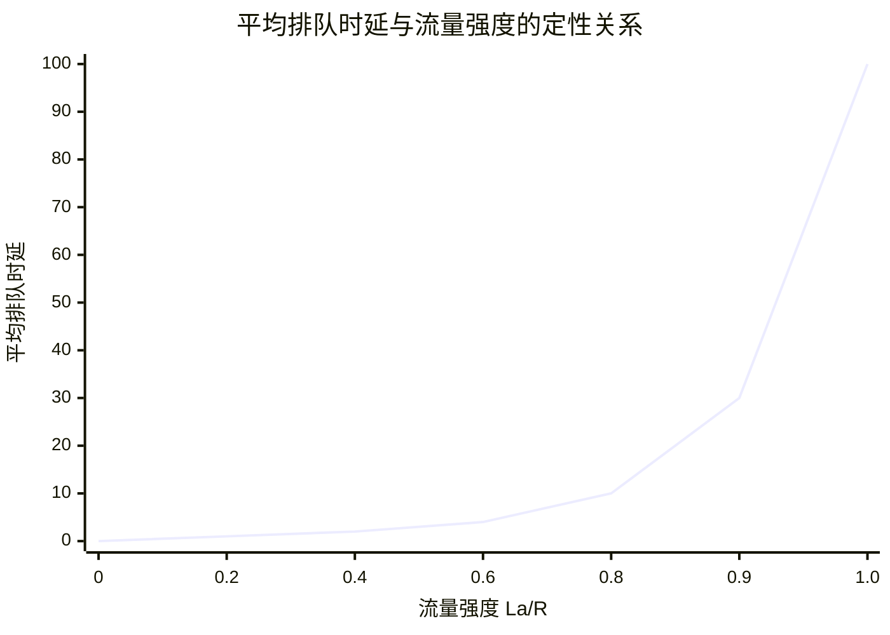
```mermaid
xychart-beta
  title "平均排队时延与流量强度的定性关系"
  x-axis "流量强度 La/R" [0, 0.2, 0.4, 0.6, 0.8, 0.9, 1.0]
  y-axis "平均排队时延" 0 --> 100
  line [0, 1, 2, 4, 10, 30, 100]
```

图 1-18 的重要特征是：随着流量强度接近 1，平均排队时延迅速增加——流量强度的少量增加会导致时延大比例增加。

也许你在公路上经历过类似的事：一条经常拥堵的公路，意味着它的"流量强度"接近 1；一旦流量稍大于平常，经受的时延就可能很大。

想直观感受排队时延，可访问原书配套网站上的队列交互动画：把分组到达速率设置得足够大、使流量强度超过 1，就能看到队列逐渐建立的过程。

#### 丢包

以上讨论假设队列能容纳无穷多的分组。

现实中，一条链路前的队列容量有限（具体容量极大地依赖于路由器设计和成本）。

由于容量有限，随着流量强度接近 1，排队时延并不会真正趋向无穷大；相反，到达的分组将遇到一个满队列。

没有地方存储该分组，路由器只能将它丢弃，即发生丢包。

当流量强度大于 1 时，也能在队列动画中看到这种溢出。

从端系统角度看，丢包表现为：一个分组看起来已经进入网络核心，但绝不会到达目的地。

分组丢失的比例随流量强度增加而增加。

因此，节点的性能常用时延和丢包概率共同度量。

正如后面各章将讨论的，丢失的分组可能按端到端原则重传，以确保所有数据最终从源传送到目的地。

### 1.4.3 端到端时延

前面讨论的是节点时延，即单台路由器上的时延。现在考虑从源到目的地的总时延。

假定源主机和目的主机之间有 $N-1$ 台路由器，且网络无拥塞、排队时延微不足道。

每台路由器和源主机的处理时延为 $d_{\text{proc}}$、输出速率为 $R$ bps，每条链路的传播时延为 $d_{\text{prop}}$，则节点时延累加得到端到端时延：

$$
d_{\text{end-end}} = N(d_{\text{proc}} + d_{\text{trans}} + d_{\text{prop}})
\tag{1-2}
$$

式中 $d_{\text{trans}} = \dfrac{L}{R}$，$L$ 是分组长度。

式 (1-2) 是式 (1-1) 的一般形式——后者没有考虑处理时延和传播时延。

若各节点时延不同、且每个节点存在平均排队时延，还需要对式 (1-2) 再做推广。

#### 1. Traceroute

要实际感受网络中的端到端时延，可以使用 Traceroute 程序。

> [!tip] Traceroute 的核心机制
> Traceroute 利用 IP 首部的 TTL（Time-To-Live）字段。源从 TTL=1 开始逐次加 1 发送探测分组，每经过一台路由器 TTL 减 1，减到 0 即丢弃并回送 ICMP 超时报文。由此逐跳发现路径。

Traceroute 是一个简单的程序，能在任何因特网主机上运行。用户指定一个目的主机后，源主机中的该程序向目的地发送多个特殊分组。

这些分组沿途经过一系列路由器；路由器收到特殊分组之一时，向源回送一个短报文，包含自己的名字和地址。

更具体地，假定源和目的地之间有 $N-1$ 台路由器，源将发送 $N$ 个分组、地址都指向最终目的地，这些分组从 1 到 $N$ 编号。

第 $n$ 台路由器收到编号为 $n$ 的分组时，不向它的目的地转发该分组，而是向源回送一个报文。目的主机收到第 $N$ 个分组时，也向源返回一个报文。

源记录从发送分组到收到对应返回报文所经历的时间，以及返回该报文的路由器（或目的主机）的名字和地址。

这样，源就能重建分组从源到目的地所采用的路由，并确定到所有中间路由器的往返时延。

Traceroute 对上述实验重复 3 次，因此源实际向目的地发送 $3N$ 个分组。

RFC 1393 详细描述了 Traceroute。

下面是 Traceroute 输出的一个例子，追踪的路由从源主机 `gaia.cs.umass.edu`（马萨诸塞大学）到巴黎索邦大学计算机科学系的一台主机。

输出有 6 列：

1. 第一列是路径上的路由器编号 $n$
2. 第二列是路由器的名字
3. 第三列是路由器地址，格式为 xxx.xxx.xxx.xxx
4. 最后 3 列是 3 次实验的往返时延

如果源从某台路由器收到的报文少于 3 条（网络丢包所致），Traceroute 会在该路由器编号后放一个星号，并报告少于 3 次往返时间。

```
 qw-vlan-2451.cs.umass.edu (128.119.245.1)        1.899 ms  3.266 ms  3.280 ms
 j-cs-gw-int-10-240.cs.umass.edu (10.119.240.254) 1.296 ms  1.276 ms  1.245 ms
 n5-rt-1-1-xe-2-1-0.gw.umass.edu (128.119.3.33)   2.237 ms  2.217 ms  2.187 ms
 border1-rt-et-5-0-0.gw.umass.edu (192.80.83.102) 0.345 ms  0.345 ms  0.344 ms
 core1-rt-et-5-2-0.gw.umass.edu (128.119.0.9)     0.351 ms  0.392 ms  0.380 ms
 nox300qwl-umass-re.nox.org (192.5.89.101)        3.260 ms  0.416 ms  3.127 ms
 nox300qwl-umass-re.nox.org (192.5.89.101)        3.165 ms  7.326 ms  7.311 ms
 198.71.45.237 (198.71.45.237)                   77.826 ms 77.246 ms 77.744 ms
 renater-lb1-qw.mx1.par.fr.geant.net (62.40.124.70) 79.357 ms 77.729 ms 79.152 ms
193.51.180.109 (193.51.180.109)                  78.379 ms 79.936 ms 80.042 ms
* 193.51.180.109 (193.51.180.109)                80.640 ms *         *
* 195.221.127.182 (195.221.127.182)              78.408 ms *         *
195.221.127.182 (195.221.127.182)                80.686 ms 80.796 ms 78.434 ms
r-upmc1.reseau.jussieu.fr (134.157.254.10)       78.399 ms *         81.353 ms
```

在上述踪迹中，源和目的地之间有 14 台路由器。多数路由器有名字，所有路由器都有地址。

例如，第 5 台路由器的名字是 `core1-rt-et-5-2-0.gw.umass.edu`，地址是 `128.119.0.9`。

从该路由器的数据可以看到，源到该路由器的往返时延 3 次分别为 0.351 ms、0.392 ms 和 0.380 ms。

这些往返时延包括前面讨论的所有时延：传输时延、传播时延、路由器处理时延和排队时延。

由于排队时延随时间变化，发往第 $n$ 台路由器的分组 $n$ 的往返时延，实际上可能大于发往第 $n+1$ 台路由器的分组 $n+1$ 的往返时延。

上述例子中确实观察到这一现象：到路由器 11 的某次测量值反而大于到路由器 12 的测量值——三次测量本就存在排队抖动，不应跨跳用单次值直接比较。

还注意到从路由器 7 到路由器 8 时往返时延大幅增加——这源于两者之间的跨大西洋光纤链路带来的较大传播时延。

另有一些为 Traceroute 提供图形界面的免费软件，书中推荐的是 PingPlotter。

#### 2. 端系统、应用程序和其他时延

除了处理时延、传输时延和传播时延，端系统中还有其他一些重要时延。

例如，在 WiFi 或电缆调制解调器等共享媒介场景中，端系统可能有意延迟自己的传输，把它作为与其他端系统共享媒介的协议的一部分。

第 6 章将详细讨论这类协议。

另一个重要时延是 **媒介分组化时延**，它出现在 IP 语音（VoIP）应用中。

在 VoIP 中，发送方必须先将要传输的编码数字化语音填满一个分组，才能向因特网传递该分组。这段填充时间称为 **分组化时延**；它可能较大，并影响用户感受到的 VoIP 通话质量。

### 1.4.4 计算机网络中的吞吐量

除了时延和丢包，计算机网络中另一个至关重要的性能测度是 **端到端吞吐量**。

为定义吞吐量，考虑从主机 A 到主机 B 跨越计算机网络传送一个大文件，例如从一台计算机向另一台计算机传送一段视频剪辑。

任意时刻的 **瞬时吞吐量（instantaneous throughput）** 是主机 B 接收该文件的速率（单位 bps）。

许多应用会显示下载期间的瞬时吞吐量；你也可以用测速应用测量自己机器到服务器的端到端时延和下载吞吐量。

如果该文件由 $F$ bit 组成，主机 B 接收全部 $F$ bit 用去 $T$ s，则文件传送的 **平均吞吐量（average throughput）** 是 $\dfrac{F}{T}$ bps。

某些应用（如因特网电话）既希望低时延，也希望瞬时吞吐量稳定在某个阈值之上（例如某些因特网电话要求超过 24 kbps，某些实时视频应用要求超过 256 kbps）。

另一些应用（如文件传送）对时延不敏感，但希望吞吐量尽可能高。

下面用几个例子深入理解吞吐量这一概念。


```mermaid
graph LR
  S["服务器"] -->|"Rs"| R["路由器"] -->|"Rc"| C["客户"]
```

图 1-19a 中的服务器和客户由两条通信链路和一台路由器相连，考虑从服务器向客户传送一个文件的吞吐量。

令 $R_s$ 表示服务器与路由器之间的链路速率，$R_c$ 表示路由器与客户之间的链路速率，并假定整个网络中只有从服务器到客户的比特在传送。

在这种理想情况下，吞吐量是多少？可将比特想象为流体、链路想象为管道：服务器注入比特的速率不可能超过 $R_s$，路由器转发比特的速率不可能超过 $R_c$。

若 $R_s < R_c$，服务器注入的比特将顺畅地通过路由器"流动"，以速率 $R_s$ 到达客户。

若 $R_c < R_s$，路由器不能像接收比特那样快地转发比特，比特将以速率 $R_c$ 离开路由器，端到端吞吐量即 $R_c$。

还要注意：如果比特持续以速率 $R_s$ 到达、以 $R_c$ 离开，路由器中等待传输给客户的积压比特将不断增加——这是最不希望出现的情况。

因此，这种简单两链路网络的吞吐量是 $\min\{R_c, R_s\}$，也就是 **瓶颈链路（bottleneck link）** 的传输速率。

据此可以近似得到从服务器向客户传送一个 $F$ bit 大文件所需的时间：$\dfrac{F}{\min\{R_c, R_s\}}$。

例如，下载一个 $F = 32 \times 10^6$ bit 的 MP3 文件，服务器速率为 $R_s = 2$ Mbps，你的接入链路速率为 $R_c = 1$ Mbps，则传输该文件需要 32 s。

当然，这些吞吐量与传输时间表达式只是近似——没有考虑存储转发、处理时延和协议开销等问题。

图 1-19b 中，服务器和客户之间有 $N$ 条链路，速率分别为 $R_1, R_2, \ldots, R_N$。

套用两链路网络的分析，从服务器到客户的文件传输吞吐量是 $\min\{R_1, R_2, \ldots, R_N\}$，这同样仍是路径上瓶颈链路的速率。

再来看当前因特网中的一个例子。

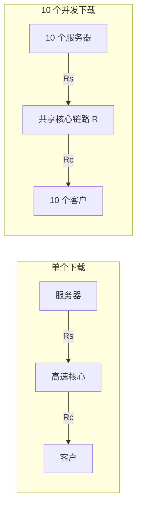
```mermaid
graph LR
  subgraph a["单个下载"]
    S1["服务器"] -->|"Rs"| CORE1["高速核心"] -->|"Rc"| C1["客户"]
  end

  subgraph b["10 个并发下载"]
    S2["10 个服务器"] -->|"Rs"| CORE2["共享核心链路 R"] -->|"Rc"| C2["10 个客户"]
  end
```

图 1-20a 中，服务器和客户分别以速率 $R_s$、$R_c$ 的接入链路与网络相连。

假定网络核心中的所有链路传输速率远高于 $R_s$ 和 $R_c$——今天因特网的核心确实超量配置了高速链路，很少出现拥塞；并假定网络中传送的比特都从该服务器发往该客户。

核心就像一根粗大的管子，比特从源到目的地的流动速率仍是 $R_s$ 与 $R_c$ 中的最小者：

$$
\text{吞吐量} = \min\{R_s, R_c\}
$$

因此，今天因特网中对吞吐量的限制因素通常是接入网。

最后一个例子：图 1-20b 中有 10 台服务器和 10 个客户连接到网络核心，同时发生 10 个下载（涉及 10 个客户-服务器对），且这是网络中当时的唯一流量。

核心中有一条所有下载共同经过的链路，传输速率为 $R$。假定所有服务器接入链路的速率为 $R_s$、所有客户接入链路的速率为 $R_c$，核心中除该共同链路外的所有链路速率都远大于 $R_s$、$R_c$ 和 $R$。

此时每个下载的吞吐量是多少？

如果 $R$ 很大——比如是 $R_s$ 和 $R_c$ 的 100 倍——每个下载的吞吐量仍是：

$$
\min\{R_s, R_c\}
$$

但如果 $R$ 与 $R_s$、$R_c$ 处于同一量级呢？看一个具体例子：$R_s = 2$ Mbps、$R_c = 1$ Mbps、$R = 5$ Mbps，且公共链路为 10 个下载平均分配速率。

此时瓶颈不再是接入网，而是核心中的共享链路：它为每个下载仅提供 500 kbps 的吞吐量。

因此，每个下载的端到端吞吐量降到 500 kbps。

图 1-19 和图 1-20 的例子说明：吞吐量取决于数据流经链路的传输速率；没有其他干扰流量时，吞吐量可近似为源与目的地之间路径上的最小传输速率。

图 1-20b 进一步说明：吞吐量不仅取决于路径上链路的传输速率，还取决于干扰流量——如果许多其他数据流也经过某条链路，即使是高传输速率的链路，仍可能成为文件传输的瓶颈。

课后习题和后续章节将更仔细地研究计算机网络中的吞吐量。

## 1.5 协议层次及其服务模型

从目前的讨论看，因特网显然是一个极为复杂的系统。

因特网有许多部分：大量的应用程序和协议、各种类型的端系统、分组交换机以及各种类型的链路级媒介。

面对如此巨大的复杂性，我们是否还能理清网络体系结构、并对它展开讨论？

幸运的是，对两个问题的回答都是肯定的。

### 1.5.1 分层的体系结构

在讨论因特网体系结构之前，先看一个与之类似的人类社会例子——航空系统。

日常生活中我们一直在与复杂系统打交道。想象有人请你描述航空系统：你怎样用一个结构来描述它？

这个系统有票务代理、行李检查、登机口人员、飞行员、飞机、空中航行控制和世界范围的导航系统。

描述它的一种方式是：列出搭乘一次航班要采取的一系列操作。

你要购买机票，托运行李，去登机口，最终登上航班；飞机起飞、飞抵目的地；着陆后，你从登机口离机并认领行李。如果行程不理想，你会向票务机构投诉。

| 出发端         | 到达端         |
| -------------- | -------------- |
| 票务（购买）   | 票务（投诉）   |
| 行李（托运）   | 行李（认领）   |
| 登机口（登机） | 登机口（离机） |
| 从跑道起飞     | 从跑道着陆     |
| 按路线飞行     | 按路线飞行     |

从这里已经能看出与计算机网络的相似之处：航空公司把人从源送到目的地，因特网把分组从源主机送到目的主机。

但这还不是我们要找的完整类比——图 1-21 提示了另一种结构。

注意每一端都有票务功能；对已经检票的乘客有托运行李功能；对已经检票且检查过行李的乘客有登机功能；对已经通过登机口的乘客，有起飞和着陆功能；而在飞行中，有按预定路线飞行的功能。

这提示我们可以水平地看待这些功能。

```mermaid
flowchart TD
  Ticket["票务层"] --> Baggage["行李层"]
  Baggage --> Gate["登机口层"]
  Gate --> Takeoff["起飞 / 着陆层"]
  Takeoff --> Route["按路线飞行层"]
  Route --> Ground["地面 / 空中交通控制中心"]
```

每个层次与其下面的层次结合在一起，实现某些功能和服务：

- 在票务层及以下：一个人从航线柜台到航线柜台的转移
- 在行李层及以下：人和行李从行李托运到行李认领的转移（仅对已完成票务的人提供服务）
- 在登机口层：人和行李从离港登机口到到港登机口的转移
- 在起飞/着陆层：一个人和手提行李从跑道到跑道的转移

每个层次通过以下方式提供服务：

1. 在本层中执行某些操作，例如登机口层的乘客登机与离机
2. 使用直接下层的服务，例如登机口层使用起飞/着陆层"跑道到跑道"的旅客转移服务

利用分层体系结构，我们可以讨论一个大而复杂系统中定义良好的特定部分。

这种简化提供了模块化，价值很高：只要某层对上层提供相同的服务、并继续使用下层相同的服务，改变该层的实现就不会影响系统其余部分。

注意：改变一个服务的实现与改变服务本身是完全不同的。

例如，登机口功能若被改变（比如让人们按身高登机和离机），航线系统的其余部分将保持不变——登机口仍然提供相同的功能（人们登机、离机），只是以不同的方式实现了该功能。

对于大而复杂、需要不断更新的系统，改变服务实现而不影响其他组件，是分层的另一个重要优点。

#### 协议分层

关于航空系统的讨论到此为止，现将注意力转向网络协议。

为了给协议设计提供结构，网络设计者以分层（layer）的方式组织协议以及实现协议的网络硬件和软件。

每个协议属于其中某一层，就像图 1-22 航线体系结构中每种功能属于某一层一样。

我们再次关注某层向上一层提供的服务（service），即所谓一层的服务模型（service model）。

与航线例子一样，每层通过在本层执行某些操作、或使用直接下层的服务来提供服务。

例如，第 $n$ 层可以提供"报文从网络一端可靠交付到另一端"的服务，其实现方式是：使用第 $n-1$ 层从一端到另一端的不可靠报文传送服务，加上本层的报文检测与重传功能。

协议层可以用软件、硬件或两者的结合来实现：

| 层次           | 典型实现                                            |
| -------------- | --------------------------------------------------- |
| 应用层、运输层 | 端系统中的软件（如 HTTP、SMTP、TCP）                |
| 网络层         | 硬件与软件实现的混合体                              |
| 链路层、物理层 | 与链路相关联的网络接口卡（例如以太网、WiFi 接口卡） |

还要注意：分层的航线体系中，各层功能分布在机场和飞行控制中心；同理，第 $n$ 层协议也分布在构成网络的端系统、分组交换机和其他组件中。

协议分层的优点是概念化和结构化：分层提供了讨论系统组件的结构化方式，模块化也使更新系统组件更为容易。

然而，也有研究人员和网络工程师激烈反对分层，其潜在缺点主要有两个：

- 一层可能冗余较低层的功能。例如，许多协议栈在基于每段链路和基于端到端两种情况下都提供了差错恢复
- 某层的功能可能需要仅在其他层才出现的信息（如时间戳值），这违反了层次分离的目标

综合起来，各层的所有协议被称为 **协议栈（protocol stack）**。因特网的协议栈由 5 个层次组成：

1. 物理层
2. 链路层
3. 网络层
4. 运输层
5. 应用层

```mermaid
flowchart TD
  APP["应用层"] --> TRANS["运输层"]
  TRANS --> NET["网络层"]
  NET --> LINK["链路层"]
  LINK --> PHY["物理层"]
```

本书大致按因特网协议栈的层次组织。我们采用 **自顶向下方法（top-down approach）**：先处理应用层，然后逐层向下。

#### 1. 应用层

应用层是网络应用程序及其应用层协议存留的地方。

因特网的应用层包括许多协议，例如：

- HTTP：Web 文档的请求和传送
- SMTP：电子邮件报文的传输
- FTP：两个端系统之间的文件传送

将 `www.ietf.org` 这类对人友好的端系统名字转换为 32 比特网络地址的功能，也是借助特定的应用层协议——**域名系统（DNS）** 完成的。

第 2 章将介绍：创建并部署自己的新应用层协议是非常容易的。

应用层协议分布在多个端系统上，一个端系统中的应用程序使用协议与另一个端系统中的应用程序交换信息分组。

这种位于应用层的信息分组称为 **报文（message）**。

#### 2. 运输层

因特网的运输层在应用程序端点之间传送应用层报文。

因特网有两种运输协议——TCP 和 UDP，任一都能运输应用层报文。

TCP 向应用程序提供面向连接的服务：

- 确保应用层报文向目的地的传递
- 流量控制，即发送方、接收方速率匹配

TCP 还将长报文划分为短报文，并提供拥塞控制机制：网络拥塞时，源抑制其传输速率。

UDP 向应用程序提供无连接服务——一种"不提供不必要服务"的服务：

- 没有可靠性
- 没有流量控制
- 没有拥塞控制

本书把运输层的分组称为 **报文段（segment）**。

#### 3. 网络层

因特网的网络层负责将称为 **数据报（datagram）** 的网络层分组从一台主机移动到另一台主机。

源主机中的运输层协议（TCP 或 UDP）向网络层递交运输层报文段和目的地址——就像通过邮政服务寄信时要提供一个目的地址。

网络层的核心是 **网际协议（IP）**：它定义了数据报中的各个字段，以及端系统和路由器如何作用于这些字段。

IP 只有一个，所有具备网络层的因特网组件都必须运行 IP。

网络层还包括决定路由的路由选择协议，按此路由把数据报从源传输到目的地。因特网有多个可用的路由选择协议：如 1.3 节所见，因特网是网络的网络，每个网络的网络管理者可以运行自己希望的任何路由选择协议。

尽管网络层包括网际协议和一些路由选择协议，人们通常还是把它简称为 IP 层——这反映了 IP 是把因特网连接在一起的黏合剂。

#### 4. 链路层

网络层通过源和目的地之间的一系列路由器路由数据报。

为了把分组从一个节点（主机或路由器）移动到路径上的下一个节点，网络层必须依靠链路层的服务。

在每个节点，网络层把数据报下传给链路层，链路层沿路径把它传递给下一个节点，再由该节点的链路层上传给网络层。

链路层提供的服务取决于应用于该链路的特定链路层协议：某些协议在单条链路上提供从发送节点到接收节点的可靠传递。

注意，这种可靠传递服务不同于 TCP 的可靠传递服务。

> [!warning] 两种可靠不要混
> 链路层可靠是单跳可靠，TCP 可靠是端到端可靠。两者机制和范围不同。

链路层的例子包括以太网、WiFi 和电缆接入网的 DOCSIS 协议。

数据报从源到目的地通常要经过几条链路，因此可能被沿途不同链路上的不同链路层协议处理。

例如，同一数据报可能先由一段链路上的以太网处理，再交由下一段链路上的 PPP 处理；网络层会因链路不同而得到不同的服务。

本书把链路层分组称为 **帧（frame）**。

#### 5. 物理层

链路层的任务是把整个帧从一个网络元素移动到邻近的网络元素，物理层的任务则是把帧中的一个个比特从一个节点移动到下一个节点。

物理层协议与链路相关，还与链路的实际传输媒介（双绞铜线、单模光纤等）相关。

例如，以太网有许多物理层协议：有的针对双绞铜线，有的针对同轴电缆，有的针对光纤，等等。

在不同媒介上移动一个比特的方式各不相同。

### 1.5.2 封装

图 1-24 显示了一条物理路径：数据从发送端系统的协议栈向下，经过中间的链路层交换机和路由器的协议栈上上下下，最后向上到达接收端系统的协议栈。

后面将会讨论：路由器和链路层交换机都是分组交换机。

与端系统类似，它们以多层次的方式组织自己的网络硬件和软件，但并不实现协议栈中的所有层次：

- 链路层交换机实现了第一层和第二层
- 路由器实现了第一层到第三层

这意味着因特网路由器能够实现 IP（一种第三层协议），链路层交换机则不能。

后面会看到，链路层交换机虽然不能识别 IP 地址，但能识别第二层地址（如以太网地址）。

此外，主机实现了所有 5 个层次——这与因特网体系结构把复杂性放在网络边缘的观点一致。

图 1-24 还说明了一个重要概念：**封装（encapsulation）**。

在发送主机端，应用层报文（图 1-24 中的 $M$）被传送给运输层。

最简单的情况下，运输层接收报文并附上附加信息（运输层首部 $H_t$，供接收端运输层使用）。

应用层报文与运输层首部一起构成运输层报文段——报文段因此封装了应用层报文。

附加信息可能包括：

- 让接收端运输层能把报文向上交付给适当应用程序的信息
- 差错检测位，让接收方判断报文中的比特是否在途中被改变

运输层把报文段传给网络层，网络层增加源和目的端系统地址等网络层首部（$H_n$），生成网络层数据报。

数据报随后传给链路层，链路层加上自己的首部，生成链路层帧。

可见，在每一层，分组都具有两类字段：

1. 首部字段
2. 有效载荷字段（payload field）

有效载荷通常是来自上一层的分组。

```mermaid
flowchart LR
  subgraph Sender["发送端"]
    M["应用层报文 M"] --> HT["加运输层首部 Ht"]
    HT --> SEG["运输层报文段 Ht M"]
    SEG --> HN["加网络层首部 Hn"]
    HN --> DG["网络层数据报 Hn Ht M"]
    DG --> HL["加链路层首部 Hl"]
    HL --> FR["链路层帧 Hl Hn Ht M"]
  end

  FR --> Medium["物理链路"]
  Medium --> Receiver["接收端逐层拆封"]
```

这里有一个有用的类比：通过公共邮政服务在公司办事处之间寄送备忘录。

假定某办事处的 Alice 要向另一办事处的 Bob 寄一份备忘录——备忘录类比于应用层报文。

Alice 把备忘录装入办事处之间的公函信封，在信封上写清 Bob 的名字和部门。

公函信封类比于运输层报文段：它包含首部信息（Bob 的名字和部门编号），并封装了应用层报文（备忘录）。

发送办事处的收发室把这份公函放入适合公共邮政服务的信封，并写上发送、接收办事处的邮政地址。

邮政信封类比于数据报：它封装了运输层报文段（公函信封），报文段又封装了初始报文（备忘录）。

邮政服务把信件投递到接收办事处的收发室，拆封过程由此开始：收发室取出公函信封转交给 Bob，Bob 打开信封，取出备忘录。

封装过程可能比上面描述的更复杂：例如，一个大报文可能被划分为多个运输层报文段，每个报文段又可能被划分为多个网络层数据报；接收端必须从连续到达的数据报中重构出报文段。

> [!note] 封装与拆封对称
> 发送端逐层加首部，接收端逐层拆首部。中间的路由器只处理到网络层，链路层交换机只处理到链路层。

## 1.6 面对攻击的网络

今天，对许多机构（大大小小的公司、大学和政府机关）而言，因特网已成为与其使命密切相关的一部分；许多人也依赖因特网从事各种社会和个人活动。目前，数以亿计的物品（包括可穿戴设备和家用设备）与因特网相连。

但在这一切背后存在一个阴暗面：有些"坏家伙"试图破坏我们的日常生活——损坏我们联网的计算机、侵犯隐私，或让我们依赖的网络服务无法运行。

网络安全领域主要探讨：

- 坏家伙如何攻击计算机网络
- 我们（未来的计算机网络专家）如何防御这些攻击
- 更好的是，如何设计能事先免除这类攻击的新型体系结构

面对层出不穷的现有攻击、以及新型且更具破坏性的未来攻击，网络安全已成为近年来计算机网络领域的中心主题。本书的特色之一，就是把网络安全放在中心位置。

由于我们还没有网络和协议方面的专业知识，这里先从审视当下最流行的安全问题开始，以便在后续章节中展开更充实的讨论。

从哪里说起？计算机网络是如何被攻击的？今天最流行的攻击类型有哪些？

#### 1. 坏家伙能够经因特网将有害程序放入你的计算机中

我们把设备接入因特网，是为了收发数据，享受 Instagram、网络搜索、音乐、视频会议、电影等种种便利。但伴随这些"好东西"而来的，还有可以统称为 **恶意软件（malware）** 的恶意程序——它们能进入并感染我们的设备。

恶意软件一旦感染我们的设备，就能做各种坏事：

- 删除文件
- 安装间谍软件，收集社会保险号、口令、击键等隐私信息
- 把这些信息经因特网发给坏家伙

受害主机还可能成为由数以千计受害设备组成的 **僵尸网络（botnet）** 中的一员。坏家伙利用僵尸网络，对目标主机展开垃圾邮件分发或分布式拒绝服务攻击。

多数恶意软件是自我复制（self-replicating）的：感染一台主机后，它会从该主机再侵入因特网上的其他主机，形成新的感染源，继而侵入更多主机。

自我复制的恶意软件以这种方式呈指数式扩散。

#### 2. 坏家伙能够攻击服务器和网络基础设施

另一大类安全威胁是 **拒绝服务攻击 [Denial-of-Service (DoS) attack]**。

顾名思义，DoS 攻击使网络、主机或其他基础设施部分无法被合法用户使用。Web 服务器、电子邮件服务器、DNS 服务器和机构网络都可能成为目标。

Google 的 Digital Attack Map 站点以可视化方式展示每天世界各地的大型 DoS 攻击。

大多数因特网 DoS 攻击属于以下三类之一：

1. **弱点攻击**——向目标主机上易受攻击的应用程序或操作系统发送精心构造的报文。若以适当顺序发送多个这样的分组，服务器可能停止运行，甚至主机崩溃。
2. **带宽洪泛**——向目标主机发送海量分组，使目标的接入链路拥塞，合法分组无法到达服务器。
3. **连接洪泛**——在目标主机中创建大量半开或全开 TCP 连接；主机被这些伪造连接拖垮，停止接受合法连接。

下面更详细地考察带宽洪泛攻击。

由 1.4.2 节的时延与丢包分析可知：若服务器接入速率为 $R$ bps，攻击者需要以约 $R$ bps 的速率才能造成危害。

如果 $R$ 非常大，单一攻击源可能无法产生足够流量；而且从单一源发出的流量也可能被某台上游路由器提前检测并拦截。

在图 1-25 的 **分布式 DoS（Distributed DoS，DDoS）** 中，攻击者控制多个源，让每个源都向目标猛烈发送流量。

这样，使服务瘫痪所需的约 $R$ bps 聚合速率可以分散到所有受控源上。

DDoS 攻击常利用由数以千计受害主机组成的僵尸网络，今天屡见不鲜；相比单一主机的 DoS 攻击，它更难检测和防范。

```mermaid
graph LR
  Attacker["攻击者"] -->|"控制"| Bot1["受控站点 1"]
  Attacker --> Bot2["受控站点 2"]
  Attacker --> BotN["受控站点 N"]

  Bot1 -->|"洪水流量"| Victim["受害者服务器"]
  Bot2 --> Victim
  BotN --> Victim
```

当学习这本书时，不妨思考：计算机网络设计者能采取哪些措施防止 DoS 攻击？

你会看到，三种不同类型的 DoS 攻击需要采用不同的防御方法。

#### 3. 坏家伙能够嗅探分组

今天许多用户经无线设备接入因特网，例如 WiFi 连接的笔记本电脑、蜂窝连接的手持设备。

无处不在的接入带来极大便利，也产生了严重的安全脆弱性：在无线传输设备附近放置一台被动接收机，就能得到每个传输分组的副本！

这些分组可能包含口令、社会保险号、商业秘密和隐私信息。

这种记录流经分组副本的被动接收机称为 **分组嗅探器（packet sniffer）**。

嗅探器也能部署在有线环境中。

在有线广播环境（如许多以太网 LAN）中，嗅探器能获得经该 LAN 发送的所有分组；如 1.2 节所述，电缆接入技术也广播分组，因此同样易受嗅探。

此外，获得某机构接入路由器或接入链路访问权的坏家伙，只需放置一台嗅探器，就能复制进出该机构的每个分组，再离线分析出敏感信息。

分组嗅探软件既可从各种网站免费获得，也有商用产品。本书配套的 Wireshark 实验使用的正是一种分组嗅探器。

因为嗅探器是被动的，不向信道中注入分组，所以难以检测。

> [!warning] 无线默认可被嗅探
> 只要把分组发到无线信道，就应假设附近有人能复制一份。防御手段依赖密码学（第 8 章）。

因此，向无线信道发送分组时，必须接受"坏家伙可能已记录分组副本"这一可能性。

防御嗅探的最好方法基本都与密码学有关，第 8 章将研究密码学及其在网络安全中的应用。

#### 4. 坏家伙能够伪装成你信任的人

生成一个源地址、内容和目的地址都任意的分组，再把它注入因特网，因特网会忠实地将它转发到目的地——这一切极为容易。

学完本书后，你也会很快具备这方面的知识！

想象一个不疑有他的接收方（比如一台因特网路由器）收到这种分组，认为（虚假的）源地址是真实的，进而执行分组内容中嵌入的命令（比如修改它的转发表）。

这种将具有虚假源地址的分组注入因特网的能力称为 **IP 哄骗（IP spoofing）**，它只是用户冒充另一用户的许多方式之一。

> [!tip] 对策是端点鉴别
> 让接收方能够确认报文真的来自它声称的源。具体机制见第 8 章。

解决这个问题需要 **端点鉴别**——一种让接收方确信报文确实源自它应当来自的地方的机制。

学习后续章节时，不妨再次思考如何为网络应用程序和协议实现这一点。我们将在第 8 章探讨端点鉴别机制。

本节最后，值得思考因特网为何从一开始就落入这样一种不安全的境地。

答案大致是：因特网最初基于"一群相互信任的用户连接到透明网络"的模型设计——在这种模型中，安全性被认为没有必要。

初始的因特网体系结构处处体现着这种相互信任的理念。例如：

- 用户向任何其他用户发送分组的能力是默认的，而不是需要请求、准予的能力
- 用户身份按宣称的表面价值接受，而不是默认需要鉴别

今天的因特网显然并非只有"相互信任的用户"，但用户仍然需要通信。

当他们不必相互信任时，也许希望匿名通信，或间接地通过第三方通信（例如第 2 章的 Web 高速缓存、第 7 章的移动性协助代理），甚至不信任自己通信所用的硬件、软件乃至空气。

继续学习本书，我们会面临许多安全挑战：对嗅探、端点假冒、中间人攻击、DDoS 攻击、恶意软件等寻求防护办法。

请记住：相互信任的用户之间的通信是例外，而非常态。

欢迎来到现代计算机网络世界！

## 1.7 计算机网络和因特网的历史

1.1 节到 1.6 节概述了计算机网络和因特网的技术，你现在应该能就这些话题侃侃而谈了。

若想在下次鸡尾酒会上一鸣惊人，不妨在谈话中点缀一些因特网引人入胜的历史逸闻。

### 1.7.1 分组交换的发展：1961～1972

计算机网络和今天因特网的历史可追溯到 20 世纪 60 年代早期——那时电话网是世界上占统治地位的通信网络。

如 1.3 节所述，电话网使用电路交换把信息从发送方传到接收方，语音因此能以恒定速率在双方之间传输。

60 年代早期，计算机的重要性不断提升，分时计算机出现，"把计算机连接起来、让地理上分布的用户共享"便成为一件自然要思考的事。

这些用户产生的流量很可能具有突发性，即活跃与静默交替：向远程计算机发送一个命令，接着是等待应答或思考响应的一段时间。

全世界有 3 个研究组先后发明了分组交换，把它作为电路交换的一种有效、健壮的替代技术；这 3 个研究组互不知道对方的工作。

有关分组交换技术的首次公开发表出自 Leonard Kleinrock——当时他是麻省理工学院（MIT）的研究生。

Kleinrock 用排队论完美地论证了：用分组交换处理突发性流量源是有效的。

1964 年，兰德公司的 Paul Baran 开始研究用分组交换在军用网络上传输安全语音；同期，英国国家物理实验室（NPL）的 Donald Davies 和 Roger Scantlebury 也在研究分组交换的概念。

MIT、兰德和 NPL 的工作奠定了今天因特网的基础。

因特网也经历了一段很长的"边构建边论证（let's-build-it-and-demonstrate-it）"的历史，这可追溯到 20 世纪 60 年代早期。

J. C. R. Licklider 和 Lawrence Roberts 都是 Kleinrock 在 MIT 的同事，两人先后去领导美国高级研究计划署（Advanced Research Projects Agency，ARPA）的计算机科学计划。

Roberts 公布了 ARPAnet 的总体计划。ARPAnet 是第一个分组交换计算机网络，也是今天公共因特网的"祖先"。

1969 年劳动节，第一台分组交换机在 Kleinrock 的监管下安装于美国加州大学洛杉矶分校（UCLA）；不久后，另外 3 台分组交换机分别安装在斯坦福研究院（SRI）、加州大学圣巴巴拉分校和犹他大学。

羽翼未丰的因特网"祖先"到 1969 年年底已有 4 个节点。

Kleinrock 回忆，该网络最早的应用是从 UCLA 到 SRI 执行远程登录，结果却导致系统崩溃。

到 1972 年，ARPAnet 已发展到约 15 个节点，由 Robert Kahn 首次公开演示。

ARPAnet 端系统之间的第一个主机到主机协议 **网络控制协议（NCP）** 此时完成。

有了端到端协议，就可以编写应用程序了：1972 年，Ray Tomlinson 编写了第一个电子邮件程序。

### 1.7.2 专用网络和网络互联：1972～1980

最初的 ARPAnet 是单一的封闭网络：要与 ARPAnet 的一台主机通信，另一台主机必须实际连接到一台 ARPAnet 接口报文处理器（IMP，Interface Message Processor）。

20 世纪 70 年代早期和中期，除 ARPAnet 之外的其他分组交换网络问世：

- **ALOHAnet**：将夏威夷岛上的大学连接到一起的微波网络
- DARPA 的分组卫星和分组无线电网
- **Telenet**：BBN 基于 ARPAnet 技术的商用分组交换网
- **Cyclades**：Louis Pouzin 领衔的法国分组交换网
- Tymnet 和 GE 信息服务网等分时网络
- IBM 的 SNA，与 ARPAnet 同期运行

网络数量不断增加——回过头看，研制"把网络连接到一起"的体系结构的时机已经成熟。

互联网络的先驱性工作由 Vinton Cerf 和 Robert Kahn 完成（得到美国国防部高级研究计划署 DARPA 的支持），本质上就是创建一个网络的网络。术语 **网络互联（internetting）** 即源于这项工作。

这些体系结构原则体现在 TCP 中；不过，早期 TCP 与今天的 TCP 差别很大。

早期 TCP 把两样东西结合在一起：通过端系统重传实现的可靠按序数据传递（今天 TCP 仍保留），以及转发功能（今天由 IP 执行）。

早期 TCP 的实验，加上人们认识到"不可靠、无流控的端到端传递服务"对分组语音等应用的重要性，促使 IP 从 TCP 中分离出来，并诞生了 UDP 协议。

至此，今天重要的 3 个因特网协议——TCP、UDP 和 IP，到 20 世纪 70 年代末已在概念上完成。

除 DARPA 的因特网研究外，许多其他重要的网络活动也在进行。

在夏威夷，Norman Abramson 研制了基于分组的无线电网络 ALOHAnet，使夏威夷岛上多个远程站点能够互相通信。

ALOHA 协议是第一个多路访问协议：它允许地理上分布的用户共享单一的广播通信媒介（一个无线电频率）。

Metcalfe 和 Boggs 基于 Abramson 的多路访问协议，研制出用于有线共享广播网络的以太网协议。

有趣的是，以太网协议的动机来自"把多台 PC、打印机和共享磁盘连接起来"这一需求。

在 PC 革命和网络爆炸的 25 年之前，Metcalfe 和 Boggs 就奠定了今天 PC 局域网的基础。

### 1.7.3 网络的激增：1980～1990

到 20 世纪 70 年代末，大约 200 台主机与 ARPAnet 相连；到 80 年代末，连到公共因特网的主机数量达到 100000 台——那时的公共因特网已是网络的联盟，看起来非常像今天的因特网。

20 世纪 80 年代是联网主机数量急剧增长的时期，增长由几个显著成果推动，它们把多所大学连接到一起：

- **BITNET**：在美国东北部几所大学之间提供电子邮件和文件传输
- **CSNET**：计算机科学网，用于连接尚未接入 ARPAnet 的大学研究人员
- **NSFNET**：1986 年建立，为 NSF 资助的超级计算中心提供接入；最初主干速率为 56 kbps，到 80 年代末主干速率达 1.5 Mbps，成为连接区域网络的基本主干

在 ARPAnet 社区，今天因特网体系结构的许多最终组成部分逐渐清晰起来。

1983 年 1 月 1 日，TCP/IP 正式取代 NCP，成为 ARPAnet 的标准主机协议。

这是一次标志性的迁移：所有主机都被要求在那一天切换到 TCP/IP。

80 年代后期，TCP 进行了重要扩展，加入了基于主机的拥塞控制；**DNS（域名系统）** 也在这期间问世，用于把人可读的因特网名字（如 `gaia.cs.umass.edu`）映射为 32 比特 IP 地址。

20 世纪 80 年代初，在 ARPAnet（主要是美国的成果）发展的同时，法国启动了 **Minitel** 项目——一个雄心勃勃的计划：让数据网络进入每个家庭。

在法国政府支持下，Minitel 系统由公共分组交换网（基于 X.25 协议集）、Minitel 服务器和内置低速调制解调器的廉价终端组成。

1984 年，法国政府向每个需要的住户免费分发一个 Minitel 终端，Minitel 大获成功。

Minitel 站点既有免费的（如电话目录），也有根据用户使用量计费的专用站点。

90 年代中期鼎盛时期，Minitel 提供 20000 多种服务，从家庭银行到专业研究数据库，范围极广。

Minitel 在大量法国家庭中存在了 10 年之久，而大多数美国人这时才听说因特网。

### 1.7.4 因特网爆炸：20 世纪 90 年代

20 世纪 90 年代发生了许多标志性事件，因特网持续变革并迅速走向商业化。

作为因特网祖先的 ARPAnet 已不复存在。

1991 年，NSFNET 解除了商用限制；1995 年 NSFNET 退役，因特网主干流量转由商业因特网服务提供商承载。

90 年代的主要事件是 **万维网（World Wide Web）** 应用的出现，它把因特网带入数以百万计的家庭和企业。

Web 平台还催生了数百个新应用，包括搜索（谷歌、Bing）、电子商务（亚马逊、eBay）和社交网络（脸书）——对这些应用我们如今已习以为常。

Web 由 Tim Berners-Lee 于 1989～1991 年间在 CERN 发明，其思想源于 20 世纪 40 年代 Vannevar Bush 以及 60 年代以来 Ted Nelson 在超文本方面的早期工作。

Berners-Lee 和同事研制了 Web 的 4 个关键部分的初始版本：HTML、HTTP、Web 服务器和浏览器。

到 1993 年年底，大约有 200 台 Web 服务器在运行——这只是刚刚出现的 Web 服务器的冰山一角。

同一时期，几位研究人员研制出带 GUI 的 Web 浏览器；其中 Marc Andreessen 和 Jim Clark 一起创办了 Mosaic Communications，即后来的 Netscape 通信公司。

到 1995 年，大学生每天用 Netscape 浏览器在 Web 上冲浪；大大小小的公司也开始运行 Web 服务器、开展在线商务。

同年，微软开始涉足浏览器：Internet Explorer 1.0 于当年 8 月随 Windows 95 Plus! 发行包一同发布，浏览器之战由此爆发，并以微软在几年后获胜告终。

90 年代后 5 年，主流公司与数以千计的初创企业创造出大量因特网产品和服务，因特网进入飞速增长和创新的时期。

到 2000 年末，因特网已支持数百种流行的应用，其中 4 种尤其受欢迎：

1. 电子邮件，包括附件和 Web 可访问的电子邮件
2. Web，包括 Web 浏览和电子商务
3. 即时通信（instant messaging），带联系人列表
4. MP3 对等（peer-to-peer）文件共享，由 Napster 开创

值得一提的是，前两种应用出自专业研究机构，后两种却由年轻创业者发明。

1995～2001 年也是因特网在金融市场上大起大落的时期。

数以百计的因特网初创公司在赢利之前就靠首次公开募股（IPO）上市交易，许多公司市值数十亿美元却几乎没有主要收入来源。

因特网股票在 2000～2001 年崩盘，许多初创公司倒闭；但也有不少公司成为大赢家，包括微软、思科、雅虎、eBay、谷歌和亚马逊。

### 1.7.5 最新发展

21 世纪前 20 年，也许没有哪项技术给社会带来的变革能超过因特网及与其连接的智能手机。

网络创新继续飞速前行：接入网和网络主干中部署了更快的路由器、实现了更高的传输速率。

其中，下列进展值得特别关注：

- 自 2000 年起，家庭宽带接入大规模部署：从电缆调制解调器和 DSL，扩展到光纤到户以及如今的 5G 固定式无线。高速因特网催生了丰富的视频应用——用户生成视频的分发（YouTube）、电影与电视节目的按需流播（Netflix）、多人视频会议（Skype、FaceTime、Google Hangouts）。

- 高速无线接入日益普及，不仅让移动中保持连接成为可能，还催生了基于位置的新型应用（Yelp、Tinder、Waze）。2011 年，联网无线设备的数量超过了有线设备。高速无线接入为手持计算机（iPhone、安卓手机、iPad 等）的迅速普及提供了舞台——这些设备可以随时随地接入因特网。

- 脸书、Instagram、Twitter 和微信等在线社交网络在因特网之上构建起巨大的人际网络，广泛用于消息和照片分享——许多用户今天主要"生活"在一个或多个社交网络中。通过 API，这些社交网络又为移动支付、分布式游戏等新型联网应用提供了平台。

- 如 1.3.3 节所述，谷歌、微软等在线服务提供商已广泛部署自己的专用网络：它们既连接遍布全球的数据中心，又通过直接与较低层 ISP 对等，尽可能绕过因特网。因此，谷歌几乎能即时提供搜索结果和邮件访问，仿佛数据中心就运行在用户自己的计算机中。

- 许多因特网公司在"云"（如亚马逊 EC2、微软 Azure、阿里云）中运行应用；许多公司和大学也把电子邮件、Web 托管等应用迁移到云中。云公司不仅提供可扩展的计算和存储环境，还能让应用隐式地获得其高性能专用网络的访问能力。

## 1.8 小结

第 1 章本身就构成了计算机网络的小型课程，因此本章涉及了大量背景知识。

本章回顾：

- **网络边缘**：端系统、应用程序，以及端系统为应用提供的运输服务；接入网中的链路层技术和物理媒介
- **网络核心**：分组交换与电路交换——通过电信网络传输数据的两种基本方法，各有长处和短处
- **网络的网络**：由较高层和较低层 ISP 组成的等级结构，使网络能扩展为包括数以千计的网络
- **性能**：分组交换网中时延、吞吐量和丢包的原因，以及传输时延、传播时延、排队时延与吞吐量的简单定量模型（整本书的课后习题都会用到）
- **体系结构**：协议分层和服务模型等关键原则
- **安全**：今天因特网中一些较为流行的安全攻击
- **历史**：计算机网络的简要历史

如果你读到这里有些不知所云，请不要着急：后续几章会重新回顾这些概念，并更详细地研究它们。

希望你在完成本章学习时，对构建网络的众多元素的直觉越来越敏锐，对网络词汇越来越精通（不妨经常回过头查阅本章），也更加渴望深入学习网络——这些正是本书其余部分将要展开的任务。

### 本书的路线图

旅行之前总要先查看路线图，熟悉前面的主要道路和交叉路口。

这段"旅行"的最终目的地，是深入理解计算机网络"是什么、怎么样和为什么"。本书的路线图即各章顺序：

| 章      | 内容               |
| ------- | ------------------ |
| 第 1 章 | 计算机网络和因特网 |
| 第 2 章 | 应用层             |
| 第 3 章 | 运输层             |
| 第 4 章 | 网络层：数据平面   |
| 第 5 章 | 网络层：控制平面   |
| 第 6 章 | 链路层和局域网     |
| 第 7 章 | 无线网络和移动网络 |
| 第 8 章 | 计算机网络中的安全 |

第 2～6 章是本书的 5 个核心章：它们围绕 5 层因特网协议栈上面的 4 层组织，一章对应一层。

旅行从协议栈顶部（应用层）开始，逐层向下。这种自顶向下方法的基本原理是：一旦理解了这些应用程序，就能理解支持它们所需的网络服务，进而研究网络体系结构实现这些服务的各种可能方式；较早接触应用程序，也能为学习本课程其余部分提供动力。

第 7 章和第 8 章关注现代计算机网络中两个极为重要（并且在某种程度上彼此独立）的主题：

- 第 7 章：无线网络和移动网络，包括无线 LAN（WiFi、蓝牙）、蜂窝电话网（4G、5G）以及移动性
- 第 8 章：加密和网络安全的基础知识，以及如何将其应用于各种因特网环境
