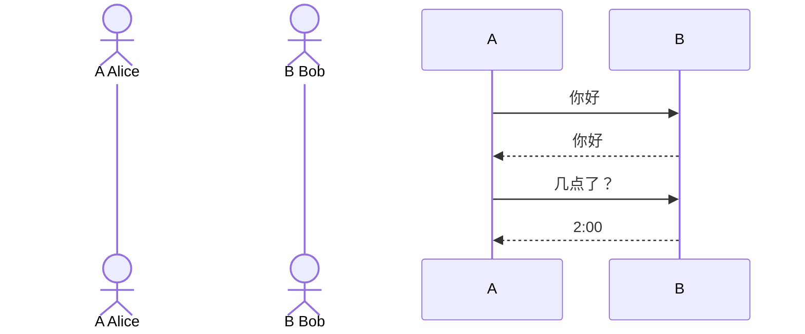
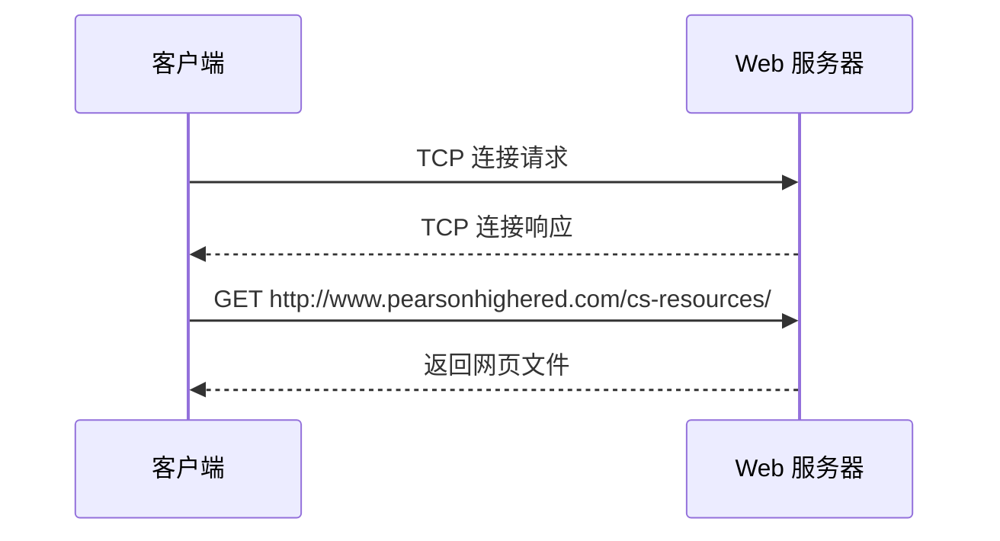
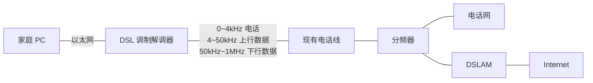
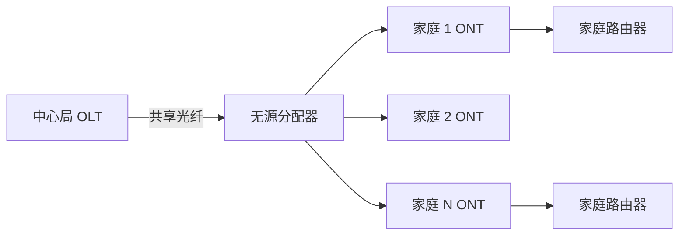
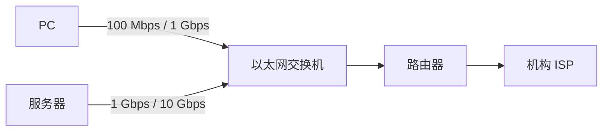
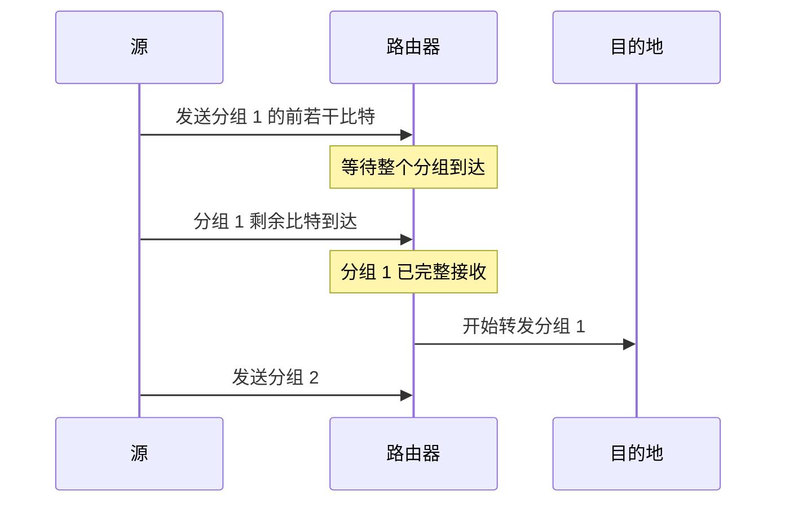
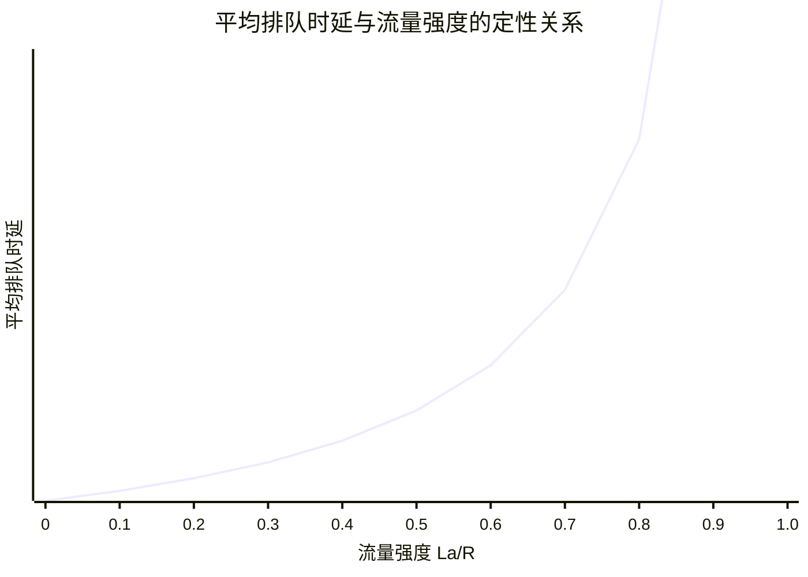
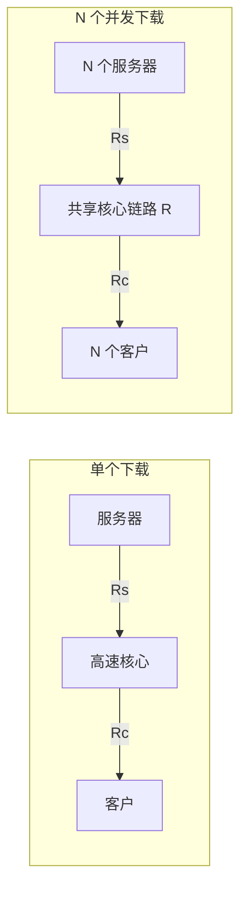
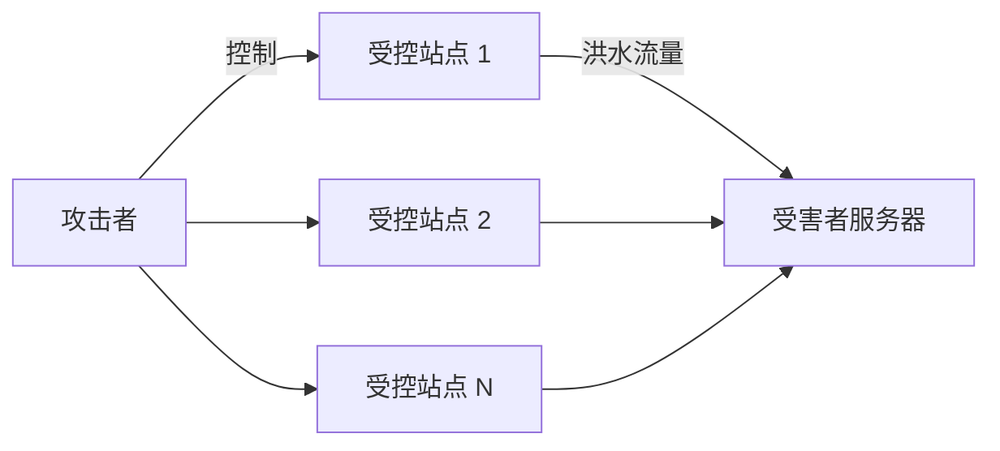

今天的 Internet（因特网）是人类创造的最大系统之一，它包括：

- 数以亿计的计算机、通信链路和交换机
- 数十亿经笔记本电脑、平板电脑和智能手机接入的用户
- 大量联网"物品"，如游戏机、监视系统、手表、眼镜、温度调节装置和汽车

面对这样一个庞大、复杂并且不断更新发展的系统，我们将在这一章高屋建领地从整体上考察它，帮助理解网络的原则与实践。

> [!important] 本章目标
> 了解现代计算机网络的基本概念和整体观念。本章包括大量的背景知识，讨论大量的计算机网络构件，并将它们放在整个网络的大环境中进行讨论。
>
> 1. 介绍某些基本术语和概念后，查看构成网络的基本硬件和软件组件
> 2. 从网络的边缘开始，考察在网络中运行的端系统和网络应用
> 3. 探究计算机网络的核心：查看传输数据的链路和交换机，以及将端系统与网络核心相连接的接入网和物理媒介
> 4. 了解Internet是网络的网络，以及这些网络怎样彼此连接起来
> 5. 从更广泛、更抽象的角度考察计算机网络：研究数据的时延、丢包和吞吐量，给出兼顾传输、传播和排队时延的端到端时延与吞吐量定量模型
> 6. 介绍计算机联网时一些关键的体系结构原则，即协议分层和服务模型
> 7. 了解计算机网络对许多不同类型的攻击来说是脆弱的，回顾其中的某些攻击并考虑使网络更为安全的方法
> 8. 以计算机网络的简要历史结束本章的学习

# 第一部分 Internet 全貌

## 1.1 什么是 Internet

回答这个问题有两种方式：

1. 描述 Internet 的具体构成，即构成 Internet 的基本硬件和软件组件
2. 根据为分布式应用提供服务的联网基础设施来描述 Internet

### 1.1.1 具体构成描述

#### 1. 主机/端系统

Internet 是一个世界范围的计算机网络，即一个互联了遍及全世界的数十亿计算设备的网络。

这些计算设备最初是传统的桌面 PC、Linux 工作站以及所谓的服务器（用于存储和传输 Web 页面、电子邮件等信息）。如今，越来越多的用户使用智能手机和平板电脑接入 Internet，超过半数的世界人口是活跃的移动 Internet 用户，且该比例预计仍将上升（具体数字因统计口径和年份而异）。与此同时，温度调节装置、家用安全系统、家用电器、手表、眼镜、汽车等各种各样的非传统“物品”正在连入 Internet。

随着大量非传统设备连入 Internet，计算机网络（computer network）这个术语开始显得有些过时。用 Internet 术语来说，所有这些设备都称为 **主机（host）** 或 **端系统（end system）**。

#### 2. 通信链路和分组交换机

端系统通过 **通信链路（communication link）** 和 **分组交换机（packet switch）** 的网络连接到一起。

在1.2 节中，我们将介绍多种类型的通信链路，它们由不同的物理媒介组成，包括同轴电缆、铜线、光纤和无线电频谱。不同的链路能够以不同的速率传输数据。链路的 **传输速率（transmission rate）** 以比特/秒（bit/s，或 bps）度量。

当一台端系统要向另一台端系统发送数据时，发送端系统将数据分段，并为每段加上首部字节。由此形成的信息包学术的说就是 **分组（packet）**。这些分组通过网络发送到目的端系统，并被还原成初始数据。

分组从一条入通信链路接收进入分组交换机，再从一条出通信链路被转发出去。市面上有各种类型的分组交换机，但在当今的 Internet 中，两种常见的类型是：

- **路由器（router）**：常用于网络核心中
- **链路层交换机（link-layer switch）**：常用于接入网中

从发送端系统到接收端系统，一个分组所经历的一系列通信链路和分组交换机称为通过该网络的**路径**（route or path）。

> [!example] 类比公路运输系统
>
> - 分组类似于卡车；
> - 通信链路类似于高速公路和公路；
> - 分组交换机类似于交叉口；
> - 端系统类似于仓库。
>
> 就像卡车选取运输网络的一条路径前行一样，分组则选取计算机网络的一条路径前行。

#### 3. 互联网服务提供商

端系统通过**Internet 服务提供商（Internet Service Provider，ISP）**接入Internet。ISP 有多种类型：

- 住宅区 ISP，如中国电信的家庭宽带接入服务
- 公司 ISP 和大学 ISP，如中国教育和科研计算机网（CERNET）
- 在机场、旅馆、咖啡店和其他公共场所提供 WiFi 接入的 ISP
- 为智能手机和其他设备提供移动接入的蜂窝数据 ISP

每个 ISP 自身就是一个由多台分组交换机和多段通信链路组成的网络。各 ISP 为端系统提供不同类型接入：住宅宽带接入（电话线、光纤入户）、高速局域网接入和移动无线接入。ISP 也为内容提供者提供接入服务，直接将服务器连入 Internet。

Internet把各处的端系统彼此连接起来，因此为端系统提供接入的 ISP 也必须互联。较低层的 ISP 通过国家的、国际的较高层 ISP 互联起来，并且这些较高层 ISP 彼此直接互联。较高层 ISP 是由通过高速光纤链路互联的高速路由器组成的。

无论是较高层还是较低层 ISP 网络，每个 ISP 网络都是独立管理的，运行着 IP 协议，遵从一定的命名和地址规则。我们将在 1.3 节中更为详细地研究 ISP 及其互联的情况。

#### 4. 协议

端系统、分组交换机和其他 Internet 部件都要运行多个**协议（protocol）**，这些协议控制 Internet 中信息的接收和发送。

Internet 中两个最为重要的协议统称为 TCP/IP：

- **TCP**（Transmission Control Protocol，传输控制协议）
- **IP**（Internet Protocol，网际协议）：IP 协议定义了在路由器和端系统之间发送和接收的分组格式

协议在互联网中占据着核心地位，为了使不同的系统能够相互通信，人们必须就各协议及其作用达成一致。这正是标准发挥作用的地方。

**Internet 标准**（Internet standard）由Internet工程任务组（Internet Engineering Task Force，IETF）研发。IETF 的标准文档称为 **请求评论（Request For Comment，RFC）**。

> [!info] RFC 文档
> RFC 最初只是普通的请求评论，因此而得名，目的是解决 Internet 先驱者面临的网络和协议问题。RFC 文档往往技术性很强并且相当详细。它们定义了 TCP、IP、HTTP（用于 Web）和 SMTP（用于电子邮件）等协议。目前 RFC 已累计约 1 万个（仍在持续增加）。

其他组织也在制定用于网络组件的标准，最引人注目的是针对网络链路的标准。例如，IEEE 802 LAN/MAN 标准化委员会制定了以太网和无线 WiFi 的标准。

### 1.1.2 服务描述

前面的讨论已经辨识了构建 Internet 的许多部件。但是我们也能从一个完全不同的角度，即从为应用程序提供服务的基础设施的角度来描述 Internet。

除了诸如电子邮件和浏览器等传统应用外，Internet 应用还包括移动智能手机和平板电脑应用，其中包括即时通信、实时道路交通信息提醒、电影和电视节目、社交媒体、视频会议、多人游戏以及基于位置的推荐系统。这些应用同时运行在不同端系统上，且彼此通信，故它们被称为**分布式应用（distributed application）**。

为了实现分布式应用彼此通信，系统架构截然不同的端系统必须拥有统一的通信接口，**套接字接口（socket interface）**便是为此而生的。该接口规定了运行在一个端系统上的程序请求 Internet 基础设施向运行在另一个端系统上的特定目的地程序交付数据的方式。

> [!example] 类比邮政服务
> 假定 Alice 使用邮政服务向 Bob 发一封信。当然，Alice 不能只把信（相关数据）写好就丢出窗外。相反，邮政服务要求 Alice 遵循一套规则：将信放入信封，在信封上写清 Bob 的全名、地址和邮政编码，封好信封，贴上邮票，最后投入邮局的信箱。
>
> 邮政服务有自己的"邮政服务接口"，即 Alice 必须遵循的这套规则。遵循它，邮政服务才能将信件交付给 Bob。同理，Internet 也有一个发送数据的程序必须遵循的套接字接口，支持 Internet 向接收数据的程序交付数据。
>
> 当然，邮政服务提供快递、挂号信、普通邮件等多种服务。同样，Internet 向应用提供多种服务；研发 Internet 应用时，必须为应用选择其中一种。我们将在第 2 章中描述 Internet 服务。

### 1.1.3 什么是协议

既然我们已经对 Internet 是什么有了一点印象，那么下面考虑计算机网络中另一个重要的术语：**协议（protocol）**。

什么是协议？协议是用来干什么的？

#### 1. 人类活动的类比

也许理解计算机网络协议这一概念的最容易办法是先与某些人类活动进行类比，因为我们人类无时无刻不在执行协议。

考虑你想向某人询问时间时会怎样做。下图显示了一种典型的交互过程。

人类协议（至少是有礼貌的行为方式）要求一方首先进行问候，从而开始与另一个人的通信。对“你好”的典型响应是返回一个“你好”报文。若对方用热情的“你好”回应，则隐含着一个信息：可以继续向他询问时间。若对最初“你好”作出别的响应（例如"不要烦我"或"我不会说英语"），则表明对方勉强或无法继续通信。在此情况下，按照人类协议，发话者就不能询问时间了。有时问题根本得不到任何回答，发话者通常会放弃询问。

注意，人类协议中既有我们发送的特定报文，也有根据收到的应答报文或其他事件（如给定时间内没有回答）而采取的操作。可见，报文的发送与接收，以及报文收发或其他事件出现时所采取的操作，在人类协议中起到核心作用。

如果人们使用不同的协议（例如一方讲礼貌而另一方不讲，或一方明白时间概念而另一方不理解），协议就无法交互，也就不能完成有用的工作。网络中也一样：为了完成一项工作，要求两个（或多个）通信实体运行相同的协议。


```mermaid
sequenceDiagram
    actor A Alice
    actor B Bob
    A->>B: 你好
    B-->>A: 你好
    A->>B: 几点了？
    B-->>A: 2:00
```


```mermaid
sequenceDiagram
    participant C as 客户端
    participant S as Web 服务器
    C->>S: TCP 连接请求
    S-->>C: TCP 连接响应
    C->>S: GET http://www.pearsonhighered.com/cs-resources/
    S-->>C: 返回网页文件
```

#### 2. 网络协议

网络协议类似于人类协议，只是交换报文和采取操作的实体是某些设备（可以是计算机、智能手机、平板电脑、路由器或其他具有网络能力的设备）的硬件或软件组件。在Internet中，涉及两个或多个远程通信实体的所有活动都受协议的制约。

例如：

- 在两台物理上连接的计算机中，硬件实现的协议控制了在两块网络接口卡间的"线上"比特流；
- 在端系统中，拥塞控制协议控制了在发送方和接收方之间传输的分组发送的速率；
- 路由器中的协议决定了分组从源到目的地的路径。

在 Internet 中，协议无处不在，因此本书的大量篇幅都与计算机网络协议有关。

> [!success] definition
> **协议（protocol）** 定义了在两个或多个通信实体之间交换的报文的格式和顺序，以及报文的发送和接收或其他事件所采取的操作。

计算机网络广泛使用协议，不同的协议用于完成不同的通信任务。掌握计算机网络知识的过程就是理解网络协议的构成、原理和工作方式的过程。

## 1.2 网络边缘

上一节给出了 Internet 和网络协议的总体概述，现在更深入地探究计算机网络（特别是 Internet）的部件。本节从网络边缘开始，观察我们更为熟悉的部件，即日常使用的计算机、智能手机和其他设备。在接下来的一节中，我们将从网络边缘向网络核心推进，了解计算机网络中的交换和选路。

与 Internet 相连的计算机和其他设备，也就是主机，有时又被进一步划分为两类：

- **客户（client）** ：通常是桌面 PC、移动 PC 和智能手机等
- **服务器（server）**：通常是更为强大的机器，用于存储和发布 Web 页面、流视频、中继电子邮件等
  - 今天，大部分提供搜索结果、电子邮件、Web 网页、视频和移动应用内容的服务器都属于大型**数据中心**（data center）。

> [!note] 数据中心和云计算
> 诸如谷歌、微软、亚马逊和阿里巴巴这样的Internet公司已经建立了巨大的数据中心，每个数据中心容纳数万到数百万台主机。数据中心是支撑日常 Internet 应用的引擎，其内部也有复杂的互联网络。
>
> 以亚马逊为例，数据中心有三个用途：
>
> 1. 为用户提供亚马逊电子商务页面，例如描述产品和购买信息的页面
> 2. 为亚马逊专用的数据处理任务提供大规模并行计算基础设施
> 3. 为其他公司提供**云计算（cloud computing）**
>
> 今天计算领域的一个主要趋势是：公司使用亚马逊这样的云提供商，几乎可以处理所有的 IT 需求。例如，Airbnb 公司和很多其他基于 Internet 的公司并不拥有和管理自己的数据中心，而是在亚马逊云中运行整个基于 Web 的服务，即亚马逊 Web 服务（AWS）。我们将在第 6 章中更为详细地讨论数据中心网络。

### 1.2.1 接入网

了解了位于网络边缘的应用程序和端系统后，接下来考虑 **接入网**，这是指将端系统物理连接到其 **边缘路由器（edge router）** 的网络。边缘路由器是端系统到任何其他远程端系统的路径上的第一台路由器。

#### 1. 家庭接入：DSL、电缆、FTTH 和 5G 固定式无线

截至 2024-2025 年，全球约 68% 的人口已接入 Internet。其中，欧美等高收入国家的家庭互联网接入率已超过 98%；而中国的互联网普及率也已突破 80%。本节从家庭接入开始，简要介绍几种主要的接入技术。

过去，宽带住宅接入有两种最流行的类型：**数字用户线（Digital Subscriber Line，DSL）** 和电缆。

住户通常从提供本地电话接入的本地电话公司处获得 DSL Internet 接入。因此，在使用 DSL 时，用户的本地电话公司也是它的 ISP。

住宅电话线同时承载数据与传统的电话信号，二者用不同的频率进行编码，这种方法使单根 DSL 线路看起来就像有多根单独的线路一样，因此一个电话呼叫和一个Internet连接能够同时共享 DSL 链路。

在用户一侧，一个分频器把到达家庭的数据信号和电话信号分隔开，并将数据信号转发给 DSL 调制解调器。在电话公司一侧，在本地中心局（Central Office，CO）中，数字用户线路接入复用器（DSLAM）把数据和电话信号分隔开，并将数据送往Internet。数百甚至上千个家庭与同一个 DSLAM 相连。

DSL 的上行速率和下行速率往往是不同的，所以这种接入被称为**不对称的**。DSL 专为家庭与本地中心局之间的短距离接入而设计。一般而言，住宅距离本地中心局超过 5～10 英里时，就必须采用其他形式的 Internet 接入。


```mermaid
graph LR
  PC["家庭 PC"] ---|"以太网"| MODEM["DSL 调制解调器"]
  MODEM ---|"0~4kHz 电话\n4~50kHz 上行数据\n50kHz~1MHz 下行数据"| LINE["现有电话线"]
  LINE --- SPLIT["分频器"]
  SPLIT --- PHONE["电话网"]
  SPLIT --- DSLAM["DSLAM"]
  DSLAM --- ISP["Internet"]
```

DSL 利用电话公司现有的本地电话基础设施，而**电缆Internet接入（cable Internet access）** 利用了有线电视公司现有的有线电视基础设施。住宅从提供有线电视的公司获得了电缆Internet接入。

光缆将电缆头端连接到地区枢纽，从这里通过传统的同轴电缆到达各个家庭和各个公寓。每个地区枢纽通常支持 500～5000 个家庭。因为在这个系统中既应用了光纤也应用了同轴电缆，所以它经常被称为**混合光纤同轴（Hybrid Fiber Coax，HFC）** 系统。

电缆Internet接入需要特殊的调制解调器，称为 **电缆调制解调器（cable modem）**。与 DSL 调制解调器一样，电缆调制解调器通常是一个外部设备，通过一个以太网端口连接到家庭 PC。

在电缆头端，**电缆调制解调器端接系统（Cable Modem Termination System，CMTS）** 与 DSL 网络的 DSLAM 具有类似的功能。电缆调制解调器将 HFC 网络划分为下行和上行两个信道。如同 DSL，接入通常是不对称的，下行信道分配的传输速率通常比上行信道的高。

电缆Internet接入的一个重要特征是**共享广播媒体**。特别的，电缆头端的信道是共享的，若是同一时刻有多个家庭同时使用下行信道，就可能造成拥塞；若是同一时刻有多个家庭同时使用上行信道，就需要一个分布式多路访问协议来协调传输和避免碰撞。（我们将在第 6 章中讨论碰撞问题）

如今，DSL 和电缆网络已经逐渐被速度更快的**光纤到户（Fiber To The Home，FTTH）** 所取代。欧洲和亚洲的许多国家已经大范围部署了 FTTH 网络，而美国的 FTTH 部署也在加速推进。

顾名思义，FTTH 提供了一条从本地中心局直达家庭的光纤路径。FTTH 能够提供大约每秒千兆比特的Internet接入速率。

从本地中心局到家庭，有几种相互竞争的光纤分布方案。最简单的光纤分布网络称为**直接光纤**，从本地中心局到每户设置一根光纤。

更常见的情况是：从中心局出来的每根光纤由许多家庭共享，直到相对接近这些家庭的位置，才分成每户一根光纤。进行这种分配时，有两种光纤分布体系结构：

- **有源光纤网络（Active Optical Network，AON）**：本质上就是交换以太网，我们将在第 6 章讨论。
- **无源光纤网络（Passive Optical Network，PON）**

这里简要讨论 PON，该技术用于 Verizon 的 FiOS 服务。

每个家庭都有一个 **光纤网络端接器（Optical Network Terminator，ONT）**，它由专门的光纤连接到邻近的分配器（splitter）。该分配器把一些家庭（通常少于 100 个）连接到一根共享的光纤，该光纤再连接到本地电话公司的中心局中的 **光纤线路端接器（Optical Line Terminator，OLT）**。该 OLT 提供了光信号和电信号之间的转换，经过本地电话公司路由器与 Internet 相连。

在家庭中，用户将一台家庭路由器（通常是无线路由器）与 ONT 相连，并经过这台家庭路由器接入Internet。

> [!note] 下行广播、上行共享
> PON 的下行分组在分配器处被复制，与 HFC 的共享下行类似；上行方向各家庭共享同一根光纤，需要协调发送。


```mermaid
graph LR
  CO["中心局 OLT"] -->|"共享光纤"| SPLIT["无源分配器"]
  SPLIT --> ONT1["家庭 1 ONT"]
  SPLIT --> ONT2["家庭 2 ONT"]
  SPLIT --> ONTN["家庭 N ONT"]
  ONT1 --> ROUTER1["家庭路由器"]
  ONTN --> ROUTERN["家庭路由器"]
```

除了 DSL、电缆和 FTTH，**5G 固定式无线**已经开始部署。

5G 固定式无线相当于一个连接 5G 网络的手机开热点，不仅提供高速住宅接入，而且无需布线、安装成本较低，省去了从电信公司本地中心局到家庭的易产生故障的有线系统。

采用 5G 固定式无线时，数据使用波束成形技术从供应商的基站无线发送到家中的调制解调器；无线路由器与该调制解调器相连（可能捆绑在一起），类似于 WiFi 无线路由器与电缆或 DSL 调制解调器相连的方式。第 7 章还会介绍 5G 蜂窝网络。

#### 2. 企业（和家庭）接入：以太网和 WiFi

在公司和大学校园以及越来越多的家庭环境中，都使用**局域网（LAN）**将端系统连接到边缘路由器。局域网技术有很多种，但**以太网**到目前为止是公司、大学和家庭网络中最为流行的接入技术。

以太网用户使用双绞铜线与一台以太网交换机相连（相关技术将在第 6 章详细讨论）；交换机或交换机网络再与更大的 Internet 相连。


```mermaid
graph LR
  PC["PC"] -->|"100 Mbps / 1 Gbps"| SW["以太网交换机"]
  SRV["服务器"] -->|"1 Gbps / 10 Gbps"| SW
  SW --> ER["路由器"] --> ISP["机构 ISP"]
```

然而，使用智能手机、平板电脑和其他物品无线接入 Internet 已经变得非常普遍。在无线 LAN 环境中，无线用户向接入点发送分组、从接入点接收分组，该接入点与企业网连接（很可能使用有线以太网），企业网再与有线 Internet 相连。

基于 IEEE 802.11 技术的无线 LAN 接入通常称为 **WiFi**，目前几乎无所不在——大学、办公室、咖啡厅、机场、家庭，甚至在飞机上都能见到。

> [!info] WiFi 名称起源
> 无线以太网兼容性联盟（Wireless Ethernet Compatibility Alliance，WECA）当年为了推广无线以太网技术，希望为基于 IEEE 802.11 标准的无线局域网技术创造一个更容易记忆的名字，经由市场营销公司提出了 WiFi 这个名字。其灵感来自于“HiFi（高保真音响）”，试图传达出无线网络的高质量和高性能。WiFi 这个名字本身并没有任何含义。

以太网和 WiFi 接入网最初出现在企业（公司或大学）环境中，如今也成为家庭网络中的常见部件。今天许多家庭将宽带住宅接入与廉价的无线局域网技术结合起来，组成强大的家用网络。

#### 3. 广域无线接入：3G、LTE、4G 和 5G

智能手机（如 iPhone 和安卓设备）已成为人们在移动环境中沟通、社交分享、移动支付、观看高清视频、云游戏及流媒体音乐的核心终端。

这些设备通过蜂窝网络提供商运营的基站发送和接收数据分组。与覆盖范围通常仅限几十米的 Wi-Fi 不同，蜂窝基站可提供数百米至数公里的广域连续覆盖（具体取决于频段与基站密度）。

目前，第四代（4G LTE-Advanced）网络已高度成熟，其峰值下载速率可达 150 Mbps 以上，足以支撑绝大多数日常移动宽带需求。同时，第五代（5G）及 5G-Advanced（5.5G）网络已在全球全面普及并成为主力，不仅将峰值下载速率提升至 1 Gbps 乃至 10 Gbps 量级，还大幅降低了网络延迟，为增强现实（AR）、车联网和工业物联网等新兴应用提供了基础支撑。

我们将在第 7 章讨论无线网络和移动性，以及 WiFi、4G 和 5G 等技术的基本原则。

### 1.2.2 物理媒介

前文概述了 Internet 中一些最重要的网络接入技术，也提到了它们所用的物理媒介，例如：

- HFC 使用了光缆和同轴电缆相结合的技术
- DSL 和以太网使用了双绞铜线
- FTTH 使用了光纤
- 移动接入网使用了无线电频谱

比特从一个端系统开始传输，通过一系列链路和路由器，到达另一个端系统。这个比特被漫不经心地传输了许许多多次！源端系统首先发送这个比特，不久后第一台路由器接收该比特；第一台路由器发送该比特，接着第二台路由器接收该比特；依此类推。

因此，比特从源到目的地传输时，会经过一系列传输器—接收器对；对每一对而言，比特都是通过传播电磁波或光脉冲的方式跨越某种**物理媒介（physical medium）**发送的。

物理媒介可以有多种形式，沿途每个传输器-接收器对使用的媒介不必相同。物理媒介的例子包括：

- 双绞铜线
- 同轴电缆
- 多模光纤电缆
- 陆地无线电频谱
- 卫星无线电频谱

物理媒介分成两种类型：

1. **导引型媒介（guided media）**：电波沿着固体媒介前行，如光缆、双绞铜线或同轴电缆。
2. **非导引型媒介（unguided media）**：电波在空气或外层空间中传播，例如在无线局域网或数字卫星频道中传播。

#### 1. 双绞铜线

最便宜并且最常用的导引型传输媒介是**双绞铜线**。虽然光纤已取代 DSL 成为住宅接入主流，但双绞线（如 Cat6/Cat6a）依然是连接光猫与终端设备、以及企业桌面接入的最后一米接入方案。

双绞线由两根绝缘的铜线组成，每根大约 1 mm 粗，以规则的螺旋状排列。两根线绞合起来，可以减少邻近类似双绞线的电气干扰。通常许多双绞线捆扎在一起形成一根电缆，并在这些双绞线外面覆盖上保护性防护层。一对电线构成了一条通信链路。

**无屏蔽双绞线（Unshielded Twisted Pair，UTP）**常用在建筑物内的计算机网络中，即用于局域网中。

目前局域网中双绞线的数据速率为 10 Mbps～40 Gbps。所能达到的数据传输速率取决于导线线径以及传输方和接收方之间的距离。

#### 2. 同轴电缆

与双绞线类似，同轴电缆由两根铜导体组成，但是这两根导体是同心的而不是并行的。借助于这种结构及特殊的绝缘体和保护层，同轴电缆能够达到较高的数据传输速率。

在电缆电视和电缆Internet接入中，发送设备将数字信号调制到某个特定的频段，产生的模拟信号从发送设备传送到一个或多个接收方。

同轴电缆可用作导引型**共享媒介（shared medium）**：许多端系统能够直接与该电缆相连，每个端系统都能接收由其他端系统发送的内容。

#### 3. 光纤

光纤是一种细而柔软的、能够导引光脉冲的媒介，其中每个脉冲表示一个比特。一根光纤能够支持极高的比特速率，高达数十甚至数百 Gbps。它们不受电磁干扰，对长达 100 km 的光缆信号衰减极低，并且很难窃听。

这些特征使得光纤成为长途导引型传输媒介，特别适用于跨海链路。在美国和其他地方，许多长途电话网络现在全面使用光纤。光纤也广泛用于 Internet 的主干。

光传送网（Optical Transport Network，OTN）和高速以太网光模块标准已经成为光纤通信的主流技术。OTN 通过在光纤中传输多个波长的光信号来实现高容量传输，而高速以太网光模块则提供了标准化的接口，使得不同厂商的设备能够互操作。

随着成本下降，光纤已大规模下沉至接入网，FTTH（光纤到户）和 FTTR（光纤到房间）已成为现代家庭和园区网络的主流。

#### 4. 陆地无线电信道

无线电信道用电磁频谱承载信号，不需要安装物理线路，并具有穿透墙壁、连接移动用户以及长距离承载信号的能力，因而是一种有吸引力的媒介。

无线电信道的特性极大地依赖于传播环境和信号传输的距离。环境方面的考虑包括：

- 路径损耗和遮挡衰落：信号跨距离传播及绕过或穿过阻碍物体时强度降低
- 多径衰落：干扰物体反射信号所致
- 干扰：其他传输或电磁信号所致

陆地无线电信道可大致划分为三类：

1. 一类运行在很短距离，如 1 m 或 2 m；
2. 另一类运行在局域，通常跨越数十到几百米；
3. 第三类运行在广域，跨越数万米。

个人设备如无线耳机、键盘和医疗设备跨短距离运行。在 1.2.1 节中描述的无线 LAN 技术使用了局域无线电信道，蜂窝接入技术使用了广域无线电信道。

> [!note] 5G 时代的广域覆盖
> 由于 5G 网络的高频段特性，其广域无线电信道的覆盖范围相较于 4G LTE 大幅缩短。为了实现广域覆盖，5G 网络通常采用微基站（small cell）部署策略，通过密集布置基站来弥补高频信号的传播损耗。

我们将在第 7 章中详细讨论无线电信道。

#### 5. 卫星无线电信道

一颗通信卫星连接地球上的两个或多个微波发射器/接收器，它们被称为**地面站**。该卫星在一个频段上接收传输，使用一个转发器再生信号，并在另一个频率上发射信号。

通信中常使用两类卫星：

1. **同步卫星（geostationary satellite）**
2. **近地轨道（Low-Earth Orbiting，LEO）卫星**

同步卫星永久地停留在地球上方的相同点上。这种静止性是通过将卫星置于地球表面上方 36000 km 的轨道上而取得的。同样，如此巨大的距离带来了可观的传播时延：单向约 270 ms。

近地轨道卫星离地球近得多，且不固定在地球上方的某一点，而是像月亮一样围绕地球旋转；它们彼此之间可以通信，也可以与地面站通信。为了对某个区域提供连续覆盖，需要在轨道上放置许多卫星。

例如 SpaceX 的星链系统通过巨型星座组网，已将传播延迟大幅降至 20\~40 ms，并提供数百 Mbps 的接入速率，为偏远地区和海上用户提供了可靠的互联网接入服务。

## 1.3 网络核心

考察了 Internet 边缘后，现在更深入地研究**网络核心**，即由互联 Internet 端系统的分组交换机和链路构成的网状网络。

通过网络链路和交换机移动数据有两种基本方法：

1. **分组交换（packet switching）**
2. **电路交换（circuit switching）**

### 1.3.1 分组交换

在某种网络应用中，端系统彼此交换**报文（message）**。报文能够包含该应用的设计者需要的任何东西：控制信息抑或是应用数据等等。

一次性发送一个长报文往往是不现实的，于是，源把长报文划分为较小的数据块，即**分组（packet）**。在源和目的地之间，每个分组都通过通信链路和分组交换机传送。交换机主要有路由器和链路层交换机两类。

分组以等于该链路最大传输速率的速度通过通信链路。如果某源端系统或分组交换机经过一条链路发送一个 $L$ bit 的分组，链路的传输速率为 $R$ bps，则传输该分组的时间为 $\frac{L}{R} \text{ s}$

#### 1. 存储转发传输

多数分组交换机在链路的输入端使用**存储转发传输（store-and-forward transmission）** 机制：交换机接收并缓存好一个分组，才开始向出链路发送该分组。

为了更详细地探讨存储转发传输，考虑由两个端系统经一台路由器连接构成的简单网络。当然，一台路由器通常有多条连入连出的链路，它的任务就是把一个入分组交换到一条出链路。


```mermaid
sequenceDiagram
    participant S as 源
    participant R as 路由器
    participant D as 目的地
    S->>R: 发送分组 1 的前若干比特
    Note over R: 等待整个分组到达
    S->>R: 分组 1 剩余比特到达
    Note over R: 分组 1 已完整接收
    R->>D: 开始转发分组 1
    S->>R: 发送分组 2
```

下面计算从源开始发送分组到目的地收到整个分组所经过的时间。这里忽略传播时延（比特以接近光速跨越线路所需的时间），1.4 节将讨论它。

1. 源在时刻 0 开始传输
2. 时刻 $\frac{L}{R}$ 时，源已发送完整个分组，路由器也接收并存储了该分组的全部比特，同时它能够朝着目的地向出链路传输分组
3. 在时刻 $\frac{2L}{R}$，路由器已经传输了整个分组，并且整个分组已经被目的地接收

所以，总时延是：

$$
\frac{2L}{R}
$$

而对于直通转发（cut-through forwarding），接收到数据包的前几个字节后就立即进行转发，总时延将是 $\frac{L}{R}$。但是，存储转发传输的优点是，如果分组在传输过程中出现错误，路由器可以丢弃该分组，而不必浪费带宽把错误分组转发到目的地。我们之后的讨论也默认使用存储转发传输。

下面考虑更一般的情况：源和目的地之间有 $N-1$ 台路由器，共 $N$ 条速率均为 $R$ 的链路，发送一个分组的端到端时延是：

$$
d_{\text{end-end}} = N \frac{L}{R}
\tag{1-1}
$$

#### 2. 排队时延和分组丢失

每台分组交换机与多条链路相连。对每条相连的链路，交换机都有一个**输出缓存**（也称 **输出队列**），用于存储准备发往那条链路的分组。

当分组到达交换机的速率超过了分组离开交换机的速率时，分组就不得不在输出缓存中排队等待传输。因此，除了存储转发时延，分组还要承受输出缓存的**排队时延（queuing delay）**，这取决于网络的拥塞等级。

缓存空间是有限的，到达的分组可能发现缓存已被其他等待传输的分组完全占满。此时将出现**分组丢失（丢包）**（packet loss），即到达的分组或已经排队的分组之一将被丢弃。

#### 3. 转发表和路由选择协议

前面说过，路由器从一条相连的链路接收分组，再向另一条相连的链路转发。那么，路由器如何得知向哪条链路转发呢？不同类型的计算机网络以不同方式完成分组转发，这里简要介绍Internet中所采用的方法。

在Internet中，每个端系统都有一个称为 IP 地址的唯一标识。源主机发送分组时，会在分组首部中包含目的地的 IP 地址。类似现实地址，IP 地址也是具有层级结构的。

当一个分组到达网络中的路由器时，路由器检查该分组的目的地址的一部分，并向一台相邻的路由器转发该分组。更具体地说，每台路由器有一个**转发表（forwarding table）**，将目的地址（或目的地址的一部分）映射为输出链路。

分组到达路由器时，路由器检查其目的地址，用该地址搜索转发表，找到适当的出链路并将分组导向该链路。也就是说，路由器只看目的地址的一部分，逐跳转发。

类比现实世界的邮政系统：A市的邮局只要看到邮件上地址写了B市，就会把邮件送往B市的邮局，而不需要关心具体的街道、门牌号。

### 1.3.2 电路交换

在电路交换网络中，通信会话期间会预留端系统沿路径通信所需的资源（缓存、链路传输速率）。

分组交换网络则不预留资源：会话的报文按需使用资源，代价是可能必须等待（排队）接入通信线路。

一个简单的类比是，考虑两家餐馆：

- 一家需要顾客预订：我们出门前要先打电话预订，但到达时原则上能立即入座点菜
- 另一家不需要预订，但不保证能安排顾客：到达时可能需要等待，甚至无法入座。

当两台主机要通信时，电路交换网络在两台主机之间创建一条专用的**端到端连接（end-to-end connection）**。因此，主机 A 要与主机 B 通信，网络必须先在两条链路上各预留一条电路。

若每条链路有 4 条电路，该端到端连接在连接期间获得所经每条链路总传输容量的 $1/4$。例如，如果两台邻近交换机之间每条链路具有 1 Mbps 的传输速率，则每个端到端电路交换连接获得 250 kbps 的专用传输速率。

对比之下，考虑一台主机经过分组交换网络（如Internet）向另一台主机发送分组的情况。

与电路交换相同，分组经一系列通信链路传输；不同的是，分组被直接送入网络，不预留任何链路资源。如果某条链路因其他分组也需经其传输而出现拥塞，该分组就不得不在发送侧的缓存中等待，从而产生时延。Internet尽最大努力以及时方式交付分组，但不做任何保证。

#### 1. 电路交换网络中的复用

链路中的电路是通过**频分复用**（Frequency-Division Multiplexing，FDM）或者**时分复用**（Time-Division Multiplexing，TDM）实现的：

1. **频分复用**：将链路的频谱划分为多个不重叠的频段，每个频段分配给一个连接使用。
   - 频段的宽度称为 **带宽（bandwidth）**
2. **时分复用**：将时间划分为固定长度的帧，每个帧又被划分为固定数量的时隙。每个帧中指定的时隙分配给一个连接使用。

| 复用方式 | 划分维度 | 每条电路获得资源的方式                               |
| -------- | -------- | ---------------------------------------------------- |
| FDM      | 频率     | 每条电路连续地得到部分带宽                           |
| TDM      | 时间     | 每条电路在短时间间隔（即时隙）中周期性地得到所有带宽 |

分组交换的支持者总是争辩说，电路交换不够经济，因为在**静默期（silent period）**专用电路是空闲的。例如，即使通话的一方停止讲话，空闲的网络资源（沿该连接路由的链路中的频段或时隙）也不能被其他进行中的连接使用。

分组交换的支持者还津津乐道地指出：创建端到端电路、预留端到端带宽是复杂的，需要复杂的信令软件来协调沿端到端路径的交换机的操作。

考虑从主机 A 到主机 B 经电路交换网络发送一个 640000 bit 的文件需要多长时间。假如在该网络中所有链路使用具有 24 时隙的 TDM，比特速率为 1.536 Mbps。同时假定在主机 A 开始传输该文件之前，需要 500 ms 创建一条端到端电路。它需要多长时间才能发送该文件？

每条链路具有的传输速率是 $\frac{1.536}{24}\text{ Mbps} = 64 \text{ kbps}$ 因此传输该文件需要 $\frac{640 \text{ kb}}{64 \text{ kbps}} = 10 \text{ s}$

这个 10 s，再加上 500 ms 的电路创建时间，发送该文件共需 10.5 s。值得注意的是，该传输时间与链路数量无关：无论端到端电路经过 1 条链路还是 100 条链路，传输时间都是 10 s。

#### 2. 分组交换与电路交换的对比

在描述了电路交换和分组交换之后，我们来对比一下。

分组交换的批评者经常争辩说，分组交换不适合实时服务（如电话和视频会议），因为它的端到端时延可变且不可预测（主要源于排队时延的变动）。

分组交换的支持者则争辩道：它比电路交换提供更好的带宽共享；它比电路交换更简单、更有效，实现成本更低。

概括而言，嫌餐馆预订麻烦的人宁可要分组交换，而不要电路交换。

分组交换为什么更有效呢？大多数时候，活跃用户的数量远小于网络中总用户的数量。分组交换允许活跃用户共享链路资源，而电路交换则为每个用户预留资源，即使该用户不活跃。这展示了两种链路共享方式的关键差异：

- 电路交换不考虑需求，预先分配传输链路，已分配而闲置的链路时间无法被利用
- 分组交换按需分配链路，链路传输能力在所有需要传输的用户之间逐分组共享

今天，分组交换取得了近乎压倒性的胜利，即使在跨洋电话网络中，传统的电路交换也被分组交换所取代。

### 1.3.3 网络的网络

前面看到，端系统（PC、智能手机、Web 服务器、电子邮件服务器等）经过一个接入 ISP 与Internet相连。但为端用户和内容提供商提供接入，还并没有使他们真正的相联通。

要解决这个难题，接入 ISP 自身必须互联，即创建**网络的网络**。在年复一年的演化过程中，接入 ISP 之间的互联已经演化为一个非常复杂的结构。这种演化很大程度上由经济和国家策略驱动，而不是由性能考虑驱动。

为了理解今天Internet的网络结构，下面以逐步递进的方式建造一系列网络结构，每个新结构都更接近现在复杂的Internet。

#### 网络结构 1

一种朴素（天真）的网络结构是：假设有一个全球传输 ISP，它与数十万接入 ISP 相连。

这个假想的全球传输 ISP 由路由器和通信链路构成，不仅跨越全球，而且至少有路由器邻近数十万接入 ISP 中的每一个。

建造这样大规模的全网络耗资巨大，为了有利可图，自然要向每个连接的接入 ISP 收费，其价格大致反映（不一定正比于）一个接入 ISP 经过全球 ISP 交换的流量大小。

因为接入 ISP 向全球传输 ISP 付费，故接入 ISP 被认为是**客户（customer）**，而全球传输 ISP 被认为是**提供商（provider）**。

而当一家公司建立并运营一个可赢利的全球传输 ISP，其他公司自然会建立自己的全球传输 ISP 与之竞争。这产生了**网络结构 2**。

#### 网络结构 2

数十万接入 ISP 和多个全球传输 ISP 组成了网络结构 2。相比网络结构 1，接入 ISP 无疑更喜欢网络结构 2，它们可以根据价格和服务在多个相互竞争的全球传输提供商之间选择。

不过要注意，这些全球传输 ISP 之间必须互联，否则连接到不同全球传输 ISP 的接入 ISP 之间将无法通信。

网络结构 2 是一种两层的等级结构：全球传输提供商位于顶层，接入 ISP 位于底层。这假设全球传输 ISP 既有能力邻近每个接入 ISP，也在经济上愿意这样做。

#### 网络结构 3

现实中，尽管某些 ISP 确实具有令人印象深刻的全球覆盖，并且确实直接与许多接入 ISP 连接，但世界上没有哪个 ISP 是无处不在的。

相反，在任何给定的区域，可能有一个**区域 ISP（regional ISP）**，区域中的接入 ISP 与之连接。每个区域 ISP 则与**第一层 ISP（tier-1 ISP）** 连接。

第一层 ISP 类似于我们假想的全球传输 ISP，尽管它不是在世界上每个城市中都存在，但它确实存在。有大约十几个第一层 ISP，包括 Lumen Technologies、NTT Communications、Tata Communications、AT&T、Cogent Communications 以及 Deutsche Telekom 等。

有趣的是，没有组织正式认可第一层 ISP 的地位。俗话说，“if you have to ask if you’re a member of a group, you’re probably not.”

在这样的等级结构中，下层向上层付费，形成客户—提供商关系。而第一层 ISP 不向任何人付费，因为它们位于该等级结构的顶部。

更为复杂的情况是，在某些区域，可能有较大的区域 ISP（可能跨越整个国家），该区域中较小的区域 ISP 与之相连，较大的区域 ISP 则与第一层 ISP 连接。

这个多层等级结构仍然仅仅是今天 Internet 的粗略近似，我们称它为 **网络结构 3**。

#### 网络结构 4

为了建造一个与今天的Internet更为相似的网络，我们必须在等级化网络结构 3 上增加：

- **存在点（Point of Presence，PoP）**：PoP 存在于等级结构的所有层次，但底层（接入 ISP）等级除外。PoP 作为客户 ISP 与提供商 ISP 之间的接口，物理上是一个路由器或一组路由器，位于提供商 ISP 的网络中。

  对于要与提供商 PoP 连接的客户网络，它能从第三方电信提供商租用高速链路并将它的路由器之一直接连接到位于该 PoP 的一台路由器。

- **多宿（multi-home）**：任何 ISP（除了第一层 ISP）都可以选择**多宿**，即可以与两个或更多提供商 ISP 连接。

  当一个 ISP 为多宿时，即使提供商之一出现故障，它仍然能够继续在 Internet 中发送和接收分组。

- **对等（peer）**：位于相同等级结构层次的邻近的一对 ISP 能够**对等**，也就是说，能够直接将它们的网络连到一起，使它们之间的所有流量经直接连接而不是通过上游的中间 ISP 传输。
  对等减少了客户 ISP 通过提供商交换的通信流量，从而减少了客户 ISP 向提供商 ISP 支付的费用。而两个 ISP 对等时，通常不进行结算，即任何一个 ISP 都不向其对等付费。
- **Internet 交换点（Internet Exchange Point，IXP）**：IXP 是一个汇合点，多个 ISP 能够在这里一起对等

  IXP 通常位于一个有自己的交换机群的独立建筑物中。2025 年，全球有超过 1000 个 IXP，并呈现出快速增长的趋势。

我们称这个生态系统为**网络结构 4**，由接入 ISP、区域 ISP、第一层 ISP、PoP、多宿、对等和 IXP 组成。

#### 网络结构 5

**网络结构 5**也就是现今的 Internet。它在网络结构 4 顶部增加**内容提供商网络**（content provider network）构建而成。Google 是当前这样的内容提供商网络的一个突出例子。

截至 2024 年，Google 在北美、欧洲、亚洲和南美拥有 20 多个主要数据中心，每个数据中心都部署了数以万计乃至更多的服务器。此外，Google 还在世界各地部署了大量边缘网络设施，包括位于互联设施和 IXP 附近的边缘节点（Edge POPs），以及部署在接入 ISP 网络内部、靠近最终用户的边缘节点和缓存服务器。这些设施使 Google 能够将服务内容和网络流量尽可能靠近用户提供。

Google 的主要数据中心通过 Google 的全球私有 TCP/IP 网络互联，该网络跨越全球，并与公共 Internet 在网络边缘进行互联。Google 的私有网络承担 Google 内部基础设施以及相关服务的跨区域通信，并使 Google 能够对其服务的全球传输进行统一管理。Google 的网络基础设施包括数据中心、Edge POP 和部署在 ISP 网络中的边缘节点，共同构成了一个覆盖全球的内容提供商网络。

Google 同样通过 IXP 或直接与接入 ISP 对等，减少对上层 ISP 的依赖与相关费用。同时，Google 还通过在接入 ISP 内部部署边缘节点和缓存服务器，将内容和服务尽可能靠近最终用户，从而降低了延迟并提高了用户体验。

通过建立自己的全球网络，内容提供商不仅可以减少对上层 ISP 和中转网络的依赖以及相关费用，而且能够对其服务最终如何传输和交付给端用户拥有更大的控制权。随着大型内容提供商不断建设自己的骨干网络、边缘设施以及与 ISP 的直接互联，Internet 的网络结构也因此变得越来越扁平化。作为这一趋势的一个例子，截至 2020 年，Amazon、Google、IBM 和 Microsoft 等云提供商已经能够在相当大比例的 Internet 上实现无需经过 Tier-1 和 Tier-2 ISP 的连通。

> [!summary] 今天的互联网
> 总之，今天的 Internet是一个网络的网络，结构复杂。Internet 由数量相对有限的 Tier-1 ISP、大量的较低层 ISP，以及不断发展壮大的内容提供商网络等共同组成。不同 ISP 的覆盖范围差异很大，上至跨洲际，下至仅覆盖狭窄区域。
>
> 较低层 ISP 与较高层 ISP 相连，而较高层 ISP 彼此互联。用户通常通过接入 ISP 接入 Internet；内容提供商则通过自己的网络以及与其他 ISP 的互联向用户提供服务。与此同时，ISP 之间也可以通过对等直接交换流量，而不必总是依赖更高层 ISP 的中转。
>
> 近年来，大型内容提供商也纷纷建立自己的全球网络，并通过数据中心、网络边缘节点和 Internet 交换点等基础设施，在可能的地方直接与较低层 ISP 互联。

# 第四部分 性能、体系结构、安全与历史

## 1.4 分组交换网中的时延、丢包和吞吐量

1.1 节讲过，可以把 Internet 看成一种基础设施，它为运行在端系统上的分布式应用提供服务。理想情况下，我们希望 Internet 能在任意两个端系统之间随心所欲地瞬间移动数据而没有任何丢失。然而，这是一个极高的目标，实践中难以达到。

相反，计算机网络必然会限制端系统之间的吞吐量（每秒能够传送的数据量），在端系统之间引入时延，而且实际上也会丢失分组。物理定律引入的时延、丢包和吞吐量限制令人无奈；但正因为此，孕育而出的课题精彩纷呈、层出不穷—— more than enough issues to fill a course on computer networking and to motivate thousands of PhD theses!

本节中，我们将定量地研究计算机网络中的时延、丢包和吞吐量。

### 1.4.1 分组交换网中的时延

分组沿路径从一个节点（主机或路由器）传到后继节点时，会在每个节点经受几种不同的时延。其中比较重要的是：

1. **节点处理时延（nodal processing delay）**：检查分组首部、决定分组导向何处所需的时间，通常是微秒或更低的数量级。

   部分路由器还会执行差错检测等额外功能，这也会增加节点处理时延。

   节点处理完成后，路由器将该分组引向通往路由器 B 的链路之前的队列。

2. **排队时延（queuing delay）**：分组输出队列中的等待时间，可以是微秒到毫秒量级。

   排队时延取决于先期到达、正在排队等待传输的分组数量。网络越是拥塞，排队时延就越大。

3. **传输时延（transmission delay）**：路由器将分组的比特推向链路所需的时间，通常在毫秒量级。

   简单来说，路由器将分组从输出队列中取出，“搬运”到链路上需要时间，取决于路由器“搬运”的速度，也即链路的传输速率，和分组的长度。

   类比高速收费站，即使没有车排队，车辆也需要花费时间在收费站缴费。

   用 $L$ 表示分组长度，$R$ 表示从路由器 A 到路由器 B 的链路传输速率。传输时延是 $\frac{L}{R}$，这是将所有分组比特推向链路（即传输，或说发射）所需的时间。

4. **传播时延（propagation delay）**：分组在物理媒介中传播所需的时间，通常在毫秒量级。

   传播速率取决于链路的物理媒介（即光纤、双绞铜线等），其范围是 $2 \times 10^8 \sim 3 \times 10^8 \text{ m/s}$，该速率等于或略小于光速。

   传播时延等于两台路由器之间的距离除以传播速率，即 $\frac{d}{s}$。

   当分组的最后一个比特传播到节点 B 时，该比特及其前面的所有比特已存储于路由器 B，随后路由器 B 继续执行转发。

这些时延累加起来是**节点总时延（total nodal delay）**。

四种时延对照如下：

| 时延                  | 公式              | 取决于             | 典型量级                                 |
| --------------------- | ----------------- | ------------------ | ---------------------------------------- |
| 处理 $d_\text{proc}$  | 检查首部+差错检测 | 路由器性能         | 微秒或更低                               |
| 排队 $d_\text{queue}$ | 随拥塞变化        | 流量强度 La/R      | 微秒到毫秒                               |
| 传输 $d_\text{trans}$ | $L/R$             | 分组长度、链路速率 | 微秒到毫秒                               |
| 传播 $d_\text{prop}$  | $d/s$             | 距离、媒介         | 校园网微秒级，广域网毫秒级，卫星数百毫秒 |

各时延成分所起的作用可能差别很大。

例如，对于连接同一大学校园内两台路由器的链路，$d_{\text{prop}}$ 可能只有数微秒到数十微秒，微不足道；而经由同步卫星链路互联的两台路由器，$d_{\text{prop}}$ 为几百毫秒，是 $d_{\text{nodal}}$ 的主要成分。

类似地，$d_{\text{trans}}$ 的影响也可能微不足道，也可能很大：对 10 Mbps 及更高速率的信道（如 LAN）微不足道；而通过低速拨号调制解调器链路发送较长的 Internet 分组时，可达数百毫秒。

处理时延 $d_{\text{proc}}$ 通常微不足道，但它对路由器的最大吞吐量有重要影响——最大吞吐量即路由器能够转发分组的最大速率。

### 1.4.2 排队时延和丢包

节点时延中最复杂也最有趣的成分是排队时延 $d_{\text{queue}}$，由此衍生出数以千计的论文和大量专著。这里我们只给出一个简要的定性讨论。

到达时的排队情况对排队时延具有显著影响。因此，描述排队时延通常使用统计量，例如：

- 平均排队时延
- 排队时延的方差
- 排队时延超过某些特定值的概率

排队时延何时大、何时小？答案很大程度上取决于流量到达队列的速率、链路的传输速率和到达流量的性质（周期性到达还是突发到达）。

为便于讨论，令分组到达队列的平均速率为 $a\text{ pkt/s}$，链路传输速率为$R \text{ bps}$。进一步假定所有分组长度均为 $L \text{ bit}$，且队列非常大、基本能容纳无限数量的比特，则比特到达队列的平均速率是 $La \text{ bps}$。

定义**流量强度**（traffic intensity）为 $\dfrac{La}{R}$，它在估计排队时延的范围方面经常起着重要的作用。

如果 $La/R > 1$，则比特到达队列的平均速率超过从队列传输出去的速率。在这种糟糕的情况下，队列趋向于无限增长，排队时延将趋向无穷大！因此，流量工程中的一条金科玉律是：设计系统时流量强度不能大于 1。

通常，到达队列的过程是随机的：到达不遵循任何模式，分组间隔随机。

在这种更真实的情况下，$La/R$ 通常不足以全面表征时延的统计特性；不过，用它直观把握排队时延的范围仍然很有用。

流量强度接近 0 时，分组极少到达、间隔很大，到达的分组几乎不会在队列中遇到其他分组，平均排队时延接近 0。

流量强度接近 1 时，由于分组到达速率的波动，会出现到达速率暂时超过传输能力的时段，队列在这些时段中形成；当到达速率低于传输能力时，队列又会缩短。无论如何，随着流量强度接近 1，平均排队长度变得越来越长。

平均排队时延与流量强度的定性关系如图所示。


```mermaid
---
config:
  xyChart:
    yAxis:
      showLabel: false
      showTick: false
---
xychart-beta
  title "平均排队时延与流量强度的定性关系"
  x-axis "流量强度 La/R" [0, 0.1, 0.2, 0.3, 0.4, 0.5, 0.6, 0.7, 0.8, 0.9, 1.0]
  y-axis "平均排队时延" 0 --> 1
  line [0, 0.022, 0.05, 0.085, 0.133, 0.2, 0.3, 0.467, 0.8, 1.8, 19.8]
```

流量强度与平均排队时延之间的关系是非线性的，这意味着，即使流量只是略微增加，平均排队时延也可能大幅增加。

#### 丢包

以上讨论假设队列能容纳无穷多的分组。现实中，一条链路前的队列容量有限（具体容量极大地依赖于路由器设计和成本）。

由于容量有限，随着流量强度接近 1，排队时延并不会真正趋向无穷大；相反，到达的分组将遇到一个满队列。

没有地方存储该分组，路由器只能将它丢弃，即发生丢包。

分组丢失的比例随流量强度增加而增加。因此，节点的性能常用时延和丢包概率共同度量。

正如后面各章将讨论的，丢失的分组可能按端到端原则重传，以确保所有数据最终从源传送到目的地。

### 1.4.3 端到端时延

前面讨论的是节点时延，即单台路由器上的时延。现在考虑从源到目的地的总时延。

假定源主机和目的主机之间有 $N-1$ 台路由器，且网络无拥塞、排队时延微不足道。

每台路由器和源主机的处理时延为 $d_{\text{proc}}$、输出速率为 $R$ bps，每条链路的传播时延为 $d_{\text{prop}}$，则节点时延累加得到端到端时延：

$$
d_{\text{end-end}} = N(d_{\text{proc}} + d_{\text{trans}} + d_{\text{prop}})
\tag{1-2}
$$

式中 $d_{\text{trans}} = \dfrac{L}{R}$，$L$ 是分组长度。

若各节点时延不同、且每个节点存在平均排队时延，还需要对式 (1-2) 再做推广。

#### 1. Traceroute

要实际感受网络中的端到端时延，可以使用 Traceroute 程序。

Traceroute 是一个简单的程序，能在任何 Internet 主机上运行。用户指定一个目的主机后，源主机中的该程序向目的地发送多个特殊分组，并接收路径上每台路由器返回的报文。

源记录从发送分组到收到对应返回报文所经历的时间，以及返回该报文的路由器（或目的主机）的名字和地址。

这样，源就能重建分组从源到目的地所采用的路由，并确定到所有中间路由器的往返时延。

> [!tip] Traceroute 的核心机制
> Traceroute 利用 IP 首部的 TTL（Time-To-Live）字段。源从 TTL=1 开始逐次加 1 发送探测分组，每经过一台路由器 TTL 减 1，减到 0 即丢弃并回送 ICMP 超时报文。由此逐跳发现路径。

Traceroute 对上述实验重复 3 次，因此源实际向目的地发送 $3N$ 个分组。

下面是 Traceroute 输出的一个例子，追踪的路由从源主机 `gaia.cs.umass.edu`（马萨诸塞大学）到巴黎索邦大学计算机科学系的一台主机。输出有 6 列：

1. 第一列是路径上的路由器编号 $n$
2. 第二列是路由器的名字
3. 第三列是路由器地址，格式为 xxx.xxx.xxx.xxx
4. 最后 3 列是 3 次实验的往返时延

如果源从某台路由器收到的报文少于 3 条（网络丢包所致），Traceroute 会在该路由器编号后放一个星号，并报告少于 3 次往返时间。

```bash showLineNumbers=false
1  qw-vlan-2451.cs.umass.edu (128.119.245.1)        1.899 ms  3.266 ms  3.280 ms
2  j-cs-gw-int-10-240.cs.umass.edu (10.119.240.254) 1.296 ms  1.276 ms  1.245 ms
3  n5-rt-1-1-xe-2-1-0.gw.umass.edu (128.119.3.33)   2.237 ms  2.217 ms  2.187 ms
4  border1-rt-et-5-0-0.gw.umass.edu (192.80.83.102) 0.345 ms  0.345 ms  0.344 ms
5  core1-rt-et-5-2-0.gw.umass.edu (128.119.0.9)     0.351 ms  0.392 ms  0.380 ms
6  nox300qwl-umass-re.nox.org (192.5.89.101)        3.260 ms  0.416 ms  3.127 ms
7  nox300qwl-umass-re.nox.org (192.5.89.101)        3.165 ms  7.326 ms  7.311 ms
8  198.71.45.237 (198.71.45.237)                   77.826 ms 77.246 ms 77.744 ms
9  renater-lb1-qw.mx1.par.fr.geant.net (62.40.124.70) 79.357 ms 77.729 ms 79.152 ms
10 193.51.180.109 (193.51.180.109)                  78.379 ms 79.936 ms 80.042 ms
11 * 193.51.180.109 (193.51.180.109)                80.640 ms *         *
12 * 195.221.127.182 (195.221.127.182)              78.408 ms *         *
13 195.221.127.182 (195.221.127.182)                80.686 ms 80.796 ms 78.434 ms
14 r-upmc1.reseau.jussieu.fr (134.157.254.10)       78.399 ms *         81.353 ms
```

在上述踪迹中，源和目的地之间有 14 台路由器。多数路由器有名字，所有路由器都有地址。例如，第 5 台路由器的名字是 `core1-rt-et-5-2-0.gw.umass.edu`，地址是 `128.119.0.9`。从该路由器的数据可以看到，源到该路由器的往返时延 3 次分别为 0.351 ms、0.392 ms 和 0.380 ms。

这些往返时延包括前面讨论的所有时延：传输时延、传播时延、路由器处理时延和排队时延。

由于排队时延随时间变化，发往第 $n$ 台路由器的分组 $n$ 的往返时延，实际上可能大于发往第 $n+1$ 台路由器的分组 $n+1$ 的往返时延。

还注意到从路由器 7 到路由器 8 时往返时延大幅增加——这源于两者之间的跨大西洋光纤链路带来的较大传播时延。

#### 2. 端系统、应用程序和其他时延

除了处理时延、传输时延和传播时延，端系统中还有其他一些重要时延。

例如，在 WiFi 或电缆调制解调器等共享媒介场景中，端系统可能有意延迟自己的传输，把它作为与其他端系统共享媒介的协议的一部分。第 6 章将详细讨论这类协议。

另一个重要时延是**媒介分组化时延**，它出现在 IP 语音（VoIP）应用中。

在 VoIP 中，发送方必须先将要传输的编码数字化语音填满一个分组，才能向 Internet 传递该分组。这段填充时间称为**分组化时延**。

### 1.4.4 计算机网络中的吞吐量

除了时延和丢包，计算机网络中另一个至关重要的性能测度是**端到端吞吐量**。

为定义吞吐量，考虑从主机 A 到主机 B 跨越计算机网络传送一个大文件。

任意时刻的**瞬时吞吐量**（instantaneous throughput）是主机 B 接收该文件的速率。

如果该文件由 $F$ bit 组成，主机 B 接收全部 $F\text{ bit}$ 用去 $T\text{ s}$，则文件传送的**平均吞吐量**（average throughput）是 $\dfrac{F}{T}\text{ bps}$。

下面用几个例子深入理解吞吐量这一概念。


```mermaid
graph LR
  S["服务器"] -->|"R_s"| R["路由器"] -->|"R_c"| C["客户"]
```

服务器和客户由两条通信链路和一台路由器相连，考虑从服务器向客户传送一个文件的吞吐量。

令 $R_s$ 表示服务器与路由器之间的链路速率，$R_c$ 表示路由器与客户之间的链路速率，并假定整个网络中只有从服务器到客户的比特在传送。

容易想到，总链路速度取决于其中最慢的链路。也是，这种简单两链路网络的吞吐量是 $\min\{R_c, R_s\}$，也就是**瓶颈链路**（bottleneck link）的传输速率。

据此可以近似得到从服务器向客户传送一个 $F$ bit 大文件所需的时间：$\dfrac{F}{\min\{R_c, R_s\}}$。

当然，这些吞吐量与传输时间表达式只是近似——没有考虑存储转发、处理时延和协议开销等问题。

再来看当前Internet中的两个例子。


```mermaid
graph LR
  subgraph a["单个下载"]
    S1["服务器"] -->|"Rs"| CORE1["高速核心"] -->|"Rc"| C1["客户"]
  end

  subgraph b["N 个并发下载"]
    S2["N 个服务器"] -->|"Rs"| CORE2["共享核心链路 R"] -->|"Rc"| C2["N 个客户"]
  end
```

服务器和客户分别以速率 $R_s$、$R_c$ 的接入链路与网络相连。

假定网络核心中的所有链路传输速率远高于 $R_s$ 和 $R_c$——今天Internet的核心确实超量配置了高速链路，很少出现拥塞

（1）网络中仅有一个下载时，吞吐量为 $\min\{R_s, R_c\}$。因此，今天 Internet 中对吞吐量的限制因素通常是接入网。

（2）网络中有 $N$ 台服务器和 $N$ 个客户连接到网络核心，同时发生 $N$ 个下载（涉及 $N$ 个客户-服务器对），且这是网络中当时的唯一流量。并且，下载的比特在网络核心中共享一条传输速率为 $R$ 的链路。

此时，我们必须要问，$R \ge N \min\{R_s, R_c\}$ 吗？如果是，吞吐量仍然是

$$
\min\{R_s, R_c\}
$$

可惜的是，$N$ 有时会很大（如学生抢课），也就是说，$R < N \min\{R_s, R_c\}$。此时，吞吐量为

$$
\frac{R}{N}
$$

我们可以看到，吞吐量不仅取决于路径上链路的传输速率，还取决于干扰流量——如果许多其他数据流也经过某条链路，即使是高传输速率的链路，仍可能成为文件传输的瓶颈。

## 1.5 协议层次及其服务模型

### 1.5.1 分层的体系结构

为了给协议设计提供结构，网络设计者以分层（layer）的方式组织协议以及实现协议的网络硬件和软件。每层既向上层提供服务，也向下层请求服务。每层的服务是由该层的协议实现的。

例如，第 $n$ 层可以提供"报文从网络一端可靠交付到另一端"的服务，其实现方式是：使用第 $n-1$ 层从一端到另一端的不可靠报文传送服务，加上本层的报文检测与重传功能。

协议层可以用软件、硬件或两者的结合来实现：

| 层次           | 典型实现                                            |
| -------------- | --------------------------------------------------- |
| 应用层、运输层 | 端系统中的软件（如 HTTP、SMTP、TCP）                |
| 网络层         | 硬件与软件实现的混合体                              |
| 链路层、物理层 | 与链路相关联的网络接口卡（例如以太网、WiFi 接口卡） |

协议分层的优点是概念化和结构化：分层提供了讨论系统组件的结构化方式，模块化也使更新系统组件更为容易。

然而，也有研究人员和网络工程师激烈反对分层，其潜在缺点主要有两个：

- 功能冗余（重复造轮子）。例如，在许多网络协议栈中，系统不仅在“每一段独立的物理链路”上进行差错恢复，还会在“端到端”的整个传输路径上再次执行相同的差错恢复机制，这造成了不必要的资源开销。
- 跨层依赖（破坏隔离性）：分层设计的初衷是让各层相互独立、互不干扰。但在实际中，某一层的运作有时却需要依赖只有其他层才掌握的信息（例如时间戳）。这种跨层获取信息的做法，违背了层次之间严格分离的设计目标。

综合起来，各层的所有协议被称为**协议栈（protocol stack）**。Internet 的协议栈由 5 个层次组成：

1. 物理层
2. 链路层
3. 网络层
4. 运输层
5. 应用层

#### 1. 应用层

应用层是网络应用程序及其规定的应用层协议存留的地方。

Internet的应用层包括许多协议，例如：

- HTTP：Web 文档的请求和传送
- SMTP：电子邮件报文的传输
- FTP：两个端系统之间的文件传送

将 `www.ietf.org` 这类对人友好的端系统名字转换为 32 比特网络地址的功能，也是借助特定的应用层协议——**域名系统（DNS）** 完成的。

应用层协议分布在多个端系统上，一个端系统中的应用程序使用协议与另一个端系统中的应用程序交换信息分组。这种位于应用层的信息分组称为**报文（message）**。

#### 2. 运输层

运输层是传输应用层报文的层次，负责在两个端系统上的应用进程之间传输数据。

Internet有两种运输协议——TCP 和 UDP，任一都能运输应用层报文。

TCP 向应用程序提供面向连接的服务：

- 确保应用层报文向目的地的传递
- 流量控制，即发送方、接收方速率匹配

TCP 还将长报文划分为短报文，并提供拥塞控制机制：网络拥塞时，源抑制其传输速率。

UDP 向应用程序提供无连接服务——一种"不提供不必要服务"的服务：

- 没有可靠性
- 没有流量控制
- 没有拥塞控制

运输层的分组称为**报文段（segment）**。

#### 3. 网络层

Internet 的网络层负责将称为**数据报**（datagram）的网络层分组从一台主机移动到另一台主机。包括：

- 数据报格式：包含源和目的地地址、差错检测码等信息。在 Internet 中，数据报格式由**网际协议（Internet Protocol, IP）** 定义。
- 路由协议：路由器使用路由协议来确定数据报从源到目的地的路径。Internet 中的路由协议包括 RIP、OSPF 和 BGP。

运输层协议向网络层请求服务，提供目的地 IP 地址和运输层报文段。网络层将运输层报文段封装在数据报中，并将数据报传送到目的地。

#### 4. 链路层

网络层通过源和目的地之间的一系列路由器路由数据报。

为了把分组从一个节点（主机或路由器）移动到路径上的下一个节点，网络层必须依靠链路层的服务。在每个节点，网络层把数据报下传给链路层，链路层沿路径把它传递给下一个节点，再由该节点的链路层上传给网络层。

链路层提供的服务取决于应用于该链路的特定链路层协议：某些协议在单条链路上提供从发送节点到接收节点的可靠传递。

> [!warning] 链路层可靠是单跳可靠，TCP 可靠是端到端可靠。两者机制和范围不同

链路层的例子包括以太网、WiFi 和电缆接入网的 DOCSIS 协议。

数据报从源到目的地通常要经过几条链路，因此可能被沿途不同链路上的不同链路层协议处理。例如，同一数据报可能先由一段链路上的以太网处理，再交由下一段链路上的 PPP 处理；网络层会因链路不同而得到不同的服务。

本书把链路层分组称为 **帧（frame）**。

#### 5. 物理层

链路层的任务是把整个帧从一个网络元素移动到邻近的网络元素，物理层的任务则是把帧中的一个个比特从一个节点移动到下一个节点。

物理层协议不仅与链路相关，还与链路的实际传输媒介（双绞铜线、单模光纤等）相关。

例如，以太网有许多物理层协议：有的针对双绞铜线，有的针对同轴电缆，有的针对光纤，等等。在不同媒介上移动一个比特的方式各不相同。

### 1.5.2 封装

**封装**（encapsulation）是计算机网络最基础的思想之一。上层分组经逐层封装成为下层分组，传输到目的地后再逐层拆封。

在发送主机端，应用层报文被传送给运输层。最简单的情况下，运输层接收报文并附上附加信息，也就是首部（header），形成运输层报文段。

附加信息可能包括：

- 让接收端运输层能把报文向上交付给适当应用程序的信息
- 差错检测位，让接收方判断报文中的比特是否在途中被改变

运输层把报文段传给网络层，网络层增加源和目的端系统地址等网络层首部，生成网络层数据报。数据报随后传给链路层，链路层加上自己的首部，生成链路层帧。

可见，在每一层，分组都具有两类字段：

1. 首部字段：包含该层的控制信息
2. 有效载荷字段（payload field）：包含来自上一层的数据

> [!note] 传输过程中的分组封装和解封装
> 封装与解封装不止发生在源主机和目的主机之间的端系统中，也发生在路由器和交换机等网络元素中。
>
> 路由器会解封装链路层帧，检查数据报首部，决定数据报的下一跳，并更新数据报首部中的某些字段（如 TTL）。然后，路由器将数据报封装在新的链路层帧中，发送到下一跳。
>
> 二层交换机检查链路层首部，决定帧的下一跳，重新生成帧校验和其他链路层首部字段后，发送到下一跳。

## 1.6 面对攻击的网络

今天，对许多机构而言，Internet 已成为与其使命密切相关的一部分；许多人也依赖 Internet 从事各种社会和个人活动。目前，数以亿计的物品（包括可穿戴设备和家用设备）与 Internet 相连。但在这一切背后存在一个阴暗面：有些"bad guys"试图破坏我们的日常生活——损坏我们联网的计算机、侵犯隐私，或让我们依赖的网络服务无法运行。

网络安全领域主要探讨：

- bad guys 如何攻击计算机网络
- 我们如何防御这些攻击
- 如何设计能事先免除这类攻击的新型体系结构

面对层出不穷的现有攻击、以及新型且更具破坏性的未来攻击，网络安全已成为近年来计算机网络领域的中心主题。

由于我们还没有网络和协议方面的专业知识，这里先从审视当下最流行的安全问题开始，以便在后续章节中展开更充实的讨论。

#### 1. 攻击者能够经 Internet 将有害程序放入你的计算机中

我们把设备接入 Internet，是为了收发数据，享受便利。但伴随这些"好东西"而来的，还有可以统称为**恶意软件**（malware）的恶意程序——它们能进入并感染我们的设备。

恶意软件一旦感染我们的设备，就能做各种坏事：

- 删除文件
- 安装间谍软件，收集社会保险号、密码等隐私信息
- 把这些信息经 Internet 发给攻击者

受害主机还可能成为由数以千计受害设备组成的**僵尸网络**（botnet）中的一员。攻击者可以利用僵尸网络，对目标主机展开垃圾邮件分发或分布式拒绝服务攻击。

多数恶意软件是自我复制（self-replicating）的：感染一台主机后，它会从该主机再侵入Internet上的其他主机，形成新的感染源，继而侵入更多主机。自我复制的恶意软件以这种方式呈指数式扩散。

#### 2. 攻击者能够攻击服务器和网络基础设施

另一大类安全威胁是**拒绝服务攻击 [Denial-of-Service (DoS) attack]**。

顾名思义，DoS 攻击使网络、主机或其他基础设施部分无法被合法用户使用。Web 服务器、电子邮件服务器、DNS 服务器和机构网络都可能成为目标。

大多数Internet DoS 攻击属于以下三类之一：

1. **弱点攻击**——向目标主机上易受攻击的应用程序或操作系统发送精心构造的报文。若以适当顺序发送多个这样的分组，服务器可能停止运行，甚至主机崩溃。
2. **带宽洪泛**——向目标主机发送海量分组，使目标的接入链路拥塞，合法分组无法到达服务器。
3. **连接洪泛**——在目标主机中创建大量半开或全开 TCP 连接；主机被这些伪造连接拖垮，停止接受合法连接。

下面更详细地考察带宽洪泛攻击。

由 1.4.2 节的时延与丢包分析可知：若服务器接入速率为 $R$ bps，攻击者需要以约 $R$ bps 的速率才能造成危害。

如果 $R$ 非常大，单一攻击源可能无法产生足够流量；而且从单一源发出的流量也可能被某台上游路由器提前检测并拦截。

在**分布式 DoS**（Distributed DoS，DDoS）中，攻击者控制多个源，让每个源都向目标猛烈发送流量。这样，使服务瘫痪所需的约 $R$ bps 聚合速率可以分散到所有受控源上。

DDoS 攻击常利用由数以千计受害主机组成的僵尸网络，今天屡见不鲜；相比单一主机的 DoS 攻击，它更难检测和防范。


```mermaid
graph LR
  Attacker["攻击者"] -->|"控制"| Bot1["受控站点 1"]
  Attacker --> Bot2["受控站点 2"]
  Attacker --> BotN["受控站点 N"]

  Bot1 -->|"洪水流量"| Victim["受害者服务器"]
  Bot2 --> Victim
  BotN --> Victim
```

#### 3. 攻击者能够嗅探分组

今天许多用户经无线设备接入Internet，例如 WiFi 连接的笔记本电脑、蜂窝连接的手持设备。无处不在的接入带来极大便利，也产生了严重的安全脆弱性：在无线传输设备附近放置一台被动接收机，就能得到每个传输分组的副本！这些分组可能包含密码、社会保险号、商业秘密等隐私信息。

这种记录流经分组副本的被动接收机称为**分组嗅探器**（packet sniffer）。

嗅探器也能部署在有线环境中。在有线广播环境（如许多以太网 LAN）中，嗅探器能获得经该 LAN 发送的所有分组；如 1.2 节所述，电缆接入技术也广播分组，因此同样易受嗅探。

此外，获得某机构接入路由器或接入链路访问权的攻击者，只需放置一台嗅探器，就能复制进出该机构的每个分组，再离线分析出敏感信息。

因为嗅探器是被动的，不向信道中注入分组，所以难以检测。因此，向无线信道发送分组时，必须接受"攻击者可能已记录分组副本"这一可能性。

防御嗅探的最好方法基本都与密码学有关，第 8 章将研究密码学及其在网络安全中的应用。

#### 4. 攻击者能够伪装成你信任的人

生成一个源地址、内容和目的地址都任意的分组，再把它注入 Internet，Internet 会忠实地将它转发到目的地——这一切极为容易。

想象一个不疑有他的接收方（比如一台 Internet 路由器）收到这种分组，认为（虚假的）源地址是真实的，进而执行分组内容中嵌入的命令（比如修改它的转发表）。

这种将具有虚假源地址的分组注入Internet的能力称为**IP 哄骗**（IP spoofing），它只是用户冒充另一用户的许多方式之一。

解决这个问题需要**端点鉴别**——一种让接收方确信报文确实源自它应当来自的地方的机制。

最后，值得思考的是，Internet 为何从一开始就落入这样一种不安全的境地。

答案大致是：Internet最初基于"一群相互信任的用户连接到透明网络"的模型设计——在这种模型中，安全性被认为没有必要。

初始的Internet体系结构处处体现着这种相互信任的理念。例如：

- 用户向任何其他用户发送分组的能力是默认的，而不是需要请求、准予的能力
- 用户身份按宣称的表面价值接受，而不是默认需要鉴别

今天的Internet显然并非只有"相互信任的用户"，但用户仍然需要通信。当他们不必相互信任时，也许希望匿名通信，或间接地通过第三方通信（例如第 2 章的 Web 高速缓存、第 7 章的移动性协助代理），甚至不信任自己通信所用的硬件、软件乃至空气。

我们会面临许多安全挑战：对嗅探、端点假冒、中间人攻击、DDoS 攻击、恶意软件等寻求防护办法。请记住：相互信任的用户之间的通信是例外，而非常态。

欢迎来到现代计算机网络世界！

## 1.7 计算机网络和Internet的历史

#### 1. 1961～1972：分组交换与 ARPAnet 诞生

- **技术转折**：为处理计算机的“突发性流量”，**分组交换**被提出作为电路交换的替代方案（Kleinrock, Baran, Davies 独立研究）。
- **里程碑**：1969 年，**ARPAnet**（Internet 的祖先）建立，最初仅有 4 个节点。
- **早期应用**：1972 年完成首个端到端协议 **NCP**，同年诞生第一个电子邮件程序。

#### 2. 1972～1980：网络互联与 TCP/IP 雏形

- **网络多样化**：涌现出 ALOHAnet（首个多路访问协议）、Telenet、Cyclades 等多个专用分组网络。
- **核心突破**：**Vinton Cerf** 和 **Robert Kahn** 提出“网络互联 (internetting)”概念。早期 TCP 被拆分为今天的三大基石：**TCP**（可靠传输）、**IP**（路由转发）和 **UDP**。
- **局域网奠基**：基于 ALOHA 协议的思想，Metcalfe 等人发明了**以太网 (Ethernet)**。

#### 3. 1980～1990：网络激增与标准确立

- **规模扩张**：BITNET、CSNET 和 **NSFNET**（主干网）将大量大学和研究机构连接起来。
- **标准统一**：**1983 年 1 月 1 日**，**TCP/IP** 正式取代 NCP，成为 ARPAnet 的唯一标准协议；**DNS**（域名系统）问世，实现域名到 IP 的映射。
- **并行发展**：法国政府主导的 **Minitel** 项目大获成功，提前十年实现了家庭数据网络普及。

#### 4. 20 世纪 90 年代：Internet 爆炸与商业化

- **全面商业化**：1995 年 NSFNET 退役，商业 ISP 全面接管 Internet 主干网。
- **万维网 (WWW) 革命**：Tim Berners-Lee 发明了 **HTML、HTTP、Web 服务器和浏览器**，引爆大众普及。随后爆发 Netscape 与 IE 的“浏览器大战”。
- **四大标志性应用**：电子邮件、Web 浏览/电商、即时通信、P2P 文件共享（Napster）。

#### 5. 21 世纪初至今：移动、社交与云时代

- **接入与终端升级**：家庭宽带（光纤/5G FWA）和高速无线网络普及，**智能手机**取代 PC 成为主流上网终端。
- **应用生态演进**：社交网络（Facebook、微信等）成为生活基础设施，催生了流媒体、移动支付等新业态。
- **底层架构变革**：
  1. **内容提供商自建网络**：Google、阿里等巨头建立全球专用网络和 CDN，直接与底层 ISP 对等，绕过传统骨干网以降低延迟。
  2. **云计算崛起**：AWS、Azure、阿里云等提供弹性计算与存储，成为现代应用部署的默认基础设施。

## 1.8 小结

第 1 章本身就构成了计算机网络的小型课程，因此本章涉及了大量背景知识。

本章回顾：

- **网络边缘**：端系统、应用程序，以及端系统为应用提供的运输服务；接入网中的链路层技术和物理媒介
- **网络核心**：分组交换与电路交换——通过电信网络传输数据的两种基本方法，各有长处和短处
- **网络的网络**：由较高层和较低层 ISP 组成的等级结构，使网络能扩展为包括数以千计的网络
- **性能**：分组交换网中时延、吞吐量和丢包的原因，以及传输时延、传播时延、排队时延与吞吐量的简单定量模型（整本书的课后习题都会用到）
- **体系结构**：协议分层和服务模型等关键原则
- **安全**：今天 Internet 中一些较为流行的安全攻击
- **历史**：计算机网络的简要历史

如果你读到这里有些不知所云，请不要着急：后续几章会重新回顾这些概念，并更详细地研究它们。

希望你在完成本章学习时，对构建网络的众多元素的直觉越来越敏锐，对网络词汇越来越精通（不妨经常回过头查阅本章），也更加渴望深入学习网络——这些正是本书其余部分将要展开的任务。
