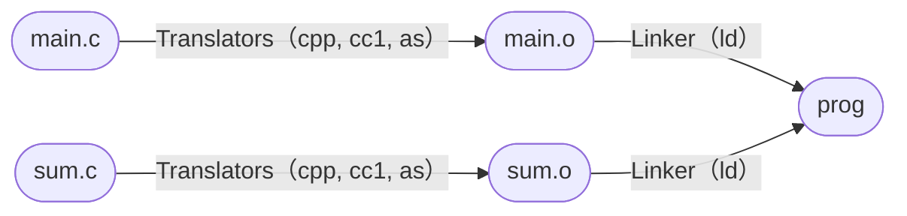
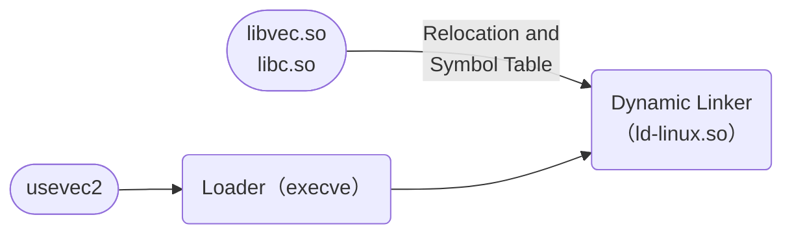

> [!summary] 链接简介
> 链接（linking）是将各种代码和数据片段收集并组合成为一个单一文件的过程，这个文件可被加载（复制）到内存并执行。在早期的计算时代，链接是手动完成的——程序员需要人工记录并拼接程序的不同部分。现代的链接器代替了这一繁琐的手动过程，自动地将目标文件和库文件组合成一个可执行文件。

链接器在编译器之后运行，将编译器生成的目标文件与所需的库文件组合，生成最终的可执行文件。理解链接不仅有助于构建大型程序，还能帮助你：

- **避免危险的编程错误**：理解链接器解析符号的规则，可以预防因符号冲突导致的微妙错误
- **理解变量的作用域**：理解为什么局部和全局变量在链接层面有不同的可见性
- **利用共享库**：理解如何利用动态链接来节省内存和磁盘空间
- **提升程序性能**：理解位置无关代码和懒绑定机制如何影响程序启动和执行效率

---

# 第一部分 编译与链接基础

## 7.1 编译器驱动程序

考虑下列两份源代码文件：

```c title="main.c"
int sum(int *a, int n);

int array[2] = {1, 2};

int main() {
    int val = sum(array, 2);
    return val;
}
```

```c title="sum.c"
int sum(int *a, int n) {
    int s = 0;
    for (int i = 0; i < n; i++) {
        s += a[i];
    }
    return s;
}
```

使用 GCC 编译器驱动程序编译和链接这两个源文件：

```bash frame = "none" showLineNumbers = false
gcc -Og -o prog main.c sum.c
```

驱动程序内部的处理流程：



也可以手动拆解各步骤来具体了解链接器的工作原理：

```bash frame = "none"
cpp -o main.i main.c           # C 预处理器
cc1 -S -o main.s main.i       # C 编译器（生成汇编）
as -o main.o main.s            # 汇编器（生成目标文件）
ld -static -o prog main.o sum.o [系统目标文件和参数]  # 链接器
```

其中 `main.o` 称为**可重定位目标文件**（relocatable object file），`prog` 称为**可执行目标文件**（executable object file）。运行 `./prog` 后，可通过 `echo $?` 查看程序的返回值。

> [!note] 系统目标文件和参数
> 主要是c runtime（CRT）目标文件和 C 标准库。如`crt1.o`、`crti.o`、`crtbeginT.o`等。CRT 目标文件包含了程序的入口点 `_start`，它调用 `main` 函数并处理返回值。

## 7.2 可重定位目标文件

可重定位目标文件是由编译器生成的中间文件，其内容大致分为三部分：

| ELF Header | Sections | Section Header Table |
| :--------: | :------: | :------------------: |

- **ELF Header**：包含文件类型、目标架构、入口点地址等信息（ELF：Executable and Linkable Format）
- **Sections**：包含程序的实际代码和数据
- **Section Header Table**：包含各节的元数据

通过 `readelf -h main.o` 命令可以查看 ELF Header 的内容。

开头部分是**魔数（Magic Number）**，4 字节 `7f 45 4c 46`，对应 DEL 控制符（0x7f）和字符 `ELF`，用于标识这是一个 ELF 文件。

随后的三个字节 `02 01 01` 分别表示：

1. **文件类（File Class，EI_CLASS）**：`0x2` 表示 64 位，`0x1` 表示 32 位
2. **数据编码（Data Encoding，EI_DATA）**：`0x1` 表示小端序，`0x2` 表示大端序
3. **ELF 版本（EI_VERSION）**

> [!caution] 注意
> "文件类（EI_CLASS）"描述地址宽度（32/64 位），与"文件类型（`e_type`）"是 ELF 头中两个不同的字段，后者用于区分 `ET_REL`（可重定位）、`ET_EXEC`（可执行）、`ET_DYN`（共享目标）等，两者不能混淆。

通过 `readelf -S main.o` 命令可以查看 Sections 的内容。以 `main.o` 为例，常见的节包括：

- `.text`：已编译程序的机器代码
- `.data`：已初始化的全局变量和静态变量
- `.bss`：未初始化的全局变量和静态变量，以及被初始化为 `0` 的全局变量和静态变量
- `.rodata`：read-only data，如字符串常量、跳转表等
- `.symtab`：symbol table，包含程序中所有的符号信息
- `.rel.text`：relocation table for .text section，`.text` 节的重定位信息
- `.rel.data`：relocation table for .data section，`.data` 节的重定位信息
- `.debug`：调试信息（现代 ELF 使用 DWARF 格式，存储在 `.debug_*` 节中）
- `.line`：源代码行号信息与 `.text` 节的映射（现代 ELF 中已被 DWARF 的 `.debug_line` 取代）
- `.strtab`：字符串表，包含符号表中符号名的字符串
- `.comment`：编译器版本信息

关于 `.bss`：`.bss` 节的类型是 `SHT_NOBITS`，在目标文件中**不占据任何实际字节**——节头表记录了其运行时所需的大小，但文件内容中不为其分配磁盘空间，其文件偏移量紧跟在 `.data` 之后（而非重叠）。运行时，操作系统在内存中分配对应大小的空间并清零。这种设计的意图是空间效率：未初始化变量不需要在目标文件中占据实际磁盘空间。

> [!info] 为什么未初始化的数据称为.bss
> `.bss` 起源于 1957 年前后 IBM 704 汇编语言中"块存储开始（Block Storage Start）"指令的缩写，沿用至今。一种简单的记忆方法是将其理解为"更好地节省空间（Better Save Space）"。

---

# 第二部分 符号与符号解析

## 7.3 符号和符号表

每个可重定位目标模块 $m$ 都有一个符号表（`.symtab`），包含了模块 $m$ 定义和引用的所有符号信息。在链接器的视角中，符号可分为以下三类：

- **全局符号**（Global symbols）：由模块 $m$ 定义并能被其他模块引用的符号，对应于非静态的 C 函数和全局变量
- **外部符号**（External symbols）：由其他模块定义、被模块 $m$ 引用的符号，对应在其他模块中定义的非静态 C 函数和全局变量
- **局部符号**（Local symbols）：只在模块 $m$ 中定义和引用的符号，对应带 `static` 属性的 C 函数和全局变量；在模块 $m$ 内任何位置可见，但不能被其他模块引用

> [!tip] 注意
> 函数内部的非静态局部变量（即普通的自动变量）在运行时于栈上管理，**不会出现在符号表中**，链接器对它们一无所知。

通过 `readelf -s main.o` 命令可以查看符号表的内容。符号表中的每个条目包含以下关键字段：

- `name`：符号的名称
- `type`：符号的类型（`FUNC` 函数、`OBJECT` 变量、`FILE` 文件名、`SECTION` 节名、`NOTYPE` 未指定）
- `bind`：符号的绑定属性（`LOCAL` 局部、`GLOBAL` 全局）
- `visibility`：符号的可见性（`DEFAULT` 默认、`HIDDEN` 隐藏等）
- `section`：符号所在的节索引（`UND` 表示在当前模块中未定义）

以 `main.o` 的符号表部分内容（8-10）为例：

```bash
Num:       Value       Size Type    Bind   Vis      Ndx Name
  8: 0000000000000000    24 FUNC    GLOBAL DEFAULT    1 main
  9: 0000000000000000     8 OBJECT  GLOBAL DEFAULT    3 array
 10: 0000000000000000     0 NOTYPE  GLOBAL DEFAULT  UND sum
```

三个条目分别代表：

1. **`main`**：全局函数符号，位于 `.text` 节（Ndx=1）中偏移量为 0 处，大小为 24 字节
2. **`array`**：全局变量符号，位于 `.data` 节（Ndx=3）中偏移量为 0 处，大小为 8 字节（两个 `int`，各 4 字节）
3. **`sum`**：外部符号引用，Ndx 列为 `UND`，表示该符号未在当前模块中定义，需要链接器在其他模块中查找

> [!tip] 提醒
> Ndx=1 为 `.text`，Ndx=3 为 `.data`，Ndx=4 为 `.bss`。未初始化或初始化为 0 的变量会被放置在 `.bss` 节中（Ndx=4）。

对于 `static` 局部变量，**编译器**会为其生成唯一名称，防止符号表中的名称冲突。例如同一文件中两个不同函数内的 `static` 变量 `x`，编译器会分别以类似 `x.2254` 和 `x.2255` 的形式输出给汇编器，汇编器将其写入符号表。这一修饰工作由编译器完成，链接器看到的已经是修饰后的名称。

## 7.4 符号解析

符号解析的目标是将每个符号引用与一个唯一的符号定义关联起来。

当编译器遇到当前模块中未定义的符号时，会假设该符号在其他模块中定义，生成符号表条目并交给链接器处理。若链接时仍找不到定义，就会报错：

> [!fail] linkerror.c 声明函数 foo，但未定义它
>
> ```bash frame = "none" showLineNumbers = false
> ❯ gcc -Wall -Og -o linkerror linkerror.c
> /usr/bin/ld.bfd: linkerror.c:(.text+0x5): undefined reference to `foo'
> ```

### 7.4.1 链接器如何解析多重定义的全局符号

编译器向汇编器输出每个全局符号，并将其标记为**强（strong）** 或**弱（weak）**：

- **强符号**：函数和已初始化的全局变量
- **弱符号**：未初始化的全局变量

链接器依据以下规则处理多重定义：

1. **多个强符号**：不允许存在多个同名强符号，链接器报错
2. **多个弱符号**：存在多个同名弱符号时，链接器任选其中一个
3. **一强多弱**：一个强符号和多个弱符号同名时，链接器选择强符号

> [!danger] 弱符号的陷阱
> 规则 2 和 3 往往导致难以发现的错误——同名弱符号在不同源文件中类型不一致，或强符号意外覆盖了第三方库中的弱符号变量，都可能在运行时引发段错误等异常，而链接器不会给出任何警告。

### 7.4.2 与静态库的链接

静态库（`.a` 文件，即 archive 文件）是一组连接起来的可重定位目标文件的集合，配有一个头部描述每个成员目标文件的大小和位置。以 ISO C 标准库为例，`atoi`、`printf`、`scanf`、`strcpy` 等函数都打包在 `libc.a` 中，可通过 `ar -x libc.a` “_解压_” 其成员目标文件。

链接时，链接器只复制被程序引用的目标模块，减少了可执行文件在磁盘和内存中的大小。

构建和使用自定义静态库的流程：

```bash frame = "none"
gcc -c addvec.c multivec.c          # 编译生成目标文件
ar rcs libvec.a addvec.o multivec.o # 打包成静态库
gcc -c usevec.c
gcc -static -o usevec usevec.o ./libvec.a  # 静态链接
```

### 7.4.3 链接器如何使用静态库解析引用

链接器**从左到右**按命令行顺序扫描可重定位目标文件和存档文件，维护三个集合：

- **E**：将被合并到最终可执行文件中的目标文件集合
- **U**：已被引用但尚未定义的符号集合
- **D**：已定义符号的集合

对每个输入文件：

- 若是目标文件，将其加入 E，更新 U 和 D
- 若是存档文件，尝试用其成员解析 U 中的未定义符号，匹配的成员加入 E，其余丢弃。

扫描完毕后若 U 非空，链接器报错。

这导致了一个重要的实践问题：**命令行上库的顺序至关重要**。若库出现在引用它的目标文件之前，引用无法被解析：

> [!fail] libvec.a 出现在 usevec.o 之前，链接时 U 为空，addvec 未被加入 E
>
> ```bash frame = "none" showLineNumbers = false
> ❯ gcc -static -o usevec ./libvec.a usevec.o
> /usr/bin/ld.bfd: usevec.o: undefined reference to `addvec'
> ```

一般准则：**将库文件放在命令行的末尾**。若存在循环依赖（如 `libx.a` 和 `liby.a` 互相引用），可在命令行上重复列出：

```bash frame = "none" showLineNumbers = false
gcc foo.o libx.a liby.a libx.a
```

当然，合理地设计库的依赖关系，避免循环依赖是更好的做法。

---

# 第三部分 重定位

## 7.5 重定位

符号解析完成后，链接器知道了所有输入模块中代码节和数据节的确切大小，可以开始重定位步骤。重定位由两步组成：

1. **重定位节和符号定义**：合并相同类型的节，为每个符号分配运行时地址
2. **重定位节中的符号引用**：修改代码节和数据节中的符号引用，使其指向正确的运行时地址

### 7.5.1 重定位条目

汇编器在生成目标文件时不知道符号的最终地址，会为每个符号引用生成一个**重定位条目**（relocation entry），指导链接器在链接时修改引用。代码的重定位条目放在 `.rel.text` 节中，数据的放在 `.rel.data` 节中。

重定位条目的结构：

```c
typedef struct {
    long offset;    /* 被修改的引用在节内的偏移量 */
    long type:32,   /* 重定位类型 */
         symbol:32; /* 符号表索引，指定被引用的符号 */
    long addend;    /* 用于修正偏移计算的有符号常数 */
} Elf64_Rela;
```

最重要的两种重定位类型：

- `R_X86_64_PC32`：PC 相对地址重定位，用于函数调用
- `R_X86_64_32`：绝对地址重定位，用于全局变量引用

> [!note] 新版 GCC 的变化
> 在较新版本的 GCC 中，`R_X86_64_PC32` 一般被替换为 `R_X86_64_PLT32`，后者通过 PLT（过程链接表）间接调用——这将在[动态链接](#78-动态链接共享库)一节中详细讨论。

### 7.5.2 重定位节和符号定义

第一步是合并相同类型的节并为每个符号分配运行时地址。以 `main.c` 和 `sum.c` 为例，链接器将两个模块的 `.text` 节合并、`.data` 节合并，形成单一的节，然后为每个节和每个符号分配运行时内存地址。此时，程序中每条指令和每个全局变量都有了唯一的运行时地址。

### 7.5.3 重定位节中的符号引用

第二步是修改代码节和数据节中对每个符号的引用，使其指向正确的运行时地址。用 `objdump -d main.o` 可以看到 `main.o` 中待重定位的引用：

```asm
0000000000000000 <main>:
   0:   48 83 ec 08             sub    $0x8,%rsp
   4:   be 02 00 00 00          mov    $0x2,%esi
   9:   bf 00 00 00 00          mov    $0x0,%edi        # %edi = &array
                        a: R_X86_64_32  array           # 重定位条目
   e:   e8 00 00 00 00          call   13 <main+0x13>   # sum()
                        f: R_X86_64_PC32       sum-0x4  # 重定位条目
  13:   48 83 c4 08             add    $0x8,%rsp
  17:   c3                      ret
```

对 `array` 和 `sum` 的引用都是全零占位符，链接器根据重定位条目和已分配的地址填充它们。

#### 相对地址重定位

以对 `sum` 的调用为例，重定位条目各字段：

- `r.offset = 0xf`，`r.symbol = sum`，`r.type = R_X86_64_PC32`，`r.addend = -4`

设 `ADDR(main) = 0x4004d0`，`ADDR(sum) = 0x4004e8`，则引用的运行时地址：

$$
\mathrm{ref\_addr} = \mathrm{ADDR(main)} + r.\mathrm{offset} = \text{0x4004d0} + \text{0xf} = \text{0x4004df}
$$

链接器修改该引用为：

$$
*\mathrm{ref\_addr} = \mathrm{ADDR(sum)} + r.\mathrm{addend} - \mathrm{ref\_addr} = \text{0x4004e8} + (-4) - \text{0x4004df} = \text{0x5}
$$

最终指令变为：

```asm
4004de: e8 05 00 00 00       call   4004e8 <sum>
```

CPU 执行该 `call` 指令时，当CPU执行这条`call`指令时，PC的值（即下一条指令的地址`0x4004e3`）将：

1. 被压入栈中（作为返回地址）
2. 加上偏移量`0x5`，得到`0x4004e8`，跳转到`sum`函数的入口

#### 绝对地址重定位

以对全局变量 `array` 的引用为例，重定位条目各字段：

- `r.offset = 0xa`，`r.symbol = array`，`r.type = R_X86_64_32`，`r.addend = 0`

设 `ADDR(array) = 0x601018`，链接器直接填入绝对地址：

$$*\mathrm{ref\_addr} = \mathrm{ADDR(array)} + r.\mathrm{addend} = \text{0x601018} + 0 = \text{0x601018}$$

最终指令变为：

```asm showLineNumbers = false
4004d9: bf 18 10 60 00       mov    $0x601018,%edi
```

> [!tip] 小端序
> x86-64 采用小端序，`0x601018` 在内存中的字节序列为 `18 10 60 00`，因此机器码为 `bf 18 10 60 00`。

综合以上两步，链接器完成了对所有符号引用的重定位。加载器将节中的字节直接复制到内存后，无需任何修改即可执行。

---

# 第四部分 可执行文件与加载

## 7.6 可执行目标文件

可执行目标文件与可重定位目标文件结构相似，但有几个关键特征：

- 完全链接，不再包含 `.rel` 节（所有重定位已完成）
- 包含**入口点**（entry point）：程序运行时第一条指令的地址
- 包含**程序头部表**（Program Header Table）：描述如何将文件的连续片（chunk）映射到内存段

文件内容按段（segment）组织：

**代码段（Read only）**：ELF Header、程序头部表、`.init`（程序初始化代码，包含 `_init` 函数）、`.text`、`.rodata`

**数据段（Read/Write）**：`.data`（已初始化全局变量）、`.bss`（未初始化全局变量，运行时初始化为 0）

**不加载到内存的部分**：`.symtab`、`.debug_*`、`.strtab`、Section Header Table 等

程序头部表示例（由 `objdump -p` 显示）：

```bash frame = "none" showLineNumbers = false
Read-only code segment
LOAD off    0x0000000000000000 vaddr 0x0000000000400000 align 2**21
     filesz 0x000000000000069c memsz 0x000000000000069c flags r-x
Read/write data segment
     off    0x0000000000000df8 vaddr 0x0000000000600df8 align 2**21
     filesz 0x0000000000000228 memsz 0x0000000000000230 flags rw-
```

- off: 目标文件中的偏移
- vaddr/paddr: 内存地址
- align: 对齐要求
- filesz: 目标文件中的段大小；
- memsz: 内存中的段大小
- flags: 运行时访问权限。按照顺序
  - r: 可读
  - w: 可写
  - x: 可执行

数据段的 `memsz`（0x230）比 `filesz`（0x228）大 8 字节，多出的部分正是 `.bss` 节——它在文件中不占空间，但运行时需要在内存中分配。

对于任何段 s，链接器选择的起始地址 `vaddr` 必须满足：

$$\mathrm{vaddr} \equiv \mathrm{off} \pmod{\mathrm{align}}$$

这种对齐优化了内存写入的效率。

## 7.7 加载可执行文件

执行 `./prog` 时，shell 通过调用 `execve` 函数调用**加载器（loader）**。加载器将可执行目标文件中的代码和数据从磁盘复制到内存，然后跳转到程序入口点运行。这个过程称为**加载（loading）**。

加载后的 Linux x86-64 进程内存映像大致如下：

| 内存区域                              | 说明                                        |
| :------------------------------------ | :------------------------------------------ |
| 内核内存（Kernel Memory）             | 地址 $\ge 2^{48}$，用户态不可见             |
| 用户栈（User Stack）                  | 从 $2^{48}-1$ 向低地址增长，`%rsp` 指向栈顶 |
| 共享库的内存映射区域                  | 用于映射共享库                              |
| 运行时堆（Heap）                      | 通过 `malloc` 向上增长，`%brk` 指向堆顶     |
| 数据段（`.data`、`.bss`）             | 读/写                                       |
| 代码段（`.init`、`.text`、`.rodata`） | 只读，起始地址 0x400000                     |

> [!ATTENTION] 地址空间布局随机化（ASLR）
> 上图是简化示意图。实际上操作系统在分配栈、共享库和堆的运行时地址时会使用 ASLR——每次运行这些区域的绝对地址都会改变，但相对位置保持不变，以增加安全性（见[第三章缓冲区溢出防护一节](/posts/程序的机器级表示.md#36-缓冲区溢出)）。

加载器运行时：

1. 创建上图所示的内存映像
2. 在程序头部表引导下，将可执行文件的片复制到代码段和数据段
3. 跳转到入口点 `_start` 函数（定义在系统目标文件 `crt1.o` 中，对所有 C 程序都一样）
4. `_start` 调用系统启动函数 `__libc_start_main`（定义在 `libc.so` 中），后者初始化执行环境、调用用户层 `main` 函数、处理返回值并在需要时将控制返回内核

---

# 第五部分 动态链接

## 7.8 动态链接共享库

静态库有两个问题：其一，静态库的代码被复制到每个可执行文件中，导致磁盘和内存的浪费；其二，如果静态库有 bug 或需要升级，所有使用该库的可执行文件都需要重新编译和链接。

**动态链接共享库**（shared library，Linux 下以 `.so` 后缀表示，Windows 下称为 Dynamic Link Library, DLL）解决了这两个问题。共享库是一个目标模块，可以在运行时或加载时加载到任意内存地址，并和内存中的程序链接。这个过程称为**动态链接（dynamic linking）**，由**动态链接器（dynamic linker）** 执行。

共享库"共享"的含义有两层：首先，一份共享库的磁盘文件可以被多个程序引用；更重要的是，在运行时，多个进程可以**共享同一份共享库的物理内存页**。共享库的代码段（只读）在物理内存中只需存在一份，通过各进程的页表映射到各自的虚拟地址空间——这正是为什么生成共享库时必须使用位置无关代码（见 [§7.10](#710-位置无关代码)），代码需要能够在不同进程中映射到不同虚拟地址的同一物理页上正确运行。每个进程各自维护私有的数据副本（如 GOT），由动态链接器按各自的地址空间填入正确的地址。

编译和使用共享库：

```bash frame = "none" showLineNumbers = false
# 生成共享库（-fpic：位置无关代码；-shared：生成共享目标文件）
gcc -shared -fpic -o libvec.so addvec.c multivec.c

# 链接到共享库（不使用 -static）
gcc -o usevec2 usevec.c ./libvec.so
```



运行 `usevec2` 时的加载过程：

1. 加载器发现可执行文件中存在 `.interp` 节（包含动态链接器路径，如 `/lib64/ld-linux-x86-64.so.2`）
2. 加载器将可执行文件和动态链接器 `ld-linux.so` 一同加载到内存
3. 动态链接器完成重定位：将 `libc.so` 和 `libvec.so` 的代码和数据分别映射到内存段，重定位可执行文件中所有对共享库符号的引用
4. 将控制权传递给应用程序

> [!note] 注
> `.interp` 节是动态链接可执行文件的特征之一，不出现在可重定位目标文件（`.o` 文件）中。

## 7.9 从应用程序中加载和链接共享库

应用程序也可以在运行时主动加载共享库，无需在编译时链接。这通过 `<dlfcn.h>` 中的函数实现：

```c
#include <dlfcn.h>

void *dlopen(const char *filename, int flag);  /* 加载共享库，返回句柄 */
void *dlsym(void *handle, const char *symbol); /* 根据符号名获取地址 */
int  dlclose(void *handle);                    /* 卸载共享库 */
```

参数 `flag` 可以是 `RTLD_LAZY`（延迟绑定，首次调用时才解析符号）或 `RTLD_NOW`（立即绑定，加载时即解析所有符号）。

使用示例：

```c
void *handle = dlopen("./libvec.so", RTLD_LAZY);
void (*addvec)(int *, int *, int *, int) = dlsym(handle, "addvec");
addvec(x, y, z, 2);
dlclose(handle);
```

编译时需要链接 `libdl` 库：`gcc -o prog prog.c -ldl`

这一机制的典型应用场景：

- 分发软件更新（用新版 `.so` 替换旧版，下次运行时自动加载）
- 高性能 Web 服务器（将生成动态内容的函数打包成共享库，按需动态加载，避免 `fork`/`execve` 的开销）。

## 7.10 位置无关代码

加载器将共享库加载到内存时，具体地址由运行时决定，可能每次都不同。为使共享库能在任意地址正确运行，编译器需要生成**位置无关代码（Position Independent Code，PIC）**，用 `-fpic` 选项指定。

### 7.10.1 PIC 数据引用

PIC 的核心思想是：同一目标模块内，代码段与数据段之间的相对距离在编译时已确定，加载到任意地址后这个距离不变。

编译器利用这一特性，在数据段开头生成**全局偏移表（Global Offset Table，GOT）**。GOT 中每个被该模块引用的全局数据目标（全局变量或外部函数）各有一个 8 字节条目；动态链接器在加载时将正确的绝对地址填入各条目。

PIC 代码通过 GOT 间接访问全局变量，**代码段本身不包含任何绝对地址**，因此代码段的物理内存页可以被多个进程共享，每个进程持有各自私有的 GOT 副本。

### 7.10.2 PIC 函数调用与懒绑定

如果所有外部函数的地址都在加载时解析，程序启动时会因大量符号解析而产生明显开销。**懒绑定（lazy binding）**的策略是：等到函数**第一次被实际调用**时，才去解析它的地址。

懒绑定通过两种数据结构协同实现：

- **过程链接表（Procedure Linkage Table，PLT）**：代码段中的可执行指令片段，每个被调用的外部函数对应一个 PLT 条目
- **全局偏移表（GOT）**：数据段中的地址表，每个外部函数对应一个 GOT 条目

PLT 的结构（以 `addvec` 调用为例）：

```asm
PLT[0]:                           # 动态链接器"蹦床"（所有函数共用）
    pushq *GOT[1]                 # 压入动态链接器的模块 ID
    jmp   *GOT[2]                 # 跳转到动态链接器入口

PLT[addvec]:                      # addvec 的专属 PLT 条目
    jmp   *GOT[addvec]            # ① 通过 GOT 间接跳转
    pushq $addvec_reloc_index     # ② 压入 addvec 的重定位索引
    jmp   PLT[0]                  # ③ 转交动态链接器处理
```

**第一次调用 `addvec`**（GOT 条目尚未填充真实地址）：

1. `call addvec` 实际跳转到 `PLT[addvec]`
2. `jmp *GOT[addvec]`：此时 GOT 条目中存放的是 ② 处地址，跳回 PLT 条目继续执行
3. 压入重定位索引，跳转到动态链接器蹦床 `PLT[0]`
4. 动态链接器查找 `addvec` 的真实地址，**将其写入 `GOT[addvec]`**，然后跳转到 `addvec` 执行

**后续调用 `addvec`**（GOT 条目已填充真实地址）：

1. `call addvec` 跳转到 `PLT[addvec]`
2. `jmp *GOT[addvec]`：GOT 中已有真实地址，**直接跳转到 `addvec`**，全程只多一次间接跳转的开销，动态链接器不再介入

这种机制大大减少了不必要的符号解析，程序启动时间也因此显著缩短。

---

# 第六部分 工具与库打桩

## 7.11 库打桩机制

Linux 链接器支持**库打桩（library interpositioning）** 技术：截获对共享库函数的调用，转而执行自己的包装函数。基本思路是给定目标函数，创建一个与之原型完全一致的包装函数，通过打桩机制让系统调用包装函数而不是目标函数。包装函数通常执行自己的逻辑，再调用原目标函数并传递其返回值。

打桩有三种方式，灵活性依次递增：

- **编译时打桩**：通过 `-I` 选项优先使用自定义头文件，将宏定义替换函数调用。例如在自定义 `malloc.h` 中写 `#define malloc(size) mymalloc(size)`，编译时用 `-I.` 使其优先于系统头文件被包含，所有对 `malloc` 的调用就变成了对 `mymalloc` 的调用。

- **链接时打桩**：用 `--wrap f` 选项告诉链接器将对函数 `f` 的调用替换为对包装函数 `__wrap_f` 的调用，用 `__real_f` 调用原始函数。通过 `-Wl,--wrap,malloc` 将此选项传递给链接器（`-Wl,option` 中的逗号会被替换为空格）。

- **运行时打桩**：通过设置环境变量 `LD_PRELOAD`，动态链接器会优先加载其指向的共享库。例如：

  ```bash frame = "none" showLineNumbers = false
  LD_PRELOAD=./libmymalloc.so ./myprogram
  ```

  这样对 `malloc` 的调用会先命中 `libmymalloc.so` 中的包装函数。运行时打桩最灵活，无需修改源代码或重新编译，也适用于已发布的二进制程序。

## 7.12 处理目标文件的工具

GNU binutils 包提供了一组处理 ELF 目标文件的工具：

| 工具      | 功能                                                          |
| --------- | ------------------------------------------------------------- |
| `ar`      | 创建静态库，插入、删除、列出和提取成员                        |
| `strings` | 列出目标文件中所有可打印的字符串                              |
| `strip`   | 从目标文件中删除符号表信息                                    |
| `nm`      | 列出目标文件符号表中定义的符号                                |
| `size`    | 列出目标文件中各节的名字和大小                                |
| `readelf` | 显示目标文件的完整 ELF 结构，集成了 `size` 和 `nm` 的功能     |
| `objdump` | 所有二进制工具之母；最大用途是反汇编 `.text` 节中的二进制指令 |

与共享库相关的工具：

| 工具         | 功能                                               |
| ------------ | -------------------------------------------------- |
| `ldd`        | 列出可执行文件运行时所需的共享库及其路径           |
| `LD_PRELOAD` | 环境变量，运行时优先加载指定共享库（常用于库打桩） |
